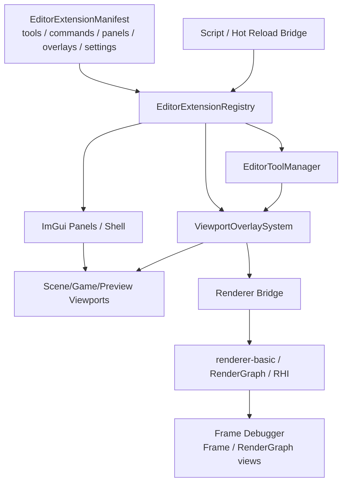

# Editor Extension Architecture

更新日期：2026-06-02

本文定义 Asharia Editor 的工具、插件、viewport overlay 和脚本热更新边界。它补充
`docs/architecture/editor.md` 和 `docs/architecture/editor-ui-scripting.md`：前者描述当前 `apps/editor`
事实，后者描述脚本不能直接拥有 ImGui/Vulkan 生命周期；本文描述后续 editor 工具架构应该如何演进。

## 背景

当前 editor 已经有 `EditorToolRegistry`、action/panel/workspace registry、Scene View overlay strip、
Live RG View 和 FrameDebuggerPanel 内的 Frame/RenderGraph views。问题是这些能力仍然偏硬编码：

- 工具贡献目前主要是 C++ struct，缺少 manifest / extension point 层。
- Scene View overlay strip 直接把 tool overlay id 映射到 `EditorViewportOverlayFlags`。
- Grid、gizmo、selection outline 还没有统一的 provider / render bridge。
- Frame Debugger 和 RG View 还在补 pass/event 选择、graph view、preview/replay 体验。
- 脚本热更新边界还没有和工具、overlay、layout、renderer pass 明确分离。

因此现在不应先实现 Grid pass。Grid 应该作为 extension/overlay 架构稳定后的第一个验证案例，而不是继续把
当前临时路径固化到 renderer。

当前推进顺序进一步收紧为：

1. 先冻结 Frame Debug / diagnostics 底层合同：paused-frame、renderer execution event id、RenderGraph
   command-summary 辅助诊断、RenderGraph tab consumption accounting 和未来脚本 safe-point gate。
2. `FrameDebuggerPanel` 只做这些底层合同的最小消费验证，不继续扩展复杂 UI。
3. 完成后再恢复 extension registry、tool lifecycle、viewport overlay provider。
4. Grid 仍然是 provider + renderer bridge 的第一个验证案例，但不是下一步。

## 参考模型

成熟编辑器的共同点不是“所有东西都脚本化”，而是把声明、生命周期、UI、命令、渲染桥分开：

- Unreal Interactive Tools Framework 把 tool、tool builder、tool manager、properties、input behavior 和
  viewport drawing 分开。参考：
  https://dev.epicgames.com/documentation/unreal-engine/API/Runtime/InteractiveToolsFramework/UInteractiveTool
- Unity 把 `EditorTool`、Scene View `Overlay`、`Gizmos` / `Handles` 分开。Overlay 是 editor window 的 UI
  表面，Gizmos/Handles 是 viewport 可视化和交互表面。参考：
  https://docs.unity3d.com/ScriptReference/EditorTools.EditorTool.html
  https://docs.unity3d.com/Manual/overlays.html
  https://docs.unity3d.com/Manual/gizmos-and-handles.html
- Godot 的 `EditorPlugin` / `@tool` 允许插件和脚本扩展 editor，但底层 editor host、viewport 和 renderer
  生命周期仍由引擎控制。参考：
  https://docs.godotengine.org/en/stable/tutorials/plugins/editor/making_plugins.html
  https://docs.godotengine.org/en/stable/classes/class_editornode3dgizmoplugin.html
- VS Code / IntelliJ 使用 contribution points / extension points / action system。插件先声明能力，宿主再在安全点
  加载、路由和卸载。参考：
  https://code.visualstudio.com/api/references/contribution-points
  https://plugins.jetbrains.com/docs/intellij/plugin-extensions.html

Asharia 不直接复制任何一个模型。当前阶段只采纳几个原则：声明先于执行，工具生命周期集中管理，viewport
overlay 分层，脚本只能影响 backend-neutral 数据，renderer/RHI 继续拥有 GPU 生命周期。

## 决策

下一阶段先建立 `Editor Extension / Tool / Viewport Overlay Contract v0`，再做 Grid。



## 所有权

| 模块 | 拥有 | 不拥有 |
| --- | --- | --- |
| `EditorExtensionRegistry` | extension manifest、贡献项版本、启用/禁用状态、reload 诊断 | ImGui draw、Vulkan handle、工具行为实现 |
| `EditorToolManager` | active tool、tool lifecycle、tool property state、input behavior routing | renderer pass、GPU resource、panel window |
| `ViewportOverlaySystem` | overlay 描述、viewport chrome、world overlay provider、render-mode provider | Vulkan command recording、descriptor、transient image |
| `EditorCommand` / transaction | 持久 scene/asset 修改、undo/redo、dirty state | hover、临时 overlay toggle、layout window state |
| Script bridge | manifest reload、脚本 action 调度、数据模型生成、权限检查 | ImGui context、RenderGraph execution、GPU object lifetime |
| Renderer bridge | backend-neutral debug packets 到 renderer-owned RenderView desc 的转换 | editor panel state、脚本 VM、工具 UI |
| `renderer-basic-vulkan` | RenderGraph pass、pipeline、shader、descriptor、Vulkan command recording | editor id、ImGui id、脚本对象 |

## Extension Manifest v0

Manifest 是声明，不是执行代码。第一版可以由 C++ built-in 表达，后续再允许 JSON / script package reload。

```cpp
struct EditorExtensionManifest {
    EditorId extensionId;
    std::string displayName;
    std::vector<EditorCommandContribution> commands;
    std::vector<EditorPanelContribution> panels;
    std::vector<EditorToolContribution> tools;
    std::vector<EditorViewportOverlayContribution> overlays;
    std::vector<EditorWorkspaceContribution> workspaces;
};
```

Rules:

- Contribution id 必须稳定，reload 使用 id 更新或删除贡献项。
- Manifest 只能声明工具、命令、面板、overlay、layout、默认设置。
- Manifest 不包含 raw callback、lambda、ImGui draw 函数或 Vulkan command callback。
- C++ built-in tools 和未来脚本 tools 都通过同一 registry 查询路径暴露给 shell 和 panels。

## Tool Lifecycle v0

工具不应只是 toolbar button。工具需要明确生命周期，以便未来支持 camera navigation、selection、gizmo、
paint/terrain/mesh edit 等交互。

```text
Registered
  -> Available
  -> Activating
  -> Active
  -> Suspending
  -> Inactive
  -> Unregistered
```

每个 tool 定义：

- `toolId`
- label / icon / category
- supported viewport kinds
- input behavior ids
- property model id
- contributed commands
- contributed viewport overlays
- activation policy: persistent, modal, one-shot
- activation viewport ids

Rules:

- 同一 viewport 一次只有一个 primary active tool，但可以有多个 passive overlay provider。
- 只有声明了 activation policy 和匹配 activation viewport id 的 tool 才能成为该 viewport 的 primary active tool。
- 工具 property 是 editor state，不是 scene serialization。
- 工具对 scene/asset 的持久修改必须通过 command/transaction。
- 工具 input 从 `EditorInputRouter` 的 snapshot 消费，不直接读 GLFW/ImGui global state。

## Viewport Overlay 分层

Overlay 必须拆成三类，避免 UI 按钮、world debug draw 和 render mode 混在一个 flag 里。

| 类型 | 例子 | 所属 | 输出 |
| --- | --- | --- | --- |
| Chrome overlay | Scene View 顶部 Grid/Gizmo/Select 按钮、camera mode dropdown | editor panel / overlay system | ImGui widgets |
| World overlay | grid lines、gizmo axes、selection outline、debug labels | overlay provider / tool manager | backend-neutral draw packets |
| Render mode overlay | wireframe、overdraw、normal view、lighting debug | renderer view policy | RenderView / RenderGraph options |

Rules:

- Chrome overlay 可以热更新 layout、label、默认开关，但不直接决定 renderer pass。
- World overlay provider 输出数据包，例如 lines、points、text、bounds、selection ids。
- Render mode overlay 是 renderer policy，不应由 panel 直接拼 Vulkan 或 shader state。
- Game View 不隐式接收 Scene View authoring overlay；Game View debug overlay 必须显式 opt-in。

## Backend-Neutral Draw Packets

World overlay provider 不提交 Vulkan command。它只产生数据：

```cpp
struct EditorDebugLine {
    Vec3 start;
    Vec3 end;
    ColorSrgba8 color;
    float width;
};

struct EditorViewportOverlayPacket {
    EditorId overlayId;
    EditorViewportKind viewportKind;
    std::vector<EditorDebugLine> lines;
    // future: points, text labels, bounds, selection ids
};
```

Renderer bridge 负责把 packet 转成 renderer-owned `BasicRenderViewOverlayDesc` 或后续更稳定的
`RenderViewDebugOverlayDesc`。这个转换层是编辑器和 renderer 的唯一接触点。

## Hot Reload Boundary

可以热更新：

- extension manifest
- command/menu/toolbar/overlay 声明
- layout preset
- tool property defaults
- overlay style 参数，例如 grid spacing、major interval、range、fade、颜色
- 生成 backend-neutral debug packets 的脚本逻辑
- declarative panel model

不可以热更新或脚本直接拥有：

- ImGui context、dockspace、draw list、`ImTextureID`
- GLFW callback
- Vulkan image/view/sampler/descriptor/pipeline/command buffer
- RenderGraph pass execution callback
- transient resource allocation / aliasing / barrier planning
- Frame Debug replay/copy 的 GPU resource access
- 持久 scene/asset mutation，除非通过 command/transaction

Reload 流程：

```text
freeze new script actions
finish or rollback active transactions
load and validate new manifests
diff contribution ids
disable removed contributions
update changed descriptors
preserve C++ panel/tool state where ids still match
publish diagnostics
resume actions
```

Reload 失败时保留上一版有效 manifest，并显示 diagnostics。失败不能重建 ImGui/Vulkan backend，也不能丢失
viewport texture lifetime 状态。

## Frame Debugger Views / Live RG View 集成

Frame Debugger 和 RG View 不是可选后补 UI。它们是 overlay/render architecture 的验证工具。

要求：

- 每个 renderer-owned overlay pass 在 diagnostics snapshot 中有稳定 pass name/type。
- Debug packet count、source overlay id、view kind 应进入 diagnostics。
- Frame Debug pause 必须暂停被调试 world 的 frame advance、game/script update 和新 RenderView recording；只有
  editor shell、Frame Debug UI、Frame Debug replay/copy 和必要的 diagnostics UI 继续运行。当前通过
  `EditorInspectedWorldScheduler` 的 counter-based seam 验证 safe point gate；真实脚本 VM 接入后不能在 paused
  capture 上继续推进被调试世界。
- Live RG View 是独立 diagnostics panel，读取最新 compiled snapshot，不需要 Frame Debug capture。
- Frame Debug 的 Frame view 和 RenderGraph view 是 `FrameDebuggerPanel` 里的两个切换视图，不是两个并排 panel。
- Frame Debug 默认视图采用 Unity Frame Debugger 风格：左侧 pass/execution-event 列表，右侧显示选中 event 的
  resource access、状态、预览图像和后续 draw-call 详情。RenderGraph command summary 只作为来源说明和 RG View
  辅助诊断。
- RenderGraph view 作为同一个面板里的 tab/view，读取 frozen capture snapshot。
- Pass graph node view 完成前，不应引入大量新 overlay pass 类型。

Grid 的验收条件不是“看起来有线”，而是：

- Scene View grid enabled 时 diagnostics 里出现 `builtin.render-view-world-grid`。
- 只有存在 debug world-line 数据时 diagnostics 里才出现 `builtin.render-view-overlay`。
- Grid disabled 时 pass 不进入 graph，或者 active predicate 为 false 且 diagnostics 可解释。
- Game View / Preview 不隐式出现 Scene View grid pass。

## Grid 的新位置

Grid 从 “next renderer feature” 调整为 “extension architecture sample”：

1. `EditorViewportOverlayProvider` v0 已落地。
2. Grid provider 读取 manifest/default settings，生成 renderer-owned world-grid intent。
3. Renderer bridge 把 world-grid intent 交给 renderer-owned fullscreen world-grid pass；debug line packets 仍走
   overlay line path。
4. Frame Debugger Frame/RenderGraph views 验证 grid pass、debug line pass 和 packet count。
5. Scene View chrome overlay 只控制 provider enabled state，不直接操作 renderer flags。

当前状态：

- Scene View grid intent 已经通过 `BasicRenderViewOverlayDesc::worldGrid` 进入 renderer-owned
  `builtin.render-view-world-grid` fullscreen pass；`EditorViewportOverlayProvider` v0 当前不再为默认 grid 生成固定
  XZ line packet。
- Scene View panel 已持有 editor-owned navigation/camera state；这是输入所有权，不是 renderer 矩阵旁路。
  Scene View request 携带 camera context，并在 coordinator 边界 bridge 到 `BasicRenderViewCamera`；
  provider context 可以读取 camera/view/projection 数据；`unprojectEditorViewportPoint()` 已提供 viewport-local
  pixel 到 near/far world ray 的后端无关 v0 语义，并基于 inverse view-projection 而不是单独重推 camera basis。
- `EditorViewportCoordinator` 只负责把 provider packet bridge 成 `BasicDebugWorldLine` 并交给
  `BasicRenderViewOverlayDesc`；没有 debug line packet 时不会生成空 overlay pass。
- `EditorViewportCoordinator` 会把有效 Scene/debug overlay flags 和 provider packets 的稳定 id 汇总为
  `BasicRenderViewOverlayDesc::sourceOverlayIds`；`renderer_basic_vulkan` 只把这些 id 复制进 diagnostics，Frame
  Debug / smoke 可用它解释 pass 来源，但 RenderGraph、RHI 和 Vulkan pass 不理解 editor id。
- `renderer_basic_vulkan` 已在 `builtin.render-view-overlay` pass 内消费 `BasicDebugWorldLine`，用
  renderer-owned debug-line shader/pipeline 和 per-frame vertex upload buffer ring 绘制 world lines；Frame Debug
  execution events 会记录 `DrawDebugWorldLines`。
- 这一步证明 provider contract、editor-to-RenderView 数据桥、camera/unproject 基础、diagnostics count 和
  renderer-owned debug-line GPU path。它还不是 external manifest-backed provider；grid spacing、major spacing、fade
  和 opacity 已从 editor user settings 进入 RenderView，且 Scene grid overlay contribution 已声明 built-in 默认值；
  built-in tool contribution 已先经过 `EditorExtensionRegistry` v0 再发布给 `EditorToolRegistry`；grid color、外部
  manifest loader、设置 UI 和热更新仍待补齐；camera-aware grid spacing、无默认距离淡出、高视角 readback 和
  world-grid/source overlay diagnostics 已有最小闭环。

## 迁移计划

### Step 1: Contract Documentation

Status: current.

- 添加本文。
- 把 Grid 从立即实现改为 extension architecture sample。
- 明确脚本热更新边界。

### Step 2: Built-in Extension Registry

Status: current / partial.

把现有 `EditorToolRegistry` 演进成 built-in extension contribution reader：

- 已新增 `EditorExtensionRegistry`，当前拥有 built-in extension manifest 的 stable id、display name 和 tool
  contributions。
- built-in tools 已通过 manifest-like descriptors 进入 `EditorExtensionRegistry`，再发布给 `EditorToolRegistry` query
  facade；panel/action factory 与 callback 仍由现有 registries 显式注册，不进入 manifest 执行路径。
- smoke 验证 extension stable id、reload-style replace、重复 tool id 拒绝、失败 reload 不改变旧状态，以及 tool
  contributions 可 all-or-nothing 发布到 `EditorToolRegistry`。
- 未完成：外部 JSON/script manifest loader、extension enable/disable、panel/action manifest 化、reload diagnostics UI
  和热更新。

### Step 3: Tool Manager v0

Status: current / partial.

- 已新增 `EditorToolManager`，由 `EditorAppServices` 拥有，并在 built-in tools 发布到 `EditorToolRegistry` 后同步。
- 已支持 per-viewport primary active tool、`Available -> Activating -> Active -> Suspending -> Inactive`
  生命周期、reload 后 missing tool 的 `Unregistered` 状态，以及 begin/complete 成对的 activate/deactivate 断言。
- `EditorToolDesc` 已声明 activation policy 和 activation viewport ids；当前只有 Scene View tool 可激活到
  `scene-view`，Frame Debugger 等 diagnostics tool 只贡献 panel/action，不会被 primary viewport activation 接收。
- startup registration smoke 验证工具同步、未知 tool 拒绝、同一 viewport 切换时旧工具失活、layout reset 不丢失 active tool
  和未经过 suspending 的 deactivation 拒绝，并验证非 viewport tool 不能被激活到 Scene View。
- 未完成：Scene View overlay strip 读取 active/passive tool state、tool property model、input behavior routing、
  selection/gizmo mutation 和外部 manifest reload 后的 UI diagnostics。

### Step 4: Viewport Overlay Provider v0

Status: current.

- 已拆出 `EditorViewportOverlayProvider` v0。
- Scene View grid toggle 通过 `EditorViewportOverlayFlags` 控制 provider enabled state；gizmo/selection-outline 仍是
  后续 provider/tool intent。
- 默认 grid 不再由 provider 输出固定原点 `scene.grid` debug-line packet；Scene View grid flag 进入
  renderer-owned world-grid intent，provider packet route 只保留给后续 debug/world-line overlay。

### Step 5: Debug Line Renderer Bridge

- Done: `EditorViewportCoordinator` 从 overlay packets 构造 `BasicRenderViewOverlayDesc`。
- Done: `renderer_basic_vulkan` 在 `builtin.render-view-overlay` pass 内增加可见 debug-line line-list draw。
- Done: Frame Debug / sample smoke 验证 pass、packet count 和 `DrawDebugWorldLines` execution event。
- Done: world-grid desc 和 source overlay id 进入 diagnostics，方便 Frame Debug replay 使用 captured grid 参数，并让多个
  provider/debug packet 可溯源；renderer 只复制 caller-owned id，不把 editor id 解释为 graph/pass 语义。

### Step 6: Grid Sample

- 默认 Scene View grid 已改为 renderer-owned fullscreen world-grid pass，不再回退到 camera-aware XZ grid line
  packets。
- Grid spacing、major spacing、fade 和 opacity 来自 editor user settings，并通过 Scene View request 进入
  renderer-owned world-grid intent；Scene grid overlay contribution 声明同一份 built-in 默认值，settings bootstrap
  使用该默认值处理新文件和旧文件迁移；built-in Scene View tool/overlay contribution 已先经过
  `EditorExtensionRegistry` v0；Editor Settings 已提供左侧目录/右侧内容的 grid settings v0，external manifest
  loader 和热更新仍是后续工作。
- 当前 world-grid LOD 由 RenderView policy 只按 camera 到 grid plane 的垂直距离计算，再通过 `GridLodSettings`
  交给 shader；低高度锁定 base spacing，且低高度远水平距离不会改变 LOD，拉高后才在 1/2/5/10 spacing
  间整帧平滑切换。默认不做距离淡出，高视角 readback smoke 覆盖网格不会像 depth fog 一样消失。下一步是 external manifest loader 和热更新，而不是继续把 Vulkan
  绘制细节推回 editor。

## 非目标

- 不在当前阶段做完整 C# / Lua editor plugin ABI。
- 不让脚本直接画 ImGui immediate-mode UI。
- 不让脚本直接创建 RenderGraph pass 或 Vulkan pipeline。
- 不做完整 asset browser、inspector、transaction editor。
- 不把 `apps/editor` 立刻拆成多个 editor packages。
- 不因为 Grid 需要线条就直接把 line renderer 做成全局 debug system。

## 验证

文档和架构阶段：

```powershell
powershell -ExecutionPolicy Bypass -File tools\check-text-encoding.ps1
powershell -ExecutionPolicy Bypass -File tools\check-doc-sync.ps1
git diff --check
```

后续代码阶段：

```powershell
cmd /c "build\conan\clangcl-debug\Debug\generators\conanbuild.bat && cmake --preset clangcl-debug && cmake --build --preset clangcl-debug"
cmd /c "build\conan\msvc-debug\Debug\generators\conanbuild.bat && cmake --preset msvc-debug && cmake --build --preset msvc-debug"
build\cmake\clangcl-debug\apps\editor\asharia-editor.exe --smoke-editor-shell
build\cmake\clangcl-debug\apps\editor\asharia-editor.exe --smoke-editor-viewport
build\cmake\clangcl-debug\apps\editor\asharia-editor.exe --smoke-editor-frame-debugger
build\cmake\msvc-debug\apps\editor\asharia-editor.exe --smoke-editor-shell
build\cmake\msvc-debug\apps\editor\asharia-editor.exe --smoke-editor-viewport
build\cmake\msvc-debug\apps\editor\asharia-editor.exe --smoke-editor-frame-debugger
```
