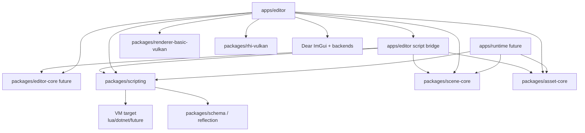
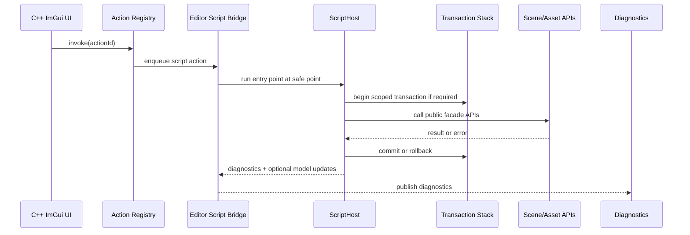

# Editor UI 与脚本协作架构

更新日期：2026-05-19

本文定义 Asharia Editor UI 的 C++ / 脚本分层。结论是：第一版 editor UI 由 C++ 写，
基于 Dear ImGui；脚本后续只能通过受控的 editor contribution、action、transaction 和
schema-driven view model 扩展 editor，不能直接控制 ImGui frame loop、Vulkan backend 或
viewport texture lifetime。

本文是脚本扩展边界约束，不替代 `docs/architecture/editor.md` 的当前 editor 架构说明，
不替代 `docs/planning/editor-development-plan.md` 的阶段拆分，也不替代
`docs/systems/scripting.md` 的脚本系统 ABI 设计。工具、插件、viewport overlay、renderer bridge 和 hot reload
的分层 contract 见 `docs/architecture/editor-extension-architecture.md`。

## 目标

- 保持 `apps/editor` 是 editor host，不让 runtime app 链接 editor UI。
- 让 ImGui、GLFW、Vulkan backend、descriptor registration 和 viewport texture lifetime 留在 C++。
- 让 `editor-core` 只拥有 backend-neutral editor state，例如 action、event、panel metadata、
  selection 和 transaction。
- 让脚本扩展 editor 行为，但不暴露 ImGui、GLFW、Vulkan、RHI、renderer implementation 或裸对象指针。
- 所有 scene、asset、material、project 设置修改都通过 command / transaction / public package API。
- 保证脚本失败、reload 或权限拒绝不会破坏 editor frame loop 或 GPU 资源生命周期。

## 非目标

- 不做 `asharia::ui::button()` / `asharia::ui::image()` 这类通用 UI clone。
- 不让脚本成为第一版 editor shell、dockspace、main menu、viewport 或 Inspector 的主实现。
- 不让脚本在 ImGui `draw()` 中直接修改 scene/asset。
- 不让脚本注册 raw ImGui callback、GLFW callback、Vulkan descriptor 或 command buffer callback。
- 不在 transaction、selection、schema、asset API 稳定前设计完整 C# editor plugin 生态。
- 不做第一版 script hot reload UI 状态保留、Visual scripting 或 marketplace/package manager。

## 分层决策

| 层 | 语言 | 负责 | 不负责 |
| --- | --- | --- | --- |
| `apps/editor` | C++ | ImGui runtime、dockspace、menu、panel adapters、viewport texture registry、input routing、frame order | engine core 抽象、runtime package owner、脚本 VM ABI |
| `apps/editor` 内部 bridge | C++ | 把脚本 action/contribution 转成 editor command、menu item、panel model | 暴露 ImGui/Vulkan 给脚本 |
| future `packages/editor-core` | C++ | `EditorId`、action/event/panel metadata、selection、transaction、editor service facade | ImGui headers、Vulkan headers、GLFW headers、renderer implementation |
| `packages/scripting` | C++ ABI | `ScriptHost`、binding registry、execution context、diagnostics、permission model | editor UI 实现、VM 专属对象模型、GPU backend |
| VM target | Lua/C#/future | 执行脚本 entry point，返回数据、命令请求和 diagnostics | 拥有 editor lifecycle、直接改世界或资产、阻塞 render loop |

## 依赖方向



Rules:

- `packages/scripting` must not depend on `apps/editor`, ImGui, Vulkan, GLFW or renderer implementation.
- `packages/editor-core` must not depend on ImGui, Vulkan, GLFW or renderer implementation.
- The first bridge can stay inside `apps/editor`; extract a future `packages/editor-scripting` only if the bridge becomes
  reusable and can keep the same dependency direction.
- Runtime apps may link `packages/scripting`, but must not link editor UI, editor bridge or editor-only facade.

## C++ Owned UI

These must be C++ in the first editor:

- ImGui context creation, backend initialization and shutdown.
- Dockspace, menu bar, modal shell and panel window host.
- Viewport panel adapter and `ImGuiTextureRegistry`.
- Vulkan sampled texture descriptor registration and delayed descriptor retirement.
- Input routing between ImGui, shortcuts, viewport camera and future gizmo.
- Built-in panels needed for engine state visibility: Scene View, Log, Diagnostics, Inspector shell, Asset Browser shell.
- Editor smoke modes and deterministic startup/shutdown validation.

Rationale:

- These paths share frame order, descriptor lifetime, swapchain, queue idle shutdown and resize handling.
- A script exception or reload must not leave ImGui draw data, descriptor sets, render targets or GLFW callbacks in an
  inconsistent state.
- Built-in panels need tight coupling to package public APIs and diagnostics before a stable plugin/contribution ABI exists.

## Script Extension Surface

Scripts may extend editor through descriptors and command entry points, not by drawing raw ImGui.

Initial contribution kinds:

```cpp
enum class EditorContributionKind {
    Action,
    MenuItem,
    ToolPanelModel,
    InspectorSection,
    AssetContextAction,
};

struct EditorContributionDesc {
    EditorId id;
    EditorContributionKind kind;
    std::string title;
    std::string menuPath;
    std::string scriptEntryPoint;
    PermissionSet permissions;
    bool singleton{true};
    bool defaultOpen{false};
};
```

Rules:

- `Action` is the first script UI extension to support. It maps to menu, shortcut or command palette invocation.
- `ToolPanelModel` is data-only. C++ owns the actual ImGui rendering and consumes a typed view model returned by script.
- `InspectorSection` customizes schema-driven Inspector display by contributing field filters, labels, validators or
  command hooks.
- `AssetContextAction` can request import, reimport, rename or metadata edits through asset API and transaction.
- Script contribution ids are stable and project-owned; reload uses the same ids to update or remove contributions.

## Declarative Panel Model

The first script panel surface should be declarative, not immediate-mode:

```cpp
enum class EditorWidgetKind {
    Label,
    Button,
    Checkbox,
    EnumSelect,
    NumberInput,
    TextInput,
    ObjectField,
    AssetField,
    Progress,
};

struct EditorWidgetDesc {
    EditorId id;
    EditorWidgetKind kind;
    std::string label;
    std::string bindingPath;
    bool readOnly{false};
};

struct EditorPanelModel {
    EditorId panelId;
    std::vector<EditorWidgetDesc> widgets;
};
```

Rules:

- C++ validates the model before drawing it.
- Widget events become editor commands or script action invocations at safe points.
- Scripts never receive `ImGuiContext*`, `ImDrawList*`, `ImTextureID`, `VkImageView`, `VkDescriptorSet`, `GLFWwindow*`
  or raw C++ object pointers.
- Complex custom UI can later use native C++ editor plugins after package/plugin boundaries exist.

## Frame Order

Script UI work runs at deterministic safe points:

```text
poll window events
start ImGui frame
snapshot input capture flags

C++ shell draws dockspace and menus from registered descriptors
C++ panel registry draws built-in panels
C++ draws declarative script panel models from previous safe point
panel widgets enqueue action/command requests

end ImGui frame

safe point:
  run queued script actions
  open editor transaction when needed
  update contribution descriptors / panel models
  collect diagnostics

render viewport requests and ImGui draw data
present
drain editor events
```

Rules:

- Script action invocation is not allowed to record Vulkan commands or mutate GPU resources.
- Script action may update editor state only through `EditorCommand` / transaction.
- Long-running script tools must be split into jobs or progress steps; they must not block the render loop.
- Script panel models are double-buffered or versioned so a failed script update leaves the previous valid model visible.

## Action Invocation



Failure rules:

- If script returns error, the active transaction is rolled back.
- If script throws or VM reports failure, the contribution is marked failed for the frame and diagnostics are shown.
- If a permission check fails, no transaction starts.
- If a script reload removes a contribution, open scripted panels close or switch to a disabled diagnostic state.

## Permissions

Suggested first permissions:

| Permission | Allows | Denies |
| --- | --- | --- |
| `EditorUiRead` | Read selection, project state, schema metadata and diagnostics | Mutating scene, asset or settings |
| `EditorCommand` | Invoke transaction-backed editor commands | Direct world mutation |
| `AssetMetadataWrite` | Change asset metadata through asset API | Writing product cache directly |
| `SceneEdit` | Change Edit World through transaction | Changing Play World |
| `ProjectFileWrite` | Write project config through approved API | Arbitrary filesystem writes |
| `ProcessSpawn` | Run explicit approved external tools | Hidden background process execution |

Permission checks live in the bridge/facade layer. Scripts cannot bypass them by reaching package internals.

## Inspector Strategy

Inspector should be C++ + schema-driven first:

1. `schema` / reflection metadata provides fields, types, editor visibility and read-only flags.
2. C++ Inspector renders common controls and sends edits through transaction.
3. Script can later contribute validators, grouping metadata, custom labels, context actions and small declarative sections.
4. Full custom Inspector panels wait until transaction, schema migration and script diagnostics are stable.

This keeps script component state serializable and avoids VM-private state becoming the source of truth.

## Asset Browser Strategy

Asset Browser should also be C++ first:

1. C++ panel lists asset catalog entries through `asset-core` public API.
2. Import/reimport/rename/delete operations use asset API and editor transaction or command flow.
3. Script can later contribute import rules, context actions and metadata validators.
4. Scripts do not write product cache directly and do not mutate active World during import.

## Hot Reload Boundary

Script reload is a contribution registry operation, not an editor UI restart:

- Freeze new script action invocations.
- Let running transactions finish or rollback.
- Unregister removed contributions by stable id.
- Re-register updated descriptors.
- Preserve C++ panel state when possible.
- Replace failed scripted panel models with diagnostics.
- Never recreate ImGui context, Vulkan backend, descriptor pool or viewport render targets as part of script reload.

## Threading

- Editor UI and editor script actions run on the main thread at defined safe points in the first version.
- Asset import scripts may move to workers only when they operate on isolated source metadata and product output.
- Runtime script update may later run on a game/script owner thread, but render command recording never calls VM.
- Vulkan command pools, descriptor pools, swapchain, ImGui renderer backend and viewport descriptors remain owned by the
  C++ editor/render path.

## Stage Plan

| Stage | Work | Gate |
| --- | --- | --- |
| 16-17 | Build C++ editor shell, panel registry, action registry, viewport registry and editor smokes | No script-controlled UI |
| 20 | Add selection and transaction in editor-core | Editor mutations become undoable |
| Script ABI | Add `packages/scripting` host/context/binding/diagnostics | No editor UI exposure yet |
| Script action bridge | Register script actions and menu items in `apps/editor` | Permission and transaction smokes |
| Declarative panel model | Let scripts return validated panel models | C++ still draws ImGui |
| Inspector/asset hooks | Script contributes validators/context actions | Schema and asset APIs are stable |

## Smoke Suggestions

- `--smoke-editor-script-action-registration`: script contribution appears in action/menu registry.
- `--smoke-editor-script-action-transaction`: script action edits state through transaction and undo restores it.
- `--smoke-editor-script-permission-denied`: script cannot call editor-only or backend-only API outside permission.
- `--smoke-editor-script-panel-model`: script returns a declarative panel model; C++ validates and draws it.
- `--smoke-editor-script-reload`: removed/updated contributions are reflected without recreating ImGui/Vulkan state.

## Review Checklist

- Does the new UI code live in `apps/editor` or an editor-only package?
- Does any backend-neutral package include ImGui, GLFW, Vulkan or renderer implementation headers?
- Does a script-facing API expose handles instead of pointers?
- Does every script mutation go through transaction, asset API or scheduled runtime mutation?
- Is script execution placed at a documented safe point?
- Does failure produce diagnostics and preserve the editor frame loop?
- Is runtime build free of editor UI, editor bridge and editor-only facade dependencies?
