# 流程架构图

本文档记录当前代码真实流程。每次实现或重构后都需要同步更新，用来帮助审查架构走向、包边界和下一步开发顺序。

## 维护规则

- 代码改变了运行流程、包依赖、资源状态、同步路径或 smoke 命令时，必须更新本文档。
- 图中的“已接入”表示当前运行路径真实使用；“smoke 验证”表示已有测试入口但尚未接入主 frame loop；“下一步”表示目标方向。
- RenderGraph 图层必须保持后端无关；Vulkan layout、stage、access、barrier 翻译只允许出现在 `packages/rhi-vulkan`。

## 当前包依赖

```mermaid
flowchart TD
    App["apps/sample-viewer<br/>MVP host + smoke harness"]
    EditorApp["apps/editor<br/>Dear ImGui host + editor smoke harness"]
    Core["engine/core"]
    Platform["engine/platform"]
    Window["packages/window-glfw"]
    Profiling["packages/profiling"]
    Schema["packages/schema"]
    Archive["packages/archive"]
    CppBinding["packages/cpp-binding"]
    Persistence["packages/persistence"]
    Reflection["packages/reflection"]
    Serialization["packages/serialization"]
    SceneCore["packages/scene-core"]
    ProjectCore["packages/project-core"]
    ProjectCoreIo["packages/project-core<br/>asharia::project_core_io"]
    AssetCore["packages/asset-core"]
    AssetCoreIo["packages/asset-core<br/>asharia::asset_core_io"]
    AssetPipeline["packages/asset-pipeline"]
    ResourceRuntime["packages/resource-runtime"]
    MaterialCore["packages/material-core"]
    RG["packages/rendergraph"]
    RhiVk["packages/rhi-vulkan<br/>asharia::rhi_vulkan"]
    RhiVkRG["packages/rhi-vulkan<br/>asharia::rhi_vulkan_rendergraph"]
    Renderer["packages/renderer-basic<br/>asharia::renderer_basic"]
    RendererVk["packages/renderer-basic<br/>asharia::renderer_basic_vulkan"]
    Shader["packages/shader-slang"]
    ImGui["Dear ImGui<br/>Conan package + GLFW/Vulkan backends"]

    Platform --> Core
    Window --> Core
    Window --> Platform
    Schema --> Core
    Archive --> Core
    CppBinding --> Core
    CppBinding --> Schema
    Persistence --> Core
    Persistence --> Schema
    Persistence --> Archive
    Persistence --> CppBinding
    Reflection --> Core
    Serialization --> Core
    Serialization --> Reflection
    SceneCore --> Core
    ProjectCore --> Core
    ProjectCoreIo --> ProjectCore
    ProjectCoreIo --> Archive
    AssetCore --> Core
    AssetCoreIo --> AssetCore
    AssetCoreIo --> Archive
    AssetPipeline --> AssetCore
    AssetPipeline -.metadata read.-> AssetCoreIo
    ResourceRuntime --> AssetCore
    MaterialCore --> Core
    RG --> Core
    RhiVk --> Core
    RhiVkRG --> RhiVk
    RhiVkRG --> RG
    Renderer --> Core
    Renderer --> RG
    Renderer --> Shader
    RendererVk --> Renderer
    RendererVk --> RhiVk
    RendererVk --> RhiVkRG
    App --> Core
    App --> Profiling
    App --> Reflection
    App --> Serialization
    App --> Window
    App --> RG
    App -->|asset product/upload smoke| AssetPipeline
    App -->|current MVP/smoke wiring| RhiVk
    App -->|smoke validation only| RhiVkRG
    App -->|CPU-only benchmark schemas| Renderer
    App -->|selected sample renderer| RendererVk
    EditorApp --> Core
    EditorApp --> Archive
    EditorApp -->|project descriptor IO| ProjectCoreIo
    EditorApp -->|catalog view + metadata IO| AssetCore
    EditorApp -->|.ameta text IO| AssetCoreIo
    EditorApp -->|snapshot planning only| AssetPipeline
    EditorApp -->|selection EntityId values| SceneCore
    EditorApp --> Window
    EditorApp --> RhiVk
    EditorApp --> RendererVk
    EditorApp -->|shader build helper| Shader
    EditorApp --> ImGui
```

当前约束：

- 这张图按 CMake target 事实和已落地 package manifests 的 `targetDependencies` 校准；`dependencies`
  是 package-level 粗粒度边界，不能替代 target-level 依赖审查。
- `asharia::rhi_vulkan` 是基础 Vulkan 后端，不公开依赖 RenderGraph。
- `asharia::rhi_vulkan_rendergraph` 是 RenderGraph/Vulkan 适配层，负责把抽象 graph state 翻译为 Vulkan 类型。
- `renderer-basic` 只描述后端无关的 basic renderer graph 片段。
- `renderer-basic-vulkan` 组合 RenderGraph、Vulkan frame callback 和 Vulkan adapter，承载当前 clear frame orchestration。
- `profiling` 提供后端无关 CPU scope、frame profile 和 JSONL 输出；当前只由 sample-viewer benchmark 使用。
- `schema`、`archive`、`cpp-binding` 和 `persistence` 是新的 schema-first persistence 路线；
  `reflection` / `serialization` 仍作为过渡兼容路径由 sample-viewer smoke 覆盖。
- `scene-core`、`asset-core` 和 `material-core` 目前是 CPU/headless 数据模型 package，不依赖 renderer、RHI 或 editor；
  `.ameta` 文本 IO 位于可选 `asharia::asset_core_io` target，只额外依赖 `archive` strict JSON facade。
- `project-core` 目前只拥有最小 project descriptor model；`asharia::project_core_io` 通过 `archive`
  strict JSON facade 读写 `asharia.project.json`，不保存 cook/package profiles、editor workspace 或 runtime
  resource state。
- `asset-pipeline` 当前只做 CPU-only metadata discovery：显式 source/.ameta 条目进入 discovery facade，
  输出 deterministic manifest、`AssetCatalog` 输入和 diagnostics；它不做 watcher、import 调度、product
  cache manifest、GPU upload 或 editor UI。
- `resource-runtime` 当前只做 CPU-only runtime resource handle 状态合同：消费 `asset-core` 的
  `AssetHandle<T>` / `AssetProductKey` / `AssetProductRecord`，表达 pending / ready / failed、generation 和
  product-cache diagnostics；它不依赖 `asset-pipeline`、RenderGraph、renderer、RHI 或 editor，也不创建
  GPU resource。
- `material-core` 当前只做 CPU-only material resource signature、shader/signature compatibility validation 和
  material pipeline key hash；它不做 `.amat` IO、asset import、GPU upload、Vulkan descriptor/pipeline cache、
  RenderGraph/RHI changes 或 editor UI。
- `sample-viewer` 当前同时承担 app host 和 smoke harness，所以会直接创建 `VulkanContext` /
  `VulkanFrameLoop`。这是当前 MVP 事实，不是目标产品边界；后续应收敛到 runtime/engine host。
- `sample-viewer` 的 smoke validation 可以直接验证 `rhi_vulkan_rendergraph` 字段；普通运行路径不应把
  Vulkan barrier/layout 细节扩散到 app 层。
- `apps/editor` 当前承担 editor host 和 editor smoke harness。它可以直接链接 ImGui、`window-glfw`、
  `rhi-vulkan`、`renderer_basic_vulkan`、`project_core_io`、`asset_core`、`asset_core_io`、`asset_pipeline`
  和 `scene_core`，因为这些都属于 host integration、只读 project/asset snapshot 组装或 editor-owned
  selection value contracts；未来
  `packages/editor-core` 只能保留 backend-neutral editor state，不能继承 ImGui、Vulkan、renderer 或 importer
  execution 依赖。
- Editor panels 仍由 `EditorPanelRegistry::drawPanels(EditorFrameContext)` 适配每帧能力，但内置
  panel 的 `draw()` 实现会先收敛为 panel-local context，再把最小能力传给 helper。Scene View panel
  不创建 Vulkan objects、不注册 descriptor、不录 command buffer。
- Asset Browser 当前消费 `EditorAssetCatalogStore` 提供的 `AssetCatalogView` 和可选 snapshot facts；project
  descriptor 读取、source scan/discovery/snapshot、import planning 和 catalog report 生成在 `apps/editor`
  的 host 服务中组合 public package API。它不执行 importer、不写 product manifest/blob、不创建 runtime asset
  handle，也不上传 GPU 资源。
- Scene Tree 和 Inspector 现在是默认 workbench 中的 read-only shell panel。它们消费 app-local
  `EditorSelectionSet` 的稳定 `sceneId + EntityId` snapshot，但仍不消费 runtime scene hierarchy 或 inspector
  data model；当前 UI 只表达 selection contract 状态，避免伪造场景数据。

## 当前架构总览

这张图按“谁拥有抽象、谁拥有 Vulkan、谁负责组装运行”来读。横向是包边界，纵向是每帧数据从应用入口落到
GPU submit 的方向。

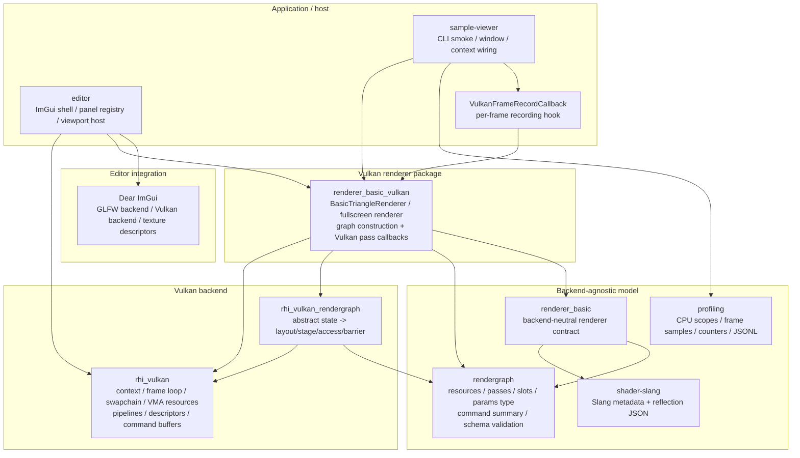

当前最重要的切分：

- RenderGraph 只知道抽象 image state、slot、params type 和 command kind，不知道 `VkImageLayout`、pipeline
  stage 或 access mask。
- Vulkan layout/stage/access 翻译只在 `rhi_vulkan_rendergraph`，真实 command buffer、descriptor、pipeline、
  swapchain 和 VMA 生命周期只在 Vulkan 包或 `renderer_basic_vulkan`。
- `sample-viewer` 是 host 和 smoke harness；它可以选择 smoke 路径，但不应该内联具体 renderer 的 Vulkan 录制细节。
- `apps/editor` 是 editor host 和 smoke harness；它拥有 ImGui backend lifecycle、panel/action/event
  state 和 ImGui texture descriptor lifetime。它可以在 host integration 层录制 ImGui draw data
  到 swapchain，但 editor panel 不能录制 Vulkan commands。

## 启动与 Context 流程

```mermaid
flowchart TD
    Start["main()"]
    Args["解析命令行参数"]
    WindowSmoke["--smoke-window"]
    VulkanSmoke["--smoke-vulkan"]
    FrameSmoke["--smoke-frame"]
    RGSmoke["--smoke-rendergraph"]
    RGBench["--bench-rendergraph"]
    TransientSmoke["--smoke-transient"]
    DynamicSmoke["--smoke-dynamic-rendering"]
    TriangleSmoke["--smoke-triangle"]
    DepthTriangleSmoke["--smoke-depth-triangle"]
    MeshSmoke["--smoke-mesh"]
    Mesh3DSmoke["--smoke-mesh-3d"]
    DrawListSmoke["--smoke-draw-list"]
    MrtSmoke["--smoke-mrt"]
    DescriptorSmoke["--smoke-descriptor-layout"]
    FullscreenTextureSmoke["--smoke-fullscreen-texture"]
    ComputeDispatchSmoke["--smoke-compute-dispatch"]
    TextureUploadSmoke["--smoke-texture-upload"]
    FormatContractSmoke["--smoke-renderer-format-contract"]
    DeferredDeletionSmoke["--smoke-deferred-deletion"]
    GLFW["GlfwInstance / GlfwWindow"]
    Ext["glfwRequiredVulkanInstanceExtensions"]
    Context["VulkanContext::create"]
    Device["选择 physical device<br/>创建 logical device / queue / VMA"]
    ShaderBuild["shader-slang package<br/>slangc + spirv-val<br/>triangle / descriptor / mesh3d / compute SPIR-V + reflection JSON"]
    RendererObject["BasicTriangleRenderer / BasicMesh3DRenderer / BasicDrawListRenderer / BasicComputeDispatchRenderer<br/>shader modules / pipeline layout / buffers / pipeline<br/>BasicDrawItem / BasicDrawListItem / MVP push constants / dispatch params"]
    DescriptorLayout["Descriptor layout smoke<br/>reflection signature -> descriptor set layout -> pipeline layout<br/>descriptor allocator-backed pool/set<br/>buffer + image + sampler write"]
    TextureProduct["asset_pipeline execute<br/>placeholder Texture2D product blob"]

    Start --> Args
    Args --> WindowSmoke
    Args --> VulkanSmoke
    Args --> FrameSmoke
    Args --> RGSmoke
    Args --> RGBench
    Args --> TransientSmoke
    Args --> DynamicSmoke
    Args --> TriangleSmoke
    Args --> DepthTriangleSmoke
    Args --> MeshSmoke
    Args --> Mesh3DSmoke
    Args --> DrawListSmoke
    Args --> MrtSmoke
    Args --> DescriptorSmoke
    Args --> FullscreenTextureSmoke
    Args --> ComputeDispatchSmoke
    Args --> TextureUploadSmoke
    Args --> FormatContractSmoke
    Args --> DeferredDeletionSmoke
    WindowSmoke --> GLFW
    VulkanSmoke --> GLFW
    VulkanSmoke --> Ext
    VulkanSmoke --> Context
    FrameSmoke --> GLFW
    FrameSmoke --> Ext
    FrameSmoke --> Context
    DynamicSmoke --> GLFW
    DynamicSmoke --> Ext
    DynamicSmoke --> Context
    TriangleSmoke --> GLFW
    TriangleSmoke --> Ext
    TriangleSmoke --> Context
    TriangleSmoke --> ShaderBuild
    TriangleSmoke --> RendererObject
    DepthTriangleSmoke --> GLFW
    DepthTriangleSmoke --> Ext
    DepthTriangleSmoke --> Context
    DepthTriangleSmoke --> ShaderBuild
    DepthTriangleSmoke --> RendererObject
    MeshSmoke --> GLFW
    MeshSmoke --> Ext
    MeshSmoke --> Context
    MeshSmoke --> ShaderBuild
    MeshSmoke --> RendererObject
    Mesh3DSmoke --> GLFW
    Mesh3DSmoke --> Ext
    Mesh3DSmoke --> Context
    Mesh3DSmoke --> ShaderBuild
    Mesh3DSmoke --> RendererObject
    DrawListSmoke --> GLFW
    DrawListSmoke --> Ext
    DrawListSmoke --> Context
    DrawListSmoke --> ShaderBuild
    DrawListSmoke --> RendererObject
    MrtSmoke --> GLFW
    MrtSmoke --> Ext
    MrtSmoke --> Context
    DescriptorSmoke --> GLFW
    DescriptorSmoke --> Ext
    DescriptorSmoke --> Context
    DescriptorSmoke --> ShaderBuild
    DescriptorSmoke --> DescriptorLayout
    FullscreenTextureSmoke --> GLFW
    FullscreenTextureSmoke --> Ext
    FullscreenTextureSmoke --> Context
    FullscreenTextureSmoke --> ShaderBuild
    FullscreenTextureSmoke --> RendererObject
    ComputeDispatchSmoke --> GLFW
    ComputeDispatchSmoke --> Ext
    ComputeDispatchSmoke --> Context
    ComputeDispatchSmoke --> ShaderBuild
    ComputeDispatchSmoke --> RendererObject
    TextureUploadSmoke --> GLFW
    TextureUploadSmoke --> Ext
    TextureUploadSmoke --> Context
    TextureUploadSmoke --> TextureProduct
    Context --> Device
```

状态：

- `--smoke-window` 已接入窗口创建。
- `--smoke-vulkan` 已接入 Vulkan context/device 创建。
- `--smoke-frame` 已接入 swapchain acquire、RenderGraph-driven clear、present。
- `--smoke-dynamic-rendering` 已接入 swapchain acquire、RenderGraph color write、dynamic rendering clear、present。
  frame/dynamic/transient/renderer smoke 会验证 Vulkan debug label begin/end counters 配对，并验证
  timestamp query delayed readback 能返回上一帧 `VulkanFrame` duration。
- `--smoke-triangle` 已接入 `BasicTriangleRenderer`、dynamic-rendering graphics pipeline、RenderGraph color write、draw、present。
- `--smoke-depth-triangle` 已接入 `BasicTriangleRenderer::recordFrameWithDepth()`、transient depth image、
  dynamic-rendering depth attachment、depth-enabled pipeline 和 present。
- `--smoke-mesh` 已接入 `BasicTriangleRenderer` 的 indexed quad path，创建 host-upload vertex/index
  buffers，并验证 buffer upload counters、`vkCmdBindIndexBuffer` + `vkCmdDrawIndexed`。
- `--smoke-mesh-3d` 已接入独立 `BasicMesh3DRenderer`：创建 3D cube vertex/index buffer、显式
  vertex-stage push constant range、固定 MVP 行向量、transient depth attachment，并验证
  `vkCmdPushConstants` + indexed cube draw。
- `--smoke-draw-list` 已接入独立 `BasicDrawListRenderer`：使用后端无关 `BasicDrawListItem`、
  `builtin.raster-draw-list` schema、typed params payload、transient depth attachment 和共享 cube
  vertex/index buffer，验证 buffer upload counters、多 item 的 `vkCmdPushConstants` + indexed draw 循环。
- `--smoke-mrt` 已接入独立 `BasicMrtRenderer`：使用 `builtin.raster-mrt` schema、两个 named color
  slots、两张 transient color attachments 和 dynamic rendering multi-color clear，验证 transient image
  pool 对两张 color attachments 的 retire/reuse。
- `--smoke-descriptor-layout` 已接入非空 descriptor reflection signature 到 Vulkan descriptor set layout /
  pipeline layout 的创建验证，并验证 descriptor allocator-backed pool、descriptor set allocation、
  uniform-buffer write、sampled-image write、sampler write 和 allocator counters。
- `--smoke-fullscreen-texture` 已接入真实 draw-time descriptor bind：transient source image 先 clear，
  再 transition 到 `ShaderRead(fragment)`，作为 sampled image + sampler + uniform buffer 绑定后由
  fullscreen dynamic-rendering pass 采样并写入 backbuffer；smoke 同时验证 descriptor allocator 和 buffer
  upload counters。
- `--smoke-texture-upload` 已接入最小 asset product -> GPU sampled texture 路径：用
  `asset_pipeline::executeAssetProducts()` 生成 deterministic Texture2D placeholder product blob，把 product
  payload 写入 staging buffer，经 RenderGraph-visible `CopyBufferToImage` 上传到 imported Vulkan image，再用
  `CopyImageToBuffer` 读回验证字节，并确认最终 image 进入 `ShaderRead(fragment)` sampled view。
- `--smoke-offscreen-viewport` 已接入基于 `VulkanRenderTarget` 的持久 offscreen color target：先把
  viewport color image 作为 imported RenderGraph image 写入 `ColorAttachment`，再 transition 到
  `ShaderRead(fragment)` 并由 fullscreen composite pass 采样写回 backbuffer；smoke 验证 viewport
  extent 可独立于 swapchain extent、resize 后旧 target 进入 deferred deletion、renderer 对外暴露
  sampled target handle/layout、render target 多帧复用、descriptor bind、debug label 和 timestamp readback。
- `--smoke-renderer-format-contract` 是 CPU-only renderer/RG format contract 负向入口：验证
  `VK_FORMAT_B8G8R8A8_SRGB` 能映射到 `RenderGraphImageFormat::B8G8R8A8Srgb`，unsupported format 会在
  backbuffer / RenderView graph import 前返回带 format 上下文的错误。
- `--smoke-rendergraph` 是 RenderGraph CPU 编译、schema 负向编译、image copy command 和 Vulkan adapter 字段验证入口。
- `--bench-rendergraph` 是 CPU-only RenderGraph benchmark 入口；它使用 `packages/profiling`
  记录 RecordGraph/CompileGraph scope 和 graph counters，输出 JSONL，不改变 smoke 语义。
- `--smoke-transient` 已接入真实 Vulkan 路径：根据 compiled transient plan 创建 VMA-backed image、
  image view 和 binding 表，并录制非 backbuffer image transition / clear；现在还验证 transient
  Vulkan image / image view teardown 会进入 frame-loop deferred deletion，并至少完成一次 retirement。
- `--smoke-deferred-deletion` 已接入 P4 后端生命周期起点：验证 deferred deletion queue 的 epoch
  retirement 顺序、empty callback 拒绝路径和 pending/enqueued/retired/flushed counters。
- `VulkanFrameLoop` 现在持有 deferred deletion queue，并在 frame fence / swapchain recreate / shutdown
  已确认 GPU 完成的位置推进 completed epoch。

## 当前运行调用链

交互式 viewer 和各个 Vulkan smoke 共享同一条 frame-loop 骨架：host 创建 window/context/frame loop，
renderer 只通过 callback 在“command buffer 已经 begin”之后录制本帧内容，最后由 frame loop 统一 submit/present。
当前 `sample-viewer` 直接创建 `VulkanContext` / `VulkanFrameLoop` 是 MVP host 和 smoke harness 的接线事实；
目标 runtime 应把这层隐藏在 engine host 后面。

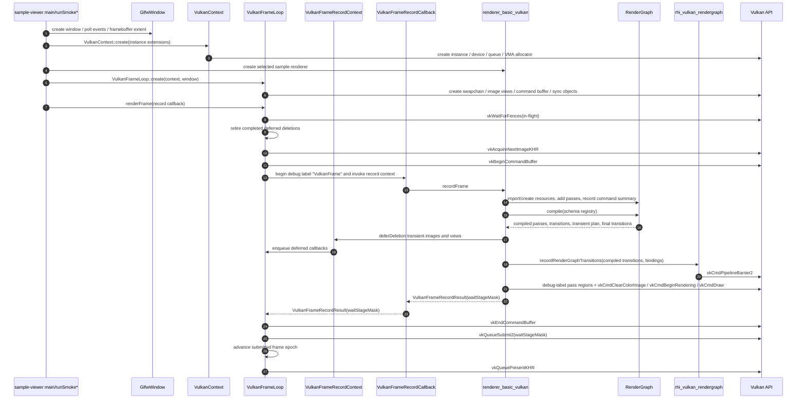

调用链里的责任归属：

- `VulkanFrameLoop` 拥有 acquire、command buffer begin/end、queue submit、present、swapchain recreate
  和 fence/epoch 驱动的 deferred deletion retirement。
- `VulkanFrameLoop` 只知道 `VulkanFrameRecordCallback`，不应该包含或链接 `renderer_basic_vulkan`、
  `RenderGraph` 或具体 sample renderer。
- `renderer_basic_vulkan` 在 callback 内构建 graph、编译 graph、准备 transient/descriptor/pipeline 相关资源并录制 draw。
  transient Vulkan image / image view 的旧对象通过 `VulkanFrameRecordContext::deferDeletion()` 挂回
  frame loop 的 fence/epoch retirement；renderer 不持有 frame loop，也不直接 submit/present。
- `RenderGraph` 产出后端无关计划；它不直接调用 Vulkan。
- `rhi_vulkan_rendergraph` 把 compiled transition 翻译为 Vulkan barrier，再由调用方用真实 image binding 录制。

## Editor Host 当前流程

`apps/editor` 是当前 editor shell 和 editor smoke 的真实入口。它复用 `VulkanContext` /
`VulkanFrameLoop`，通过 `BasicFullscreenTextureRenderer::recordViewFrame()` 生成 sampled viewport
target，再由 `ImGuiTextureRegistry` 注册为 ImGui texture。Scene/debug viewport flags 和 refresh intent 随 request/result
流动；viewport coordinator 按 `panelId + EditorViewportKind` 收集 keyed slot，所以同帧 Scene/Game/Preview
请求不会互相覆盖。Scene View 默认 on-demand，coordinator 只有在初始纹理、resize、overlay/debug event 或
`AlwaysRefresh` 等 repaint reason 存在时才录制新的 RenderView。coordinator 会清掉 Scene-only authoring flags，同时保留显式 Game debug overlay/debug gizmo intent。Panel 只提交请求和消费 texture id，不持有
Vulkan image、descriptor set 或 command buffer。完整 editor 架构见 `docs/architecture/editor.md`。

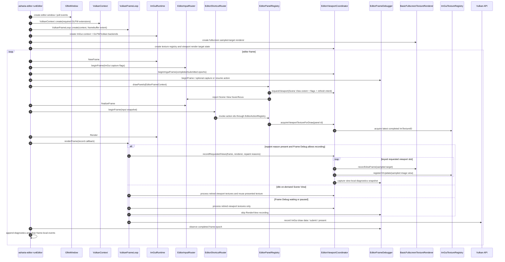

当前约束：

- `EditorViewportPanelHost` 是 panel-facing API；它只暴露 `EditorViewportRequest` 和
  `EditorViewportResult`。
- `EditorViewportCoordinator` 是 editor-side Vulkan bridge；它按 `panelId + EditorViewportKind` 拥有 keyed
  pending/presented viewport render targets 和 keyed diagnostics snapshot，并通过 frame-loop deferred deletion 延迟释放旧
  target。Frame callback 仍返回一个合并后的 acquire wait-stage mask。
- `EditorViewportOverlayFlags` 是当前 viewport overlay intent。Scene View 当前 effective request 只保留 Grid 和显式
  debug overlay/debug gizmo flags；transform gizmo、wire 和 selection outline 在真实 provider/render bridge 前会被清空。
  Game View 请求会清空 Scene-only authoring flags，但可保留显式 debug overlay/debug gizmo flags；Preview View 当前清空全部
  overlay flags。
- `EditorViewportRefreshPolicy` / `EditorViewportRepaintReason` 是当前 viewport refresh intent。Scene View 默认
  `OnDemand`，没有 repaint reason 时复用上一张 presented texture；Game View 和未来 Play Session 仍可用
  `Continuous`/`AlwaysRefresh` 维持持续渲染。
- Scene View 的 Grid 已映射到 renderer-owned world-grid pass；Gizmo/Select/selection-outline contribution ids 仍保留在
  tool registry 中，但 Scene View strip 将它们显示为 disabled/pending，effective RenderView diagnostics 不再记录这些
  source overlay ids。Game View 只允许显式 debug overlay/debug gizmo intent 进入后续 graph。
- `ImGuiTextureRegistry` 只拥有 ImGui descriptor lifetime，不拥有 `VulkanRenderTarget`、
  `VkImage` 或 `VkImageView`。descriptor retirement 使用 frame epoch，避免 resize 后释放仍被
  submitted ImGui draw data 引用的 descriptor。
- `recordEditorImguiFrame()` 当前在 `apps/editor` host integration 层录制 ImGui swapchain pass。
  这是 editor backend integration，不是 panel 或 renderer core 逻辑；若继续增长，应抽到
  `imgui_runtime` 或单独的 editor ImGui pass module。
- `EditorFrameDebugger` 属于 editor-side transient tooling state。CaptureRequested 只影响下一次 successful
  RenderView recording；capture/resume 会向 viewport coordinator 提供 `FrameDebugEventChanged` repaint reason。
  WaitingGpuFence/PausedFrameDebug 会跳过新的 RenderView recording，但继续允许 ImGui
  host frame 提交，以便 UI 可以显示或恢复。它只保存 `BasicRenderViewDiagnostics` 的 CPU snapshot，不保存 Vulkan
  handles，不使用 `vkDeviceWaitIdle` 作为普通 capture 机制。`EditorInspectedWorldScheduler` 在同一状态下跳过
  frame advance、game update 和 script update safe-point counter，作为未来 runtime/script scheduler 接入前的验证 seam。

### Editor Project / Asset 数据流

当前 editor 的 project/asset 能力是 host-level snapshot 和 metadata command，不是完整资产处理器或场景编辑器。

```mermaid
flowchart LR
    ProjectInput["--project / ASHARIA_EDITOR_PROJECT"]
    ProductInput["optional product manifest"]
    ProjectIo["project_core_io<br/>read asharia.project.json"]
    AssetScan["asset_pipeline<br/>scan / discover / snapshot / plan"]
    AssetIo["asset_core_io<br/>read .ameta text"]
    CatalogView["asset_core<br/>AssetCatalogView"]
    Store["EditorAssetCatalogStore<br/>snapshot or fixture"]
    FrameContext["EditorFrameContext"]
    Browser["AssetBrowserPanel<br/>read-only table / tree / details"]
    ImportUi["Import Settings UI<br/>texture.profile only"]
    Transaction["EditorTransaction"]
    MetadataCommand["editor_asset_import_settings_command<br/>rewrite .ameta"]
    Pending["EditorAssetReimportPendingState<br/>pending facts"]
    FutureScheduler["future import scheduler / catalog refresh"]

    ProjectInput --> ProjectIo --> AssetScan
    ProductInput -.read facts if present.-> AssetScan
    AssetIo --> AssetScan
    AssetScan --> CatalogView --> Store --> FrameContext --> Browser
    Browser --> ImportUi --> Transaction --> MetadataCommand --> Pending
    Pending -.explicit future handoff.-> FutureScheduler
```

约束：

- `EditorAssetCatalogStore` 在 frame loop 前选择 deterministic fixture 或 project snapshot；panel 只读取
  `AssetCatalogView`、snapshot diagnostics 和 source-root/path helper 结果。
- `asset-pipeline` 在这个路径里只提供 source scan/discovery/snapshot、import planning 和 diagnostics。它不被
  Asset Browser 用作 importer scheduler，也不在 UI 线程写 product blobs。
- Product manifest 只作为 catalog product-state 输入事实；缺失、stale 或 unknown product 不会被 editor pending
  reimport state 覆盖成 Ready。
- Import Settings 当前只通过 `EditorTransaction` 修改 `.ameta` 的 `texture.profile`，并记录 source GUID、source path、
  target profile 和 changed-setting keys。Undo/redo 恢复 metadata 文本；command-produced request/pending facts 只是
  editor coordination state。真正 reimport、product manifest/blob writes、catalog invalidation、runtime asset loading
  和 GPU preview allocation 留给后续显式服务。
- Scene Tree / Inspector 没有进入这条 asset flow。它们目前不消费 asset catalog row selection，也不把 panel state
  写回 project descriptor、asset metadata 或 runtime scene。

Editor smoke 入口：

```text
asharia-editor --smoke-editor-shell
asharia-editor --smoke-editor-asset-browser
asharia-editor --smoke-editor-viewport
asharia-editor --smoke-editor-viewport-resize
asharia-editor --smoke-editor-frame-debugger
```

## 当前 Frame Loop 流程

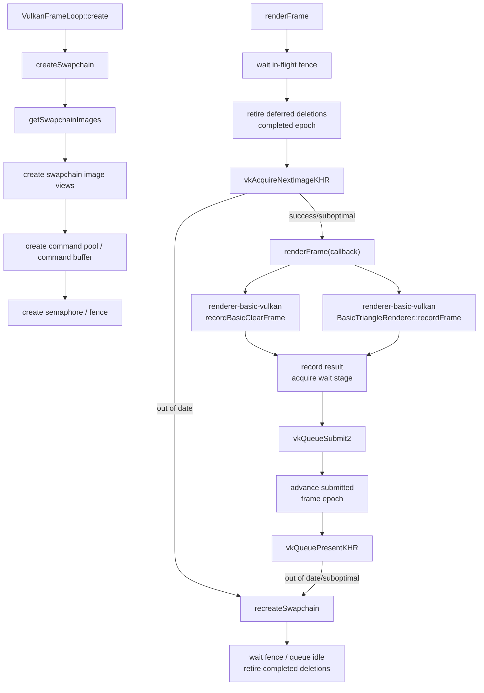

`--smoke-frame` 当前真实录制流程：

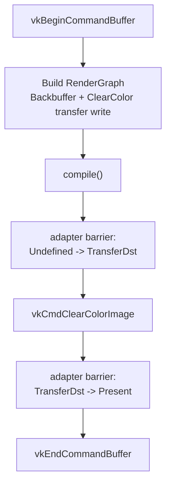

`--smoke-dynamic-rendering` 当前真实录制流程：

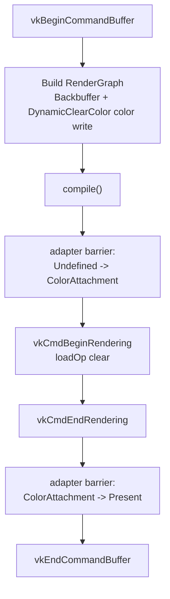

`--smoke-triangle` / `--smoke-depth-triangle` / `--smoke-mesh` / `--smoke-mesh-3d` /
`--smoke-draw-list` 当前真实录制流程：

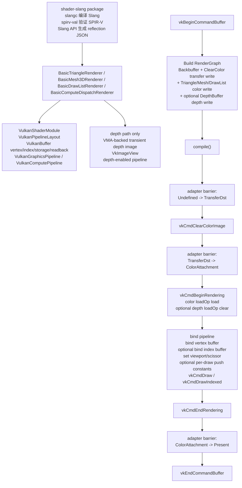

`--smoke-fullscreen-texture` 当前真实录制流程：

```mermaid
flowchart TD
    Renderer["BasicFullscreenTextureRenderer::recordViewFrame<br/>recordFrame wraps swapchain target"]
    ImportBackbuffer["importImage(RenderViewTarget)<br/>initial Undefined<br/>final Present or ShaderRead(fragment)"]
    CreateSource["createTransientImage(FullscreenSource)<br/>same format/extent as target"]
    BindingBackbuffer["binding table add render target<br/>RenderGraphImageHandle -> target VkImage/View"]
    ClearPass["pass ClearFullscreenSource<br/>type builtin.transfer-clear<br/>params builtin.transfer-clear.params<br/>writeTransfer(target, source)<br/>ClearColor command"]
    DrawPass["pass FullscreenTexture<br/>type builtin.raster-fullscreen<br/>params builtin.raster-fullscreen.params<br/>readTexture(source, fragment)<br/>writeColor(target, backbuffer)<br/>SetShader / SetTexture / SetVec4 / DrawFullscreenTriangle"]
    Schema["basicFullscreenSchemaRegistry<br/>slot schema + allowed command kind"]
    Compile["RenderGraph::compile(schema)<br/>validate params / slots / commands<br/>compute transitions + transient lifetime"]
    Prepare["prepareTransientResources<br/>VMA image + image view<br/>append source binding"]
    Execute["graph.execute(compiled)<br/>pass callbacks in compiled order"]
    ClearTransition["record transitions<br/>Undefined -> TransferDst"]
    ClearCmd["vkCmdClearColorImage(source)"]
    DrawTransition["record transitions<br/>TransferDst -> ShaderRead(fragment)<br/>Undefined -> ColorAttachment"]
    Descriptor["updateSourceDescriptor<br/>sampled image view + sampler + uniform buffer"]
    DrawCmd["recordFullscreenTextureDraw<br/>vkCmdBeginRendering<br/>bind pipeline / descriptor set<br/>vkCmdDraw(3)<br/>vkCmdEndRendering"]
    FinalTransition["record final transition<br/>ColorAttachment -> Present"]
    Result["return waitStageMask<br/>COLOR_ATTACHMENT_OUTPUT"]

    Renderer --> ImportBackbuffer --> CreateSource --> BindingBackbuffer
    BindingBackbuffer --> ClearPass --> DrawPass --> Schema --> Compile --> Prepare --> Execute
    Execute --> ClearTransition --> ClearCmd --> DrawTransition --> Descriptor --> DrawCmd --> FinalTransition --> Result
```

这条路径目前有两层“可分析”信息：

- builder 显式声明 resource access：source 先 `TransferWrite`，后 `ShaderRead(fragment)`；render view target
  作为 `ColorWrite` 后最终回到 `Present` 或 `ShaderRead(fragment)`。
- command summary 显式声明执行意图：clear pass 只允许 `ClearColor`，fullscreen pass 只允许
  `SetShader`、`SetTexture`、`SetVec4` 和 `DrawFullscreenTriangle`；compile 阶段会拒绝 schema 外命令。

状态：

- 已接入真实 Vulkan 命令录制。
- `--smoke-frame` 的 clear/present barriers 已由 RenderGraph compile result 经 Vulkan adapter 生成。
- `--smoke-dynamic-rendering` 已验证 swapchain image view、dynamic rendering attachment clear 和 `ColorAttachment -> Present` transition。
- `--smoke-triangle` 已验证 `shader-slang` 构建出的 Slang SPIR-V、reflection JSON、triangle shader 契约校验、`BasicTriangleRenderer` 管理的 shader module、reflection-derived pipeline layout、host-upload vertex buffer、dynamic rendering graphics pipeline、`BasicDrawItem` draw 参数、ClearColor + Triangle 两个 graph pass、viewport/scissor dynamic state 和 triangle draw。
- `--smoke-mesh` 已验证最小 indexed mesh 数据、host-upload index buffer、`BasicDrawItem` indexed draw
  参数、`vkCmdBindIndexBuffer` 和 `vkCmdDrawIndexed`。
- `--smoke-mesh-3d` 已验证最小 3D mesh path：固定 cube mesh、depth attachment、MVP push constants、
  3D vertex input layout 和 indexed draw；当前只作为 renderer-basic-vulkan 的 smoke，不引入全局相机系统。
- `--smoke-draw-list` 已验证最小 draw list path：后端无关 `BasicDrawListItem` 描述 per-draw range
  和 transform，RenderGraph typed pass 使用 `builtin.raster-draw-list` schema/params，Vulkan backend
  在一个 dynamic rendering pass 内循环提交两个 indexed cube draw。
- `--smoke-depth-triangle` 已验证 `D32Sfloat` transient depth image、depth aspect binding、
  `Undefined -> DepthAttachmentWrite` transition、dynamic rendering depth attachment clear 和
  depth-enabled graphics pipeline。
- `--smoke-descriptor-layout` 已验证 `descriptor_layout.slang` 的非空 reflection signature 可映射为固定
  descriptor set layout 和 pipeline layout，并能分配 descriptor set、写入 set 0 / binding 0 的 uniform
  buffer、binding 1 的 sampled image 和 binding 2 的 sampler descriptor。
- `--smoke-fullscreen-texture` 已验证 draw call 中的 descriptor set 绑定、fullscreen pipeline 绑定和
  transient source texture 采样；`BasicFullscreenTextureRenderer::recordFrame()` 现在是
  `recordViewFrame()` 的 swapchain target 便捷包装；renderer 为 view write 和 composite 各持有一个
  descriptor set，避免同一 command buffer 内更新已绑定 set。
- `--smoke-compute-dispatch` 已验证 graphics queue compute capability、compute shader reflection、
  storage buffer descriptor、compute pipeline、RenderGraph buffer transition 录制、`vkCmdDispatch`
  和 readback buffer 校验。
- `--smoke-offscreen-viewport` 已验证 editor viewport 的核心离屏路径：通用 `VulkanRenderTarget`
  持有的 color attachment image 独立尺寸、resize 后 deferred deletion、多帧复用、`recordViewFrame()`
  写入 sampled target、sampled image descriptor 更新、renderer 输出可被当前 editor ImGui backend
  注册为 texture 的 sampled target，以及第二个 fullscreen composite graph 写回 swapchain。
- 无参数 sample viewer 已接入交互式 triangle 循环，并已手动验证 resize/minimize 后仍可恢复持续渲染。
- RenderGraph transition 录制通过 `RenderGraphImageHandle -> VkImage/imageView/aspect` binding 查找真实
  Vulkan resource；pass callback 侧通过 `RenderGraphPassContext` 的 named slots 反查 `source`、
  `target` 或 `depth` 对应 binding，Backbuffer、`--smoke-transient` 的 transient color image 和
  `--smoke-depth-triangle` 的 transient depth image、`--smoke-texture-upload` 的 staging/readback buffers
  和 product texture image 都已显式加入 binding 表。
- `--smoke-rendergraph` 已验证 `StorageReadWrite(compute)` buffer access、`Dispatch` command summary、
  `builtin.compute-dispatch` / `builtin.compute-readback` schema 负向路径，以及
  `TransferWrite -> StorageReadWrite(compute)`、`StorageReadWrite(compute) -> TransferRead` 和
  `TransferWrite -> HostRead` 的 Vulkan buffer stage/access 映射；`--smoke-compute-dispatch` 已验证
  真实 compute pipeline、storage descriptor、`vkCmdDispatch` 录制和 storage buffer GPU 写入 readback。
- 默认 `VulkanFrameLoop::renderFrame()` 仍保留内置 clear 路径，作为基础 RHI smoke fallback。
- frame callback 会返回 `VulkanFrameRecordResult.waitStageMask`，用于匹配 acquire semaphore 的等待阶段。
- `recordBasicClearFrame` 和 triangle shader/pipeline 装配已下沉到 `renderer-basic-vulkan`，sample-viewer 只传入后端 recording callback。

未来多 view/camera 边界：

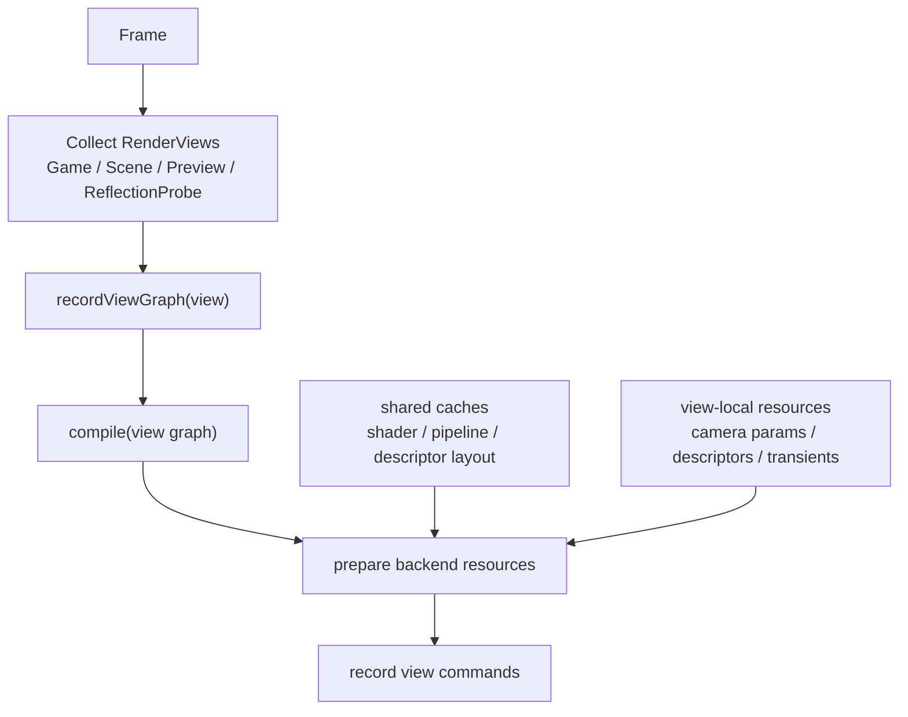

- 当前 sample 只有一个 game view / swapchain target；editor viewport coordinator 已先在 editor host 侧支持一帧多个
  keyed view request，作为后续 Game View / asset preview / multi-view diagnostics 的小闭环。
- Game View、Scene View、Preview View 共享 renderer、RenderGraph 和 Vulkan backend caches，但各自拥有
  view-local camera constants、render target、view flags、culling/layer mask、descriptor sets、transient resources
  和 compiled graph。Scene View camera state 可以由 editor viewport 拥有，但进入 renderer 后必须变成普通
  RenderView camera/per-view constants；差异只落在 view kind、overlay/debug/show flags、filtering 和 refresh
  intent 上。
- Scene/debug viewport flags 已先作为 view-local intent 接入 editor viewport request/result，并完成 flagged texture
  metadata 的 acquire roundtrip。Grid 已沿该路径进入 renderer-owned world-grid pass；transform gizmo、selection outline
  和 wire overlay 在真实 provider/render bridge 前保持 pending/effective-off。Scene-only authoring pass 不能污染
  Game View graph；Game debug pass 必须显式 opt in。
- RenderGraph handle 只在单个 view graph 内有效；跨 view 共享资源必须由 resource manager 拥有并 import。

## RenderGraph 编译与执行流程

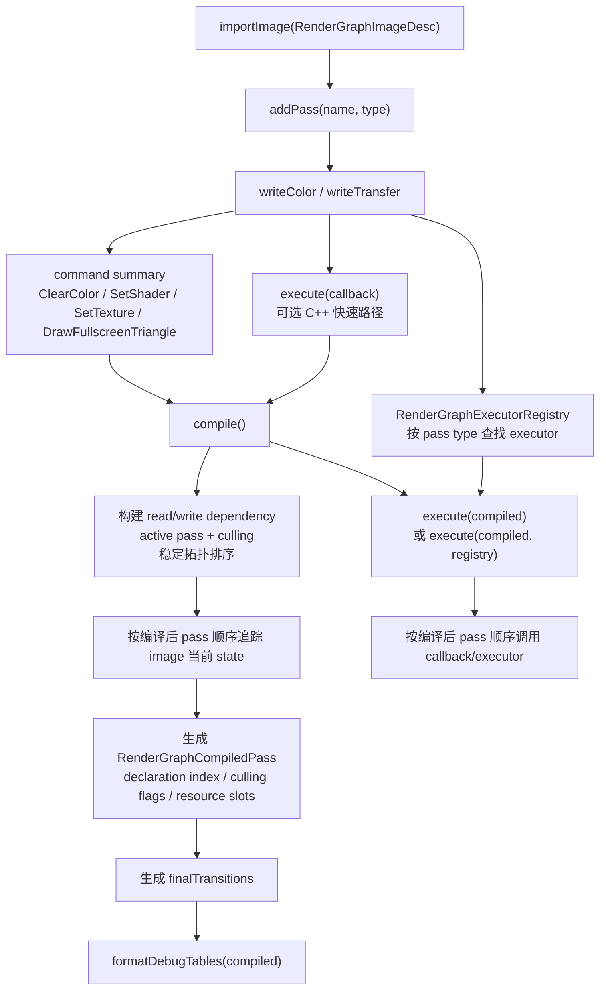

每帧职责边界：

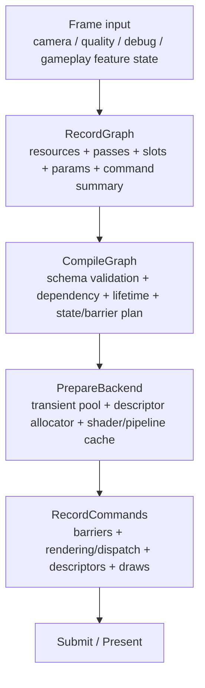

- `RecordGraph` 可以每帧运行，并允许普通 C++ 控制流决定哪些动态 feature 进入当前帧 graph。未来脚本
  VM 也只应运行在这一段。
- `Frame input` 中的 camera/view/projection、render target、culling/filtering、show/debug flags、visible draw
  packets 和 model/material 数据必须在 `RecordGraph` 前归约成 renderer-owned 数据合同；需要这些数据的 pass
  通过 typed params、buffer/descriptor、push constants 或等价 binding 显式消费。diagnostics 只能记录结果，
  不能作为下一段渲染输入。
- `compile()` 负责校验 pass/resource 声明、构建 read/write dependency、根据 `allowCulling` /
  `hasSideEffects` 计算 active pass、稳定拓扑排序、resource lifetime、final transitions、
  barrier/layout plan、transient allocation plan 和调试表信息。
- `compile()` 不负责 shader 编译、reflection 解析、descriptor set layout 创建、pipeline layout 创建、
  graphics/compute pipeline 创建或长期 GPU resource 创建。
- `PrepareBackend` 负责用 compiled graph 消费 shader cache、pipeline layout cache、pipeline cache、
  descriptor allocator 和 transient resource pool。动态参数在这里或 RecordGraph 前进入 per-frame param
  block、push constants 或 descriptor 更新。
- `RecordCommands` 按 compiled graph 顺序录制 Vulkan 命令，不再改变 graph topology，也不回调脚本 VM。
- 动态 feature 应在 record/build 阶段决定是否把 pass 放进 graph；轻量常驻 feature 用参数控制，昂贵或
  需要额外 RT/buffer 的 feature 用 active predicate 控制是否 record。

当前抽象状态：

- `Undefined`
- `ColorAttachment`
- `ShaderRead(fragment/compute)`
- `DepthAttachmentRead`
- `DepthAttachmentWrite`
- `DepthSampledRead(fragment/compute)`
- `TransferSrc`
- `TransferDst`
- `Present`

当前 write 声明：

- `writeColor("target", image)` / `writeColor(image)` 会要求 image 进入 `ColorAttachment`；旧的
  无 slot API 暂时等价于 `"target"`。
- `writeTransfer("target", image)` / `writeTransfer(image)` 会要求 image 进入 `TransferDst`；旧的
  无 slot API 暂时等价于 `"target"`。
- `readTransfer("source", image)` / `readTransfer(image)` 会要求 image 进入 `TransferSrc`，用于显式
  GPU-side copy/read 操作；旧的无 slot API 暂时等价于 `"source"`。
- `copyImage("source", "target")` 只描述同一 pass 内从 `TransferRead` source 到 `TransferWrite` target 的
  RenderGraph command；实际 Vulkan copy 仍由后端执行器基于 slot binding 录制。
- `copyBufferToImage("source", "target")` / `copyImageToBuffer("source", "target")` 分别描述 buffer/image
  transfer copy command；实际 Vulkan copy 仍由后端执行器基于 slot binding 录制。
- `readTexture("source", image, shaderStage)` 会要求 image 进入 `ShaderRead(shaderStage)`；当前 smoke
  已验证 fragment shader-read，fullscreen texture 路径已执行真实 descriptor sampling。
- `writeDepth("depth", image)` 会要求 image 进入 `DepthAttachmentWrite`。
- `readDepth("depth", image)` 会要求 image 进入 `DepthAttachmentRead`。
- `sampleDepth("depth", image, shaderStage)` 会要求 image 进入 `DepthSampledRead(shaderStage)`。
- 同一 pass 内同一 image 现在不能跨 access group 重复声明。Unity/RDG 工具里的 read-write 展示是访问摘要；
  Asharia Engine 后续若支持 attachment read/write、blend/load、storage read/write、framebuffer fetch 或
  grab/copy-to-temp，必须先新增明确 state/API 和 Vulkan feature/layout/access 映射。
- compiled pass 和 executor context 已携带 `colorWriteSlots` / `shaderReadSlots` / `transferWriteSlots`，
  `--smoke-rendergraph` 会验证 slot name、shader stage 并在调试表输出 slot。
- `setParamsType("...")` / `setParams(type, params)` 已接入最小 params type id 和 POD payload；
  compiled pass 和 executor context 会携带 type id 与 payload bytes。
- `RenderGraphSchemaRegistry` / `RenderGraphPassSchema` 已接入最小 schema 验证：按 pass type 校验
  params type、允许的 slot、必需 slot 和允许的 command kind。
- `renderer_basic/render_graph_schemas.hpp` 已集中维护内建 clear、dynamic clear、transient present、
  triangle、depth triangle、mesh3D、draw-list 和 fullscreen pass 的 type、params type、POD params
  与 schema registry helper；真实 renderer-basic Vulkan 路径现在通过这套共享 schema compile。
- `--smoke-rendergraph` 已覆盖每个 renderer-basic builtin pass 的 missing slot、invalid slot 和
  wrong params type 负向编译路径。
- `renderer_basic_vulkan` 的 fullscreen、transient、depth、mesh 和 draw-list callbacks 已按
  `source` / `target` / `depth` named slot 查询 Vulkan binding，避免 callback 隐式捕获资源 handle。
- `PassBuilder::allowCulling()` 和 `PassBuilder::hasSideEffects()` 已接入；schema 也可声明
  `allowCulling` / `hasSideEffects`。默认 pass 不参与 culling，写 imported image 的 pass 会作为外部输出保留。
- `pass.type` 是当前 typed executor key，并会继续演进为执行模型 / pass opcode。它不等同于
  RenderQueue 或 shader tag；脚本/工具未来应通过同一套 C++ builder 语义生成 pass 声明、资源访问、
  typed params 和受控 command context。
- 受控 command context skeleton 已接入：`RenderGraphCommandList` 可记录后端无关的 command summary，
  当前覆盖 clear、shader/pass 名称、texture slot binding、标量/向量参数和 fullscreen triangle draw。
  command summary 会进入 compiled pass、executor context 和 debug table；fullscreen texture smoke 已验证
  `setTexture`、`setVec4` 和 `drawFullscreenTriangle` 的最小 Vulkan 执行路径。

## RenderGraph 到 Vulkan 的翻译流程

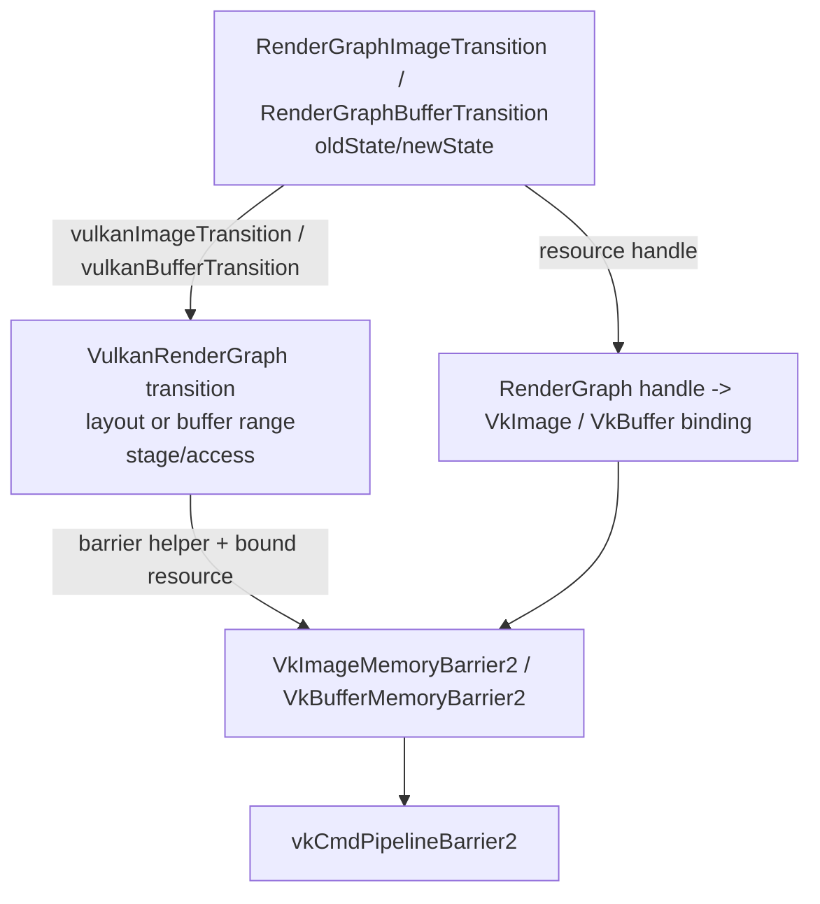

状态：

- `vulkanImageTransition` 已实现。
- `vulkanImageBarrier` 已实现。
- `vulkanImageUsage`、`vulkanImageTransition` 和 `vulkanImageBarrier` 已覆盖 `TransferSrc`，映射到
  `VK_IMAGE_LAYOUT_TRANSFER_SRC_OPTIMAL`、`VK_PIPELINE_STAGE_2_TRANSFER_BIT` 和
  `VK_ACCESS_2_TRANSFER_READ_BIT`。
- `vulkanBufferUsage`、`vulkanBufferTransition` 和 `vulkanBufferBarrier` 已实现；当前覆盖 `TransferRead`、
  `TransferWrite`、`HostRead`、`ShaderRead(fragment/compute)` 和 `StorageReadWrite(compute)`。
- `recordRenderGraphTransitions` 已要求调用方提供 `VulkanRenderGraphImageBinding` 表，不再隐式假设所有 transition 都作用在当前 swapchain image。
- `--smoke-rendergraph` 已验证 `TransferDst -> Present` 的 layout、stage、access 与 `VkImageMemoryBarrier2` 字段。
- `--smoke-rendergraph` 已验证 `TransferDst -> ShaderRead(fragment)` 映射到
  `VK_IMAGE_LAYOUT_SHADER_READ_ONLY_OPTIMAL`、`VK_PIPELINE_STAGE_2_FRAGMENT_SHADER_BIT` 和
  `VK_ACCESS_2_SHADER_SAMPLED_READ_BIT`。
- `--smoke-rendergraph` 已验证 `TransferRead`/`TransferSrc` dependency、diagnostics、`copyImage` command schema、
  missing/invalid slot 失败路径，以及 `TransferSrc -> TransferDst` copy 准备 barrier 的 Vulkan 字段。
- `--smoke-texture-upload` 已验证 texture product upload/readback 的 RenderGraph diagnostics 同时暴露
  `CopyBufferToImage` 和 `CopyImageToBuffer`，并通过真实 Vulkan copy 对比 product payload 字节。
- `--smoke-rendergraph` 已验证 buffer `Undefined -> TransferWrite`、`TransferWrite -> ShaderRead(fragment)`、
  `ShaderRead(compute)` usage、`TransferWrite -> StorageReadWrite(compute)`、
  `StorageReadWrite(compute) -> TransferRead` 和 `TransferWrite -> HostRead` 映射到
  `VkBufferMemoryBarrier2` 所需 stage/access 字段。
- `--smoke-frame` 已消费 RenderGraph 编译结果来录制 clear frame barriers。
- `--smoke-rendergraph` 已输出 resources、passes、dependencies、slots、commands、transitions、
  transients 的 Markdown 调试表格，并验证 pass type、params type、slot schema、command summary、
  transient lifetime plan 和最小 dependency sort；当前 smoke 故意把 transient reader 声明在 writer 前，
  编译结果会按 dependency 把 writer 排到 reader 前执行；同时覆盖无 producer transient read、缺失
  schema，以及 renderer-basic builtin pass missing slot / invalid slot / wrong params type 的负向编译路径，
  确认错误不会进入 pass callback；也覆盖可剔除 unused transient writer
  被移出 compiled passes、side-effect pass 被保留且 culled pass callback 不执行。
- `--smoke-transient` 已验证 transient image 的 first/last pass、final access、非 backbuffer transition、
  Vulkan adapter mapping、真实 image/image view/VMA allocation 和 binding，以及 transient image pool 的
  create/release/retire/reuse counter。

## 下一步接入计划

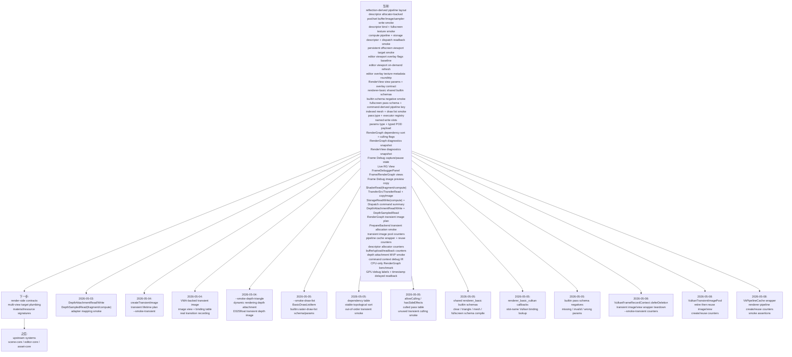

建议推进顺序：

1. 保持 `VulkanFrameLoop` 基础 target 不依赖 RenderGraph。
2. 保持 `renderer-basic` 后端无关，Vulkan 命令录制放在 `renderer-basic-vulkan`。
3. 保持 RenderGraph 调试表格只输出抽象 RG 信息；Vulkan layout/stage/access 调试表应放在 Vulkan adapter 层。
4. Slang reflection JSON、固定 descriptor set layout RAII、reflection-derived pipeline layout 和非空 descriptor signature smoke 已接入；descriptor bind 和 fullscreen texture pass 已有 `--smoke-fullscreen-texture` 真实 Vulkan 路径，fullscreen clear/tint 已开始走 typed params payload；`--smoke-mesh` 已验证最小 indexed mesh；`--smoke-mesh-3d` 已验证最小 3D cube、depth 和 MVP push constants；`--smoke-draw-list` 已验证多 item indexed cube draw 和 `builtin.raster-draw-list` typed pass；`--smoke-compute-dispatch` 已验证 compute pipeline、storage descriptor、`vkCmdDispatch` 和 GPU 写入 readback。
5. `pass.type` 只负责执行模型 / typed pass 分发；RenderQueue、shader pass tag 和 RendererList 等到 mesh/material 阶段再引入。
6. Scene/world、selection、asset import/cache、inspector 和 Play Mode 状态不属于 render 层。它们由
   `scene-core`、`editor-core`、`asset-core` 或 app/editor host 拥有；render 侧只消费 immutable snapshot、
   draw packet、resource handle、material/resource signature 和 RenderView target。
7. fullscreen、postprocess 和 depth 前必须先补 `ShaderRead`、`DepthAttachmentRead/Write`、`DepthSampledRead` 等抽象 state，以及对应 Vulkan layout/stage/access 翻译；`ShaderRead` 需要携带 shader stage/domain，depth attachment 读写不能和 depth texture 采样混用。后续同图 read/write 只能通过明确的 attachment read/write、storage read/write、framebuffer fetch 或 `readTransfer` + `copyImage` 语义进入，不放开模糊的 `readTexture + writeColor`。
8. transient image 和 depth attachment 必须同步扩展 RenderGraph state、Vulkan binding 表、VMA allocation 和 smoke。
9. 受控 command context 已用 C++ 原型化未来脚本 API；`setTexture` 和 fullscreen draw 已有最小 Vulkan 验证路径，fullscreen pass 已开始从 command summary 派生当前 pipeline key，并通过 typed params payload 传递 clear/tint 数据。
10. mesh asset 路线已从 indexed quad smoke 走到最小 draw list；后续 asset-core 拥有 GUID/import/cache，
    renderer/RHI 只消费 resource handle、product data 和 upload request，不提前暴露逐 object 脚本 draw loop。
11. RenderGraph diagnostics snapshot 已提供结构化、后端无关的 pass/resource/access edge/dependency/transition/lifetime
    数据，并已挂到 `BasicRenderViewDesc` 的可选 `BasicRenderViewDiagnostics` 输出槽。`RenderGraphPanel` 作为
    Live RG View 显示最近一次 RenderView compile 后已经确定的数据；`FrameDebuggerPanel` 在同一面板内提供 Frame
    和 RenderGraph 两个切换视图，Frame 视图按左 pass/execution event、右详情/预览组织，RenderGraph 视图显示
    `EditorFrameDebugger` 捕获并冻结的一帧 snapshot。Frame Debug 的主选择 id 来自 renderer execution event
    stream；RenderGraph command summary 只作为来源说明和 RG View 辅助诊断。pass graph visualization 只是 snapshot
    的只读节点表现，不能成为可编辑 RenderGraph authoring UI。editor UI 不应解析 `formatDebugTables()` 文本。
12. Frame Debug intermediate image preview v1 只在 paused Frame Debug 中通过 editor-controlled replay/copy 录制
    `builtin.debug-image-copy`，把 captured snapshot 中选中的 graph-local color image copy 到 editor-owned sampled
    preview target。Frame Debug 主面板现在先选择 renderer execution event，并从冻结 diagnostics snapshot 中解析
    该 event 所属 pass 的 previewable color 输出；pass/event 预览会在 replay graph 中继承 captured view
    kind、camera、frame params 和 overlay intent，并把 debug image copy 插入选中 RenderView pass 之后，避免只看到最终
    RenderViewTarget。graph-local image 选择仍作为 resource override；没有 pass 约束时按最终资源图 preview。normal
    RenderView recording 继续暂停；不调用 `vkDeviceWaitIdle`，不做 CPU readback/export。
13. RenderView 现在携带 renderer-owned view kind、camera/view/projection params、per-view frame params、overlay
    color load/store、blend mode 和 data-only debug world-line route。Scene View panel 现在持有 editor-owned
    navigation/camera state；这是输入所有权，不是 renderer 矩阵旁路。Scene View request 携带 camera context，
    并在 `EditorViewportCoordinator` 边界 bridge 到 `BasicRenderViewCamera`；renderer/basic 不消费
    `EditorViewportOverlayFlags`、ImGui state 或 editor navigation state。`editorViewportCameraForExtent()`
    负责 resize 后重算投影，`unprojectEditorViewportPoint()` 提供 viewport-local pixel（左上角原点，Y down）
    到 world ray 的后端无关语义；该 ray 用 inverse view-projection 计算，`origin`/`nearPoint` 位于
    near clipping plane，`farPoint` 位于 far clipping plane。当前 `recordViewFrame()` 会在
    `BasicRenderViewOverlayDesc::worldGrid` enabled 时插入 `builtin.render-view-world-grid` fullscreen
    overlay pass，用 inverse view-projection / optional fade / per-view LOD / grid color push constants 绘制
    XZ world grid；`fadeStart == fadeEnd == 0` 时不做距离淡出，RenderView policy 只按 camera 到 grid plane
    的垂直距离计算整帧统一的 1/2/5/10 spacing，不按水平距离或片元距离改变 LOD，低高度锁定 base spacing，shader 只消费 `GridLodSettings`。
    `CameraPositionNear` 仍记录在 RenderGraph command summary 里作为 diagnostics。Scene View panel 从 `EditorSettings::sceneGrid`
    读取 plane、minor/major spacing、fade、opacity 和 color，
    经 `EditorViewportRequest::worldGrid` 交给 `EditorViewportCoordinator`，再转换为 renderer-owned
    `BasicRenderViewWorldGridDesc`；settings 缺省值来自 Scene grid overlay contribution 的 built-in 默认值，
    不拥有 renderer/Vulkan 类型。
    overlay intent、world-grid desc 和 source overlay id 会进入 RenderView diagnostics；Frame Debug replay 会使用
    capture 中的 world-grid desc，而不是重新猜默认 grid 参数。只有存在 `BasicDebugWorldLine` 时才插入
    `builtin.render-view-overlay` pass，把 camera/frame/debug-line count 作为 typed params 与 command summary
    记录，并由 `renderer_basic_vulkan` 把 world line 投影为 line-list vertex buffer 绘制到目标 attachment。
    mesh/draw-list smoke 仍在 renderer 内部构造 MVP。
    后续 scene mesh、selection/gizmo 和更多 debug line pass 必须继续沿这条 RenderView route 接入。
14. SRP 不是当前 RenderView/Grid/Frame Debug/overlay 基础阶段的交付项；它只作为后续消费者约束。
    当前阶段的验收是保持依赖方向、scene/pass input 和 RenderGraph 声明路线不阻塞未来 SRP，而不是实现
    RenderPipelineAsset、RendererFeature、RendererList 或脚本化 pipeline authoring。
15. RenderGraph compiler 已能根据同一 image 的 producer/read 关系做稳定拓扑排序，并已用负向 smoke
    锁住无 producer transient read、缺失 schema 和 builtin pass schema mismatch 的编译期失败路径；显式 culling 已能移除 unused
    transient writer 并保留 side-effect pass。下一步补循环诊断细节、更多非法依赖错误报告和更细的
    culling 策略。
