# 流程架构图

本文档记录当前代码真实流程。每次实现或重构后都需要同步更新，用来帮助审查架构走向、包边界和下一步开发顺序。

Viewport V11 readiness: native stream Ready/close/fault advances a mutex-protected revision
and wakes its condition variable. EngineBridge permits one bounded asynchronous waiter and
drains it before stream destruction. Presentation rechecks state and obtains the frame through
the existing take/lease path; notification is not GPU completion. Candidate preparation resumes
on UI and retains staged consumer completion and atomic publication.
See Studio ADR-0011 and ADR-0006 for ownership and scheduling evidence.

Material override validation: mutable CPU `.mat` document → shared `validateMatDocument`
(identity, duplicate IDs, value kind/width and finite scalar/vector values) → shader override comparison.
Invalid documents return an `InvalidOverride` diagnostic without usable diffs. IO serialization and
resolution share the same validator.

## Authored numeric material native consumption (#432)

`.shader` parser/emitter (explicit material set 1) → build-time Slang/SPIR-V validation and reflection →
`.mat` IO + reflected numeric packing → renderer-owned immutable `BasicGpuMaterialProgram` and
`BasicGpuMaterialOwner::update` → revisioned binding on `BasicRenderViewSceneDesc` → existing GPU Mesh
draw with a Fragment ShaderRead parameter buffer and descriptor set 1 → frame completion retention.
Parameter changes allocate a new immutable buffer/set and reuse the program/pipeline. Failed or stale
updates preserve active; old references expire after their final GPU use. Backend receives paired
validated bytes/reflection, never source paths, a compiler session, live World or Avalonia objects.

The first native boundary is Solid/unlit, one material per GPU Mesh batch, fixed mesh vertex ABI and
one numeric fragment constant buffer (16 KiB/256 fields maximum). The sample fixture runs production
parser/emitter and packing code; it does not implement a Studio GUID resolver or generic cooked shader
loader. Zero-argument generated entry wrappers remain a separately recorded limitation.
`renderer_basic_vulkan` exposes its existing `shader_slang` dependency publicly because its material
creation input includes reflection types; `renderer_basic` remains backend-independent. Sample host
adds explicit authoring/adapter/instance dependencies and a build-only shader fixture adapter.

## GPU Mesh native consumption (#419)

`MeshResourceStore` verified artifact → immutable CPU lease → `BasicGpuMeshOwner::queue` bounded
position/color + uint32 staging/device buffers → RenderGraph CopyBuffer/final VertexRead and IndexRead →
host confirms successful submission → completed frame epoch publishes candidate → immutable RenderView
binding and revisioned DrawIndexed → frame-owned retained reference → fence retirement.
A failed/cancelled candidate never mutates the active resource. Each owner and each view batch currently
select one mesh; multiple submesh draws reuse it. Resident limits include staging and externally retained
old versions. `renderer_basic_vulkan` now depends on `resource_runtime`; the backend-neutral target does not.
Sample viewer uses tool-side `mesh_product_writer` only to prepare verified smoke artifacts. Studio continues
using its existing validation mesh binding.

The acquire-image first layout transition now includes its first-use stage in its source scope, connecting
the frame's semaphore wait to the transition. This applies to the raw frame clear and the renderer's
explicit acquired-image graph binding; ordinary offscreen/transient Undefined transitions retain their
existing behavior. Reference: [Khronos swapchain synchronization examples](https://docs.vulkan.org/guide/latest/synchronization_examples.html).

### Numeric material parameter CPU flow

`MatDocument + ShaderDocument + explicit numeric member offsets/block size ->
material-instance::packMatParameters -> owned little-endian bytes + existing warnings`.
The call selects overrides/defaults, rejects invalid values/layouts and zeroes padding within a
256-property/64-KiB bound. It performs no IO, reflection extraction, GPU binding or resource ownership.
The reflected adapter below supplies compiler member facts; product identity must still be retained
before renderer consumption. Descriptor signatures do not contain member offsets. See
[the material packing boundary](../systems/shader-material-authoring.md#numeric-parameter-packing-boundary).

### Reflected numeric material layout flow

`Slang constant-buffer element layout -> asharia-slang-reflect parameterMembers/parameterBlockSize ->
ShaderDescriptorBindingReflection.parameterBlock -> shader-material-adapter::packReflectedMaterialParameters
-> material-instance packing -> owned layout + bytes`.
The adapter now publicly depends on `material-instance`; `shader-slang` remains independent of material
authoring and GPU state. Cross-stage merge checks exact member-layout agreement. Legacy or unsupported
aggregate layouts are readable but cannot enter this numeric packing path. Descriptor hashes are still
descriptor-only; the consumer must retain compiled shader identity with the returned member layout.
This path proves CPU compiler-layout compatibility, not runtime GPU binding or product activation.

## 维护规则

- 代码改变了运行流程、包依赖、资源状态、同步路径或 smoke 命令时，必须更新本文档。
- 图中的“已接入”表示当前运行路径真实使用；“smoke 验证”表示已有测试入口但尚未接入主 frame loop；“下一步”表示目标方向。
- RenderGraph 图层必须保持后端无关；Vulkan layout、stage、access、barrier 翻译只允许出现在 `packages/rhi-vulkan`。

## 当前包依赖


```mermaid
flowchart TD
    App["apps/sample-viewer<br/>MVP host + smoke harness"]
    EditorApp["apps/editor<br/>Dear ImGui host + editor smoke harness"]
    Core["engine/core"]
    Platform["engine/platform"]
    HostRuntime["engine/host-runtime<br/>provider v4 + Eligibility V2<br/>callback table + ProcessScope V2"]
    Window["packages/window-glfw"]
    Profiling["packages/profiling"]
    Schema["packages/schema"]
    Archive["packages/archive"]
    CppBinding["packages/cpp-binding"]
    Persistence["packages/persistence"]
    Reflection["packages/reflection"]
    Serialization["packages/serialization"]
    SceneCore["packages/scene-core"]
    SceneRendering["packages/scene-rendering<br/>revisioned mesh extraction"]
    SceneCoreIo["packages/scene-core<br/>asharia::scene_core_io"]
    SceneNative["packages/scene-core<br/>asharia::scene_native C ABI adapter"]
    ProjectCore["packages/project-core"]
    ProjectCoreIo["packages/project-core<br/>asharia::project_core_io"]
    ProjectNative["packages/project-core<br/>asharia::project_native C ABI"]
    ProjectBootstrap["packages/project-bootstrap<br/>reader + ProcessApplicationV1 provider"]
    Studio["apps/studio<br/>Avalonia Shell + composition"]
    StudioApplication["Studio.Application<br/>ProjectSession + SceneDocument + Catalog + Selection + Viewport picking"]
    StudioBridge["Studio.EngineBridge<br/>project + scene + catalog adapters"]
    AssetCore["packages/asset-core"]
    AssetCoreIo["packages/asset-core<br/>asharia::asset_core_io"]
    AssetArtifact["packages/asset-artifact<br/>runtime-safe verified bytes"]
    AssetPipeline["packages/asset-pipeline"]
    MeshProduct["packages/mesh-product<br/>runtime-safe reader + tool writer"]
    EditorContent["packages/editor-content<br/>UI-neutral catalog query"]
    EditorContentNative["packages/editor-content<br/>catalog C ABI adapter"]
    ResourceRuntime["packages/resource-runtime"]
    MaterialCore["packages/material-core"]
    ShaderAuthoring["packages/shader-authoring"]
    MaterialInstance["packages/material-instance"]
    ShaderMaterialAdapter["packages/shader-material-adapter"]
    RG["packages/rendergraph"]
    RhiVk["packages/rhi-vulkan<br/>asharia::rhi_vulkan"]
    RhiVkRG["packages/rhi-vulkan<br/>asharia::rhi_vulkan_rendergraph"]
    Renderer["packages/renderer-basic<br/>asharia::renderer_basic"]
    RendererVk["packages/renderer-basic<br/>asharia::renderer_basic_vulkan"]
    Shader["packages/shader-slang"]
    AssetProcessor["tools/asset-processor"]
    ImGui["Dear ImGui<br/>Conan package + GLFW/Vulkan backends"]

    Platform --> Core
    Window --> Core
    Window --> Platform
    Schema --> Core
    Archive --> Core
    CppBinding --> Core
    CppBinding --> Schema
    Persistence --> Core
    Persistence --> Schema
    Persistence --> Archive
    Persistence --> CppBinding
    Reflection --> Core
    Serialization --> Core
    Serialization --> Reflection
    SceneCore --> Core
    SceneRendering --> AssetCore
    SceneRendering --> SceneCore
    SceneRendering --> Renderer
    SceneCoreIo --> SceneCore
    SceneCoreIo --> Archive
    SceneNative --> SceneCore
    SceneNative --> SceneCoreIo
    ProjectCore --> Core
    ProjectCoreIo --> ProjectCore
    ProjectCoreIo --> Archive
    ProjectNative --> ProjectCoreIo
    ProjectBootstrap --> HostRuntime
    ProjectBootstrap --> ProjectCoreIo
    Studio --> StudioApplication
    Studio --> StudioBridge
    StudioBridge -.P/Invoke.-> ProjectNative
    StudioBridge -.P/Invoke.-> SceneNative
    StudioBridge -.P/Invoke.-> EditorContentNative
    AssetCore --> Core
    AssetCoreIo --> AssetCore
    AssetCoreIo --> Archive
    AssetArtifact --> Core
    AssetArtifact --> AssetCore
    AssetPipeline --> AssetCore
    AssetPipeline --> AssetArtifact
    MeshProduct --> AssetCore
    AssetPipeline --> MeshProduct
    AssetPipeline -.metadata read.-> AssetCoreIo
    AssetPipeline --> ShaderAuthoring
    EditorContent --> ProjectCoreIo
    EditorContent --> AssetCore
    EditorContent -.metadata read.-> AssetCoreIo
    EditorContent -.snapshot planning.-> AssetPipeline
    EditorContentNative --> EditorContent
    ResourceRuntime --> AssetCore
    ResourceRuntime --> AssetArtifact
    ResourceRuntime --> MeshProduct
    MaterialCore --> Core
    ShaderAuthoring --> Core
    MaterialInstance --> Core
    MaterialInstance --> Archive
    MaterialInstance --> AssetCore
    MaterialInstance --> ShaderAuthoring
    ShaderMaterialAdapter --> Core
    ShaderMaterialAdapter --> MaterialCore
    ShaderMaterialAdapter --> Shader
    ShaderMaterialAdapter -.generated reflection smoke.-> ShaderAuthoring
    RG --> Core
    RhiVk --> Core
    RhiVkRG --> RhiVk
    RhiVkRG --> RG
    Renderer --> Core
    Renderer --> RG
    Renderer --> Shader
    RendererVk --> ResourceRuntime
    RendererVk --> Renderer
    RendererVk --> RhiVk
    RendererVk --> RhiVkRG
    App --> Core
    App --> Profiling
    App --> Reflection
    App --> Serialization
    App --> Window
    App --> RG
    App -->|asset product/upload smoke| AssetPipeline
    App -->|authored local TRS GPU smoke| SceneRendering
    App -->|current MVP/smoke wiring| RhiVk
    App -->|smoke validation only| RhiVkRG
    App -->|CPU-only benchmark schemas| Renderer
    App -->|selected sample renderer| RendererVk
    AssetProcessor --> AssetCoreIo
    AssetProcessor --> AssetPipeline
    AssetProcessor --> MeshProduct
    AssetProcessor --> ProjectCoreIo
    AssetProcessor --> ResourceRuntime
    EditorApp --> Core
    EditorApp --> Archive
    EditorApp -->|project descriptor IO| ProjectCoreIo
    EditorApp -->|catalog view + metadata IO| AssetCore
    EditorApp -->|.ameta text IO| AssetCoreIo
    EditorApp -->|snapshot planning only| AssetPipeline
    EditorApp -->|shared catalog query| EditorContent
    EditorApp -->|selection EntityId values| SceneCore
    EditorApp -->|authored scene mesh extraction| SceneRendering
    EditorApp --> Window
    EditorApp --> RhiVk
    EditorApp --> RendererVk
    EditorApp -->|shader build helper| Shader
    EditorApp --> ImGui
```

当前约束：

- 这张图按 CMake target 事实和已落地 package manifests 的 `targetDependencies` 校准；`dependencies`
  是 package-level 粗粒度边界，不能替代 target-level 依赖审查。
- `engine/platform` 当前是预留 boundary target，只传递 `core` 依赖，不导出公共 header；真实
  GLFW/window/surface glue 仍在 `window-glfw`。
- `engine/host-runtime` 的 `asharia::host_runtime_contract` 导出 callback/token V1、`ProcessApplicationV1`、public contribution helper 与
  provider V4 registrar；provider implementation 仍只能经 PRIVATE `asharia::host_runtime_provider_bridge` 构造/消费 opaque token。
  `asharia::host_runtime_registration` 实现 move-only recorder、预留 capacity、sticky first error、frozen callback table、table-owned
  canonical RegistrationSnapshot v2、private process-local type/accessor evidence 与无 IO JSON renderer；registration 不调用 lifecycle
  callback 或 payload accessor。
  `asharia::host_runtime_activation_eligibility` 已硬切 Eligibility V2：T3/C6 private attachment 经
  `asharia::host_runtime_current_image_provider_bridge` 封存 generated current-image descriptor，Stage 1 在 provider invocation 前校验
  T3/C6/provider-v4/Snapshot-v2 tuple、ProcessScope projection、process/control-thread epoch 与一次性 claim；recording 完成后校验
  composition generation/Blueprint digest，Stage 2 再把 authority 绑定到同一 exact table instance。
  `asharia::host_runtime_process_scope` 只消费 admitted owner，preflight 按 sealed Blueprint process order 建立 fixed contribution slots。
  `ProcessScopeExecutorV2::start()` 执行 create/activate、per-factory accessor staging/atomic lease commit，并在全部 factories 成功后开放
  typed registry；weak view/handle 的 query/borrow 对错误 thread、stale epoch、revoking/revoked/expired generation fail closed。rollback/stop
  顺序是 reverse quiesce → `Revoking` → reverse lease revoke → reverse deactivate/destroy → `Revoked`。targets 只按 contract →
  registration → eligibility → process-scope 方向依赖；ProcessScope 不解析 package JSON、receipt 或 artifact bytes，也不提供其他 scopes、
  jobs/subscriptions lease 或 Bootstrap 状态映射。
  现有 sample/editor app 仍未直接链接 process-scope target；但 renderer 6 attachment 已为 generated Windows Development Host 私有链接
  current-image bridge、exact static providers 与 ProcessScope，renderer 3 normal mode 已形成第一条真实 Host vertical path。
- `asharia::rhi_vulkan` 是基础 Vulkan 后端，不公开依赖 RenderGraph。
- `asharia::rhi_vulkan_rendergraph` 是 RenderGraph/Vulkan 适配层，负责把抽象 graph state 翻译为 Vulkan 类型。
- `renderer-basic` 只描述后端无关的 basic renderer graph 片段。
- `renderer-basic-vulkan` 组合 RenderGraph、Vulkan frame callback 和 Vulkan adapter，承载当前 clear frame orchestration。
- `profiling` 提供后端无关 CPU scope、frame profile 和 JSONL 输出；当前只由 sample-viewer benchmark 使用。
- `schema`、`archive`、`cpp-binding` 和 `persistence` 是新的 schema-first persistence 路线；
  `reflection` / `serialization` 仍作为过渡兼容路径由 sample-viewer smoke 覆盖。
- `scene-core`、`asset-core` 和 `material-core` 是 CPU/headless 数据模型 package，不依赖 renderer、RHI 或 editor。
  `asharia::scene_core_io` 组合 World、stable document/object ID、revision/savepoint 与 archive strict JSON；同 package
  的 `asharia::scene_native` 同时提供 package World smoke ABI 和 production SceneDocument ABI。Document ABI 使用
  generation-safe token、owner-thread operation、expected revision、bulk snapshot、save 与 caller-owned UTF-8 buffer；
  EngineBridge 在 dedicated owner lane 上调用它。它尚不公开 hierarchy/world Transform、component reflection、undo/redo
  或 render extraction。
  `.ameta` 文本 IO 位于可选 `asharia::asset_core_io` target，只额外依赖 `archive` strict JSON facade。
- `project-core` 拥有最小 project descriptor model；`asharia::project_core_io` 通过 `archive` strict JSON facade
  读写 `asharia.project.json`，并以 sibling staging + directory rename 创建最小 `Assets/` 与 cache 布局，拒绝覆盖
  已有目标。`asharia::project_native` 是只依赖 project IO 的窄 C ABI adapter，使用 caller-owned bounded UTF-8
  buffer；它不保存 cook/package profiles、editor workspace、runtime resource state，也不依赖 renderer/Vulkan。
- `packages/project-bootstrap` 是 Engine Distribution 固定选择、项目不可替换的 source boundary。reader/summary target 复用
  `project_core_io`，provider target 发布单例 `ProcessApplicationV1`；factory create/activate 不做 IO，只有 ProcessScope Active 后的
  `run()` 才读取真实 `asharia.project.json` 并返回确定性摘要。
- `mesh-product` 当前拥有 CPU/runtime-safe Mesh Product v1 bounded reader 与独立 tool-side canonical writer；
  它不依赖 `asset-pipeline`、resource-runtime、renderer、RHI 或 editor。
- `asset-artifact` 当前拥有 manifest-relative path、byte budget、exact size 与 V1 product hash 校验，并返回
  owning verified bytes；它不解释 source/importer，不转发 absolute cache root，也不依赖 `asset-pipeline`。
- `asset-pipeline` 当前做 CPU-only metadata discovery / product execution：显式 source/.ameta 条目进入
  discovery facade，输出 deterministic manifest、`AssetCatalog` 输入、product blob 和 diagnostics；它可以
  私有复用 importer-specific package，例如 `mesh-product` writer、texture importer、`material-instance` 和
  `shader-authoring`；当前受限 `.glb` static importer 把 default-scene geometry cook 为 Mesh Product v1，但不做
  watcher、后台 import 调度、GPU upload 或 editor UI，也不把 authoring/importer 语义推入 `asset-core`。
- `resource-runtime` 当前把 exact `AssetProductRecord` 经 `asset-artifact` verified bytes 与 runtime-safe
  `mesh-product` reader 转换为 immutable `MeshProductV1` lease。`MeshResourceHandle` 的 slot generation 与 load
  ticket 的 request generation 分离；active/candidate 独立，stale completion 不 mutation，reload failure 保留旧
  active。IO/parse 可在 worker 执行，但 store mutation 只允许 create owner thread。它不依赖 `asset-pipeline`、
  RenderGraph、renderer、RHI 或 editor，也不创建 GPU resource。
- `editor-content` 是 editor owner domain 的 UI-neutral source boundary。`asharia::editor_content` 只读组合
  `project_core_io`、`asset_core`/`asset_core_io` 与 `asset_pipeline`，产出 project asset catalog snapshot；
  `asharia::editor_content_native` 只增加自有 strict bounded JSON writer 和 caller-owned C ABI。两个 target 都不依赖
  Avalonia、ImGui、`resource-runtime`、renderer、RHI 或 Vulkan，也不执行 importer、watcher 或 product write。
- `material-core` 当前只做 CPU-only material resource signature、shader/signature compatibility validation 和
  material pipeline key hash；它不做 `.mat` IO、asset import、GPU upload、Vulkan descriptor/pipeline cache、
  RenderGraph/RHI changes 或 editor UI。
- `sample-viewer` 当前同时承担 app host 和 smoke harness，所以会直接创建 `VulkanContext` /
  `VulkanFrameLoop`。这是当前 MVP 事实，不是目标产品边界；后续应收敛到 runtime/engine host。
- `sample-viewer` 的 smoke validation 可以直接验证 `rhi_vulkan_rendergraph` 字段；普通运行路径不应把
  Vulkan barrier/layout 细节扩散到 app 层。
- `apps/editor` 当前承担 editor host 和 editor smoke harness。它可以直接链接 ImGui、`window-glfw`、
  `rhi-vulkan`、`renderer_basic_vulkan`、`project_core_io`、`asset_core`、`asset_core_io`、`asset_pipeline`、
  `editor_content` 和 `scene_core`，因为这些都属于 host integration、只读 project/asset snapshot 组装或 editor-owned
  selection value contracts；未来
  `packages/systems/editor` 内部 `editor_domain` target 只能保留 backend-neutral editor state，不能继承 ImGui、Vulkan、renderer 或 importer
  execution 依赖。
- `apps/studio` 是 Avalonia managed Studio shell，不属于 C++ CMake target graph。Project/document 产品链为
  `App/Shell -> Application ProjectSession -> EngineBridge project + scene adapters -> project/scene native ABI`；Scene View
  产品链为 `StudioScenePanelView -> ViewportCompositionControl -> Application ViewportSession -> EngineBridge V11 stream
  -> editor_native bounded scheduler -> process-level viewport RenderThread -> shared viewport producer -> renderer_basic_vulkan`。
  Scene View 选择输入链反向停在 managed owner 边界：`presented front identity + DIP/physical extent -> Application
  presented-model bounds picker -> Transform proxy fallback -> IEditorSelectionService -> Hierarchy/Inspector`；picker 不引用
  Avalonia、EngineBridge、Physics 或 native ABI。selection truth 不写回 SceneDocument、dirty 或 Undo/Redo；其渲染投影是独立
  的前向 view state：`Scene panel selection projection -> ViewportSession.SetSelection(ViewStateRevision, ObjectId) -> EngineBridge
  V11 canonical UUID -> selected draw packet -> Selection Mask -> Outline Composite`。Avalonia content gate 同时核对 target、view-state
  与 request revision，拒绝选择切换前返回的旧像素。
  Scene View 相机导航走另一条瞬态输入链：`Avalonia pointer button/modifier + focus/capture -> logical surface-normalized
  orbit/pan/dolly delta -> Application ViewportSceneCameraNavigation -> ViewportSession.SetCamera -> CameraChanged invalidation ->
  existing V11 camera packet`。Application 数学不引用 Avalonia，gesture 不写 selection/document；native ABI、renderer 与 RenderGraph
  无新增相机导航分支。
  Scene View 变换走第三条输入链：`presented identity + selected ObjectId -> Application axis/ring hit + drag -> transient
  ViewportSession GizmoChanged -> V11 discriminated Transform Gizmo packet -> renderer-owned debug world lines -> pointer release -> one
  ProjectSession transform edit`。move sample 不写 document、不推进 hard presentation fence；Escape/capture/focus/stale revision 取消，
  mutation failure 回滚 authoritative Transform。`W` / `E` / `R` 的模式变更单独推进 presentation fence；Rotate 以 world axis
  有符号角度更新 normalized quaternion，近平行时固定退化到 screen tangent；Scale 沿对象 local axis 以固定起点的正比例因子只改
  一个 scale 分量，保留镜像符号且不穿过零；没有 Physics、Avalonia overlay 或通用 Update/timer。
  V1–V10 frame exports 已硬切删除；Vulkan context、producer、queue submit、retirement 与 shutdown 只由 native owner thread
  执行。Shell 只选择路径、发命令和投影 snapshot；
  ViewModel、Dock 与 Application 不解析 descriptor/scene JSON，也不持有 native/GPU handle。Windows composition root 优先
  选择 Avalonia Vulkan compositor，由专用 presentation adapter 导入 opaque NT image/semaphore；AngleEgl/Software 只保留
  Studio 非渲染功能并让 Scene View 明确降级。Resource Browser 链为
  `ProjectSession -> Application ProjectAssetCatalog -> EngineBridge AssetCatalogGateway ->
  asharia_editor_content_native -> asharia::editor_content`；Application 只拥有 immutable catalog/selection snapshot 与
  request generation，EngineBridge 独占 P/Invoke/strict JSON，Project panel 只拥有 filter/location/row presentation。Release image 精确包含
  project/scene/editor-content/editor 四个 native DLL 与 22 个 renderer-basic shader/reflection 文件，不携带 Slang、
  Vulkan SDK 或 validation layer。当前已有单 SceneDocument、Hierarchy、名称/local Transform Inspector、Create Entity、
  Save/Undo/Redo/dirty、一个可见 Scene View、只读 catalog-backed Resource Browser，以及由 typed selection 驱动的只读
  Asset Inspector；Content 层已有 Mesh Product v1/受限 `.glb` cooked artifact 与 generation-safe runtime CPU mesh
  lease，但 Studio 尚未消费它，仍无 GPU mesh resource、thumbnail/preview service、Play Mode、第二 Viewport、通用 fair scheduler、
  plane/center-uniform/local translate-rotate/snap/multi-select gizmo 或 GPU ID-buffer/triangle geometry picking。当前 input consumer 已覆盖实际呈现 validation model 的 bounds picking、无模型实体的
  Transform proxy 回退，以及 Alt-modified orbit/pan/drag-dolly 与 wheel dolly；单个可见选中 mesh 已有固定橙色 2 px outline，但无
  x-ray、hover、多选、WASD fly、focus-selected 或 camera collision。
- Editor panels 仍由 `EditorPanelRegistry::drawPanels(EditorFrameContext)` 适配每帧能力，但内置
  panel 的 `draw()` 实现会先收敛为 panel-local context，再把最小能力传给 helper。Scene View panel
  不创建 Vulkan objects、不注册 descriptor、不录 command buffer。
- Dear ImGui Asset Browser 当前消费 app-owned `EditorAssetCatalogStore` 提供的 `AssetCatalogView` 和可选 snapshot facts；
  project descriptor 读取、source scan/discovery/snapshot、import planning 和 navigation facts 已由共享
  `asharia::editor_content` query 组合。ImGui fixture/store/icon/report/metadata command 仍归 `apps/editor` host。
  Avalonia Resource Browser 则经专用 native ABI 和 Application owner 消费同一 query truth；两者都不执行 importer、
  不写 product manifest/blob、不创建 runtime asset handle，也不上传 GPU 资源。
- R0 删除的 legacy Scene Tree/Inspector workbench 与旧 public `Asharia.Editor.Selection` 岛保持删除。ADR-0009 的最小
  SceneDocument stable-ID remap现由#388的 `Asharia.Studio.Application.Selection` 跨面板合同承接：Hierarchy与
  Resource Browser发布typed target，Application按project/scene/catalog scope验证、重映射或清除；它不复用C++
  editor-local `EditorSelectionSet`，也不把selection升级为engine truth。

## 当前 Mesh Product runtime CPU resource 流


```mermaid
flowchart LR
    Glb["restricted .glb source"]
    Pipeline["asset-pipeline importer + writer"]
    Manifest["AssetProductRecord<br/>relative path / bytes / V1 hash"]
    Artifact["asset-artifact<br/>bounded read + size/hash verify"]
    Parse["mesh-product reader<br/>immutable MeshProductV1"]
    Completion["owning load completion<br/>slot + request generation"]
    Store["MeshResourceStore owner thread<br/>active / candidate / lastFailure"]
    Lease["MeshResourceLease<br/>shared immutable CPU revision"]
    Gpu["next Slice:<br/>renderer-owned GPU mesh revision"]

    Glb --> Pipeline --> Manifest --> Artifact --> Parse --> Completion --> Store --> Lease
    Lease -.-> Gpu
```

当前 `tools/asset-processor --smoke-mesh-resource` 真实执行实线全链路。Worker 可以执行 Artifact/Parse 并产生
completion，但不能直接 mutation Store；owner thread publish 时同时复验 slot generation、request generation、
selection hash 与 product hash。成功 reload 替换 active revision，失败只记录 `lastFailure` 并保留旧 lease。
虚线 GPU consumer 尚未实现，不能把 CPU lease、Vulkan buffer lifetime 与 fence retirement 合并为同一状态。

## 当前 Windows Development Host 生成、验证与 normal 执行流

这是 #290 构建、#291 callback-table registration、#294 typed contribution evidence、#295 payload accessor、#288 Host executable binding
与 #297 generated current-image normal Host 已落地的 opt-in 工具路径，
不替换现有 sample/editor 开发入口：


```mermaid
flowchart LR
    Plans["Verified Session + Source Build + Blueprint + Binding Plan"] --> Composition["Static composition<br/>renderer 6 / provider v4"]
    Composition --> Template["Windows development Host template<br/>renderer 3"]
    Conan["Caller-provided Conan toolchain + compiler environment"] --> Configure["Controlled final CMake configure"]
    Template --> Configure
    Configure --> Bind["Latest CMake File API exact target binding"]
    Bind --> Build["Build exact Host target"]
    Build --> Rebind["Refresh target + regular-file check"]
    Rebind --> Verify["Restricted Host<br/>build frozen callback table"]
    Verify --> Handoff["#295 table-owned private accessor evidence<br/>RegistrationSnapshot v2 stable projection"]
    Rebind --> SameIndex["#288 same-index target + configured CXX"]
    SameIndex --> Stage["Stream exact executable into owned staging"]
    Handoff --> Stage
    Stage --> StagedVerify["Run staged Host restricted mode"]
    StagedVerify --> Cross["Cross-check exact registrations + re-hash bytes"]
    Cross --> Receipt["Canonical Host Executable Binding Receipt"]
    Receipt --> Deep["Deep-verify closed generation"]
    Deep --> Publish["Single directory rename"]
```

T3 Host template 固定拥有唯一 `main()`、console subsystem 和 build-root 内 runtime output layout；它把 CLI dispatch、restricted
registration verification 与 normal ProcessApplication orchestration 分到小 TU。build adapter 使用参数数组、受控环境与 `shell=False`，
且 Conan 仍由 caller 先行完成。#288 publisher 不信任 mutable build-tree executable 是最终对象：它流式复制到 collector-owned
staging，运行并复验 staged bytes，再以 receipt、snapshot 和 `host/<nameOnDisk>` 形成 content-addressed closed generation。
该 restricted 路径只观察 stable registration/typed-contract evidence 与 artifact bytes，不执行 factory activation/lifecycle，
不启动 Editor UI，也不证明 normal lifecycle 已运行。C6 composition 仍是薄 generated attachment，构建只指定 exact Host target，
且不使用 clean-first。restricted Host 会冻结 callback table，但 synthetic provider 使用 abort probes，验证 registration/receipt
路径对五个 lifecycle callbacks 和全部 payload accessors 的调用次数为零。

Host build、binding assembly 与 deep verifier 只接受 Template renderer 3 + Composition renderer 6/provider v4；pre-current
bindings/Binding Plan 与 renderer/provider tuple 没有 reader 或 adapter。Receipt v1 保持 build/publication artifact binding envelope，
RegistrationSnapshot v2 仍是 stable registration evidence schema。normal startup 走 generated current-image descriptor，不读取或 hash
executable path，也不依赖外部 launch receipt。详见
[Host Executable Binding Receipt v1](adr-host-executable-binding-receipt-v1.md) 与
[Static Typed Contribution Contract Bindings v1](adr-static-typed-contribution-contract-bindings-v1.md)、
[Static Contribution Payload Accessors v1](adr-static-contribution-payload-accessors-v1.md) 和
[Generated Current-Image Host 与 Project Bootstrap v1](adr-generated-current-image-project-bootstrap-host-v1.md)。

## Activation Eligibility V2 与 Project Bootstrap normal Host 流（#297）

下面是 [Generated Current-Image Host 与 Project Bootstrap v1](adr-generated-current-image-project-bootstrap-host-v1.md) 的当前执行路径。
它保留 V1 的 provider-before/after 两阶段与 exact-table affinity，但 active public API 已硬切 V2；四个外部 handoff、artifact identity
和 launch receipt 不再是 normal startup 输入。restricted mode 仍是零 lifecycle/accessor 的 disposable 取证路径；normal mode 才执行：


```mermaid
flowchart LR
    C6["C6 sealed current-image descriptor"] --> Pre["Stage 1 eligibility"]
    Pre --> Admission["PreRegistrationAdmissionV2"]
    Admission -->|"consume once"| Recording["recordAdmittedStaticFactoryProviders"]
    Recording --> Pending["Pending table\nsame process/registration lineage"]
    Pending --> Cross["Stage 2 exact-table affinity"]
    Cross --> Admitted["AdmittedStaticFactoryCallbackTableV2"]
    Admitted --> Prepare["prepareProcessScopeExecutorV2\nzero-callback preflight"]
    Prepare --> Start["start\ncreate -> activate -> publish"]
    Start -->|success| Active["ProcessScope Active"]
    Start -->|failure| Rollback["reverse rollback\nStartFailed"]
    Active --> Registry["registry.single<ProcessApplicationV1>()"]
    Registry --> Borrow["borrow"]
    Borrow --> Run["run(--asharia-project-root ...)"]
    Run --> Project["read real asharia.project.json"]
    Project --> Release["release borrow"]
    Release --> Stop["explicit stop\nreverse quiesce / revoke / deactivate / destroy"]
    Stop --> Stopped["Stopped"]
```

Stage 1 failure 必须发生在任何 provider invocation 前，并校验 T3/C6/provider-v4/Snapshot-v2 tuple、generated ProcessScope projection、
process/control-thread epoch 与一次性 claim。recording 后必须对证 composition generation 和 Blueprint digest；Stage 2 failure 不暴露
descriptor，snapshot byte-identical 的另一张 table 也会因 private lineage 不同而被拒绝。ProcessScope preparation exact-map sealed
process projection，不把 callback table canonical order 当作 lifecycle order；表中不属于 process projection 的 descriptors 保持 inert。

Host 在 Active registry 中同步借用 `ProcessApplicationV1`，固定 Project Bootstrap 只在 `run()` 读取项目描述并输出 project name、
canonical project ID 与 asset source root count 的确定性 JSON；成功和失败路径均先 release borrow，再显式 stop。该 Slice 不发布
`ProjectReady`，也不实现 Editor UI/状态机，但 normal admission 已不再依赖 PRIVATE test issuer 或外部 launch receipt。

## Bootstrap Project-Open Session 流（#298）

[Bootstrap Project-Open Session v1](adr-bootstrap-project-open-session-v1.md) 已在 #297 的 Host vertical 之外增加固定 Editor Image
拥有的 headless 控制面。一个 request 只接受一个 canonical project root；package inspection 从该 root 读取并复验
`asharia.packages.json` 与 `asharia.packages.lock.json` exact bytes，固定 Project Bootstrap Host 随后仍从同一 root 读取
`asharia.project.json`。inspection 不 resolve、不写 lock，也不读取项目描述。

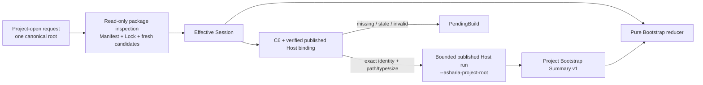
```mermaid
flowchart LR
    Request["Project-open request<br/>one canonical root"]
    Inspect["Read-only package inspection<br/>Manifest + Lock + fresh candidates"]
    Session["Effective Session"]
    State["Pure Bootstrap reducer"]
    Image["C6 + verified published Host binding"]
    Run["Bounded published Host run<br/>--asharia-project-root"]
    Summary["Project Bootstrap Summary v1"]

    Request --> Inspect
    Inspect --> Session
    Session --> State
    Session --> Image
    Image -->|"missing / stale / invalid"| Pending["PendingBuild"]
    Image -->|"exact identity + path/type/size"| Run
    Run --> Summary
    Summary --> State
```

current image 对证覆盖 Effective Session fingerprint、`EngineGenerationId`、host kind、target platform、configuration、C6 generation
与 binding receipt。normal-open 只检查已深度验证 publication 下 artifact 的路径、regular-file 类型与 size，不重新 hash bytes；深度
验证仍属于 build/publication/install/repair 边界。执行入口只使用 binding 指向的 published artifact，不回退到 mutable build target，
binding receipt 也不会作为 activation ticket 传给 Host。

纯 reducer 在每个副作用前归约现有 evidence：非 Ready session 不启动 Host；current image 不可用时得到 `PendingBuild`；exit `65`
得到 `SafeMode`；spawn/timeout/output/protocol/Host lifecycle 失败得到 `FatalDistributionError`；exit `0`、empty stderr 和 strict
versioned summary 才得到 Bootstrap `Ready`。`PendingRestart` 与完整 `ProjectReady` 均不由该 v1 产生。

## Studio Distribution 固定输入物化流（#299）

这是 build/release flow，不是 Project Open 或 runtime activation：

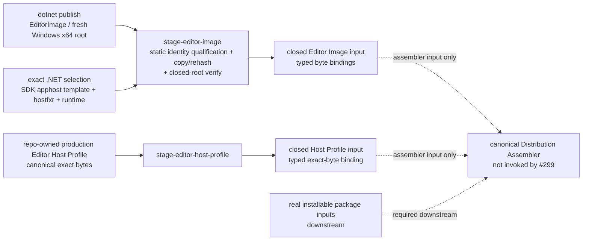
```mermaid
flowchart LR
    Publish["dotnet publish<br/>EditorImage / fresh Windows x64 root"]
    DotNet["exact .NET selection<br/>SDK apphost template + hostfxr + runtime"]
    ImageProducer["stage-editor-image<br/>static identity qualification + copy/rehash<br/>+ closed-root verify"]
    ImageInput["closed Editor Image input<br/>typed byte bindings"]
    ProfileSource["repo-owned production Editor Host Profile<br/>canonical exact bytes"]
    ProfileProducer["stage-editor-host-profile"]
    ProfileInput["closed Host Profile input<br/>typed exact-byte binding"]
    Packages["real installable package inputs<br/>downstream"]
    Assembler["canonical Distribution Assembler<br/>not invoked by #299"]

    Publish --> ImageProducer
    DotNet --> ImageProducer
    ImageProducer --> ImageInput
    ProfileSource --> ProfileProducer
    ProfileProducer --> ProfileInput
    ImageInput -.assembler input only.-> Assembler
    ProfileInput -.assembler input only.-> Assembler
    Packages -.required downstream.-> Assembler
```

两个 producer 都要求 fresh output root；失败或 drift 不返回 successful receipt，也不覆盖已有 root。
#299 不生成 `EngineGenerationId`，不执行 package selection、canonical assembly、#283 installed-generation byte health、
current selection、Project Open 或 Host activation。Editor Image 的资格检查不加载或执行候选输入，也不证明 ABI、
launch behavior 或 runtime health。

## Retired Studio Project Code 隔离 SDK 构建、发布与 activation 流（历史证据）

> R0 hard-cut 已删除整个 ProjectCode control plane、public extension SDK、空public project与Editor Image
> `Asharia.Editor` identity。以下流程只保留为被拒绝实现的历史证据，不是当前能力或恢复模板。

这是 `Asharia.Studio.Application` 的 headless Project Code control plane，不经过 Avalonia storage API；
pinned loader 节点加载 exact 项目 assembly，resolver 只解析已索引 Type，constructor owner 才首次有意执行
目标 module 用户代码。loader 之前的节点不加载候选，constructor 之前的节点都不调用 module
constructor/Configure/Activate：


```mermaid
flowchart LR
    Image["current Editor Image inventory lease"]
    Projection["managed build environment projection"]
    Credential["Windows x64 semantic build credential"]
    Source["canonical project root<br/>exact Editor/**/*.cs"]
    Workspace["immutable implicit SDK workspace"]
    Mirror["short-lived sealed dotnet mirror<br/>controller-owned temp root"]
    Restore["exact SDK probe<br/>explicit restore"]
    Build["build --no-restore<br/>bounded process"]
    Raw["immutable raw output<br/>DLL + ref DLL + PDB + deps.json"]
    Inspect["no-execute artifact inspection<br/>PE + ref marker + PDB + deps"]
    Report["path-free metadata report<br/>content-addressed"]
    Publication["immutable inspected publication<br/>artifact.json + four evidence files"]
    Index["no-load module index<br/>implementation + reference metadata"]
    StagingCandidate["staging candidate receipt<br/>non-empty rebuilt index"]
    Policy["host policy receipt<br/>Pinned + RestartRequired"]
    Snapshot["owned pinned load-image snapshot<br/>implementation DLL + portable PDB"]
    Loader["exact pinned binary host<br/>non-collectible ALC"]
    Modules["exact indexed module Type receipts"]
    Factory["exact pinned module objects<br/>at-most-once constructor owner"]
    Configure["exact configured declarations<br/>at-most-once Configure owner"]
    Definitions["shared module definitions<br/>exact pure projection"]
    ScopeCandidate["invisible Project scope candidate<br/>caller ProjectSession identity"]
    Registration["initial registry registration<br/>exact partition owner"]
    Activation["exclusive initial scope activation<br/>single async owner"]

    Image --> Projection
    Projection --> Credential
    Credential --> Workspace
    Source --> Workspace
    Credential --> Mirror
    Workspace --> Mirror
    Mirror --> Restore
    Restore --> Build
    Build --> Raw
    Raw --> Inspect
    Inspect --> Report
    Report --> Publication
    Publication --> Index
    Index --> StagingCandidate
    StagingCandidate --> Policy
    Policy --> Snapshot
    Snapshot --> Loader
    Loader --> Modules
    Modules --> Factory
    Factory --> Configure
    Configure --> Definitions
    Definitions --> ScopeCandidate
    ScopeCandidate --> Registration
    Registration --> Activation
```

workspace 和 dotnet closure 在每个外部步骤后复验；同 project 新调用会 supersede 旧调用。CLI 环境从空白
allowlist 构造，工作根使用固定短前缀以保留 Windows legacy path budget；最终 candidate 留在 output 同级并以
directory move 发布。失败、timeout、cancel、output overflow、输入/SDK drift 都不发布 raw output，也不修改
active/LKG 状态。#311 的 inspector 只消费 current raw-output lease，在检查前后复验完整输入与四文件 evidence；
它只读 CLR/PDB/JSON metadata，不加载或执行 assembly。#312 publisher 只消费 current raw lease 与 fresh
publication root，内部重新检查后以 BCL bounded stream copy/hash、staged rehash、exact 五文件 closed-tree
verification 和一次 directory rename 发布 path-free、content-addressed immutable evidence。失败、取消、
source/staging drift 或 existing/overlap/reparse path 不覆盖 final root。report/publication 仍不是 loadable
generation candidate。#313 indexer 在扫描前后复验 exact closed publication，只用 BCL
`PEReader`/`MetadataReader`/`CustomAttribute.DecodeValue` 对 implementation 与 reference assembly 建立相同的
声明 surface：一个 entry 必须由 exact `Asharia.Editor` contract 的 `EditorModuleAttribute` 声明，并对应 public
top-level sealed、non-abstract、non-generic、direct `EditorModule` subtype 与 public parameterless constructor。
重复 definition/type、非法 attribute/type shape 或双 assembly surface drift 均 fail closed。空索引是合法事实，
但不代表可加载资格。#314 admitter 只消费 publication receipt，内部重建 index，要求至少一个 module entry，
并在签发前再次复验 publication；candidate identity 只绑定 publication/index identity，不绑定 absolute locator。
receipt 继承 #312 publication root 仅供当前进程后继寻址，`IsCandidateCurrentAsync` 会重新索引并对证完整 surface。
candidate 只允许后继 loader 开始自己的预执行验证，不证明 managed reload eligibility；index/candidate 不创建
current pointer、active、LKG、ALC，也不加载 assembly。#315 selector 只消费 current candidate；当前 v1 是
external-build 且没有 resource/native/global-side-effect 或 cooperative-unload evidence，因此全部
activation/handover 组合都确定性签发 `Pinned + RestartRequired` policy。policy id 只绑定 candidate id 与
稳定 enum/reason，absolute root 仍只是继承 locator；`IsPolicyCurrentAsync` 重算 identity 并复验 candidate。
selector 不加载/执行 assembly，也不创建 ALC。
#316 load-image builder 只消费 current policy，在读取 exact implementation DLL 与 portable PDB 前后复验
policy，并用每文件 256 MiB 上限约束 owned bytes。它再次核对 size/hash，用 BCL PE metadata 拒绝 global
`<Module>` `.cctor`，因为 CLR load 会执行 module initializer。image id 只绑定 policy 与两文件 evidence，
快照只提供不暴露底层 buffer 的新只读流；它不创建 ALC、不加载/执行 assembly，也不推进 current/active/LKG。
#317 pinned assembly loader 在首次 load 前复验 image 与进程 Default Editor contract。loader-owned project
reservation 串行不可逆边界：same image 幂等复用；different image 或 ALC 创建后的失败均要求进程重启。首次
load 创建 path-free、non-collectible custom ALC，只从 owned implementation/PDB streams 加载 exact root
assembly；dependency hook 固定返回 `null`，不探测 path/private/native assets。host 只核对并持有 context、
single Assembly、binding identity 与 MVID；它本身不解析 module type、不 Configure/Activate，也不推进
current/active/LKG。
#318 pinned module type resolver 只消费 #317 host 与内嵌 #313 index。它按 index 顺序对 root Assembly 做
case-sensitive full-name lookup，复核 Type 仍属于 exact Assembly，且保持 public top-level sealed
non-generic concrete direct `EditorModule` shape 与 public parameterless constructor presence。module-type set
identity 只绑定 host/index；resolver 不枚举任意 type、不实例化 attribute/module、不调用 constructor/
Configure/Activate，也不推进 registry/current/active/LKG。
#319 pinned module constructor 只消费该 type set，并由显式 owner 以 per-project reservation 串行 first
execution。它按 index 顺序调用 exact constructor receipt；same lineage 重复/并发调用返回同一 objects，
constructor failure 保留 partial objects、禁止重试并要求重启。该同步边界会执行目标 module static/instance
constructor，但不读取 attribute、不 Configure/Activate、不做 I/O 或推进 registry/current/active/LKG。
#320 pinned module configurator 再只消费 exact construction，并按 index 顺序为每个 object 建立
`EditorModuleBuilder`、调用一次 Configure、Build immutable declaration；metadata 只投影 exact entry。
same construction lineage 复用同一 declarations，Configure/Build failure 保留 objects/partial receipts、
禁止重试并要求重启。该阶段不重构 object、不读取 attribute、不 Activate、不做 I/O 或推进
registry/current/active/LKG。#321 再将 exact metadata/object/declaration receipts 纯内存投影为
static/dynamic 共用的 shared definitions，保留顺序与 keyed lookup，但不执行用户代码或进入 registry。
#322 只在 caller 显式提供的 ProjectSession `ScopeInstanceId` 与 host-capability snapshot 下调用现有
transaction Prepare，生成不可见、combined-validated candidate；它不把 persistent ProjectId 当 session id，
也不 Commit/reserve/Activate。#332 只在 captured snapshot 仍有效且目标 Project scope 为空时首次提交 exact
candidate，并返回绑定 exact partition reference 的 registration owner；关闭 owner 时幂等 compare-and-remove，
stale/已有 scope/重复消费返回 path-free conflict，successor replacement 永不被旧 owner 删除。#333 要求
runtime capability snapshot 与 Prepare 时的 capability ID 集合完全一致，再把 registration 一次性转交给
独占异步 activation owner；同 scope 已有 activation 即使绑定同一 partition 也会拒绝。`Active`、`Dormant`、
`WaitingForCapability` 与 `Blocked` 保留 owner，任一 `Faulted` 返回 path-free typed failure；取消、Host
failure 与显式关闭都先释放 activation，再退役 exact registration。该阶段仍不创建正式 ProjectSession，
不推进 contribution/current/active/LKG，也不实现 replacement、revision、catalog transaction 或前端接线。

## 当前架构总览

这张图按“谁拥有抽象、谁拥有 Vulkan、谁负责组装运行”来读。横向是包边界，纵向是每帧数据从应用入口落到
GPU submit 的方向。

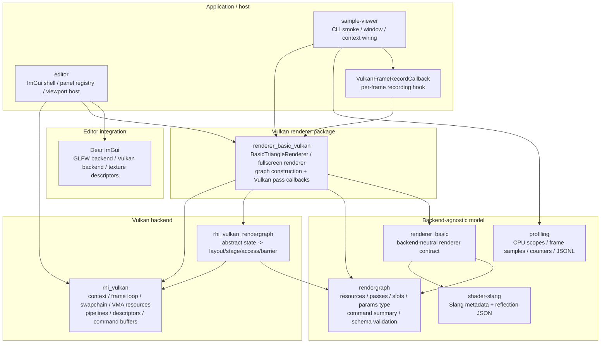
```mermaid
flowchart TB
    subgraph AppLayer["Application / host"]
        SampleViewer["sample-viewer<br/>CLI smoke / window / context wiring"]
        EditorHost["editor<br/>ImGui shell / panel registry / viewport host"]
        FrameCallback["VulkanFrameRecordCallback<br/>per-frame recording hook"]
    end

    subgraph AbstractLayer["Backend-agnostic model"]
        RenderGraph["rendergraph<br/>resources / passes / slots / params type<br/>command summary / schema validation"]
        Profiling["profiling<br/>CPU scopes / frame samples / counters / JSONL"]
        RendererBasic["renderer_basic<br/>backend-neutral renderer contract"]
        ShaderSlang["shader-slang<br/>Slang metadata + reflection JSON"]
    end

    subgraph VulkanRendererLayer["Vulkan renderer package"]
        RendererBasicVk["renderer_basic_vulkan<br/>BasicTriangleRenderer / fullscreen renderer<br/>graph construction + Vulkan pass callbacks"]
    end

    subgraph VulkanBackendLayer["Vulkan backend"]
        RhiVkRG["rhi_vulkan_rendergraph<br/>abstract state -> layout/stage/access/barrier"]
        RhiVk["rhi_vulkan<br/>context / frame loop / swapchain / VMA resources<br/>pipelines / descriptors / command buffers"]
    end

    subgraph GuiLayer["Editor integration"]
        ImGuiRuntime["Dear ImGui<br/>GLFW backend / Vulkan backend / texture descriptors"]
    end

    SampleViewer --> FrameCallback
    SampleViewer --> Profiling
    SampleViewer --> RendererBasicVk
    EditorHost --> ImGuiRuntime
    EditorHost --> RendererBasicVk
    EditorHost --> RhiVk
    RendererBasic --> RenderGraph
    RendererBasic --> ShaderSlang
    RendererBasicVk --> RendererBasic
    RendererBasicVk --> RenderGraph
    RendererBasicVk --> RhiVkRG
    RendererBasicVk --> RhiVk
    FrameCallback --> RendererBasicVk
    RhiVkRG --> RenderGraph
    RhiVkRG --> RhiVk
```

当前最重要的切分：

- RenderGraph 只知道抽象 image state、slot、params type 和 command kind，不知道 `VkImageLayout`、pipeline
  stage 或 access mask。
- Vulkan layout/stage/access 翻译只在 `rhi_vulkan_rendergraph`，真实 command buffer、descriptor、pipeline、
  swapchain 和 VMA 生命周期只在 Vulkan 包或 `renderer_basic_vulkan`。
- `sample-viewer` 是 host 和 smoke harness；它可以选择 smoke 路径，但不应该内联具体 renderer 的 Vulkan 录制细节。
- `apps/editor` 是 editor host 和 smoke harness；它拥有 ImGui backend lifecycle、panel/action/event
  state 和 ImGui texture descriptor lifetime。它可以在 host integration 层录制 ImGui draw data
  到 swapchain，但 editor panel 不能录制 Vulkan commands。
- `apps/studio` 是 managed shell；当前拥有 canonical ProjectSession 和单 authoritative SceneDocument 编辑投影。未来
  Scene View 可以拥有 Avalonia composition surface 和 status ViewModel，但 Vulkan frame recording、external
  image/semaphore 创建和 native packet release 仍必须留在 native bridge/RHI 边界。

## 当前 Studio ProjectSession 与 SceneDocument 流程

Studio 将活动 `ProjectSession` 与 Bootstrap/发行镜像状态分开建模。只有 project-core 完整验证过的 descriptor 和
scene-core 打开的 authoritative SceneDocument 同时成立，session 才进入 Ready；Bootstrap candidate、路径选择和
dialog 返回值都不是活动项目或文档事实。

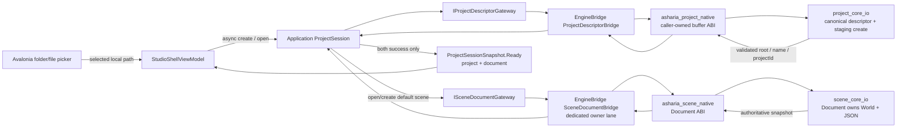
```mermaid
flowchart LR
    Picker["Avalonia folder/file picker"]
    VM["StudioShellViewModel"]
    Session["Application ProjectSession"]
    ProjectPort["IProjectDescriptorGateway"]
    ProjectBridge["EngineBridge ProjectDescriptorBridge"]
    ProjectNative["asharia_project_native<br/>caller-owned buffer ABI"]
    ProjectCore["project_core_io<br/>canonical descriptor + staging create"]
    ScenePort["ISceneDocumentGateway"]
    SceneBridge["EngineBridge SceneDocumentBridge<br/>dedicated owner lane"]
    SceneNativeDoc["asharia_scene_native<br/>Document ABI"]
    SceneCoreDoc["scene_core_io<br/>Document owns World + JSON"]
    Active["ProjectSessionSnapshot.Ready<br/>project + document"]

    Picker -->|"selected local path"| VM
    VM -->|"async create / open"| Session
    Session --> ProjectPort
    ProjectPort --> ProjectBridge
    ProjectBridge --> ProjectNative
    ProjectNative --> ProjectCore
    ProjectCore -->|"validated root / name / projectId"| ProjectNative
    ProjectNative --> ProjectBridge
    ProjectBridge --> Session
    Session -->|"open/create default scene"| ScenePort
    ScenePort --> SceneBridge
    SceneBridge --> SceneNativeDoc
    SceneNativeDoc --> SceneCoreDoc
    SceneCoreDoc -->|"authoritative snapshot"| SceneNativeDoc
    SceneNativeDoc --> SceneBridge
    SceneBridge --> Session
    Session -->|"both success only"| Active
    Active --> VM
```

- `ProjectSession` 串行 create/open 和 document commands，只在 native descriptor 与默认 SceneDocument 都成功后发布 Ready；
  document open 失败不会留下半 Ready 会话。
- Create 在用户选择的父目录创建新的 canonical 项目并立即打开；Open 接受项目目录或
  `asharia.project.json`。已有目标、损坏描述符、IO/ABI/binding failure 都是 typed fail-closed result。
- Avalonia dialog service 只返回本地路径；`StudioShellViewModel` 发起操作并投影 snapshot，不解析 JSON、不持有 native
  pointer。Hierarchy/Inspector mutations 携 expected revision，成功后以重新读取的 authoritative snapshot 更新 dirty/selection。
- `App` 创建 gateway、ProjectSession、ProjectAssetCatalog、dialog 和 ViewModel；`StudioCompositionSession` 在 Shell/panel
  content 之后先 cancel + await catalog owner，再关闭 ProjectSession。测试组合显式注入 doubles，不读取用户偏好或创建生产 service。
- `ActiveProjectSnapshot` 与 `SceneDocumentSnapshot` 只表达已验证的 identity/value，不持有 Avalonia 对象、原生指针或
  runtime 对象。关闭顺序先关闭 document connection/owner lane，再清除 active project。
- `App` 还以同一 `ProjectSession` 创建一个 `ProjectAssetCatalog`。它只在 active project scope 上查询；项目切换使用新的
  request generation，旧请求晚到不得发布；同 scope refresh failure 可保留 last-known-good 并显式 Degraded。
- 当前没有 recent store、自动恢复、多模板、Project extension scope、EngineHost、非 Transform persistent mutation Undo
  或 Play；Bootstrap `Ready`、活动项目/文档 `Ready` 与 catalog `Ready/Degraded` 仍是不同状态。

### #385 Studio Resource Browser 当前流程

[`ADR-0014`](../../apps/studio/docs/adr/0014-catalog-backed-resource-browser.md) 决定 Studio 与 Dear ImGui editor
共享 UI-neutral `editor-content` query，而不是共享任一前端的 panel/store。当前读流为：

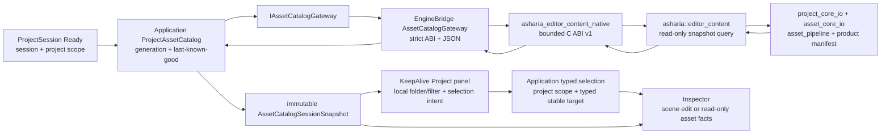
```mermaid
flowchart LR
    Project["ProjectSession Ready<br/>session + project scope"]
    Owner["Application ProjectAssetCatalog<br/>generation + last-known-good"]
    Port["IAssetCatalogGateway"]
    Bridge["EngineBridge AssetCatalogGateway<br/>strict ABI + JSON"]
    Native["asharia_editor_content_native<br/>bounded C ABI v1"]
    Query["asharia::editor_content<br/>read-only snapshot query"]
    Inputs["project_core_io + asset_core_io<br/>asset_pipeline + product manifest"]
    Snapshot["immutable AssetCatalogSessionSnapshot"]
    Panel["KeepAlive Project panel<br/>local folder/filter + selection intent"]
    Selection["Application typed selection<br/>project scope + typed stable target"]
    Inspector["Inspector<br/>scene edit or read-only asset facts"]

    Project --> Owner --> Port --> Bridge --> Native --> Query --> Inputs
    Inputs --> Query --> Native --> Bridge --> Owner --> Snapshot --> Panel
    Panel --> Selection --> Inspector
    Snapshot --> Inspector
```

- query 默认限制 10,000 source files、8 GiB aggregate source bytes、10,000 diagnostics 与 16 MiB JSON；路径、
  UTF-8、closed schema、row/navigation/sub-asset identity、scope 和 response spans 都 fail closed。C ABI 使用 caller-owned
  response buffer，不返回 native-owned string/pointer；source byte ceiling 在实际 open/read/hash 中累计，JSON 使用
  schema-specific bounded writer，不先物化另一棵 JSON tree；
- project-mode source roots 必须经 project-core-io canonical containment 校验，symlink/junction（含中间路径段）不能
  把 editor-content 或 Asset Processor 扫描引出 project root。catalog planning 使用 `DeclaredOnly`，不读取 host
  `PATH`/`VULKAN_SDK` 工具链；无法证明工具版本时保留 row + Warning，但不生成 provisional product key；
- owner scope 绑定 `ProjectSessionId + ProjectId + canonical project path + editor-preview profile`。同 scope refresh 可以
  保留 last-known-good；跨项目绝不继承。partial snapshot 保留 rows/diagnostics 并进入 Degraded；
- Project panel 只投影 source-root/folder navigation、asset rows、sub-asset summary、product state 与 diagnostics。搜索采用
  150 ms debounce；selection 以 GUID 为优先、untracked source path 为 fallback，在 refresh 后 remap；
- 两个固定 22 px 的虚拟化列表承载 navigation/assets；10,000-row Headless test 验证 realized controls 有界。filter、
  location与row highlight是view-local projection；Project panel只发布selection intent，完整只读asset facts由Inspector投影，不写入
  catalog/project/metadata；
- refresh 不执行 importer，不写 manifest/blob/cache，不创建 `ResourceRuntime` handle 或 GPU resource，也不从 source
  decode thumbnail。cooked mesh product、runtime payload、renderer resource、preview service、watcher 与 mutation command
  均是后续独立 Slice。

### #388 Studio typed selection 与只读 Asset Inspector 当前流程

[`ADR-0015`](../../apps/studio/docs/adr/0015-typed-editor-selection-and-asset-inspector.md) 决定跨面板只传 typed stable
identity；Inspector 不接收 Project panel row，也不为 inspect 行为进入 filesystem、native bridge 或 runtime：

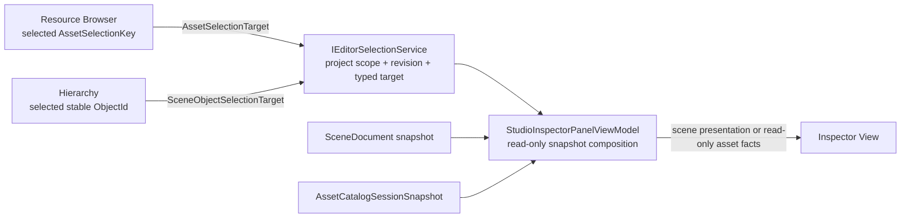
```mermaid
flowchart LR
    Browser["Resource Browser<br/>selected AssetSelectionKey"]
    Hierarchy["Hierarchy<br/>selected stable ObjectId"]
    Selection["IEditorSelectionService<br/>project scope + revision + typed target"]
    Scene["SceneDocument snapshot"]
    Catalog["AssetCatalogSessionSnapshot"]
    Inspector["StudioInspectorPanelViewModel<br/>read-only snapshot composition"]
    View["Inspector View"]

    Browser -->|AssetSelectionTarget| Selection
    Hierarchy -->|SceneObjectSelectionTarget| Selection
    Selection --> Inspector
    Scene --> Inspector
    Catalog --> Inspector
    Inspector -->|scene presentation or read-only asset facts| View
```

- `EditorSelectionSnapshot.Primary` 为 `null`、`SceneObjectSelectionTarget` 或 `AssetSelectionTarget`；asset target 复用
  GUID-first `AssetSelectionKey`，source path 只为 untracked row fallback。project close/switch、entity removal、catalog
  refresh remap failure 会使旧 identity 失效；
- Asset Inspector 只投影 catalog identity/source、type/importer、profile/role、product state/counts、sub-assets 和 diagnostics。
  `Current` 不表示 runtime/GPU/thumbnail ready；
- `StudioInspectorPanelViewModel` 只组合 selection + catalog snapshot presentation，不新增 Application inspection service，
  不引用 Project panel row/ViewModel，也不成为 catalog truth；
- scene name/local Transform 继续走 `ProjectSession` expected-revision mutation 与 document Undo/Redo；asset presentation
  当前无 mutation surface；
- import-settings draft/Apply/Revert、processor job、watcher、runtime load、thumbnail 与 staged hot reload 均未进入此流。

### #373 Transform Undo/Redo 当前流程

[`ADR-0013`](../../apps/studio/docs/adr/0013-authoritative-document-transform-undo-redo.md) 决定第一条 document history
纵切仍由 Application `ProjectSession` 拥有；native SceneDocument 只负责 typed validate/apply 与 authoritative receipt，
EngineBridge 只负责 owner lane/ABI 验证，Avalonia 只提交 intent 和投影 snapshot。当前写流为：

```text
Inspector Apply / document Undo / document Redo
  -> ProjectSession serial document queue
  -> native Transform mutation(expected revision, stable ObjectId)
  -> authoritative changed/no-op/failure receipt + snapshot
  -> success only: commit List+cursor and logical ContentStateId
  -> publish ProjectSessionSnapshot(CanUndo, CanRedo, labels, dirty)
```

`DocumentRevision` 在 changed Apply/Undo/Redo 后严格单调；dirty 比较 `ContentStateId` 与
`SavedContentStateId`，因此 Undo 回到保存内容可以恢复 clean 而不回退 revision。history 按 document 隔离，同时限制为
256 entries 与 16 MiB；failure/no-op 不移动 cursor，首个 Slice 不支持的 changed persistent mutation 作为安全 barrier 清空
history。上述类型与行为已由 #373 的真实 ProjectSession/SceneDocument native acceptance 验证。

### #377–#379 Studio document transition、diagnostic 与 action 当前流程

Studio 的持久操作不再由菜单、工具栏、上下文菜单和快捷键分别维护 handler。Application-owned action registry 保存
稳定 Action ID、placement、shortcut、state evaluator 与 handler；Presentation 在调用边缘冻结 TopLevel、focused panel、
session、scene、revision、selection/target 和 operation/correlation identity。执行器在进入 handler 前重新求值并 fail closed，
因此 stale Hierarchy target、冲突快捷键或 disposed scope 都不会变成另一条隐式执行路径。

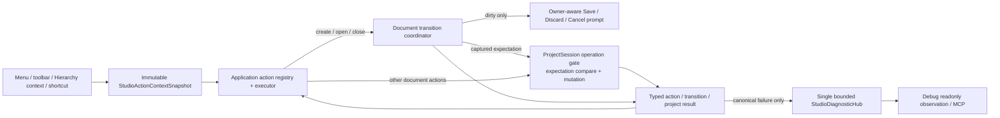
```mermaid
flowchart LR
    Surface["Menu / toolbar / Hierarchy context / shortcut"]
    Context["Immutable StudioActionContextSnapshot"]
    Actions["Application action registry + executor"]
    Guard["Document transition coordinator"]
    Prompt["Owner-aware Save / Discard / Cancel prompt"]
    SessionGate["ProjectSession operation gate<br/>expectation compare + mutation"]
    Result["Typed action / transition / project result"]
    Diagnostics["Single bounded StudioDiagnosticHub"]
    Observe["Debug readonly observation / MCP"]

    Surface --> Context --> Actions
    Actions -->|"create / open / close"| Guard
    Guard -->|"dirty only"| Prompt
    Guard -->|"captured expectation"| SessionGate
    Actions -->|"other document actions"| SessionGate
    SessionGate --> Result
    Guard --> Result
    Result --> Actions
    Result -->|"canonical failure only"| Diagnostics --> Observe
```

- dirty 的唯一事实仍是 `CurrentContentStateId != SavedContentStateId`。Save 成功、Discard 授权或 clean 状态只生成一次
  `ProjectDocumentTransitionExpectation`；`ProjectSession` 在持有自身 operation gate 时比较 expectation 并执行替换/关闭，消除
  “检查后又被编辑”的窗口。Exit preparation 同样在该 gate 内封印后续 mutation，Cancel/失败则保留当前文档并允许重试。
- `File / Edit / Scene / Window` 菜单、主工具栏、浮动 panel 按钮、Hierarchy context menu 与主/浮动窗口快捷键投影同一
  action catalog。TextBox/IME 优先；shortcut 只接受 exactly-one Control/Meta 和可选 Shift，Alt 或冲突注册 fail closed。
  `Window > Panels` 由 Dock action 重新打开已关闭 panel。Exit 属于 App lifetime，不伪装成 document action。
- typed result 仍是调用方事实；只有 canonical producer 将 ProjectSession/transition unexpected failure、escaped Shell exception、
  viewport required-edge failure，以及 viewport degraded→ready episode 投影到同一个 bounded diagnostic hub。消息使用稳定安全文本，
  原始异常、绝对路径和 secret 不进入 readonly observation。#381在该truth上增加一个Diagnostics panel；持久Editor log、问题报告
  bundle或crash uploader仍不在该流程内。

### #381/#383 Studio Diagnostics 当前流程

Diagnostics是一个stable Dock tool panel，内部Console读取时序log、Problems读取`Problem` channel的可行动structured
diagnostic。它们共享一个`StudioDiagnosticsPanelViewModel`和同一hub，并以diagnostic/log两条stream-specific subscriptions
避免无关刷新；不会把两个record模型合并，也不会建立panel-local truth。

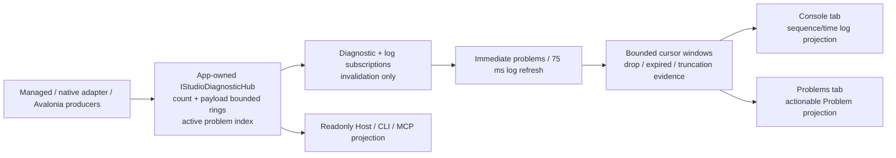
```mermaid
flowchart LR
    Producers["Managed / native adapter / Avalonia producers"]
    Hub["App-owned IStudioDiagnosticHub<br/>count + payload bounded rings<br/>active problem index"]
    Subscription["Diagnostic + log subscriptions<br/>invalidation only"]
    Dispatcher["Immediate problems / 75 ms log refresh"]
    Windows["Bounded cursor windows<br/>drop / expired / truncation evidence"]
    Console["Console tab<br/>sequence/time log projection"]
    Problems["Problems tab<br/>actionable Problem projection"]
    Observe["Readonly Host / CLI / MCP projection"]

    Producers --> Hub
    Hub --> Subscription --> Dispatcher --> Windows
    Windows --> Console
    Windows --> Problems
    Hub --> Observe
```

- history ring默认上限为diagnostic `2048 + 8 MiB`、log `8192 + 32 MiB`；active problem index为`1024 + 4 MiB`。
  payload预算统计规范化retained string的UTF-8合计，不代表CLR object graph。Active溢出保留既有truth并显式标记incomplete；
- filter、search、selected row、collapse与两个tab各自的clear barrier都是panel-local view state。Console默认不collapse；启用时
  只合并相邻同key run以保持chronology。Clear只推进当前tab读取位置并清除当前rows，不删除hub record、重置global sequence
  或影响另一个observer；Active Problems只有producer的Resolved/Stale transition才能关闭；
- Console Pause冻结当前bounded可见窗口，pause期间的filter/collapse仍只重投影该窗口；独立cursor继续摄入Hub evidence并
  累计可见的unseen，Resume从暂停点切回当前retained window。`TotalDropped`是source overwrite累计，`CursorExpired`才是
  当前projection需要的sequence已经不可恢复；UI分别呈现，不能把普通overwrite伪装成view gap。
- Hub在record/history与active index完整提交后，经ThreadPool按stream异步合并subscriber callback；Problems立即post、logs以75 ms窗口合并到UI dispatcher，再由UI线程读取immutable windows。panel为
  `KeepAlive`：close/detach与floating host关闭不退订，隐藏期间继续有界推进cursor，reopen复用同一content；terminal
  workspace/Shell dispose才释放两条subscriptions，已排队refresh必须检查disposed generation后返回。
- cursor expired、total dropped、窗口仍有下一页及record字段截断必须成为可见状态；大列表由虚拟化控件承载，不按hub
  capacity创建control。持久文件日志、problem report/crash、命令输入/CVar及缺少typed target时的导航继续延后。
- 当前没有production gameplay Runtime log producer。未来Runtime默认只发稀疏milestone/transition/failure/threshold摘要；
  frame/pass/job/resource级完整时序属于单独Profiler Capture，默认不record，并以独立duration/event/byte预算和artifact owner收口。

## 当前 Studio Viewport 与 native RenderThread 流程

#359 建立 render-session/native 边界，#361 接入首个 Avalonia Scene View；#367 将其硬切为 V6 异步
authored-mesh/raster contract，#370 再硬切为携 view-local FOV axis 的 V7，#409 以 V8 增加 typed Translate Gizmo packet，
#411 再以 V9 增加 discriminated Transform Gizmo packet，#413 以 V11 给 packet 增加 normalized rotation 并接入 local-axis Scale；
stream 仍由同进程 `editor_native.dll` 内唯一 shared viewport RenderThread 调度：

### Scene mesh revision 到 Frame Debug 证据

`SceneDocument` schema v2 与 native Document ABI v3 都是硬切合同；不存在旧 schema reader 或旧 Document ABI fallback。
每个可渲染对象可带一个
optional typed mesh `AssetReference`，持久化的是 authored GUID/type；`EntityId` 只在本次 runtime snapshot 中存在，product
hash/generation、Basic resource/material key 和所有 GPU handle 都不进入 scene 文件。CPU-only
`asharia::scene_rendering` 收到 immutable scene revision、mesh instances 和 caller 显式提供的 product bindings，输出拥有自身
生命周期的 immutable `BasicDrawListItem` vector 与逐项 diagnostics。它采用 row-major `T * R * S` transform，并且不会读取
`SceneDocument`/World 指针或建立 generic importer/resource service。

```text
Scene schema v2 / Document ABI v3 snapshot
  -> scene-rendering extraction(revision, typed mesh reference, explicit binding)
  -> immutable draw list + item diagnostics
  -> V11 owning frame packet(source revision + FOV axis + optional Transform Gizmo)
  -> Scene/Game shared authored list, per-view raster policy
  -> RenderView diagnostics.sourceRevision
  -> frozen Frame Debug capture / JSON / panel
```

missing、wrong-kind、stale 或 invalid binding 只导致该 object 没有 draw，并在 diagnostics 中保留 scene object、asset 和
revision context；空输入产生零 draw。相反，malformed V11 packet 是 ABI 边界失败，native scheduler 拒绝整帧而不提交部分内容。
Scene 与 Game 可共享同一个 authored mesh snapshot，但它们的 raster policy（包括 Solid/Wireframe）仍按 view 独立计算，
不修改 scene、material 或 source asset。

```mermaid
sequenceDiagram
    participant Source as Endpoint policy / proposal owner
    participant Adapter as Dock / shared top-level capability
    participant WinIntegration as Windows resize integration
    participant Window as USER32 / Avalonia TopLevel
    participant Tx as ViewportPresentationTransactionCoordinator
    participant Consumer as Avalonia presentation endpoint owner
    participant Session as Application ViewportSession
    participant Bridge as EngineBridge ViewportBridge
    participant Native as editor_native V11 stream ABI
    participant Scheduler as Bounded latest-wins scheduler
    participant Owner as Native viewport RenderThread
    participant Renderer as renderer_basic_vulkan
    participant Compositor as Avalonia Compositor

    Source->>Source: freeze Scene exact / Game fit / Frame Debug capture policy
    opt owned dock Scene resize
        Source->>Adapter: splitter delta
        Adapter->>Adapter: coalesce into latest layout proposal
        Adapter->>Consumer: begin synchronous layout probe
        Adapter->>Adapter: apply proposed GridLength; UpdateLayout; capture target PixelSize
        Adapter->>Adapter: restore committed GridLength before dispatcher yields
        Adapter-->>Source: exact targets + reversible layout mutation
    end
    opt Win32 fixed-DPI decorated border drag
        Window->>WinIntegration: WM_ENTERSIZEMOVE; snapshot accepted RECT/scaling/insets
        Window->>WinIntegration: WM_SIZING(proposed screen-space RECT)
        WinIntegration-->>Window: write last accepted exact RECT; return TRUE
        WinIntegration->>Adapter: queue projection + platform-neutral outer commit
        Adapter->>Adapter: coalesce latest proposal outside WndProc
        Adapter->>Consumer: probe all visible exact workspace targets; restore committed layout
        Adapter-->>Source: exact targets + reversible outer/workspace mutation
    end
    Source->>Tx: Proposal(SessionId, EndpointEpoch, TransactionId, participants)
    Tx->>Consumer: PreparePresentationAsync(frozen endpoint policy)
    Consumer->>Session: synchronize snapshot/camera/capture; freeze policy-specific render target
    Session->>Session: publish latest immutable request
    Session-->>Consumer: immutable ViewportRenderRequest
    Consumer->>Bridge: SubmitLatest(stream, request)
    Bridge->>Native: session + target + revision + sequence + camera + bounded proxies + optional Gizmo
    Native->>Scheduler: replace the single pending-latest request
    Scheduler->>Owner: dispatch when one of three full slots is available
    Owner->>Renderer: render or resolve the frozen endpoint target
    Renderer-->>Scheduler: publish the single ready frame
    Consumer->>Bridge: TryTakeReady(stream)
    Bridge-->>Consumer: self-described ViewportFrameLease + persistent slot identity
    Consumer->>Consumer: revalidate candidate extent + generation + identity/sequence
    Consumer->>Compositor: import; update independent candidate drawing surface
    alt rejected before compositor submission
        Consumer->>Bridge: CompleteFrame(NotSubmittedToConsumer)
    else UpdateWithSemaphoresAsync completed
        Consumer->>Consumer: mark candidate prepared; keep front and Opacity=1 unchanged
        Consumer->>Bridge: CompleteFrame(ConsumerAccessed)
    else submission/disposal result ambiguous
        Consumer->>Consumer: quarantine wrappers + lease
        Note over Bridge,Native: do not guess a completion kind
    end
    opt completion kind is known
        Bridge->>Native: editor_viewport_complete_frame_v11(stream, slot, completionKind)
        Native->>Scheduler: Presented -> Completing
        alt NotSubmittedToConsumer
            Owner->>Owner: poll producer fence
        else ConsumerAccessed
            Owner->>Owner: empty queue wait(consumer-done semaphore) + retirement fence
            Compositor-->>Owner: signal consumer-done semaphore after GPU access
            Owner->>Owner: poll producer + consumer-release fences
        end
        Owner->>Scheduler: Completing -> Available after required fences
    end
    opt WM_EXITSIZEMOVE before outer commit is accepted
        Window->>WinIntegration: close interaction epoch
        WinIntegration->>WinIntegration: stale unaccepted commits; discard queued successor
        Adapter->>WinIntegration: outstanding commit.IsCurrent()
        WinIntegration-->>Adapter: false
        Note over Consumer,Owner: active candidate work is not killed; finish then abort/retire by its work fence
        Note over WinIntegration,Window: remain at last Published exact RECT; accepted final may lag raw final by 0-1 candidate
    end
    opt every participant prepared and proposal is current
        Consumer-->>Tx: Prepared candidate receipt
        Tx->>Consumer: arm + validate Session/EndpointEpoch/TransactionId/policy
        opt proposal carries owned layout mutation
            alt dock splitter proposal
                Tx->>Adapter: apply requested GridLength in publish turn
            else Windows capability-backed top-level proposal
                Tx->>Adapter: apply platform-neutral outer commit
                Adapter->>WinIntegration: commit.Apply()
                WinIntegration->>Window: SetWindowPos
                Adapter->>Window: TopLevel.UpdateLayout in publish turn
            end
            Adapter->>Consumer: real Bounds callbacks validate target PixelSize
        end
        alt every participant validated in the same compositor scope
            Tx->>Consumer: ApplyPreparedPresentation for every visual.Surface + Size; keep Opacity=1
            Tx->>Compositor: request one shared composition batch
            Tx->>Adapter: accept outer commit after Published
            alt group batch Rendered
                Compositor-->>Tx: shared Rendered barrier
                Tx->>Consumer: retire each replaced front through endpoint work fences
            else publish/render outcome ambiguous
                Tx->>Consumer: quarantine still-referenced owner graphs
            end
        else any mismatch, cancellation or stale identity before publish
            opt owned layout was applied
                Tx->>Adapter: restore previous GridLength or rollback current outer commit in same UI turn
            end
            Tx->>Consumer: abort group; retain every old front; retire candidates
        end
    end
```

图中的 `applyLayout` 先应用可选 outer/workspace mutation 并触发真实 Bounds，随后逐 participant 验证 exact extent，最后才调用
`ApplyPreparedPresentation` 切换 surface；这些步骤属于同一 UI publish turn。Avalonia same-compositor batch 能给 surface switches 一个
共享 `Rendered` barrier，但 `SetWindowPos` 经 USER32/DWM 提交的 top-level geometry 不参与该 barrier；拖动中两者没有公开的共同
scanout fence，因此这仍不是 physical display atomicity。`RequestCompositionUpdate` 只安排 composition callback，batch `Rendered` 只证明
该 Avalonia batch 已由 compositor 处理，二者都不构成 DWM 或 LCD scanout receipt。

release-stop 不在 `WM_EXITSIZEMOVE` 后追赶 raw cursor final，因而消除额外 native `SetWindowPos` 所造成的 release grow gap/shrink crop；
代价是 accepted final 允许落后 raw final 0–1 candidate。Windows-only opt-in WGC observer 位于应用内阶段之后，读取
`wgc-dwm-composited-pixels`。release capture window 要求它实际交付的所有 samples 都匹配最后 accepted/Published exact extent，禁止
gap/crop/stretch/blank/spill；这些 samples 不是无损 DWM refresh 序列，也不位于显示器 scanout 之后，
`PhysicalDisplayedEvidenceAvailable` 因而固定为 `false`。

该 owner/时序继续采用 Unreal 的 immutable render handoff、Unity 的 semantic invalidation→repaint 分层和 O3DE 的 size-state/render-tick
分离；继续拒绝复制其品牌 API、widget/module owner、drag-end debounce 或跨 compositor 伪原子提交。已检查公开合同没有 native
top-level geometry 与 editor viewport surface 的 physical transaction 先例，因此 shared capability、独立 Windows integration 与
release-stop 是 Asharia 的 package-first/cross-platform 推论，不是外部引擎 API 的复刻。

- 每个 `ViewportSession` 有独立 session ID、camera、sequence 与 pending reasons；多个 viewport 可以指向同一
  SceneDocument，但不能共享可变 camera 或 presentation state。
- `Viewport Presentation Transaction` 以 endpoint 为实际资源 owner；每个 participant 复验 `SessionId + EndpointEpoch + TransactionId`，
  group 共享 transaction id，而 session/epoch 绑定该 endpoint 的内容会话与 attach/compositor lifetime。统一阶段为 Proposal→Preparing→Prepared→Validated→Published→
  Rendered→Retiring→Completed；publish 前失败进入 Aborted，publish 后结果歧义进入 Quarantined。
- Dock splitter 与 interactive top-level resize capability 都只是 layout proposal adapter。Main/Floating Window 的 workspace host 拥有
  committed/requested layout、一个 active request 与一个 queued latest；endpoint 仍拥有 surface/stream。shared capability 位于
  `Asharia.Studio.Presentation.Avalonia.Windowing`，只含 provider/factory/attachment/sink/commit 与 projection，不含 HWND、WM、USER32
  或 P/Invoke；native hook/RECT owner 独立位于 `Asharia.Studio.Presentation.Avalonia.Windows`。Scene participant 采用 exact extent；Game
  Preview 可以冻结独立 fit policy；Frame Debugger immutable capture 使用独立 endpoint/capture identity，不能覆盖实时 Scene/Game front。
- 同一 compositor scope 的所有 participant 才能共享一个 UI publish turn 和 `Rendered` barrier，从而提供 group
  all-or-nothing visible publish；跨 compositor 明确不原子，必须拆成独立 transaction。
  Windows outer geometry 即使在这个 UI turn 中 `SetWindowPos + UpdateLayout`，也不属于 Avalonia batch 的物理原子范围。
- 当前 target 只有 `DocumentScene`，render kind 只有 `Scene | Game | Preview`。Material Preview 与 Animation Preview
  后续都组合 Preview world/target，不新增 renderer kind。
- Application request 不含 Avalonia、OS/Vulkan handle 或 mutable World pointer；进入 native mailbox 前，借用的
  string/span/proxy 字段会复制为 owning immutable `RenderFramePacket`。Transform proxy array 是当前 Scene View 的
  有界调试表示，不是最终 mesh/material render snapshot；selected ObjectId 也是瞬态 view state，不属于 scene/material 数据。
- native V11 request/ready frame 是 self-described、owning ABI packet，并携 view-local FOV axis、selected canonical UUID/
  presence、`ViewStateRevision` 与 optional discriminated Transform Gizmo；V1–V10 frame
  exports 与 managed fallback 均已删除。V11 smoke 覆盖 burst request 只留下最新 sequence、ready 被占用时不覆盖、
  steady-state 最多三个 distinct full slots，第四个请求等待 slot 回收。ABI 保留 logical/allocation 双 extent；Studio
  Scene exact request 对 logical/allocation 使用相同 panel `PixelSize`，并在 surface commit 前再次复验相等；Game fit 与 Frame Debug
  participant 则分别复验 proposal 中冻结的 fit target 或 capture identity/extent。caller 或 managed pump 不是 Vulkan owner。
- additive `editor_viewport_query_render_thread_stats` 只向 smoke/diagnostics 暴露 dispatch count、render-queue
  bound/depth/backpressure、lifecycle 与 caller/owner thread-difference 证据；它读取 published snapshot，不导出
  `std::thread::id` 或让 managed consumer 调度 owner thread。
- shared runtime 是进程级 owner，最多创建一条 native RenderThread。Vulkan context、producer、RenderGraph/command
  recording、graphics queue submit、frame epoch/packet retirement 和 context shutdown 全部留在该线程；mailbox mutex
  只保护有界 render/control/release queue、生命周期条件和 published diagnostics snapshot，不跨 Vulkan 工作。
- 每个 stream 最多一个 executing、一个 pending-latest、一个 ready frame；pending submit 原子替换旧 pending，
  不把 resize event 当 FIFO 命令。native registry 的 hash iteration 不参与调度：owner 按稳定 stream ID 从上次成功推进的 lane
  之后轮转，并在任何 render 前全局优先推进 completion/close。每次 owner loop 仍只推进一个状态转换。steady-state slot 上限为 3，
  全局 outstanding/context 上限仍为 4；这只足以覆盖四个 cold endpoint 的 first slot，不能保证需要至少两个 reusable slot 的
  3–4 个 realtime endpoint steady 运行，也没有解决单 graphics queue 上 slow-consumer wait 的 head-of-line blocking。每个 transaction endpoint 保留旧 front
  流并只为尚未 Published 的 candidate 生产首帧；Published 后恢复新 stream 的 steady 预填充，group switch batch `Rendered` 后才
  允许旧 front retirement/dispose 完成。
  shutdown 进入 Draining 后停止新 submit，但继续完成 close/retirement。
- #361 的首个 Scene View `ViewportCompositionControl` 已扩展为 transaction participant endpoint，仍拥有 composition capability/import、单调 presentation
  admission 与 process-owned drain；Dock move/float 只能重绑 presentation，不能销毁 `ViewportSession`。
- `ViewportSession` 把 target/camera/extent/exposed invalidation 合并为 latest state，并仅在 clean→dirty 时发
  `RefreshRequested`；endpoint control 在 UI Render priority 请求下一次 composition callback。owned dock splitter 只是 Scene exact
  policy 的 layout proposal adapter：它把 drag 输入合并为 latest proposal，并在同步 layout probe 中测量 target exact extent；probe
  临时 Bounds 不发布 geometry 或 surface state，committed `GridLength` 在 dispatcher yield 前恢复。Windows fixed-DPI 普通装饰边框 drag
  则由独立 Windows integration 在 `WM_SIZING` 热路径回写 last-accepted `RECT`，把 platform-neutral projection/commit 交给 shared
  workspace host；host 在 HWND/layout/front 均保持 committed 时 probe/prepare，并以 active + queued-latest 推进。未被 owned dock 或
  interactive top-level capability 捕获的 Bounds/DPI fallback 仍由一枚 Render-priority latch 在 layout boundary 提交最新 exact-size
  native request。默认 Realtime 每个
  commit 至多重挂一次，
  OnDemand 只消费语义 dirty。隐藏 dock tab 或 presentation lifetime pause 停止 admission；ancestor visible、新 surface attach、
  lifetime replacement/resume 都写入 `Exposed` 后恢复一帧；closed session 是不再 invalidation 的 terminal boundary。
- production composition session 在 shell 启动期间于后台启动 compatibility warm-up，且不阻塞 ready，使同一 native RenderThread 提前创建
  Vulkan device/context；shutdown 在销毁 runtime 前等待该 task，真实 compositor identity 仍由 frame request 复验。
- Scene exact extent 以 `ceil(Bounds * RenderScaling)` 表达 panel `PixelSize`，同时作为 logical/allocation extent。每个受影响 endpoint 在旧
  committed state 仍可见时创建独立 candidate drawing surface；所有 candidate 的 `UpdateWithSemaphoresAsync` 成功后，group 才能进入
  Prepared。coordinator arm 并复验所有 identity/policy 后，才在同一 UI/composition publish turn 应用可选 `GridLength` mutation 和全部
  `visual.Surface`/`Size` switch，opacity 始终为 1。A→B→A 也必须为第二个 A 独立 prepare；旧 revision/epoch、geometry generation
  或倒退 sequence 在提交前被拒绝。
- 任一 participant candidate failure/cancel/stale 或 armed extent mismatch 都使 publish 前 group Aborted：保留所有旧 committed
  layout/front，dock adapter 在同一 UI turn 恢复旧 `GridLength`。same-compositor group switch batch `Rendered` 之后才由各 endpoint
  退役 replaced stream/surface；publish 后结果歧义进入 Quarantined。Windows precommit publish 还会在同一 UI turn 经 shared outer
  commit 应用/复验实际 HWND/workspace layout，成功 `Published` 后才接受新 RECT。`WM_EXITSIZEMOVE` 使尚未接受的 commit stale 并丢弃
  queued successor；active GPU/consumer candidate 自然返回后按普通 abort/work fence 回收，Window 停在最后 Published exact RECT。
  Windows paint acknowledgment additionally requires a changed client size, no pre-existing dirty region, an exact viewport
  batch and no intervening dispatcher turn/native paint. Outer-only commits carry no batch claim. This relies on Avalonia
  12.1 target-size serialization requesting a full-target redraw; all other paints retain the normal WM_PAINT path (ADR-0006).
  accepted final 相对 raw final 可落后 0–1 candidate，必须输出 lag。Snap、maximize/restore、程序化 Window/Bounds、DPI/跨屏 transition、
  没有 capability 的非 Windows top-level 与其他 geometry source 仍是 exact-only hidden fallback：边界不变，禁止 crop/stretch，但允许
  短暂空白，尚未达到零闪，且不能计入 owned precommit acceptance。
- Scene exact 的 external image/export/import、RenderGraph target、render area、viewport、scissor 与 camera 全部使用同一 exact panel
  extent；Game Preview 使用 proposal 冻结的 target/fit mapping，Frame Debugger 使用 immutable capture identity/extent，不在 publish
  时读取实时 Scene camera。每个 stream 独占 managed work fence；candidate 与 replaced front 的 retirement 只等待所属流 pump/presentations，新 desired pump
  不被旧流退役绑在同一个全局 task 上。plain `GridSplitter.ShowsPreview` 和 drag-end debounce 都不能维持交互期间每秒至少 60 个
  unique committed geometry generations，因此明确不采用。
- `IsRealtime=true` 即使 scene/camera 静止也由 `RequestCompositionUpdate` 每个 commit 最多重挂一次，目标 exact surface-update
  `>=60 FPS`；`false` 不自动重挂，只消费 dirty invalidation。`MinimumPresentableSequence` 继续拒绝 target/selection/exposed
  之后的旧内容帧；camera-only input 不推进 hard fence，而是记录首个携带当前 camera 的 request sequence。旧 camera frame 可按
  sequence 单调显示，但 picking 只有在 presented sequence 达到该 camera sequence 后才开放。extent 仍由 geometry generation
  独占裁决，Realtime/extent 也不推进内容 fence。两种模式都不使用 UI timer。
- `--smoke-studio-viewport-cadence` 只采集前台静态 Scene 的 5 秒 Realtime 稳态；
  `--smoke-studio-camera-navigation-cadence` 独立以 240 Hz 连续修改 camera，并门控同一 surface cadence 与最终 presented-camera
  interaction acknowledgement；`--smoke-viewport-transaction-resize`、
  `--smoke-viewport-transaction-overload`、`--smoke-viewport-transaction-faults`、
  `--smoke-viewport-transaction-supersede` 与 `--smoke-viewport-multi-endpoint` 已拆成独立真实 Studio/Avalonia/Vulkan smoke，
  `--smoke-viewport-transaction-flash` 再记录每个成功
  transaction composition batch 的 Bounds/front/candidate/visual/surface/opacity/identity；`--smoke-viewport-transaction-window-resize`
  使用真实 HWND 驱动 Windows integration 的 `WM_SIZING`，并拆成不启动连续 recorder、以 first `Proposed`→final exact `Rendered`
  计速的 `performance` lane，以及只连续记录短 ABA outer/client/workspace/panel/surface composition batches、没有 FPS claim 的
  `continuous` lane。release policy 还要求 `WM_EXITSIZEMOVE` 后不追赶 stale proposal，并输出 raw/accepted final 与 0–1 candidate lag。
  所有入口按 native resource→transaction
  phase→Avalonia surface/`Rendered`→physical display 分层；observer 缺失时明确输出 evidence unavailable。
- 独立 Windows-only `Asharia.Studio.WindowsCapture.Tests` 通过 `ASHARIA_RUN_STUDIO_WGC_DWM_ACCEPTANCE=1` opt in，启动真实 Editor/Vulkan
  Window smoke。drag 样本继续分类 blank/stretch/crop/gap/spill；release handshake 从 interaction epoch 关闭起要求每个 WGC-delivered
  sample 都匹配 child 报告的 accepted/Published exact extent，不允许 release gap/crop/stretch/blank/spill。该入口不保证观察每次 DWM
  refresh，也不提供 LCD scanout/`PhysicalDisplayed` 证据。
- 2026-08-09 拆分后代表性 sawtooth 120 Hz 运行完成 209/209 observed exact `Rendered` generations（106.44/s），p95
  15.26 ms、hidden 0、mismatch 0；Realtime steady 代表值为 219.43 surface-updates/s。新增 Window smoke 之前的五族 GPU process acceptance 为 47/47；
  13 个 fault stages、supersede、六个双-endpoint modes 与 flash 8/8 transaction-batch structural checks 均真实 Vulkan exit 0。
  release-stop 之前 `wait-final` policy 的 Win32 Window 性能 acceptance 另以 grow/shrink/A→B→A 三个 120 Hz、90-input case 各自
  门控 `>=60/s`；其 ABA 代表运行在
  744.47 ms 内发送 90 inputs，first `Proposed`→final exact `Rendered` 为 757.57 ms、50 unique exact generations（66.00/s），
  post-request transaction publish catch-up 2/2（25.44 ms，小于两个 60 Hz composition budget）、hidden=0。独立 continuous ABA
  结构 lane 为 24/24 exact sampled batches，
  blank/stretch/crop/gap/mismatch=0，不报告 FPS；这些历史数值不作为新的 release-stop gate 的通过数据。
  当前 PresentMon 复采大量丢 ETW events 且没有 CSV，
  因而 PhysicalDisplayed 仍无当前 transaction 证据；Window smoke 的应用内 lanes 也明确输出 pixel/PhysicalDisplayed evidence unavailable。
  WGC 项目提供独立 DWM-composited release exact pixel gate，但不能把其 delivered samples 外推为所有 DWM refresh 或 LCD scanout。
  当前严格 release-stop gate 用 `SystemRelativeTime` 对齐 `release-imminent` QPC，从 `WM_EXITSIZEMOVE` 前的保守边界开始筛选；
  grow/shrink 2/2 PASS，release 分别为 1/1 与 2/2 exact，每个 delivered sample 都匹配 completion accepted extent，
  gap/blank/crop/stretch/accepted-extent mismatch 全为 0。两条 case 都先建立 pending raw final，再验证其 `Cancelled` 且
  `rawFinalProposalAccepted=false`。
  PresentMon 顶层 cadence 不能排除一个中间 blank/crop/stretch/spill frame。multi-endpoint 也只证明两个 endpoint，不能外推 3–4 realtime lane。
- native `frameIndex` 只是 render-attempt identity，失败允许留 gap；`EditorSharedViewportRuntime` 在唯一 RenderThread 上采样
  steady-clock elapsed 与上次任意 stream 成功 render delta，形成 immutable frame params。刷新率只改变采样密度，不再通过
  `frameIndex / 60` 改变 shader 时间速度。
- V11 completion hard cut 只有 `editor_viewport_complete_frame_v11(stream, slot, completionKind)`。未进入
  `UpdateWithSemaphoresAsync` 的 frame 报告 `NotSubmittedToConsumer`；update 已完成的 frame 报告
  `ConsumerAccessed`，并在 native RenderThread 上提交空 queue wait，把 compositor consumer-done semaphore 转为
  retirement fence。producer 与 consumer proof 都完成后，同一个 full slot 才重新 Available。
- thread startup/device/queue failure 返回 typed error并让 Scene View 进入 degraded/unavailable，绝不回退 UI/caller
  thread 执行 Vulkan。lease release 由 managed worker 等待，UI dispatcher 不阻塞；compositor submission、imported
  wrapper disposal 或 native release 结果歧义时，endpoint 先在最多四个 frame 槽内保留资源，再 exact-once 转交
  process-lifetime quarantine registry；该 registry 不声称独立的 item-count 上界，歧义 endpoint 进入 degraded，正常路径必须为 0。不按
  `NotSubmittedToConsumer` 猜测。正常关闭按 managed presentation drain → priority lease release → native mailbox drain → owner-thread retirement →
  owner-thread producer/context destroy → thread exit → caller 无锁 join 收口。

## Retired Studio Avalonia Scene View Composition 流程（历史证据）

> R0 hard-cut 4.31 已删除managed viewport scheduler/public contract，4.33又删除public Scene snapshot、
> Application provider host与Core in-memory provider。当前 production 已有 authoritative SceneDocument、
> `ViewportSession -> ViewportBridge -> ViewportFrameLease` 与新的 `ViewportCompositionControl`；但没有下图中的
> `SceneViewPresentationSession` 或旧 Core DTO。下图只保留被拒绝的 pre-hard-cut presentation 证据，不能作为
> 当前依赖图或能力声明，也不能据此恢复旧 provider/scheduler 表面。

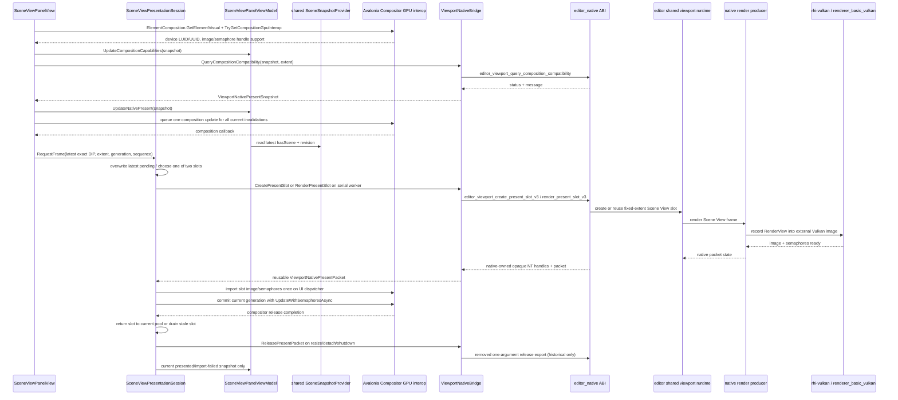
```mermaid
sequenceDiagram
    participant View as SceneViewPanelView
    participant Session as SceneViewPresentationSession
    participant VM as SceneViewPanelViewModel
    participant Scene as shared SceneSnapshotProvider
    participant Avalonia as Avalonia Compositor GPU interop
    participant Bridge as ViewportNativeBridge
    participant Native as editor_native ABI
    participant Runtime as editor shared viewport runtime
    participant Producer as native render producer
    participant RHI as rhi-vulkan / renderer_basic_vulkan

    View->>Avalonia: ElementComposition.GetElementVisual + TryGetCompositionGpuInterop
    Avalonia-->>View: device LUID/UUID, image/semaphore handle support
    View->>VM: UpdateCompositionCapabilities(snapshot)
    View->>Bridge: QueryCompositionCompatibility(snapshot, extent)
    Bridge->>Native: editor_viewport_query_composition_compatibility
    Native-->>Bridge: status + message
    Bridge-->>View: ViewportNativePresentSnapshot
    View->>VM: UpdateNativePresent(snapshot)
    View->>Avalonia: queue one composition update for all current invalidations
    Avalonia-->>View: composition callback
    VM->>Scene: read latest hasScene + revision
    View->>Session: RequestFrame(latest exact DIP, extent, generation, sequence)
    Session->>Session: overwrite latest pending / choose one of two slots
    Session->>Bridge: CreatePresentSlot or RenderPresentSlot on serial worker
    Bridge->>Native: editor_viewport_create_present_slot_v3 / render_present_slot_v3
    Native->>Runtime: create or reuse fixed-extent Scene View slot
    Runtime->>Producer: render Scene View frame
    Producer->>RHI: record RenderView into external Vulkan image
    RHI-->>Producer: image + semaphores ready
    Producer-->>Runtime: native packet state
    Native-->>Bridge: native-owned opaque NT handles + packet
    Bridge-->>Session: reusable ViewportNativePresentPacket
    Session->>Avalonia: import slot image/semaphores once on UI dispatcher
    Session->>Avalonia: commit current generation with UpdateWithSemaphoresAsync
    Avalonia-->>Session: compositor release completion
    Session->>Session: return slot to current pool or drain stale slot
    Session->>Bridge: ReleasePresentPacket on resize/detach/shutdown
    Bridge->>Native: removed one-argument release export (historical only)
    Session->>VM: current presented/import-failed snapshot only
```

退役实现的历史约束（均非当前Studio合同）：

- `Core/Models/Viewports` 不引用 Avalonia、native pointer、Vulkan handle 或 OS handle，只保存 snapshot。
- production `ProjectSceneSessionProjection` 曾把活动项目映射为场景根和编辑相机组成的最小
  `SceneSnapshot`；该projection与共享provider现均已删除。
- viewport request v2 只增加 `hasScene + sceneRevision`。native producer 不读取 managed SceneObject；
  有场景时使用 renderer-owned 默认编辑相机、world-grid pass 与三条原点轴线形成可证明的真实 GPU 画面。
- `Core/Interop/Viewports` 是 managed Core 中唯一可持有 ABI structs、`IntPtr` 和 packet release 逻辑的区域。
- `Features/SceneView` 是 managed Studio 中唯一导入 Avalonia composition external image/semaphore 的区域。
- `SceneViewPresentationSession` 合并 latest pending、generation、双槽、backpressure
  和 drain；它只通过 Avalonia `ICompositionGpuInterop` import opaque NT handles。
  native create/render/release 经串行后台 gate，import/commit/dispose 留在 UI dispatcher。
- Bounds、DPI、scene revision 和显式交互 invalidation 先合并到一个 queued
  composition update；每个合成周期至多采样一次最新观察。完全相同且已有
  pending/in-flight 的观察复用当前 sequence。Scene View 不加入固定 panel tick，
  公共 scheduler 的 interactive burst 结束后也不生成 idle 帧；静止时复用最后成功帧。
- 新 observation 会取消尚停留在 producer gate 前的 stale native work；已经进入
  native/GPU/compositor 的 work 不取消，只完成代际退役，避免旧尺寸排队阻塞最新尺寸。
- `editor shared viewport runtime` owns Vulkan context, producer lifetime,
  outstanding/releasing slot tracking and shutdown drain. Releasing slot 的
  frame-resource index 会一直保留到 fence wait 与析构完成，不能提前分配给新 slot。
- The Studio shared viewport context keeps Vulkan debug labels optional and
  does not require a separately installed validation layer. Strict validation
  remains an explicit native editor / renderer smoke environment requirement,
  so missing SDK tooling cannot disable the shipped Studio viewport.
- Runtime 全局最多四个 outstanding/releasing frame-resource lane；legacy acquire
  仍最多一个。Scene View active present chain 最多两个当前 generation 的持久 slot；
  退役资源移交独立 backlog 后不再占 active 配额，但 active 与 retirement 合计仍不超过
  四个 native lane。超过总上限时保留 latest request，retirement completion 释放容量后
  立即唤醒，不阻塞 UI thread。
- The native render producer owns RenderView recording, the persistent
  `BasicFullscreenTextureRenderer`, a producer-local external image pool keyed
  by image handle family, format, extent, usage and aspect mask, and a
  producer-local submitted/completed frame epoch tracker.
- Each reusable slot owns its external image lease, transient RenderGraph
  images, wait/signal semaphores, command pool, command buffer, fence, exported
  image/semaphore OS handles, frame epoch lease and one explicit
  `BasicRenderFrameResourceContext`. Four fixed renderer resource lanes prevent
  descriptor/debug-buffer cursors from crossing slot ownership.
- Runtime shutdown drain keeps the producer and Vulkan context alive while
  packets or packet release operations are outstanding, so persistent renderer
  resources are destroyed only after packet-owned GPU work has completed.
- The frame epoch tracker is independent from `VulkanFrameLoop`; epoch
  completion is driven by packet release observing the packet fence.
- External image pool entries own Vulkan image resources only and retain at
  most two completed images. Win32 opaque NT image/semaphore handles are
  exported when a slot is created, reused with that slot, and closed during
  native slot release; the pool does not store or close OS handles.
- Windows `VulkanOpaqueNt` is the current validated composition backend. Other
  platforms must map their handle family through compatibility probing and a
  distinct pool key before image reuse.
- `editor_viewport_query_runtime_stats_v2..v7` 与当前 `v11` 是仅供 native smoke / diagnostics 的版本链，不属于 V11 stream
  compatibility surface；当前 smoke 使用 v11 记录 epoch、renderer creation/reuse、backpressure、已消费 scene frame、最后
  scene revision、Scene/Game/Preview frame count，以及最后一次 session/target/revision/sequence/render-kind/debug-proxy count、
  Scene world-grid 开关与实际 debug world-line count。V1–V10 stream exports 不再导出，也没有 managed fallback。
- retired `SceneViewPresentationSession` 曾被设计成单 viewport、双 slot 的 latest-wins slice（不是当前合同）：
  相同在途观察去重，变化的
  Bounds 只保留最新 request；Busy/Backpressure 通过 1–16 ms 有界退避或 slot
  retirement completion 主动重试，不写入 Problems。
- capability probe 只在 attach/DataContext 重建时执行。若 probe 成功但布局尺寸尚无效，
  首个有效 Bounds 复用缓存 capability 完成 presentation 配置；Unsupported/失败状态
  不会在 resize 热路径重复 probe。
- `ViewportNativePresentDrain` 在应用关闭第一阶段调用已注册 presentation 的 detach，
  因而空闲持久 slot 也进入等待集合。Scene View host 先移除 child visual，等待
  presentation drain 后再在 UI dispatcher dispose composition surface。
- transaction contract 之前的 `ViewportCompositionControl` 每次 attach 只持有一张 composition surface；每个 fixed-extent native stream
  有独立 managed pump/work fence。该历史版本在尺寸改变后立即隐藏旧 surface，superseded work 只完成安全退役、不推进当前
  presentation state。它证明 exact-only gate，但 43.2% requested-mismatch hidden duty 不满足后续 flash-free dock contract；当前
  production 采用 front/candidate 双 surface transaction，见上方“当前 Studio Viewport”章节。
- imported wrapper release 与 native packet release 是两个有序阶段；后者在 managed worker 上等待而不阻塞 UI。
  前一阶段未确认时
  不重复假设 `IAsyncDisposable` 可重试，而是把 wrapper 与仍 outstanding 的 native
  packet 保留到进程结束；native shutdown 因 outstanding packet 延迟销毁 Vulkan context。
  应用关闭超过 5 秒进入显式 process-exit fallback：不再执行 native runtime teardown，
  process-lifetime runtime owner 也不会被 CRT 隐式析构，保持在途引用直到 OS 终止
  进程；该路径不计作正常 drain 成功。正常 drain 仍显式销毁 producer/context。

## 启动与 Context 流程


```mermaid
flowchart TD
    Start["main()"]
    Args["解析命令行参数"]
    WindowSmoke["--smoke-window"]
    VulkanSmoke["--smoke-vulkan"]
    FrameSmoke["--smoke-frame"]
    RGSmoke["--smoke-rendergraph"]
    RGBench["--bench-rendergraph"]
    TransientSmoke["--smoke-transient"]
    DynamicSmoke["--smoke-dynamic-rendering"]
    TriangleSmoke["--smoke-triangle"]
    DepthTriangleSmoke["--smoke-depth-triangle"]
    MeshSmoke["--smoke-mesh"]
    Mesh3DSmoke["--smoke-mesh-3d"]
    DrawListSmoke["--smoke-draw-list"]
    SceneMeshSmoke["--smoke-render-view-scene-mesh"]
    MrtSmoke["--smoke-mrt"]
    DescriptorSmoke["--smoke-descriptor-layout"]
    MaterialBindingSmoke["--smoke-material-binding"]
    FullscreenTextureSmoke["--smoke-fullscreen-texture"]
    ComputeDispatchSmoke["--smoke-compute-dispatch"]
    TextureUploadSmoke["--smoke-texture-upload"]
    FormatContractSmoke["--smoke-renderer-format-contract"]
    DeferredDeletionSmoke["--smoke-deferred-deletion"]
    GLFW["GlfwInstance / GlfwWindow"]
    Ext["glfwRequiredVulkanInstanceExtensions"]
    Context["VulkanContext::create"]
    Device["选择 physical device<br/>创建 logical device / queue / VMA"]
    ShaderBuild["shader-slang package<br/>slangc + spirv-val<br/>triangle / descriptor / mesh3d / scene-mesh / compute SPIR-V + reflection JSON"]
    RendererObject["BasicTriangleRenderer / BasicMesh3DRenderer / BasicDrawListRenderer / BasicFullscreenTextureRenderer / BasicComputeDispatchRenderer<br/>shader modules / pipeline layout / buffers / pipeline<br/>BasicDrawItem / BasicDrawListItem / scene draw packet / MVP push constants / dispatch params"]
    DescriptorLayout["Descriptor layout smoke<br/>reflection signature -> descriptor set layout -> pipeline layout<br/>descriptor allocator-backed pool/set<br/>buffer + image + sampler write"]
    MaterialBinding["Material binding smoke<br/>material signature -> descriptor set layout -> pipeline layout<br/>stale pipeline key and signature mismatch diagnostics"]
    TextureProduct["asset_pipeline execute<br/>PNG Texture2D product blob"]

    Start --> Args
    Args --> WindowSmoke
    Args --> VulkanSmoke
    Args --> FrameSmoke
    Args --> RGSmoke
    Args --> RGBench
    Args --> TransientSmoke
    Args --> DynamicSmoke
    Args --> TriangleSmoke
    Args --> DepthTriangleSmoke
    Args --> MeshSmoke
    Args --> Mesh3DSmoke
    Args --> DrawListSmoke
    Args --> SceneMeshSmoke
    Args --> MrtSmoke
    Args --> DescriptorSmoke
    Args --> MaterialBindingSmoke
    Args --> FullscreenTextureSmoke
    Args --> ComputeDispatchSmoke
    Args --> TextureUploadSmoke
    Args --> FormatContractSmoke
    Args --> DeferredDeletionSmoke
    WindowSmoke --> GLFW
    VulkanSmoke --> GLFW
    VulkanSmoke --> Ext
    VulkanSmoke --> Context
    FrameSmoke --> GLFW
    FrameSmoke --> Ext
    FrameSmoke --> Context
    DynamicSmoke --> GLFW
    DynamicSmoke --> Ext
    DynamicSmoke --> Context
    TriangleSmoke --> GLFW
    TriangleSmoke --> Ext
    TriangleSmoke --> Context
    TriangleSmoke --> ShaderBuild
    TriangleSmoke --> RendererObject
    DepthTriangleSmoke --> GLFW
    DepthTriangleSmoke --> Ext
    DepthTriangleSmoke --> Context
    DepthTriangleSmoke --> ShaderBuild
    DepthTriangleSmoke --> RendererObject
    MeshSmoke --> GLFW
    MeshSmoke --> Ext
    MeshSmoke --> Context
    MeshSmoke --> ShaderBuild
    MeshSmoke --> RendererObject
    Mesh3DSmoke --> GLFW
    Mesh3DSmoke --> Ext
    Mesh3DSmoke --> Context
    Mesh3DSmoke --> ShaderBuild
    Mesh3DSmoke --> RendererObject
    DrawListSmoke --> GLFW
    DrawListSmoke --> Ext
    DrawListSmoke --> Context
    DrawListSmoke --> ShaderBuild
    DrawListSmoke --> RendererObject
    SceneMeshSmoke --> GLFW
    SceneMeshSmoke --> Ext
    SceneMeshSmoke --> Context
    SceneMeshSmoke --> ShaderBuild
    SceneMeshSmoke --> RendererObject
    MrtSmoke --> GLFW
    MrtSmoke --> Ext
    MrtSmoke --> Context
    DescriptorSmoke --> GLFW
    DescriptorSmoke --> Ext
    DescriptorSmoke --> Context
    DescriptorSmoke --> ShaderBuild
    DescriptorSmoke --> DescriptorLayout
    MaterialBindingSmoke --> GLFW
    MaterialBindingSmoke --> Ext
    MaterialBindingSmoke --> Context
    MaterialBindingSmoke --> ShaderBuild
    MaterialBindingSmoke --> MaterialBinding
    FullscreenTextureSmoke --> GLFW
    FullscreenTextureSmoke --> Ext
    FullscreenTextureSmoke --> Context
    FullscreenTextureSmoke --> ShaderBuild
    FullscreenTextureSmoke --> RendererObject
    ComputeDispatchSmoke --> GLFW
    ComputeDispatchSmoke --> Ext
    ComputeDispatchSmoke --> Context
    ComputeDispatchSmoke --> ShaderBuild
    ComputeDispatchSmoke --> RendererObject
    TextureUploadSmoke --> GLFW
    TextureUploadSmoke --> Ext
    TextureUploadSmoke --> Context
    TextureUploadSmoke --> TextureProduct
    Context --> Device
```

状态：

- `--smoke-window` 已接入窗口创建。
- `--smoke-vulkan` 已接入 Vulkan context/device 创建。
- `--smoke-frame` 已接入 swapchain acquire、RenderGraph-driven clear、present。
- `--smoke-dynamic-rendering` 已接入 swapchain acquire、RenderGraph color write、dynamic rendering clear、present。
  frame/dynamic/transient/renderer smoke 会验证 Vulkan debug label begin/end counters 配对，并验证
  timestamp query delayed readback 能返回上一帧 `VulkanFrame` duration。
- `--smoke-triangle` 已接入 `BasicTriangleRenderer`、dynamic-rendering graphics pipeline、RenderGraph color write、draw、present。
- `--smoke-depth-triangle` 已接入 `BasicTriangleRenderer::recordFrameWithDepth()`、transient depth image、
  dynamic-rendering depth attachment、depth-enabled pipeline 和 present。
- `--smoke-mesh` 已接入 `BasicTriangleRenderer` 的 indexed quad path，创建 host-upload vertex/index
  buffers，并验证 buffer upload counters、`vkCmdBindIndexBuffer` + `vkCmdDrawIndexed`。
- `--smoke-mesh-3d` 已接入独立 `BasicMesh3DRenderer`：创建 3D cube vertex/index buffer、显式
  vertex-stage push constant range、固定 MVP 行向量、transient depth attachment，并验证
  `vkCmdPushConstants` + indexed cube draw。
- `--smoke-draw-list` 已接入独立 `BasicDrawListRenderer`：使用后端无关 `BasicDrawListItem`、
  `builtin.raster-draw-list` schema、typed params payload、transient depth attachment 和共享 cube
  vertex/index buffer，验证 buffer upload counters、多 item 的 `vkCmdPushConstants` + indexed draw 循环。
- `--smoke-render-view-scene-mesh` 已接入真实 RenderView scene-mesh 路径：deterministic validation
  product 进入 renderer-owned vertex/index buffer，`builtin.render-view-scene-mesh` 显式声明
  ColorReadWrite/Depth +
  VertexRead/IndexRead slots，以 `DrawIndexed` execution event 和 `BasicDrawPacketContext` 关联 draw 与资源身份；
  Solid/Wireframe 与 FOV axis 是独立 per-view policy；Wireframe capability 缺失在 V11 submit 复制/入队前返回 typed
  `FeatureUnavailable`，stream 保持 Open，并等待显式 Solid request 恢复。
- `--smoke-mrt` 已接入独立 `BasicMrtRenderer`：使用 `builtin.raster-mrt` schema、两个 named color
  slots、两张 transient color attachments 和 dynamic rendering multi-color clear，验证 transient image
  pool 对两张 color attachments 的 retire/reuse。
- `--smoke-descriptor-layout` 已接入非空 descriptor reflection signature 到 Vulkan descriptor set layout /
  pipeline layout 的创建验证，并验证 descriptor allocator-backed pool、descriptor set allocation、
  uniform-buffer write、sampled-image write、sampler write 和 allocator counters。
- `--smoke-fullscreen-texture` 已接入真实 draw-time descriptor bind：transient source image 先 clear，
  再 transition 到 `ShaderRead(fragment)`，作为 sampled image + sampler + uniform buffer 绑定后由
  fullscreen dynamic-rendering pass 采样并写入 backbuffer；smoke 同时验证 descriptor allocator 和 buffer
  upload counters。
- `--smoke-texture-upload` 已接入最小 asset product -> GPU sampled texture 路径：用
  `asset_pipeline::executeAssetProducts()` 从嵌入 PNG source 生成 deterministic `texture2d-product.v1`
  product blob，通过 asset-pipeline product blob helper 读取 Texture2D payload，把 product payload 写入 staging buffer，经
  RenderGraph-visible `CopyBufferToImage` 上传到 imported Vulkan image，再用 `CopyImageToBuffer` 读回验证字节，
  并确认最终 image 进入 `ShaderRead(fragment)` sampled view。
- `--smoke-offscreen-viewport` 已接入基于 `VulkanRenderTarget` 的持久 offscreen color target：先把
  viewport color image 作为 imported RenderGraph image 写入 `ColorAttachment`，再 transition 到
  `ShaderRead(fragment)` 并由 fullscreen composite pass 采样写回 backbuffer；smoke 验证 viewport
  extent 可独立于 swapchain extent、resize 后旧 target 进入 deferred deletion、renderer 对外暴露
  sampled target handle/layout、render target 多帧复用、descriptor bind、debug label 和 timestamp readback。
- `--smoke-renderer-format-contract` 是 CPU-only renderer/RG format contract 负向入口：验证
  `VK_FORMAT_B8G8R8A8_SRGB` 能映射到 `RenderGraphImageFormat::B8G8R8A8Srgb`，unsupported format 会在
  backbuffer / RenderView graph import 前返回带 format 上下文的错误。
- `--smoke-rendergraph` 是 RenderGraph CPU 编译、schema 负向编译、image copy command 和 Vulkan adapter 字段验证入口。
- `--bench-rendergraph` 是 CPU-only RenderGraph benchmark 入口；它使用 `packages/profiling`
  记录 RecordGraph/CompileGraph scope 和 graph counters，输出 JSONL，不改变 smoke 语义。
- `--smoke-transient` 已接入真实 Vulkan 路径：根据 compiled transient plan 创建 VMA-backed image、
  image view 和 binding 表，并录制非 backbuffer image transition / clear；现在还验证 transient
  Vulkan image / image view teardown 会进入 frame-loop deferred deletion，并至少完成一次 retirement。
- `--smoke-deferred-deletion` 已接入 P4 后端生命周期起点：验证 deferred deletion queue 的 epoch
  retirement 顺序、empty callback 拒绝路径和 pending/enqueued/retired/flushed counters。
- `VulkanFrameLoop` 现在持有 deferred deletion queue，并在 frame fence / swapchain recreate / shutdown
  已确认 GPU 完成的位置推进 completed epoch。
- Swapchain recreation is synchronously bounded. After the in-flight fence and the single
  graphics/present queue are idle, `VulkanFrameLoop` moves the old swapchain, image views and
  per-image present-wait semaphores into one local RAII set. It passes that old handle to
  `vkCreateSwapchainKHR`, installs a replacement only after its images, views and semaphores are
  complete, then destroys the local old set in semaphore -> image-view -> swapchain order before
  returning. Any partial replacement failure is cleaned locally and leaves the frame loop empty
  so the next `renderFrame()` can retry creation.
- `VulkanSwapchainRetirementStats` exposes the recreation invariant: every completed recreation
  returns with `pending == 0` and `retired == destroyed`. `--smoke-resize` performs eight nonzero
  recreations and the editor resize path checks the same invariant after each completed recreate.
- This is the approved unextended Vulkan fallback for the current single submit/present queue.
  Khronos notes that submit fences do not prove completion of presentation waits, and that even
  `vkQueueWaitIdle` is only a practical shutdown/recreation assumption without a present fence.
  A future asynchronous/multi-queue design must enable `VK_EXT_swapchain_maintenance1` present
  fences (or provide another spec-backed present-completion proof) before relaxing this bounded
  synchronous path. See https://docs.vulkan.org/guide/latest/swapchain_semaphore_reuse.html .

## 当前运行调用链

交互式 viewer 和各个 Vulkan smoke 共享同一条 frame-loop 骨架：host 创建 window/context/frame loop，
renderer 只通过 callback 在“command buffer 已经 begin”之后录制本帧内容，最后由 frame loop 统一 submit/present。
当前 `sample-viewer` 直接创建 `VulkanContext` / `VulkanFrameLoop` 是 MVP host 和 smoke harness 的接线事实；
目标 runtime 应把这层隐藏在 engine host 后面。

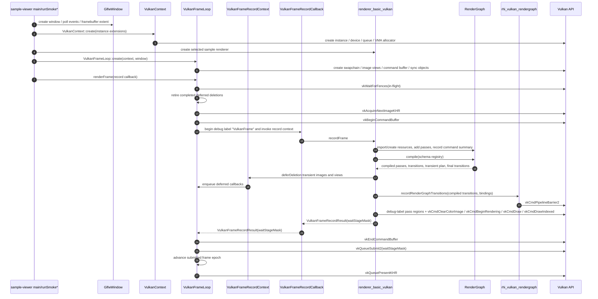
```mermaid
sequenceDiagram
    autonumber
    participant Main as sample-viewer main/runSmoke*
    participant Window as GlfwWindow
    participant Context as VulkanContext
    participant FrameLoop as VulkanFrameLoop
    participant RecordCtx as VulkanFrameRecordContext
    participant RecordHook as VulkanFrameRecordCallback
    participant RendererVk as renderer_basic_vulkan
    participant RG as RenderGraph
    participant Adapter as rhi_vulkan_rendergraph
    participant Vulkan as Vulkan API

    Main->>Window: create window / poll events / framebuffer extent
    Main->>Context: VulkanContext::create(instance extensions)
    Context->>Vulkan: create instance / device / queue / VMA allocator
    Main->>RendererVk: create selected sample renderer
    Main->>FrameLoop: VulkanFrameLoop::create(context, window)
    FrameLoop->>Vulkan: create swapchain / image views / command buffer / sync objects
    Main->>FrameLoop: renderFrame(record callback)
    FrameLoop->>Vulkan: vkWaitForFences(in-flight)
    FrameLoop->>FrameLoop: retire completed deferred deletions
    FrameLoop->>Vulkan: vkAcquireNextImageKHR
    FrameLoop->>Vulkan: vkBeginCommandBuffer
    FrameLoop->>RecordHook: begin debug label "VulkanFrame" and invoke record context
    RecordHook->>RendererVk: recordFrame
    RendererVk->>RG: import/create resources, add passes, record command summary
    RendererVk->>RG: compile(schema registry)
    RG-->>RendererVk: compiled passes, transitions, transient plan, final transitions
    RendererVk->>RecordCtx: deferDeletion transient images and views
    RecordCtx->>FrameLoop: enqueue deferred callbacks
    RendererVk->>Adapter: recordRenderGraphTransitions(compiled transitions, bindings)
    Adapter->>Vulkan: vkCmdPipelineBarrier2
    RendererVk->>Vulkan: debug-label pass regions + vkCmdClearColorImage / vkCmdBeginRendering / vkCmdDraw / vkCmdDrawIndexed
    RendererVk-->>RecordHook: VulkanFrameRecordResult(waitStageMask)
    RecordHook-->>FrameLoop: VulkanFrameRecordResult(waitStageMask)
    FrameLoop->>Vulkan: vkEndCommandBuffer
    FrameLoop->>Vulkan: vkQueueSubmit2(waitStageMask)
    FrameLoop->>FrameLoop: advance submitted frame epoch
    FrameLoop->>Vulkan: vkQueuePresentKHR
```

调用链里的责任归属：

- `VulkanFrameLoop` 拥有 acquire、command buffer begin/end、queue submit、present、swapchain recreate
  和 fence/epoch 驱动的 deferred deletion retirement。
- `VulkanFrameLoop` 只知道 `VulkanFrameRecordCallback`，不应该包含或链接 `renderer_basic_vulkan`、
  `RenderGraph` 或具体 sample renderer。
- `renderer_basic_vulkan` 在 callback 内构建 graph、编译 graph、准备 transient/descriptor/pipeline 相关资源并录制 draw。
  transient Vulkan image / image view 的旧对象通过 `VulkanFrameRecordContext::deferDeletion()` 挂回
  frame loop 的 fence/epoch retirement；renderer 不持有 frame loop，也不直接 submit/present。
- `RenderGraph` 产出后端无关计划；它不直接调用 Vulkan。
- `rhi_vulkan_rendergraph` 把 compiled transition 翻译为 Vulkan barrier，再由调用方用真实 image binding 录制。

## Editor Host 当前流程

`apps/editor` 是当前 editor shell 和 editor smoke 的真实入口。它复用 `VulkanContext` /
`VulkanFrameLoop`，通过 `BasicFullscreenTextureRenderer::recordViewFrame()` 生成 sampled viewport
target，再由 `ImGuiTextureRegistry` 注册为 ImGui texture。Scene/debug viewport flags 和 refresh intent 随 request/result
流动；viewport coordinator 按 `panelId + EditorViewportKind` 收集 keyed slot，所以同帧 Scene/Game/Preview
请求不会互相覆盖。Scene View 默认 on-demand，coordinator 只有在初始纹理、resize、overlay/debug event 或
`AlwaysRefresh` 等 repaint reason 存在时才录制新的 RenderView。coordinator 会清掉 Scene-only authoring flags，同时保留显式 Game debug overlay/debug gizmo intent。Panel 只提交请求和消费 texture id，不持有
Vulkan image、descriptor set 或 command buffer。完整 editor 架构见 `docs/architecture/editor.md`。

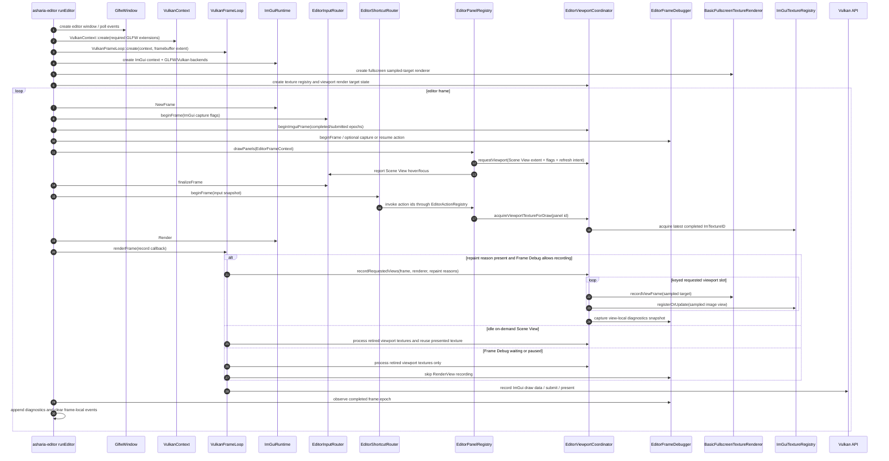
```mermaid
sequenceDiagram
    autonumber
    participant Main as asharia-editor runEditor
    participant Window as GlfwWindow
    participant Context as VulkanContext
    participant FrameLoop as VulkanFrameLoop
    participant ImGui as ImGuiRuntime
    participant Input as EditorInputRouter
    participant Shortcuts as EditorShortcutRouter
    participant Panels as EditorPanelRegistry
    participant Viewport as EditorViewportCoordinator
    participant FrameDebug as EditorFrameDebugger
    participant RendererVk as BasicFullscreenTextureRenderer
    participant TextureRegistry as ImGuiTextureRegistry
    participant Vulkan as Vulkan API

    Main->>Window: create editor window / poll events
    Main->>Context: VulkanContext::create(required GLFW extensions)
    Main->>FrameLoop: VulkanFrameLoop::create(context, framebuffer extent)
    Main->>ImGui: create ImGui context + GLFW/Vulkan backends
    Main->>RendererVk: create fullscreen sampled-target renderer
    Main->>Viewport: create texture registry and viewport render target state
    loop editor frame
        Main->>ImGui: NewFrame
        Main->>Input: beginFrame(ImGui capture flags)
        Main->>Viewport: beginImguiFrame(completed/submitted epochs)
        Main->>FrameDebug: beginFrame / optional capture or resume action
        Main->>Panels: drawPanels(EditorFrameContext)
        Panels->>Viewport: requestViewport(Scene View extent + flags + refresh intent)
        Panels->>Input: report Scene View hover/focus
        Main->>Input: finalizeFrame
        Main->>Shortcuts: beginFrame(input snapshot)
        Shortcuts->>Panels: invoke action ids through EditorActionRegistry
        Panels->>Viewport: acquireViewportTextureForDraw(panel id)
        Viewport->>TextureRegistry: acquire latest completed ImTextureID
        Main->>ImGui: Render
        Main->>FrameLoop: renderFrame(record callback)
        alt repaint reason present and Frame Debug allows recording
            FrameLoop->>Viewport: recordRequestedViews(frame, renderer, repaint reasons)
            loop keyed requested viewport slot
                Viewport->>RendererVk: recordViewFrame(sampled target)
                Viewport->>TextureRegistry: registerOrUpdate(sampled image view)
            end
            Viewport->>FrameDebug: capture view-local diagnostics snapshot
        else idle on-demand Scene View
            FrameLoop->>Viewport: process retired viewport textures and reuse presented texture
        else Frame Debug waiting or paused
            FrameLoop->>Viewport: process retired viewport textures only
            FrameLoop->>FrameDebug: skip RenderView recording
        end
        FrameLoop->>Vulkan: record ImGui draw data / submit / present
        Main->>FrameDebug: observe completed frame epoch
        Main->>Main: append diagnostics and clear frame-local events
    end
```

当前约束：

- `EditorViewportPanelHost` 是 panel-facing API；它只暴露 `EditorViewportRequest` 和
  `EditorViewportResult`。
- `EditorViewportCoordinator` 是 editor-side Vulkan bridge；它按 `panelId + EditorViewportKind` 拥有 keyed
  pending/presented viewport render targets 和 keyed diagnostics snapshot，并通过 frame-loop deferred deletion 延迟释放旧
  target。Frame callback 仍返回一个合并后的 acquire wait-stage mask。
- `EditorViewportOverlayFlags` 是当前 viewport overlay intent。Scene View 当前 effective request 只保留 Grid 和显式
  debug overlay/debug gizmo flags；transform gizmo、wire 和 selection outline 在真实 provider/render bridge 前会被清空。
  Game View 请求会清空 Scene-only authoring flags，但可保留显式 debug overlay/debug gizmo flags；Preview View 当前清空全部
  overlay flags。
- `EditorViewportRefreshPolicy` / `EditorViewportRepaintReason` 是当前 viewport refresh intent。Scene View 默认
  `OnDemand`，没有 repaint reason 时复用上一张 presented texture；Game View 和未来 Play Session 仍可用
  `Continuous`/`AlwaysRefresh` 维持持续渲染。
- Scene View 的 Grid 已映射到 renderer-owned world-grid pass；Gizmo/Select/selection-outline contribution ids 仍保留在
  tool registry 中，但 Scene View strip 将它们显示为 disabled/pending，effective RenderView diagnostics 不再记录这些
  source overlay ids。Game View 只允许显式 debug overlay/debug gizmo intent 进入后续 graph。
- `ImGuiTextureRegistry` 只拥有 ImGui descriptor lifetime，不拥有 `VulkanRenderTarget`、
  `VkImage` 或 `VkImageView`。descriptor retirement 使用 frame epoch，避免 resize 后释放仍被
  submitted ImGui draw data 引用的 descriptor。
- `recordEditorImguiFrame()` 当前在 `apps/editor` host integration 层录制 ImGui swapchain pass。
  这是 editor backend integration，不是 panel 或 renderer core 逻辑；若继续增长，应抽到
  `imgui_runtime` 或单独的 editor ImGui pass module。
- `EditorFrameDebugger` 属于 editor-side transient tooling state。CaptureRequested 只影响下一次 successful
  RenderView recording；capture/resume 会向 viewport coordinator 提供 `FrameDebugEventChanged` repaint reason。
  WaitingGpuFence/PausedFrameDebug 会跳过新的 RenderView recording，但继续允许 ImGui
  host frame 提交，以便 UI 可以显示或恢复。它只保存 `BasicRenderViewDiagnostics` 的 CPU snapshot，不保存 Vulkan
  handles，不使用 `vkDeviceWaitIdle` 作为普通 capture 机制。`EditorInspectedWorldScheduler` 在同一状态下跳过
  frame advance、game update 和 script update safe-point counter，作为未来 runtime/script scheduler 接入前的验证 seam。

### Editor Project / Asset 数据流

当前 editor 的 project/asset 能力是 host-level snapshot 和 metadata command，不是完整资产处理器或场景编辑器。

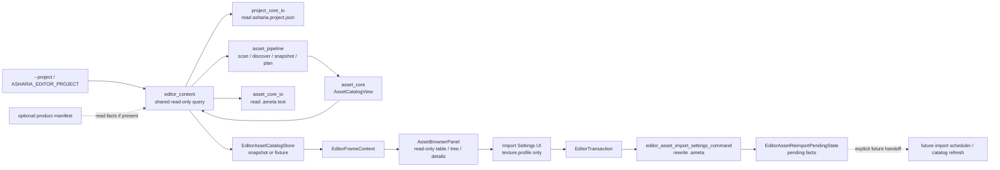
```mermaid
flowchart LR
    ProjectInput["--project / ASHARIA_EDITOR_PROJECT"]
    ProductInput["optional product manifest"]
    EditorContent["editor_content<br/>shared read-only query"]
    ProjectIo["project_core_io<br/>read asharia.project.json"]
    AssetScan["asset_pipeline<br/>scan / discover / snapshot / plan"]
    AssetIo["asset_core_io<br/>read .ameta text"]
    CatalogView["asset_core<br/>AssetCatalogView"]
    Store["EditorAssetCatalogStore<br/>snapshot or fixture"]
    FrameContext["EditorFrameContext"]
    Browser["AssetBrowserPanel<br/>read-only table / tree / details"]
    ImportUi["Import Settings UI<br/>texture.profile only"]
    Transaction["EditorTransaction"]
    MetadataCommand["editor_asset_import_settings_command<br/>rewrite .ameta"]
    Pending["EditorAssetReimportPendingState<br/>pending facts"]
    FutureScheduler["future import scheduler / catalog refresh"]

    ProjectInput --> EditorContent
    ProductInput -.read facts if present.-> EditorContent
    EditorContent --> ProjectIo
    EditorContent --> AssetScan
    EditorContent --> AssetIo
    AssetScan --> CatalogView --> EditorContent --> Store --> FrameContext --> Browser
    Browser --> ImportUi --> Transaction --> MetadataCommand --> Pending
    Pending -.explicit future handoff.-> FutureScheduler
```

约束：

- `asharia::editor_content` 现在拥有 UI-neutral project snapshot composition；原 app-private
  `editor_asset_catalog` query implementation 已硬切删除。`EditorAssetCatalogStore` 仍在 frame loop 前选择
  deterministic fixture 或 shared-query project snapshot；panel 只读取
  `AssetCatalogView`、snapshot diagnostics 和 source-root/path helper 结果。
- `asset-pipeline` 在这个路径里只提供 source scan/discovery/snapshot、import planning 和 diagnostics。它不被
  Asset Browser 用作 importer scheduler，也不在 UI 线程写 product blobs。
- Product manifest 只作为 catalog product-state 输入事实；缺失、stale 或 unknown product 不会被 editor pending
  reimport state 覆盖成 Ready。
- Import Settings 当前只通过 `EditorTransaction` 修改 `.ameta` 的 `texture.profile`，并记录 source GUID、source path、
  target profile 和 changed-setting keys。Undo/redo 恢复 metadata 文本；command-produced request/pending facts 只是
  editor coordination state。真正 reimport、product manifest/blob writes、catalog invalidation、runtime asset loading
  和 GPU preview allocation 留给后续显式服务。
- Dear ImGui Scene Tree / Inspector 没有进入这条 asset flow。Avalonia Studio 的独立 #388 路径只消费 shared-query
  catalog snapshot 和 typed asset identity；两个前端都不把 panel state 写回 project descriptor、asset metadata 或
  runtime scene。

Editor smoke 入口：

```text
asharia-editor --smoke-editor-shell
asharia-editor --smoke-editor-asset-browser
asharia-editor --smoke-editor-viewport
asharia-editor --smoke-editor-viewport-resize
asharia-editor --smoke-editor-frame-debugger
```

## 当前 Frame Loop 流程

本节描述 `sample-viewer`/C++ editor window 的 `VulkanFrameLoop` 单线程 swapchain 路径。Studio offscreen Scene View
不经过该主循环；它使用上文 `editor_native` process-level viewport RenderThread。当前没有独立 RHI Thread，也没有
多线程 command recording。

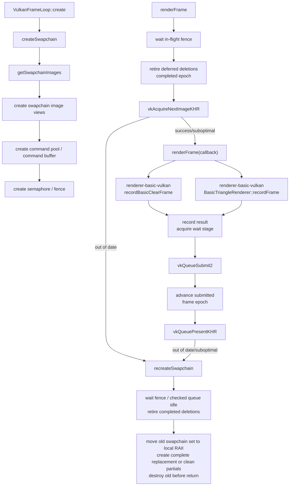
```mermaid
flowchart TD
    Create["VulkanFrameLoop::create"]
    Swapchain["createSwapchain"]
    Images["getSwapchainImages"]
    Views["create swapchain image views"]
    Cmd["create command pool / command buffer"]
    Sync["create semaphore / fence"]
    Render["renderFrame"]
    Wait["wait in-flight fence"]
    Retire["retire deferred deletions<br/>completed epoch"]
    Acquire["vkAcquireNextImageKHR"]
    Record["renderFrame(callback)"]
    GraphClear["renderer-basic-vulkan<br/>recordBasicClearFrame"]
    Triangle["renderer-basic-vulkan<br/>BasicTriangleRenderer::recordFrame"]
    WaitStage["record result<br/>acquire wait stage"]
    Submit["vkQueueSubmit2"]
    AdvanceEpoch["advance submitted<br/>frame epoch"]
    Present["vkQueuePresentKHR"]
    Recreate["recreateSwapchain"]
    RecreateRetire["wait fence / checked queue idle<br/>retire completed deletions"]
    RecreateLocal["move old swapchain set to local RAII<br/>create complete replacement or clean partials<br/>destroy old before return"]

    Create --> Swapchain --> Images --> Views --> Cmd --> Sync
    Render --> Wait --> Retire --> Acquire
    Acquire -->|success/suboptimal| Record --> GraphClear --> WaitStage --> Submit --> AdvanceEpoch --> Present
    Record --> Triangle --> WaitStage
    Acquire -->|out of date| Recreate --> RecreateRetire --> RecreateLocal
    Present -->|out of date/suboptimal| Recreate
```

`--smoke-frame` 当前真实录制流程：

```mermaid
flowchart TD
    Begin["vkBeginCommandBuffer"]
    BuildGraph["Build RenderGraph<br/>Backbuffer + ClearColor transfer write"]
    Compile["compile()"]
    ToTransfer["adapter barrier:<br/>Undefined -> TransferDst"]
    Clear["vkCmdClearColorImage"]
    ToPresent["adapter barrier:<br/>TransferDst -> Present"]
    End["vkEndCommandBuffer"]

    Begin --> BuildGraph --> Compile --> ToTransfer --> Clear --> ToPresent --> End
```

`--smoke-dynamic-rendering` 当前真实录制流程：

```mermaid
flowchart TD
    Begin["vkBeginCommandBuffer"]
    BuildGraph["Build RenderGraph<br/>Backbuffer + DynamicClearColor color write"]
    Compile["compile()"]
    ToColor["adapter barrier:<br/>Undefined -> ColorAttachment"]
    BeginRendering["vkCmdBeginRendering<br/>loadOp clear"]
    EndRendering["vkCmdEndRendering"]
    ToPresent["adapter barrier:<br/>ColorAttachment -> Present"]
    End["vkEndCommandBuffer"]

    Begin --> BuildGraph --> Compile --> ToColor --> BeginRendering --> EndRendering --> ToPresent --> End
```

`--smoke-triangle` / `--smoke-depth-triangle` / `--smoke-mesh` / `--smoke-mesh-3d` /
`--smoke-draw-list` 当前真实录制流程：

```mermaid
flowchart TD
    ShaderBuild["shader-slang package<br/>slangc 编译 Slang<br/>spirv-val 验证 SPIR-V<br/>Slang API 生成 reflection JSON"]
    RendererObject["BasicTriangleRenderer / BasicMesh3DRenderer / BasicDrawListRenderer / BasicComputeDispatchRenderer"]
    PipelineObjects["VulkanShaderModule<br/>VulkanPipelineLayout<br/>VulkanBuffer vertex/index/storage/readback<br/>VulkanGraphicsPipeline / VulkanComputePipeline"]
    DepthObjects["depth path only<br/>VMA-backed transient depth image<br/>VkImageView<br/>depth-enabled pipeline"]
    Begin["vkBeginCommandBuffer"]
    BuildGraph["Build RenderGraph<br/>Backbuffer + ClearColor transfer write<br/>+ Triangle/Mesh/DrawList color write<br/>+ optional DepthBuffer depth write"]
    Compile["compile()"]
    ToTransfer["adapter barrier:<br/>Undefined -> TransferDst"]
    Clear["vkCmdClearColorImage"]
    ToColor["adapter barrier:<br/>TransferDst -> ColorAttachment"]
    BeginRendering["vkCmdBeginRendering<br/>color loadOp load<br/>optional depth loadOp clear"]
    Draw["bind pipeline<br/>bind vertex buffer<br/>optional bind index buffer<br/>set viewport/scissor<br/>optional per-draw push constants<br/>vkCmdDraw / vkCmdDrawIndexed"]
    EndRendering["vkCmdEndRendering"]
    ToPresent["adapter barrier:<br/>ColorAttachment -> Present"]
    End["vkEndCommandBuffer"]

    ShaderBuild --> RendererObject --> PipelineObjects
    RendererObject --> DepthObjects
    Begin --> BuildGraph --> Compile --> ToTransfer --> Clear --> ToColor --> BeginRendering --> Draw --> EndRendering --> ToPresent --> End
```

`--smoke-render-view-scene-mesh` 当前真实录制流程：

```mermaid
flowchart TD
    Input["BasicRenderViewDesc<br/>camera + scene draw items + per-view raster mode"]
    Empty{"drawItems empty?"}
    NoPass["不插入 scene-mesh pass<br/>空 Entity/Transform 不隐式生成 mesh"]
    Product["validation fixture tool<br/>OBJ -> deterministic generated vertex/index product"]
    Buffers["renderer-owned persistent VulkanBuffer<br/>vertices + indices"]
    Resources["import color target<br/>create transient D32 depth<br/>import vertex/index buffers"]
    Pass["builtin.render-view-scene-mesh<br/>target: ColorReadWrite<br/>depth: DepthAttachmentWrite<br/>vertices: VertexRead<br/>indices: IndexRead"]
    Commands["SetShader / SetInt<br/>DrawIndexed per draw item"]
    Compile["compile(schema)<br/>validate slots/access/commands<br/>dependency + lifetime + transitions"]
    Adapter["rhi_vulkan_rendergraph<br/>VertexRead/IndexRead -> vertex-input stage/access"]
    Capability{"raster mode"}
    Solid["Solid pipeline<br/>VK_POLYGON_MODE_FILL"]
    Wire["Wireframe pipeline<br/>VK_POLYGON_MODE_LINE<br/>requires enabled fillModeNonSolid"]
    Unavailable["typed VK_ERROR_FEATURE_NOT_PRESENT<br/>wireframe path = Unavailable"]
    Execute["dynamic rendering<br/>bind vertex/index buffers<br/>push view/model constants<br/>vkCmdDrawIndexed"]
    Evidence["execution events + diagnostics<br/>DrawIndexed args + BasicDrawPacketContext"]

    Input --> Empty
    Empty -->|yes| NoPass
    Empty -->|no| Product --> Buffers --> Resources --> Pass --> Commands --> Compile --> Adapter --> Capability
    Capability -->|Solid| Solid --> Execute
    Capability -->|Wireframe + capability| Wire --> Execute
    Capability -->|Wireframe + unavailable| Unavailable
    Execute --> Evidence
```

该 OBJ 路径是 repository validation fixture/tool，只接受门禁所需的封闭子集；它仍不是通用 OBJ importer、
Mesh Product v1 或 asset resource registry。#386 的真实 source→product 路径由 `asset-pipeline` 受限 `.glb`
importer → `mesh-product` canonical writer/reader → artifact/manifest 构成；renderer 尚未消费该 product，继续只
消费 validation fixture 生成的数据。后续必须按 ResourceRuntime typed CPU payload → renderer GPU resource/
deferred retirement → Scene View → ThumbnailService 接入，不能从 Browser/renderer 旁路解析 source。

`--smoke-fullscreen-texture` 当前真实录制流程：

```mermaid
flowchart TD
    Renderer["BasicFullscreenTextureRenderer::recordViewFrame<br/>recordFrame wraps swapchain target"]
    ImportBackbuffer["importImage(RenderViewTarget)<br/>initial Undefined<br/>final Present or ShaderRead(fragment)"]
    CreateSource["createTransientImage(FullscreenSource)<br/>same format/extent as target"]
    BindingBackbuffer["binding table add render target<br/>RenderGraphImageHandle -> target VkImage/View"]
    ClearPass["pass ClearFullscreenSource<br/>type builtin.transfer-clear<br/>params builtin.transfer-clear.params<br/>writeTransfer(target, source)<br/>ClearColor command"]
    DrawPass["pass FullscreenTexture<br/>type builtin.raster-fullscreen<br/>params builtin.raster-fullscreen.params<br/>readTexture(source, fragment)<br/>writeColor(target, backbuffer)<br/>SetShader / SetTexture / SetVec4 / DrawFullscreenTriangle"]
    Schema["basicFullscreenSchemaRegistry<br/>slot schema + allowed command kind"]
    Compile["RenderGraph::compile(schema)<br/>validate params / slots / commands<br/>compute transitions + transient lifetime"]
    Prepare["prepareTransientResources<br/>VMA image + image view<br/>append source binding"]
    Execute["graph.execute(compiled)<br/>pass callbacks in compiled order"]
    ClearTransition["record transitions<br/>Undefined -> TransferDst"]
    ClearCmd["vkCmdClearColorImage(source)"]
    DrawTransition["record transitions<br/>TransferDst -> ShaderRead(fragment)<br/>Undefined -> ColorAttachment"]
    Descriptor["updateSourceDescriptor<br/>sampled image view + sampler + uniform buffer"]
    DrawCmd["recordFullscreenTextureDraw<br/>vkCmdBeginRendering<br/>bind pipeline / descriptor set<br/>vkCmdDraw(3)<br/>vkCmdEndRendering"]
    FinalTransition["record final transition<br/>ColorAttachment -> Present"]
    Result["return waitStageMask<br/>COLOR_ATTACHMENT_OUTPUT"]

    Renderer --> ImportBackbuffer --> CreateSource --> BindingBackbuffer
    BindingBackbuffer --> ClearPass --> DrawPass --> Schema --> Compile --> Prepare --> Execute
    Execute --> ClearTransition --> ClearCmd --> DrawTransition --> Descriptor --> DrawCmd --> FinalTransition --> Result
```

这条路径目前有两层“可分析”信息：

- builder 显式声明 resource access：source 先 `TransferWrite`，后 `ShaderRead(fragment)`；render view target
  作为 `ColorWrite` 后最终回到 `Present` 或 `ShaderRead(fragment)`。
- command summary 显式声明执行意图：clear pass 只允许 `ClearColor`，fullscreen pass 只允许
  `SetShader`、`SetTexture`、`SetVec4` 和 `DrawFullscreenTriangle`；compile 阶段会拒绝 schema 外命令。

状态：

- 已接入真实 Vulkan 命令录制。
- `--smoke-frame` 的 clear/present barriers 已由 RenderGraph compile result 经 Vulkan adapter 生成。
- `--smoke-dynamic-rendering` 已验证 swapchain image view、dynamic rendering attachment clear 和 `ColorAttachment -> Present` transition。
- `--smoke-triangle` 已验证 `shader-slang` 构建出的 Slang SPIR-V、reflection JSON、triangle shader 契约校验、`BasicTriangleRenderer` 管理的 shader module、reflection-derived pipeline layout、host-upload vertex buffer、dynamic rendering graphics pipeline、`BasicDrawItem` draw 参数、ClearColor + Triangle 两个 graph pass、viewport/scissor dynamic state 和 triangle draw。
- `--smoke-mesh` 已验证最小 indexed mesh 数据、host-upload index buffer、`BasicDrawItem` indexed draw
  参数、`vkCmdBindIndexBuffer` 和 `vkCmdDrawIndexed`。
- `--smoke-mesh-3d` 已验证最小 3D mesh path：固定 cube mesh、depth attachment、MVP push constants、
  3D vertex input layout 和 indexed draw；当前只作为 renderer-basic-vulkan 的 smoke，不引入全局相机系统。
- `--smoke-draw-list` 已验证最小 draw list path：后端无关 `BasicDrawListItem` 描述 per-draw range
  和 transform，RenderGraph typed pass 使用 `builtin.raster-draw-list` schema/params，Vulkan backend
  在一个 dynamic rendering pass 内循环提交两个 indexed cube draw。
- `--smoke-depth-triangle` 已验证 `D32Sfloat` transient depth image、depth aspect binding、
  `Undefined -> DepthAttachmentWrite` transition、dynamic rendering depth attachment clear 和
  depth-enabled graphics pipeline。
- `--smoke-descriptor-layout` 已验证 `descriptor_layout.slang` 的非空 reflection signature 可映射为固定
  descriptor set layout 和 pipeline layout，并能分配 descriptor set、写入 set 0 / binding 0 的 uniform
  buffer、binding 1 的 sampled image 和 binding 2 的 sampler descriptor。
- `--smoke-material-binding` 已验证 `MaterialResourceSignature` 能在 `renderer_basic_vulkan` 中驱动同一类
  set 0 / binding 0-2 descriptor set layout、pipeline layout、descriptor allocation 和 buffer/image/sampler
  write；它还覆盖 material/signature kind mismatch、pipeline key resource signature hash 过期和 visibility
  缺失的负向诊断。这个 smoke 不是通用 Slang reflection adapter，也不引入 `.mat`、asset cache 或 editor
  材质路径。
- `--smoke-fullscreen-texture` 已验证 draw call 中的 descriptor set 绑定、fullscreen pipeline 绑定和
  transient source texture 采样；`BasicFullscreenTextureRenderer::recordFrame()` 现在是
  `recordViewFrame()` 的 swapchain target 便捷包装；renderer 为 view write 和 composite 各持有一个
  descriptor set，避免同一 command buffer 内更新已绑定 set。
- `--smoke-compute-dispatch` 已验证 graphics queue compute capability、compute shader reflection、
  storage buffer descriptor、compute pipeline、RenderGraph buffer transition 录制、`vkCmdDispatch`
  和 readback buffer 校验。
- `--smoke-offscreen-viewport` 已验证 editor viewport 的核心离屏路径：通用 `VulkanRenderTarget`
  持有的 color attachment image 独立尺寸、resize 后 deferred deletion、多帧复用、`recordViewFrame()`
  写入 sampled target、sampled image descriptor 更新、renderer 输出可被当前 editor ImGui backend
  注册为 texture 的 sampled target，以及第二个 fullscreen composite graph 写回 swapchain。
- 无参数 sample viewer 已接入交互式 triangle 循环，并已手动验证 resize/minimize 后仍可恢复持续渲染。
- RenderGraph transition 录制通过 `RenderGraphImageHandle -> VkImage/imageView/aspect` binding 查找真实
  Vulkan resource；pass callback 侧通过 `RenderGraphPassContext` 的 named slots 反查 `source`、
  `target` 或 `depth` 对应 binding，Backbuffer、`--smoke-transient` 的 transient color image 和
  `--smoke-depth-triangle` 的 transient depth image、`--smoke-texture-upload` 的 staging/readback buffers
  和 product texture image 都已显式加入 binding 表。
- `--smoke-rendergraph` 已验证 `StorageReadWrite(compute)` buffer access、`Dispatch` command summary、
  `builtin.compute-dispatch` / `builtin.compute-readback` schema 负向路径，以及
  `TransferWrite -> StorageReadWrite(compute)`、`StorageReadWrite(compute) -> TransferRead` 和
  `TransferWrite -> HostRead` 的 Vulkan buffer stage/access 映射；`--smoke-compute-dispatch` 已验证
  真实 compute pipeline、storage descriptor、`vkCmdDispatch` 录制和 storage buffer GPU 写入 readback。
- 默认 `VulkanFrameLoop::renderFrame()` 仍保留内置 clear 路径，作为基础 RHI smoke fallback。
- frame callback 会返回 `VulkanFrameRecordResult.waitStageMask`，用于匹配 acquire semaphore 的等待阶段。
- `recordBasicClearFrame` 和 triangle shader/pipeline 装配已下沉到 `renderer-basic-vulkan`，sample-viewer 只传入后端 recording callback。

未来多 view/camera 边界：

```mermaid
flowchart TD
    Frame["Frame"]
    Views["Collect RenderViews<br/>Game / Scene / Preview / ReflectionProbe"]
    RecordView["recordViewGraph(view)"]
    CompileView["compile(view graph)"]
    PrepareView["prepare backend resources"]
    RecordViewCmd["record view commands"]
    SharedCaches["shared caches<br/>shader / pipeline / descriptor layout"]
    ViewLocal["view-local resources<br/>camera params / descriptors / transients"]

    Frame --> Views --> RecordView --> CompileView --> PrepareView --> RecordViewCmd
    SharedCaches --> PrepareView
    ViewLocal --> PrepareView
```

- 当前 sample 只有一个 game view / swapchain target；editor viewport coordinator 已先在 editor host 侧支持一帧多个
  keyed view request，作为后续 Game View / asset preview / multi-view diagnostics 的小闭环。
- Game View、Scene View、Preview View 共享 renderer、RenderGraph 和 Vulkan backend caches，但各自拥有
  view-local camera constants、render target、view flags、culling/layer mask、descriptor sets、transient resources
  和 compiled graph。Scene View camera state 可以由 editor viewport 拥有，但进入 renderer 后必须变成普通
  RenderView camera/per-view constants；差异只落在 view kind、overlay/debug/show flags、filtering 和 refresh
  intent 上。
- Scene/debug viewport flags 已先作为 view-local intent 接入 editor viewport request/result，并完成 flagged texture
  metadata 的 acquire roundtrip。Grid 已沿该路径进入 renderer-owned world-grid pass；scene-mesh
  Solid/Wireframe 已是 `BasicSceneRasterMode` per-view policy，因此同帧 Scene Wireframe 与 Game Solid 不共享或污染
  pipeline intent。transform gizmo、selection outline 和独立 wire overlay 仍在真实 provider/render bridge 前保持
  pending/effective-off；它们不能用 debug lines 冒充 scene mesh。Scene-only authoring pass 不能污染 Game View graph；
  Game debug pass 必须显式 opt in。
- RenderGraph handle 只在单个 view graph 内有效；跨 view 共享资源必须由 resource manager 拥有并 import。

## RenderGraph 编译与执行流程

```mermaid
flowchart TD
    Import["importImage / importBuffer<br/>typed image/buffer desc"]
    AddPass["addPass(name, type)"]
    Writes["writeColor / writeDepth / writeTransfer<br/>readVertexBuffer / readIndexBuffer"]
    Callback["execute(callback)<br/>可选 C++ 快速路径"]
    Commands["command summary<br/>ClearColor / SetShader / SetTexture<br/>DrawFullscreenTriangle / DrawIndexed"]
    Registry["RenderGraphExecutorRegistry<br/>按 pass type 查找 executor"]
    Compile["compile()"]
    Dependencies["构建 read/write dependency<br/>active pass + culling<br/>稳定拓扑排序"]
    Track["按编译后 pass 顺序追踪 image/buffer 当前 state"]
    PassPlan["生成 RenderGraphCompiledPass<br/>declaration index / culling flags / resource slots"]
    Final["生成 finalTransitions"]
    DebugTables["formatDebugTables(compiled)"]
    Execute["execute(compiled)<br/>或 execute(compiled, registry)"]
    Callbacks["按编译后 pass 顺序调用 callback/executor"]

    Import --> AddPass --> Writes --> Commands
    Writes --> Callback
    Writes --> Registry
    Commands --> Compile
    Callback --> Compile --> Dependencies --> Track --> PassPlan --> Final
    Final --> DebugTables
    Compile --> Execute
    Registry --> Execute --> Callbacks
```

每帧职责边界：

```mermaid
flowchart TD
    FrameInput["Frame input<br/>camera / quality / debug / gameplay feature state"]
    RecordGraph["RecordGraph<br/>resources + passes + slots + params + command summary"]
    CompileGraph["CompileGraph<br/>schema validation + dependency + lifetime + state/barrier plan"]
    PrepareBackend["PrepareBackend<br/>transient pool + descriptor allocator + shader/pipeline cache"]
    RecordCommands["RecordCommands<br/>barriers + rendering/dispatch + descriptors + draws"]
    Submit["Submit / Present"]

    FrameInput --> RecordGraph --> CompileGraph --> PrepareBackend --> RecordCommands --> Submit
```

- `RecordGraph` 可以每帧运行，并允许普通 C++ 控制流决定哪些动态 feature 进入当前帧 graph。未来脚本
  VM 也只应运行在这一段。
- `Frame input` 中的 camera/view/projection、render target、culling/filtering、show/debug flags、visible draw
  packets 和 model/material 数据必须在 `RecordGraph` 前归约成 renderer-owned 数据合同；需要这些数据的 pass
  通过 typed params、buffer/descriptor、push constants 或等价 binding 显式消费。diagnostics 只能记录结果，
  不能作为下一段渲染输入。
- `compile()` 负责校验 pass/resource 声明、构建 read/write dependency、根据 `allowCulling` /
  `hasSideEffects` 计算 active pass、稳定拓扑排序、resource lifetime、final transitions、
  barrier/layout plan、transient allocation plan 和调试表信息。
- `compile()` 不负责 shader 编译、reflection 解析、descriptor set layout 创建、pipeline layout 创建、
  graphics/compute pipeline 创建或长期 GPU resource 创建。
- `PrepareBackend` 负责用 compiled graph 消费 shader cache、pipeline layout cache、pipeline cache、
  descriptor allocator 和 transient resource pool。动态参数在这里或 RecordGraph 前进入 per-frame param
  block、push constants 或 descriptor 更新。
- `RecordCommands` 按 compiled graph 顺序录制 Vulkan 命令，不再改变 graph topology，也不回调脚本 VM。
- 动态 feature 应在 record/build 阶段决定是否把 pass 放进 graph；轻量常驻 feature 用参数控制，昂贵或
  需要额外 RT/buffer 的 feature 用 active predicate 控制是否 record。

当前 image 抽象状态：

- `Undefined`
- `ColorAttachment`
- `ColorReadWrite`
- `ShaderRead(fragment/compute)`
- `DepthAttachmentRead`
- `DepthAttachmentWrite`
- `DepthSampledRead(fragment/compute)`
- `TransferSrc`
- `TransferDst`
- `Present`

当前 buffer 抽象状态：

- `Undefined`
- `TransferRead`
- `TransferWrite`
- `HostRead`
- `VertexRead`
- `IndexRead`
- `ShaderRead(fragment/compute)`
- `StorageReadWrite(compute)`

当前 write 声明：

- `writeColor("target", image)` / `writeColor(image)` 会要求 image 进入 `ColorAttachment`；旧的
  无 slot API 暂时等价于 `"target"`。
- `readWriteColor("target", image)` / `readWriteColor(image)` 会要求 image 进入 `ColorReadWrite`，正式
  表达 LOAD/blend 等 attachment read + write。它必须读取 imported known initial state 或更早 writer；
  undefined transient image 不能由同一 read/write pass 自己充当 producer。compiler 对连续 write-capable
  image state 生成 same-layout transition，所以 `ColorAttachment -> ColorReadWrite`、
  `ColorReadWrite -> ColorReadWrite` 与 `ColorAttachment -> ColorAttachment` 都保留明确 memory dependency。
  当前实际可能使用 color attachment LOAD 的 Triangle、DepthTriangle、Mesh3D、DrawList、RenderView
  WorldGrid、SceneMesh 与 Overlay pass 均使用该合同；只执行 attachment CLEAR 的 DynamicClear、MRT 与
  Fullscreen pass 保持 `ColorAttachment` write-only 合同。
- `writeTransfer("target", image)` / `writeTransfer(image)` 会要求 image 进入 `TransferDst`；旧的
  无 slot API 暂时等价于 `"target"`。
- `readTransfer("source", image)` / `readTransfer(image)` 会要求 image 进入 `TransferSrc`，用于显式
  GPU-side copy/read 操作；旧的无 slot API 暂时等价于 `"source"`。
- `copyImage("source", "target")` 只描述同一 pass 内从 `TransferRead` source 到 `TransferWrite` target 的
  RenderGraph command；实际 Vulkan copy 仍由后端执行器基于 slot binding 录制。
- `copyBufferToImage("source", "target")` / `copyImageToBuffer("source", "target")` 分别描述 buffer/image
  transfer copy command；实际 Vulkan copy 仍由后端执行器基于 slot binding 录制。
- `readTexture("source", image, shaderStage)` 会要求 image 进入 `ShaderRead(shaderStage)`；当前 smoke
  已验证 fragment shader-read，fullscreen texture 路径已执行真实 descriptor sampling。
- `writeDepth("depth", image)` 会要求 image 进入 `DepthAttachmentWrite`。
- `readDepth("depth", image)` 会要求 image 进入 `DepthAttachmentRead`。
- `sampleDepth("depth", image, shaderStage)` 会要求 image 进入 `DepthSampledRead(shaderStage)`。
- `readVertexBuffer("vertices", buffer)` 会要求 buffer 进入 `VertexRead`；
  `readIndexBuffer("indices", buffer)` 会要求 buffer 进入 `IndexRead`。两者是 vertex-input domain 的专用
  access，不携带 shader stage，也不能用 `ShaderRead` 冒充。
- 同一 pass 内同一 image 不能跨 access group 重复声明；attachment LOAD/read-write 必须使用
  `ColorReadWrite`，不能同时声明独立 `ColorWrite` 与 read slot。framebuffer fetch 或 grab/copy-to-temp
  仍须另行新增明确 state/API 和 Vulkan feature/layout/access 映射。
- compiled pass 和 executor context 已携带 `colorWriteSlots` / `colorReadWriteSlots` /
  `shaderReadSlots` / `transferWriteSlots` /
  `bufferVertexReadSlots` / `bufferIndexReadSlots`，
  `--smoke-rendergraph` 会验证 slot name、shader stage 并在调试表输出 slot。
- `setParamsType("...")` / `setParams(type, params)` 已接入最小 params type id 和 POD payload；
  compiled pass 和 executor context 会携带 type id 与 payload bytes。
- `RenderGraphSchemaRegistry` / `RenderGraphPassSchema` 已接入最小 schema 验证：按 pass type 校验
  params type、允许的 slot、必需 slot 和允许的 command kind。
- `renderer_basic/render_graph_schemas.hpp` 已集中维护内建 clear、dynamic clear、transient present、
  triangle、depth triangle、mesh3D、draw-list、RenderView scene-mesh 和 fullscreen pass 的 type、params type、POD params
  与 schema registry helper；真实 renderer-basic Vulkan 路径现在通过这套共享 schema compile。
- `--smoke-rendergraph` 已覆盖每个 renderer-basic builtin pass 的 missing slot、invalid slot 和
  wrong params type 负向编译路径。
- `renderer_basic_vulkan` 的 fullscreen、transient、depth、mesh、draw-list 和 RenderView scene-mesh callbacks 已按
  `source` / `target` / `depth` / `vertices` / `indices` named slot 查询 Vulkan binding，避免 callback 隐式捕获
  resource handle。
- `PassBuilder::allowCulling()` 和 `PassBuilder::hasSideEffects()` 已接入；schema 也可声明
  `allowCulling` / `hasSideEffects`。默认 pass 不参与 culling，写 imported image 的 pass 会作为外部输出保留。
- `pass.type` 是当前 typed executor key，并会继续演进为执行模型 / pass opcode。它不等同于
  RenderQueue 或 shader tag；脚本/工具未来应通过同一套 C++ builder 语义生成 pass 声明、资源访问、
  typed params 和受控 command context。
- 受控 command context skeleton 已接入：`RenderGraphCommandList` 可记录后端无关的 command summary，
  当前覆盖 clear、shader/pass 名称、texture slot binding、标量/向量参数、fullscreen triangle draw 和
  `drawIndexed(indexCount, instanceCount, firstIndex, vertexOffset, firstInstance)`。
  command summary 会进入 compiled pass、executor context 和 debug table；fullscreen texture smoke 已验证
  `setTexture`、`setVec4` 和 `drawFullscreenTriangle` 的最小 Vulkan 执行路径，scene-mesh smoke 已验证
  `DrawIndexed` 五参数、draw item index 与 packet context 的真实 Vulkan 执行路径。

## RenderGraph 到 Vulkan 的翻译流程

```mermaid
flowchart TD
    RGTransition["RenderGraphImageTransition / RenderGraphBufferTransition<br/>oldState/newState"]
    Binding["RenderGraph handle -> VkImage / VkBuffer binding"]
    VkTransition["VulkanRenderGraph transition<br/>layout or buffer range<br/>stage/access"]
    Barrier["VkImageMemoryBarrier2 / VkBufferMemoryBarrier2"]
    CmdBarrier["vkCmdPipelineBarrier2"]

    RGTransition -->|"vulkanImageTransition / vulkanBufferTransition"| VkTransition
    RGTransition -->|"resource handle"| Binding
    VkTransition -->|"barrier helper + bound resource"| Barrier
    Binding --> Barrier
    Barrier --> CmdBarrier
```

状态：

- `vulkanImageTransition` 已实现。
- `vulkanImageBarrier` 已实现。
- `vulkanImageUsage`、`vulkanImageTransition` 和 `vulkanImageBarrier` 已覆盖 `TransferSrc`，映射到
  `VK_IMAGE_LAYOUT_TRANSFER_SRC_OPTIMAL`、`VK_PIPELINE_STAGE_2_TRANSFER_BIT` 和
  `VK_ACCESS_2_TRANSFER_READ_BIT`。
- `vulkanBufferUsage`、`vulkanBufferTransition` 和 `vulkanBufferBarrier` 已实现；当前覆盖 `TransferRead`、
  `TransferWrite`、`HostRead`、`VertexRead`、`IndexRead`、`ShaderRead(fragment/compute)` 和
  `StorageReadWrite(compute)`。`VertexRead` 精确映射为
  `VK_PIPELINE_STAGE_2_VERTEX_INPUT_BIT + VK_ACCESS_2_VERTEX_ATTRIBUTE_READ_BIT`，`IndexRead` 精确映射为
  `VK_PIPELINE_STAGE_2_INDEX_INPUT_BIT + VK_ACCESS_2_INDEX_READ_BIT`；两者不需要 shader stage。
- `recordRenderGraphTransitions` 已要求调用方提供 `VulkanRenderGraphImageBinding` 表，不再隐式假设所有 transition 都作用在当前 swapchain image。
- `--smoke-rendergraph` 已验证 `TransferDst -> Present` 的 layout、stage、access 与 `VkImageMemoryBarrier2` 字段。
- `--smoke-rendergraph` 已验证 `TransferDst -> ShaderRead(fragment)` 映射到
  `VK_IMAGE_LAYOUT_SHADER_READ_ONLY_OPTIMAL`、`VK_PIPELINE_STAGE_2_FRAGMENT_SHADER_BIT` 和
  `VK_ACCESS_2_SHADER_SAMPLED_READ_BIT`。
- `--smoke-rendergraph` 已验证 `TransferRead`/`TransferSrc` dependency、diagnostics、`copyImage` command schema、
  missing/invalid slot 失败路径，以及 `TransferSrc -> TransferDst` copy 准备 barrier 的 Vulkan 字段。
- `--smoke-texture-upload` 已验证 texture product upload/readback 的 RenderGraph diagnostics 同时暴露
  `CopyBufferToImage` 和 `CopyImageToBuffer`，并通过真实 Vulkan copy 对比 product payload 字节。
- `--smoke-rendergraph` 已验证 buffer `Undefined -> TransferWrite`、`TransferWrite -> ShaderRead(fragment)`、
  `ShaderRead(compute)` usage、`TransferWrite -> StorageReadWrite(compute)`、
  `StorageReadWrite(compute) -> TransferRead` 和 `TransferWrite -> HostRead` 映射到
  `VkBufferMemoryBarrier2` 所需 stage/access 字段。
- RenderGraph CPU tests 与 `--smoke-render-view-scene-mesh` 已覆盖 vertex/index slot schema、dependency/lifetime、
  `VertexRead` / `IndexRead` transition、Vulkan stage/access 映射及 `DrawIndexed` command/event 合同。
- `--smoke-frame` 已消费 RenderGraph 编译结果来录制 clear frame barriers。
- `--smoke-rendergraph` 已输出 resources、passes、dependencies、slots、commands、transitions、
  transients 的 Markdown 调试表格，并验证 pass type、params type、slot schema、command summary、
  transient lifetime plan 和最小 dependency sort；当前 smoke 故意把 transient reader 声明在 writer 前，
  编译结果会按 dependency 把 writer 排到 reader 前执行；同时覆盖无 producer transient read、缺失
  schema，以及 renderer-basic builtin pass missing slot / invalid slot / wrong params type 的负向编译路径，
  确认错误不会进入 pass callback；也覆盖可剔除 unused transient writer
  被移出 compiled passes、side-effect pass 被保留且 culled pass callback 不执行。
- `--smoke-transient` 已验证 transient image 的 first/last pass、final access、非 backbuffer transition、
  Vulkan adapter mapping、真实 image/image view/VMA allocation 和 binding，以及 transient image pool 的
  create/release/retire/reuse counter。

## 下一步接入计划

```mermaid
flowchart TD
    Now["当前:<br/>reflection-derived pipeline layout<br/>descriptor allocator-backed pool/set buffer/image/sampler write smoke<br/>descriptor bind + fullscreen texture smoke<br/>compute pipeline + storage descriptor + dispatch readback smoke<br/>persistent offscreen viewport target smoke<br/>editor viewport overlay flags baseline<br/>editor viewport on-demand refresh<br/>editor overlay texture metadata roundtrip<br/>RenderView view params + overlay contract<br/>RenderView scene-mesh Color/Depth + VertexRead/IndexRead<br/>per-view Solid/Wireframe + optional fillModeNonSolid receipt<br/>DrawIndexed command + packet context<br/>renderer-basic shared builtin schemas<br/>builtin schema negative smoke<br/>fullscreen pass schema + command-derived pipeline key<br/>indexed mesh + draw list smoke<br/>pass.type + executor registry<br/>named write slots<br/>params type + typed POD payload<br/>RenderGraph dependency sort + culling flags<br/>RenderGraph diagnostics snapshot<br/>RenderView diagnostics snapshot<br/>Frame Debug capture/pause state<br/>Live RG View<br/>FrameDebuggerPanel Frame/RenderGraph views<br/>Frame Debug image preview copy<br/>ShaderRead(fragment/compute)<br/>TransferSrc/TransferRead + copyImage<br/>StorageReadWrite(compute) + Dispatch command summary<br/>DepthAttachmentRead/Write + DepthSampledRead<br/>RenderGraph transient image plan<br/>PrepareBackend transient allocation smoke<br/>transient image pool counters<br/>pipeline cache wrapper + reuse counters<br/>descriptor allocator counters<br/>buffer/upload/readback counters<br/>depth attachment MVP smoke<br/>command context debug IR<br/>CPU-only RenderGraph benchmark<br/>GPU debug labels + timestamp delayed readback"]
    Step1["下一步:<br/>render-side contracts<br/>multi-view target plumbing<br/>material/resource signatures"]
    Step2["之后:<br/>upstream systems<br/>scene-core / editor_domain / asset-core"]

    Now --> Step1 --> Step2

    DepthStateUpdate["2026-05-03:<br/>DepthAttachmentRead/Write<br/>DepthSampledRead(fragment/compute)<br/>adapter mapping smoke"]
    Now --> DepthStateUpdate
    TransientUpdate["2026-05-04:<br/>createTransientImage<br/>transient lifetime plan<br/>--smoke-transient"]
    Now --> TransientUpdate
    TransientVkUpdate["2026-05-04:<br/>VMA-backed transient image<br/>image view + binding table<br/>real transition recording"]
    Now --> TransientVkUpdate
    DepthTriangleUpdate["2026-05-04:<br/>--smoke-depth-triangle<br/>dynamic rendering depth attachment<br/>D32Sfloat transient depth image"]
    Now --> DepthTriangleUpdate
    DrawListUpdate["2026-05-05:<br/>--smoke-draw-list<br/>BasicDrawListItem<br/>builtin.raster-draw-list schema/params"]
    Now --> DrawListUpdate
    DependencySortUpdate["2026-05-05:<br/>dependency table<br/>stable topological sort<br/>out-of-order transient smoke"]
    Now --> DependencySortUpdate
    CullingUpdate["2026-05-05:<br/>allowCulling / hasSideEffects<br/>culled pass table<br/>unused transient culling smoke"]
    Now --> CullingUpdate
    BuiltinSchemaUpdate["2026-05-05:<br/>shared renderer_basic builtin schemas<br/>clear / triangle / mesh / fullscreen schema compile"]
    Now --> BuiltinSchemaUpdate
    SlotBindingUpdate["2026-05-05:<br/>renderer_basic_vulkan callbacks<br/>slot-name Vulkan binding lookup"]
    Now --> SlotBindingUpdate
    BuiltinNegativeUpdate["2026-05-05:<br/>builtin pass schema negatives<br/>missing / invalid / wrong params"]
    Now --> BuiltinNegativeUpdate
    DeferredTransientUpdate["2026-05-08:<br/>VulkanFrameRecordContext::deferDeletion<br/>transient image/view wrapper teardown<br/>--smoke-transient counters"]
    Now --> DeferredTransientUpdate
    TransientPoolUpdate["2026-05-08:<br/>VulkanTransientImagePool<br/>retire then reuse image/view<br/>create/reuse counters"]
    Now --> TransientPoolUpdate
    PipelineCacheUpdate["2026-05-08:<br/>VkPipelineCache wrapper<br/>renderer pipeline create/reuse counters<br/>smoke assertions"]
    Now --> PipelineCacheUpdate
```

建议推进顺序：

1. 保持 `VulkanFrameLoop` 基础 target 不依赖 RenderGraph。
2. 保持 `renderer-basic` 后端无关，Vulkan 命令录制放在 `renderer-basic-vulkan`。
3. 保持 RenderGraph 调试表格只输出抽象 RG 信息；Vulkan layout/stage/access 调试表应放在 Vulkan adapter 层。
4. Slang reflection JSON、固定 descriptor set layout RAII、reflection-derived pipeline layout 和非空 descriptor signature smoke 已接入；descriptor bind 和 fullscreen texture pass 已有 `--smoke-fullscreen-texture` 真实 Vulkan 路径，fullscreen clear/tint 已开始走 typed params payload；`--smoke-mesh` 已验证最小 indexed mesh；`--smoke-mesh-3d` 已验证最小 3D cube、depth 和 MVP push constants；`--smoke-draw-list` 已验证多 item indexed cube draw 和 `builtin.raster-draw-list` typed pass；`--smoke-compute-dispatch` 已验证 compute pipeline、storage descriptor、`vkCmdDispatch` 和 GPU 写入 readback。
5. `pass.type` 只负责执行模型 / typed pass 分发；RenderQueue、shader pass tag 和 RendererList 等到 mesh/material 阶段再引入。
6. Scene/world、selection、asset import/cache、inspector 和 Play Mode 状态不属于 render 层。它们由
   `scene-core`、`packages/systems/editor` 内部 `editor_domain`、`asset-core` 或 app/editor host 拥有；render 侧只消费 immutable snapshot、
   draw packet、resource handle、material/resource signature 和 RenderView target。
7. fullscreen、postprocess 和 depth 前必须先补 `ShaderRead`、`DepthAttachmentRead/Write`、`DepthSampledRead` 等抽象 state，以及对应 Vulkan layout/stage/access 翻译；`ShaderRead` 需要携带 shader stage/domain，depth attachment 读写不能和 depth texture 采样混用。后续同图 read/write 只能通过明确的 attachment read/write、storage read/write、framebuffer fetch 或 `readTransfer` + `copyImage` 语义进入，不放开模糊的 `readTexture + writeColor`。
8. transient image 和 depth attachment 必须同步扩展 RenderGraph state、Vulkan binding 表、VMA allocation 和 smoke。
9. 受控 command context 已用 C++ 原型化未来脚本 API；`setTexture` 和 fullscreen draw 已有最小 Vulkan 验证路径，fullscreen pass 已开始从 command summary 派生当前 pipeline key，并通过 typed params payload 传递 clear/tint 数据。
10. mesh 路线已从 indexed quad/draw-list smoke 走到真实 `builtin.render-view-scene-mesh`：validation product
    通过 Color/Depth + VertexRead/IndexRead 和 `DrawIndexed` 进入 RenderView。该 deterministic OBJ fixture/tool
    不是通用 importer；后续 asset-core/asset-pipeline 拥有 GUID/import/cache/product，resource-runtime 与 renderer/RHI
    只消费 resource handle、product data 和 upload request，不提前暴露逐 object 脚本 draw loop。
11. RenderGraph diagnostics snapshot 已提供结构化、后端无关的 pass/resource/access edge/dependency/transition/lifetime
    数据，并已挂到 `BasicRenderViewDesc` 的可选 `BasicRenderViewDiagnostics` 输出槽。`RenderGraphPanel` 作为
    Live RG View 显示最近一次 RenderView compile 后已经确定的数据；`FrameDebuggerPanel` 在同一面板内提供 Frame
    和 RenderGraph 两个切换视图，Frame 视图按左 pass/execution event、右详情/预览组织，RenderGraph 视图显示
    `EditorFrameDebugger` 捕获并冻结的一帧 snapshot。Frame Debug 的主选择 id 来自 renderer execution event
    stream；RenderGraph command summary 只作为来源说明和 RG View 辅助诊断。pass graph visualization 只是 snapshot
    的只读节点表现，不能成为可编辑 RenderGraph authoring UI。editor UI 不应解析 `formatDebugTables()` 文本。
12. Frame Debug intermediate image preview v1 只在 paused Frame Debug 中通过 editor-controlled replay/copy 录制
    `builtin.debug-image-copy`，把 captured snapshot 中选中的 graph-local color image copy 到 editor-owned sampled
    preview target。Frame Debug 主面板现在先选择 renderer execution event，并从冻结 diagnostics snapshot 中解析
    该 event 所属 pass 的 previewable color 输出；pass/event 预览会在 replay graph 中继承 captured view
    kind、camera、frame params 和 overlay intent，并把 debug image copy 插入选中 RenderView pass 之后，避免只看到最终
    RenderViewTarget。graph-local image 选择仍作为 resource override；没有 pass 约束时按最终资源图 preview。normal
    RenderView recording 继续暂停；不调用 `vkDeviceWaitIdle`，不做 CPU readback/export。
13. RenderView 现在携带 renderer-owned view kind、camera/view/projection params、per-view frame params、overlay
    color load/store、blend mode 和 data-only debug world-line route。Scene View panel 现在持有 editor-owned
    navigation/camera state；这是输入所有权，不是 renderer 矩阵旁路。Scene View request 携带 camera context，
    并在 `EditorViewportCoordinator` 边界 bridge 到 `BasicRenderViewCamera`；renderer/basic 不消费
    `EditorViewportOverlayFlags`、ImGui state 或 editor navigation state。`editorViewportCameraForExtent()`
    负责 resize 后重算投影，`unprojectEditorViewportPoint()` 提供 viewport-local pixel（左上角原点，Y down）
    到 world ray 的后端无关语义；该 ray 用 inverse view-projection 计算，`origin`/`nearPoint` 位于
    near clipping plane，`farPoint` 位于 far clipping plane。当前 `recordViewFrame()` 会在
    `BasicRenderViewOverlayDesc::worldGrid` enabled 时插入 `builtin.render-view-world-grid` fullscreen
    overlay pass，用 inverse view-projection / optional fade / per-view LOD / grid color push constants 绘制
    XZ world grid；`fadeStart == fadeEnd == 0` 时不做距离淡出，RenderView policy 只按 camera 到 grid plane
    的垂直距离计算整帧统一的 1/2/5/10 spacing，不按水平距离或片元距离改变 LOD，低高度锁定 base spacing，shader 只消费 `GridLodSettings`。
    `CameraPositionNear` 仍记录在 RenderGraph command summary 里作为 diagnostics。Scene View panel 从 `EditorSettings::sceneGrid`
    读取 plane、minor/major spacing、fade、opacity 和 color，
    经 `EditorViewportRequest::worldGrid` 交给 `EditorViewportCoordinator`，再转换为 renderer-owned
    `BasicRenderViewWorldGridDesc`；settings 缺省值来自 Scene grid overlay contribution 的 built-in 默认值，
    不拥有 renderer/Vulkan 类型。
    overlay intent、world-grid desc 和 source overlay id 会进入 RenderView diagnostics；Frame Debug replay 会使用
    capture 中的 world-grid desc，而不是重新猜默认 grid 参数。只有存在 `BasicDebugWorldLine` 时才插入
    `builtin.render-view-overlay` pass，把 camera/frame/debug-line count 作为 typed params 与 command summary
    记录，并由 `renderer_basic_vulkan` 把 world line 投影为 line-list vertex buffer 绘制到目标 attachment。
    scene-mesh pass 现在以 renderer-owned camera view-projection、per-item model matrix、validation vertex/index
    product 和 draw packet context 构造 indexed draw；Solid/Wireframe 是 per-view policy，空 scene 不生成 pass。
    后续 asset-backed mesh、selection/gizmo 和更多 debug line pass 必须继续沿这条 RenderView route 接入，不能让
    empty Entity、bounds 或 debug lines 冒充 mesh。
14. SRP 不是当前 RenderView/Grid/Frame Debug/overlay 基础阶段的交付项；它只作为后续消费者约束。
    当前阶段的验收是保持依赖方向、scene/pass input 和 RenderGraph 声明路线不阻塞未来 SRP，而不是实现
    RenderPipelineAsset、RendererFeature、RendererList 或脚本化 pipeline authoring。
15. RenderGraph compiler 已能根据同一 image 的 producer/read 关系做稳定拓扑排序，并已用负向 smoke
    锁住无 producer transient read、缺失 schema 和 builtin pass schema mismatch 的编译期失败路径；显式 culling 已能移除 unused
    transient writer 并保留 side-effect pass。下一步补循环诊断细节、更多非法依赖错误报告和更细的
    culling 策略。

## Scene mesh section handoff

`SceneMeshProductBinding` owns one mesh resource plus an ordered `sections` list. Each
`SceneMeshSectionBinding` retains material slot, resolved material resource and indexed draw
range. Extraction validates the entire binding before emitting one draw per section; any invalid
section rejects that instance with one diagnostic, and duplicate bindings for the same asset
are rejected rather than chosen by order. Draws retain the same instance transform/source identity.
Viewport selection outlines collect every section; receipt `resolvedCount` counts instances,
while draw counts count draws. Target dependencies are unchanged.

This adopts [Unreal mesh sections](https://dev.epicgames.com/documentation/unreal-engine/API/Runtime/Engine/FStaticMeshSection)
and [Godot mesh surfaces](https://docs.godotengine.org/en/stable/classes/class_arraymesh.html):
a mesh may need multiple material/range draws. Asharia uses resolved backend-neutral resource
keys rather than engine-specific material objects. This corrects extraction cardinality only;
the fixed validation mesh remains the current viewport producer, and real resource/GPU upload
integration remains a separate product slice.
