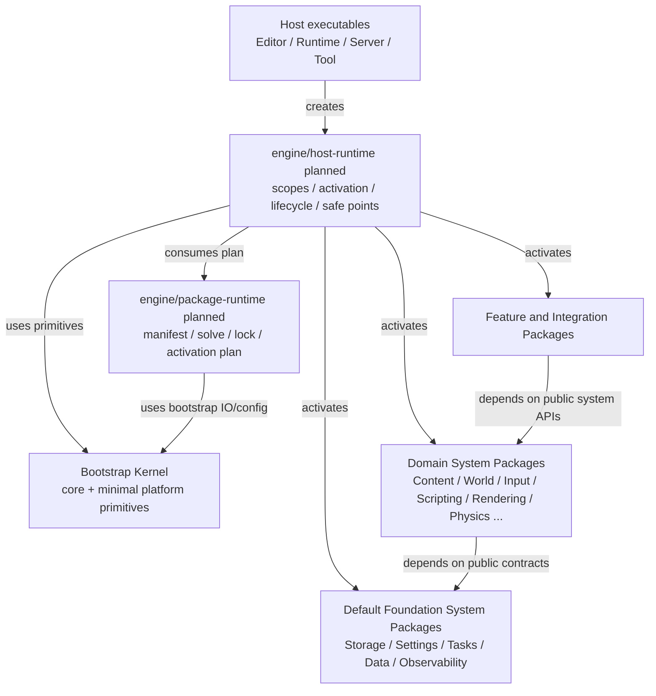
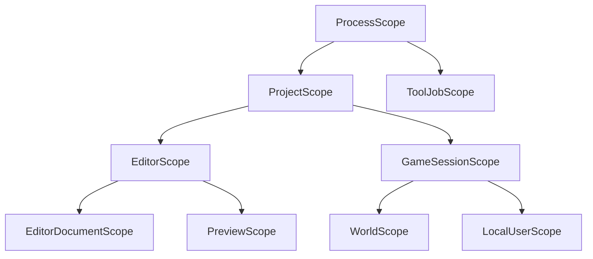
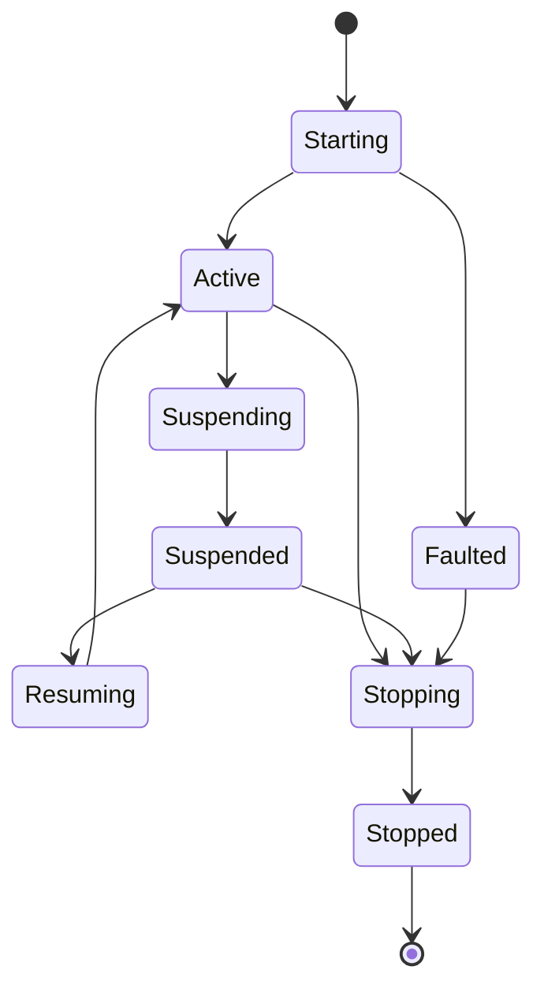
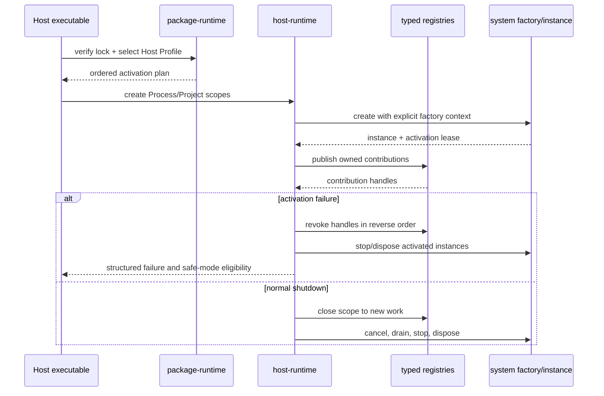

# 基础框架与可扩展系统宿主架构

状态：目标架构。本文定义后续实现顺序和硬边界，不表示计划中的 targets/API 已经存在。

当前仓库事实是：`engine/core` 已提供 error/result、log 和严格 file IO baseline；`engine/platform` 仍是只传递
`asharia::core` 的 `INTERFACE` target；root CMake 仍静态加入当前 source packages；`engine/package-runtime`、
通用 Host scope、Settings、Runtime Storage、Tasks 等目标模块尚未实现。本文不能被用来宣称这些能力已经完成。

## 目的

Asharia 当前最优先目标不是继续增加 Physics、Audio、AI 等纵向功能，而是建立一套后续完整 System/Feature
Packages 都能复用的基础框架：

- package graph 可解析、锁定、验证并生成 Host-specific activation plan；
- Editor、Runtime、Dedicated Server 和 Tool Host 共享相同的系统创建、停止和失败回滚语义；
- 系统通过显式作用域和 typed contributions 扩展，不使用全局 service locator；
- 配置、IO、任务、时间、内存压力和诊断有统一的底层契约；
- Editor/runtime/script/native package 权限分开；
- 新系统可以被增加、验证、禁用和移除，而不要求修改 Kernel 或某个巨型 `Engine` 类。

“基础功能完整”表示一条基础能力具备 owner、lifetime、failure、shutdown、diagnostics 和 tests 闭环，不表示
把所有默认功能编进不可卸载 Kernel。

## 总体决策



依赖只允许向下。`package-runtime` 不创建 World/Renderer/Script VM；`host-runtime` 不实现任何领域系统；
Foundation Systems 不依赖 Editor、Vulkan backend 或游戏规则。

## 三层基础

### L0：Bootstrap Kernel

不可卸载、不可由 Package Manager 替换的最小能力：

- error/result、stable ID/hash、version 和 bootstrap diagnostics；
- 最小 allocator contract 与进程启动所需内存分配；
- monotonic clock、线程/同步原语；
- 启动所需的本地文件读取、atomic write、路径、进程和 dynamic library primitives；
- 崩溃前仍可工作的最小 stderr/file log sink。

Kernel 不拥有 VFS、asset、job graph、CVar、World、script VM、Renderer、Editor transaction 或产品设置。
package manifest/lock 的窄格式模型和解析由静态 bootstrap component `engine/package-runtime` 拥有；不能为了在启动期使用
它们而把 package schema 反向塞入 `engine/core`。

当前 `engine/core/include/asharia/core/error.hpp` 的 `ErrorDomain` 枚举已经列出 Vulkan、Shader、RenderGraph、Asset、
Scene、Material 等上层系统。它是现状兼容 API，但不适合作为可扩展 package 生态的最终模型：每增加系统都要求修改
Kernel。Foundation 收敛时应迁移为稳定 `DiagnosticDomainId`/package+component identity 与 domain-local error code；
Core 只保存通用错误载体和上下文链，不枚举全部未来系统。迁移前保留兼容映射和测试，不能一次性破坏现有调用者。

### L1：Host Foundation

计划新增 `engine/host-runtime`，只拥有：

- Host role 与 scope tree；
- ordered activation/deactivation；
- system/module factory context；
- typed contribution registry 的 owner 和 lease；
- application lifecycle state；
- frame/update safe-point orchestration；
- activation failure rollback、quiesce、shutdown drain 和结构化诊断。

它不得返回任意全局 service pointer，也不得成为 World、Renderer、Storage 或 Settings 的实现所在地。

### L2：Default Foundation System Packages

| 完整 System Package | Runtime owner | Editor/Tool module | 必须具备的基础闭环 |
| --- | --- | --- | --- |
| Runtime Storage & IO | mount table、VFS、bundle/archive reader、async request/completion | mount/bundle inspector、IO diagnostics | priority、cancel、shutdown drain、corrupt/missing handling、user/cache/log mounts |
| Settings & Console | immutable effective settings、CVar/command registry、Device Profile selection | settings document、profile editor、transaction、preview | layered merge、hot/restart policy、shipping restrictions、deterministic snapshot |
| Tasks & Jobs | worker scheduler、dependency/cancel/shutdown | timeline/debug view | explicit inputs、owner cancellation、join、failure propagation、profiling |
| Data Model & Persistence | schema、archive、migration、binding | schema/migration diagnostics | version、unknown field、round-trip、corrupt input、deterministic writer |
| Observability & Validation | diagnostics router、counter/trace contracts、memory accounting | log/profiler/automation/crash UI | early/late sinks、bounded buffering、crash-safe evidence、test orchestration |

这些是默认/required-by-profile 的完整系统，不等于 Kernel。Minimal Host 可以只激活测试所需 contracts/implementations；
Standard Runtime 由 Feature Set 持续要求它们。

## Host Scope 模型

计划中的作用域是 lifetime owner，不是命名空间或依赖注入容器标签。



| Scope | 典型 owner | 示例实例 | 禁止 |
| --- | --- | --- | --- |
| `ProcessScope` | Host process | platform lifecycle、diagnostics router、package catalog snapshot | project/world mutable state |
| `ProjectScope` | opened project | effective package graph、project settings、content catalog | active game state |
| `EditorScope` | Editor host | document registry、selection service、commands/workspace | runtime shipping dependency |
| `ToolJobScope` | one import/cook/build job | job-local mounts、diagnostics、temporary outputs | active Editor/World pointer |
| `GameSessionScope` | game/application session | game flow、save/user services、network session | Editor transaction |
| `WorldScope` | one Edit/Play/Preview/runtime World | entity/component systems、spatial projection、simulation clock | process-global singleton state |
| `LocalUserScope` | one local player/user mapping | input user、accessibility/user settings、online identity binding | physical device ownership leak |
| `EditorDocumentScope` | one open source document | undo/redo、dirty、validation、source model | runtime resident/GPU ownership |

子 scope 只能依赖祖先 scope 的显式 public capabilities。销毁按 children-first、contributions-first、instance-last
执行；任何跨 scope handle 必须能检测 stale generation。

## Application Lifecycle



Platform adapter 产生 focus、quit、suspend、resume、low-memory、display/device change 等事实事件；Host 将它们投影为
有序 lifecycle snapshot/event。各系统在自己的 owner safe point 响应：Content 可以 eviction，Audio 可以暂停 device，
Renderer 可以停止 present，Save/User Data 可以提交有限写入。Platform 不直接调用这些系统。

脚本只能收到经过 Host/Scripting scheduler 投影的高层事件，并受执行预算、capability 和取消约束；OS suspend 回调
不能等待任意脚本、网络或无限时任务完成。

## Package Plan 与系统激活



### Factory Context

计划中的 factory context 只提供 manifest-declared dependencies 和当前 scope services，不能提供万能
`getService<T>()`。依赖在 descriptor/activation plan 中有稳定 identity，Host 在创建前验证 availability、version、scope
和 role。

### Activation Lease

每个系统/module 激活返回 owner lease，至少追踪：

- system instance lifetime；
- registered contributions；
- outstanding jobs/cancellation source；
- subscriptions/callback gates；
- diagnostics identity；
- reload/remove 时的 quiesce/restart requirement。

lease 撤销后 callback 必须被 gate，不能再把旧 generation 对象发布给新 scope。

## Typed Contribution 模型

可扩展性的主接口是 typed contribution，不是裸 callback 或任意脚本反射。

| Contribution | Registry owner | 典型 provider | 生效时机 |
| --- | --- | --- | --- |
| system factory | Host Runtime | System Package native module | scope creation |
| schema/migration | Data Model | System/Feature Package | ProjectScope activation 前半段 |
| importer/cooker | Content/Rendering tool module | System/Feature Package | ToolJobScope |
| component/system descriptor | World | gameplay/system package | WorldScope creation/safe point |
| renderer feature/pass program | Rendering | Rendering Feature Package | pipeline generation safe point |
| input device/action provider | Input | Platform/Feature Package | input update boundary |
| editor panel/command/inspector/gizmo | Editor Domain | package editor module/script | EditorScope safe point |
| diagnostics/test provider | Observability | any package | owner scope activation |

所有 registry 必须：

- 使用稳定 contribution ID、owner package/module/generation；
- 拒绝 duplicate/conflict 或按显式 priority policy 解决；
- 返回可撤销 handle；
- 提供只读 snapshot 给 Editor/diagnostics；
- 在 owner lease 撤销后不调用旧 provider；
- 不允许 provider 越过 public contract 取得 registry 内部对象。

## Editor、runtime、脚本和原生扩展

| 能力 | Editor / Tool | Runtime | 外部脚本 | 原生 Package |
| --- | --- | --- | --- | --- |
| package graph | UI、impact preview、apply/rollback | 只消费 locked graph | 不实现 resolver；可读取受限 snapshot | manifest 声明完整 package/modules/contributions |
| system lifecycle | 显示状态、safe mode、诊断 | Host 创建/停止真实实例 | 不创建底层系统；只能运行受控 entry point | system factory 创建本包实例并返回 lease |
| settings/device profile | transaction、profile authoring、preview | 选择 effective profile/snapshot | 读写公开 keys、请求 quality level | 注册 typed settings schema/provider |
| IO/storage | source/bundle tooling、mount inspector | VFS/async IO owner | sandboxed facade | 注册 protocol/archive provider，不持有 Host mount table |
| tasks/time | timeline/profiler、test controls | scheduler/clock owner | 提交受 capability 限制的 jobs/timers | 声明 jobs、cancel/shutdown behavior |
| World/spatial | document、debug draw、selection/streaming preview | mutable World 与 spatial projections | scheduled mutation/query | 注册 component/system/query contribution |
| rendering | pipeline authoring、preview、Frame Debug | RG/backend/GPU owner | 组合已有 pass、改公开参数 | public renderer encoder/pass program；无 Vulkan 私有逃生口 |

外部 package 是否受信只影响允许加载哪些 native modules，不改变层次规则。签名通过的 package 也不能依赖其他系统
private headers、返回 Vulkan handle 或绕过 World mutation safe point。

## Settings、Device Profile 与运行时策略

Settings System 合并以下层级并发布 immutable effective snapshot：

```text
engine defaults
  -> package defaults
  -> project settings
  -> Build/Launch Profile
  -> platform/device profile
  -> user settings
  -> validated CLI/session override
```

每个 key 声明 type、owner system、default、hot/restart policy、shipping visibility 和 validation。Platform 提供设备能力与
thermal/power facts；Settings 选择 Device Profile；Rendering、Content、Audio、Animation 等只消费与自己相关的 projection，
不能共同修改一个全局 mutable map。

## Memory Accounting 与压力响应

第一阶段不创建自定义通用 allocator。Foundation 只冻结：

- `MemoryDomainId` / tag 与 owner system；
- committed、resident、peak、budget 和 pressure level；
- CPU、GPU、resource cache、transient/frame allocation 的分域统计；
- Platform memory-pressure event；
- 各系统按 priority 返回的 trim/eviction result；
- OOM/crash 前仍可输出的最小诊断。

Content、Renderer、Audio 等系统保留自己的分配器/cache owner；Observability 聚合只读统计，不负责替它们释放资源。

## Time、Tasks 与 Safe Points

Host 拥有 frame/application phase，World 拥有 simulation clock，Tasks 只拥有执行资源：

```text
PollPlatform
  -> PublishLifecycle/Input snapshots
  -> Apply scheduled mutations
  -> Fixed simulation steps
  -> Variable update / scripts
  -> Build immutable extraction snapshots
  -> Render record/submit
  -> Publish completions/diagnostics
```

第一版 Tasks 只要求 worker pool、dependency、priority、cancellation、completion queue 和 shutdown join；不提前实现工作窃取、
fiber scheduler 或任意 job 内 World mutation。异步 IO、import、decode、hash 和 snapshot build 可以逐步迁入。

## World Spatial 基线

完整基础框架需要稳定的空间契约，但不建立一棵全引擎共享 octree：

- World 拥有 entity bounds、spatial identity、region/overlap query 和 immutable spatial snapshot；
- Renderer 从 render extraction 建立自己的 visibility/culling projection；
- Physics 拥有 collision broadphase 和精确 scene queries；
- Navigation 拥有 nav mesh/volume query；
- future World Partition 消费 World spatial contract 与 Runtime Storage，不反向进入 Kernel。

第一阶段只要求 bounds registration/update/remove、AABB/region query、generation safety 和 debug snapshot。streaming cell、
large-world coordinates、HLOD 和通用 spatial database 继续延期。

## Project Upgrade 是基础工具链，不是 Runtime

Package/version/schema 已可演进后，Editor 必须通过统一 upgrade plan 打开旧项目：

1. preflight engine/package/schema/product compatibility；
2. 默认复制或备份，不直接原地破坏；
3. 在隔离 ToolJobScope 中执行 ordered migrations；
4. 重新生成 derived products/build plan；
5. 运行 project/package/system validation；
6. 成功后提交新 descriptor/lock/schema generation，失败保持旧项目可用。

外部 package 可以注册 versioned migration contribution，但不能控制整个升级事务或跳过备份/验证。

## 完整系统的 Definition of Done

一个 Foundation/System Package 只有同时满足以下条件才算“基础功能完整”：

- public contract 与当前 implementation 都存在；
- manifest 声明依赖、roles、factories、contributions、settings 和 shipping closure；
- Host 可以 headless 创建、运行、停止并在失败时回滚；
- runtime 不链接 Editor/tool/private backend；
- Editor/tool contribution 只通过公共 contract 操作；
- outstanding jobs、subscriptions、resources 和 handles 在 shutdown 后为零或有明确 externally-owned 证明；
- settings/schema/product 有 version/migration policy；
- diagnostics 能指出 owner package/module/scope/generation；
- package-local tests 加一个 Host-level smoke 证明 add/activate/use/deactivate/remove/update 行为。

空目录、只有 interface header、只有 Editor UI、只有 provider adapter 或只有 API wrapper 都不算完整系统。

## 分阶段实施门禁

| Foundation Gate | 交付 | 退出证据 |
| --- | --- | --- |
| F0 Current Facts | source-boundary manifest schema、target/package/module-role inventory、planned ownership roots、Kernel allowlist、Host roles | topology gate 能检测 identity/dependency/target/CMake 漂移；current 与 installable 不混淆 |
| F1 Package Plan | manifest vNext、resolver、lockfile、Host Profiles、generated build/activation plan | Editor/CLI/CI 对同一输入得到字节等价 graph |
| F2 Host Runtime | scope tree、typed factory/contribution registry、activation lease、rollback、lifecycle | synthetic systems 验证 order/failure/cancel/drain/stale generation |
| F3 Foundation Services | Platform lifecycle、Runtime Storage、Settings/Device Profile、Tasks baseline、Observability/memory contracts | Minimal/Runtime/Server/Tool Host headless smokes |
| F4 Data & Content | canonical schema/persistence、artifact/cache/resource runtime | source-free runtime 与 corrupt/migration/reload tests |
| F5 World Baseline | entity/component、clock、mutation、spatial bounds/query、snapshot | headless World + multi-view extraction smoke |
| F6 Authoring Host | Editor Domain、Package Manager UI、upgrade plan、safe mode | project open/add package/edit/build/launch/recover workflow |

F2/F3 未通过前，不把新的大型 System Package、脚本 VM 或复杂 RenderGraph extension 当作主线基础工作。现有渲染和
Editor 代码继续用于验证边界，但新增功能不得反向扩张 Kernel 或 app glue。

F0 的第一项已由 `asharia.package.json` schema v1 与 `tools/check_package_topology.py` 实现：当前 26 个清单全部是
`packageKind: source-boundary`、不可选择且不进入 catalog；每个 target/test target 有单一 role，多个边界可通过
`plannedOwnershipRoot` 聚合到未来完整系统。F0 尚未因为这项落地而整体完成：Kernel allowlist、public consumers、optional dependency
和完整 Host role 标注仍需后续 Slice；它们不得被猜测后一次性写入空字段。

## 拒绝的替代方案

### 巨型 `engine` / `EngineContext`

拒绝。它会把所有系统变成隐式可达服务，使 package dependency、作用域、测试和移除行为不可证明。

### 所有基础能力都做成可卸载 package

拒绝。resolver、Host activation、bootstrap IO/log/time 自身不能依赖尚未解析和激活的 package。采用最小 Kernel 加
完整默认 Foundation Systems，避免 bootstrap cycle。

### 每个 package 自己实现生命周期和线程

拒绝。系统保留自己的状态 owner，但必须服从统一 scope、safe point、cancellation、diagnostics 和 shutdown contract。

### 先做通用 ABI/热插拔，再实现系统

拒绝。第一阶段允许静态链接或启动时注册；native hot unload 只有真实产品用例、quiesce 和 handle/generation 证据后再做。

## 资料依据

- Unreal Subsystems lifecycle: https://dev.epicgames.com/documentation/unreal-engine/programming-subsystems-in-unreal-engine
- Godot architecture (`Core` / `Main` / servers / platform): https://docs.godotengine.org/en/stable/engine_details/architecture/godot_architecture_diagram.html
- Godot application pause/quit lifecycle: https://docs.godotengine.org/en/stable/tutorials/inputs/handling_quit_requests.html
- O3DE Settings Registry: https://www.docs.o3de.org/docs/user-guide/settings/
- O3DE runtime assets and async loading: https://www.docs.o3de.org/docs/user-guide/assets/runtime/
- Unreal Device Profiles and scalability: https://dev.epicgames.com/documentation/en-us/unreal-engine/scalability-and-device-profiles-in-lyra-sample-game-for-unreal-engine
- Unreal memory accounting: https://dev.epicgames.com/documentation/en-us/unreal-engine/using-the-low-level-memory-tracker-in-unreal-engine
- Unreal World Partition: https://dev.epicgames.com/documentation/en-us/unreal-engine/world-partition-in-unreal-engine
- Unreal project upgrade: https://dev.epicgames.com/documentation/en-us/unreal-engine/updating-projects-to-newer-versions-of-unreal-engine

这些资料用于验证生命周期、配置、资源、空间和升级问题确实需要显式 owner；Asharia 采用本文的最小分层，不复制
任一引擎的对象模型、全局单例或插件 ABI。
