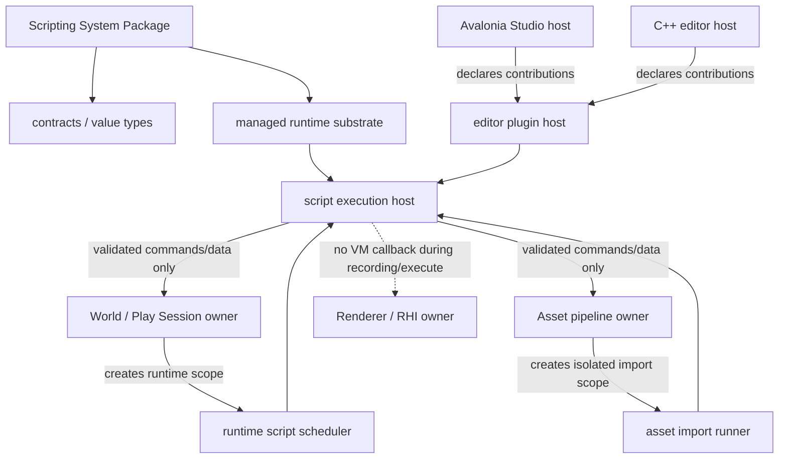

# Managed Extension Model

状态：Accepted Direction；实现仍为 partial/proposal
更新日期：2026-07-13

## 文档定位

本文记录 C# / managed scripting、Editor extension、Avalonia Studio 和 native bridge 的长期边界。
它是 ADR，不是执行计划。当前 package、target 与进程事实以
[flow.md](flow.md)、[editor.md](editor.md) 和
[Studio 架构入口](../../apps/studio/docs/architecture/README.md) 为准；实际 Slice 状态由 GitHub
Issues / Project 维护。

## 当前事实

- `apps/editor` 是 C++ / Dear ImGui native editor host。
- `apps/studio` 是已存在的 Avalonia Studio host，并在自己的 Architecture/ADR 中维护当前代码框架、
  Editor module、Viewport 与 extension 目标。
- 当前仓库没有可由 Package Manager 安装并激活的通用 .NET Scripting System，也没有可宣称稳定的
  runtime gameplay script scheduler。
- `packages/systems/editor`、`packages/systems/scripting-dotnet`、
  `engine/package-runtime` 和 `engine/host-runtime` 仍是目标物理结构，不是当前 target。
- native renderer、RHI、RenderGraph、World 与 GPU resource lifetime 仍由 C++ owner 控制。

## 决策

面向用户只交付完整 System Package，不要求用户分别安装内部实现模块：

```text
com.asharia.system.scripting-dotnet
  contracts
  managed_runtime_substrate
  script_execution_host
  editor_plugin_host
  runtime_script_scheduler
  asset_import_runner
  editor contributions
  diagnostics
```

这些名称表示包内职责或 internal targets/modules；是否拆成独立 target 取决于真实 consumer 和依赖边界。
Package Manager 解析、锁定和激活的是完整 Scripting System Package。

Editor System、Scripting System 与 host 的关系：



核心约束：

1. `ManagedRuntimeSubstrate` 只负责 runtime 装载、绑定、generation 与卸载基础，不理解 Editor、
   World、Asset 或 renderer 业务。
2. `ScriptExecutionHost` 负责执行上下文、safe point、取消、诊断和 capability 校验。
3. `EditorPluginHost` 负责 contribution 注册、diff、生命周期与 editor command 路由，不直接执行
   任意 handler。
4. Runtime gameplay、Editor tool 和 asset import 使用不同 scope/context；它们不能共享可变 service bundle。
5. Renderer/RHI/RenderGraph command recording 不回调 VM。脚本只在 record/build 前端或更早 safe point
   生成经过验证的 immutable descriptor、command 或 packet。

## 所有权

| 数据或状态 | Owner | Managed 侧可见形式 |
| --- | --- | --- |
| World mutable state | World / Play Session | scoped command、snapshot、stable handle |
| Editor selection、transaction、workspace | Editor System `editor_domain` | EditorCommandContext / contribution facade |
| Source asset 与 import settings | Content/Asset System | isolated import request、product writer |
| Render packet / pipeline product | Renderer/Content owner | immutable schema-backed descriptor |
| Vulkan device、queue、image、descriptor、fence | RHI owner | 不直接暴露 |
| Avalonia Window、Control、Dispatcher | Studio host | host-owned contribution/content lease |
| Managed assembly、ALC、generation | Managed runtime substrate | generation handle、diagnostics |
| Package lock 与 activation plan | Package Runtime / Host Runtime | read-only resolved package facts |

Managed extension 不持有裸 C++ 指针、活动 scene object、Vulkan handle 或 host control lifetime。
跨 ABI 引用使用 stable id、generation handle、owned buffer/string 或版本化 DTO。

## Editor extension 模型

扩展分为声明和执行两部分：

- 声明：panel、menu/action、command metadata、inspector section、asset validator、viewport overlay intent。
- 执行：宿主在 safe point 创建受限 context，经 transaction、diagnostics 和 cancellation 调用 handler。
- 渲染：extension 只提交 backend-neutral draw/overlay/pipeline descriptor；renderer owner 决定 pass、资源和
  GPU lifetime。
- UI：简单工具可用 Code-first contribution；复杂 Avalonia 内容通过 host-owned content lease；
  extension 不直接拥有顶层 Window 或全局 Dispatcher。

Studio 的具体 module、authoring、Avalonia lease 和 reload 规则以
[Studio Extension Model](../../apps/studio/docs/architecture/studio-extension-model.md)、
[Editor Extension Authoring](../../apps/studio/docs/architecture/editor-extension-authoring.md) 和
[Build And Reload](../../apps/studio/docs/architecture/editor-extension-build-and-reload.md) 为准。

## Scope 与 safe point

第一版至少区分：

| Scope | 允许的 mutation | 禁止 |
| --- | --- | --- |
| Editor command | transaction-backed editor/world edit | 直接改 renderer/RHI |
| Runtime update | 当前 Play World 暴露状态 | 访问 Editor UI/service |
| Asset import | isolated source metadata -> product | 访问 active World/GPU resource |
| Render authoring | 生成 graph/pipeline descriptor | execute/record 阶段 VM callback |

每次执行必须携带 scope id、package/module id、generation、cancellation token 和 diagnostic sink。
超时、取消、reload 或 scope stop 后，旧 generation 的 callback/result 必须被拒绝。

## Reload 与故障恢复

- Package/module reload 先停止新调用，再取消旧 generation work，撤销 contributions，等待 lease 释放，
  最后尝试卸载。
- 新 generation 构建或加载失败时保留 last-known-good；不得留下半注册 contribution graph。
- AssemblyLoadContext 卸载必须有 negative tests，覆盖静态事件、后台任务、线程、delegate、UI content 和
  native callback 泄漏。
- 无法在进程内可靠回收或不可信的 extension 使用 worker/process isolation；capability enum 不是安全沙箱。

## Native ABI

需要 native bridge 时，ABI 必须显式定义：

- ABI version 与 struct size；
- fixed-width types 与 calling convention；
- thread affinity、reentrancy 和 callback lifetime；
- string/buffer ownership 与配套 free API；
- JSON/binary DTO schema version；
- generation、cancellation 和 wrong-thread failure；
- shutdown 后调用与重复释放的负向行为。

CPU-only bridge 先于 viewport/GPU bridge。跨平台 Viewport presentation 以 Studio ADR 和
[viewport-rendering.md](../../apps/studio/docs/architecture/viewport-rendering.md) 为准，不能让 Avalonia 或
managed extension 接管 Vulkan resource lifetime。

## 明确禁止

- 把 C# UI、Editor plugin、runtime gameplay script 和 asset import script 合并成同一 host/context。
- 让 `EditorPluginHost` 绕过 `ScriptExecutionHost` 直接调用 handler。
- 用 process-wide `getService<T>()` 暴露所有 host 服务。
- 把 `FacadeCapability` 描述成不可信代码沙箱。
- 在 RenderGraph compile/execute、Vulkan command recording 或 queue submission 中回调 VM。
- 为目录整齐提前创建没有真实 consumer、lifetime 和 tests 的 internal target。
- 让项目选择包内 internal modules；项目只选择完整 System/Feature/Integration Package。

## 实现进入门禁

在新增 managed execution Slice 前，必须同时具备：

- package lock 与 activation plan 能表达完整 Scripting System；
- Editor transaction/safe point 或 Play World scope 已是明确 owner；
- generation、取消、停止、失败回滚和 diagnostics 合同；
- 至少一个真实 consumer，不为抽象而创建空 target；
- package-local unload/negative tests；
- 如涉及 native ABI，完成 version/size/thread/ownership/reentrancy tests；
- 如涉及 renderer authoring，遵守
  [programmable-pipeline.md](../rendergraph/programmable-pipeline.md)。

## 相关文档

- [foundation-framework.md](foundation-framework.md)
- [package-first.md](package-first.md)
- [editor.md](editor.md)
- [editor-ui-scripting.md](editor-ui-scripting.md)
- [project-build-and-launch.md](project-build-and-launch.md)
- [systems/scripting.md](../systems/scripting.md)
- [system-architecture-roadmap.md](../planning/system-architecture-roadmap.md)
- [Studio architecture](../../apps/studio/docs/architecture/README.md)
