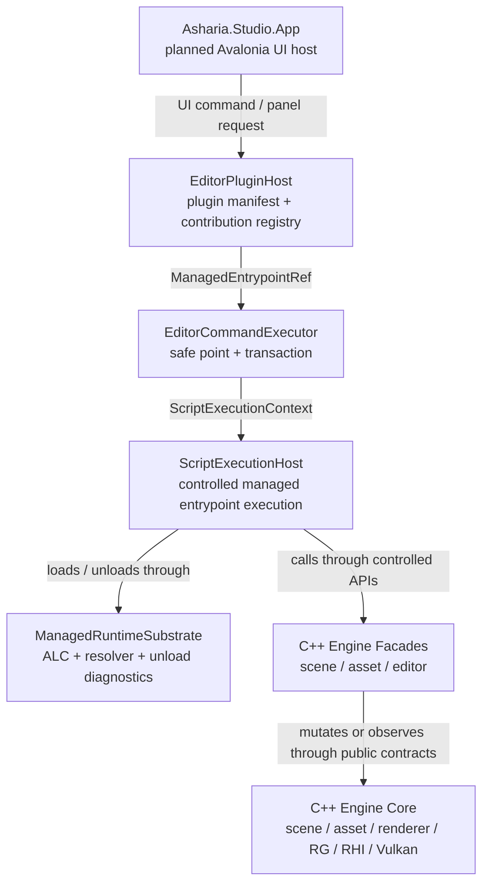
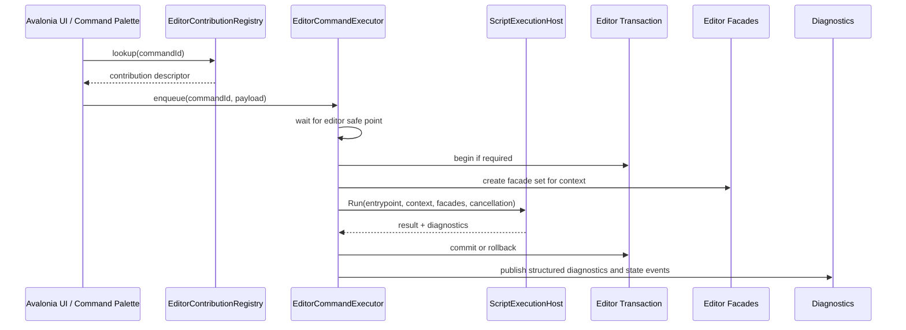

# Managed Extension Model

状态：Long-term ADR / Accepted Direction / Deferred Implementation
日期：2026-06-13

本文定义 Asharia Engine 未来 C# / managed 扩展、插件、脚本、Avalonia Studio 和 native bridge 的长期边界。
它是架构方向 ADR，不是当前实现计划，不替代
[../planning/next-development-plan.md](../planning/next-development-plan.md)。

`docs/planning/system-architecture-roadmap.md` 已把 Scripting 定义为 first-party bundled 完整 System Package，
并把通用 package resolver/lockfile 放到较早的架构阶段。本文的 deferred implementation 指
managed execution、plugin host、ALC、hot reload 和 native bridge，不阻止 Package Manager
发现并锁定完整 `com.asharia.system.scripting-dotnet`；contracts、runtime、managed provider、Editor 与 import
能力是该系统包的内部 targets/modules，不作为用户分别安装的条目。

## Decision Card

接受方向：

```text
PluginHost / ScriptExecutionHost / ManagedRuntimeSubstrate / Avalonia host / C++ owner 必须拆开。
```

当前执行范围：

```text
当前只允许 contract-only ADR、manifest schema 草案、FacadeCapability 说明、
ALC negative smoke 设计和 Native C ABI checklist。
```

进入条件：

```text
Phase B-G 的 scene/editor transaction、asset/material/resource、Play Session 和 diagnostics 合同稳定后，
再进入 Phase H 的 plugin / script / hot reload / advanced GPU 方向。
```

当前禁止：

```text
- 新增 managed/ 空目录或空 csproj。
- 新增 apps/studio 空壳。
- 提取 `packages/systems/editor` 内部 `editor_domain` target 只为搬文件。
- 新增 `editor_native_bridge` internal target 但没有真实 managed/native consumer。
- 把 .NET runtime host 接入 C++ editor 主循环。
- 引入外部 plugin manifest loader。
- 引入 runtime gameplay ScriptHost。
- 把 PreRenderConfig 写入第一版 ABI。
```

## Intent

这份 ADR 解决的是长期扩展模型的边界问题，而不是选择一门语言或一个 UI 框架。

必须避免的错误模型：

```text
C# = 脚本 = 插件 = UI
```

推荐模型：

```text
C# 是 managed 语言候选。
Avalonia 是未来 editor presentation host。
Plugin 是 `feature` / `integration` catalog package 中可选的代码扩展与 contribution 声明单元；Package Manager 分发包，Facade/API 仍由依赖的 System Package 提供。
Managed entrypoint 是受控执行代码。
ScriptExecutionContext 定义代码在哪个 safe point / context 下执行。
Facade 是插件或脚本能访问的受控 API。
FacadeCapability 是 facade 访问能力声明，不是安全 sandbox。
Transaction 是 editor 持久修改 scene / asset / project 的路径。
Native bridge 是 managed/native 边界。
C++ engine 继续拥有 scene、asset、renderer、RenderGraph、RHI 和 Vulkan 的真实状态。
```

## Current Constraints

当前仓库事实：

- `apps/editor` 是 C++ / Dear ImGui editor host，拥有 ImGui runtime、panel/action/event、viewport coordination、
  texture registry、Frame Debug 和 editor smoke。
- `apps/editor` 可以在 host integration 层组合 `window-glfw`、`rhi-vulkan` 和 `renderer_basic_vulkan`，
  但 editor panel 不能录制 Vulkan command、注册 descriptor 或持有 GPU resource。
- `packages/rendergraph` 必须保持 backend-agnostic，不能暴露 Vulkan layout、stage、access、barrier、
  command buffer 或 descriptor。
- `asharia::rhi_vulkan` 是基础 Vulkan backend target，不能公开依赖 RenderGraph。
- `asharia::rhi_vulkan_rendergraph` 是 RenderGraph 到 Vulkan 的适配 target。
- `asharia::renderer_basic` 保持 backend-agnostic；Vulkan command recording 属于
  `asharia::renderer_basic_vulkan`。
- `packages/systems/editor` 内部 `editor_domain` target 未来只能接收 backend-neutral editor state，例如 selection、commands、undo/redo、
  workspace 和 viewport request/result 合同。
- `script VM / plugin manifest / hot reload` 是 Phase H 候选方向，进入前必须先有设计 ADR、fallback、
  smoke 和 profiling evidence。

## Design Principles

- 先定 owner，再谈 API。
- 先定 safe point，再谈执行。
- 先定数据合同，再谈 UI、VM 和 hot reload。
- 先定验证门槛，再谈目录和 package。
- Plugin manifest owns declarations, not execution.
- ScriptExecutionHost owns controlled execution, not package discovery.
- ManagedRuntimeSubstrate owns loading and unloading infrastructure, not editor transaction.
- Avalonia owns presentation, not Vulkan / RHI / RenderGraph lifetime.
- C++ engine owns truth.

## Ownership Model

| Layer | Owns | Does Not Own |
| --- | --- | --- |
| `Asharia.Studio.App` planned | editor presentation、dock、views、view models、trusted UI lifecycle | runtime script host、Vulkan/RHI、plugin package semantics |
| `ManagedRuntimeSubstrate` planned | ALC、dependency resolver、contract binding、unload verifier、managed diagnostics | editor transaction、runtime world mutation、asset import policy |
| `EditorPluginHost` planned | plugin package、manifest、contribution registry、enable/disable、reload diff、capability grant | handler execution、transaction、Vulkan/RHI、native object mutation |
| `ScriptExecutionHost` planned | controlled managed entrypoint execution、context/capability validation、exception diagnostics | plugin package discovery、UI rendering、world scheduling |
| `EditorCommandExecutor` planned | editor safe point、transaction、editor facade set、command diagnostics | plugin manifest loader、ALC ownership、Vulkan/RHI |
| `RuntimeScriptScheduler` planned | runtime update safe point、scheduled mutation、script lifecycle | Avalonia、editor-only API、editor transaction |
| `AssetImportRunner` planned | import input/output、diagnostics、future worker isolation | active World、GPU resource、editor viewport |
| C++ Engine Core | scene、asset、renderer、RenderGraph、RHI、Vulkan resource lifetime | Avalonia UI、managed plugin lifecycle |

## Planned Architecture

This diagram is planned architecture. It does not describe code that exists today.



Runtime gameplay scripting is a separate line:

```text
Runtime App / Play Mode Adapter
  -> RuntimeScriptScheduler
  -> ScriptExecutionHost
  -> ManagedRuntimeSubstrate
  -> Runtime facades
  -> Runtime World scheduled mutation
```

Asset import scripting is also separate:

```text
Asset Pipeline
  -> AssetImportRunner
  -> ScriptExecutionHost
  -> ManagedRuntimeSubstrate
  -> isolated import input/output
  -> product dependency / diagnostics
```

## Managed Contract Split

Do not create one large `Asharia.CSharp.dll`. Planned contract assemblies should split by meaning:

```text
Asharia.Managed.Core
  StableId
  Result<T>
  Diagnostic
  DiagnosticSeverity
  FacadeCapability
  ManagedEntrypointRef
  VersionRange
  basic math / POD value types

Asharia.Scripting.Contracts
  RuntimeUpdateContext
  RuntimeScriptContext
  EntityRef
  ComponentRef
  WorldRef
  ScriptComponent attributes
  ScriptSystem base types

Asharia.Editor.Contracts
  EditorPluginManifest
  EditorCommandContribution
  EditorPanelContribution
  EditorToolContribution
  InspectorDrawerContribution
  AssetActionContribution
  EditorCommandContext
  EditorPanelContext
  InspectorContext
  SelectionSnapshot
  InspectorModel
  AssetCatalogSnapshot

Asharia.Studio.Contracts
  optional trusted UI extension contracts
  Avalonia-facing extension contracts, if ever allowed

Asharia.NativeBridge
  P/Invoke wrapper
  host-only; not referenced by normal plugins or runtime scripts
```

Allowed dependency direction:

```text
Asharia.Scripting.Contracts -> Asharia.Managed.Core
Asharia.Editor.Contracts    -> Asharia.Managed.Core
Asharia.Studio.Contracts    -> Asharia.Editor.Contracts
Asharia.Studio.App          -> Asharia.Studio.Contracts / Editor.Contracts / NativeBridge
Runtime game scripts        -> Asharia.Scripting.Contracts only
Editor plugins              -> Asharia.Editor.Contracts, optionally Managed.Core
```

Forbidden dependency direction:

```text
Asharia.Editor.Contracts -> Asharia.Scripting.Contracts
Runtime game scripts -> Asharia.Editor.Contracts
Runtime game scripts -> Asharia.Studio.Contracts
Runtime game scripts -> Asharia.NativeBridge
Editor plugins -> Asharia.NativeBridge by default
```

Shared stable ids, result values, diagnostics and POD math types belong in `Asharia.Managed.Core`.
Do not pull runtime scripting semantics into editor contracts only because two surfaces share a value type.

## FacadeCapability Is Not A Sandbox

`FacadeCapability` controls which Asharia facade APIs are exposed. It is not a security boundary.

Example planned capabilities:

```csharp
public enum FacadeCapability
{
    EditorUiRead,
    EditorCommand,
    SceneEdit,
    AssetMetadataWrite,
    ProjectConfigWrite,
    RuntimeWorldRead,
    RuntimeWorldMutate,
    AssetImportRead,
    AssetImportWrite,
}
```

Rules:

- `FacadeCapability` can decide whether the host provides a controlled Asharia API.
- `FacadeCapability` cannot prevent in-process .NET code from using broad BCL APIs such as file, process or network APIs.
- `FacadeCapability` cannot be documented as a sandbox promise.
- The first managed extension model is for trusted or project-trusted code only.
- Untrusted extensions require out-of-process isolation, file/process/network brokers, explicit IPC, timeout/kill policy,
  package signing or a separate trust policy.

The future manifest schema must define where grants are stored, how users or projects approve them, how they are revoked,
and what happens when a plugin update requests a new or reduced capability set.

## Plugin Manifest

Manifest is declaration, not execution.

```csharp
public sealed record EditorCommandContribution
{
    public required string CommandId { get; init; }
    public required string Title { get; init; }
    public string? MenuPath { get; init; }
    public string? DefaultShortcut { get; init; }
    public required ManagedEntrypointRef Entrypoint { get; init; }
    public IReadOnlySet<FacadeCapability> RequestedCapabilities { get; init; } = new HashSet<FacadeCapability>();
}
```

Manifest rules:

- Contribution ids must be stable.
- Reload uses id diff: added, updated, removed and disabled contributions.
- Manifest must not contain raw callbacks, lambdas, Avalonia controls, ImGui draw callbacks or Vulkan command callbacks.
- Manifest only names entrypoints and data descriptors.
- `EditorPluginHost` registers contribution descriptors. It does not call handler objects.

## Editor Command Execution

Forbidden path:

```text
Avalonia Button
  -> EditorPluginHost
  -> pluginObject.Execute()
  -> mutate scene / asset / native state directly
```

Correct planned path:



Failure rules:

- Capability check failure starts no transaction.
- Script exception rolls back the active transaction.
- Cancellation rolls back the active transaction and emits a cancellation diagnostic.
- Timeout uses cooperative cancellation; forced thread termination is not part of the model.
- Nested transaction behavior must be defined before implementation: either flatten into the active transaction or reject with diagnostics.
- Diagnostics publication failure must not leave committed editor state without an observable error path.
- If reload removes a contribution, open scripted panels enter a disabled diagnostic state.
- If old ALC unload fails, the host retains or disables the old contribution according to retention policy and reports diagnostics.

## Declarative Panel Model

The first plugin panel model is data-only. Plugins do not return raw Avalonia controls or ImGui callbacks.

```csharp
public sealed record EditorPanelModel(
    string PanelId,
    IReadOnlyList<EditorWidgetModel> Widgets,
    uint ModelVersion);

public abstract record EditorWidgetModel
{
    public required string WidgetId { get; init; }
    public required string Label { get; init; }
    public string? BindingPath { get; init; }
    public bool ReadOnly { get; init; }
}

public sealed record ButtonWidgetModel : EditorWidgetModel
{
    public required string CommandId { get; init; }
}
```

Rules:

- The host validates the model before rendering it.
- Widget events become editor commands or action invocations at safe points.
- `BindingPath` must bind to schema/stable ids or be explicitly marked as transient view-model state.
- Panel models are versioned snapshots or diffs, not editor layout truth.
- A failed panel model update leaves the previous valid model visible or replaces it with a diagnostic state.
- Trusted raw Avalonia UI extensions are future privileged capabilities, not v0 ABI.

## Runtime Script Model

Runtime scripting is runtime-neutral and does not belong to `Asharia.Studio.*`.

```text
Asharia.Scripting.Runtime
  -> RuntimeScriptScheduler
  -> ScriptExecutionHost
  -> Runtime facade set
```

Studio only provides a Play Mode adapter:

```text
Asharia.Studio.PlayModeAdapter
  -> creates or runs Play World through native/editor facade
  -> delegates gameplay script execution to runtime-neutral scheduler
  -> does not own RuntimeScriptHost
```

Runtime scripts must not reference:

```text
Avalonia
Asharia.Editor.Contracts
Asharia.Studio.Contracts
Asharia.NativeBridge
editor transaction API
editor-only selection / inspector API
```

Runtime script v0 is blocked until:

- runtime world / edit world / play world copy or snapshot contract is stable;
- schema/persistence can save script exposed state;
- scheduled mutation safe point is mature;
- diagnostics can identify script, entity, component and field;
- editor Play Session does not dirty the edit scene.

## Asset Import Script Model

Asset import scripts operate only on isolated import input/output.

```text
Source metadata
  -> AssetImportRunner
  -> import settings / product dependency output
  -> diagnostics
```

Rules:

- Import scripts cannot access active World.
- Import scripts cannot create GPU resources.
- Import scripts can return diagnostics, settings and dependency output.
- Worker/process isolation is a future implementation option, not the first contract.

## PreRenderConfig Is Reserved

`PreRenderConfig` and renderer scripting are reserved for a later ADR.

Reasons:

- It would freeze renderer scripting / SRP-like API too early.
- Runtime script update needs a clear safe point first.
- Render command recording must not call the VM.
- Renderer feature authoring needs RenderGraph resource lifetime, profiling, fallback and diagnostics to be stable first.

Allowed placeholder:

```csharp
// Reserved for future ADR only. Not part of v0 ABI.
// PreRenderConfig
```

## ManagedRuntimeSubstrate And ALC

Planned responsibilities:

- collectible `AssemblyLoadContext` management;
- `AssemblyDependencyResolver`;
- contract assembly binding;
- shared contract identity checks;
- unload verifier;
- reload session diagnostics;
- managed entrypoint discovery;
- dependency/version conflict reports.

Loading rules:

- Each plugin package uses an independent collectible ALC.
- Each runtime script domain uses an independent collectible ALC.
- Contract assemblies are provided by the host default context.
- Plugins should not ship their own `Asharia.Editor.Contracts.dll` or `Asharia.Managed.Core.dll` copy.
- Load validates API version, contract identity and dependency closure before contribution registration.

Unload rules:

- ALC unload is cooperative, not forced.
- A clean no-op unload smoke is not enough.
- The host must survive failed unloads and report structured diagnostics.

Negative smoke design must cover at least:

```text
--smoke-managed-unload-clean
--smoke-managed-unload-static-event-leak
--smoke-managed-unload-thread-leak
--smoke-managed-unload-gchandle-leak
--smoke-managed-unload-timer-leak
--smoke-managed-reload-old-version-retention
```

Unload diagnostics must include:

```text
unload attempt id
plugin id
plugin version
contribution id when applicable
failure category
recovery policy
```

## Native Bridge C ABI Checklist

An `editor_native_bridge` internal target is a valid future direction, but it must not be created without a real managed/native consumer.

When implementation starts, the C ABI must be production-shaped from day one:

```c
#include <stdint.h>

#define ASHARIA_EDITOR_NATIVE_ABI_VERSION 1u

#if defined(_WIN32)
  #define ASHARIA_CALL __cdecl
  #if defined(ASHARIA_EDITOR_NATIVE_BUILD)
    #define ASHARIA_EDITOR_API __declspec(dllexport)
  #else
    #define ASHARIA_EDITOR_API __declspec(dllimport)
  #endif
#else
  #define ASHARIA_CALL
  #define ASHARIA_EDITOR_API __attribute__((visibility("default")))
#endif

#ifdef __cplusplus
extern "C" {
#endif

typedef struct AshariaAbiStructHeader {
    uint32_t abiVersion;
    uint32_t structSize;
} AshariaAbiStructHeader;

typedef struct AshariaStringView {
    const char* data;
    uint64_t size;
} AshariaStringView;

typedef struct AshariaOwnedString {
    const char* data;
    uint64_t size;
    void* owner;
} AshariaOwnedString;

typedef uint32_t AshariaResultCode;
enum {
    ASHARIA_OK = 0u,
    ASHARIA_ERROR_INVALID_ARGUMENT = 1u,
    ASHARIA_ERROR_UNSUPPORTED_ABI = 2u,
    ASHARIA_ERROR_WRONG_THREAD = 3u,
    ASHARIA_ERROR_REENTRANT_CALL = 4u,
    ASHARIA_ERROR_INVALID_HANDLE = 5u,
    ASHARIA_ERROR_INTERNAL = 6u
};

ASHARIA_EDITOR_API void ASHARIA_CALL
asharia_free_owned_string(AshariaOwnedString value);

#ifdef __cplusplus
}
#endif
```

ABI rules:

- Every cross-ABI struct starts with `AshariaAbiStructHeader`.
- Caller fills `abiVersion` and `structSize`.
- Callee checks `abiVersion`.
- Callee reads only fields within `min(structSize, knownSize)`.
- New fields append only; deleting or reordering fields is forbidden.
- Do not pass C/C++ `bool` across ABI. Use `uint32_t`.
- Do not pass unpinned object pointers or C++ object pointers across ABI.
- Use fixed-width integer types for sizes and enum-like result values.
- Strings and paths are UTF-8 with explicit byte size.
- Native-owned strings and buffers must be freed by native free functions.
- C# bindings should use `SafeHandle` or an equivalent deterministic owner for opaque handles.
- C# bindings must match native calling convention, integer widths, alignment and ownership.
- Exceptions do not cross ABI. Convert to `AshariaResultCode` plus diagnostic JSON.

Threading and reentrancy:

- editor host create/destroy: main thread only;
- viewport create/resize/render/destroy: render/editor owner thread only;
- CPU-only snapshot APIs can be declared main-thread-only or worker-safe;
- callbacks are forbidden by default unless a separate ADR defines them;
- wrong-thread calls return `ASHARIA_ERROR_WRONG_THREAD`;
- reentrant calls that mutate the same owner state return `ASHARIA_ERROR_REENTRANT_CALL`;
- UI commands enter a queue and execute at a safe point.

First API set should be CPU-only:

```text
create/destroy host
open project
get asset catalog snapshot
get diagnostics snapshot
get action registry snapshot
invoke editor command through safe queue
```

Native Vulkan viewport APIs are later work.

## Avalonia Native Viewport

Avalonia may eventually host a native viewport, but Avalonia does not own Vulkan.

```text
Avalonia SceneViewDocument
  Row 0: toolbar / mode controls / non-overlay UI
  Row 1: NativeControlHost
          -> native child window
          -> C++ creates platform surface
          -> C++ owns swapchain / RenderView / RHI resource lifetime
```

Rules:

- Avalonia toolbar modifies editor state or overlay setting models.
- Grid, gizmo, selection outline and debug lines are drawn inside the native viewport by renderer/overlay bridges.
- C# plugins cannot create `VkImage`, `VkImageView`, descriptors or command buffers.
- Native viewport work starts only after CPU-only native bridge contracts and smokes are stable.

## Hot Reload Strategy

Reload is three separate workflows.

Editor plugin reload:

```text
freeze new plugin actions
finish or rollback active editor transactions
load candidate plugin in new ALC
validate manifest and capabilities
diff contribution ids
switch registry at a safe point if valid
attempt unload old ALC
retain or disable old contribution if old unload fails
keep previous valid version if new load fails
resume actions
```

Runtime script reload:

```text
pause runtime script update safe point
snapshot exposed serialized state
load candidate script assembly
validate component/system schema
restore exposed state
mark removed type/function diagnostics
resume runtime update
```

Asset import rule reload:

```text
stop scheduling new import jobs for affected rules
let running jobs finish or cancel cooperatively
load candidate rule assembly
validate declared input/output schema
resume import scheduling
```

Reload must not:

- restore arbitrary stack frames;
- retain closure private state;
- happen during render command recording;
- pretend to be an in-process security sandbox;
- forcefully kill ALC-owned threads.

## Diagnostics

All managed extension failures must be structured.

Recommended fields:

```csharp
public sealed record ManagedExtensionDiagnostic
{
    public required string DiagnosticId { get; init; }
    public required DiagnosticSeverity Severity { get; init; }
    public required string OwnerStage { get; init; }
    public string? PluginId { get; init; }
    public string? PluginVersion { get; init; }
    public string? ContributionId { get; init; }
    public string? Entrypoint { get; init; }
    public string? ContextKind { get; init; }
    public string? SourcePath { get; init; }
    public int? Line { get; init; }
    public int? Column { get; init; }
    public string? StableObjectId { get; init; }
    public string? FailureCategory { get; init; }
    public string? RecoveryPolicy { get; init; }
    public string Message { get; init; } = "";
}
```

Required categories:

```text
ManifestInvalid
ContractVersionMismatch
DependencyResolutionFailed
EntrypointMissing
CapabilityDenied
ExecutionException
TransactionRollback
UnloadFailed
UnloadLeakSuspected
ReloadOldVersionRetained
WrongThread
ReentrantNativeCall
UnsupportedAbiVersion
JsonSchemaMismatch
```

## Extraction Gates

### `packages/systems/editor` / `editor_domain` target

Do not extract `editor_domain` only to move files.

Allowed entry conditions:

- Hierarchy consumes a real scene snapshot.
- Scene View picking / selection uses stable selection ids.
- Inspector consumes selection through a data-only model.
- Transaction-backed writable transform fields work.
- Dirty state, undo/redo and validation have real cross-panel consumers.
- At least two hosts or two backend-neutral consumers need the same editor state contract.

Allowed content:

```text
EditorId
Action/Event metadata
Selection model
Transaction / dirty-state model
Inspector data model
Editor service facade descriptors
```

Forbidden content:

```text
ImGuiContext
ImTextureID
Avalonia Control
GLFWwindow
VkImage / VkImageView / VkDescriptorSet
renderer implementation objects
native viewport handle
```

### `editor_native_bridge` internal target

Do not create `editor_native_bridge` without a real managed/native consumer.

Allowed entry conditions:

- Avalonia sidecar/workbench has a real CPU-only bridge need.
- Existing CLI JSON calls cannot satisfy interaction needs.
- C ABI checklist is frozen.
- Thread affinity, ABI version, struct size and free rules are written into the ADR.
- Smoke plan is explicit.

Native viewport API remains later work.

## Long-Term Decomposition

These are not current mainline phases and do not replace
[../planning/next-development-plan.md](../planning/next-development-plan.md).

| Stage | Entry Gate | Allowed Work | Explicit Non-Goals |
| --- | --- | --- | --- |
| L0 Concept Freeze / ADR Only | current | managed-extension-model ADR, manifest schema draft, FacadeCapability note, C ABI checklist, ALC negative smoke design | managed runtime implementation, plugin loader, ScriptExecutionHost implementation, `apps/studio`, editor-core/native extraction |
| L1 Phase H Entry Check | Phase B-G stable | review scene/editor transaction, asset/material/resource, Play Session and diagnostics contracts | implementation before evidence |
| L2 Managed.Core Contract Prototype | L1 passed | shared value types only | runtime scripting behavior |
| L3 ManagedRuntimeSubstrate Skeleton | L2 stable | ALC create/load/unload, contract binding, resolver, unload smokes | editor command or runtime world integration |
| L4 ScriptExecutionHost EditorCommand Smoke | L3 stable | editor command context, capability check, transaction rollback, diagnostics | runtime gameplay ScriptHost |
| L5 EditorPluginHost v0 | L4 stable | manifest, contribution registry, command contribution, declarative panel model, reload diff | direct handler execution |
| L6 Avalonia Sidecar / Workbench Decision | product workbench need | Project / Asset Browser, Console / Diagnostics, read-only Inspector, action registry viewer | Vulkan viewport |
| L7 Native Bridge CPU-only | L6 need proven | CPU-only bridge | viewport |
| L8 Native Vulkan Viewport | CPU bridge and C ABI smokes stable | native viewport bridge | Avalonia-owned Vulkan |
| L9 RuntimeScriptScheduler v0 | Play Session stable | runtime update safe point and exposed state reload | Studio-owned runtime host |
| L10 AssetImportRunner v0 | import metadata/settings/product dependency stable | isolated import rule execution | active World or GPU resource access |
| L11 PreRenderConfig / Renderer Scripting ADR | renderer feature contracts stable | separate ADR only | v0 ABI inclusion |

## Validation Matrix

| Area | Validation |
| --- | --- |
| Managed substrate | `--smoke-managed-load-basic`, `--smoke-managed-contract-binding`, clean unload and negative unload smoke design |
| Editor command execution | permission denied, rollback, cancellation and diagnostic smoke |
| Plugin manifest | valid/invalid manifest and reload diff smoke |
| Declarative panel model | model validation, failed model fallback and command event routing smoke |
| Native C ABI | ABI version, struct size forward compatibility, wrong thread, reentrant call, owned string free and JSON schema version smoke |
| Runtime scripting | future only; blocked by Play Session, world copy/snapshot and script exposed state persistence |
| Asset import scripting | future only; blocked by source metadata, import settings and product dependency contracts |
| Renderer scripting | future ADR only; blocked by RenderGraph/resource lifetime/profiling/fallback diagnostics |

Current stage only writes smoke design. It does not implement these smokes.

## Rejected Designs

Rejected: `C# = UI = plugin = runtime script`
Reason: UI host, plugin contribution lifecycle, script execution and runtime mutation have different lifetimes and safety rules.

Rejected: `EditorPluginHost` directly calls handler objects
Reason: bypasses context validation, capability checks, editor safe point, transaction and diagnostics.

Rejected: C# plugin holds mutable C++ pointers
Reason: breaks lifetime, reload, thread ownership and diagnostics.

Rejected: `FacadeCapability` as security sandbox
Reason: in-process managed code can use broad runtime APIs unless isolated by process/OS policy.

Rejected: Avalonia owns Vulkan viewport lifetime
Reason: C++ owns swapchain, RenderView, RHI resources, deferred deletion and renderer diagnostics.

Rejected: `PreRenderConfig` in first ABI
Reason: freezes renderer scripting and SRP-like API before renderer feature contracts are stable.

Rejected: empty `managed/`, `apps/studio`, `editor-core` or `editor-native` shells
Reason: creates false architecture surface before consumers and validation exist.

## Review Checklist

```text
[ ] PluginHost and ScriptExecutionHost responsibilities are separate.
[ ] ManagedRuntimeSubstrate is shared and not reimplemented per host.
[ ] PluginHost does not execute handler objects.
[ ] Every handler execution goes through ScriptExecutionHost.Run.
[ ] Editor command handlers run at an editor safe point and through transaction.
[ ] RuntimeScriptScheduler is not under Asharia.Studio.*.
[ ] Editor.Contracts does not depend on Scripting.Contracts.
[ ] Shared id/result/diagnostic/math types live in Managed.Core.
[ ] FacadeCapability is not documented as a sandbox.
[ ] Untrusted plugins require process/worker isolation, not in-process enum checks.
[ ] ALC smoke design includes negative leak cases.
[ ] Native C ABI uses fixed-width types, version, struct size, calling convention, thread affinity, ownership, JSON schema, reentrancy and free rules.
[ ] PreRenderConfig remains reserved/future.
[ ] editor-core is not extracted before real backend-neutral consumers exist.
[ ] editor-native is not extracted before a real managed/native consumer exists.
[ ] No managed/ or apps/studio empty shell is created.
[ ] This ADR does not replace next-development-plan.
```

## Related Documents

- [overview.md](overview.md) - current module boundaries, ownership and lifetime.
- [flow.md](flow.md) - current package graph and frame/render data flow.
- [package-first.md](package-first.md) - package-first rules and CMake target boundaries.
- [editor.md](editor.md) - current C++ / Dear ImGui editor host.
- [editor-ui-scripting.md](editor-ui-scripting.md) - editor UI and script collaboration boundary.
- [editor-extension-architecture.md](editor-extension-architecture.md) - editor extension and overlay contracts.
- [../systems/scripting.md](../systems/scripting.md) - script system architecture; this ADR narrows first ABI scope.
- [architecture-principles.md](architecture-principles.md) - cross-system ownership and feature entry checks.
- [../planning/next-development-plan.md](../planning/next-development-plan.md) - current mainline phase order.

External references used for this ADR direction:

- .NET AssemblyLoadContext unloadability: <https://learn.microsoft.com/en-us/dotnet/standard/assembly/unloadability>
- .NET native interoperability best practices: <https://learn.microsoft.com/en-us/dotnet/standard/native-interop/best-practices>
- Avalonia Native Interop: <https://docs.avaloniaui.net/docs/app-development/native-interop>
