# Package-first 文件与包管理设计

## 目标

Asharia Engine 不采用“一个应用包含所有功能”的组织方式。engine core 保持小而稳定，基础能力以完整
System Package 引入，附加能力以完整 Feature/Integration Package 引入；不同 host，比如 sample runtime、game app、editor、offline tools，
从已导入系统包中激活不同 modules。Package Manager 不让用户直接拼装内部 targets。

这能带来三个好处：

- runtime app 不需要被 editor 依赖污染。
- renderer、render graph、asset pipeline、editor UI 可以通过内部 targets/modules 独立演进。
- 后续项目可以只引入需要的完整 systems/features，而不是复制巨型工程或手工拼装 implementation fragments。

## 仓库目录

```text
AshariaEngine/
  apps/
    sample-viewer/
    editor/
  engine/
    core/
    platform/
  packages/
    window-glfw/
    profiling/
    rendergraph/
    schema/
    archive/
    project-core/
    asset-core/
    asset-pipeline/
    resource-runtime/
    material-core/
    shader-authoring/
    shader-material-adapter/
    material-instance/
    scene-core/
    cpp-binding/
    persistence/
    reflection/
    serialization/
    rhi-vulkan/
    renderer-basic/
    shader-slang/
  cmake/
  docs/
  profiles/
  scripts/
  tools/
    asset-processor/
```

目标系统发行根包括以下方向；不表示应立即搬迁当前目录：

```text
AshariaEngine/
  packages/
    systems/
      desktop-platform/
      memory/
      runtime-storage/
      settings/
      data-model/
      content/
      world/
      tasks/
      input/
      scripting-dotnet/
      rendering-vulkan/
      editor/
      project-product/
      observability/
    features/
      advanced-camera/
    integrations/
    asset-packs/
    templates/
  engine/
    package-runtime/
    host-runtime/
  package-registry/
  shaders/
  tests/
```

`packages/` 的第一层按可安装能力种类组织，而不是按实现技术组织：

- `systems/`：完整基础或领域系统，必须能作为一个原子安装、升级和移除单元；
- `features/`：建立在已有系统 public API 和 contribution points 上的附加产品能力；
- `integrations/`：连接两个已有系统或外部 SDK、DCC 或 service 的完整适配能力；
- `asset-packs/`：承载 catalog type=`content`、且不含 native runtime implementation 的可分发内容；
- `templates/`：创建项目时一次性展开的模板，不形成持续依赖。

不要再按 `rendergraph`、`vulkan`、`editor-ui`、`importer` 等内部技术边界建立同级可安装目录。领域归类通过 manifest
的 `category`、`tags` 和 `hostRoles` 表达，避免为了重新分类反复移动 package identity。

大型系统仍然位于 `packages/systems/<system>/`，内部以独立 modules/targets 保持编译、依赖和 Host Role 边界。例如：

```text
packages/systems/rendering-vulkan/
  asharia.package.json
  CMakeLists.txt
  modules/
    renderer-frontend/
    rendergraph/
    rhi-vulkan/
    rhi-vulkan-rendergraph/
    renderer-vulkan/
    material/
    shader-authoring/
    shader-cook/
    editor/
    diagnostics/
  tests/
  docs/
```

这只是发行所有权和源码导航层级，不允许把现有硬 target 合并成巨型库。`asharia::rhi_vulkan` 不依赖
RenderGraph、`asharia::rhi_vulkan_rendergraph` 单独承担翻译、backend-agnostic renderer 与 Vulkan recording 分离等约束继续成立。

## Core 与 Package 边界

`engine/core` 只允许包含稳定、低层、跨 package 的基础设施：

- bootstrap logging。
- error/result。
- 启动所需的严格 filesystem/path primitives；完整 VFS/async IO 属于 Runtime Storage System。
- assertions。
- small containers 或 utility。
- build configuration。

`engine/core` 不应该依赖 Vulkan、GLFW、Slang、editor UI 或 asset importer。

`engine/platform` 当前是预留 platform abstraction boundary target，只传递 `core` 依赖，不导出公共
header；实际 GLFW window、input polling 和 Vulkan surface glue 仍归 `window-glfw`。

目标架构还新增 `engine/package-runtime` 与 `engine/host-runtime` 两个不同边界：前者解析 manifest/lock 并生成
build plan 与 Host Activation Blueprint；后者在 normal startup 消费 generated sealed current-image descriptor 和 admitted callback table，
拥有 scope、system factory、activation lease、typed contribution registry、application lifecycle 和 safe point。artifact bytes 的 hash
验证留在 build/publication/install/cache restore/repair 边界，不进入每次 normal admission。二者都不实现领域系统，也不提供
全局 service locator。详细设计见
[foundation-framework.md](foundation-framework.md)。

package 用来承载可选能力：

- `window-glfw` 提供 GLFW host 和 Vulkan surface 创建。
- `profiling` 提供后端无关 CPU scope、frame sample、counter 和 JSONL 输出。
- `rhi-vulkan` 提供 Vulkan backend、VMA allocator、swapchain、command/sync。
- `rendergraph` 提供图声明、编译、barrier planning 和执行接口。
- `schema` 提供稳定 type/field id、value kind 和 typed metadata。
- `archive` 提供 `ArchiveValue` 和严格 JSON IO facade，不暴露第三方 JSON 类型。
- `cpp-binding` 提供 C++ object/member 与 schema field 的读写绑定。
- `persistence` 组合 schema、archive 和 binding，提供 save/load/default/migration。
- `scene-core` 提供 headless World、runtime EntityId 和 local Transform baseline。
- `project-core` 提供最小 Asharia project descriptor。当前只保存 project identity、asset source roots、
  asset cache root policy 和 discovery ignore policy；不保存 target profiles、asset profiles、
  package/export 设置、editor workspace 或 runtime/GPU state。
- `project-bootstrap` 是 Engine Distribution 固定选择、项目不可替换的 source boundary。reader/summary target 复用
  `project_core_io` 读取真实 `asharia.project.json`；provider target 发布单例 `ProcessApplicationV1`。factory create/activate 不做
  project IO，只有 ProcessScope Active 后的 `run()` 才读取并输出确定性摘要。它不进入 `package-runtime`，也不打开 asset database、
  World 或项目插件。
- `reflection` / `serialization` 是过渡兼容 package，不再承载新 editor、script、asset 或 migration 语义。
- `renderer-basic` 提供后端无关 renderer contract 和共享 RenderGraph pass schema。
- `renderer-basic-vulkan` target 负责 Vulkan 命令录制、descriptor/pipeline/resource 绑定和 sample renderer。
- `shader-slang` 提供 Slang 编译、SPIR-V validation、metadata 和 reflection JSON。
- `asset-core` 提供最小资产身份、asset type、runtime-safe handle/reference、source metadata model、
  product/cache key、dependency 和 catalog；`.ameta` metadata IO 位于可选 `asharia::asset_core_io`
  target，依赖 `archive` facade，不把 JSON/persistence 依赖强加给 identity/handle API。
- `asset-pipeline` 第一阶段提供 CPU-only metadata discovery / product execution baseline：读取显式
  source/.ameta 条目，产出 deterministic manifest / catalog 输入、product blob 和诊断；它可以私有复用
  texture importer、`material-instance` 或 `shader-authoring` 等 importer-specific package，但不把这些语义
  推入 `asset-core`，也不拥有 watcher、后台 import 调度、GPU upload 或 editor UI。
- `resource-runtime` 当前是 CPU-only product-resolution baseline：按稳定资产 key 和期望 product record 管理
  request generation 与 Pending/Ready/Failed 状态；它尚不读取 artifact bytes、不拥有 typed CPU payload 或 GPU object。
- `material-core` 提供 CPU-only material resource signature、descriptor contract 和 pipeline key 数据模型；
  当前只依赖 `core`，不拥有 `.amat` IO、asset import、GPU upload、Vulkan pipeline/cache 或 editor UI。
- `shader-authoring` 提供 CPU-only `.ashader` document model、parser、source spans、authoring diagnostics、
  generated Slang skeleton 和 line mapping；它只依赖 `core`，不调用 Slang compiler，不生成 SPIR-V，
  不依赖 renderer、RHI、asset-pipeline 或 editor。`asset-pipeline` 可以作为 importer/cook glue 私有复用它。
- `shader-material-adapter` 提供 Slang reflection JSON 到 material resource signature 的 CPU-only adapter；
  主 target 依赖 `core`、`material-core` 和 `shader-slang`，generated reflection smoke 可额外使用
  `shader-authoring` 和 `asharia-slang-reflect`，但不进入 renderer、RHI、asset-pipeline 或 editor。
- `material-instance` 提供 CPU-only `.amat` document IO、property override model 和 material type
  reference validation；它可依赖 `archive`、`asset-core` 和 `shader-authoring`，但不依赖 asset-pipeline、
  renderer、RHI 或 editor。
- `tools/asset-processor` 是 root-built offline CLI，组合 `asset_core_io`、`asset_pipeline` 和
  `project_core_io` 做 dry-run / product execution smoke；它不是 renderer、RHI 或 editor host。
- 目标 `packages/systems/editor` 内部 `editor_domain` target 提供 backend-neutral editor service、selection、
  transaction、inspector model 和 package browser contracts；它不是独立安装碎片。

## 目标 Package Manager 体验

状态：Planned Architecture。source-boundary、installable、Project Manifest、Feature Set、Package Lockfile、Host Profile 与
Engine Distribution Manifest v1
的合同/校验基线已经落地；explicit-source Candidate Discovery v1 已能从调用方提供的 exact roots 生成 candidates，deterministic
in-memory Package Resolver v1 已能把 candidates 求解为 canonical exact lock graph；Locked Graph Verification & Reuse v1 已能
在 current Project/engine/candidate/payload 全部对证后只读复用 existing exact graph。Host Composition Plan v1 schema、pure planner
与 canonical logical IR 已实现；[Source Build Plan v1](adr-source-build-plan-v1.md) 的 source descriptor、normalized CMake
codemodel evidence 与 pure planner 边界也已实现；[Package Product & Artifact Evidence v1](adr-package-product-artifact-evidence-v1.md)
的 Product Declaration、candidate snapshot 与 pure per-package artifact verifier 已落地；
[Package Artifact Collection & Publication v1](adr-package-artifact-collection-publication-v1.md) 也已为 #278 实现显式 root、
流式 staged verification 与不可变 artifact generation publication；
[Engine Distribution Manifest v1](adr-engine-distribution-manifest-v1.md) 的只读发行库存、内容派生 `EngineGenerationId`、
semantic validator 与 canonical writer 也已实现。[Effective Session v1](adr-effective-session-v1.md) 已将 Distribution、
Project/Lock v2、selected candidates 与 exact Distribution-owned Host Profile 派生为 Ready/Upgrade/Repair/SafeMode 结果，
并把 Host Composition / Source Build / artifact handoff 硬切到 session verified graph。
[Engine Distribution Assembly v1](adr-engine-distribution-assembly-v1.md) 已把 Editor Image、bundled candidates、artifact receipts 与
exact Host Profiles 组装为 staged-byte-derived immutable generation。
[Installed Distribution Repair Verifier v1](adr-installed-distribution-repair-verifier-v1.md) 已从外部 expected generation ID
只读重建磁盘 artifact evidence，并完整复验 installed generation；它不修复、不选择或激活 generation。
[Engine Distribution Package Catalog Snapshot v1](adr-engine-distribution-package-catalog-snapshot-v1.md) 已把
`VerifiedInstalledDistribution` 的完整 bundled inventory 投影为确定、原子、只读的内存 candidate snapshot，并在交给 resolver 前
重新收集和对证 exact manifest/payload evidence；它不持久化第二份 catalog，也不依赖 existing Project Lock。
[Package Factory / Scope / Lifecycle Declaration v1](adr-package-factory-scope-lifecycle-v1.md) 已实现 package-local logical factory、
owner scope、required factory 与 contribution ownership 合同，并纳入 Candidate Discovery、Locked Verification 和 Effective Session
fingerprint；它不创建 instance。[Host Activation Blueprint v1](adr-host-activation-blueprint-v1.md) 已将 Ready Session、
Host Composition 与 exact factory snapshots 派生为固定 scope topology、factory dependency order 和 selected contribution bindings；
它是构建期逻辑蓝图，不伪造尚不存在的 artifact、symbol 或进程加载证据。
[Static Factory Provider Bindings v1](adr-static-factory-provider-bindings-v1.md) 为 #286 建立了最初边界；#294 曾将 active author
bindings 与 derived Binding Plan 硬切为 v3，#295 已再硬切为 schema/model v4/provider API v4。独立
`asharia.package.static-factory-bindings.json` 继续作为 author-owned source sidecar；Factory/Build cross binding、Candidate Discovery exact
snapshot、Locked Verification 与 Effective Session fingerprint 继续覆盖它。派生 Binding Plan 会进一步证明 provider target 已被本次
Source Build Plan 选择。它只声明可直接编译引用的静态 provider 入口，不执行注册或 lifecycle，也不成为第三份 lock。
[Generated Static Composition Root v1](adr-generated-static-composition-root-v1.md) 已实现 preflight CMake codemodel →
content-addressed generated sources/controlled target attachment；current renderer 6 只接受 provider v4，并从 verified Session、Blueprint
与 Binding Plan 注入 exact factory/contribution expectations、Effective Session digest 与 ProcessScope projection。C6 为每个 Host 创建
私有 OBJECT attachment；只有它能链接 current-image descriptor constructor bridge。
[Static Factory Callback Table v1](adr-static-factory-callback-table-v1.md) 已为 #291 把 `local factory ID + complete descriptor`
冻结为 current-process table。[Static Typed Contribution Contract Bindings v1](adr-static-typed-contribution-contract-bindings-v1.md)
又为 #294 将 public C++ contract type 的 logical kind/cardinality 与 selected contribution 绑定到同一次 factory registration；table
私有持有 process-local type/accessor evidence，并只向 RegistrationSnapshot v2 投影稳定 ID/kind/cardinality。registration 不调用
lifecycle callback 或 payload accessor。accessor registration 合同见
[Static Contribution Payload Accessors v1](adr-static-contribution-payload-accessors-v1.md)；#296 的 ProcessScope publication、typed lookup、
weak handles 与 contribution-only lease 见
[ProcessScope Contribution Registry and Activation Lease v1](adr-process-scope-contribution-registry-and-activation-lease-v1.md)。
[Windows Development Host Template v1](adr-windows-development-host-template-v1.md) 已为 #290 实现固定 final Host target、受控
configure/build、CMake File API target binding 与 restricted registration verification；#297 已把 active template 硬切到 renderer 3，
把 CLI dispatch、restricted verification 与 normal ProcessApplication orchestration 拆成小 TU。normal path 执行 generated admission →
recording → exact-table admission → ProcessScope start → borrow/run/release `ProcessApplicationV1` → explicit stop。
[Host Executable Binding Receipt v1](adr-host-executable-binding-receipt-v1.md) 已为 #288 把 immutable composition/Template、
same-index target/configured compiler、collector-owned staged executable bytes 与 exact owning snapshot 绑定并原子发布；receipt 不
序列化 callback address，也不拥有 activation lifecycle 或 UI，不证明 `Ready`/current process state。artifact hash/receipt 留在
build/publication/install/cache restore/repair 边界，normal startup 不自 hash executable，也不等待外部 launch receipt。Verified
Distribution bundled catalog snapshot 已实现；Project/local source index、lock update/apply、repair executor、production installable
package/lock declarations 与 Editor Package Manager 尚未实现。Project Manifest / Lock v2 不保留
v1 reader 或 migration adapter。

[Generated Current-Image Host 与 Project Bootstrap v1](adr-generated-current-image-project-bootstrap-host-v1.md) 已由 #297 取代 V1 的
normal Host authority。Eligibility V2 只消费 generated sealed current-image descriptor：Stage 1 校验
T3/C6/provider-v4/Snapshot-v2 tuple、ProcessScope projection、process/control-thread epoch 与一次性 claim；recording 后校验 composition
generation/Blueprint digest，Stage 2 再绑定同一 exact table instance。Effective Session `Ready`、raw receipt/table 或 detached boolean
都不是 admission。

[Bootstrap Project-Open Session v1](adr-bootstrap-project-open-session-v1.md) 已为 #298 把 canonical project root 下的 Manifest/Lock
exact bytes、fresh candidates、Effective Session、C6 与 verified published Host binding 收敛为一个 headless project-open result。它在每个
副作用前使用纯 reducer：non-Ready graph 不启动 Host，missing/stale/invalid project Host 产生 `PendingBuild`，matching binding 才以同一
root 有界运行固定 Project Bootstrap。normal-open 不 hash executable，`PendingRestart` 与完整 `ProjectReady` 仍未产生。

[ProcessScope Lifecycle v1](adr-process-scope-lifecycle-v1.md) 已在 #293 增加独立
`asharia::host_runtime_process_scope` headless target；#296 将其 public surface 硬切到 V2，并在同一 target 内实现 fixed-slot typed registry、
weak generation view/handle 与 contribution-only lease。factory 只有在 activate 后的 selected accessors 全部成功且 lease 原子提交后才成为
dependency-visible，整个 start 成功后 registry 才开放；rollback/stop 在 quiesce 后进入 `Revoking`，反向撤销 leases，再
deactivate/destroy，最后进入 `Revoked`。

normal generated Host 已运行固定 `packages/project-bootstrap` provider 并读取真实 `asharia.project.json`；#298 已增加 headless
Bootstrap state adapter 与 published-Host project-open 执行链，Editor Bootstrap UI、其他 scope owners 与完整
instance/jobs/subscriptions lease 仍未实现。后续功能应继续以可观察 vertical feature 拉动边界，不预建抽象 registry/scope 层。

长期目标是让用户通过 Editor Package Manager 为项目添加、移除和升级**完整可安装能力**。Data、Content、World、Input、Rendering、Physics 等基础能力各自以完整 System Package 表达；Advanced Camera、Dialogue、Weather 等附加能力以完整 Feature Package 表达；跨可选包桥接使用 Integration Package。三者都不能拆成需要用户手工拼装的 contract/runtime/editor/backend fragments。

这条体验必须建立在 headless package control plane 上，同时服从
[Editor Image、Engine Distribution 与原生组合 ADR](adr-editor-engine-distribution-and-native-composition.md) 冻结的
发行/项目所有权：基础 Editor 先于项目图启动，项目 Package Manager 不能替换承载自己的 Engine generation。

```mermaid
flowchart LR
    Editor["Editor Package Manager UI"]
    CLI["CLI / CI"]
    Distribution["Engine Distribution Manifest<br/>fixed EngineGenerationId + bundled inventory"]
    Manifest["Project asharia.packages.json<br/>direct packages + Feature Sets + options"]
    Resolver["Headless Resolver"]
    Lock["Project asharia.packages.lock.json"]
    Profile["Host Profile"]
    Composition["Effective Session / Host Composition<br/>derived, disposable"]
    Build["Conan / CMake / Cook Plan"]
    HostBuild["Windows Development Host<br/>template + exact-target build"]
    Handoff["File API target/compiler<br/>+ registration handoff"]
    Binding["Host Executable Binding Receipt<br/>exact staged bytes + snapshot"]
    CurrentImage["Generated current image<br/>T3 / C6 sealed descriptor"]
    Eligibility["Activation Eligibility V2<br/>two-stage admission"]
    ProcessScope["ProcessScope V2<br/>fixed registry + contribution lease"]
    App["Project Bootstrap<br/>ProcessApplicationV1"]
    Hosts["Editor / Runtime / Server / Tools"]

    Editor -->|"edit dependencies"| Manifest
    CLI -->|"edit or restore"| Manifest
    Manifest --> Resolver
    Resolver --> Lock
    Distribution --> Composition
    Lock --> Composition
    Profile --> Composition
    Composition --> Build
    Build --> HostBuild --> Handoff --> Binding
    Composition --> Binding
    HostBuild --> CurrentImage
    Composition --> CurrentImage
    CurrentImage --> Eligibility
    Eligibility -->|"admitted process projection"| ProcessScope
    ProcessScope -->|"borrow / run / release"| App
    App -->|"explicit stop"| Hosts
```



规则：

- Editor UI 不是 package graph 的事实来源；项目 `asharia.packages.json` / lock 与只读 Engine Distribution Manifest
  分别拥有项目依赖和固定 Engine/Editor 发行库存；Distribution + Project Lock + Host Profile 派生的 Session/Composition
  不成为第三份 lock。
- Package Manager 的导入单位是完整 Installable Capability Package，catalog type 至少区分 `system`、`feature`、`integration`、`content` 和 `template`。
- System Package 共同交付基础领域的 runtime owner、public APIs 和当前 implementation；Editor、tool/cook、diagnostics、backend/provider 等角色只在该系统确实适用时共同交付，Host Profile 只激活兼容部分。
- Feature Package 基于一个或多个 System public APIs，完整交付自己的状态/算法，以及实际适用的 schema/assets、runtime、Editor authoring、cook 和 diagnostics，例如 Advanced Camera Rig。它不需要拥有新的基础系统。
- Integration Package 只在两个独立可选包之间存在真实桥接需求时创建；它显式依赖双方，交付窄 contribution 和兼容测试，不拥有任一侧状态。只有一个依赖方或没有桥接行为时，不创建空 Integration Package。
- CMake target、contract、runtime module、Editor adapter、cook tool、Vulkan bridge 或脚本 VM provider 都不是独立安装条目。它们可以保持硬 target 边界，但共享所属 System Package 的版本、获取和移除生命周期。
- 完整能力可以自动依赖其他完整 packages；“完整”不代表没有依赖，而是用户不会得到缺少其声明能力所需 implementation 或 authoring/cook 支持的半安装状态。
- 安装、升级、降级、移除和 lockfile rollback 以完整 installable package 为原子事务。Host Profile 可以不激活 Editor/cook/backend module，但这不是把能力拆成多个安装状态。
- Editor、CLI、CI、cook 和 runtime 必须共享同一个 resolver 与 host-role filtering 语义。
- `engine/package-runtime` 是 bootstrap exception：它提供 manifest、resolver、lockfile、Host composition 与后继 plan adapters 的最小能力，不能依赖由自己管理的 Editor UI 或某个可选系统。
- Editor executable、最小 UI Shell、package diagnostics、Package Manager/Build/Repair 控制入口和 Safe Mode 属于固定
  Editor Image；它们可以静态链接并深度使用引擎，但不能依赖当前项目 graph 成功激活。
- `engine/host-runtime` 在 normal startup 消费 generated current-image descriptor 和 admitted table，负责 scope/instance/contribution 的
  创建、撤销和失败回滚；它不重新解析版本、读取 artifact bytes 或取得系统领域状态所有权。#293/#296 已建立 ProcessScope V2 lifecycle、
  fixed-slot registry、weak handles、contribution-only lease 与 revoke gate；#297 已由 T3/C6 normal Host 实际执行该路径。其他 scopes、
  Editor Bootstrap state adapter 与完整 instance/jobs/subscriptions lease 仍未实现。
- `asharia.project.json` 继续由 `project-core` 保存项目身份、资产源和缓存；package-runtime 不解析它。固定
  `packages/project-bootstrap` 只通过 `project_core_io` 读取并发布 summary，不取得 project/package schema 所有权。
- `asharia.packages.json` / lock 使用 package-runtime 自己拥有的窄 schema，不能依赖由它负责解析的可选 Data Model package。
- “引擎自带”由 Engine Distribution Manifest 的 `bundledPackages` 固定；Project Lock v2 只用
  `source.kind = engine-distribution` 引用其 identity，不复制 root/hash。`project-embedded` 专指位于项目内、由项目版本控制
  并可编辑的 package。项目/local source 不能用同 identity 覆盖发行 package；v1 `bundled` lock source 不再接受。
- `required`、`default` 和 `optional` 表达 Host/Profile 选择策略，不把默认系统塞进 Kernel。
- 一个 system package 可以包含 runtime、editor、tool、content 和 test modules；Host Profile 只选择兼容 modules。Module 是逻辑 activation unit，可以静态链接、启动时注册、动态加载或由 managed host 加载，不天然支持 hot unload。
- resolver v0 只使用具名完整 package dependencies，例如 Feature Set 直接依赖 `com.asharia.system.rendering-vulkan`、`com.asharia.system.scripting-dotnet` 或 `com.asharia.feature.advanced-camera`；不得直接依赖裸 `rhi-vulkan`、RenderGraph bridge、`.NET provider` 或 `camera-editor` 片段。等第二个真实完整实现出现并完成 ADR 后，再启用 `provides` / `requires capability` 求解。
- Package Manager 只生成 Host composition、build plan 与逻辑 activation blueprint；构建/验证 adapter 再绑定可执行证据。
  它不拥有 World、Renderer、Script VM 或其他系统实例。
- Static Factory Provider Binding 是 source candidate 的构建证据：它把 logical factory 映射到同 module 的静态 target、
  public header 与受限 qualified function；它不是运行时字符串 symbol lookup，也不成为第三份 lock。
- generated root 以 verified binding 为权威注入 package/version/module/entry point 与 exact selected factory/contribution
  ID/kind expectations；provider 只能在同一次 `registerFactory()` 提交 local factory ID、完整 callbacks 与 public contract type 产生的
  available typed bindings。当前 `StaticContributionBindingV2` 还携带 exact typed payload accessor；未选 binding 保持 inert，registration/
  verification 不调用 accessor。RegistrationSnapshot v2 是构建后 receipt 的稳定派生证据，不是新的 package graph
  或 activation order，process-local type key 永不序列化。
- C6 还把 Effective Session digest、Blueprint digest、exact ProcessScope factories/requirements 与 T3/C6/provider-v4/Snapshot-v2 tuple
  封存到 private current-image descriptor；normal admission 不携带 executable path/size/hash 或 launcher token。
- Windows Development Host adapter 消费 immutable template/composition generation，受控 configure 后通过 latest CMake File API
  绑定 exact `EXECUTABLE`/configuration/primary artifact，再只构建该 target。restricted mode 只做 registration verification；normal
  mode 驱动 Eligibility V2、ProcessScope 与 `ProcessApplicationV1`。adapter 不执行 Conan resolution、UI、artifact hash 或 receipt publication。
- data-only package 可以即时激活；native code package 可以明确要求 regenerate、build 和 restart。
- 当前 Editor Profile 自身要求的 Package Runtime、Editor Domain 和 Package Manager UI 来自 Editor Image/Distribution，
  可以在 UI 中显示为 distribution-provided/required，但不成为当前项目 lock 可卸载的节点。
- Asharia Package Manager 管理完整 System/Feature/Integration/Content/Template Packages；它不替代 Conan。`conan.lock` 继续锁定第三方 C/C++ dependencies，Build Plan 连接两张锁定图。
- 第一阶段只支持 bundled/project-embedded/local sources。远程 registry、签名、商业分发和任意 native hot unload 必须后置。
- 第一阶段的 native modules 默认保持独立 CMake 静态库/工具 target，由生成的薄 Host composition root 链接并显式调用
  provider；restricted registration 生成 snapshot，normal admission 成功后由 ProcessScope executor 按 Blueprint process projection 激活。
  #297 已以固定 Project Bootstrap contribution 接通首个 generated normal Host；#298 已在 fresh session 与 current published Host/C6
  不匹配时产生 `PendingBuild`。package、module、target 和 DLL 不是同义词；build/publish controller 与有 current-process evidence 的
  `PendingRestart` 仍是后续边界。

推荐的默认组合不是硬编码 Host 依赖，而是版本化 Feature Set meta-packages：

- `com.asharia.features.minimal`：Kernel、Host Runtime 和测试所需最小 contracts/implementations；
- `com.asharia.features.standard3d`：完整 Runtime Storage & IO、Settings & Console、Data/Content/World/Tasks/Input/Desktop Platform Support/Scripting (.NET)/Rendering (Vulkan)/Physics/Animation/Audio/Observability systems；
- `com.asharia.features.editor-authoring`：Standard3D 加完整 Editor & Authoring、Project Product Pipeline systems；asset/shader tools 已随所属 Content/Rendering systems 交付；
- `com.asharia.features.dedicated-server`：Runtime Storage、Settings、Data、Content、World、Tasks、Scripting、Physics、Networking、Observability，排除 renderer/audio/editor；
- `com.asharia.features.asset-worker`：asset/shader tool pipeline，排除 runtime world/rendering。

Feature Set 持续存在于 `asharia.packages.json`；成员是间接依赖，不能在仍被 Feature Set 要求时单独删除。Project Template 则只在创建项目时一次性写入 direct dependencies、设置和样例内容，之后不持续约束成员。需要自由增删 Standard3D 成员时，应使用 Project Template 展开，而不是保留 Standard3D Feature Set。

`asharia.packages.json` 的 Engine requirement、direct intent、独立 package option overrides、Feature Set author contract，
以及 `asharia.packages.lock.json` 的 exact Engine generation/project graph 所有权见
[ADR：Project Manifest 与 Package Lock v2 硬切](adr-project-manifest-lock-v2-hard-cut.md)。Project/Lock v2 schemas、validator、
normalized writer、resolver/verifier 绑定与 synthetic fixtures 已实现；v1 合同仅保留为历史 ADR。显式来源 strict loader 见
[ADR：Package Candidate Discovery v1](adr-package-candidate-discovery-v1.md)；candidate 选择策略、回溯、diagnostics 与 exact lock
物化见 [ADR：Deterministic in-memory Package Resolver v1](adr-package-resolver-v1.md)，只读 locked graph 复用边界见
[ADR：Locked Package Graph Verification & Reuse v1](adr-package-lock-verification-v1.md)。
[ADR：Engine Distribution Package Catalog Snapshot v1](adr-engine-distribution-package-catalog-snapshot-v1.md) 已补齐无 existing Lock
前置的 verified Distribution bundled candidate provider；Project/local source index、lock update/apply、production Feature Set/lockfile
仍未实现。

[ADR：Host Profile v1](adr-host-profile-v1.md) 冻结五个标准宿主的 required/allowed roles、shipping/contribution policy、
capability grants 与确定性 module/contribution 投影。[ADR：Host Composition Plan v1](adr-host-composition-plan-v1.md) 进一步实现
dependency-first package/module order、entry references、input fingerprints 与 canonical logical IR；该 IR
仍不是 Build/Activation Plan。[ADR：Source Build Plan v1](adr-source-build-plan-v1.md) 已为 #276 实现 logical module 到
source boundaries、真实 CMake build roots 与 codemodel closure 的对证边界和 pure planner；它仍不是 Artifact/Activation Plan。
[ADR：Package Product & Artifact Evidence v1](adr-package-product-artifact-evidence-v1.md) 已为 #277 实现 logical product intent 到
package-relative file/size/SHA-256 evidence 的纯验证边界；它不执行 build/collect/stage，也不是 Activation Plan。
[ADR：Package Artifact Collection & Publication v1](adr-package-artifact-collection-publication-v1.md) 则为 #278 执行显式 root
的流式 collect/staged verification/immutable publication，但仍不执行 build、Session composition 或 Activation。
[ADR：Engine Distribution Manifest v1](adr-engine-distribution-manifest-v1.md) 已为 #279 实现固定 Editor Image、bundled package、
package artifact reference 与 Host Profile inventory；Project Lock v2 已与其完成所有权分离。Distribution 不是第二个 lock。
[ADR：Effective Session v1](adr-effective-session-v1.md) 已为 #281 实现 exact Profile binding、状态归类、canonical fingerprints 与
Host Composition raw Project/Profile 入口删除；它自身不产生 `PendingBuild` / `PendingRestart`。#298 的
[Bootstrap Project-Open Session v1](adr-bootstrap-project-open-session-v1.md) 已用 verified C6/published binding 与 artifact
path/type/size evidence 产生 `PendingBuild`，`PendingRestart` 仍等待 current-process generation evidence。
[ADR：Installed Distribution Repair Verifier v1](adr-installed-distribution-repair-verifier-v1.md) 已为 #283 实现 trusted expected ID、
disk-only artifact generation reconstruction、`Healthy/RepairRequired` report 与 read-only closed-tree 验证；当前尚未接入
Effective Session 或 Editor Bootstrap。
[ADR：Package Factory / Scope / Lifecycle Declaration v1](adr-package-factory-scope-lifecycle-v1.md) 已为 #284 实现独立
`asharia.package.factories.json` 作者合同、local scope/dependency/contribution 语义、exact candidate snapshot 与 locked revalidation；
它不携带 CMake target、artifact path、DLL symbol 或作者自定义 phase。
[ADR：Host Activation Blueprint v1](adr-host-activation-blueprint-v1.md) 已为 #285 实现固定 Host scope policy、exact logical factory
references、全图 dependency-first order、selected contribution intersection 与 canonical self-integrity；它位于 build 之前，
不是 artifact-bound 的最终 Activation Plan。
[ADR：Static Factory Provider Bindings v1](adr-static-factory-provider-bindings-v1.md) 为 #286 建立 logical factory、
same-module static build target、public header 与 type-safe provider function 的 exact cross-contract evidence；portable Factory
Declaration 继续不携带 CMake、C++ 或 artifact 字段。派生 Binding Plan 只封装 verified input fingerprints 与 provider calls，
不重新选择 package/module/target。#294 曾将 bindings/plan 与 provider API 硬切为 v3；#295 已再硬切为 v4，不保留 pre-v4 reader。
[ADR：Static Factory Registration v1](adr-static-factory-registration-v1.md) 为 #289 建立 provider-call capacity、exact context 注入、
sticky first error 与 canonical owning snapshot；[Static Factory Callback Table v1](adr-static-factory-callback-table-v1.md) 后续加入完整
lifecycle descriptor，[Static Typed Contribution Contract Bindings v1](adr-static-typed-contribution-contract-bindings-v1.md) 又建立
type evidence，[Static Contribution Payload Accessors v1](adr-static-contribution-payload-accessors-v1.md) 再将 active
registrar 硬切为 provider v4/`StaticContributionBindingV2`，并由 table 拥有 Snapshot v2 与 private type/accessor evidence。snapshot
不保存 callback、accessor 或 type key，也不替代 Blueprint dependency order。
[ADR：Windows Development Host Template v1](adr-windows-development-host-template-v1.md) 已为 #290 实现固定
`windows-development-v1` template、final target/`main()`、受控 configure/build、latest File API binding 与 exact Host
restricted registration verification；#297 已将 active renderer 硬切为 3 并拆分小 TU。restricted path 继续从 table 读取 Snapshot v2，
五个 lifecycle callbacks 与全部 payload accessors 的调用次数仍为零；normal path 则完整执行 Eligibility V2、ProcessScope、
`ProcessApplicationV1` 与 explicit stop。
[ADR：Host Executable Binding Receipt v1](adr-host-executable-binding-receipt-v1.md) 已为 #288 从 exact File API path 流式收集
executable，运行 collector-owned staged bytes，交叉验证 registration identity，并发布可深度复验的 closed generation；该证据不作为
normal startup admission ticket。

### Feature Package 不是 API 包装器

API 由 System Package 拥有；Package Manager 只负责 capability package 的分发和装配。Feature Package 会通过公共 API 工作，但还必须拥有自己的状态、算法、schema/assets、runtime lifecycle、Editor workflow、cook 和 diagnostics。

例如 `com.asharia.feature.advanced-camera` 可以依赖 World、Input、Physics 和 Rendering public contracts，交付 orbit/follow/damping/collision/blend、camera rig assets、Inspector、gizmo 和 preview；它最终发布 `CameraState` / `CameraIntent` 给公共 camera-view contract，不访问 Renderer、RenderGraph 或 Vulkan 私有对象。Camera 与 Cinematics Timeline 的可选桥接应使用 `com.asharia.integration.camera-cinematics` 或同等显式 manifest contribution，不能靠未锁定的运行时探测改变行为。

完整系统目录、package contract、迁移阶段和验证门禁见 [../planning/system-architecture-roadmap.md](../planning/system-architecture-roadmap.md)。

### Package graph 到可运行产品

Project Package Manager 的事实写入到 Project Lock 为止；package-runtime 再把只读 Engine Distribution、Project Lock 与
Host Profile 派生为 Effective Session/Host Composition，并向后继 build/activation adapters 交接。两者都不负责执行项目
产品构建；Editor 创建的项目由独立、headless 的 Project Build 与 Project Launch services 完成：

```text
Engine Distribution Manifest + project asharia.packages.json/lock + Host Profile
  -> derive Effective Session / Host Composition
project + host composition + conan.lock + asharia.build.json
  -> Conan before CMake build
  -> target cook
  -> validated stage
  -> package / deploy
  -> tracked standalone or device launch session
```

- `asharia.build.json` 保存可提交的 Build Profiles 和共享 Launch Profiles，不复制 package graph；
- Editor 的 Build、Build & Run 和 Sessions panels 与 CLI/CI 共用同一 planner、executor、report 和 session state；
- generated runtime composition root 只选择 lockfile 与 Host Profile 允许的 runtime modules；
- shipping runtime 消费 stage manifest 与 cooked catalog，不读取 source project；
- Play In Editor 与 Standalone/Packaged Launch 是不同验证路径；后者运行独立进程并跟踪 ready、log、exit、crash 和 stop；
- platform packager/deployer 是 Project Product Pipeline 或完整 Platform Support System 内部的具名 adapter modules，不作为用户必须另装的碎片；签名凭据不进入 project、profile 或 lockfile。

完整设计见 [project-build-and-launch.md](project-build-and-launch.md)。

## Package Manifest

Installable Capability Package 的 v2 可移植作者合同、独立 build descriptor 边界和明确后置的
source/integrity 证据，见 [ADR：Installable Package Manifest v2](adr-installable-package-manifest-v2.md)。当前已落地
JSON Schema、semantic validator 和 synthetic fixtures；ADR 仍为 `Proposed`，不表示 resolver、production plans/lockfile
或任何生产 catalog entry 已经落地。这里的 resolver 指完整 discovery/reuse/apply workflow；纯内存 v1 求解器已经落地。
精确 lock 合同见
[ADR：Package Candidate 与 Lockfile v1](adr-package-candidate-lockfile-v1.md)，Host 过滤合同见
[ADR：Host Profile v1](adr-host-profile-v1.md)，求解策略见
[ADR：Deterministic in-memory Package Resolver v1](adr-package-resolver-v1.md)，per-host 逻辑计划见
[ADR：Host Composition Plan v1](adr-host-composition-plan-v1.md)，source/CMake build handoff 见
[ADR：Source Build Plan v1](adr-source-build-plan-v1.md)，product/artifact evidence 见
[ADR：Package Product & Artifact Evidence v1](adr-package-product-artifact-evidence-v1.md)，Engine/Editor 发行库存与 generation identity 见
[ADR：Engine Distribution Manifest v1](adr-engine-distribution-manifest-v1.md)，会话级组合与状态见
[ADR：Effective Session v1](adr-effective-session-v1.md)，构建期 logical factory/lifecycle 蓝图见
[ADR：Host Activation Blueprint v1](adr-host-activation-blueprint-v1.md)。

当前每个已落地的 engine、source package、app 和 root-built tool 入口都维护一个名为 `asharia.package.json` 的边界清单。
这是当前仓库事实，不表示它们都能成为 Package Manager 安装项：

```json
{
  "schemaVersion": 1,
  "packageKind": "source-boundary",
  "sourceRole": "module-group",
  "ownerDomain": "rendering",
  "plannedOwnershipRoot": "com.asharia.system.rendering-vulkan",
  "selectable": false,
  "catalogVisible": false,
  "name": "com.asharia.rendergraph",
  "version": "0.1.0",
  "displayName": "Asharia Engine Render Graph",
  "description": "Backend-agnostic frame graph, resource lifetime, and barrier planning.",
  "dependencies": [
    "com.asharia.core"
  ],
  "targets": [
    "asharia-rendergraph"
  ],
  "testTargets": [
    "asharia-rendergraph-compile-tests",
    "asharia-rendergraph-header-tests"
  ],
  "targetRoles": {
    "asharia-rendergraph": "runtime",
    "asharia-rendergraph-compile-tests": "test",
    "asharia-rendergraph-header-tests": "test"
  },
  "targetDependencies": {
    "asharia-rendergraph": ["asharia-core"],
    "asharia-rendergraph-compile-tests": ["asharia-rendergraph"],
    "asharia-rendergraph-header-tests": ["asharia-rendergraph"]
  }
}
```

schema v1 明确描述**当前源码/构建边界**，不是安装 schema：

| 字段 | 当前语义 |
| --- | --- |
| `packageKind` | v1 固定为 `source-boundary`，禁止把当前物理目录误当 catalog entry |
| `sourceRole` | `engine-component`、`module-group`、`host-application` 或 `tool` |
| `ownerDomain` | 当前 primary system domain；与 Project primary area 对齐，但不是用户安装 identity |
| `plannedOwnershipRoot` | 未来 ownership/发行聚合根；可以是完整 package identity，也可以是 `engine/*` 或 `host/*` |
| `selectable` / `catalogVisible` | 当前必须为 `false`；Package Manager 不显示或直接选择 source boundary |
| `targetRoles` | 每个 shipping/test target 的单一实现角色；role 不等于独立安装项 |
| `dependencies` / `targetDependencies` | package 粗边界与 target 实际边界，两者都由门禁对证 |

v1 的 `ownerDomain` 取值为 `foundation/platform/observability/data/content/world/rendering/editor/product`；target role
取值为 `bootstrap/contract/runtime/adapter/backend/host/tool/content-build/compatibility/diagnostics/test`。`testTargets`
必须使用 `test`，其他 target 不能借用该 role。新增 domain 或 role 必须先有真实 owner 差异，并同步 validator 和本文；不能用自由字符串
掩盖分类困难。

`python tools/check_package_topology.py` 从全部 v1 manifests 生成确定排序的内存 inventory，验证 package identity、dependency
DAG、target owner/role、`targetDependencies` 和直接 CMake target 声明；`--output build/package-topology.json` 可为审查或后续 resolver
生成机器可读快照。生成物位于 `build/`，不提交，避免维护第二份手写事实源。当前 CMake 仍是链接和 target 创建真相；validator
负责发现 manifest 漂移，不从 manifest 生成构建系统。installable v2、Feature Set v2 与 Project Manifest v2 author
contracts 与 Host Profile v1 由 `python tools/check_package_contracts.py` 按 `schemas/package-runtime/` 中的 Draft 2020-12
schemas、显式 discriminator dispatcher 与跨字段语义规则独立验证。

当前仓库的多个物理 `asharia.package.json` 仍可能共同构成一个未来完整系统，例如 renderer、RenderGraph、Vulkan RHI、materials 和 shader tools。迁移期间这些 manifests 用于审查 source/build 边界；它们不自动获得 Package Manager 用户条目。目标 Installable Capability Package manifest 位于 `packages/systems`、`packages/features`、`packages/integrations`、`packages/asset-packs` 或 `packages/templates` 下的发行根，只描述 dependencies、logical modules、platform/host applicability、entry modules、content roots 和 contributions，并成为 `asharia.packages.json` 可直接依赖的能力身份。source-boundary 与 CMake target 的目标映射进入独立 `asharia.package.build.json`，不进入可移植 v2 作者合同；logical factory、owner scope、required factory 与 contribution lease 归属进入独立 `asharia.package.factories.json`，同样不把 C++ symbol 或 artifact path 写回 installable manifest。

`engine/*` 是 bootstrap component，不是用户可选能力。其 source-boundary manifest 使用
`sourceRole: "engine-component"`，并同样保持 `selectable: false` 和 `catalogVisible: false`；Package Manager catalog 不得显示这些条目。

当前 manifest 已包含 `targetDependencies` 字段。审查时需要同时看两层：

- `dependencies` 是 package-level 粗粒度边界，表达“这个 package 中至少一个 target 需要这些 package”。
- `targetDependencies` 才能表达多 target package 内的真实 target 边界。例如
  `packages/rhi-vulkan` 的 package-level dependencies 可以包含 `com.asharia.rendergraph`，但
  `asharia-rhi-vulkan` target 仍只能依赖 `asharia-core`；RenderGraph 只属于
  `asharia-rhi-vulkan-rendergraph` adapter target。
- CMake 的 `target_link_libraries()` 和 `add_dependencies()` 仍是构建真相；manifest 更新滞后时，以
  CMake 为准并修正文档或 manifest，不能用 package-level dependency 推断 base target 已经合法依赖上层。

## CMake 组织原则

- 每个 package 映射为一个或多个 CMake target。
- target 名称使用 `asharia::<name>` alias，例如 `asharia::rendergraph`。
- app target 只链接需要的 packages。
- package 不能反向依赖 app。
- editor 只能依赖 runtime package 的 public API，不能 include package 的 private headers。

示例依赖方向：

```text
apps/sample-viewer
  -> packages/profiling
  -> packages/renderer-basic (asharia::renderer_basic_vulkan)
  -> packages/window-glfw
packages/renderer-basic
  -> packages/rendergraph
packages/renderer-basic (asharia::renderer_basic_vulkan)
  -> packages/renderer-basic
  -> packages/rhi-vulkan
  -> packages/rhi-vulkan (asharia::rhi_vulkan_rendergraph)
packages/rhi-vulkan
  -> engine/core
packages/rhi-vulkan (asharia::rhi_vulkan_rendergraph)
  -> packages/rhi-vulkan
  -> packages/rendergraph
```

其中 `packages/rhi-vulkan -> packages/rendergraph` 只适用于 RenderGraph/Vulkan 适配 target；
基础 `asharia::rhi_vulkan` target 不应公开依赖 RenderGraph。

## 文件可见性

推荐结构：

```text
packages/rendergraph/
  include/asharia/rendergraph/
  src/
  tests/
  asharia.package.json
  CMakeLists.txt
```

- `include/` 是 package public API。
- `src/` 是 private implementation。
- app 和其他 package 不允许 include 另一个 package 的 `src/` 文件。
- 跨 package 通信优先通过 interface、handle、descriptor、service registry，而不是直接访问实现对象。

## Editor 兼容性

当前 `apps/editor` 已经是 Dear ImGui host。它不是 engine 的“主人”，只是组合
runtime/rendering packages 的 editor-only executable：

- 当前 editor 负责 ImGui runtime、dockspace、main menu、panel/action/event state、Scene View
  viewport request 和 ImGui texture descriptor registration。
- 当前 editor 通过 `renderer_basic_vulkan` 输出 sampled RenderView，并通过 `rhi-vulkan`
  frame loop 提交/present；panel 代码不录制 Vulkan commands。
- 未来 editor 加载 package metadata、读取 asset database，并通过 renderer package 提供的
  public API 预览场景。
- 未来 editor 的 inspector、importer、scene authoring 放在完整系统包的 editor-only modules，或仍处于提取门禁前的
  `apps/editor` integration 层。
- ImGui context、ImGui Vulkan backend 和 editor texture registration 属于 editor host/integration
  层；目标 `editor_domain` target 不依赖 ImGui、Vulkan 或 renderer implementation。
- Editor UI 的 C++ / 脚本协作边界以 [editor-ui-scripting.md](editor-ui-scripting.md) 为准；脚本不拥有
  第一版 editor shell、dockspace、viewport 或 backend integration。
- runtime app 可以完全不链接 editor packages。

## MVP 取舍

当前仍未实现完整 package manager，但“Editor Package Manager + headless resolver + committed `asharia.packages.lock.json` + Host Profiles”已作为目标架构记录；目录和 target 边界继续按 package-first 组织。
Host 可以继续扩展 smoke 和 editor integration；新增能力必须先放进正确 package 或
app integration 层，不能为了方便把 package/private 实现直接并进 app。

当前已经落地：

- `apps/sample-viewer` 是 sample host 和 runtime smoke harness。
- `apps/editor` 是 editor host 和 editor smoke harness。
- Vulkan 代码位于 `packages/rhi-vulkan`。
- 性能数据底座位于 `packages/profiling`，不依赖 Vulkan、RenderGraph 或 editor UI。
- render graph 位于 `packages/rendergraph`。
- Slang shader 构建位于 `packages/shader-slang` 或 `tools/shader-build`。
- `.ashader` authoring parser 与 generated Slang skeleton 位于 `packages/shader-authoring`，与 Slang 编译和
  material runtime model 分离。
- 不出现 `src/engine_all.cpp` 这类聚合一切的巨型实现文件。

## 资料依据

- Unity package layout 允许一个发行包同时包含 Runtime、Editor、Tests 和 Samples；这支持“一个安装单元、多内部角色”，不要求每个包机械具备全部目录：<https://docs.unity3d.com/Manual/cus-layout.html>
- Unity project manifest 与 lock file 分别记录 direct dependencies 和确定解析结果；Asharia 因此也把 UI 与 graph 事实源分开：<https://docs.unity3d.com/Manual/upm-manifestPrj.html>、<https://docs.unity3d.com/Manual/upm-conflicts-auto.html>
- Unreal Plugin 可以包含多个 Runtime/Editor/Developer modules；这支持 package 与编译 module/target 非一一对应：<https://dev.epicgames.com/documentation/en-us/unreal-engine/plugins-in-unreal-engine>
- O3DE Code Gem 可以共同交付代码、资产、runtime/editor modules，并由 Project Manager 或 CLI 配置；native 代码变更需要重建：<https://docs.o3de.org/docs/user-guide/programming/gems/code-gems/>、<https://docs.o3de.org/docs/user-guide/project-config/add-remove-gems/>
- CMake package/export 可以聚合并发布多个 targets；源码 target 边界无需等同安装条目：<https://cmake.org/cmake/help/latest/guide/importing-exporting/index.html>

这些资料验证的是发行单元、内部模块和确定性依赖图的共同模式；`source-boundary`、`plannedOwnershipRoot`、Host Profiles
及最小 `engine/` 分层是 Asharia 为当前静态 C++23/CMake 仓库选择的具体约束，不声称是行业统一 schema。
