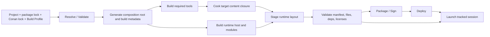

# Project Build、Cook、Package 与 Launch 架构

状态：Target Architecture Proposal，不表示当前仓库已经实现本文流水线。
更新日期：2026-07-14

## 1. 文档目标

本文定义由 Asharia Editor 创建或打开的项目，怎样从可编辑工程变成可运行、可部署、可分发的产品，并怎样由 Editor、CLI 或 CI 以同一语义启动和观察该产品。

它解决五个相互关联但不能混成一个按钮的问题：

1. 项目选择了哪些 engine/system/content packages；
2. 哪些 native targets 和 tools 必须为目标平台构建；
3. 哪些 source assets 必须被 cook 成该平台可消费的 runtime products；
4. executable、libraries、配置、licenses 和 cooked content 怎样组成可验证的 stage layout 与发行包；
5. Editor 怎样启动本地 runtime、server/client 或已经打包的产品，并收集 ready、log、exit 与 crash 信息。

本文是目标设计。当前开发者构建仍以 `docs/workflow/build.md` 为事实来源；当前项目描述、资产处理和应用启动事实仍以 `docs/architecture/flow.md` 为准。实现落地后，必须同步更新这两份事实文档。

## 2. 核心结论

Asharia 应建立一条 headless、可恢复、可审计的产品流水线：

> `Resolve -> Generate -> Build Tools/Runtime -> Cook -> Stage -> Validate -> Package -> Deploy -> Launch`

Editor 的 Build、Build & Run、Cook、Package 和 Launch Profiles 只是这条流水线的 UI。CLI 与 CI 必须调用同一个 planner、executor、profile model 和 result model，不能在 Editor widget 中拼接另一套 shell 命令。

必须同时坚持以下边界：

- **开发引擎构建不等于项目产品构建。** 前者构建仓库中的 editor、tools、tests 和 sample；后者依据具体 project、package lock、Build Profile 和目标平台生成产品。
- **Build 不等于 Cook。** Build 产生 native executables/libraries/tools；Cook 把 source/import products 转换为目标平台 runtime products。
- **Stage 不等于 Package。** Stage 是可直接运行、可检查的目录树；Package 是从已验证 stage 生成 zip、installer、平台 bundle 或 store payload。
- **Deploy 不等于 Launch。** Deploy 把已 stage/package 的产品传送到目标设备；Launch 创建一次受跟踪的进程或设备会话。
- **Play In Editor 不等于 Standalone Launch。** Play Session 可在 Editor host 内运行隔离的 runtime world；Standalone 必须是独立子进程，使用与产品相同的 runtime bootstrap。
- **Package Manager 不拥有构建执行。** 它以完整 System/Feature/Integration/Content Package 为导入单位并锁定 capability graph；Project Product Pipeline 根据 lockfile 选择各包内部 modules/contributions，生成 build/cook/stage plan。
- **shipping runtime 不读取 source project。** 它只消费 stage manifest、runtime config、locked module facts 和 cooked content catalog。
- **Editor Image 不由项目图组装。** Editor executable、最小 UI Shell、Package Manager、诊断、Build/Repair 入口和 Safe Mode
  随 Engine/Editor 发行；项目 graph 失败只能影响项目会话，不能移除修复它的基础 Editor。
- **Engine Distribution 与 Project Lock 分属不同 owner。** 只读 Engine Distribution Manifest 固定
  `EngineGenerationId` 和 bundled inventory；项目 manifest/lock 只拥有项目依赖。两者与 Host Profile 只在启动时派生
  Effective Session Plan，不保存第三份依赖真相。

## 3. 外部资料校准

本文借鉴的是成熟工具的职责划分，不复制其工程格式：

- Unreal Engine 把 Build、Cook、Stage、Package、Deploy、Run 明确建模为不同操作，并由同一个自动化入口组合。这验证了分阶段、可选择执行和统一 orchestration 的必要性：<https://dev.epicgames.com/documentation/en-us/unreal-engine/build-operations-cooking-packaging-deploying-and-running-projects-in-unreal-engine>
- Unity 的 Build Profile 可在 Editor 中选择，也可通过无界面命令行用于 CI；构建返回结构化 Build Report。这验证了“profile 是版本化输入、UI/CLI 共享语义、结果不是一串 console 文本”的方向：<https://docs.unity3d.com/current/Manual/build-command-line.html>、<https://docs.unity3d.com/current/ScriptReference/BuildPipeline.BuildPlayer.html>
- O3DE Project Export 同时支持 Project Manager 与 CLI，并分别处理 launcher build、asset processing/bundling、release layout 与 archive。这验证了 Editor 一键操作应覆盖同一 headless export API，而不是实现第二条流水线：<https://docs.o3de.org/docs/user-guide/packaging/project-export/project-export-pc/>
- O3DE Asset Bundler 从实际使用的内容和依赖生成 release bundles，而不是复制整个 source tree。这与 Asharia 的 dependency closure、cook manifest 和 source-free runtime 原则一致：<https://docs.o3de.org/docs/user-guide/packaging/asset-bundler/>
- CMake Presets 区分可提交的 `CMakePresets.json` 与用户本地 `CMakeUserPresets.json`，Workflow Presets 可以组合 configure/build/test/package steps。这支持“共享 profile 与 machine-local override 分离”，但 Asharia Build Profile 仍负责 CMake 之外的 package graph、cook、stage、deploy 和 launch：<https://cmake.org/cmake/help/latest/manual/cmake-presets.7.html>
- Unity 将随 Editor 分发的 Core/Built-in packages 与项目 manifest/lock 分开，并在项目或 package code 失败时提供
  Safe Mode；embedded packages 又保留了 source-first 开发态。这些可观察行为支持“基础 Editor 先启动，发行库存与项目图
  分属不同 owner”的边界，但本文不据此断言 Unity 未公开的内部 bootstrap 实现：
  <https://docs.unity3d.com/6000.0/Documentation/Manual/pack-core.html>、
  <https://docs.unity3d.com/6000.0/Documentation/Manual/pack-build.html>、
  <https://docs.unity3d.com/6000.0/Documentation/Manual/SafeMode.html>、
  <https://docs.unity3d.com/ja/2023.2/Manual/upm-embed.html>。

发行、项目与原生组合的完整决策见
[Editor Image、Engine Distribution 与原生组合 ADR](adr-editor-engine-distribution-and-native-composition.md)。

## 4. 术语与产物层级

| 名称 | 定义 | 是否可直接分发 |
| --- | --- | --- |
| Editor Image | 可先于项目激活启动的 Editor executable、最小 UI、diagnostics、Package Manager、Build/Repair 与 Safe Mode | 是，属于 Engine/Editor 发行 |
| Engine Distribution Manifest | 一个 exact Engine/Editor generation 的只读 Editor Image、bundled package、package artifact 与 Host Profile inventory | 是，随 Engine/Editor 发行 |
| Source Project | 项目描述、source assets、项目代码、embedded packages 和版本化配置 | 否 |
| Project Package Lock | 项目拥有的 exact package graph、来源、依赖闭包与 artifact generation references；不复制 Engine inventory | 否 |
| Effective Session Plan | Distribution、Project Lock 与 Host Profile 派生的状态及 Host/Build/Activation handoff；不是第三份 lock | 否，可丢弃重建 |
| Resolved Project | Project Package Lock 与 Distribution references 对证后的精确项目 package/module graph | 否 |
| Native Build Tree | CMake/Ninja/MSVC/ClangCL 的 object、library、tool 和 executable 输出 | 否 |
| Package Artifact Manifest | exact package/module/product 对 package-relative files、size、SHA-256 与 Source Build Plan provenance 的中间证据 | 否，仍需 composition/stage |
| Cook Cache | 由 source、settings、tool version 和 target profile 决定的可重建 artifact cache | 否 |
| Stage Layout | executable、runtime libraries、runtime config、cooked content、license 与符号策略组成的可运行目录树 | 是，经过验证后 |
| Distribution Artifact | 从 stage 生成的 archive、installer、platform bundle 或 store payload | 是 |
| Launch Session | 对一次本地或远程运行的身份、进程、日志、ready、exit、crash 和停止状态的记录 | 否 |

[Package Product & Artifact Evidence v1](adr-package-product-artifact-evidence-v1.md) 已实现 Package Artifact Manifest 的 closed schema
与纯内存 verifier；artifact collector/publication 只在 build/install/cache/repair/activation 边界发布不可变 package artifact
generation。它不执行 Build/Stage、不替代最终 `Stage Layout`，也不是 Editor 每次启动的全量 hash gate。
[Engine Distribution Manifest v1](adr-engine-distribution-manifest-v1.md) 已实现只读发行库存合同与内容派生
`EngineGenerationId`；它不执行 installer/repair，也不取代项目 package lock。
[Engine Distribution Assembly v1](adr-engine-distribution-assembly-v1.md) 已实现 build/release 侧的新 generation 组装与原子发布；
它不等于 installed Repair、Launcher 或项目 product build。

### 4.1 流水线阶段

| 阶段 | 输入 | 输出 | 失败时保证 |
| --- | --- | --- | --- |
| Resolve | project/package manifests、package sources | project-owned exact lock graph | 不修改现有可用 lock，或以原子方式提交新 lock |
| Compose | Engine Distribution Manifest、Project Lock、Host Profile | Effective Session/Host Composition 与状态 | 不修改三项输入，不把派生计划提交为 lock |
| Generate | effective composition、Build Profile、host template | generated composition root、CMake/build metadata | generated tree 可整体丢弃 |
| Build | `conan.lock`、toolchain、generated targets | tools、runtime executable、libraries、symbols | 不污染已验证 stage |
| Cook | asset roots、dependency graph、cook profile、tools | immutable target artifacts、content catalog | publication 原子；旧 artifact 保持可用 |
| Stage | native outputs、cooked closure、runtime metadata | deterministic relative directory tree、stage manifest | 写入临时目录，验证成功后发布 |
| Validate | stage tree、manifest、policy | structured validation report | 失败 stage 不得进入 Package/Deploy |
| Package | validated stage、platform adapter | distributable artifact、package report | 不回写 stage 内容 |
| Deploy | stage/package、device profile | deployment receipt | 不把部分传输标记为可启动版本 |
| Launch | stage/deployment receipt、Launch Profile | tracked session | ready 前失败可诊断，退出信息被保留 |

`Clean` 不是默认阶段。正常构建必须依靠 content key、dependency graph 和增量 build；只有缓存损坏、工具链迁移或用户明确要求时才清理对应作用域。

## 5. 配置与事实来源

项目的不同事实必须由不同 owner 保存，避免一个巨型 project file 同时承担身份、依赖、构建、用户工作区和生成状态。

| 文件或目录 | Owner | 提交策略 | 内容 |
| --- | --- | --- | --- |
| `<engine-root>/asharia.engine-distribution.json` | Engine/Editor build 与 installer | 随发行版本只读安装，不由项目提交或重写 | `EngineGenerationId`、Editor Image evidence、bundled inventory、package artifact 与 Host Profile references |
| `asharia.project.json` | `project-core` | 提交 | project id/name、asset source roots、cache/discovery 等项目核心事实 |
| `asharia.packages.json` | `package-runtime` | 提交 | direct complete System/Feature/Integration/Content Packages、Feature Sets、version ranges、package-level options；不列内部 targets/modules |
| `asharia.packages.lock.json` | package resolver | 提交 | exact versions、sources、integrity、resolved dependency graph |
| `conan.lock` | Conan workflow | 提交 | 第三方 C/C++ 依赖图 |
| `asharia.build.json` | Project Product Pipeline 的 `project_build` target | 提交 | Build Profiles 与共享 Launch Profiles |
| `.asharia/user/` | Editor/CLI user settings | 忽略 | machine-local output path、设备选择、调试器路径、个人参数覆盖 |
| `build/` 与 project cache | build/cook services | 忽略 | generated、incremental、stage、dist 和 session outputs |

`asharia.build.json` 不复制 package 依赖图，只引用 profile、Host 和构建策略。package selection 发生变化时，Build Profile 自动消费新的 lock graph。

### 5.1 Build Profile 最小模型

Build Profile 是有稳定 ID、可继承、可提交的产品配置。第一版至少表达：

- profile ID、display name、可选 base profile；
- target platform、architecture、configuration；
- Host Profile 与生成的 entry point 类型，例如 Game、DedicatedServer、Tool；
- native toolchain/preset reference；
- asset cook target profile、locale/content groups、startup scene 或 startup application state；
- optimization、assert、validation layer、debug symbol 与 crash diagnostics policy；
- stage layout policy、runtime module linking mode、runtime config inclusion；
- package format、compression、signing/notarization policy name；
- version、application identifier、product name、icon/metadata references；
- reproducibility、warnings-as-errors 和 validation policy。

Build Profile 只保存可共享意图，不保存绝对开发机路径、证书私钥、密码、访问 token 或设备凭据。凭据由 CI secret store、OS credential store 或受控签名服务提供。

概念示例，不是已冻结 schema：

```json
{
  "schemaVersion": 1,
  "buildProfiles": [
    {
      "id": "windows-development",
      "target": { "platform": "windows", "architecture": "x86_64" },
      "configuration": "development",
      "hostProfile": "Asharia.StandardRuntime",
      "nativePreset": "msvc-debug",
      "cookProfile": "windows-vulkan-development",
      "startup": { "scene": "asset:project/main-scene" },
      "output": { "kind": "stage", "symbols": "separate" }
    }
  ],
  "launchProfiles": [
    {
      "id": "standalone-game",
      "buildProfile": "windows-development",
      "mode": "standalone",
      "arguments": [],
      "environmentKeys": [],
      "readyTimeoutSeconds": 30
    }
  ]
}
```

### 5.2 Launch Profile 最小模型

Launch Profile 引用一个 Build Profile，不重述构建配置。它至少表达：

- `standalone`、`packaged`、`dedicated-server`、`client` 或设备运行模式；
- 是否允许按需执行 Build/Cook/Stage；
- startup scene/state override 是否允许以及其作用域；
- process arguments、允许注入的 environment key 名称、working-directory policy；
- instance count、server/client topology、端口分配策略；
- ready timeout、graceful-stop timeout、restart policy；
- debugger/profiler attach policy；
- log verbosity、trace categories、crash artifact policy。

共享 Launch Profile 可以提交；个人设备、调试器路径和敏感环境值只能放在 `.asharia/user/` 或外部凭据系统中。

## 6. 构建计划与执行模型

### 6.1 总体 DAG



Planner 生成不可变 `BuildPlan`：节点有稳定 ID、输入 fingerprint、依赖、资源类别、可取消性、缓存策略和产物声明。Executor 只执行 plan；Editor/CLI/CI 消费同一种 progress event、diagnostic 和 final report。

Build 和 Cook 在工具可用后可以并行；Stage 必须等待目标 runtime 与完整 cooked closure。Package、Deploy 与 Launch 只接受通过对应验证门禁的上游 receipt。

### 6.2 Conan-before-CMake

仓库的既有约束继续成立：Conan 必须先生成 toolchain，再由 CMake preset configure/build。Project Build 不得暗中运行一个绕开 `conan.lock` 的 dependency install。

目标执行顺序为：

1. 验证 `conan.lock`、目标 profile 和 package third-party requirements 一致；
2. 运行或复用已验证的 Conan bootstrap output；
3. 由 Engine Distribution、Project Lock 与 Host Profile 派生 composition，再生成 targets；
4. 使用明确的 CMake configure/build preset；
5. 记录 compiler、SDK、Conan/CMake 版本和实际 preset 到 Build Report。

CMake Workflow Preset 可以作为 native 子流程实现，但不能替代 Asharia 的 Cook、Stage、Deploy 与 Launch graph。

### 6.3 Generated composition root

第一版优先采用**生成的薄组合根 + 静态/启动期注册 modules**：

- generator 只接受已经对证的 Host Composition Plan 与 Host Activation Blueprint，不重新解释 Host Profile 或 lock graph；
- Blueprint 固定 logical factory、scope、依赖顺序与 contribution bindings，但不假装 artifact 或 native symbol 已存在；
- 生成只包含注册表、entry point glue 和 build metadata 的 source/CMake；构建完成后再由 artifact/factory binding
  receipt 把 logical factory reference 绑定到实际静态注册入口；
- 每个 C++ module 默认保持独立静态库或工具 target；用户安装完整 package，而不是内部 target；
- 用户项目不手工复制 engine main loop，也不维护一份容易漂移的 module list；
- 平台 adapter 可以重命名 executable、嵌入 icon/version metadata 或包裹为平台 application bundle；
- dynamic modules 仅在明确 ABI、trust、lifetime 与 platform policy 后作为可选 linking mode 引入；若未来采用
  `ProjectEditorModules`，它必须绑定精确 `EngineGenerationId`/toolchain/configuration，启动时加载且修改后重启，
  不承诺通用 ABI 或任意 hot unload。

这允许每个项目得到精确链接闭包，同时保持 `apps/*` 只是组合根、系统逻辑仍位于 packages。

## 7. Cook 与内容闭包

Cook 只接受稳定资产身份、import/cook settings、依赖图、tool version 和 target profile。它不得通过遍历 source 目录猜测 shipping 内容。

内容闭包从以下 roots 计算：

- Build Profile 的 startup scene/application state；
- 项目明确声明的 always-include content groups；
- locked packages 的 runtime content contributions；
- platform/runtime bootstrap 所需 engine assets；
- roots 的传递 `AssetId`/artifact dependencies。

每个 cooked product 使用 `ArtifactKey` 或等价 content key，至少包含 source/import identity、settings hash、tool version、schema version、target platform/backend/quality variant 和 dependency product hashes。

Cook report 必须区分：cache hit、rebuilt、missing source、missing dependency、cycle、unsupported target、corrupt artifact、validation failure 和 excluded-by-policy。警告是否阻止 shipping 由 Build Profile policy 决定。

shipping catalog 只包含 runtime 所需的 logical ID、artifact location/hash、type/schema、dependencies 和 bundle placement；不得泄漏 source absolute path、Editor importer object 或开发机 cache path。

## 8. Stage Layout 与可复现性

建议生成目录是目标方向，最终路径可由 ADR 调整：

```text
build/
  cmake/                         # native incremental build trees
  conan/                         # Conan-generated environments/toolchains
  cook/<profile>/                # target artifact cache/index
  stage/<profile>/               # directly runnable validated layout
  dist/<profile>/                # archive/installer/platform package
  sessions/<session-id>/         # log, trace, crash and launch metadata
```

Stage 必须通过临时目录生成并原子发布。其内部只使用相对路径，至少包含：

- product executable 或 platform application bundle；
- 必需 runtime libraries/modules；
- `asharia.stage.json`；
- runtime config 与 startup facts；
- cooked content catalog/bundles；
- required licenses/notices；
- 按 policy 分离或包含的 debug symbols；
- crash/telemetry bootstrap metadata，但不包含 secret。

`asharia.stage.json` 至少记录：

- stage schema version、product/build ID、engine revision/version；
- Build Profile ID 与 hash；
- package lock hash、Conan lock hash、Host Profile；
- target platform/architecture/configuration；
- entry point、runtime module set 与 module linking mode；
- cooked catalog hash；
- 每个 staged file 的 relative path、size、content hash 和 role；
- toolchain/build tool versions；
- validation result 与 compatible runtime protocol version。

时间戳可以作为非确定性审计 metadata，但不得进入内容 fingerprint。绝对路径、用户名和 secret 不得进入可分发 manifest。

建议的 `BuildFingerprint` 至少覆盖：

```text
engine revision
+ project revision or source manifest
+ asharia.packages.lock hash
+ conan.lock hash
+ Build Profile hash
+ toolchain and SDK identity
+ generated composition hash
+ cooked catalog hash
```

第一阶段不承诺所有平台都能 bit-for-bit reproducible；必须先做到相同输入产生相同 plan、相对 stage manifest、content selection 和 file hashes，并清楚报告造成 binary 差异的 toolchain facts。

## 9. Package、签名与 Deploy

Packager 只读取 validated stage，不回到 source project 临时补文件。平台实现以 Project Product Pipeline 或完整 Platform Support System 内部的 adapter module/target 交付，例如 archive、Windows installer、macOS bundle/sign/notarize 或未来 console/store adapter；用户不需要再导入一个裸 packager 碎片。

规则：

- 通用 stager 不包含平台商店 SDK 类型；
- platform packager 声明所需 SDK、host OS、credential capability 和输出种类；
- signing/notarization 使用外部 credential reference，私钥不进入 project/profile/log；
- package report 记录输入 stage hash、输出 hash、签名身份摘要和验证结果；
- Deploy 产生 receipt，包含 device identity、artifact hash、remote location/version 和完成状态；
- 增量 deploy 必须在 manifest/hash 基础上计算，不按文件时间盲目覆盖；
- 不支持的平台或缺失 SDK 在 plan 阶段尽早失败。

## 10. Runtime Bootstrap 与启动顺序

产品 executable 不应知道 Editor project root。它从 stage root 启动，并按以下顺序初始化：

1. 解析命令行，定位 stage root；
2. 初始化最小 logging、crash capture 和 platform error presentation；
3. 读取并验证 `asharia.stage.json`、runtime config 和 target compatibility；
4. 验证静态 module registry 或受信 dynamic modules 与 stage manifest 一致；
5. 按构建后验证的 bound activation input 注册 Bootstrap/Runtime contributions；
6. 打开 cooked content catalog，验证 startup roots；
7. 创建 application/runtime services、World 和 startup scene/state；
8. 按 Host Profile 创建 window/input/render/audio/network 等系统；
9. 发出结构化 `Ready` 事件并进入 runtime loop；
10. 收到 stop、正常退出或 fatal error 后，停止接收工作，等待 jobs/queues，在依赖逆序销毁系统并完成 crash/log flush。

Dedicated Server Profile 跳过 window/render/audio；Tool Profile 可以跳过 World；Host Profile 决定允许的 modules，而不是在每个系统中散布 `if (server)`。

启动失败必须包含阶段、package/module ID、错误链、期望/实际 version/hash 和可恢复建议。runtime 不得以“黑屏后立即退出”作为唯一反馈。

## 11. Project Open、Editor Launch 与 Session Manager

### 11.1 从 Project Manager/CLI 打开 Editor 项目

“启动项目”还包括启动 Editor 并打开 source project。目标入口应是明确的参数协议，例如 `asharia-editor --project <project-root-or-descriptor>`；当前 `ASHARIA_EDITOR_PROJECT` 环境变量只属于现状集成方式，不应成为长期唯一公共入口。

Editor project-open bootstrap 分为固定 Image 启动和项目会话派生：

1. Project Manager 或 CLI 用 argument vector 启动固定 Editor Image，并创建 open-session/crash metadata；
2. Editor Image 初始化 L0 Kernel、固定 Package/Host Runtime、最小 platform、logging、UI Shell、package diagnostics、
   Package Manager、Build/Repair 与 Safe Mode；这些能力不等待项目 graph，UI backend 失败时降级到 OS-native dialog/console/log；
3. 读取只读 `asharia.engine-distribution.json`，绑定 exact `EngineGenerationId`；边界信号异常或显式 Verify/Repair 时完整复验发行 bytes，Image 本身损坏由外部 launcher/installer 修复；
4. 定位并验证 `asharia.project.json`，再读取项目 package manifest/lock；项目不得覆盖 Bootstrap/核心 distribution nodes；
5. 分别验证 Engine Distribution、Project Lock 与 Editor Host Profile，并派生 Effective Session Plan；当前 v1 实际得到
   `Ready`、`RepairRequired`、`UpgradeRequired` 或 `SafeMode`，不重新求解、保存第三个 lock 或静默覆盖 bundled inventory；
   `PendingBuild` / `PendingRestart` 只有在后继 artifact freshness / current-process generation evidence 存在后才能产生；
6. 只有 `Ready` 才激活项目 Editor-compatible modules/contributions 并打开项目 catalog/cache/watchers；
7. 恢复 workspace 和 documents；用户本地 workspace failure 不得破坏项目事实；
8. 发布结构化 session state；完整项目会话发布 `ProjectReady`，其他状态仍保留基础 UI、diagnostics、Package Manager 与
   Build/Repair/Restart commands。

v0 允许切换含 native module graph 的项目时重启 Editor。只有 package/module lifetime、thread join、ABI 与 document teardown 均可证明安全后，才支持同进程任意切换或 hot unload。`--safe-mode` 不执行项目及其 packages 的 native contributions，但继续运行固定 Editor Image 的最小 Shell、diagnostics、Package Manager 与修复入口，使损坏 package/editor contribution 不会阻止用户修复项目；项目 lock 不负责证明 Editor Bootstrap 存在。

### 11.2 三种运行语义

| 模式 | 进程边界 | 内容来源 | 主要用途 |
| --- | --- | --- | --- |
| Play In Editor | Editor 内隔离 play world/session | Editor/runtime bridge，可使用开发态 products | 快速迭代，不等同 shipping |
| Standalone | 独立本地进程 | validated stage 或 development stage | 验证真实 bootstrap、进程和窗口行为 |
| Packaged/Deployed | 本地 package 或目标设备进程 | distribution/deployment receipt | 发行候选验证 |

Build & Run 默认创建 Standalone session；它不能把 Editor 内 Play 成功当作产品可启动的证据。

### 11.3 Session 状态机

```text
Planned
  -> Preparing
  -> Building/Cooking/Staging (optional)
  -> Spawning/Deploying
  -> Starting
  -> Ready
  -> Stopping
  -> Exited | Crashed | Failed | TimedOut | Cancelled
```

每个 session 有稳定 `SessionId`，并记录：Launch/Build Profile、stage/deploy receipt hash、PID/device process ID、start/end time、ready handshake、exit code、stop reason、log/trace/crash locations。

本地 Launch 流程：

1. 校验 Launch Profile，并确定是否需要刷新 Build/Cook/Stage；
2. 验证 stage manifest 和 file hashes；
3. 创建 session output directory 与最小 session metadata；
4. 通过 Platform Process API 以 argument vector 启动，禁止把未转义输入拼成 shell command；
5. 注入非敏感 SessionId/IPC endpoint，捕获 stdout、stderr 和 structured log stream；
6. 等待 versioned ready handshake；没有 IPC 时退化为 process-alive + explicit log marker，但必须标记较弱证据；
7. 将 log、diagnostic、trace 和 crash events 流式发布给 Editor/CLI；
8. Stop 时先请求 graceful shutdown，超时后再由 platform adapter terminate；
9. 保存 exit/crash report，释放端口、IPC 和设备 lease。

server/client profile 可以生成一组相关 sessions：先 server ready，再启动 N 个 clients；任一关键 session 失败时按 topology policy 停止其余进程。端口分配与实例参数是 session planner 责任，不由 UI 临时猜测。

### 11.4 Editor UI

Editor 至少提供：

- Build Profiles：创建、继承、比较、验证、选择 active profile；
- Build Tasks：显示 DAG、cache hit、当前节点、耗时、可取消性和结构化错误；
- Build、Cook、Stage、Package、Build & Run 的明确入口；
- Launch Profiles：Standalone、Server/Clients、Packaged/Device；
- Sessions：ready/uptime/PID/device、stdout/stderr、structured logs、Stop/Restart、crash artifacts；
- Output Explorer：打开 stage/dist/report，不把 generated output 混入 Asset Browser source tree。

UI 只能提交 command 并观察 task/session snapshot。关闭 panel 不取消任务；关闭 Editor 时由 orchestration policy 决定 detach、graceful cancel 或等待，不能留下无 owner 的 child process。

### 11.5 Project Upgrade

Editor 打开旧 engine/package/schema generation 的项目时，不能把若干 package migration 临时串在 project-open 回调里。
Project Product Pipeline 提供 headless `ProjectUpgradePlan` / `UpgradeReport`：

1. preflight engine、package、schema、source document 和 product compatibility；
2. 默认复制/备份项目，禁止无提示 in-place conversion；
3. 在隔离 ToolJobScope 中按 package dependency 顺序执行 versioned migration contributions；
4. 重建 package/build plan 与全部受影响 derived products；
5. 运行 project/package/system validators；
6. 只有全部成功才提交新 descriptor、lock 和 schema generation，失败保留原项目和完整报告。

Editor 拥有确认、进度、冲突处理和报告 UI；CLI/CI 使用同一 headless plan。runtime 不包含 upgrade executor、source
document migration 或备份逻辑。完整 Host/Foundation 边界见 [foundation-framework.md](foundation-framework.md)。

## 12. Package 与 target 边界

目标实现只形成一个 Package Manager 可导入的完整 **Project Product Pipeline System Package**，包内以独立 targets 保持 build 与 launch 的 owner/lifetime 边界，并由组合根 tools 复用：

| 目标 | 责任 | 不得依赖/拥有 |
| --- | --- | --- |
| `packages/systems/project-product` / `project_build` target | profile schema、BuildPlan DAG、fingerprint、report、stager contract、platform packager/deployer interfaces | Editor UI、World mutable state、Vulkan runtime objects |
| `packages/systems/project-product` / `project_launch` target | Launch Profile、session state、process/device abstraction、ready/log/crash protocol | Build implementation、Editor widget、gameplay state |
| `packages/systems/project-product` / `project_upgrade` target | compatibility preflight、migration DAG、copy/backup、validation、commit/report | runtime shipping closure、Editor widgets、package-private migration state |
| `tools/asharia-build` | headless resolve/generate/build/cook/stage/package/deploy composition root | 独立 profile 语义或第二份 resolver |
| `tools/asharia-launch` | headless stage validation 与 launch/session composition root | Editor-only state |
| `packages/systems/editor` contributions | Build/Launch UI adapters、commands、task/session presentation | shell command 拼接、build/cook owner |
| generated runtime app | Host Profile composition root、module registry、runtime bootstrap | reusable system rules、Editor/tool dependencies |

依赖方向：

```text
Editor Build UI ───────┐
asharia-build CLI ─────┼─> project_product::build -> package-runtime/content tool contracts/platform
CI adapter ────────────┘

Editor Sessions UI ────┐
asharia-launch CLI ─────┼─> project_product::launch -> platform process/device + observability contracts
Build & Run command ────┘
```

`project_launch` target 可以消费 `BuildReceipt`/`StageReceipt`，但不能反向控制 build internals。`project_build` target 可以声明 launchable output，却不拥有活跃进程。二者共享一个 System Package 的版本、安装、升级和移除生命周期，但不共享可变 owner state。

## 13. 统一 API 与报告

Editor、CLI 和 CI 共用以下概念 API；名称表示职责，不冻结 C++ 签名：

- `validateBuildProfile(project, profileId)`；
- `planBuild(project, profileId, requestedSteps)`；
- `executeBuild(plan, cancellation, eventSink)`；
- `validateStage(stagePath)`；
- `planLaunch(project, launchProfileId)`；
- `startSession(launchPlan, eventSink)`；
- `requestStop(sessionId, stopPolicy)`；
- `getBuildSnapshot(taskId)` / `getSessionSnapshot(sessionId)`。

所有调用返回 project error type 与 context，不抛出只适合 UI 展示的字符串。事件至少包含 task/session ID、node/stage、severity、stable diagnostic code、package/asset/file identity、human message 和可选 remediation。

计划中的 CLI 体验可以是：

```text
asharia-build --project <path> --profile windows-development --steps build,cook,stage
asharia-build --project <path> --profile windows-release --steps package
asharia-launch --project <path> --profile standalone-game
```

这些命令必须支持非交互模式、结构化 JSON report、确定性 exit code 和日志文件参数，才能成为 CI 真正入口。

## 14. 失败恢复与安全

- Resolve、Generate、Cook publication 和 Stage publication 使用临时输出 + 原子替换；
- Build/Cook node 只有在全部声明 outputs 通过 hash/schema 验证后才写成功 receipt；
- 取消是显式状态，不伪装成失败或成功；不可安全中断的签名/installer 步骤必须在 plan 中声明；
- Editor 崩溃后可从 task/session journal 恢复“已结束但未展示”的报告，但不得盲目继续未知子进程；
- child process 使用参数数组与受控环境 allowlist；不执行从项目文本直接拼接的 shell；
- package hooks/importers/build adapters 按 trust policy 运行；外部 package native code 默认视为可执行代码；
- log/report 对 secret、credential path、token 和用户隐私字段做 redaction；
- stage validation 检查缺失/额外文件、错误架构、依赖 library、hash、license、source/editor leakage；
- shipping profile 默认不允许 validation layer、Editor module、source asset、absolute development path 或未声明 dynamic library。

## 15. 验证矩阵

### 15.1 CPU 与 headless tests

- Build/Launch Profile schema、inheritance、cycle、unknown reference；
- 同输入 plan/fingerprint 稳定，路径归一化不泄漏 machine root；
- package lock 与 Host Profile 过滤产生正确 generated composition；
- content roots/dependency closure、missing/cycle/exclusion；
- stage manifest writer/reader、hash、corrupt/truncated/extra-file detection；
- task cancellation、retry、cache hit 和 atomic publication；
- session state transitions、timeout、graceful/forced stop、crash classification；
- command argument vector 和 environment allowlist。

### 15.2 集成 smoke

- Editor 与 CLI 对同一 profile 生成相同 BuildPlan fingerprint；
- Development：Build -> Cook -> Stage -> Standalone ready -> graceful exit；
- Release：clean machine restore -> Build -> Cook -> Stage -> Package -> unpack -> launch；
- Dedicated Server：无 renderer/audio/editor closure，server ready 后 client 连接；
- 修改一个 source asset 只重建其传递 dependents；修改无关 Editor layout 不改变 product fingerprint；
- package add/remove/update 后 generated composition 与 stage manifest 精确反映 lockfile；
- stage 删除 library、篡改 cooked artifact 或混入 Editor module 时 validation 必须失败；
- runtime startup scene 缺失、module version mismatch、device lost 和 crash 都产生可定位 report；
- MSVC 与 ClangCL development path 均通过；release profile 按平台门禁验证。

### 15.3 Done evidence

每个实现 Slice 至少记录：命令、profile、input lock hashes、Build/Stage/Package Report 路径、smoke result、compiler/platform、已知限制。只有 PR 完全满足对应 Issue acceptance criteria 时才使用 `Closes #N`。

## 16. 分阶段落地

### Stage A：Profile 与计划模型

- Engine Distribution Manifest v1、`EngineGenerationId`、Project Manifest / Lock v2 硬切、Effective Session v1、
  Distribution Assembler v1、Installed Distribution Repair Verifier v1、Package Factory Declaration v1 与
  Host Activation Blueprint v1 已经完成；下一步冻结 generated static composition root、构建后 activation binding receipt
  或 Bootstrap/Session adapter；
- Effective Editor Session v1 已建立 Ready/Upgrade/Repair/SafeMode 与 exact Profile binding；轻量启动检查和实际 UI/进程状态仍待实现；
- 冻结 `asharia.build.json` v1 的 owner、Build/Launch Profile 与 local override 规则；
- 建立 CPU-only parser/validator、BuildPlan/BuildReport、LaunchPlan/SessionReport；
- 先以当前仓库 preset 和 sample/runtime host 作为 adapter，不改现有开发者 build 入口。

### Stage B：Development Stage 与 Standalone

- 从 package lock/Host Profile 生成薄 composition root；
- 复用 Conan-before-CMake 构建；
- 连接现有 asset processor 的 target profile；
- 生成 development stage 与 `asharia.stage.json`；
- 实现本地 Session Manager、ready/log/exit/stop；
- Editor 提供 Build & Run，但保留 CLI parity test。

### Stage C：Deterministic Cook 与 Release Layout

- 以 startup roots 计算完整 content closure；
- 引入 bundle placement、license/source leakage validation；
- clean-machine release stage smoke；
- debug symbols、crash report 与 product version policy。

### Stage D：Package、Deploy 与多进程

- archive + 第一个平台 installer/package adapter；
- signing credential integration；
- server/client topology 与设备 deploy receipt；
- CI artifact publishing 和 release evidence。

### Stage E：外部 package 与平台扩展

- registry package build/cook hooks 的 trust/sandbox policy；
- platform SDK adapters、store payload、remote devices；
- incremental deploy、patch/DLC/content delivery 仅在 base manifest 稳定后设计。

## 17. 明确延期

- 任意 native package 的安全 hot unload；
- 未建立 stage manifest 前的 patch/DLC 系统；
- 通用 remote build farm 与分布式 cook；
- 所有平台 bit-for-bit binary reproducibility 承诺；
- 在没有真实第二个平台需求前抽象万能 installer/store API；
- 让 Build Profile 成为任意脚本执行容器；
- 将 Play In Editor 伪装成 shipping runtime 验证；
- 在 Stage B 前重写当前 `docs/workflow/build.md` 所记录的稳定开发者构建流程。

## 18. 首轮实施门禁

在创建实现 Epic/Slice 前，先完成以下 ADR/设计决策：

1. Engine Distribution Manifest v1、`EngineGenerationId`、Project Manifest / Lock v2、Effective Session v1、
   Distribution Assembler v1、Installed Distribution Repair Verifier v1、Package Factory Declaration v1 与
   Host Activation Blueprint v1 已完成；
2. generated composition root 的 target/module registration 方式、构建后 activation binding receipt，以及 verifier 到
   Bootstrap/Session 的 adapter；
3. `asharia.build.json` v1 schema、inheritance 与 local override；
4. `asharia.stage.json` v1 与 Build/Stage fingerprint；
5. development stage 的目录布局和原子发布；
6. local ready/log/stop protocol；
7. Build UI、CLI、CI 共用 service 的进程内/进程外边界。

首个 vertical slice 应严格限制为：

> 一个 Windows Development Build Profile，经现有 Conan-before-CMake 与 asset processor 生成 development stage，由 CLI 和 Editor 使用同一计划启动独立 runtime，收到 Ready，收集 log，并可 graceful stop。

在这个闭环完成前，不应先做 installer、远程设备、build farm、patch/DLC 或任意第三方 build hook。
