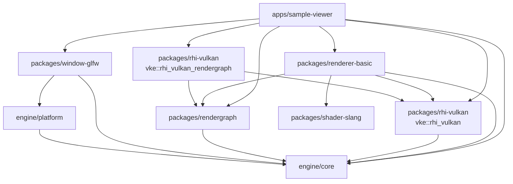
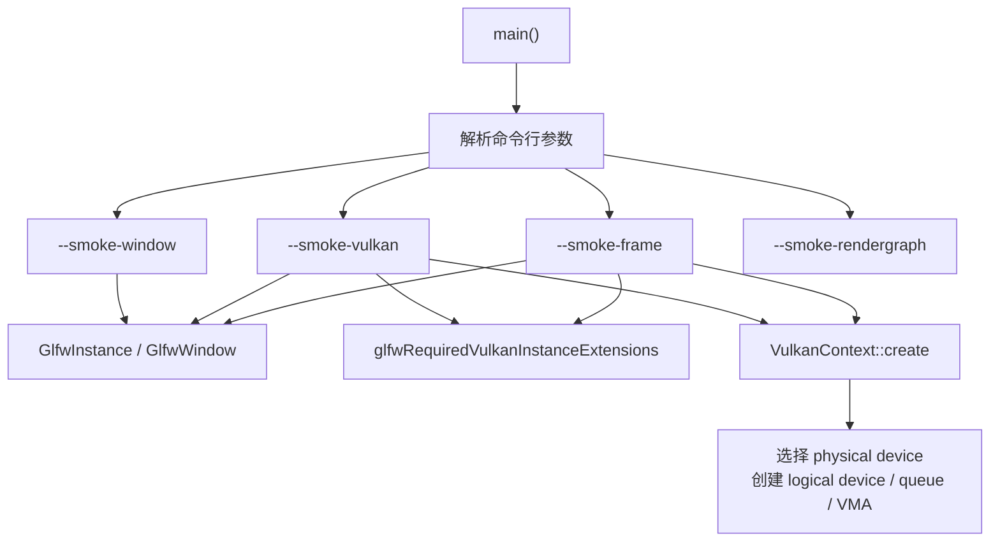
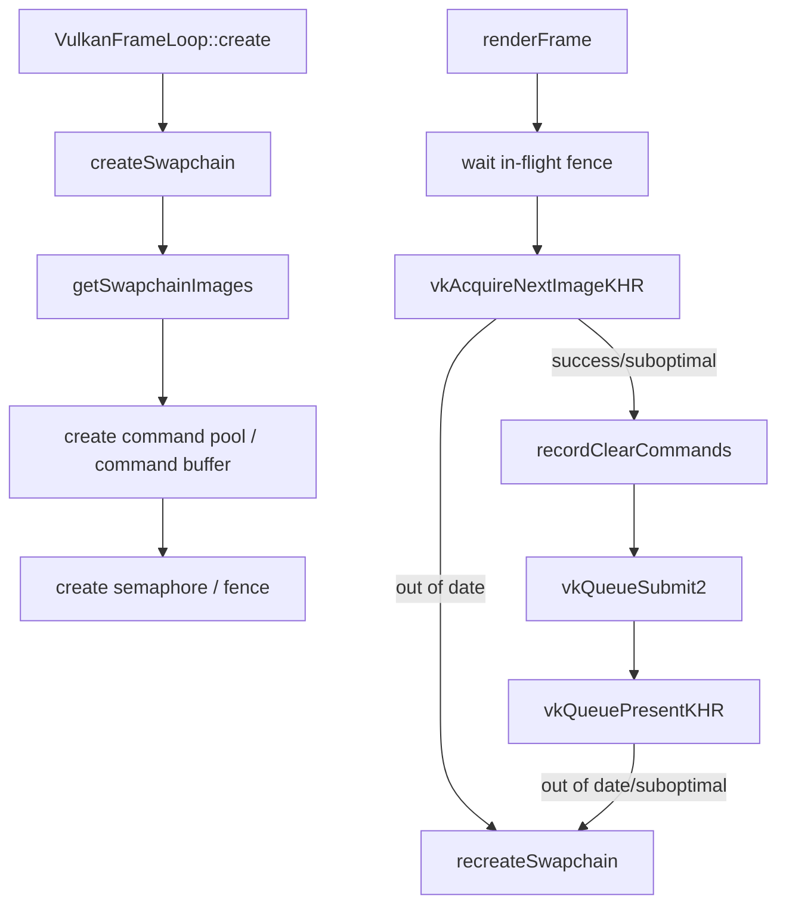
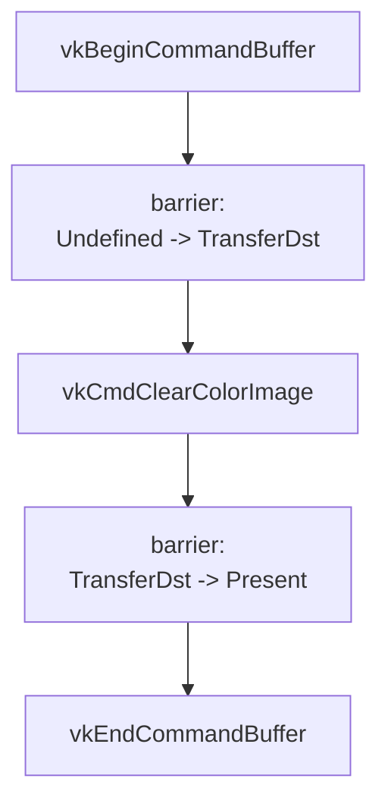
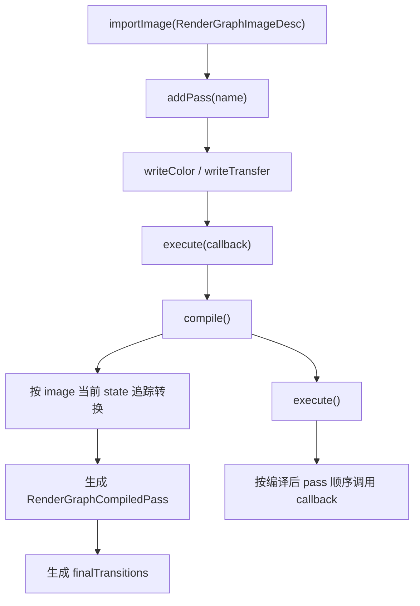
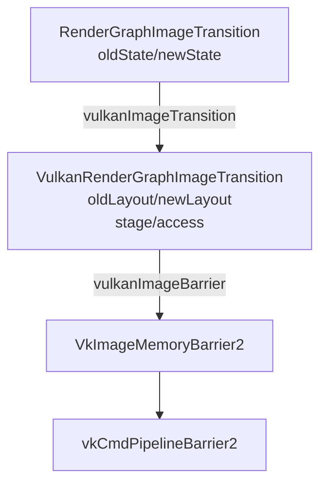
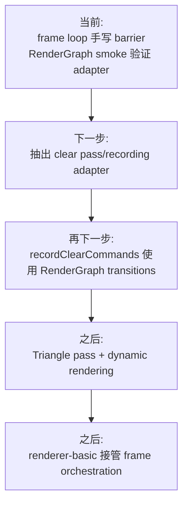

# 流程架构图

本文档记录当前代码真实流程。每次实现或重构后都需要同步更新，用来帮助审查架构走向、包边界和下一步开发顺序。

## 维护规则

- 代码改变了运行流程、包依赖、资源状态、同步路径或 smoke 命令时，必须更新本文档。
- 图中的“已接入”表示当前运行路径真实使用；“smoke 验证”表示已有测试入口但尚未接入主 frame loop；“下一步”表示目标方向。
- RenderGraph 图层必须保持后端无关；Vulkan layout、stage、access、barrier 翻译只允许出现在 `packages/rhi-vulkan`。

## 当前包依赖

当前约束：

- `vke::rhi_vulkan` 是基础 Vulkan 后端，不公开依赖 RenderGraph。
- `vke::rhi_vulkan_rendergraph` 是 RenderGraph/Vulkan 适配层，负责把抽象 graph state 翻译为 Vulkan 类型。
- `sample-viewer` 目前直接组合底层 package 来承载 smoke 测试；后续可以把 smoke 或 orchestration 下沉到 `renderer-basic`。

## 启动与 Context 流程

状态：

- `--smoke-window` 已接入窗口创建。
- `--smoke-vulkan` 已接入 Vulkan context/device 创建。
- `--smoke-frame` 已接入 swapchain acquire、clear、present。
- `--smoke-rendergraph` 目前是 RenderGraph CPU 编译和 Vulkan adapter 验证入口，尚未接入主 frame loop 命令录制。

## 当前 Frame Loop 流程

`recordClearCommands` 当前真实录制流程：

状态：

- 已接入真实 Vulkan 命令录制。
- 目前 barrier 仍由 `vulkan_frame_loop.cpp` 手写。
- 下一步目标是让 frame loop 或 renderer-basic 通过 RenderGraph 编译结果驱动这两个 barrier。

## RenderGraph 编译与执行流程

当前抽象状态：

- `Undefined`
- `ColorAttachment`
- `TransferDst`
- `Present`

当前 write 声明：

- `writeColor(image)` 会要求 image 进入 `ColorAttachment`。
- `writeTransfer(image)` 会要求 image 进入 `TransferDst`。

## RenderGraph 到 Vulkan 的翻译流程

状态：

- `vulkanImageTransition` 已实现。
- `vulkanImageBarrier` 已实现。
- `--smoke-rendergraph` 已验证 `TransferDst -> Present` 的 layout、stage、access 与 `VkImageMemoryBarrier2` 字段。
- 主 frame loop 尚未消费 RenderGraph 编译结果。

## 下一步接入计划

建议推进顺序：

1. 保持 `VulkanFrameLoop` 基础 target 不依赖 RenderGraph。
2. 在 `renderer-basic` 或适配层中组合 `VulkanFrameLoop`、RenderGraph 和 Vulkan barrier helper。
3. 让 clear frame 的两次 layout transition 从 RenderGraph compile result 生成。
4. 再接入 dynamic rendering triangle pass。
