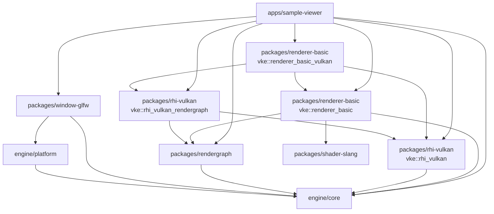
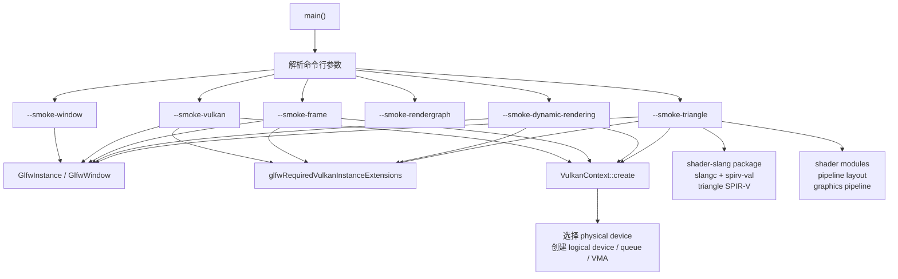
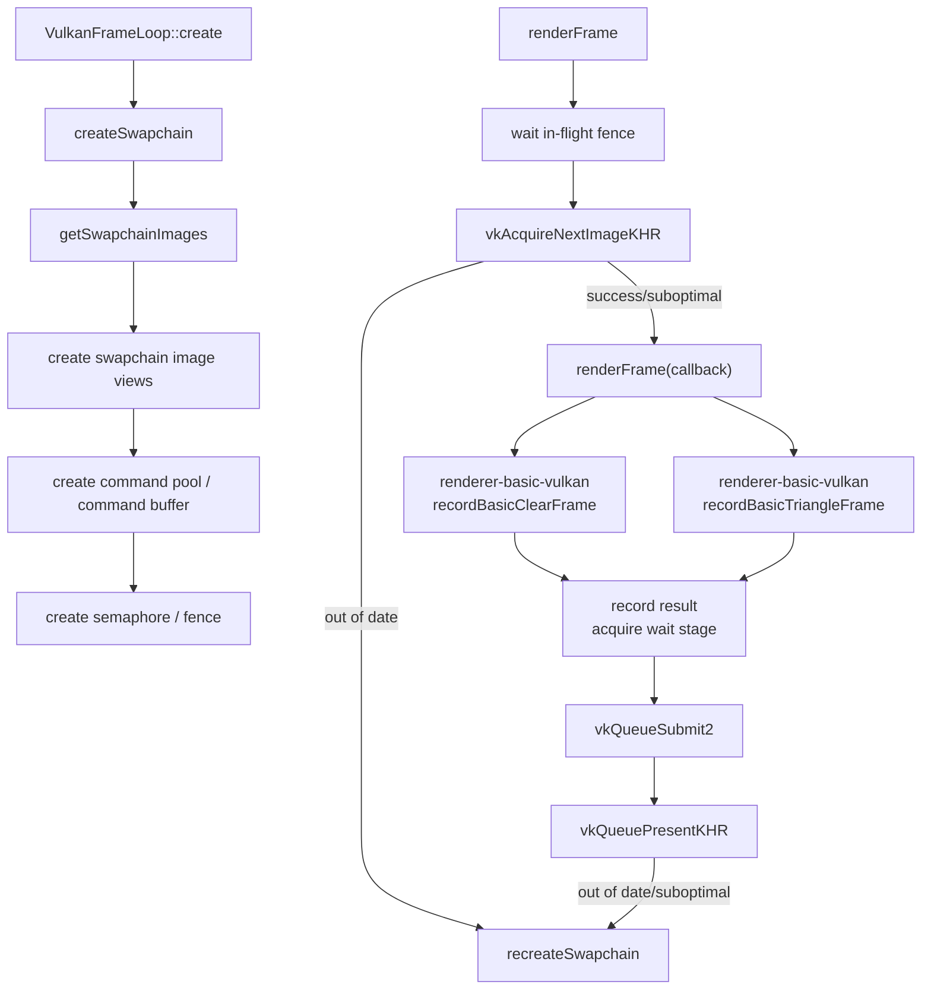
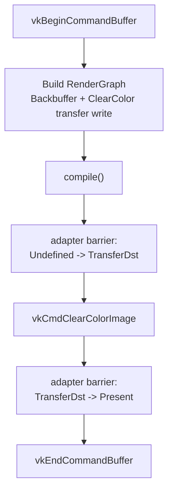
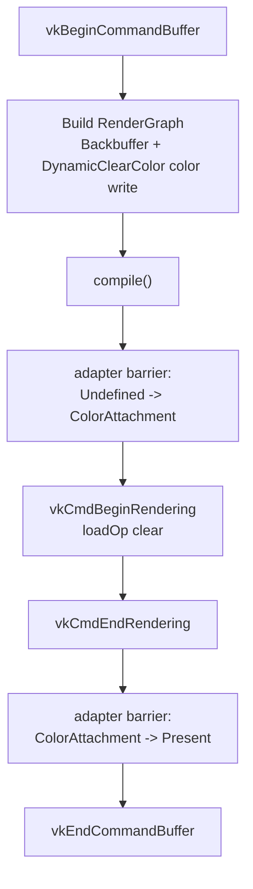
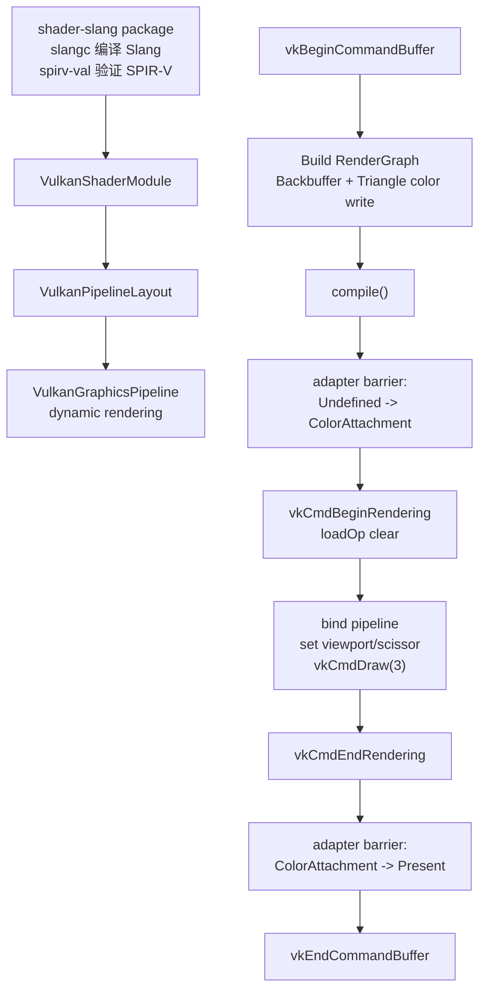
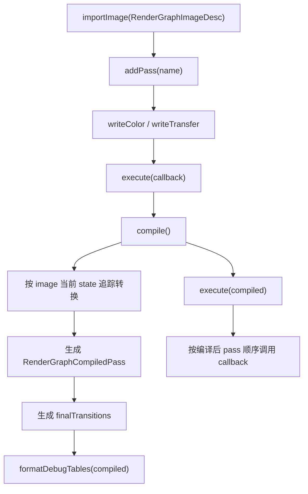
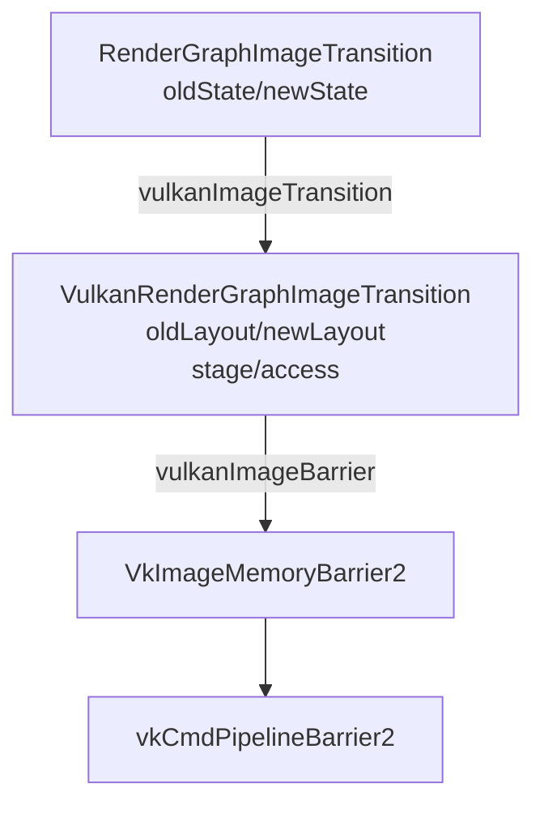
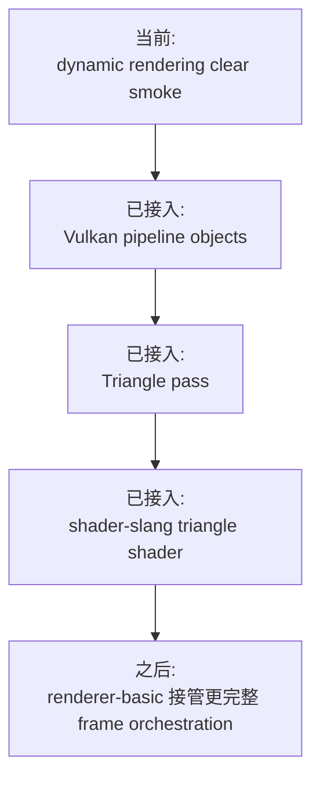

# 流程架构图

本文档记录当前代码真实流程。每次实现或重构后都需要同步更新，用来帮助审查架构走向、包边界和下一步开发顺序。

## 维护规则

- 代码改变了运行流程、包依赖、资源状态、同步路径或 smoke 命令时，必须更新本文档。
- 图中的“已接入”表示当前运行路径真实使用；“smoke 验证”表示已有测试入口但尚未接入主 frame loop；“下一步”表示目标方向。
- RenderGraph 图层必须保持后端无关；Vulkan layout、stage、access、barrier 翻译只允许出现在 `packages/rhi-vulkan`。

## 当前包依赖

当前约束：

- `vke::rhi_vulkan` 是基础 Vulkan 后端，不公开依赖 RenderGraph。
- `vke::rhi_vulkan_rendergraph` 是 RenderGraph/Vulkan 适配层，负责把抽象 graph state 翻译为 Vulkan 类型。
- `renderer-basic` 只描述后端无关的 basic renderer graph 片段。
- `renderer-basic-vulkan` 组合 RenderGraph、Vulkan frame callback 和 Vulkan adapter，承载当前 clear frame orchestration。
- `sample-viewer` 负责窗口、context 和 smoke 命令入口；`--smoke-frame` 不再持有 clear pass 录制细节。

## 启动与 Context 流程

状态：

- `--smoke-window` 已接入窗口创建。
- `--smoke-vulkan` 已接入 Vulkan context/device 创建。
- `--smoke-frame` 已接入 swapchain acquire、RenderGraph-driven clear、present。
- `--smoke-dynamic-rendering` 已接入 swapchain acquire、RenderGraph color write、dynamic rendering clear、present。
- `--smoke-triangle` 已接入 shader module、pipeline layout、dynamic-rendering graphics pipeline、RenderGraph color write、draw、present。
- `--smoke-rendergraph` 是 RenderGraph CPU 编译和 Vulkan adapter 字段验证入口。

## 当前 Frame Loop 流程

`--smoke-frame` 当前真实录制流程：

`--smoke-dynamic-rendering` 当前真实录制流程：

`--smoke-triangle` 当前真实录制流程：

状态：

- 已接入真实 Vulkan 命令录制。
- `--smoke-frame` 的 clear/present barriers 已由 RenderGraph compile result 经 Vulkan adapter 生成。
- `--smoke-dynamic-rendering` 已验证 swapchain image view、dynamic rendering attachment clear 和 `ColorAttachment -> Present` transition。
- `--smoke-triangle` 已验证 `shader-slang` 构建出的 Slang SPIR-V、shader module、pipeline layout、dynamic rendering graphics pipeline、viewport/scissor dynamic state 和 triangle draw。
- 默认 `VulkanFrameLoop::renderFrame()` 仍保留内置 clear 路径，作为基础 RHI smoke fallback。
- frame callback 会返回 `VulkanFrameRecordResult.waitStageMask`，用于匹配 acquire semaphore 的等待阶段。
- `recordBasicClearFrame` 已下沉到 `renderer-basic-vulkan`，sample-viewer 只传入后端 recording callback。

## RenderGraph 编译与执行流程

当前抽象状态：

- `Undefined`
- `ColorAttachment`
- `TransferDst`
- `Present`

当前 write 声明：

- `writeColor(image)` 会要求 image 进入 `ColorAttachment`。
- `writeTransfer(image)` 会要求 image 进入 `TransferDst`。

## RenderGraph 到 Vulkan 的翻译流程

状态：

- `vulkanImageTransition` 已实现。
- `vulkanImageBarrier` 已实现。
- `--smoke-rendergraph` 已验证 `TransferDst -> Present` 的 layout、stage、access 与 `VkImageMemoryBarrier2` 字段。
- `--smoke-frame` 已消费 RenderGraph 编译结果来录制 clear frame barriers。
- `--smoke-rendergraph` 已输出 resources、passes、transitions 的 Markdown 调试表格。

## 下一步接入计划

建议推进顺序：

1. 保持 `VulkanFrameLoop` 基础 target 不依赖 RenderGraph。
2. 保持 `renderer-basic` 后端无关，Vulkan 命令录制放在 `renderer-basic-vulkan`。
3. 保持 RenderGraph 调试表格只输出抽象 RG 信息；Vulkan layout/stage/access 调试表应放在 Vulkan adapter 层。
4. 下一步让 `renderer-basic` 接管更完整的 frame orchestration，减少 sample app 内的 pipeline/shader 装配细节。
