# 流程架构图

本文档记录当前代码真实流程。每次实现或重构后都需要同步更新，用来帮助审查架构走向、包边界和下一步开发顺序。

## 维护规则

- 代码改变了运行流程、包依赖、资源状态、同步路径或 smoke 命令时，必须更新本文档。
- 图中的“已接入”表示当前运行路径真实使用；“smoke 验证”表示已有测试入口但尚未接入主 frame loop；“下一步”表示目标方向。
- RenderGraph 图层必须保持后端无关；Vulkan layout、stage、access、barrier 翻译只允许出现在 `packages/rhi-vulkan`。

## 当前包依赖

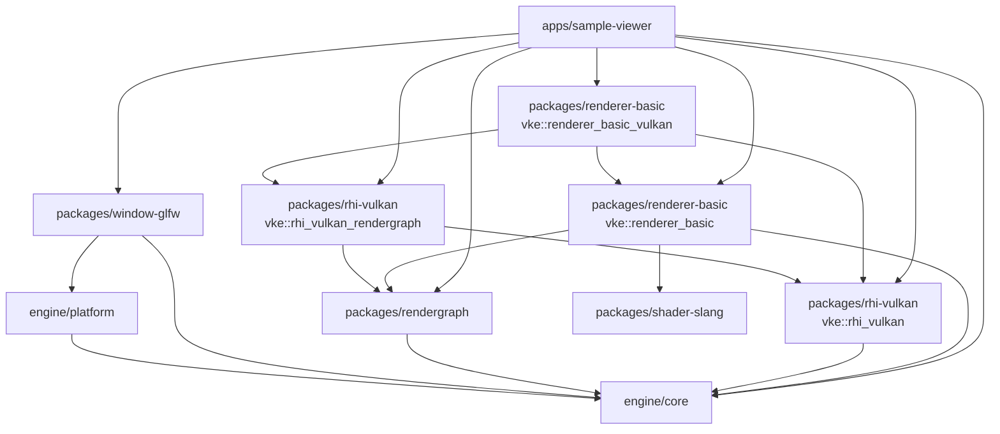

当前约束：

- `vke::rhi_vulkan` 是基础 Vulkan 后端，不公开依赖 RenderGraph。
- `vke::rhi_vulkan_rendergraph` 是 RenderGraph/Vulkan 适配层，负责把抽象 graph state 翻译为 Vulkan 类型。
- `renderer-basic` 只描述后端无关的 basic renderer graph 片段。
- `renderer-basic-vulkan` 组合 RenderGraph、Vulkan frame callback 和 Vulkan adapter，承载当前 clear frame orchestration。
- `sample-viewer` 负责窗口、context 和 smoke 命令入口；`--smoke-frame` 不再持有 clear pass 录制细节。

## 启动与 Context 流程

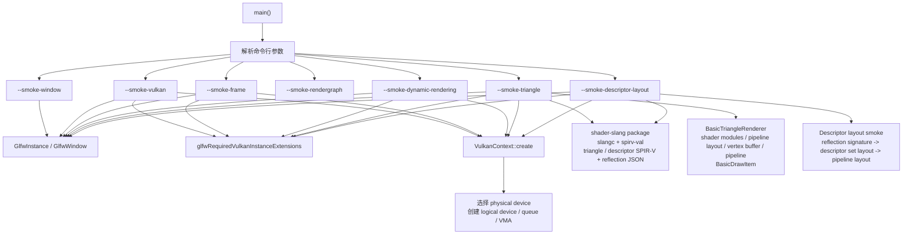

状态：

- `--smoke-window` 已接入窗口创建。
- `--smoke-vulkan` 已接入 Vulkan context/device 创建。
- `--smoke-frame` 已接入 swapchain acquire、RenderGraph-driven clear、present。
- `--smoke-dynamic-rendering` 已接入 swapchain acquire、RenderGraph color write、dynamic rendering clear、present。
- `--smoke-triangle` 已接入 `BasicTriangleRenderer`、dynamic-rendering graphics pipeline、RenderGraph color write、draw、present。
- `--smoke-descriptor-layout` 已接入非空 descriptor reflection signature 到 Vulkan descriptor set layout / pipeline layout 的创建验证。
- `--smoke-rendergraph` 是 RenderGraph CPU 编译和 Vulkan adapter 字段验证入口。

## 当前 Frame Loop 流程

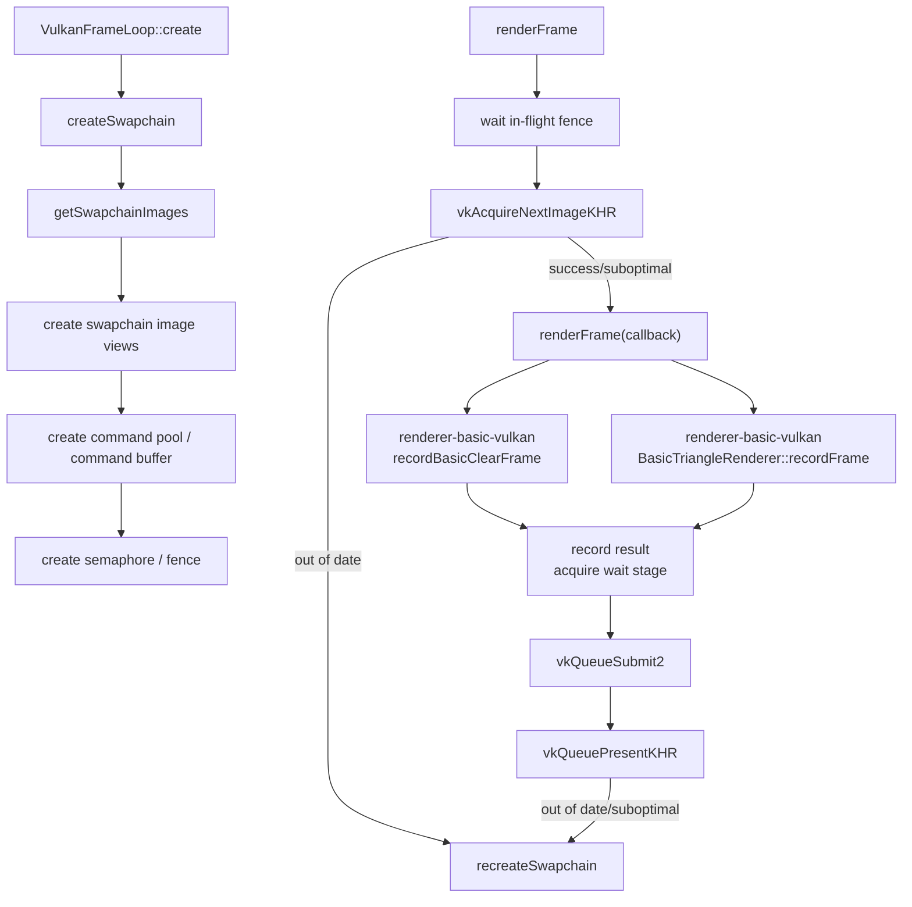

`--smoke-frame` 当前真实录制流程：

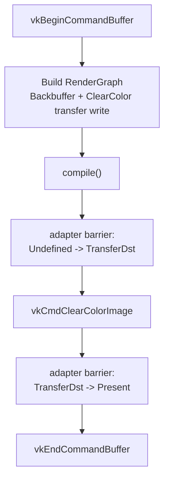

`--smoke-dynamic-rendering` 当前真实录制流程：

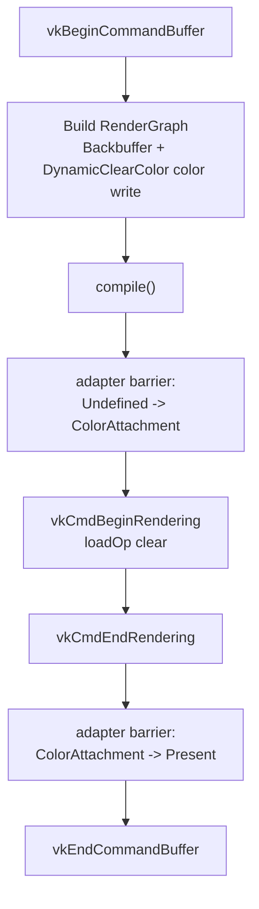

`--smoke-triangle` 当前真实录制流程：

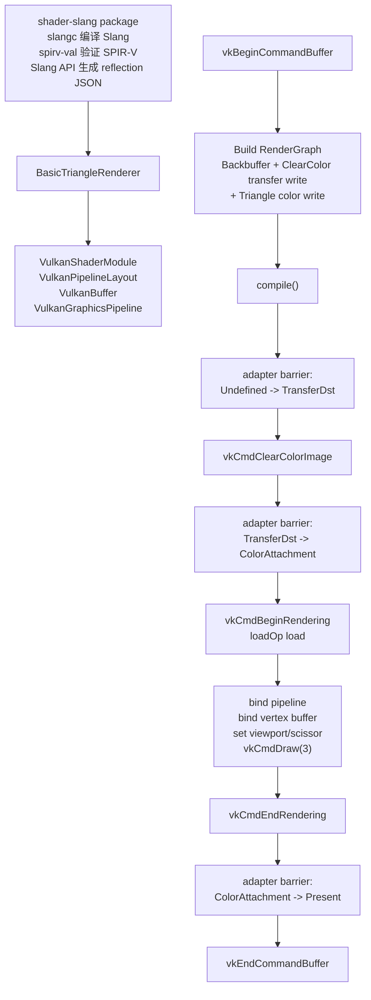

状态：

- 已接入真实 Vulkan 命令录制。
- `--smoke-frame` 的 clear/present barriers 已由 RenderGraph compile result 经 Vulkan adapter 生成。
- `--smoke-dynamic-rendering` 已验证 swapchain image view、dynamic rendering attachment clear 和 `ColorAttachment -> Present` transition。
- `--smoke-triangle` 已验证 `shader-slang` 构建出的 Slang SPIR-V、reflection JSON、triangle shader 契约校验、`BasicTriangleRenderer` 管理的 shader module、reflection-derived pipeline layout、host-upload vertex buffer、dynamic rendering graphics pipeline、`BasicDrawItem` draw 参数、ClearColor + Triangle 两个 graph pass、viewport/scissor dynamic state 和 triangle draw。
- `--smoke-descriptor-layout` 已验证 `descriptor_layout.slang` 的非空 reflection signature 可映射为固定 descriptor set layout 和 pipeline layout；当前只验证 layout 契约，不分配或绑定 descriptor set。
- 无参数 sample viewer 已接入交互式 triangle 循环，并已手动验证 resize/minimize 后仍可恢复持续渲染。
- RenderGraph transition 录制通过 `RenderGraphImageHandle -> VkImage` binding 查找真实 Vulkan image；当前 smoke 只绑定 Backbuffer，后续 depth/transient image 必须显式加入 binding 表。
- 默认 `VulkanFrameLoop::renderFrame()` 仍保留内置 clear 路径，作为基础 RHI smoke fallback。
- frame callback 会返回 `VulkanFrameRecordResult.waitStageMask`，用于匹配 acquire semaphore 的等待阶段。
- `recordBasicClearFrame` 和 triangle shader/pipeline 装配已下沉到 `renderer-basic-vulkan`，sample-viewer 只传入后端 recording callback。

未来多 view/camera 边界：

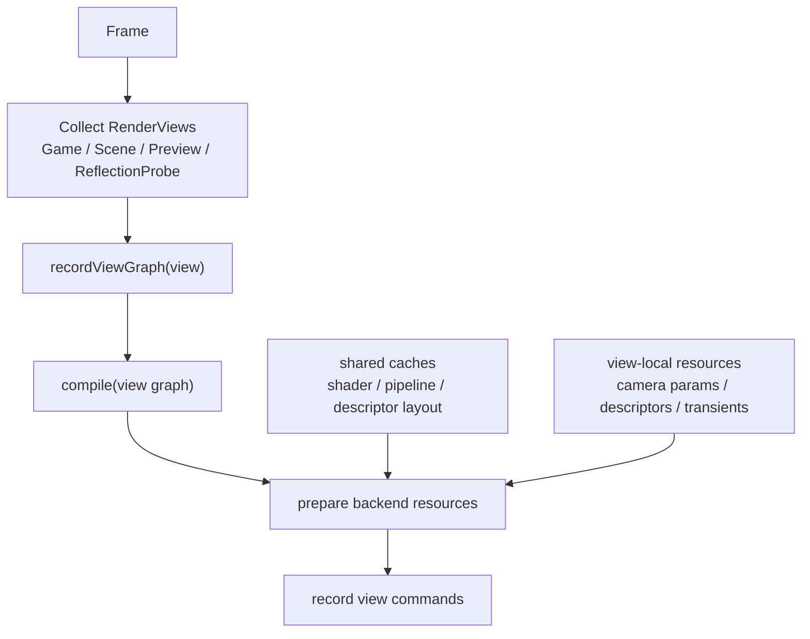

- 当前 sample 只有一个 game view / swapchain target，但后续 editor 需要允许一帧多个 view graph。
- Game View、Scene View、Preview View 共享 renderer、RenderGraph 和 Vulkan backend caches，但各自拥有
  view-local camera params、descriptor sets、transient resources 和 compiled graph。
- Scene View 可以额外 record grid、gizmos、selection outline、wire overlay、debug overlay 等 editor-only
  pass；这些 pass 不能污染 Game View graph。
- RenderGraph handle 只在单个 view graph 内有效；跨 view 共享资源必须由 resource manager 拥有并 import。

## RenderGraph 编译与执行流程

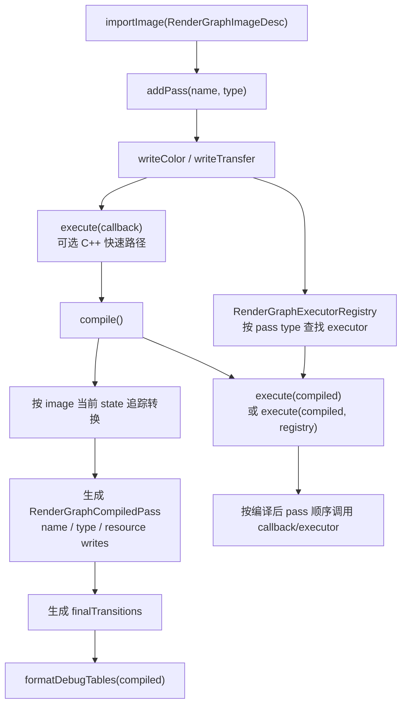

每帧职责边界：

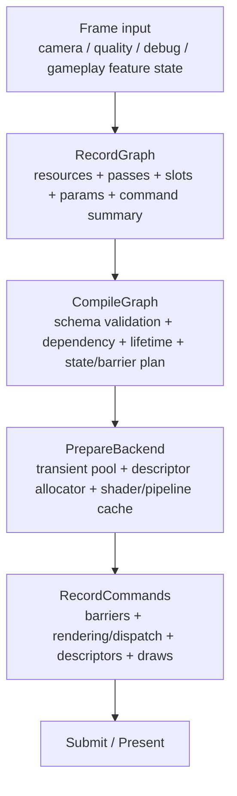

- `RecordGraph` 可以每帧运行，并允许普通 C++ 控制流决定哪些动态 feature 进入当前帧 graph。未来脚本
  VM 也只应运行在这一段。
- `compile()` 负责校验 pass/resource 声明、计算依赖、resource lifetime、final transitions、
  barrier/layout plan、transient allocation plan 和调试表信息。
- `compile()` 不负责 shader 编译、reflection 解析、descriptor set layout 创建、pipeline layout 创建、
  graphics/compute pipeline 创建或长期 GPU resource 创建。
- `PrepareBackend` 负责用 compiled graph 消费 shader cache、pipeline layout cache、pipeline cache、
  descriptor allocator 和 transient resource pool。动态参数在这里或 RecordGraph 前进入 per-frame param
  block、push constants 或 descriptor 更新。
- `RecordCommands` 按 compiled graph 录制 Vulkan 命令，不再改变 graph topology，也不回调脚本 VM。
- 动态 feature 应在 record/build 阶段决定是否把 pass 放进 graph；轻量常驻 feature 用参数控制，昂贵或
  需要额外 RT/buffer 的 feature 用 active predicate 控制是否 record。

当前抽象状态：

- `Undefined`
- `ColorAttachment`
- `ShaderRead(fragment/compute)`
- `TransferDst`
- `Present`

当前 write 声明：

- `writeColor("target", image)` / `writeColor(image)` 会要求 image 进入 `ColorAttachment`；旧的
  无 slot API 暂时等价于 `"target"`。
- `writeTransfer("target", image)` / `writeTransfer(image)` 会要求 image 进入 `TransferDst`；旧的
  无 slot API 暂时等价于 `"target"`。
- `readTexture("source", image, shaderStage)` 会要求 image 进入 `ShaderRead(shaderStage)`；当前 smoke
  已验证 fragment shader-read，不执行真实 descriptor sampling。
- compiled pass 和 executor context 已携带 `colorWriteSlots` / `shaderReadSlots` / `transferWriteSlots`，
  `--smoke-rendergraph` 会验证 slot name、shader stage 并在调试表输出 slot。
- `setParamsType("...")` 已接入最小 params type id；compiled pass 和 executor context 会携带该
  type id，真实 typed params payload 后续再加。
- `RenderGraphSchemaRegistry` / `RenderGraphPassSchema` 已接入最小 schema 验证：按 pass type 校验
  params type、允许的 slot 和必需 slot。
- `pass.type` 是当前 typed executor key，并会继续演进为执行模型 / pass opcode。它不等同于
  RenderQueue 或 shader tag；脚本/工具未来应通过同一套 C++ builder 语义生成 pass 声明、资源访问、
  typed params 和受控 command context。

## RenderGraph 到 Vulkan 的翻译流程

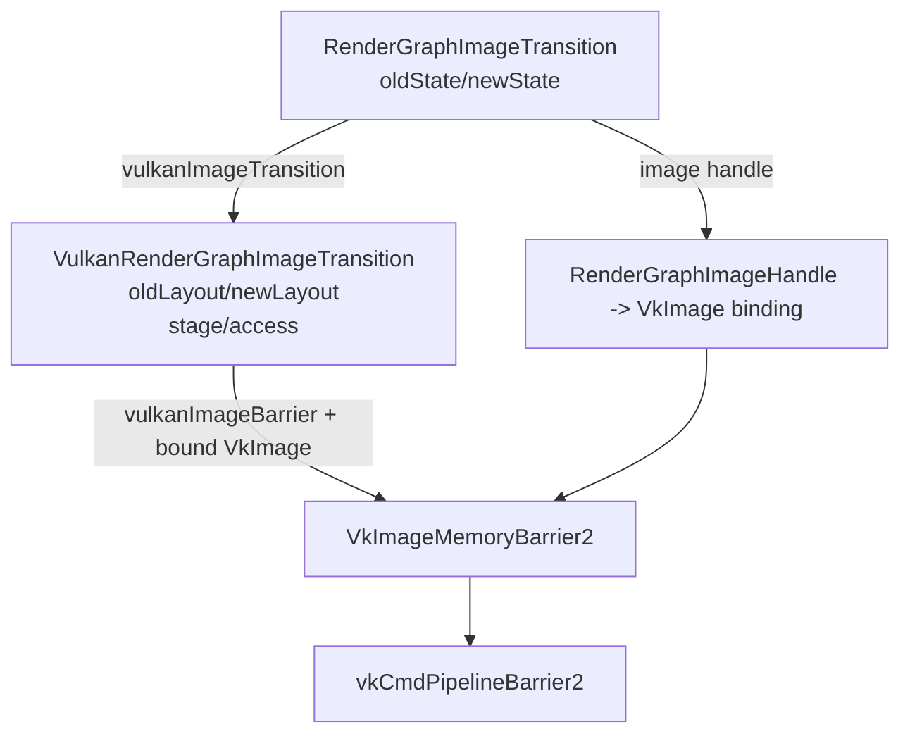

状态：

- `vulkanImageTransition` 已实现。
- `vulkanImageBarrier` 已实现。
- `recordRenderGraphTransitions` 已要求调用方提供 `VulkanRenderGraphImageBinding` 表，不再隐式假设所有 transition 都作用在当前 swapchain image。
- `--smoke-rendergraph` 已验证 `TransferDst -> Present` 的 layout、stage、access 与 `VkImageMemoryBarrier2` 字段。
- `--smoke-rendergraph` 已验证 `TransferDst -> ShaderRead(fragment)` 映射到
  `VK_IMAGE_LAYOUT_SHADER_READ_ONLY_OPTIMAL`、`VK_PIPELINE_STAGE_2_FRAGMENT_SHADER_BIT` 和
  `VK_ACCESS_2_SHADER_SAMPLED_READ_BIT`。
- `--smoke-frame` 已消费 RenderGraph 编译结果来录制 clear frame barriers。
- `--smoke-rendergraph` 已输出 resources、passes、slots、transitions 的 Markdown 调试表格，并验证
  pass type、params type 和 slot schema。

## 下一步接入计划

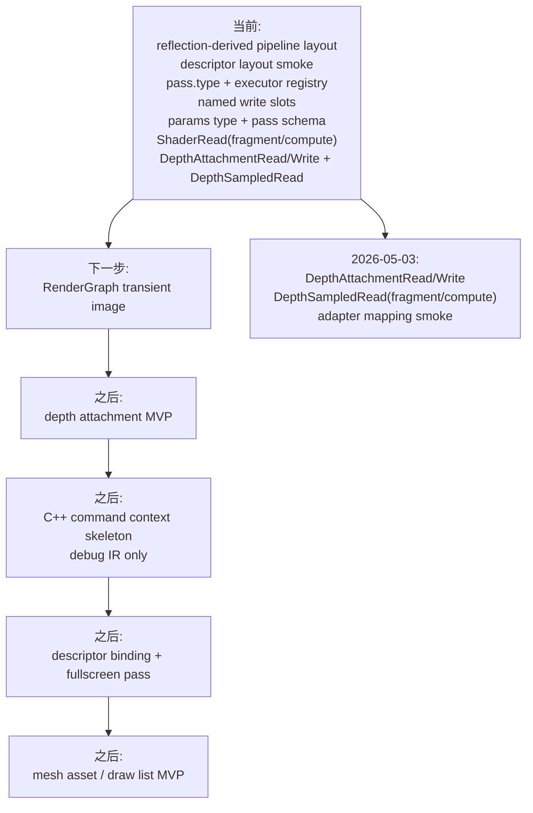

建议推进顺序：

1. 保持 `VulkanFrameLoop` 基础 target 不依赖 RenderGraph。
2. 保持 `renderer-basic` 后端无关，Vulkan 命令录制放在 `renderer-basic-vulkan`。
3. 保持 RenderGraph 调试表格只输出抽象 RG 信息；Vulkan layout/stage/access 调试表应放在 Vulkan adapter 层。
4. Slang reflection JSON、固定 descriptor set layout RAII、reflection-derived pipeline layout 和非空 descriptor signature smoke 已接入；下一步不急着进入脚本 VM，而是补齐 RenderGraph pass declaration v2。
5. `pass.type` 只负责执行模型 / typed pass 分发；RenderQueue、shader pass tag 和 RendererList 等到 mesh/material 阶段再引入。
6. fullscreen、postprocess 和 depth 前必须先补 `ShaderRead`、`DepthAttachmentRead/Write`、`DepthSampledRead` 等抽象 state，以及对应 Vulkan layout/stage/access 翻译；`ShaderRead` 需要携带 shader stage/domain，depth attachment 读写不能和 depth texture 采样混用。
7. transient image 和 depth attachment 必须同步扩展 RenderGraph state、Vulkan binding 表、VMA allocation 和 smoke。
8. 受控 command context 先用 C++ 原型化未来脚本 API，但第一版只作为 debug IR/summary；`setTexture` 和 fullscreen draw 的真实 Vulkan 执行等 descriptor binding、pipeline key 和 state 翻译完整后再接入。
9. mesh asset 路线放在 shader/layout/resource 生命周期稳定之后，并优先走 draw list，不提前暴露逐 object 脚本 draw loop。
