# 流程架构图

本文档记录当前代码真实流程。每次实现或重构后都需要同步更新，用来帮助审查架构走向、包边界和下一步开发顺序。

## 维护规则

- 代码改变了运行流程、包依赖、资源状态、同步路径或 smoke 命令时，必须更新本文档。
- 图中的“已接入”表示当前运行路径真实使用；“smoke 验证”表示已有测试入口但尚未接入主 frame loop；“下一步”表示目标方向。
- RenderGraph 图层必须保持后端无关；Vulkan layout、stage、access、barrier 翻译只允许出现在 `packages/rhi-vulkan`。

## 当前包依赖

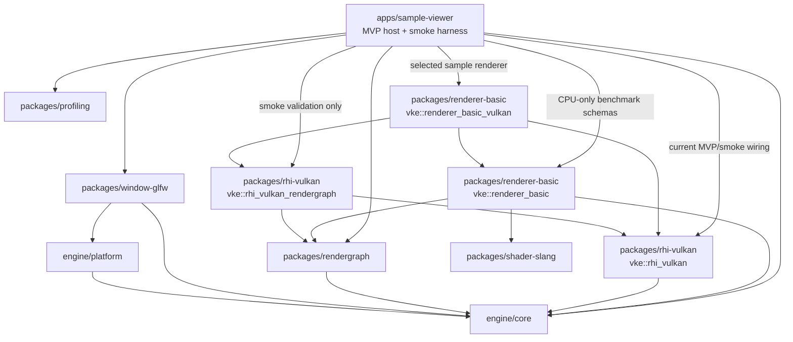

当前约束：

- `vke::rhi_vulkan` 是基础 Vulkan 后端，不公开依赖 RenderGraph。
- `vke::rhi_vulkan_rendergraph` 是 RenderGraph/Vulkan 适配层，负责把抽象 graph state 翻译为 Vulkan 类型。
- `renderer-basic` 只描述后端无关的 basic renderer graph 片段。
- `renderer-basic-vulkan` 组合 RenderGraph、Vulkan frame callback 和 Vulkan adapter，承载当前 clear frame orchestration。
- `profiling` 提供后端无关 CPU scope、frame profile 和 JSONL 输出；当前只由 sample-viewer benchmark 使用。
- `sample-viewer` 当前同时承担 app host 和 smoke harness，所以会直接创建 `VulkanContext` /
  `VulkanFrameLoop`。这是当前 MVP 事实，不是目标产品边界；后续应收敛到 runtime/engine host。
- `sample-viewer` 的 smoke validation 可以直接验证 `rhi_vulkan_rendergraph` 字段；普通运行路径不应把
  Vulkan barrier/layout 细节扩散到 app 层。

## 当前架构总览

这张图按“谁拥有抽象、谁拥有 Vulkan、谁负责组装运行”来读。横向是包边界，纵向是每帧数据从应用入口落到
GPU submit 的方向。

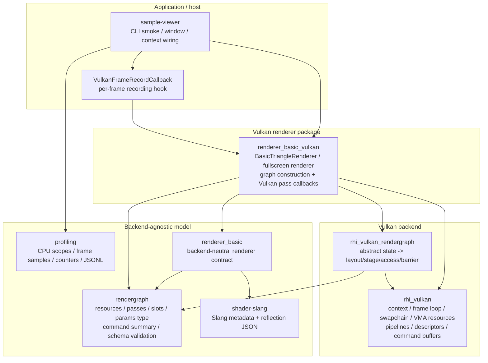

当前最重要的切分：

- RenderGraph 只知道抽象 image state、slot、params type 和 command kind，不知道 `VkImageLayout`、pipeline
  stage 或 access mask。
- Vulkan layout/stage/access 翻译只在 `rhi_vulkan_rendergraph`，真实 command buffer、descriptor、pipeline、
  swapchain 和 VMA 生命周期只在 Vulkan 包或 `renderer_basic_vulkan`。
- `sample-viewer` 是 host 和 smoke harness；它可以选择 smoke 路径，但不应该内联具体 renderer 的 Vulkan 录制细节。

## 启动与 Context 流程

```mermaid
flowchart TD
    Start["main()"]
    Args["解析命令行参数"]
    WindowSmoke["--smoke-window"]
    VulkanSmoke["--smoke-vulkan"]
    FrameSmoke["--smoke-frame"]
    RGSmoke["--smoke-rendergraph"]
    RGBench["--bench-rendergraph"]
    TransientSmoke["--smoke-transient"]
    DynamicSmoke["--smoke-dynamic-rendering"]
    TriangleSmoke["--smoke-triangle"]
    DepthTriangleSmoke["--smoke-depth-triangle"]
    MeshSmoke["--smoke-mesh"]
    Mesh3DSmoke["--smoke-mesh-3d"]
    DrawListSmoke["--smoke-draw-list"]
    DescriptorSmoke["--smoke-descriptor-layout"]
    FullscreenTextureSmoke["--smoke-fullscreen-texture"]
    DeferredDeletionSmoke["--smoke-deferred-deletion"]
    GLFW["GlfwInstance / GlfwWindow"]
    Ext["glfwRequiredVulkanInstanceExtensions"]
    Context["VulkanContext::create"]
    Device["选择 physical device<br/>创建 logical device / queue / VMA"]
    ShaderBuild["shader-slang package<br/>slangc + spirv-val<br/>triangle / descriptor / mesh3d SPIR-V + reflection JSON"]
    RendererObject["BasicTriangleRenderer / BasicMesh3DRenderer / BasicDrawListRenderer<br/>shader modules / pipeline layout / vertex/index buffer / pipeline<br/>BasicDrawItem / BasicDrawListItem / MVP push constants"]
    DescriptorLayout["Descriptor layout smoke<br/>reflection signature -> descriptor set layout -> pipeline layout<br/>descriptor allocator-backed pool/set<br/>buffer + image + sampler write"]

    Start --> Args
    Args --> WindowSmoke
    Args --> VulkanSmoke
    Args --> FrameSmoke
    Args --> RGSmoke
    Args --> RGBench
    Args --> TransientSmoke
    Args --> DynamicSmoke
    Args --> TriangleSmoke
    Args --> DepthTriangleSmoke
    Args --> MeshSmoke
    Args --> Mesh3DSmoke
    Args --> DrawListSmoke
    Args --> DescriptorSmoke
    Args --> FullscreenTextureSmoke
    Args --> DeferredDeletionSmoke
    WindowSmoke --> GLFW
    VulkanSmoke --> GLFW
    VulkanSmoke --> Ext
    VulkanSmoke --> Context
    FrameSmoke --> GLFW
    FrameSmoke --> Ext
    FrameSmoke --> Context
    DynamicSmoke --> GLFW
    DynamicSmoke --> Ext
    DynamicSmoke --> Context
    TriangleSmoke --> GLFW
    TriangleSmoke --> Ext
    TriangleSmoke --> Context
    TriangleSmoke --> ShaderBuild
    TriangleSmoke --> RendererObject
    DepthTriangleSmoke --> GLFW
    DepthTriangleSmoke --> Ext
    DepthTriangleSmoke --> Context
    DepthTriangleSmoke --> ShaderBuild
    DepthTriangleSmoke --> RendererObject
    MeshSmoke --> GLFW
    MeshSmoke --> Ext
    MeshSmoke --> Context
    MeshSmoke --> ShaderBuild
    MeshSmoke --> RendererObject
    Mesh3DSmoke --> GLFW
    Mesh3DSmoke --> Ext
    Mesh3DSmoke --> Context
    Mesh3DSmoke --> ShaderBuild
    Mesh3DSmoke --> RendererObject
    DrawListSmoke --> GLFW
    DrawListSmoke --> Ext
    DrawListSmoke --> Context
    DrawListSmoke --> ShaderBuild
    DrawListSmoke --> RendererObject
    DescriptorSmoke --> GLFW
    DescriptorSmoke --> Ext
    DescriptorSmoke --> Context
    DescriptorSmoke --> ShaderBuild
    DescriptorSmoke --> DescriptorLayout
    FullscreenTextureSmoke --> GLFW
    FullscreenTextureSmoke --> Ext
    FullscreenTextureSmoke --> Context
    FullscreenTextureSmoke --> ShaderBuild
    FullscreenTextureSmoke --> RendererObject
    Context --> Device
```

状态：

- `--smoke-window` 已接入窗口创建。
- `--smoke-vulkan` 已接入 Vulkan context/device 创建。
- `--smoke-frame` 已接入 swapchain acquire、RenderGraph-driven clear、present。
- `--smoke-dynamic-rendering` 已接入 swapchain acquire、RenderGraph color write、dynamic rendering clear、present。
  frame/dynamic/transient/renderer smoke 会验证 Vulkan debug label begin/end counters 配对，并验证
  timestamp query delayed readback 能返回上一帧 `VulkanFrame` duration。
- `--smoke-triangle` 已接入 `BasicTriangleRenderer`、dynamic-rendering graphics pipeline、RenderGraph color write、draw、present。
- `--smoke-depth-triangle` 已接入 `BasicTriangleRenderer::recordFrameWithDepth()`、transient depth image、
  dynamic-rendering depth attachment、depth-enabled pipeline 和 present。
- `--smoke-mesh` 已接入 `BasicTriangleRenderer` 的 indexed quad path，创建 host-upload vertex/index
  buffers，并验证 buffer upload counters、`vkCmdBindIndexBuffer` + `vkCmdDrawIndexed`。
- `--smoke-mesh-3d` 已接入独立 `BasicMesh3DRenderer`：创建 3D cube vertex/index buffer、显式
  vertex-stage push constant range、固定 MVP 行向量、transient depth attachment，并验证
  `vkCmdPushConstants` + indexed cube draw。
- `--smoke-draw-list` 已接入独立 `BasicDrawListRenderer`：使用后端无关 `BasicDrawListItem`、
  `builtin.raster-draw-list` schema、typed params payload、transient depth attachment 和共享 cube
  vertex/index buffer，验证 buffer upload counters、多 item 的 `vkCmdPushConstants` + indexed draw 循环。
- `--smoke-descriptor-layout` 已接入非空 descriptor reflection signature 到 Vulkan descriptor set layout /
  pipeline layout 的创建验证，并验证 descriptor allocator-backed pool、descriptor set allocation、
  uniform-buffer write、sampled-image write、sampler write 和 allocator counters。
- `--smoke-fullscreen-texture` 已接入真实 draw-time descriptor bind：transient source image 先 clear，
  再 transition 到 `ShaderRead(fragment)`，作为 sampled image + sampler + uniform buffer 绑定后由
  fullscreen dynamic-rendering pass 采样并写入 backbuffer；smoke 同时验证 descriptor allocator 和 buffer
  upload counters。
- `--smoke-offscreen-viewport` 已接入持久 offscreen color target：先把 viewport color image 作为
  imported RenderGraph image 写入 `ColorAttachment`，再 transition 到 `ShaderRead(fragment)` 并由
  fullscreen composite pass 采样写回 backbuffer；smoke 验证 viewport extent 可独立于 swapchain extent、
  resize 后旧 target 进入 deferred deletion、renderer 对外暴露 sampled target handle/layout、
  render target 多帧复用、descriptor bind、debug label 和 timestamp readback。
- `--smoke-rendergraph` 是 RenderGraph CPU 编译、schema 负向编译和 Vulkan adapter 字段验证入口。
- `--bench-rendergraph` 是 CPU-only RenderGraph benchmark 入口；它使用 `packages/profiling`
  记录 RecordGraph/CompileGraph scope 和 graph counters，输出 JSONL，不改变 smoke 语义。
- `--smoke-transient` 已接入真实 Vulkan 路径：根据 compiled transient plan 创建 VMA-backed image、
  image view 和 binding 表，并录制非 backbuffer image transition / clear；现在还验证 transient
  Vulkan image / image view teardown 会进入 frame-loop deferred deletion，并至少完成一次 retirement。
- `--smoke-deferred-deletion` 已接入 P4 后端生命周期起点：验证 deferred deletion queue 的 epoch
  retirement 顺序、empty callback 拒绝路径和 pending/enqueued/retired/flushed counters。
- `VulkanFrameLoop` 现在持有 deferred deletion queue，并在 frame fence / swapchain recreate / shutdown
  已确认 GPU 完成的位置推进 completed epoch。

## 当前运行调用链

交互式 viewer 和各个 Vulkan smoke 共享同一条 frame-loop 骨架：host 创建 window/context/frame loop，
renderer 只通过 callback 在“command buffer 已经 begin”之后录制本帧内容，最后由 frame loop 统一 submit/present。
当前 `sample-viewer` 直接创建 `VulkanContext` / `VulkanFrameLoop` 是 MVP host 和 smoke harness 的接线事实；
目标 runtime 应把这层隐藏在 engine host 后面。

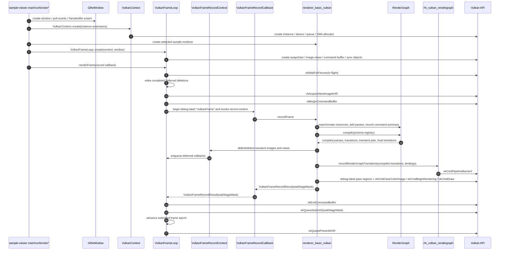

调用链里的责任归属：

- `VulkanFrameLoop` 拥有 acquire、command buffer begin/end、queue submit、present、swapchain recreate
  和 fence/epoch 驱动的 deferred deletion retirement。
- `VulkanFrameLoop` 只知道 `VulkanFrameRecordCallback`，不应该包含或链接 `renderer_basic_vulkan`、
  `RenderGraph` 或具体 sample renderer。
- `renderer_basic_vulkan` 在 callback 内构建 graph、编译 graph、准备 transient/descriptor/pipeline 相关资源并录制 draw。
  transient Vulkan image / image view 的旧对象通过 `VulkanFrameRecordContext::deferDeletion()` 挂回
  frame loop 的 fence/epoch retirement；renderer 不持有 frame loop，也不直接 submit/present。
- `RenderGraph` 产出后端无关计划；它不直接调用 Vulkan。
- `rhi_vulkan_rendergraph` 把 compiled transition 翻译为 Vulkan barrier，再由调用方用真实 image binding 录制。

## 当前 Frame Loop 流程

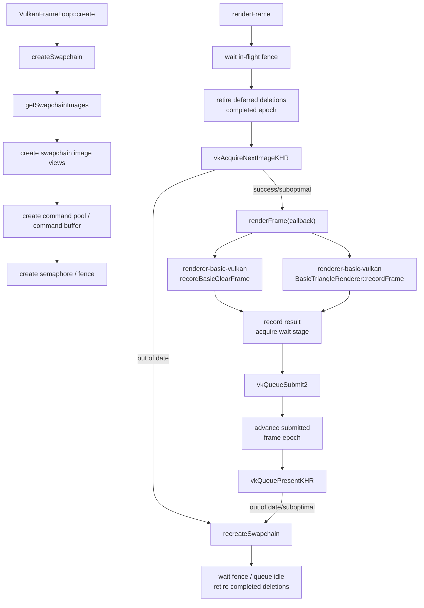

`--smoke-frame` 当前真实录制流程：

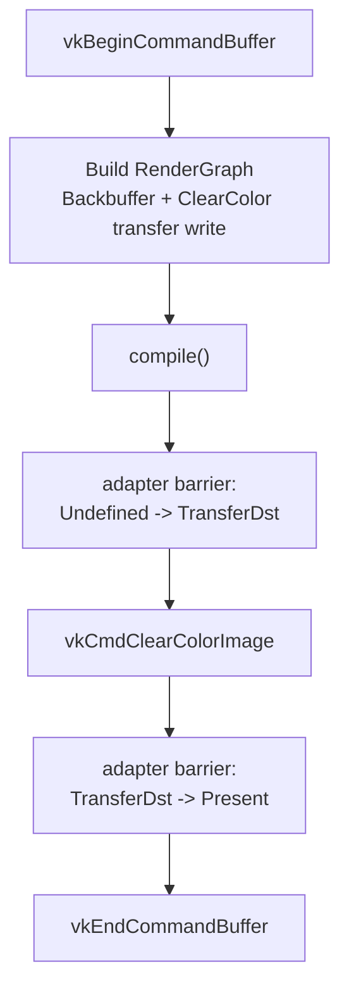

`--smoke-dynamic-rendering` 当前真实录制流程：

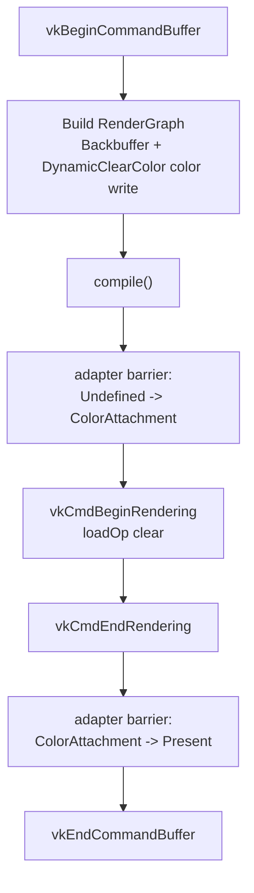

`--smoke-triangle` / `--smoke-depth-triangle` / `--smoke-mesh` / `--smoke-mesh-3d` /
`--smoke-draw-list` 当前真实录制流程：

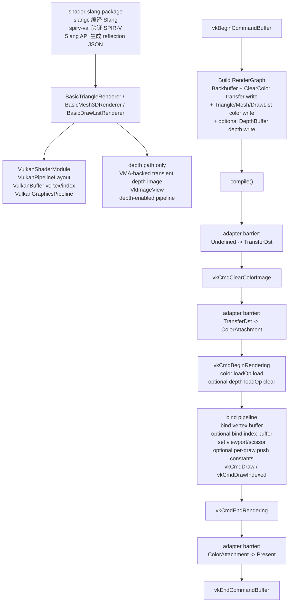

`--smoke-fullscreen-texture` 当前真实录制流程：

```mermaid
flowchart TD
    Renderer["BasicFullscreenTextureRenderer::recordFrame"]
    ImportBackbuffer["importImage(Backbuffer)<br/>initial Undefined, final Present"]
    CreateSource["createTransientImage(FullscreenSource)<br/>same format/extent as backbuffer"]
    BindingBackbuffer["binding table add backbuffer<br/>RenderGraphImageHandle -> swapchain VkImage/View"]
    ClearPass["pass ClearFullscreenSource<br/>type builtin.transfer-clear<br/>params builtin.transfer-clear.params<br/>writeTransfer(target, source)<br/>ClearColor command"]
    DrawPass["pass FullscreenTexture<br/>type builtin.raster-fullscreen<br/>params builtin.raster-fullscreen.params<br/>readTexture(source, fragment)<br/>writeColor(target, backbuffer)<br/>SetShader / SetTexture / SetVec4 / DrawFullscreenTriangle"]
    Schema["basicFullscreenSchemaRegistry<br/>slot schema + allowed command kind"]
    Compile["RenderGraph::compile(schema)<br/>validate params / slots / commands<br/>compute transitions + transient lifetime"]
    Prepare["prepareTransientResources<br/>VMA image + image view<br/>append source binding"]
    Execute["graph.execute(compiled)<br/>pass callbacks in compiled order"]
    ClearTransition["record transitions<br/>Undefined -> TransferDst"]
    ClearCmd["vkCmdClearColorImage(source)"]
    DrawTransition["record transitions<br/>TransferDst -> ShaderRead(fragment)<br/>Undefined -> ColorAttachment"]
    Descriptor["updateSourceDescriptor<br/>sampled image view + sampler + uniform buffer"]
    DrawCmd["recordFullscreenTextureDraw<br/>vkCmdBeginRendering<br/>bind pipeline / descriptor set<br/>vkCmdDraw(3)<br/>vkCmdEndRendering"]
    FinalTransition["record final transition<br/>ColorAttachment -> Present"]
    Result["return waitStageMask<br/>COLOR_ATTACHMENT_OUTPUT"]

    Renderer --> ImportBackbuffer --> CreateSource --> BindingBackbuffer
    BindingBackbuffer --> ClearPass --> DrawPass --> Schema --> Compile --> Prepare --> Execute
    Execute --> ClearTransition --> ClearCmd --> DrawTransition --> Descriptor --> DrawCmd --> FinalTransition --> Result
```

这条路径目前有两层“可分析”信息：

- builder 显式声明 resource access：source 先 `TransferWrite`，后 `ShaderRead(fragment)`；backbuffer 作为
  `ColorWrite` 后最终回到 `Present`。
- command summary 显式声明执行意图：clear pass 只允许 `ClearColor`，fullscreen pass 只允许
  `SetShader`、`SetTexture`、`SetVec4` 和 `DrawFullscreenTriangle`；compile 阶段会拒绝 schema 外命令。

状态：

- 已接入真实 Vulkan 命令录制。
- `--smoke-frame` 的 clear/present barriers 已由 RenderGraph compile result 经 Vulkan adapter 生成。
- `--smoke-dynamic-rendering` 已验证 swapchain image view、dynamic rendering attachment clear 和 `ColorAttachment -> Present` transition。
- `--smoke-triangle` 已验证 `shader-slang` 构建出的 Slang SPIR-V、reflection JSON、triangle shader 契约校验、`BasicTriangleRenderer` 管理的 shader module、reflection-derived pipeline layout、host-upload vertex buffer、dynamic rendering graphics pipeline、`BasicDrawItem` draw 参数、ClearColor + Triangle 两个 graph pass、viewport/scissor dynamic state 和 triangle draw。
- `--smoke-mesh` 已验证最小 indexed mesh 数据、host-upload index buffer、`BasicDrawItem` indexed draw
  参数、`vkCmdBindIndexBuffer` 和 `vkCmdDrawIndexed`。
- `--smoke-mesh-3d` 已验证最小 3D mesh path：固定 cube mesh、depth attachment、MVP push constants、
  3D vertex input layout 和 indexed draw；当前只作为 renderer-basic-vulkan 的 smoke，不引入全局相机系统。
- `--smoke-draw-list` 已验证最小 draw list path：后端无关 `BasicDrawListItem` 描述 per-draw range
  和 transform，RenderGraph typed pass 使用 `builtin.raster-draw-list` schema/params，Vulkan backend
  在一个 dynamic rendering pass 内循环提交两个 indexed cube draw。
- `--smoke-depth-triangle` 已验证 `D32Sfloat` transient depth image、depth aspect binding、
  `Undefined -> DepthAttachmentWrite` transition、dynamic rendering depth attachment clear 和
  depth-enabled graphics pipeline。
- `--smoke-descriptor-layout` 已验证 `descriptor_layout.slang` 的非空 reflection signature 可映射为固定
  descriptor set layout 和 pipeline layout，并能分配 descriptor set、写入 set 0 / binding 0 的 uniform
  buffer、binding 1 的 sampled image 和 binding 2 的 sampler descriptor。
- `--smoke-fullscreen-texture` 已验证 draw call 中的 descriptor set 绑定、fullscreen pipeline 绑定和
  transient source texture 采样。
- `--smoke-offscreen-viewport` 已验证 editor viewport 的核心离屏路径：持久 color attachment image
  独立尺寸、resize 后 deferred deletion、多帧复用、RenderGraph imported image 写入、sampled image
  descriptor 更新、renderer 输出可供 UI backend 注册的 sampled target，以及 fullscreen composite 写回 swapchain。
- 无参数 sample viewer 已接入交互式 triangle 循环，并已手动验证 resize/minimize 后仍可恢复持续渲染。
- RenderGraph transition 录制通过 `RenderGraphImageHandle -> VkImage/imageView/aspect` binding 查找真实
  Vulkan resource；pass callback 侧通过 `RenderGraphPassContext` 的 named slots 反查 `source`、
  `target` 或 `depth` 对应 binding，Backbuffer、`--smoke-transient` 的 transient color image 和
  `--smoke-depth-triangle` 的 transient depth image 都已显式加入 binding 表。
- 默认 `VulkanFrameLoop::renderFrame()` 仍保留内置 clear 路径，作为基础 RHI smoke fallback。
- frame callback 会返回 `VulkanFrameRecordResult.waitStageMask`，用于匹配 acquire semaphore 的等待阶段。
- `recordBasicClearFrame` 和 triangle shader/pipeline 装配已下沉到 `renderer-basic-vulkan`，sample-viewer 只传入后端 recording callback。

未来多 view/camera 边界：

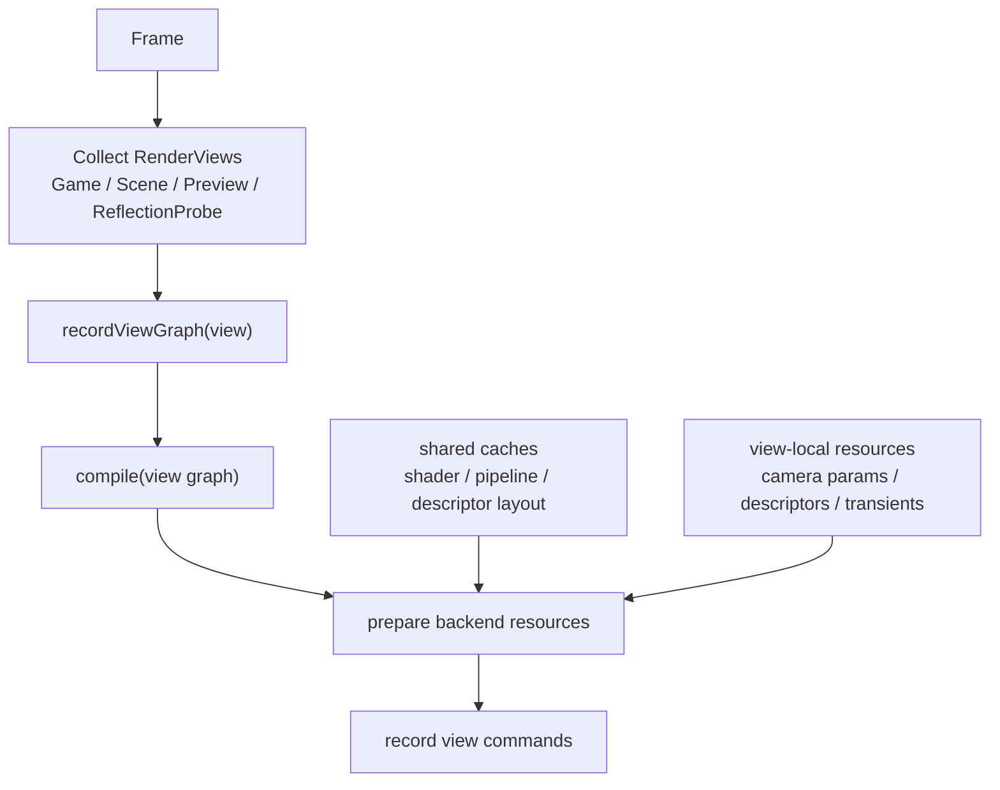

- 当前 sample 只有一个 game view / swapchain target，但后续 editor 需要允许一帧多个 view graph。
- Game View、Scene View、Preview View 共享 renderer、RenderGraph 和 Vulkan backend caches，但各自拥有
  view-local camera params、descriptor sets、transient resources 和 compiled graph。
- Scene View 可以额外 record grid、gizmos、selection outline、wire overlay、debug overlay 等 editor-only
  pass；这些 pass 不能污染 Game View graph。
- RenderGraph handle 只在单个 view graph 内有效；跨 view 共享资源必须由 resource manager 拥有并 import。

## RenderGraph 编译与执行流程

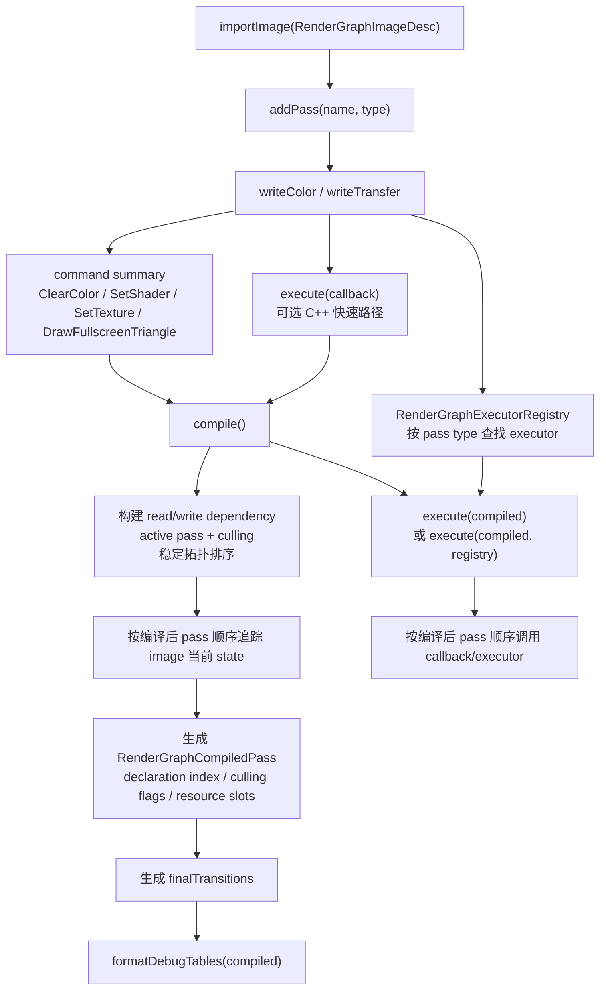

每帧职责边界：

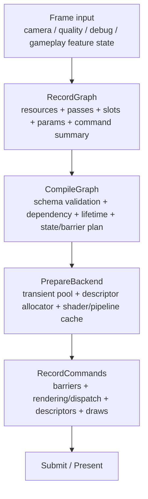

- `RecordGraph` 可以每帧运行，并允许普通 C++ 控制流决定哪些动态 feature 进入当前帧 graph。未来脚本
  VM 也只应运行在这一段。
- `compile()` 负责校验 pass/resource 声明、构建 read/write dependency、根据 `allowCulling` /
  `hasSideEffects` 计算 active pass、稳定拓扑排序、resource lifetime、final transitions、
  barrier/layout plan、transient allocation plan 和调试表信息。
- `compile()` 不负责 shader 编译、reflection 解析、descriptor set layout 创建、pipeline layout 创建、
  graphics/compute pipeline 创建或长期 GPU resource 创建。
- `PrepareBackend` 负责用 compiled graph 消费 shader cache、pipeline layout cache、pipeline cache、
  descriptor allocator 和 transient resource pool。动态参数在这里或 RecordGraph 前进入 per-frame param
  block、push constants 或 descriptor 更新。
- `RecordCommands` 按 compiled graph 顺序录制 Vulkan 命令，不再改变 graph topology，也不回调脚本 VM。
- 动态 feature 应在 record/build 阶段决定是否把 pass 放进 graph；轻量常驻 feature 用参数控制，昂贵或
  需要额外 RT/buffer 的 feature 用 active predicate 控制是否 record。

当前抽象状态：

- `Undefined`
- `ColorAttachment`
- `ShaderRead(fragment/compute)`
- `DepthAttachmentRead`
- `DepthAttachmentWrite`
- `DepthSampledRead(fragment/compute)`
- `TransferDst`
- `Present`

当前 write 声明：

- `writeColor("target", image)` / `writeColor(image)` 会要求 image 进入 `ColorAttachment`；旧的
  无 slot API 暂时等价于 `"target"`。
- `writeTransfer("target", image)` / `writeTransfer(image)` 会要求 image 进入 `TransferDst`；旧的
  无 slot API 暂时等价于 `"target"`。
- `readTexture("source", image, shaderStage)` 会要求 image 进入 `ShaderRead(shaderStage)`；当前 smoke
  已验证 fragment shader-read，fullscreen texture 路径已执行真实 descriptor sampling。
- `writeDepth("depth", image)` 会要求 image 进入 `DepthAttachmentWrite`。
- `readDepth("depth", image)` 会要求 image 进入 `DepthAttachmentRead`。
- `sampleDepth("depth", image, shaderStage)` 会要求 image 进入 `DepthSampledRead(shaderStage)`。
- 同一 pass 内同一 image 现在不能跨 access group 重复声明。Unity/RDG 工具里的 read-write 展示是访问摘要；
  VkEngine 后续若支持 attachment read/write、blend/load、storage read/write、framebuffer fetch 或
  grab/copy-to-temp，必须先新增明确 state/API 和 Vulkan feature/layout/access 映射。
- compiled pass 和 executor context 已携带 `colorWriteSlots` / `shaderReadSlots` / `transferWriteSlots`，
  `--smoke-rendergraph` 会验证 slot name、shader stage 并在调试表输出 slot。
- `setParamsType("...")` / `setParams(type, params)` 已接入最小 params type id 和 POD payload；
  compiled pass 和 executor context 会携带 type id 与 payload bytes。
- `RenderGraphSchemaRegistry` / `RenderGraphPassSchema` 已接入最小 schema 验证：按 pass type 校验
  params type、允许的 slot、必需 slot 和允许的 command kind。
- `renderer_basic/render_graph_schemas.hpp` 已集中维护内建 clear、dynamic clear、transient present、
  triangle、depth triangle、mesh3D、draw-list 和 fullscreen pass 的 type、params type、POD params
  与 schema registry helper；真实 renderer-basic Vulkan 路径现在通过这套共享 schema compile。
- `--smoke-rendergraph` 已覆盖每个 renderer-basic builtin pass 的 missing slot、invalid slot 和
  wrong params type 负向编译路径。
- `renderer_basic_vulkan` 的 fullscreen、transient、depth、mesh 和 draw-list callbacks 已按
  `source` / `target` / `depth` named slot 查询 Vulkan binding，避免 callback 隐式捕获资源 handle。
- `PassBuilder::allowCulling()` 和 `PassBuilder::hasSideEffects()` 已接入；schema 也可声明
  `allowCulling` / `hasSideEffects`。默认 pass 不参与 culling，写 imported image 的 pass 会作为外部输出保留。
- `pass.type` 是当前 typed executor key，并会继续演进为执行模型 / pass opcode。它不等同于
  RenderQueue 或 shader tag；脚本/工具未来应通过同一套 C++ builder 语义生成 pass 声明、资源访问、
  typed params 和受控 command context。
- 受控 command context skeleton 已接入：`RenderGraphCommandList` 可记录后端无关的 command summary，
  当前覆盖 clear、shader/pass 名称、texture slot binding、标量/向量参数和 fullscreen triangle draw。
  command summary 会进入 compiled pass、executor context 和 debug table；fullscreen texture smoke 已验证
  `setTexture`、`setVec4` 和 `drawFullscreenTriangle` 的最小 Vulkan 执行路径。

## RenderGraph 到 Vulkan 的翻译流程

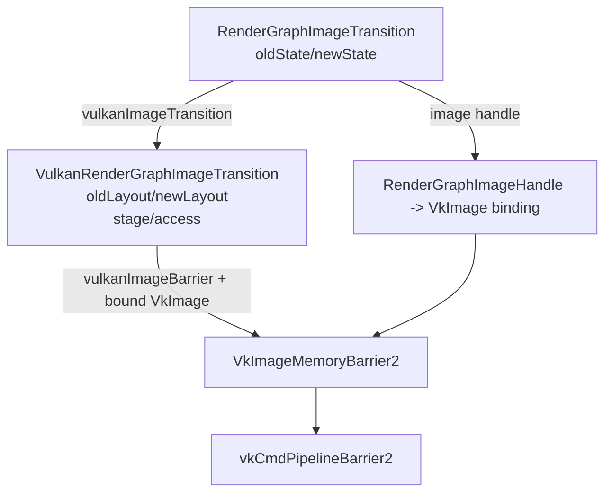

状态：

- `vulkanImageTransition` 已实现。
- `vulkanImageBarrier` 已实现。
- `recordRenderGraphTransitions` 已要求调用方提供 `VulkanRenderGraphImageBinding` 表，不再隐式假设所有 transition 都作用在当前 swapchain image。
- `--smoke-rendergraph` 已验证 `TransferDst -> Present` 的 layout、stage、access 与 `VkImageMemoryBarrier2` 字段。
- `--smoke-rendergraph` 已验证 `TransferDst -> ShaderRead(fragment)` 映射到
  `VK_IMAGE_LAYOUT_SHADER_READ_ONLY_OPTIMAL`、`VK_PIPELINE_STAGE_2_FRAGMENT_SHADER_BIT` 和
  `VK_ACCESS_2_SHADER_SAMPLED_READ_BIT`。
- `--smoke-frame` 已消费 RenderGraph 编译结果来录制 clear frame barriers。
- `--smoke-rendergraph` 已输出 resources、passes、dependencies、slots、commands、transitions、
  transients 的 Markdown 调试表格，并验证 pass type、params type、slot schema、command summary、
  transient lifetime plan 和最小 dependency sort；当前 smoke 故意把 transient reader 声明在 writer 前，
  编译结果会按 dependency 把 writer 排到 reader 前执行；同时覆盖无 producer transient read、缺失
  schema，以及 renderer-basic builtin pass missing slot / invalid slot / wrong params type 的负向编译路径，
  确认错误不会进入 pass callback；也覆盖可剔除 unused transient writer
  被移出 compiled passes、side-effect pass 被保留且 culled pass callback 不执行。
- `--smoke-transient` 已验证 transient image 的 first/last pass、final access、非 backbuffer transition、
  Vulkan adapter mapping、真实 image/image view/VMA allocation 和 binding，以及 transient image pool 的
  create/release/retire/reuse counter。

## 下一步接入计划

```mermaid
flowchart TD
    Now["当前:<br/>reflection-derived pipeline layout<br/>descriptor allocator-backed pool/set buffer/image/sampler write smoke<br/>descriptor bind + fullscreen texture smoke<br/>persistent offscreen viewport target smoke<br/>renderer-basic shared builtin schemas<br/>builtin schema negative smoke<br/>fullscreen pass schema + command-derived pipeline key<br/>indexed mesh + draw list smoke<br/>pass.type + executor registry<br/>named write slots<br/>params type + typed POD payload<br/>RenderGraph dependency sort + culling flags<br/>ShaderRead(fragment/compute)<br/>DepthAttachmentRead/Write + DepthSampledRead<br/>RenderGraph transient image plan<br/>PrepareBackend transient allocation smoke<br/>transient image pool counters<br/>pipeline cache wrapper + reuse counters<br/>descriptor allocator counters<br/>buffer/upload counters<br/>depth attachment MVP smoke<br/>command context debug IR<br/>CPU-only RenderGraph benchmark<br/>GPU debug labels + timestamp delayed readback"]
    Step1["下一步:<br/>multi-view / material expansion"]
    Step2["之后:<br/>resource/material expansion"]

    Now --> Step1 --> Step2

    DepthStateUpdate["2026-05-03:<br/>DepthAttachmentRead/Write<br/>DepthSampledRead(fragment/compute)<br/>adapter mapping smoke"]
    Now --> DepthStateUpdate
    TransientUpdate["2026-05-04:<br/>createTransientImage<br/>transient lifetime plan<br/>--smoke-transient"]
    Now --> TransientUpdate
    TransientVkUpdate["2026-05-04:<br/>VMA-backed transient image<br/>image view + binding table<br/>real transition recording"]
    Now --> TransientVkUpdate
    DepthTriangleUpdate["2026-05-04:<br/>--smoke-depth-triangle<br/>dynamic rendering depth attachment<br/>D32Sfloat transient depth image"]
    Now --> DepthTriangleUpdate
    DrawListUpdate["2026-05-05:<br/>--smoke-draw-list<br/>BasicDrawListItem<br/>builtin.raster-draw-list schema/params"]
    Now --> DrawListUpdate
    DependencySortUpdate["2026-05-05:<br/>dependency table<br/>stable topological sort<br/>out-of-order transient smoke"]
    Now --> DependencySortUpdate
    CullingUpdate["2026-05-05:<br/>allowCulling / hasSideEffects<br/>culled pass table<br/>unused transient culling smoke"]
    Now --> CullingUpdate
    BuiltinSchemaUpdate["2026-05-05:<br/>shared renderer_basic builtin schemas<br/>clear / triangle / mesh / fullscreen schema compile"]
    Now --> BuiltinSchemaUpdate
    SlotBindingUpdate["2026-05-05:<br/>renderer_basic_vulkan callbacks<br/>slot-name Vulkan binding lookup"]
    Now --> SlotBindingUpdate
    BuiltinNegativeUpdate["2026-05-05:<br/>builtin pass schema negatives<br/>missing / invalid / wrong params"]
    Now --> BuiltinNegativeUpdate
    DeferredTransientUpdate["2026-05-08:<br/>VulkanFrameRecordContext::deferDeletion<br/>transient image/view wrapper teardown<br/>--smoke-transient counters"]
    Now --> DeferredTransientUpdate
    TransientPoolUpdate["2026-05-08:<br/>VulkanTransientImagePool<br/>retire then reuse image/view<br/>create/reuse counters"]
    Now --> TransientPoolUpdate
    PipelineCacheUpdate["2026-05-08:<br/>VkPipelineCache wrapper<br/>renderer pipeline create/reuse counters<br/>smoke assertions"]
    Now --> PipelineCacheUpdate
```

建议推进顺序：

1. 保持 `VulkanFrameLoop` 基础 target 不依赖 RenderGraph。
2. 保持 `renderer-basic` 后端无关，Vulkan 命令录制放在 `renderer-basic-vulkan`。
3. 保持 RenderGraph 调试表格只输出抽象 RG 信息；Vulkan layout/stage/access 调试表应放在 Vulkan adapter 层。
4. Slang reflection JSON、固定 descriptor set layout RAII、reflection-derived pipeline layout 和非空 descriptor signature smoke 已接入；descriptor bind 和 fullscreen texture pass 已有 `--smoke-fullscreen-texture` 真实 Vulkan 路径，fullscreen clear/tint 已开始走 typed params payload；`--smoke-mesh` 已验证最小 indexed mesh；`--smoke-mesh-3d` 已验证最小 3D cube、depth 和 MVP push constants；`--smoke-draw-list` 已验证多 item indexed cube draw 和 `builtin.raster-draw-list` typed pass。
5. `pass.type` 只负责执行模型 / typed pass 分发；RenderQueue、shader pass tag 和 RendererList 等到 mesh/material 阶段再引入。
6. fullscreen、postprocess 和 depth 前必须先补 `ShaderRead`、`DepthAttachmentRead/Write`、`DepthSampledRead` 等抽象 state，以及对应 Vulkan layout/stage/access 翻译；`ShaderRead` 需要携带 shader stage/domain，depth attachment 读写不能和 depth texture 采样混用。后续同图 read/write 只能通过明确的 attachment read/write、storage read/write、framebuffer fetch 或 grab/copy 语义进入，不放开模糊的 `readTexture + writeColor`。
7. transient image 和 depth attachment 必须同步扩展 RenderGraph state、Vulkan binding 表、VMA allocation 和 smoke。
8. 受控 command context 已用 C++ 原型化未来脚本 API；`setTexture` 和 fullscreen draw 已有最小 Vulkan 验证路径，fullscreen pass 已开始从 command summary 派生当前 pipeline key，并通过 typed params payload 传递 clear/tint 数据。
9. mesh asset 路线已从 indexed quad smoke 走到最小 draw list；后续再补资源上传、material/pipeline key 和 asset database，不提前暴露逐 object 脚本 draw loop。
10. RenderGraph compiler 已能根据同一 image 的 producer/read 关系做稳定拓扑排序，并已用负向 smoke
    锁住无 producer transient read、缺失 schema 和 builtin pass schema mismatch 的编译期失败路径；显式 culling 已能移除 unused
    transient writer 并保留 side-effect pass。下一步补循环诊断细节、更多非法依赖错误报告和更细的
    culling 策略。
