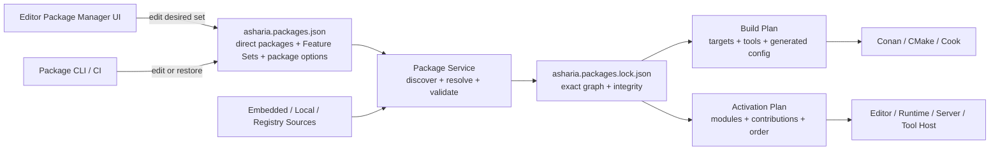
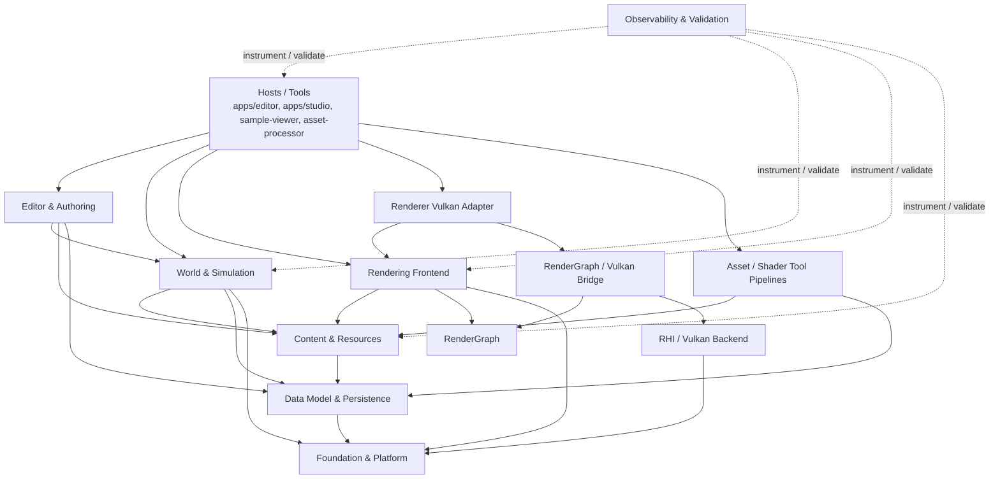
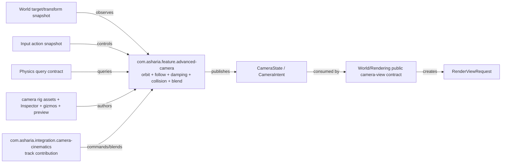
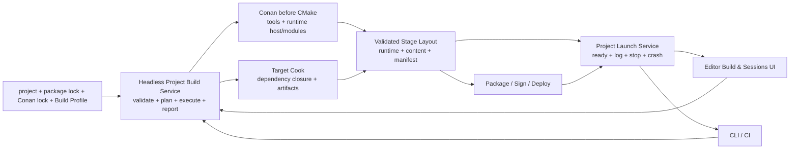
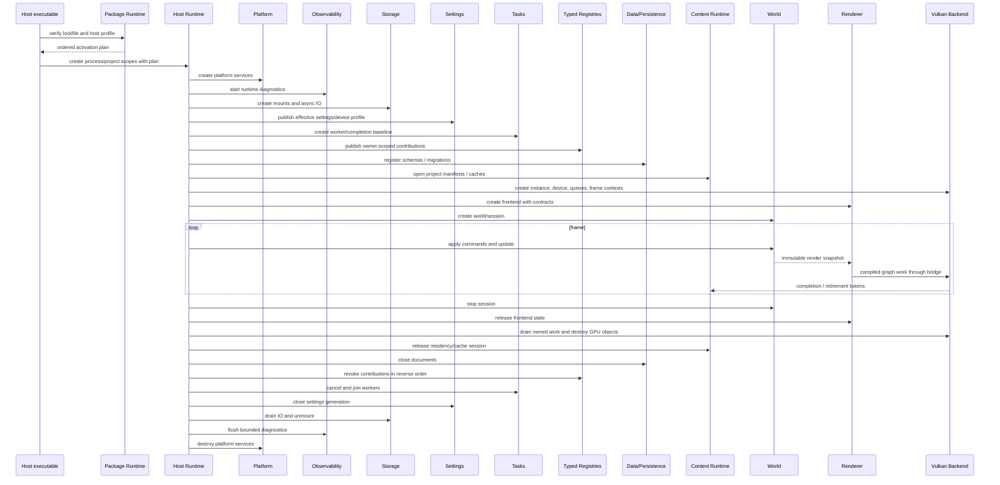

# Asharia Engine 系统架构 Roadmap

状态：提案，作为架构收敛与系统边界重构的主文档
更新日期：2026-07-13

## 1. 文档定位

本文回答的不是“下一个 PR 写什么”，而是以下长期问题：

- Asharia Engine 的最小 Kernel、默认系统包和可选系统包分别是什么；
- 每个系统拥有什么状态、生命周期和公共契约；
- 什么时候应该建立用户可导入的完整 System/Feature/Integration Package，什么时候只需要包内独立 CMake target/module；
- 当前 26 个物理 boundary manifests（其中 `packages/` 下 21 个）应怎样收敛，哪些边界绝不能因为合并目录而消失；
- 资源、世界、渲染、脚本、编辑器及后续系统如何只通过稳定数据契约协作；
- 编辑器包管理器如何选择系统，同时让 CLI、CI、runtime 和 dedicated server 可复现同一组合；
- 编辑器创建的项目如何用同一 package lock 与 Build Profile 完成 build、cook、stage、package、deploy 和 launch；
- 单线程基线如何演进到 worker、render thread 和 GPU timeline；
- 每次架构迁移应提供什么验证证据，才能进入下一阶段。

本文是**系统架构收敛路线图**。它与其他文档的分工如下：

| 文档 | 权威范围 |
| --- | --- |
| `docs/architecture/flow.md` | 当前代码真实依赖、启动顺序和帧数据流 |
| `docs/architecture/overview.md` | 已成立的模块边界、所有权与生命周期规则 |
| `docs/architecture/package-first.md` | 当前 package-first 与 CMake 约定 |
| `docs/architecture/foundation-framework.md` | 目标 Kernel、Host Runtime、Foundation Systems、scope、activation、扩展和基础门禁 |
| `docs/architecture/project-build-and-launch.md` | 项目产品构建、cook、stage、package、deploy、runtime bootstrap 与 launch session 目标设计 |
| 本文 | 目标系统框架、重构方向、迁移顺序和阶段门禁 |
| `docs/planning/next-development-plan.md` | 近期可交付功能的 Slice 顺序 |
| GitHub Issues / Project | 实际进度、负责人、阻塞关系与 Done evidence |

因此，本文不维护完成百分比，不代替 Issue，也不把提案描述成当前事实。架构变化落地后，必须同步更新 `flow.md` 和 `overview.md`；只有进入实施的工作才拆成 Epic / Slice。

## 2. 总体结论

Asharia 不应被定义成七个固定链接进所有进程的系统。目标执行栈收敛为四层，并由 Host Profiles 正交选择：

1. **Bootstrap Kernel**：启动 package 系统所必需、不可由 package manager 卸载的最小基础；
2. **Host Foundation**：作用域、激活/撤销、typed contributions、应用生命周期和 safe point；
3. **System Packages**：默认 Foundation Systems，以及数据、资源、世界、输入、脚本、渲染等领域系统；
4. **Feature / Integration / Content Packages**：建立在 System APIs 上的附加产品能力、跨系统桥接和内容库。

**Host Profiles** 不是第五套实现层，而是 Editor、Standard Runtime、Dedicated Server、Asset Processor 等进程对
完整 packages 的要求，以及对包内 modules/contributions 的激活过滤规则。基础框架详细边界见
`docs/architecture/foundation-framework.md`。

面向用户的理想工作流是：

> 在编辑器 Package Manager 中选择需要的 System、Feature、Integration、Content Package 或 Feature Set；Package Manager 更新 `asharia.packages.json` 和 `asharia.packages.lock.json`；构建系统与 Host 根据同一解析结果生成、编译并激活对应 targets/modules/contributions。

Package Manager 的直接导入单位必须是**完整 Installable Capability Package**，不是 target、contract、runtime、editor adapter、cook tool 或 backend provider 碎片。基础能力以完整 System Package 交付；轨道相机、对话、天气、行为树等附加能力以完整 Feature Package 交付；跨两个可选能力的桥接以 Integration Package 交付。每种可安装包都必须在自己声明的能力范围内一次交付所需 runtime、Editor authoring、import/cook、diagnostics 和当前 implementation modules。它们可以依赖其他完整包，但不能要求用户手工拼装内部实现才能工作。

`apps/*` 与 `tools/*` 是组合根，不拥有可复用引擎规则。编辑器 Package Manager 是 package control plane 的 UI，不是系统运行时 owner，也不是唯一事实来源。CLI、CI、cook 和 runtime 必须能在没有编辑器 UI 的情况下复现同一个 locked package graph。

“引擎自带”不等于“写死进 Kernel”：

- `bundled` / `built-in` 表示随引擎/编辑器发行，不需要下载；
- `project-embedded` 表示包内容位于项目内、由项目版本控制并可编辑；
- `required` 表示某个 Host Profile 不允许禁用；
- `default` 表示项目模板默认选择，但没有依赖时可以移除；
- `optional` 表示由用户显式安装或启用。

脚本、输入、物理、动画、音频等应当是 first-party bundled system packages；标准 Feature Set 可以默认启用它们，但 Kernel 不依赖具体脚本 VM、物理 backend 或音频 backend。

Asset / Shader Tool Pipelines 是 Content/Rendering 系统的**构建侧生产平面**。它们作为对应完整 System Package 的内部 tool/cook modules 共同交付，但只能被 Editor/Tool profile 激活，不得进入 shipping runtime 依赖闭包。

目标不是追求最少目录，也不是把所有功能放进一个“大引擎包”。正确的收敛单位是：

> **package 表达可理解、可分发、可独立演进的系统域；target 表达可编译、可链接、可测试的硬依赖边界。**

这意味着多个小 package 可以合并为一个系统 package，但原有必要边界必须继续由独立 target、PUBLIC/PRIVATE 依赖、公共 include 和架构测试保持；一个 package 也可以同时包含 runtime、editor、tool、content 等不同 host role 的 modules，由解析后的 Host Profile 选择。

## 3. 研究依据与适用结论

以下资料只用于校准边界，不作为照搬目标。

### 3.1 构建边界

CMake 官方将 buildsystem 组织为逻辑 target，并通过 `target_link_libraries()` 以及 `PUBLIC`、`PRIVATE`、`INTERFACE` usage requirements 传播或限制依赖。这说明物理目录不需要与最小编译边界一一对应；一个系统 package 可以包含多个职责明确的 target。
参考：<https://cmake.org/cmake/help/latest/manual/cmake-buildsystem.7.html>

Unreal Engine Modules 同样把 module 作为代码封装、编译单元、依赖声明和可选加载的边界。对 Asharia 的启示是：系统域可以聚合，但 runtime、editor、backend adapter、tooling 仍要保持独立编译边界。
参考：<https://dev.epicgames.com/documentation/en-us/unreal-engine/unreal-engine-modules>

### 3.2 资源与派生数据

Unity Asset Database、O3DE Asset Pipeline、Godot import process 和 Unreal Derived Data Cache 都把源文件、导入设置、依赖、派生制品和运行时消费区分开。共同结论是：运行时不应解析 source，也不应把 source path 当作稳定身份；派生数据应可丢弃、可重建、可校验。
参考：<https://docs.unity3d.com/cn/current/Manual/AssetDatabase.html>、<https://docs.o3de.org/docs/user-guide/assets/pipeline/>、<https://docs.godotengine.org/en/stable/tutorials/assets_pipeline/import_process.html>、<https://dev.epicgames.com/documentation/en-us/unreal-engine/using-derived-data-cache-in-unreal-engine>

对 Asharia 的直接结论是：

- `AssetId` 标识逻辑资产，`ArtifactKey` 标识确定性制品，`ResourceHandle` 标识一次运行中的资源槽；
- `asset-pipeline` 拥有 source 到 artifact 的变换；
- `resource-runtime` 只消费 manifest 和 artifact，不接触 importer、watcher 或源格式；
- GPU 对象是 artifact 的设备相关驻留，不是资产本体。

### 3.3 世界与渲染

O3DE Atom RPI 将平台无关渲染前端放在 RHI 之上，并围绕 Scene、View、Render Pipeline 组织多视图渲染。Unity SRP 也把高层渲染调度与低层图形实现分开。
参考：<https://www.docs.o3de.org/docs/atom-guide/dev-guide/rpi/rpi/>、<https://docs.unity3d.com/cn/current/Manual/scriptable-render-pipeline-introduction.html>

Unreal RDG 通过资源声明和 pass 参数推导生命周期、barrier、culling 与执行顺序。对 Asharia 的结论是：renderer 负责产生渲染意图，RenderGraph 负责编译图事实，RHI backend 负责翻译和执行设备事实。
参考：<https://dev.epicgames.com/documentation/en-us/unreal-engine/render-dependency-graph-in-unreal-engine>

### 3.4 并发与生命周期

Unreal 的并行渲染把 Game Thread、Render Thread 和 RHI Thread 的职责分开；Unity Jobs 使用显式依赖链约束并发；Vulkan 则要求应用自行遵守外部同步和对象生命周期规则。
参考：<https://dev.epicgames.com/documentation/unreal-engine/parallel-rendering-overview-for-unreal-engine>、<https://docs.unity3d.com/cn/2022.2/Manual/job-system-jobs.html>、<https://docs.vulkan.org/guide/latest/threading.html>、<https://registry.khronos.org/vulkan/specs/latest/html/vkspec.html#fundamentals-objectmodel-lifetime>

对 Asharia 的结论是：不能先增加线程再补所有权。应先建立 immutable snapshot、显式 command/event、generation handle、frame context 和 deferred destruction，之后才允许跨线程执行。

### 3.5 Package-managed 系统

Unity Package Manager 允许在 Editor 中查看、安装、更新或移除 project packages 和 feature sets；O3DE Gems 可以携带代码和资产，由 Project Manager 按项目启用、选择版本并在需要时重建；Unreal Plugin 可以同时包含 Runtime、Editor、Developer 等不同类型的 modules；Bevy 则用 `DefaultPlugins` 和 `MinimalPlugins` 表达不同默认能力组合。
参考：<https://docs.unity3d.com/Manual/upm-ui.html>、<https://www.docs.o3de.org/docs/user-guide/project-config/add-remove-gems/>、<https://dev.epicgames.com/documentation/en-us/unreal-engine/plugins-in-unreal-engine>、<https://bevy.org/learn/quick-start/getting-started/plugins/>

Unity 还明确区分随 Editor 发行的 built-in package 与位于项目 `Packages` 目录中的 embedded package；已安装 Feature Set 会持续要求其成员 package，成员不能在 Feature Set 仍存在时单独删除。Asharia 采用相同术语区分，并把一次性展开行为命名为 Project Template。
参考：<https://docs.unity3d.com/cn/2023.2/Manual/pack-build.html>、<https://docs.unity3d.com/cn/current/Manual/upm-ui-local.html>、<https://docs.unity3d.com/cn/current/Manual/upm-ui-remove.html>

对 Asharia 的直接结论是：

- package 是可发现、可解析、可构建、可激活的能力声明单元；
- Package Manager catalog 条目必须是完整 System/Feature/Integration/Content/Template 能力单元；内部 target/module/contribution 不作为独立安装条目；
- target 是编译/链接边界；module 是按 host role 和 loading phase 描述的逻辑 activation unit，两者不要求一一对应；
- Feature Set 是版本化 meta-package，Host Profile 是进程过滤/要求；二者都不复制系统实现；
- Editor Package Manager、CLI 和 CI 必须共享 resolver 与 lockfile；
- data-only package 可以即时生效，native code package 可以要求 regenerate/build/restart；
- package manager 只管理声明和生命周期，不成为全局 service locator。

### 3.6 项目产品构建与启动

Unreal Engine 把 Build、Cook、Stage、Package、Deploy、Run 建模为可组合阶段；Unity 让同一个 Build Profile 同时服务 Editor 与 headless CI，并返回结构化 Build Report；O3DE Project Export 则让 Project Manager 与 CLI 共享 launcher build、asset processing/bundling、release layout 和 archive 流程。CMake Workflow Presets 可以组合 native configure/build/test/package，但不覆盖 engine asset cook、runtime stage、device deploy 和 tracked launch session。

对 Asharia 的直接结论是：Editor 的 Build、Build & Run 和 Launch Profiles 必须是 headless product pipeline 的 UI；项目 package lock、第三方 `conan.lock`、Build Profile、cooked content 与 stage manifest 是不同 owner 的事实，不得塞进 Editor workspace 或由按钮临时推导。详细设计见 `docs/architecture/project-build-and-launch.md`。

参考：<https://dev.epicgames.com/documentation/en-us/unreal-engine/build-operations-cooking-packaging-deploying-and-running-projects-in-unreal-engine>、<https://docs.unity3d.com/current/Manual/build-command-line.html>、<https://docs.o3de.org/docs/user-guide/packaging/project-export/project-export-pc/>、<https://cmake.org/cmake/help/latest/manual/cmake-presets.7.html>

### 3.7 基础生命周期、配置与设备策略

Unreal Subsystems 以 Engine、Editor、GameInstance、World、LocalPlayer 等 owner scope 管理自动创建/销毁；Godot
把 `Main` 的 startup/shutdown/main loop、`Core` 的基础设施和 platform/server 层分开；O3DE Settings Registry
统一应用/工具配置、命令行和 Console；Unreal Device Profiles 与 Scalability 把 platform/device/user quality 分层。
Godot 和 Unity 的应用生命周期/low-memory 文档还说明移动或受限平台不能只依赖正常 shutdown。

对 Asharia 的直接结论是：Package Runtime 只产出 activation plan，独立 Host Runtime 负责 scope、factory、lease、
rollback 和 lifecycle；Storage、Settings、Tasks、Data、Observability 是完整默认 System Packages，而不是继续扩大
`engine/core`。参考：<https://dev.epicgames.com/documentation/unreal-engine/programming-subsystems-in-unreal-engine>、
<https://docs.godotengine.org/en/stable/engine_details/architecture/godot_architecture_diagram.html>、
<https://www.docs.o3de.org/docs/user-guide/settings/>、
<https://dev.epicgames.com/documentation/en-us/unreal-engine/scalability-and-device-profiles-in-lyra-sample-game-for-unreal-engine>、
<https://docs.godotengine.org/en/stable/tutorials/inputs/handling_quit_requests.html>

## 4. 当前基线与主要架构债务

### 4.1 已成立的正确边界

- `asharia::rhi_vulkan` 不依赖 RenderGraph；Vulkan/RG 翻译位于 `asharia::rhi_vulkan_rendergraph`。
- `asharia::renderer_basic` 是 backend-neutral target；Vulkan 录制位于 `asharia::renderer_basic_vulkan`。
- package 只通过其他 package 的 `include/` 消费公共 API。
- `asset-core`、`resource-runtime`、`scene-core`、`material-core` 已形成 CPU/headless 基线。
- `asset-pipeline` 与运行时资源开始分离 source/import 和 runtime state。
- RenderGraph 已表达抽象资源、pass、访问和 execution diagnostics。
- editor 已有独立 host 和初步 selection、dirty state、panel、viewport 工作流。

这些边界在任何目录合并中都必须保留。

### 4.2 当前问题

截至 2026-07-13，当前仓库有 26 个 `asharia.package.json`：`packages/` 下 21 个、`engine/` 下 2 个、
`apps/` 下 2 个、`tools/` 下 1 个。问题不是数量本身，而是三种粒度混在一起：

- 有的 source package 已接近领域核心模块，例如 `scene-core`、`resource-runtime`、`rendergraph`，但仍不是用户可安装的完整系统；
- 有的 package 是实现适配器，例如 `window-glfw`、`shader-material-adapter`；
- 有的 package 更接近单个库 target，例如 `schema`、`archive`、`cpp-binding`；
- 有的 host 直接聚合大量底层包，实际承担了尚未显式建模的系统装配职责。

由此产生的债务包括：

1. package 数量掩盖真实系统数量，阅读目录不能快速理解引擎；
2. package config 容易把一个可选 target 的依赖提升为整个 package 的无条件依赖；
3. 数据模型存在 `reflection` / `serialization` 与 schema-based 路线并行的长期风险；
4. 资源的 catalog、artifact、runtime residency、GPU owner 尚未形成单向闭环；
5. renderer、scene、editor 之间已有契约雏形，但仍可能由 host 进行临时拼接；
6. editor executable 承担过多领域规则，难以做 headless 测试；
7. 当前单线程基线尚未完全显式化 owner thread、snapshot 和销毁时序；
8. `asharia.package.json` 主要用于记录/审查，尚无 `asharia.packages.json`、package resolver/lockfile、Host Profile 和 Editor Package Manager 闭环；
9. scripting、input、tasks、physics、animation、audio 等已有部分设计依据或明确需求，但尚未统一进入 first-party system catalog 和同一 package activation 模型；
10. `engine/platform` 仍是空 `INTERFACE` target，应用 lifecycle、device/display/memory-pressure facts 没有 runtime owner；
11. 尚无复用的 Host scope、system factory、activation lease、typed contribution registry 和 failure rollback；
12. Runtime Storage、Settings/Device Profile、Tasks baseline、memory accounting 与 early/late diagnostics 尚未形成 Foundation Gate；
13. World 尚无 entity bounds、spatial identity、region query 和 immutable spatial snapshot；
14. project/package/schema 已计划版本化，但尚无 Editor-owned project upgrade preflight/copy/migrate/validate/commit 闭环；
15. `core::ErrorDomain` 枚举上层系统，新增第三方/first-party package 仍会反向要求修改 Kernel。

### 4.3 当前 package 的系统归属

该表用于保证每个现存 source package 都有迁移去向。当前物理 manifest 不自动成为未来 Package Manager 条目；多个 source packages 可以先由一个完整 System Package 发行根聚合，再按维护价值决定是否物理搬目录。任何发行合并都不会自动取消其中的 target 边界。

| 当前 package | 主要系统归属 | 当前角色 | 路线方向 |
| --- | --- | --- | --- |
| `engine/core` | Foundation | 通用基础类型与错误基线 | 保持稳定基础包 |
| `engine/platform` | Foundation & Platform | 平台抽象 | 与平台 adapters 形成清晰域 |
| `window-glfw` | Foundation & Platform | GLFW 窗口适配 | 并入 Desktop Platform Support System 的内部 target，不单独安装 |
| `profiling` | Observability | profiling contract / adapter | 依复用范围决定是否并入 observability 域 |
| `schema` | Data Model | schema 描述 | 候选并入 data-model |
| `archive` | Data Model | 归档格式与 IO 基线 | 候选并入 data-model |
| `cpp-binding` | Data Model | schema 到 C++ 绑定 | 候选并入 data-model 的工具 target |
| `persistence` | Data Model | 持久化协议 | 候选并入 data-model |
| `reflection` | Data Model | 旧反射路线 | 冻结、适配、迁移后删除或并入 legacy target |
| `serialization` | Data Model | 旧序列化路线 | 冻结、适配、迁移后删除或并入 legacy target |
| `asset-core` | Content | asset identity/catalog contracts | 与 resource-runtime 组成 content 域 |
| `resource-runtime` | Content | runtime handle/state baseline | 与 asset-core 形成统一 runtime contract |
| `project-core` | Content / Host Contract | project descriptor 与 IO | 切分 project contract 与 host convenience 后再定归属 |
| `asset-pipeline` | Content 构建侧 | import/cook/publication | 作为完整 Content System 的内部 tool/cook targets；与 runtime target 保持隔离 |
| `material-core` | Content / Rendering Contract | material runtime signature/key | 归入 Rendering (Vulkan) System；保持 runtime-safe，不引入编译器依赖 |
| `material-instance` | Content 构建侧 | material authoring/product | 归入 Rendering (Vulkan) System 的 authoring/product targets |
| `shader-authoring` | Content 构建侧 | shader authoring contract | 归入 Rendering (Vulkan) System 的 shader tool targets |
| `shader-slang` | Content 构建侧 / Rendering Adapter | Slang 编译与 shader support | 归入 Rendering (Vulkan) System；tool/runtime targets 分离 |
| `shader-material-adapter` | Content 构建侧 | reflection 到 material 的翻译 | 归入 Rendering (Vulkan) System 的内部 adapter target |
| `scene-core` | World & Simulation | scene/entity/transform baseline | 演进为 world package |
| `rendergraph` | Rendering & GPU | backend-neutral graph | 归入完整 Rendering (Vulkan) System 的独立硬 target，不单独安装 |
| `rhi-vulkan` | Rendering & GPU | Vulkan backend 与 RG bridge | 归入完整 Rendering (Vulkan) System；两个硬 targets 不合并 |
| `renderer-basic` | Rendering & GPU | renderer frontend 与 Vulkan adapter | 归入完整 Rendering (Vulkan) System；重命名并保留 target 分层 |

## 5. 架构词汇

后续文档和代码统一使用以下词义：

| 名称 | 定义 | 不是什么 |
| --- | --- | --- |
| Bootstrap Kernel | 解析并启动 locked package graph 所必需的不可卸载最小基础 | 完整引擎或默认功能全集 |
| Host Runtime | 复用的 scope、activation、lifecycle、safe point 和 typed registry 宿主；计划位于 `engine/host-runtime` | Package Manager、领域系统实现或全局 service locator |
| Foundation System Package | Standard Profiles 默认/要求的完整基础系统，例如 Storage、Settings、Tasks、Data、Observability | 不可卸载 Kernel 或只有 interface 的占位包 |
| Host Scope | Process/Project/Session/World/LocalUser/Editor/ToolJob 等真实 lifetime owner | 命名空间、线程名或任意 DI 容器标签 |
| Activation Lease | 追踪 system instance、contributions、jobs、subscriptions 和撤销/销毁责任的 owner handle | 只调用一次的 startup callback |
| System | 对一类长期状态和规则负最终所有权的业务域 | 目录名或 UI panel |
| Installable Capability Package | Package Manager 可直接安装、版本化、锁定和原子回滚的完整能力单元 | 任意 source package、target 或 module |
| System Package | Package Manager 可直接导入的完整系统发行单元；共同版本化 runtime、editor、tool/cook、diagnostics 和当前 implementation modules | 单个 target、adapter 或只有 contract 的占位包 |
| Feature Package | 建立在一个或多个 System APIs 上、完整解决一个附加产品能力的包，例如 Advanced Camera Rig | 新基础系统、只含示例脚本或裸 API wrapper |
| Integration Package | 在两个独立可选包之间提供版本化桥接 contribution 的完整包 | 任一侧系统的状态 owner，或用隐式检测替代 manifest dependency |
| Content Package | 主要交付可 cook 内容、样例、预设或库的包 | 拥有引擎系统生命周期的代码包 |
| Target | CMake 中可编译、可链接、可测试的硬依赖边界 | Package Manager catalog entry |
| Module | System Package 中面向 Runtime、Editor、Tool 或特定 platform 的逻辑 activation unit；可以静态链接、启动时注册、动态加载或由 managed host 加载 | System Package 的同义词、用户独立安装项，或天然可热卸载的动态库 |
| Contribution | package 向 host 声明的 importer、panel、command、system factory、schema 等扩展描述 | 任意时机执行的裸 callback |
| Feature Set | 持续存在于项目依赖图中的版本化 meta-package，例如 Standard 3D；其成员是间接依赖 | 一次性展开后消失的模板 |
| Project Template | 创建项目时一次性写入 direct dependencies、设置和样例内容的初始化方案 | 持续约束成员版本的 Feature Set |
| Host Profile | 某类进程允许和要求的 module/contribution 集合 | 用户机器上的临时 UI 状态 |
| Package Manifest | 每个 Installable Capability Package 的 `asharia.package.json`，描述 catalog type、完整能力 identity、内部 targets/modules/contributions 和 package dependencies | 每个 target 各自的安装清单 |
| Project Package Manifest | `asharia.packages.json`；团队提交的 direct installable packages、Feature Sets、version ranges 和 package options | 内部 module 选择表、`asharia.project.json` 的同义词或 Build Profile |
| Package Lockfile | `asharia.packages.lock.json`；团队提交的精确版本、来源、完整性和依赖图 | 可由 Editor 私有缓存替代的文件 |
| Bundled Package | 随引擎/编辑器发行、无需下载的 first-party package | 必须启用的 package |
| Project-embedded Package | 位于项目目录、由项目版本控制并可编辑的 package | 随引擎发行的 built-in package |
| Package Manager | 操作 manifest/lock、acquire、validate、build plan 和 activation plan 的 control plane | 系统状态 owner 或 service locator |
| Contract | 跨 target/system 传递的稳定数据或协议 | 共享可变对象指针 |
| Adapter | 把一个稳定 contract 翻译到平台、backend 或第三方 API | 新的业务所有者 |
| Host | 选择实现并构造系统生命周期的进程组合根 | 可复用领域逻辑所在处 |
| Snapshot | 某一版本只读、可跨阶段消费的数据视图 | 对 owner 内部容器的引用 |
| Command | 请求 owner 修改状态的显式意图 | 任意地方直接写入状态 |
| Event | owner 已完成状态变化后的事实通知 | 要求接收者立即回调修改 owner |

## 6. 目标系统框架

### 6.1 Package-managed 组合模型

下图是目标架构，不表示当前仓库已经实现 resolver、lockfile 或 activation registry。



规则：

- `asharia.packages.json` 和 `asharia.packages.lock.json` 是团队可提交的 package graph 事实；Editor UI 只是前端。
- resolver 必须是 headless library/CLI，不能依赖 ImGui、Avalonia、Vulkan 或 editor document state。
- build plan 决定编译哪些 targets；activation plan 决定某个 Host 注册哪些 modules/contributions。Module 可以是静态或动态实现，activation 不承诺 hot unload。
- native code package 的 add/remove/update 可以进入 `PendingBuild` / `PendingRestart`，不能伪装成安全热加载。
- 系统实例仍由对应 system owner 创建和销毁；Package Service 只提供 descriptor、factory reference 和有序 activation plan。
- 当前 Editor Profile 自身要求的 Package Runtime、Editor Domain 和 Package Manager UI 在界面中标记为 `Required by Profile`，不能由正在运行的 UI 卸载；引擎/编辑器发行版更新与项目 package 选择是不同工作流。

### 6.2 核心 package 依赖方向

下图只展示当前已经有实现基础的核心 package groups，不是完整 first-party 系统目录。未来系统必须沿同样的向下依赖和 adapter 规则接入。



约束：

- 实线只允许向下依赖；不得通过 callback、全局 service locator 或 include 私有头文件制造反向依赖。
- Observability 只能观测公共事件、计数器和诊断接口，不取得业务状态所有权。
- Hosts 可以装配多个系统，但 host 内的 glue 不能成为长期公共 API。
- Tool pipeline 可以依赖 content contracts；runtime content 不得反向依赖 tool pipeline。
- RenderGraph 抽象层不得出现 Vulkan 类型；基础 Vulkan backend 不得依赖 RenderGraph。

### 6.3 Bootstrap Kernel / Foundation & Platform

- **Kernel 拥有：** 错误类型、基础 ID/hash、assert/log bootstrap、最小 allocator contract、路径/文件/进程/dynamic-library primitives、单调时钟、线程原语和启动诊断。
- **`engine/package-runtime` 拥有：** package manifest 的窄格式模型与解析、resolver、lockfile、Host Profile 过滤和 activation plan；它是静态 bootstrap component，但不进入 `engine/core`。
- **不拥有：** asset identity、world state、logical input、job graph、script VM、render policy、editor command。
- **当前映射：** `core`、`platform`；`package-runtime` 尚未实现。
- **目标：** 保持不可卸载部分最小而稳定；GLFW、Vulkan、脚本 VM、物理/音频 backend 等都属于 bundled adapter/system packages。

`asharia.packages.json` / `asharia.packages.lock.json` 使用独立、窄且版本化的数据格式；resolver 不反向依赖由它负责解析的 Data Model package。通用 schema/persistence 系统启动后可以投影和检查 package metadata，但不能成为首次解析 lockfile 的前置条件。

Kernel 之上新增计划中的 `engine/host-runtime`，统一 Process/Project/Editor/ToolJob/GameSession/World/LocalUser scope、
ordered activation/deactivation、factory context、activation lease、typed contribution registry、application lifecycle 和
safe point。它只消费 `package-runtime` 生成的 plan，不解析版本，也不持有领域状态。完整设计与 Foundation Gates 见
`docs/architecture/foundation-framework.md`。

### 6.4 Data Model & Persistence

- **拥有：** schema 描述、稳定 type/field identity、版本迁移、archive、C++ binding、对象/文档持久化协议。
- **不拥有：** 资产导入、world runtime 行为、编辑器 UI、GPU state。
- **当前映射：** `schema`、`archive`、`cpp-binding`、`persistence`，以及待收敛的 `reflection`、`serialization`。
- **目标：** 建立唯一 canonical schema/persistence 路线；旧 reflection/serialization 只保留兼容适配和迁移入口，不再新增独立模型。

### 6.5 Content & Resources

- **拥有：** `AssetId`、sub-asset identity、artifact manifest、dependency graph、运行时资源槽、状态机、budget、resident object 和 reload publication。
- **不拥有：** source decoder、导入 UI、Vulkan image/buffer 实现细节、scene entity。
- **当前映射：** `asset-core`、`resource-runtime`、`project-core` 的部分 catalog/project contract、`material-core` 的运行时内容契约。
- **目标：** 形成 source-free runtime：`AssetId -> ArtifactKey -> ResourceHandle -> ResidentObject`；runtime 与 import/cook 使用独立 targets，但由一个完整 Content System Package 共同交付。

资源技术细节以 `packages/resource-runtime/README.md` 为专项设计依据。

### 6.6 构建侧：Asset / Shader Tool Pipelines

- **拥有：** source discovery、metadata、import settings、decoder/importer、dependency analysis、cook、artifact publication 和工具诊断。
- **不拥有：** runtime resource slot、GPU upload、renderer binding、editor document state。
- **当前映射：** `asset-pipeline`、`shader-authoring`、`shader-slang` 的工具侧能力、`shader-material-adapter`、`material-instance` 的 authoring/product 能力。
- **目标：** 所有 pipeline 输出可重复、可寻址、可验证；CLI、editor import UI 和 CI 都调用同一 headless pipeline API。这些 targets 属于 Content/Rendering System Packages 的工具侧 modules，不形成第二组用户安装项。

### 6.7 World & Simulation

- **拥有：** world/entity/component state、transform hierarchy、simulation clock、update phase、component mutation、world snapshot 和 render extraction。
- **不拥有：** asset source、GPU object、panel selection、Vulkan command buffer。
- **当前映射：** `scene-core`。
- **目标：** 从 scene data baseline 演进到 headless world runtime；每帧向 renderer 发布 immutable `RenderWorldSnapshot` / `DrawPacket`，不暴露 `World*`、`Entity*` 或可变 component pointer。

### 6.8 Rendering & GPU

该系统内部保留四层硬边界：

| 层 | 责任 | 禁止 |
| --- | --- | --- |
| Renderer Frontend | view request、visibility、draw packet 消费、material/lighting feature、render intent | Vulkan 类型和设备对象所有权 |
| RenderGraph | pass/resource 声明、依赖、lifetime、barrier 需求、culling、diagnostics | feature policy 和 Vulkan 调用 |
| RHI Contract | device-neutral command/resource capability contract（需要时引入） | scene/editor/asset source 语义 |
| Vulkan Backend | Vk/VMA 对象、queue、submission、descriptor、pipeline、swapchain、deferred destruction | 依赖 renderer/editor/world |

- **当前映射：** `renderer-basic`、`rendergraph`、`rhi-vulkan`。
- **目标：** 将这些 source packages 由一个完整 Rendering (Vulkan) System Package 统一发行；`renderer-basic` 演进为不带 MVP 含义的 frontend，Vulkan adapter 保持独立 target，RenderGraph/Vulkan bridge 继续与基础 backend 分离。用户只导入一次 Rendering System。

后续可编程渲染管线采用“pipeline source/product 描述 -> Renderer Frontend 记录 -> RenderGraph 编译 -> registered
executor/backend 执行”的分层。Editor、cook script 和受控 runtime script 可以组合已注册 pass types、选择 variant、
设置公开参数和 feature state；新增 pass 执行语义只能由完整 Rendering Feature/System Package 的受信 native module
注册。脚本 VM 不进入 graph execute 或 Vulkan command recording。完整权限矩阵、动态 generation 和当前 RG API
收敛方向见 `docs/rendergraph/programmable-pipeline.md`。

### 6.9 Editor & Authoring

- **拥有：** document session、selection、command、transaction、undo/redo、dirty state、validation presentation、workspace/panel 状态和 play-session orchestration。
- **不拥有：** world runtime 内部状态、resource residency、render graph 编译、native backend lifetime。
- **当前映射：** `apps/editor` 中的 domain/runtime/shell 雏形和 `apps/studio` 前端。
- **目标：** 从 executable 中提取可 headless 测试的 editor-domain target；UI 只发 command、消费 snapshot/event；native Studio bridge 使用版本化窄契约。

### 6.10 Observability & Validation

- **拥有：** structured diagnostics、trace/counter 协议、CPU/GPU profiling adapter、architecture tests、smoke orchestration 和 evidence schema。
- **不拥有：** 被观测系统的控制流或业务状态。
- **当前映射：** `profiling`、package-local tests、sample-viewer smoke、文档和编码检查。
- **目标：** 每个系统公开低耦合的诊断快照；架构约束能由 CI 自动检查，而不是只靠评审记忆。

### 6.11 First-party 系统包目录

该目录定义 Package Manager 面向用户展示的完整系统，不承诺这些系统当前已经实现。每一行是一个可直接导入、升级、移除和锁定版本的 System Package；表中的内部模块不单独显示为安装项。是否默认导入由 Feature Set 决定。

| 完整 System Package | 建议发行策略 | 包内必须共同交付的能力 | 关键边界 |
| --- | --- | --- | --- |
| Data Model & Persistence | bundled / required by standard profiles | schema、archive、migration、binding tools、schema diagnostics | UI adapter 是内部 module；核心不依赖 editor/rendering |
| Content & Resources | bundled / default | asset identity/catalog、import/cook/publication、runtime residency、asset browser/import diagnostics | source pipeline 与 runtime loader 为独立 targets，但只安装一个系统 |
| Runtime Storage & IO | bundled / default | mount/VFS、bundle/archive reader、async IO、priority/cancel、user/cache/log storage、IO diagnostics | bootstrap 只保留启动所需最小 filesystem；runtime 不读取 source assets |
| Settings & Console | bundled / default | typed layered settings、package/project/profile/platform/device/user/CLI merge、Device Profile、CVar/command、Editor UI、shipping policy | bootstrap config 保持窄格式；各系统消费 immutable projection，不共享 mutable bag |
| World & Simulation | bundled / default | world/entity/component/time、spatial bounds/query/snapshot、prefab/subscene/streaming、persistence adapter、render extraction、hierarchy/inspector/play support | renderer/physics/navigation 各自维护 acceleration projection，renderer 只消费 snapshot |
| Tasks & Jobs | bundled / default | job graph、worker scheduler、cancel/shutdown、timeline/profiler contribution | 不成为全局 service locator |
| Input | bundled / default | normalized device snapshot、action/context/rebinding、local user/device assignment、hotplug/haptics、input-map editor、diagnostics | gameplay 不消费 raw GLFW code；OS adapters 由 Platform Support contribution 提供 |
| Desktop Platform Support | bundled / desktop Feature Sets | application lifecycle、window/display/output facts、desktop raw input/clipboard/dialog/process contributions、GLFW implementation、platform diagnostics | Platform 只发布 facts/capabilities，不直接调用领域系统；GLFW/window adapter 不单独安装 |
| Scripting (.NET first implementation) | bundled / Standard default | contracts、runtime scheduler、`.NET` implementation、binding/build/reload、editor/import diagnostics | 是一个完整系统包；VM/Editor/import 仍是内部独立 modules |
| Rendering (Vulkan first implementation) | bundled / Standard 3D default | renderer frontend、programmable pipeline contracts/compiler、materials/shader products、RenderGraph、Vulkan RHI/bridge、shader/pipeline cook、pipeline authoring、render settings/debug tools | 一个安装项；data/script 组合已注册 pass，新增执行语义由受信 native module 提供 |
| Physics | bundled / Standard 3D default | contract、scene/query/step、当前 backend、cook、collider/constraint authoring、diagnostics | backend 类型不泄漏公共 contract |
| Animation | bundled / Standard 3D default | skeleton/clip/graph/pose runtime、import/cook、animation graph/timeline | 通过 resource/world contracts |
| Audio | bundled / Standard default | voice/mixer/spatial runtime、当前 device/codec adapters、import/preview/mixer tools | server Host 过滤 runtime backend，不拆成另一个安装包 |
| Navigation | bundled / optional Feature Set | nav mesh/volume runtime/query、bake/cook、agent authoring/debug | cook product 与 runtime query 为内部 targets；不拥有 behavior policy |
| AI & Behavior | first-party / optional | blackboard、behavior/state tree、perception/planner contracts、authoring/debug | 通过 World/Navigation public contracts；具体玩法 AI 可继续作为 Feature |
| Runtime UI | bundled / template-selected | document/layout/input/render bridge、text shaping/font/IME/accessibility、theme/content import、UI authoring | 不依赖 editor widget tree |
| Gameplay Framework | first-party / template-selected | application/game/session/player/camera-view/save conventions、stable tags、owner-scoped typed messages、project templates、inspectors、diagnostics | 不进入 Kernel或变成全局 EventBus；Abilities/Attributes/Effects 为可选 Feature |
| Networking | first-party / optional | replication contracts、当前 transport adapters、server/client diagnostics | transport 为内部 module，不写进 World core |
| Online Services | first-party / optional | identity、lobby/session、matchmaking、friends、achievements、cloud save/voice provider contracts | 与 transport/replication 分离；远程操作异步且 provider 可替换 |
| Localization | first-party / template-selected | locale/string table/formatting、import/cook、editor diagnostics | 文本资产与 UI renderer 分离 |
| Media / Cinematics | first-party / optional | playback/timeline runtime、当前 decoder adapters、import/cook、timeline authoring | decoder 是内部 module，不是用户拼装前置项 |
| XR Platform Support | first-party / optional | XR session/device/view/input contracts、当前 platform adapters、Editor/device diagnostics | 只有成为多种 XR features 的基础 owner 时才是 System；具体交互工具仍是 Features |
| Editor & Authoring | bundled / required by Editor profile | command/transaction/document/workspace、panels、Package Manager UI、project-open/safe-mode | runtime Host 不激活 Editor modules |
| Project Product Pipeline | bundled / required by Editor/Tool profiles | Build/Cook/Stage/Package/Deploy、runtime bootstrap、Launch Sessions、project upgrade、Build/Launch/Upgrade UI 与 CLI | build、launch、upgrade 是同一安装系统内的独立 targets/owners；upgrade 不进入 runtime |
| Observability | bundled / profile-selected | diagnostics、trace/counters、memory domain/budget/pressure aggregation、CPU/GPU adapters、profiler、crash report、automation/screenshot/performance evidence | 只观察公共契约，trim/release 仍由系统 owner 执行；Console/CVar 属于 Settings |

例如脚本系统是一个完整 System Package，但绝不是一个巨大 `scripting` target。其内部至少拆分：

- `scripting_contracts`：稳定 ID、execution context、facade、binding descriptor、diagnostics；
- `scripting_runtime`：safe point、scheduler、script component lifecycle；
- `scripting_dotnet`：当前具体 implementation adapter；未来 Lua 方案应形成另一个完整 Scripting System Package 或经 ADR 证明可作为同包可选 module，不能要求用户另装裸 provider；
- `scripting_editor`：script authoring、build/reload、Inspector contribution；
- `scripting_import`：隔离的 asset import rule context（需要时启用）。

`docs/systems/scripting.md` 和 `docs/architecture/managed-extension-model.md` 继续约束脚本 facade、transaction、safe point、managed runtime 与 editor plugin host 的分离。

### 6.12 Feature Packages 与扩展 API

Package Manager 不是 API provider。System Package 拥有并版本化 public contracts/extension points；Feature Package 链接这些公共 targets、保存自己的状态和算法，并通过 manifest contributions 注册到 Host；Package Manager 负责发现、解析版本、获取内容、更新 lockfile、生成 build/cook/activation plan 和执行原子回滚。

Unity 官方把 package 定义为可同时承载 Runtime/Editor tools、libraries、native plugins 和 assets 的自包含分发单元；Cinemachine 则作为可安装 package 交付目标跟随、构图、混合、轨道等相机能力，并允许扩展其 camera pipeline。这验证了“扩展包通过系统 API 工作，但不只是提供或调用几个 API”的模型。参考：<https://docs.unity3d.com/Manual/upm-ui.html>、<https://docs.unity3d.com/es/current/Manual/CustomPackages.html>、<https://docs.unity.cn/Packages/com.unity.cinemachine%403.0/manual/index.html>、<https://docs.unity.cn/Packages/com.unity.cinemachine%403.0/api/Unity.Cinemachine.CinemachineExtension.html>

| Catalog type | 完整性要求 | 示例 |
| --- | --- | --- |
| `system` | 拥有基础领域、public contracts、runtime owner、当前 implementation，以及适用的 Editor/cook/diagnostics modules | Rendering (Vulkan)、Physics、Input |
| `feature` | 完整交付自己的 runtime state/algorithm、schema/assets、Editor authoring、cook/diagnostics；只依赖系统 public APIs | Advanced Camera Rig、Dialogue、Weather、Behavior Tree、Terrain、Particles |
| `integration` | 显式依赖被桥接的两个包，交付窄 contribution 和兼容测试；不成为任一侧 owner | Camera Rig × Cinematics Timeline |
| `content` | 交付有稳定 ID、依赖、license 和 cook roots 的内容/预设/样例；不包含隐藏系统 owner | Camera presets、material library、sample content |
| `template` | 创建项目时一次性写入 package selections、设置和样例内容；展开后不持续约束 | Standard 3D Project Template |

System API 不只是函数集合，至少包括：

- 稳定 data contracts、IDs、handles 和 immutable snapshots；
- command/event 与 mutation safe points；
- component/system factory、timeline track、renderer feature、importer、panel、Inspector、gizmo 等 contribution registries；
- schema/persistence、asset import/cook 和 diagnostics contracts；
- module lifecycle、threading、failure 和 compatibility rules。

Editor、runtime 与脚本扩展必须按 Host role 分权，而不是按“是否来自 package”分权：

| 能力 | Editor / Tool | runtime | 外部脚本可扩展范围 |
| --- | --- | --- | --- |
| Host / package lifecycle | 提供 Package Manager UI、safe mode 和诊断 | 按 locked graph 创建/停止系统实例 | 只能贡献受控 activation hook；不能实现 resolver、owner lifetime 或失败回滚 |
| Runtime IO / VFS | author source roots、bundle/patch preview、IO diagnostics | 挂载 cooked bundles，执行 async/streaming IO | 通过 sandboxed file/content facade；不能替换 bootstrap filesystem 或持有 OS handle |
| Settings / Console | settings document、Inspector、transaction 和 profile authoring | 合并 cooked defaults/project/platform/user/CLI 并执行 shipping policy | 只读写公开 typed keys、注册受 capability 限制的 command；不能访问任意内存 |
| World / Prefab | source document、override、subscene、undo/redo、play orchestration | 拥有 entity/component、streaming 和 simulation state | Editor 走 transaction；runtime 走 scheduled mutation，不持有裸 component pointer |
| Content / Import | source metadata、import UI、cook 和 dependency diagnostics | 只按 `AssetId` 加载 product、管理 residency | import script 可生成 settings/product/dependency；runtime script 只用 handle/facade |
| Programmable Rendering | pipeline graph、shader/material authoring、cook、preview、Frame Debug | pipeline instance、RG compile/execute、executor/backend ownership | 可组合 registered pass、生成 definition、改公开参数；不能注册 GPU executor 或进入 command recording |
| Gameplay / Camera / UI | authoring、preview、测试和诊断 | 游戏/session/player/view/UI state owner | 可实现 gameplay、camera rig、UI behavior；只通过系统 public contracts |
| Automation / Observability | test authoring、session/screenshot/profiler UI | 发出 structured diagnostics、capture、crash evidence | 可注册测试、lint、分析和报告器；不能取得被观测系统控制权 |

外部脚本来自锁定 package 也不会自动获得 native/GPU 权限。Script Context、Host role、package trust、capability grant
和 safe point 共同决定它能调用的 facade；需要新增底层执行语义时，必须升级为交付 runtime/editor/cook/diagnostics
闭环的原生 Feature/System Package。

System 与 Feature 的判定不看代码量：System 拥有基础领域的长期 owner、public contract 和供多个独立能力复用的 extension surface；Feature 消费这些 contracts，完整拥有一个可选产品能力。Feature 可以公开自己的二次扩展 API，但只有当多个独立 packages 必须依赖它作为基础设施、其生命周期不再只是可选产品功能时，才通过 ADR 评估升级为 System。

以拟议 `com.asharia.feature.advanced-camera` 为例：



该 Feature Package 可以拥有 orbit/follow/blend 算法、rig components、serialized profiles、Editor UI、gizmos、preview 和 diagnostics；它不能持有 Renderer/Vulkan 私有对象，也不能绕过 World mutation、Physics query 或 RenderView contracts。Timeline 是可选系统时，桥接使用显式 Integration Package 或 manifest-declared conditional module，不能靠未锁定的运行时探测偷偷改变行为。

### 6.13 Feature Sets、Project Templates 与 Host Profiles

| 名称 | 类型 | 用途 | 典型 package 集合 |
| --- | --- | --- | --- |
| `Asharia.Minimal` | Host Profile | 单元测试、headless tools、定制 Host | Kernel + 已导入 System Packages 的 contract modules；不隐式带 rendering/editor |
| `com.asharia.features.standard3d` | versioned Feature Set | 常规 3D runtime 的完整系统组合 | Data、Runtime Storage & IO、Settings & Console、Content、World、Tasks、Input、Desktop Platform Support、Scripting (.NET)、Rendering (Vulkan)、Physics、Animation、Audio、Observability System Packages |
| `com.asharia.features.editor-authoring` | versioned Feature Set | 完整编辑能力 | Standard3D + Editor & Authoring + Project Product Pipeline System Packages；工具 modules 已随所属系统交付 |
| `com.asharia.features.dedicated-server` | versioned Feature Set | 无窗口服务器 | Data、Runtime Storage & IO、Settings & Console、Content、World、Tasks、Scripting、Physics、Networking、Observability；Host 过滤 rendering/audio/editor modules |
| `Asharia.AssetWorker` | Host Profile | 导入/cook worker | 激活已导入 Data、Content、Rendering 等系统的 tool/cook modules；排除 world/frame runtime modules |

Feature Set 是持续存在于 `asharia.packages.json` 中的 meta-package。其成员是间接依赖，并在 UI 中显示 `Required by Feature Set`；移除成员前必须先移除依赖它的 Feature Set。项目可以在兼容范围内覆盖成员版本，lockfile 同时记录 Feature Set 和展开后的完整依赖图。

Project Template 是另一种概念：它在创建项目时一次性写入 direct dependencies、Feature Sets、项目设置和样例内容，之后不持续约束成员关系。如果用户希望完全自由地增删 Standard3D 成员，应使用 `Standard3D Project Template` 展开为 direct dependencies，而不是继续保留 `com.asharia.features.standard3d`。

## 7. 跨系统契约

系统之间只允许传递以下几类信息：

| 契约 | 生产者 | 消费者 | 核心性质 |
| --- | --- | --- | --- |
| locked package graph / activation plan | Package Runtime | Build、Host | exact version/source/integrity、host-filtered、有序 |
| Host scope / activation lease | Host Runtime | system factories、diagnostics | owner-scoped、dependencies-first start、reverse stop、可撤销、generation-safe |
| application lifecycle snapshot/event | Platform -> Host Runtime | Storage、Content、World、Audio、Renderer、Scripts | ordered facts、safe-point delivery、bounded suspend work |
| effective settings / device profile snapshot | Settings & Console | 各系统、Editor preview、Build | immutable、layered、typed、带 hot/restart/shipping policy |
| IO request/completion token | Runtime Storage & IO | Content、Audio、Media、Tools | mount-relative、async、priority/cancel、无 OS handle 泄漏 |
| memory budget/pressure snapshot | Platform/各系统/Observability | Host、Editor、system owners | per-domain、只读聚合、trim 由 owner 执行 |
| `BuildPlan` / `BuildReceipt` / `StageReceipt` | Project Build | Editor、CLI、CI、Project Launch | profile-bound、fingerprinted、结构化 diagnostics、不可伪造成功 |
| `LaunchPlan` / `SessionSnapshot` | Project Launch | Editor、CLI、CI | 独立进程/设备身份、ready/exit/crash/stop 状态 |
| `ProjectUpgradePlan` / `UpgradeReport` | Project Product/Editor Tooling | Editor、CLI、CI | preflight、copy/backup、ordered migration、validate、atomic commit |
| `SchemaDescriptor` / migration plan | Data Model | Content、World、Editor、Tools | 版本化、确定性、无 UI/GPU 类型 |
| `ArtifactManifest` | Tool Pipeline | Content Runtime | 不可变、带 schema/version/hash/dependency |
| `ResourceHandle<T>` / `ResourceSnapshot` | Content Runtime | World、Renderer、Editor | generation-safe、source-path-free、可表达 pending/ready/failed |
| `WorldCommand` / `WorldEvent` | Host/Editor 与 World | World 与观察者 | 单 owner 修改、事实事件、可记录 |
| spatial bounds/query/snapshot | World | Renderer、Audio、Navigation、AI、Editor、Scripts | generation-safe、immutable projection；不共享内部 octree/broadphase |
| `InputSnapshot` / `InputAction` | Input package | World、Scripts、Editor tools | immutable device state、logical mapping、context-aware |
| `ScriptExecutionContext` / binding descriptors | Scripting | Implementation、World、Editor、Import tools | safe point、capability、implementation-neutral |
| job descriptor / dependency token | Tasks & Jobs | CPU systems | explicit input/output、cancel、no hidden ownership |
| `RenderWorldSnapshot` / `DrawPacket` | World | Renderer | immutable、紧凑、无 world/editor pointer |
| `RenderViewRequest` | Host/Editor | Renderer | view identity、camera、target、feature set |
| `RenderPipelineProduct` / pipeline generation | Rendering cook/runtime | Renderer Frontend、Build、Editor preview | cooked、versioned、pass type/schema IDs、variants、无 script closure/backend handle |
| render feature/pass contribution | Rendering Feature Package | Renderer registry、pipeline compiler | owner-scoped registration、stable type ID、typed slots/params、可撤销 |
| RG declaration / compiled plan | Renderer / RenderGraph | RenderGraph / backend bridge | 抽象资源和访问，不暴露 Vk 类型 |
| RHI work / completion token | RenderGraph bridge | Vulkan backend / resource owner | 显式 queue/timeline/lifetime |
| Editor command / document event | UI / Editor Domain | Editor Domain / UI | 可撤销、可验证、无 widget pointer |
| Diagnostic record / counter snapshot | 所有系统 | Observability、Editor、tests | structured、稳定 code、保留上下文 |

所有公共契约遵守以下规则：

1. 跨系统 ID 必须稳定且可比较，进程内地址不得成为身份；
2. snapshot 只读，并携带 revision/generation；
3. command 可失败，返回项目错误类型并保留上下文；
4. event 表达已经发生的事实，不承担同步 RPC；
5. manifest/blob 有 magic、schema version、producer version、payload hash 和 size validation；
6. handle 不保证对象永远存在，消费端必须处理 pending、failed、stale 和 evicted；
7. ABI 边界不得传递 STL 容器、异常、allocator ownership 或 Vulkan handle。

## 8. Package 与 Target 收敛策略

### 8.1 何时建立独立 package

只有当候选能力能作为一个**完整 System、Feature、Integration、Content 或 Template 单元**被用户理解、导入、升级、移除和验证时，才建立独立的 Package Manager 条目。代码型 System/Feature/Integration Package 至少应满足：

- 有清晰 catalog type、能力身份、状态 owner（Integration 除外）和面向项目的完整用途；
- 一次导入即可获得该能力声明适用的 runtime、Editor authoring、import/cook、diagnostics 与当前 implementation；
- 依赖其他能力时只依赖对方的完整 installable package，不要求用户手工选择内部 target/provider；
- 版本、兼容、迁移、移除影响和失败恢复能在 package 能力范围内说明；
- 至少有 headless contract tests 与一个能力级端到端 smoke。

不同依赖包络、owner thread、backend、平台代码、编译器工具、UI adapter 或独立测试价值，只能证明需要拆 **target/module**，不能单独证明需要新增可安装 package。`contract`、`runtime`、`editor`、`cook`、`vulkan bridge`、`.NET provider` 等实现片段默认属于其完整 System/Feature/Integration Package。

Feature Package 不需要拥有新的基础系统，只需完整拥有自己的附加能力。例如轨道相机依赖 World/Input/Rendering public APIs，却拥有自己的 camera rig state、算法、资产和 authoring workflow。反过来，只有几项 helper functions、一个裸 adapter target 或没有 runtime/authoring 闭环的 API wrapper 仍不应成为可安装条目。

### 8.2 Package contract 与 control plane

每个 Installable Capability Package manifest 最终至少需要表达：

| 类别 | 最低字段 |
| --- | --- |
| Identity | stable package id、display name、semantic version、manifest schema version、catalog type=`system/feature/integration/content/template` |
| Completeness | 按 catalog type 声明适用 roles 与 root modules/content roots：runtime、editor/authoring、tool/cook、diagnostics、current implementation；不适用项显式标记 |
| Compatibility | engine API range、platform/configuration/host role constraints |
| Resolution | 其他完整 installable packages 的 named required/optional dependencies、conflicts；capability metadata 仅预留 |
| Acquisition | bundled/project-embedded/local/registry source、content hash、signature/trust metadata |
| Build | CMake targets、tool invocations、generated config、requiresBuild/restart |
| Activation | logical modules、host role、loading phase、system factories、ordered dependencies、link/load mode |
| Contributions | schemas、importers、editor panels/commands、asset types、templates、content roots |
| Shipping | runtime/editor/tool/content classification、cook inclusion policy |
| Validation | package-local tests、smokes、license/security metadata |

项目配置明确分成五份事实：

- `asharia.project.json`：由 `project-core` 拥有，保存项目身份、资产源和缓存等项目领域配置；
- `asharia.packages.json`：由 `package-runtime` 拥有，保存 direct System/Feature/Integration/Content Packages、version ranges、Feature Sets 和 package-level options；不得列出内部 target/module/provider；Host/target 选择由调用 resolver 的 Build/Launch Profile 提供；
- `asharia.packages.lock.json`：由 resolver 生成并由团队提交，保存 exact versions、source、integrity、完整 resolved graph 和 resolver version；
- `conan.lock`：继续保存第三方 C/C++ dependency graph。
- `asharia.build.json`：由 Project Product Pipeline System Package 内的 `project_build` target 拥有，保存可提交的 Build Profiles 与共享 Launch Profiles；不复制 package graph，也不保存 secret 或 machine-local path。

`asharia.packages.json` 与 `asharia.packages.lock.json` 使用 package-runtime 自己拥有的窄 schema，不依赖 `project-core` 或可选 Data Model/Persistence package；否则解析这些 package 之前就必须先加载它们，形成 bootstrap cycle。

Package Manager 必须提供同一套 headless API 给 Editor、CLI 和 CI：`discover -> solve -> plan -> apply -> verify`。`apply` 只能修改 `asharia.packages.json` / `asharia.packages.lock.json`、acquire cache 和生成配置；真实系统实例由 Host 在启动/安全点按 activation plan 创建。

导入事务以 Installable Capability Package 为原子单位：acquire、integrity、license、build requirement、lock update 和 rollback 要么覆盖整个能力，要么保持旧版本。Host role filtering 发生在 build/activation plan，不得通过“只下载 runtime、不下载 editor/cook”制造项目间不可复现的部分安装。未来若为了发行体积支持按 artifact 分块下载，也必须由同一 package manifest/lock 统一描述，语义上仍是一个已安装能力。

resolver v0 只解析具名完整 package dependencies。Feature Set 可以选择 `com.asharia.system.rendering-vulkan`、`com.asharia.system.scripting-dotnet` 和 `com.asharia.feature.advanced-camera` 等完整能力；包内部再声明 frontend/contracts、backend/provider、Editor、cook 和 contribution modules。Host 不使用 service locator 临时猜测实现，也不要求项目直接依赖 `rhi-vulkan`、`scripting-provider-dotnet` 或 `camera-editor` 片段。

manifest 可以预留 `capabilities` / `provides` metadata 供搜索和诊断，但 v0 不用它满足依赖。只有出现第二个真实可用实现、具名替换已经造成实际维护问题，并完成 provider-resolution ADR 与冲突测试后，才引入 `requires capability` 和 exclusive provider 求解。

Asharia Package Manager 不替代 Conan：前者解析完整 System/Feature/Integration/Content/Template Packages；`conan.lock` 继续锁定 GLFW、Vulkan-Headers、VMA 等第三方 C/C++ dependencies。Build Plan 负责把两张已锁定的图接入 Conan-before-CMake workflow，并验证 package 的第三方要求没有脱离 `conan.lock`。

明确拒绝以下替代方案：

- 只把启用列表存在 Editor 用户配置中：无法由 CI、server 和其他开发者复现；
- 让 Asharia Package Manager 替代 Conan：混淆引擎能力组合与第三方 C/C++ dependency resolution；
- 每个 CMake target 都显示成可安装 package：把实现边界泄漏成用户概念，重新制造碎片；
- 把 contract、runtime、Editor tools、cook pipeline 或 backend/provider 分成多个用户必须手工导入的 package：系统处于半安装状态，版本和移除语义也会失去唯一 owner；
- 承诺所有 native package 即时热安装/热卸载：会掩盖 ABI、线程、对象生命周期和重建要求；
- 让 Package Manager 返回全局 service pointers：会把显式依赖图重新变成隐藏 service locator。

安装状态至少区分：`Available`、`Selected`、`Resolving`、`Acquiring`、`PendingBuild`、`PendingRestart`、`Active`、`Failed`。删除或降级 package 时必须先做 dependency impact 预览，不允许静默破坏项目。

### 8.3 目标物理布局

下表是收敛方向，不表示应一次移动全部目录。最终名称需在迁移 Slice 的 ADR 中确认。

目标 `packages/` 第一层只表达安装语义：`systems/`、`features/`、`integrations/`、`asset-packs/`、`templates/`。
完整系统位于 `packages/systems/<system>/`；RenderGraph、RHI、backend、Editor adapter、cook tool 等是系统内部
modules/targets，不再与完整系统共享同一级目录语义。源码大小、重要性或默认启用状态都不是进入 `engine/` 的理由；
只有解析 package graph 和激活系统之前不可缺少的 bootstrap component 才属于 `engine/`。

| 目标 package 域 | 建议 targets | 当前来源 | 方向 |
| --- | --- | --- | --- |
| `engine/core` | `core`、轻量 diagnostics contracts | `core` | 保持 |
| `engine/platform` | `platform`、dynamic library/process/filesystem primitives | `platform` | 保持 Kernel 级最小能力 |
| `engine/package-runtime` | manifest model、resolver、lockfile、activation plan | 新增 | Kernel bootstrap；headless、无 Editor/UI 依赖 |
| `engine/host-runtime` | Host roles/scopes、system factory context、activation lease、typed registries、lifecycle/safe points | 新增 | 不解析 package graph、不实现领域系统、不提供 service locator |
| `packages/systems/runtime-storage` | VFS/mount、bundle/archive reader、async IO、user/cache/log storage、diagnostics | 新增；`core` 只保留 bootstrap file primitives | 完整默认 Foundation System |
| `packages/systems/settings` | typed settings/CVar/command、Device Profile、runtime snapshot、Editor authoring | 新增 | 完整默认 Foundation System；bootstrap config 保持窄格式 |
| `packages/systems/desktop-platform` | `window_contract`、`window_glfw`、desktop input/clipboard/dialog adapters、editor diagnostics | `window-glfw` 与分散 platform adapters | 完整 Desktop Platform Support System；GLFW 不单独显示为安装项 |
| `packages/systems/data-model` | `schema`、`archive`、`cpp_binding`、`persistence`、legacy adapters | `schema`、`archive`、`cpp-binding`、`persistence`、`reflection`、`serialization` | 优先合并候选 |
| `packages/systems/content` | `asset_contract`、`artifact_contract`、`resource_runtime`、`resource_io`、`pipeline_contract`、`importers`、`cook`、`publication`、`content_editor` | `asset-core`、`resource-runtime`、`project-core` 的部分能力、`asset-pipeline` | 一个完整 Content System；source/runtime targets 继续硬隔离 |
| `packages/systems/world` | `world_core`、spatial bounds/query/snapshot、`world_persistence_adapter`、`render_extraction` | `scene-core` | 从 scene baseline 演进；不共享 renderer/physics 内部 acceleration structure |
| `packages/systems/tasks` | `job_contract`、worker scheduler、completion/cancel/shutdown、profiling adapter | 新增 | F3/Phase 1.5 先做 baseline；Phase 9 再做高级并发 |
| `packages/systems/input` | `input_contract`、normalized snapshot/action/context/rebinding、`input_editor` | 新增 | bundled/default；OS adapter 由完整 Platform Support System contribution 提供 |
| `packages/systems/scripting-dotnet` | contracts、runtime scheduler、`.NET` implementation、binding/build/reload、editor/import adapters | 新增；设计见现有 scripting docs | 一个完整 Scripting System；内部 modules 不单独安装 |
| `packages/systems/physics` | contract、runtime、backend adapter、editor tools | 新增 | Standard3D default；backend 可替换 |
| `packages/systems/animation` | skeleton/clip/graph runtime、editor tools | 新增 | Standard3D default |
| `packages/systems/audio` | contract、mixer/runtime、backend/editor tools | 新增 | Standard default；server 可排除 |
| `packages/systems/navigation` | runtime query、cook/bake、editor debug | 新增 | optional feature set |
| `packages/systems/runtime-ui` | runtime document/layout/render bridge、editor authoring | 新增 | template-selected |
| `packages/systems/networking` | replication contracts、transport adapters、diagnostics | 新增 | server/multiplayer feature set |
| `packages/systems/rendering-vulkan` | material contract/authoring/artifact、shader authoring/Slang/cook、renderer frontend、RenderGraph、`rhi_vulkan`、`rhi_vulkan_rendergraph`、renderer Vulkan、render editor tools | `material-*`、`shader-*`、`rendergraph`、`rhi-vulkan`、`renderer-basic` | 一个完整 Rendering System；所有现有硬 target 和禁止反向依赖规则继续保留 |
| `packages/systems/editor` | `editor_domain`、`editor_runtime`、`editor_imgui_adapter`、`studio_bridge`、`package_manager_ui` | `apps/editor`、`apps/studio` 的可复用规则 | 从 host 提取；UI 依赖 headless package-runtime |
| `packages/systems/project-product` | build/launch profile、plan/report/fingerprint、stage/package/deploy、session/process/device、ready/log/crash、editor contributions | 新增；设计见 `project-build-and-launch.md` | 一个完整 Project Product Pipeline System；build/launch owners 仍是独立 targets |
| `packages/systems/observability` | `profiling_contract`、backend adapters、test support | `profiling` 与分散测试支持 | 依实际复用决定是否建物理包 |

### 8.4 明确不得合并的语义边界

即使未来位于同一个父目录，以下能力不得变成同一个 target：

- asset source/import pipeline 与 runtime resource loading；
- schema/persistence 核心与 editor UI；
- world mutable state 与 immutable render extraction；
- renderer frontend 与 Vulkan command recording；
- RenderGraph abstract core 与 Vulkan translation；
- `rhi_vulkan` 与 `rhi_vulkan_rendergraph`；
- material runtime contract 与 Slang compiler/toolchain；
- editor domain 与 ImGui/Avalonia/Studio adapter；
- package resolver/lockfile core 与 Editor Package Manager UI；
- project build/cook/stage orchestration 与 Editor Build UI；
- project launch/session owner 与 build executor 或 Play In Editor world；
- scripting contracts/runtime scheduler 与具体 VM implementation；
- physics/audio/network contract 与第三方 backend adapter；
- engine library 与 `apps/*`、`tools/*` 组合根。

### 8.5 合并的完成标准

一次 package 合并只有同时满足以下条件才算完成：

- 公共 include namespace 和 target alias 已定义；
- target 依赖图没有新增反向边；
- package config 不会无条件拉入可选 compiler/backend/editor 依赖；
- standalone build 和 CPU-only test 仍成立；
- 原路径有明确迁移期或一次性迁移说明，不长期保留双入口；
- `flow.md`、`overview.md`、package README 和 root CMake 同步；
- 没有 include 其他 package 的 `src/`；
- 旧 package 删除后，消费者只依赖新公共 target，而不是 host glue。

## 9. 项目 Build、Cook、Package 与 Launch

Editor 创建的项目必须能在没有 Editor UI 的机器上被恢复、构建和启动。目标 control plane 是：

Package Manager 只导入一个完整 `Project Product Pipeline` System Package。下图中的 Project Build、Project Launch、Editor UI 和 CLI 是该系统包的内部 targets/modules 与组合根，不是四个需要用户分别安装的 packages。



必须固定以下边界：

- `asharia.build.json` 保存可提交的 Build/Launch Profiles；个人输出路径、设备、调试器和敏感值位于 ignored local override 或外部 credential store；
- Project Manager/CLI 应以明确 `--project` 参数启动 Editor；当前环境变量入口只视为过渡实现。Editor 先验证 project/package lock 与 Editor Host Profile，再激活 contributions；损坏 package 可用最小 safe mode 修复；
- package resolver 决定精确 system/module graph，Conan 锁定第三方依赖，Project Build 只消费二者，不建立第二张依赖图；
- v0 根据 lock graph 与 Host Profile 生成薄 composition root，使项目得到精确 native link/activation closure；
- Build 产生 executable/library/tool，Cook 产生 target runtime products，Stage 把两者组成可直接运行且可验证的相对目录树，Package 从 validated stage 生成发行物；
- shipping runtime 只读取 `asharia.stage.json`、runtime config、module registry 和 cooked catalog，不读取 source project 或 Editor cache；
- Play In Editor 是 Editor 内隔离 world session；Build & Run 默认创建独立 Standalone process，走产品 runtime bootstrap；
- Project Launch 为每次运行创建稳定 SessionId，跟踪 process/device、ready handshake、log、exit、crash、graceful/forced stop；它消费 stage/deploy receipt，但不拥有 build executor 或 gameplay state；
- Build、Cook、Stage、Package、Deploy 与 Launch 共享 headless API、结构化 progress/diagnostics/report；Editor panel 关闭不得改变任务事实；
- signing/notarization secret 不进入项目、profile、stage manifest 或日志；Stage 校验必须阻止 Editor/source-only 内容、绝对开发路径和未声明 runtime library 进入 shipping product。

建议的生成层级是 `build/cook/<profile>`、`build/stage/<profile>`、`build/dist/<profile>` 与 `build/sessions/<session-id>`；最终路径在实现 ADR 中冻结。完整 profile model、DAG、runtime bootstrap、session state machine、验证矩阵和分阶段 vertical slice 见 `docs/architecture/project-build-and-launch.md`。

## 10. 生命周期与线程模型

### 10.1 目标生命周期



销毁顺序必须与创建顺序相反，并以**对象所有者**而不是“谁最后用了它”决定销毁职责。Package Runtime 只排序和登记 activation，不代替 Data、World、Renderer 等系统拥有实例。`vkDeviceWaitIdle` 只允许出现在关闭、明确注释的早期 MVP 简化路径或 debug probe；正常帧循环使用 fence/timeline 和 deferred destruction。

具体 scope tree、activation lease、rollback、application lifecycle 和 Foundation System DoD 见
`docs/architecture/foundation-framework.md`。

### 10.2 分阶段线程模型

| 阶段 | Owner 与执行模型 | 进入条件 |
| --- | --- | --- |
| T0 单线程事实基线 | host thread 驱动所有系统；GPU 异步 | 所有 owner、lifetime、错误路径可验证 |
| T1 Worker jobs | import、hash、decode、snapshot build 等纯 CPU 工作进入 job graph | 无共享可变全局状态；job 输入输出显式 |
| T2 Render preparation | world 发布 snapshot；renderer 在独立阶段构建 draw/graph data | renderer 不访问 mutable world/editor state |
| T3 Render thread | render thread 消费 frame packet 并录制/提交 | frame context、queue ownership、shutdown join、back-pressure 完整 |
| T4 Parallel recording | 独立 pass/batch 并行录制 secondary/primary work | profile 证明收益；descriptor/command pool 按线程分离 |

线程化不是独立目标。没有 profiling 证据、稳定契约和明确 owner 时，不进入下一阶段。

## 11. 系统架构 Roadmap

### Phase 0：架构事实与术语冻结

**目标：** 让所有重构建立在同一张 current/target 图和同一套 package 词汇上。

工作：

- 接受或修订 `Bootstrap Kernel -> System Packages -> Feature/Integration/Content Packages -> Host Profiles` 框架；
- 为现有 package 和 target 建立 machine-readable inventory；
- 标注每个 target 的 system、module role、public consumers、optional dependency 和 owner；
- 建立 first-party system catalog，区分 current、planned、bundled、project-embedded、required、default、optional；
- 区分“当前事实”“已接受决策”“候选方向”；
- 为后续重大边界建立 ADR 模板。

门禁：

- root CMake 实际 target 与 `flow.md` 一致；
- 每个现存 target 只能有一个主要系统归属；
- package/target/system 术语在架构文档中不再混用；
- 不改运行时行为。

### Phase 1：Package Control Plane 与依赖边界硬化

**目标：** 先让项目 package graph 可解析、可锁定、可重现，并使错误依赖可被机器拒绝。

工作：

- 冻结 Installable Capability Package manifest vNext 的 identity、catalog type、completeness roles、package dependencies、internal modules/contributions 和 shipping 字段；
- 定义 `asharia.packages.json` 与 committed `asharia.packages.lock.json`；
- 实现 headless `discover -> solve -> plan -> verify` library/CLI，第一阶段只支持 bundled/project-embedded/local sources；
- 输出 CMake build plan 和 per-host activation plan，不实现任意 native hot load；
- 建立 `Minimal`、`Editor`、`Runtime`、`DedicatedServer`、`AssetWorker` Host Profiles，以及 versioned Standard3D/EditorAuthoring/DedicatedServer Feature Sets；
- 检查全部 `PUBLIC` / `PRIVATE` / `INTERFACE` 依赖；
- 使 optional target 的 package config 依赖保持 optional；
- 增加禁止 include 其他 package `src/`、禁止 Vulkan 类型越层、禁止 RHI base 依赖 RG 的检查；
- 为核心 targets 建立 standalone configure/build tests；
- 记录 host composition root 的允许依赖白名单。

门禁：

- `asharia::rhi_vulkan` 无 RenderGraph link/include；
- `asharia::renderer_basic` 或后继 frontend target 无 Vulkan public API；
- CPU-only packages 不因 package config 拉入 Vulkan、GLFW、Slang compiler；
- 相同 `asharia.packages.json` / lockfile 在 Editor、CLI 和 CI 得到字节等价的 resolved graph；
- `asharia.packages.json` 只接受完整 System/Feature/Integration/Content Package 或 Feature Set identity；直接写入 contract、backend、provider、editor 或 cook 内部 module 会被 schema/validator 拒绝；
- package 缺少其 catalog type 声明适用的 runtime/current implementation/authoring/cook/diagnostics root module/content root 时不能进入 catalog；
- 版本冲突、cycle、missing named dependency、platform mismatch 和 integrity mismatch 有确定性 diagnostics；
- 添加 native code package 会明确进入 `PendingBuild` / `PendingRestart`；
- clangcl-debug 与 msvc-debug 全量构建通过。

### Phase 1.5：Host Runtime 与 Foundation Services

**目标：** 在继续构建领域系统前，先让所有 Host 共享可验证的 scope、activation、lifecycle、IO、配置、任务、
内存和诊断基础。

工作：

- 新增计划中的 `engine/host-runtime`，实现 Process/Project/Editor/ToolJob/GameSession/World/LocalUser scope baseline；
- 建立显式 factory context、activation lease、typed contribution registry、dependencies-first start、reverse stop 和 failure rollback；
- 建立 Platform application lifecycle facts 与 Host safe-point delivery，覆盖 focus/quit/suspend/resume/low-memory/device/display change；
- 建立 Runtime Storage & IO 的 mount/VFS、bundle reader、async request、priority/cancel、user/cache/log mounts；
- 建立 Settings & Console 的 typed layers、immutable effective snapshot、Device Profile、hot/restart/shipping policy；
- 建立 Tasks baseline：worker pool、dependency、priority、cancellation、completion queue 和 shutdown join；
- 冻结 memory domain/budget/pressure contracts，并把 bootstrap log 迁移到 bounded runtime diagnostics router；
- 设计 stable diagnostic domain/package/component identity，并为当前 `ErrorDomain` 提供兼容映射，停止新增上层枚举值；
- 用 synthetic systems 和 generated activation plan 形成 Minimal/Runtime/Server/Tool headless Host smokes。

门禁：

- activation order、duplicate contribution、factory failure、rollback、cancel、drain、stale generation 和 reverse disposal 有确定性测试；
- factory 只能获得 manifest-declared dependencies/current scope services，不存在 process-wide `getService<T>()`；
- 相同 settings layers 产生字节等价 effective snapshot，runtime closure 不含 Editor settings document/UI；
- VFS mount/unmount、async read、cancel、priority、corrupt bundle 和 writable user/cache mount 有 headless tests；
- shutdown 后 worker、IO request、subscription、contribution handle 和 scope-owned instance 均清零或有明确 external owner；
- synthetic external package 可以发布新 diagnostic domain，而不修改 `engine/core` enum/source；
- Editor/Runtime/Server/Tool Host 对同一 activation plan 使用同一 Host Runtime，不各自维护生命周期实现。

### Phase 2：Data Model & Persistence 收敛

**目标：** 建立唯一 schema、archive、binding 和 migration 路线。

工作：

- 盘点 `reflection` / `serialization` 与 schema-based pipeline 的重叠能力；
- 冻结旧路线的新功能，只允许兼容修复；
- 定义 stable type ID、field ID、schema version、unknown-field policy；
- 让 project、asset metadata、scene、material 文档共享同一 persistence contract；
- 验证后把小 package 收敛到 `data-model` 物理域，保留独立 targets。

门禁：

- round-trip、unknown field、version migration、corrupt input 有 CPU tests；
- canonical format 只有一个 writer；
- legacy adapter 有删除条件和迁移测试；
- 任何 schema/persistence target 都不依赖 editor、renderer 或 Vulkan。

### Phase 3：Runtime Storage、Content & Resources 闭环

**目标：** 完成 source 到 immutable artifact，再到 runtime/GPU residency 的单向链路。

工作：

- 固定 `AssetId`、`ArtifactKey`、manifest、dependency 和 variant 语义；
- 建立 content-addressed artifact cache 与原子 publication；
- 完成 generation-safe `ResourceHandle<T>`、slot state machine、dedup、retry 和 diagnostics；
- 分离 CPU artifact decode 与 backend GPU residency adapter；
- 建立 Runtime Storage & IO 的 mount/VFS、bundle reader、async request、priority/cancel 和 user/cache/log storage contracts；
- 加入 budget、LRU/priority、deferred destruction 和 reload swap；
- 让 editor 只观察 catalog/resource snapshot，不直接执行 importer 或持有 GPU owner。

门禁：

- texture 和 mesh 至少各有一个 source -> artifact -> runtime -> GPU smoke；
- bundle mount/unmount、async read、cancel、priority、corrupt archive 和 user/cache writable mount 有 headless tests；
- cache hit、missing、stale、corrupt、dependency invalidation 可确定复现；
- runtime 测试不需要 source 文件格式 decoder；
- reload 失败时旧 generation 仍可用，成功时安全发布新 generation；
- GPU 销毁遵守 frame completion，不调用帧内 `vkDeviceWaitIdle`。

### Phase 4：World & Simulation 契约

**目标：** 让 scene data 成为可运行、可保存、可提取的 headless world。

工作：

- 明确 entity/component identity、transform hierarchy 和 mutation owner；
- 建立 fixed/variable update phase、command buffer、clock 和 system schedule；
- 建立独立 Input package 的 device snapshot、action、context 和 rebinding contract；
- scene persistence 只通过 Data Model contracts；
- world resource reference 只持有稳定 handle/key；
- 发布 immutable `RenderWorldSnapshot` / `DrawPacket`；
- 定义加载、卸载、play clone 和 editor document world 的生命周期。

门禁：

- headless create/edit/save/load/update tests；
- renderer 输入不含 world/editor pointer；
- invalid/stale resource handle 有明确 fallback 和 diagnostics；
- 同一个 world snapshot 可被 Scene、Game、Preview view 消费；
- mutation 只能发生在 owner phase。
- runtime/gameplay 不直接依赖 GLFW key code，headless profile 可以提供 synthetic input source。

### Phase 5：Rendering Frontend / RenderGraph / RHI 收敛

**目标：** 把现有 Vulkan 能力组织成稳定的 renderer 系统，而不是继续扩大 sample-oriented glue。

工作：

- 将 `renderer-basic` 的公共语义重命名/重构为 renderer frontend；
- 定义 view、visibility、draw list、material binding、lighting feature 和 render settings contracts；
- 强化 RG typed schema、resource access、compiler diagnostics、culling 和 lifetime；
- 保持 RG/Vulkan bridge 独立，收敛 duplicated barrier/layout facts；
- 建立 frame context、queue submission、descriptor/pipeline cache 和 retirement owner；
- 支持同一 frontend 下多个 view 和后续 backend adapter，而不复制 feature path；
- 冻结 programmable pipeline 的 source/product、pass type、feature insertion point、variant 和 generation 语义；
- 建立 generic data/shader-driven pass 与 native registered executor 的边界，禁止把脚本 closure 或 callback 写入 compiled graph；
- Editor/cook/runtime 对同一 pipeline product 使用同一 schema 和 validation，standalone runtime 不加载 source document。

门禁：

- backend-neutral renderer targets 可在不链接 Vulkan 的 CPU tests 中运行；
- abstract RG tests 无 Vulkan headers；
- Vulkan validation 对核心 smoke 无 error；
- resize、multi-view、dynamic rendering、resource upload 和 scene draw smokes 双编译器通过；
- 每个 GPU object 有明确 owner、last-use token 和 destroy path；
- pipeline source 到 cooked product 可重复，missing pass type、schema mismatch、cycle 和 capability mismatch 有确定性失败；
- Editor preview 与 standalone runtime 对同一 product 产生一致的 pipeline identity/graph topology；
- compile、execute 和 command recording 路径不回调脚本 VM。

### Phase 6：Editor Domain、Host 与 Package Manager UI

**目标：** editor 成为建立在公共系统契约上的 authoring host，并提供 package control plane 的正式 UI。

工作：

- 从 `apps/editor` 提取 `editor_domain` 和 `editor_runtime` targets；
- 统一 selection、command、transaction、undo/redo、dirty、validation event；
- Hierarchy、Inspector、Asset Browser、Viewport 只消费 snapshot 并发送 command；
- play mode 建立独立 runtime session，不把 edit world 原地变成 game world；
- Studio/native bridge 使用版本化消息或窄 C ABI，明确 memory/thread ownership；
- UI adapter 不进入 world、content、renderer 核心 target。
- Package Manager UI 消费 Phase 1 headless service，提供 catalog、Feature Set、版本、依赖、冲突和 impact preview；
- UI 按 System、Feature、Integration、Content、Template 和 Feature Set 分类，以完整 package card 为操作单位；内部 runtime/editor/tool/backend modules 只作为只读技术详情和 Host activation 诊断，不提供逐项安装开关；
- add/remove/update 操作只修改 `asharia.packages.json` / lockfile 和生成计划；需要 build/restart 时展示明确状态；
- package 可以声明 editor command/panel/importer/schema contribution，但 contribution 注册必须经过 validation 和 safe point。
- Project Manager/CLI 使用明确 `--project` 协议启动 Editor；project-open 先验证 descriptor、lock 与 Editor Host Profile，并提供最小 safe mode 和 ProjectReady 状态。
- 旧 engine/package/schema generation 通过 headless `ProjectUpgradePlan` 执行 preflight、copy/backup、ordered migration、derived rebuild、validate 和 atomic commit；Editor 只提供确认/进度/冲突/报告 UI。

门禁：

- editor-domain 可 headless 测试；
- select -> edit -> dirty -> undo -> redo -> save -> reload 全链路 smoke；
- UI 重建不会丢失领域状态；
- editor 关闭时按依赖逆序停止 watcher/jobs/render/native bridge；
- Studio/native contract 有版本、错误、超时和断开语义。
- UI 与 CLI 对同一 package 操作生成相同 lockfile；删除依赖中的 package 会被阻止并解释依赖链；
- project 缺失 package、lock mismatch、native module pending build 或损坏 contribution 不会只表现为 Editor 启动失败；safe mode 可进入修复路径；
- upgrade failure 保留原项目可用，Editor/CLI/CI 对同一输入产生一致 migration DAG 与报告；runtime closure 不含 upgrade executor；
- `EditorAuthoring` profile 中的 editor/tool modules 不进入 `Standard3D` 或 `DedicatedServer` shipping closure。

### Phase 7：Scripting System Foundation

**目标：** 让脚本成为 first-party bundled 完整 System Package；首个发行单元为 Scripting (.NET)，而不是要求用户分别安装 contracts、runtime、provider 和 editor tools。

工作：

- 建立 `scripting_contracts`、execution context、binding descriptors、facade capabilities 和 structured diagnostics；
- 建立 RuntimeUpdate safe point、scheduled mutation 和 script component lifecycle；
- 建立第一个完整系统包 `com.asharia.system.scripting-dotnet`，包内保持 implementation-neutral contracts 与独立 `.NET` adapter target；
- 分离 runtime scripting、editor command scripting、asset import rules 和 managed plugin execution；
- 脚本 exposed state 进入 schema/persistence，VM 私有对象不成为 scene truth；
- Package Manager 只选择完整 Scripting System；`com.asharia.features.standard3d` 默认依赖 `com.asharia.system.scripting-dotnet`，不暴露 provider 碎片；
- hot reload 只恢复显式 serialized state，不恢复任意 stack/closure/native pointer。

门禁：

- runtime script 不依赖 Editor/Avalonia/ImGui/Vulkan；
- editor 脚本修改走 command/transaction，异常或取消会 rollback；
- RuntimeUpdate 只在 world safe point mutation；
- wrong context、capability denied、stale entity、implementation load/unload failure 有 diagnostics；
- scripting package 移除时，含 script component 的项目得到 dependency/content impact diagnostic；
- 详细门禁满足 `docs/systems/scripting.md` 与 `docs/architecture/managed-extension-model.md`。

### Phase 8：Project Product Pipeline 与 Standalone Launch

**目标：** 让 Editor 创建的项目可以由 Editor、CLI 和 CI 使用同一 profile 与 lock graph 生成可验证的 runtime stage，并作为独立进程启动。

工作：

- 冻结 `asharia.build.json` v1、Build/Launch Profile、local override 和 secret 边界；
- 在完整 Project Product Pipeline System Package 中建立 headless `project_build` target：profile validator、BuildPlan DAG、fingerprint、progress/diagnostic 与 report；
- 根据 package lock 与 Host Profile 生成薄 composition root，复用 Conan-before-CMake 构建 runtime/tools；
- 连接 Phase 3 asset processor/cook，以 startup roots 计算 target content closure；
- 建立原子 development stage publication、`asharia.stage.json` 和 source/editor leakage validation；
- 在同一 System Package 中建立独立 headless `project_launch` target：session state、local process、ready/log/exit/crash/graceful stop；
- 建立 Project Manager/CLI 到 Editor 的版本化 `--project`、project-open validation、safe-mode 与 ProjectReady 流程；
- Editor 增加 Build Profiles、Build Tasks、Build & Run 与 Sessions UI，但只消费公共 service；
- 保持 Play In Editor 与 Standalone/Packaged Launch 的进程、内容和验证语义分离。

门禁：

- Editor 与 CLI 对同一 profile 生成相同 BuildPlan fingerprint；
- Windows Development profile 完成 `Build -> Cook -> Stage -> Standalone Ready -> graceful stop` vertical slice；
- shipping stage 不含 Editor/tool modules、source assets、absolute development paths 或未声明 libraries；
- runtime 从 stage root 启动，不读取 `asharia.project.json` 或 source asset roots；
- package add/remove/update 后 generated composition 与 stage manifest 精确对应 lockfile；
- task cancellation、stage corruption、missing startup content、module mismatch、ready timeout 和 crash 均有结构化报告；
- 详细门禁满足 `docs/architecture/project-build-and-launch.md`。

### Phase 9：并发与性能架构

**目标：** 在边界稳定后引入可测、可停机、可诊断的并发。

工作：

- 在 Phase 1.5 Tasks baseline 上增加 job graph、work distribution、timeline correlation 和可测 back-pressure；
- 把 hash/decode/import、world extraction、render preparation 逐步移入 jobs；
- 引入 bounded frame queue 和 render thread；
- Vulkan command/descriptor pools 按线程或 frame context 隔离；
- 只在 profile 证明 CPU recording 瓶颈后引入 parallel command recording；
- 将 CPU/GPU timeline、queue wait 和 resource residency 关联到统一 trace ID。

门禁：

- TSAN/等价 race 检查策略或确定性 stress tests 已定义；
- shutdown、cancel、device lost、import failure 不遗留线程或悬空 callback；
- frame latency/back-pressure 有上限和 diagnostics；
- 性能基线证明变化收益，且功能 smokes 无回归。

### Phase 10：First-party System 与 Feature Package Waves

**目标：** 所有新增基础系统和附加能力都以 Package Manager 可发现、可选择、可验证的完整 System/Feature/Integration Packages 交付。

建议按依赖成熟度分波次，而不是同时搭空框架：

1. Wave A：Physics、Animation、Audio，与 world/resource/frame schedule 有直接产品闭环；
2. Wave B：Navigation/AI、Runtime UI、Gameplay Framework；
3. Wave C：Networking、Localization、Media/Cinematics、XR Platform Support 和其他真实项目驱动的 systems；
4. Feature Wave：Advanced Camera Rig 作为第一个跨 World/Input/Physics/Rendering 的完整 Feature Package，之后按产品需求扩展 Terrain、Particles、Dialogue、Weather 等；Camera × Cinematics 作为第一个 Integration Package，验证公开扩展 API，而不是越层访问内部状态。

每个 System Package 必须形成可工作的完整纵向系统：runtime contract 与当前 implementation 是必需部分，并按系统需要共同交付 editor authoring、import/cook、diagnostics 和 test support modules。Host 可以过滤不适用 modules，但用户不需要再次安装它们。没有产品 Slice 的未来系统只保留 catalog entry 和边界设计，不创建空 package。

每个 Feature Package 必须拥有自己的状态/算法、schema/assets、authoring workflow、runtime output 和 diagnostics；只调用依赖系统的 public contracts/contribution registries。Integration Package 只桥接两个显式依赖并提供兼容测试，不成为任一侧的状态 owner。

门禁：

- 通过 Editor UI 或 CLI 一次添加完整 System Package 后，目标 Host 能从 lockfile 重建并激活系统，Editor/Tool Host 能看到随包交付的 authoring/cook/diagnostics contributions；
- 每个系统有 headless contract tests 与至少一个端到端 smoke；
- editor authoring 与 runtime module 使用公共数据 contract，runtime 不链接 editor/tool dependencies；
- backend implementation 保持内部 target 边界，第三方类型不进入系统公共 contract；替换方案以另一个完整系统发行单元或经 ADR 认可的同包 module option 提供；
- Feature Package 移除后，其 serialized components/assets 有 missing-type diagnostic、可恢复数据保留与明确迁移策略；
- Advanced Camera smoke 证明 orbit/follow/blend/collision 只通过 World/Input/Physics/Rendering public contracts，runtime closure 不含 Editor 或 Vulkan 私有 API；
- disable/remove/update 有 content compatibility、migration 和 fallback 策略；
- system removal 不要求修改 Kernel 或无关 RHI/backend。

### Phase 11：外部 Package、插件与发布

**目标：** 在 first-party package 路径稳定后，允许第三方 package、registry 和受控插件扩展，并形成可部署产品。

工作：

- 增加 registry source、download cache、integrity/signature、license 和 trust policy；
- 定义 package/plugin capability、engine API version 和 dependency policy；
- 脚本只访问 versioned engine facade，不直接持有 backend object；
- importer、renderer feature、editor panel 分别使用不同扩展契约；
- 在 Phase 8 的本地 product pipeline 上增加外部 package trust、registry restore、平台分发 adapter、crash/telemetry 和兼容策略。

门禁：

- 插件加载/卸载、版本不兼容和缺失依赖可诊断；
- runtime artifact 不包含 editor/source-only 数据；
- 扩展 API 有生命周期和线程规则；
- 至少一个外部示例 system/editor/content package 不需要 include engine 私有头文件；
- offline restore、registry unavailable 和 compromised package 有明确恢复路径。

## 12. 与近期交付 Roadmap 的映射

| 本文架构阶段 | `next-development-plan.md` 近期阶段 | 关系 |
| --- | --- | --- |
| Phase 0-1 | Phase A Workflow / Project 收敛 | 提供 package control plane、边界和自动门禁 |
| Phase 3 | Phase B Asset Resource Bridge | 给出完整 content/runtime 目标形态 |
| Phase 4 | Phase C Scene Draw Packet、Phase E Scene Authoring | 建立 world owner 与 extraction contract |
| Phase 5 | Phase D Material Binding、Phase F Lighting/Postprocess | 提供 renderer/RG/RHI 承载结构 |
| Phase 6 | Phase E、Phase G Play/Diagnostics | 把 editor workflow 放回 editor domain，并提供 Package Manager UI |
| Phase 7 | Phase H Scripting 的架构入口 | 脚本是默认 system family，但实现仍遵守 world/play/schema 门禁 |
| Phase 8 | Phase G Play/Diagnostics 之后的产品闭环 | 把 Editor 项目生成 development stage，并用同一 CLI/CI service 做 Standalone Launch |
| Phase 9 | 各阶段 profiling 驱动的优化 Slice | 不作为无证据的提前重构 |
| Phase 10 | Phase B-G 与后续产品 systems/features | 用同一 control plane 交付 first-party Systems、Features 与 Integrations |
| Phase 11 | Phase H Plugins / external extensions | first-party package 与本地 product pipeline 稳定后开放外部发布 |

架构阶段和功能阶段可以局部交错，但不得跳过对应门禁。例如 texture upload Slice 可以在 package 物理合并前完成，但不能继续引入 runtime 对 source decoder 的依赖。

## 13. 必须单独记录的架构决策

以下决策在实施前应各自形成 ADR 或目标设计文档：

1. Bootstrap Kernel、Host Runtime、Foundation System Package 与 Host Profile 边界；
2. Host scope tree、factory context、activation lease、typed contribution registry、failure rollback 和 application lifecycle；
3. package manifest、`asharia.packages.json`、`asharia.packages.lock.json`、resolver 和 source/trust model；
4. package 与 target/module 的合并判定标准；
5. Runtime Storage/VFS/async IO、Settings/Device Profile、memory domain/pressure 与 Tasks baseline；
6. canonical schema/persistence 路线及 legacy 删除策略；
7. artifact key、manifest、cache 与 publication protocol；
8. resource handle、generation、budget、reload 和 GPU residency ownership；
9. world spatial bounds/query/snapshot、render extraction 的内存布局与 revision 规则；
10. renderer frontend、RenderGraph、RHI 与 Vulkan bridge 的最终 API；
11. editor domain、Package Manager UI、native Studio bridge、project upgrade 与 play-session 生命周期；
12. 完整 Scripting System Package、内部 contracts/implementation targets、safe point、reload 和 exposed-state persistence；
13. Build/Launch Profile、generated composition root、stage manifest/fingerprint 与 local override；
14. runtime bootstrap、ready/log/stop protocol 与 Launch Session lifetime；
15. advanced job system、render thread、frame queue 和 shutdown protocol；
16. first-party System/Feature/Integration package contracts、catalog completeness 与 missing-feature serialized data policy；
17. camera/view、timeline track、renderer feature、world system 等 public contribution APIs，以及引入 capability resolution 的真实进入条件；
18. external package/plugin ABI/API、版本、integrity 和 capability policy。

ADR 需要记录：背景、约束、候选方案、选择、拒绝理由、后果、迁移计划、验证证据和回滚条件。

## 14. 验证矩阵

| 变更类型 | 最低验证 |
| --- | --- |
| 文档/边界提案 | 链接检查、文档同步检查、编码检查、与实际 target graph 对证 |
| Package resolver/lock | deterministic solve、cycle/conflict/missing named dependency/platform/integrity negative tests、Editor/CLI parity；capability resolution tests 后置 |
| Package activation | host-role filtering、ordered start/stop、PendingBuild/Restart、failure rollback tests |
| Host Runtime/scopes | scope hierarchy、factory dependency validation、activation lease、typed registry revoke、rollback、stale generation、reverse disposal |
| Platform lifecycle | focus/quit/suspend/resume/low-memory/device/display synthetic events、bounded handler、shutdown while suspended |
| Runtime Storage/Settings | VFS/async/cancel/corrupt tests、settings merge/device profile determinism、runtime/editor closure check |
| Tasks/memory/diagnostics baseline | cancel/join/no-leak、memory domain/budget/pressure、early-to-runtime log continuity、crash-safe bounded evidence |
| package/target 移动 | standalone configure/build、consumer link test、full dual-compiler build |
| Data/Persistence | CPU round-trip、migration、invalid/corrupt input tests |
| Asset pipeline | deterministic output、cache hit/miss、dependency invalidation、CLI smoke |
| Resource runtime | state-machine、generation、dedup、cancel/retry、budget tests |
| World | headless lifecycle、mutation phase、persistence、spatial bounds/query/generation、snapshot tests |
| Renderer/RG | CPU graph/compiler tests、Vulkan validation、relevant sample smokes |
| Swapchain/frame loop | 全部 frame/swapchain/RG smokes，MSVC 与 ClangCL |
| Editor | headless domain tests、editor shell/authoring smoke、shutdown test |
| Scripting | context/capability、transaction rollback、scheduled mutation、state reload、implementation failure tests |
| Project build/stage | profile/plan determinism、package/Conan lock fingerprint、cook closure、atomic stage、manifest/file/source-leak validation、Editor/CLI parity |
| Project launch | independent process ready/log/exit/crash、graceful/forced stop、timeout、server/client topology、session recovery tests |
| New System Package | completeness roles、no-fragment catalog/manifest check、atomic add/update/remove/rollback、Minimal/Standard/Editor/Server Host filtering、runtime/editor closure checks |
| New Feature/Integration Package | public-API-only dependency check、runtime/editor/cook completeness、serialized missing-type recovery、contribution lifecycle、add/update/remove/rollback、system-version compatibility smokes |
| Threading | stress/cancel/shutdown、race strategy、timeline/profile evidence |

通用提交门禁仍以 `docs/workflow/review.md` 为准：

```powershell
powershell -ExecutionPolicy Bypass -File tools\check-text-encoding.ps1
git diff --check
cmd /c "build\conan\clangcl-debug\Debug\generators\conanbuild.bat && cmake --preset clangcl-debug && cmake --build --preset clangcl-debug"
cmd /c "build\conan\msvc-debug\Debug\generators\conanbuild.bat && cmake --preset msvc-debug && cmake --build --preset msvc-debug"
```

## 15. Roadmap 治理规则

- 本文只在系统边界、依赖方向、阶段门禁或目标 package 形态变化时更新；
- 当前事实变化同步 `flow.md` / `overview.md`，不是只改本文；
- 实施工作必须先搜索 GitHub Issues，再建立 `[Epic]` 或 PR-sized `[Slice]`；
- 完整 package 是长期 ownership scope，不自动对应一个永久 Epic；Epic 对应 finite system milestone，内部 module/target 改动对应其下的 PR-sized Slice；
- 路线图 Slice 只有一个 primary parent Epic；跨系统关系使用 Related Epics，真实 blocker 使用原生 issue dependency；
- 每个架构 Slice 只解决一个可验证迁移，不同时重命名、搬目录、改 API、加功能和并发；
- 长分支用 integration Slice 记录真实基线和剩余差距，不倒推人工 blocker；
- 如果实测证据推翻本文假设，先更新 ADR 和本文，再扩散代码变化；
- 每个阶段完成后删除临时兼容层，或记录明确的下一删除 Slice，避免永久双轨。
- 所有新增系统必须先定义 package identity、module roles、Host Profiles、dependencies 和 remove/update 行为，再进入实现；
- Editor、CLI 和 CI 不得维护三套 package 解析语义。
- Editor、CLI 和 CI 不得维护三套 project build/cook/stage/launch 语义。

## 16. 当前明确延期

以下内容不是前置架构目标：

- 通用 ECS 框架或 archetype/chunk 全面重写；
- 多图形 API 同时实现；
- 大型通用 job system 在单线程契约稳定前落地；
- 3D 基础闭环前的完整 2D renderer/physics/tilemap/navigation/authoring Feature Set；v1 明确为 3D-first；
- Foundation Gates 前的 Character Movement、Gameplay Ability、PCG/vegetation、UGC/modding、Live Ops 或多人协同框架；
- 完整 distributed build / remote asset cache 服务；
- 本地 development stage 与 manifest 稳定前的 installer、store、patch/DLC 和 remote device 矩阵；
- 通用 ABI-stable C++ plugin 系统；
- 运行中任意安装、卸载或热替换 native C++ system package；
- first-party bundled/project-embedded/local package 路径稳定前接入公共商业 registry；
- 在基本 lighting/material/scene 闭环前实现 virtual texturing、ray tracing 或 bindless 全面迁移；
- 为追求目录整齐而一次性移动所有 package。

这些方向可以预留 contract，但只有出现真实产品需求、性能证据和可验证 Slice 时才进入实施路线。

## 17. 第一轮实施建议

本文获接受后，第一轮不是立即搬目录，而是依次完成：

1. 生成当前 target/package/system/module-role inventory，并在 CI 检查漂移；
2. 写 Foundation/Package ADR：Kernel、Host Runtime、scope/lease/registry、manifest/lock、Host Profiles 和状态机；
3. 用现有 manifests 做只读 resolver/validator，让 CLI 输出各 Host Profile/Feature Set 的 resolved target graph；
4. 对证 resolver 输出与 CMake 实际 link graph，审计无条件依赖与 PUBLIC 传播；
5. 用 synthetic systems 实现 `host-runtime` 的 scope、activation、rollback、cancel/drain 和 contribution revoke tests；
6. 以 Runtime Storage、Settings、Tasks 和 Observability baseline 闭合第一个 Foundation Host smoke；
7. 再用 `data-model` 做“一 package、多 target、可选依赖不泄漏”的物理合并试点；
8. 让 Content/World 分别验证 async IO/resource generation 与 spatial bounds/query/snapshot，不先增加大型玩法系统；
9. 提取 headless Package Service 和 Host Runtime 后再做 Editor Package Manager UI、project upgrade 与 safe mode；
10. Foundation Gates 通过后再把 Input 与 Scripting (.NET) 作为完整系统包试点；content、renderer、physics 等复用相同路径；
11. Phase 3 与 Phase 6 闭环后，以一个 Windows Development Build Profile 实现 `Build -> Cook -> Stage -> Standalone Ready -> graceful stop`，再扩展 installer、deploy 或 patch。

完成这轮后，仓库应同时满足两个目标：开发者能从 target graph 精确读出硬边界；用户能从 Editor Package Manager 看到并选择系统，而同一个选择可由 CLI、CI、runtime 和 server 精确复现。
