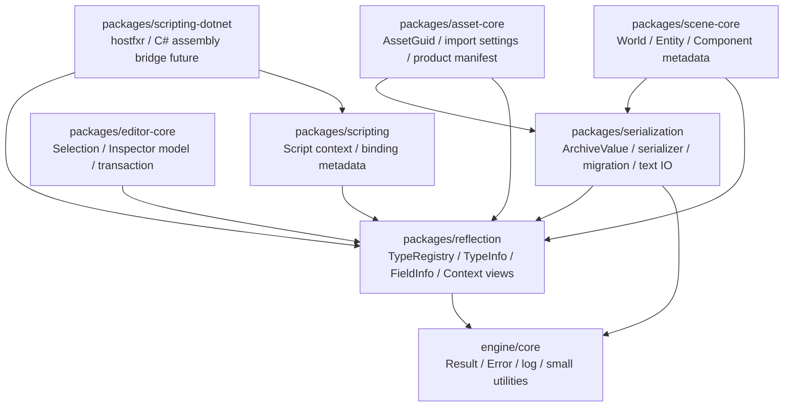
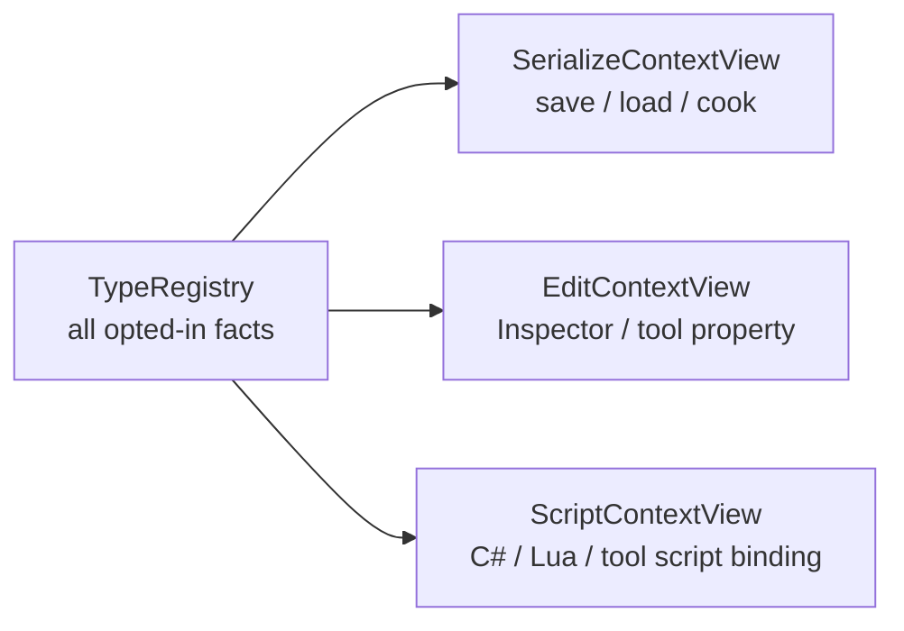
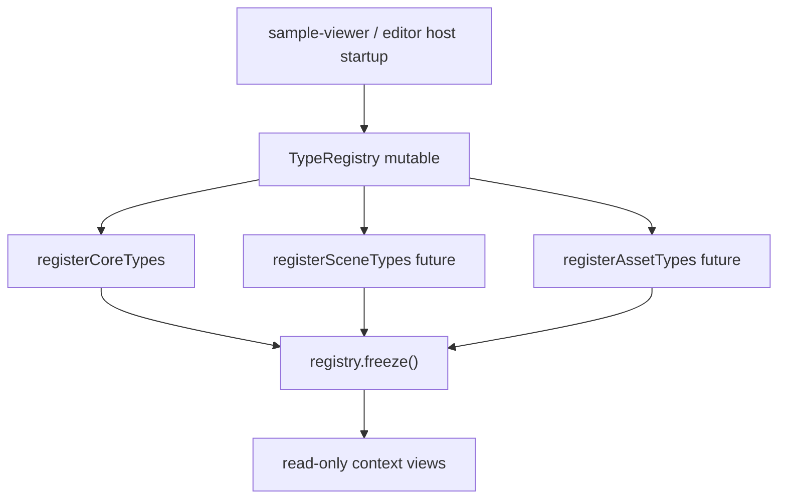
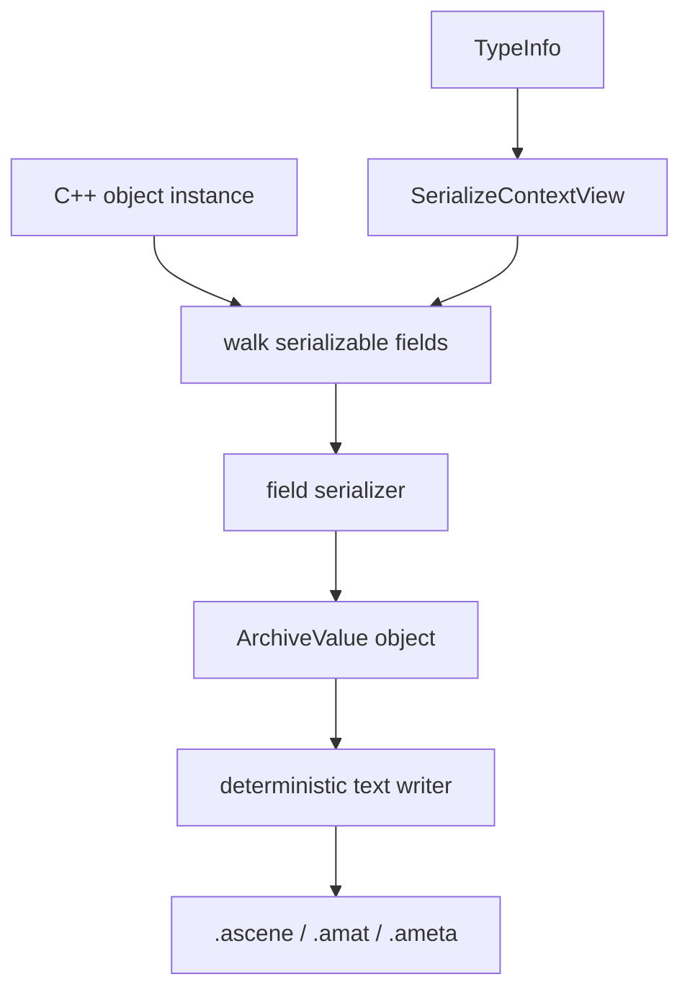
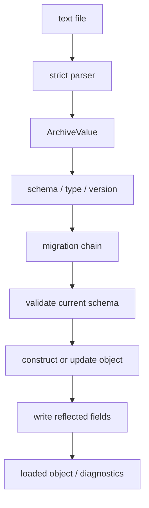
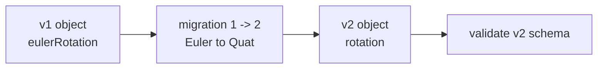
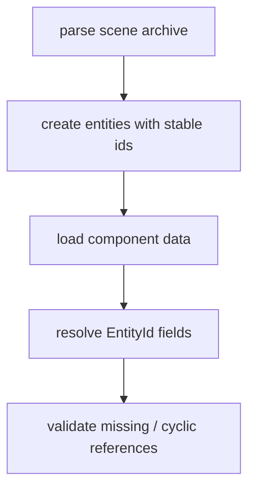
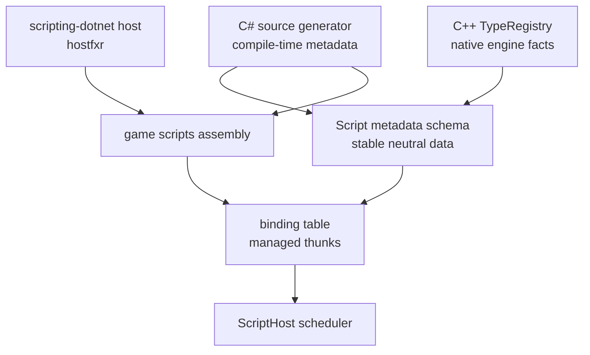
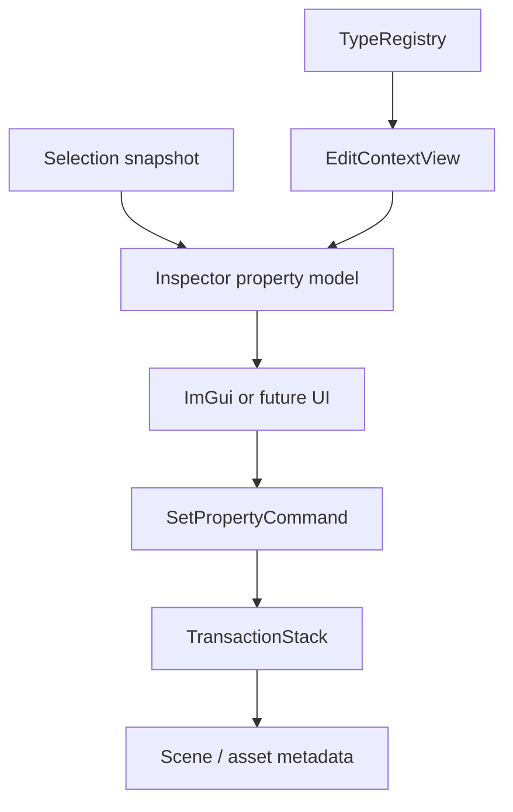
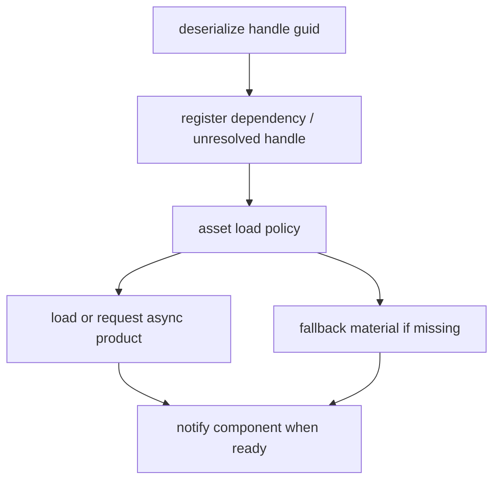

# Reflection / Serialization 技术方案与实施计划

研究日期：2026-05-10

本文是 `reflection-serialization.md` 的实施版补充，目标是把反射与序列化从“长期架构契约”推进到“可以开始编码的工程方案”。它仍然不要求一次性实现 editor、scene、asset、C# scripting 和热更新全套系统；本轮只定义第一批 package、核心 API、数据流、风险、smoke 和后续扩展点。

当前结论很明确：先做一个小而稳定的 C++23 反射元数据层，再做一个确定性文本序列化层。编辑器 Inspector、资产数据库、场景保存、C# 脚本绑定和热更新都消费这套元数据，但不能反过来把 editor、script runtime、ImGui、Vulkan 或资源加载器塞进反射底座。

命名遵循 `naming-conventions.md`：用户可见品牌为 Asharia Engine / 灰咏引擎，持久化 schema 使用
`com.asharia`，文件后缀使用 `.ascene`、`.aprefab`、`.ameta`、`.amat`、`.agraph`。C++ / CMake
实现名统一使用 `asharia`。

## 本轮决策

第一批要实现两个 package：

- `packages/reflection`：类型、字段、函数、枚举、可见性 context、注册表和诊断。
- `packages/serialization`：结构化 archive value、确定性文本读写、反射驱动 save/load、类型版本迁移和 round-trip smoke。

第一版采用手写注册表和轻量模板 builder，不引入 C++ AST 扫描器，不依赖 C++26 reflection，不接 C# runtime，不做全局 GC，不做二进制 scene/prefab，不做完整 asset database。

实现策略是“人工注册优先，未来代码生成替换注册层”：

```text
current C++ type
  -> manual registration table
  -> TypeRegistry
  -> serialization / inspector / scripting metadata views

future C++ type
  -> generated registration table
  -> same TypeRegistry
  -> same consumers
```

这样第一版可以马上验证数据契约，同时不给未来 C# source generator、C++ codegen 或 C++26 `<meta>` 关门。

## 资料结论

| 来源 | 资料重点 | 对 Asharia Engine 的实施约束 |
| --- | --- | --- |
| Unity Serialization Rules: https://docs.unity3d.com/Manual/script-serialization-rules.html | Unity 序列化直接定义字段进入 scene/prefab/Inspector 的条件，并区分 `UnityEngine.Object` 引用和普通 managed object inline 数据。 | Asharia Engine 必须显式区分 value、asset reference、entity reference 和 managed reference；不能只靠 C++ public/private 判断保存行为。 |
| Unity Asset Database: https://docs.unity3d.com/Manual/AssetDatabase.html | Unity 把 source asset、GUID、hash、artifact/import result 和 Library cache 分开。 | 序列化层保存稳定 GUID/import settings，不保存运行时 GPU 指针，也不让 runtime 依赖 source path。 |
| O3DE Reflection Contexts: https://www.docs.o3de.org/docs/user-guide/programming/components/reflection/ | O3DE 把 Serialize Context、Edit Context、Behavior Context 分开，分别服务持久化、编辑器和脚本。 | Asharia Engine 不做一个万能 `FieldInfo` 直接暴露给所有系统，而是从同一 TypeRegistry 派生不同 context view。 |
| Unreal Property System: https://www.unrealengine.com/blog/unreal-property-system-reflection | Unreal 的反射是 opt-in，UHT 生成 C++ 反射数据，支撑 details panel、serialization、GC、replication 和 Blueprint；未反射字段对这些系统不可见。 | Asharia Engine 也采用 opt-in；反射数据必须和二进制同步；非反射字段默认不参与保存、Inspector、脚本和引用追踪。 |
| Unreal Object Handling / GC: https://dev.epicgames.com/documentation/en-us/unreal-engine/unreal-object-handling-in-unreal-engine | Unreal 的 UObject 引用自动置空和 GC 依赖反射可见引用。 | Asharia Engine 第一版不做 UObject/GC，但对 `AssetHandle<T>`、`EntityId` 这类引用必须有专门 serializer 和失效诊断。 |
| Godot Object / ClassDB: https://docs.godotengine.org/en/stable/engine_details/architecture/object_class.html | Godot 通过 `_bind_methods`、ClassDB、ObjectID、RefCounted、ResourceLoader/ResourceSaver 建立属性、方法、信号和资源加载基础。 | Asharia Engine 可借鉴“注册一次、运行期查询”的模型，但对象生命周期用自己的 owner/handle，不把全部对象变成 heap Object。 |
| C++ P2996R13: https://www.open-std.org/jtc1/SC22/wg21/docs/papers/2025/p2996r13.html | P2996 面向 C++26 静态反射，核心实体是编译期 `std::meta::info`。 | 当前项目锁定 C++23，不能依赖标准反射；未来可让 generator 利用 C++26，但 runtime `TypeRegistry` API 不变。 |
| .NET hosting: https://learn.microsoft.com/en-us/dotnet/core/tutorials/netcore-hosting | Native host 通过 `nethost`/`hostfxr` 启动 .NET runtime 并获取 managed 入口。 | 后续 C# 接入应作为 `packages/scripting-dotnet`，不进入 reflection/serialization 底座。 |
| .NET language versioning: https://learn.microsoft.com/en-us/dotnet/csharp/language-reference/language-versioning | C# 语言版本由 target framework 决定；`.NET 10.x` 默认对应 C# 14，preview 版本不应随意作为生产基线。 | 若今天设计 C# 脚本路线，生产基线按 .NET 10 LTS / C# 14 预留；preview 特性不能进入引擎持久化 ABI。 |
| Roslyn source generators: https://learn.microsoft.com/en-us/dotnet/csharp/roslyn-sdk/#source-generators | Source generator 可在编译期读取 C# compilation 和 additional files，生成参与编译的 C# 代码。 | C# 脚本元数据以后可用 source generator 生成绑定表、生命周期表和序列化描述，而不是运行期到处反射扫描。 |

## 总体架构



硬边界：

- `reflection` 不依赖 `serialization`、editor、asset、scene、script、Vulkan、RenderGraph、renderer、ImGui。
- `serialization` 只依赖 `core` 和 `reflection`，不依赖 editor、asset database、scene world、script runtime、Vulkan。
- `scene-core`、`asset-core`、`editor-core` 和 `scripting` 只能消费反射 API，不能拥有或重建自己的类型系统。
- C# 接入只能出现在后续 scripting package 中，不改变 C++ 反射底座的数据模型。

## 核心原则

### 反射是事实表，不是业务系统

反射层只回答：

- 这个类型叫什么，稳定 id 是什么，版本是多少。
- 它有哪些字段、函数、枚举值。
- 字段类型、偏移或 accessor、默认值、flags 和轻量属性是什么。
- 哪些字段可保存、可编辑、可脚本访问、只读、临时、editor-only。

反射层不回答：

- 这个对象什么时候加载资产。
- Inspector 用什么 ImGui 控件。
- C# VM 如何调度 Update。
- Vulkan buffer 怎样销毁。
- RenderGraph pass 怎样录命令。

### 序列化是数据契约，不是资源系统

序列化层只处理稳定数据：

- 标量、字符串、数组、对象。
- 结构体字段。
- `EntityId` 保存为 scene-local stable id。
- `AssetHandle<T>` 保存为 `AssetGuid` 和可选 type name。
- 类型版本和字段迁移。

序列化层不直接加载 GPU resource，不触发 import，不读取 renderer state，不持有 editor selection。

### Context 是投影，不是重复注册

同一个 `TypeRegistry` 派生三类 view：



字段是否保存、是否显示、是否脚本可写是三件不同的事：

| 字段 | Serialize | Edit | Script | 说明 |
| --- | --- | --- | --- | --- |
| `Transform.position` | yes | yes | yes | scene 保存、Inspector 可编辑、脚本可读写。 |
| `Transform.worldMatrix` | no | read-only | read-only | 运行时计算结果，不写回 scene。 |
| `Renderer.gpuBuffer` | no | no | no | RHI 私有资源，不反射暴露。 |
| `Material.assetGuid` | yes | yes | read-only | 保存稳定引用，脚本不直接改 GUID。 |
| `EditorCamera.speed` | yes | yes | editor-only | editor 设置，不进入 runtime cook。 |

## 反射数据模型

### 稳定命名

每个类型使用 package-qualified name：

```text
com.asharia.scene.TransformComponent
com.asharia.asset.MaterialAsset
com.asharia.render.BasicDrawItem
```

每个字段使用 type name + field name：

```text
com.asharia.scene.TransformComponent.position
com.asharia.scene.TransformComponent.rotation
com.asharia.scene.TransformComponent.scale
```

`TypeId` / `FieldId` 可以由稳定字符串 hash 得到，但注册表必须保存原始 name 并在注册时检测 hash collision。hash 只用于快速比较和序列化短标识，不是唯一的错误诊断信息。

建议第一版：

- `TypeId`：`uint64_t`，来自 FNV-1a 64 或同等级稳定 hash。
- `FieldId`：`uint64_t`，来自 package-qualified field path。
- `TypeVersion`：`uint32_t`，类型字段布局改变时递增。
- registry 注册时检测：相同 id 不同 name、相同 name 不同 id、重复字段、字段类型缺失。

### 类型描述

建议第一版 public API 形状：

```cpp
namespace asharia::reflection {

struct TypeId {
    std::uint64_t value = 0;
};

struct FieldId {
    std::uint64_t value = 0;
};

enum class TypeKind : std::uint8_t {
    Scalar,
    String,
    Enum,
    Struct,
    Component,
    ResourceConfig,
    AssetHandle,
    EntityHandle,
    Array,
    Vector,
};

enum class FieldFlag : std::uint32_t {
    Serializable = 1U << 0U,
    EditorVisible = 1U << 1U,
    RuntimeVisible = 1U << 2U,
    ScriptVisible = 1U << 3U,
    ReadOnly = 1U << 4U,
    Transient = 1U << 5U,
    EditorOnly = 1U << 6U,
    AssetReference = 1U << 7U,
    EntityReference = 1U << 8U,
};

struct NumericRange {
    double minValue = 0.0;
    double maxValue = 0.0;
    double step = 0.0;
};

struct FieldAttributes {
    std::string_view displayName;
    std::string_view category;
    std::string_view tooltip;
    std::optional<NumericRange> range;
};

struct FieldInfo {
    FieldId id;
    std::string_view name;
    TypeId type;
    FieldFlagSet flags;
    FieldAttributes attributes;
    FieldAccessor accessor;
};

struct TypeInfo {
    TypeId id;
    std::string_view name;
    std::uint32_t version = 1;
    TypeKind kind = TypeKind::Struct;
    std::span<const FieldInfo> fields;
};

} // namespace asharia::reflection
```

`std::string_view` 的生命周期由注册表或 generated static table 保证。不要把临时字符串传进 `TypeInfo`。

### 字段访问器

第一版要避免“到处存裸 offset 然后随便写内存”。建议同时支持两类 accessor：

```text
Member pointer accessor
  适合标准布局、普通字段、Transform/Material config 这类 POD-ish 数据。

Getter/setter accessor
  适合需要验证、派生字段、非标准布局、写入要触发 dirty flag 的类型。
```

推荐模型：

```cpp
struct FieldReadContext {
    const void* object = nullptr;
};

struct FieldWriteContext {
    void* object = nullptr;
};

using ReadFieldFn = Result<void>(*)(FieldReadContext, ArchiveValueBuilder&);
using WriteFieldFn = Result<void>(*)(FieldWriteContext, ArchiveValueView);

struct FieldAccessor {
    TypeId ownerType;
    TypeId fieldType;
    std::size_t size = 0;
    std::size_t alignment = 0;
    ReadFieldFn read = nullptr;
    WriteFieldFn write = nullptr;
};
```

技术原因：

- C++ 对非标准布局类型的 offset 假设容易踩 ABI 和封装边界。
- getter/setter 可以统一处理 range clamp、dirty flag、transaction、只读错误。
- 后续 C# bridge 也可以生成 accessor thunk，而不是暴露 managed object 内部布局。

性能策略：

- 反射访问不进入渲染热路径。
- scene save/load、Inspector、asset metadata 和 script binding 初始化可以接受一次间接调用。
- 运行时高频逻辑应在 scene/runtime 数据结构中直接访问强类型数据，反射只做工具和持久化入口。

### 类型注册表

不要依赖跨 translation unit 的静态初始化顺序。每个 package 暴露显式注册函数：

```cpp
namespace asharia::scene {
VoidResult registerSceneReflection(asharia::reflection::TypeRegistry& registry);
}

namespace asharia::asset {
VoidResult registerAssetReflection(asharia::reflection::TypeRegistry& registry);
}
```

host app 启动时统一注册：



`TypeRegistry` 生命周期：

- mutable registration 只发生在启动或工具初始化。
- `freeze()` 后只读，可跨线程查询。
- registration failure 返回 `Result`，不能 assert 后继续运行。
- registry 不拥有被反射对象，只拥有类型描述和静态 metadata。

### Builder API

手写注册要足够轻，不然开发者会逃避它。建议第一版提供 builder：

```cpp
struct TransformComponent {
    Vec3 position;
    Quat rotation;
    Vec3 scale;
};

VoidResult registerSceneReflection(TypeRegistry& registry) {
    return TypeBuilder<TransformComponent>(registry,
                                           "com.asharia.scene.TransformComponent")
        .version(1)
        .kind(TypeKind::Component)
        .field("position", &TransformComponent::position,
               FieldFlags::serializableEditorRuntimeScript())
        .field("rotation", &TransformComponent::rotation,
               FieldFlags::serializableEditorRuntimeScript())
        .field("scale", &TransformComponent::scale,
               FieldFlags::serializableEditorRuntimeScript())
        .commit();
}
```

builder 必须做校验：

- 字段名非空。
- 字段 id 稳定。
- 字段类型已注册或有 serializer。
- `Transient` 和 `Serializable` 不能同时默认成立，除非有显式策略。
- `EditorOnly` 字段不能默认 `RuntimeVisible`。
- `ReadOnly` 字段不能生成普通 setter。

## 序列化数据模型

### ArchiveValue

序列化层先定义与 JSON 形状相近的结构化 value tree，不把文本 parser 和反射逻辑绑死：

```cpp
namespace asharia::serialization {

enum class ArchiveValueKind {
    Null,
    Bool,
    Integer,
    Float,
    String,
    Array,
    Object,
};

struct ArchiveValue;

using ArchiveArray = std::vector<ArchiveValue>;
using ArchiveObject = std::vector<ArchiveMember>; // preserve deterministic order

struct ArchiveMember {
    std::string key;
    ArchiveValue value;
};

struct ArchiveValue {
    ArchiveValueKind kind;
    // variant payload
};

} // namespace asharia::serialization
```

用 `std::vector<ArchiveMember>` 而不是 unordered map，是因为用户工程文件需要稳定输出顺序，方便 diff、review 和迁移。

第一版文本格式建议采用“受控 JSON 子集”：

- object key 必须是 string。
- 不保留注释。
- 输出时 key 顺序由 serializer 决定。
- float 格式固定。
- JSON writer/parser 使用 `nlohmann_json` 封装在 `packages/serialization` 内部，
  并通过 `ordered_json` 保持 object 输出顺序。
- unknown field 默认保留或诊断策略可配置。
- parser 不接受宽松语法，避免不同工具输出产生歧义。

如果后续添加第三方 JSON 库，需要单独更新 Conan lock，并把 parser/writer 包在 `serialization` 内部 facade 后面，不能让全项目直接依赖某个 JSON 类型。

### 文件形状

场景、asset metadata 和 editor settings 都使用同一类 envelope：

```json
{
  "schema": "com.asharia.scene",
  "schemaVersion": 1,
  "objects": [
    {
      "id": "scene-object:camera-main",
      "type": "com.asharia.scene.Entity",
      "version": 1,
      "components": {
        "com.asharia.scene.TransformComponent": {
          "version": 1,
          "position": [0.0, 2.0, -5.0],
          "rotation": [0.0, 0.0, 0.0, 1.0],
          "scale": [1.0, 1.0, 1.0]
        }
      }
    }
  ]
}
```

原则：

- `schema` 描述文件类别。
- `schemaVersion` 描述文件整体格式。
- 每个 reflected object 自带 `type` 和 `version`。
- component map 可以用 type name 作 key，避免依赖数组顺序。
- 保存引用时写稳定 id，不写 runtime pointer。

### 保存流程



保存时必须：

- 按注册顺序或显式 order 输出字段。
- 跳过 `Transient`。
- 跳过 runtime-only 字段。
- 对 editor-only 字段按 policy 决定是否保存到 editor settings，不能进入 runtime cook。
- 对缺失 serializer 的字段返回结构化错误。

### 加载流程



加载时必须：

- 先 parse 成 immutable `ArchiveValue`。
- 先看 schema/type/version，再写对象。
- 旧版本先迁移到当前版本，再按当前 schema 写入。
- unknown field 根据 policy 处理：error、warn、preserve、ignore。
- 写字段失败要带 file path、object path、type、field、expected、actual、version。

### 迁移机制

迁移函数只处理本类型的数据，不跨 package 隐式改别的对象：

```cpp
struct MigrationContext {
    TypeId type;
    std::uint32_t fromVersion = 0;
    std::uint32_t toVersion = 0;
    ArchiveObjectView input;
    ArchiveObjectBuilder output;
    DiagnosticSink* diagnostics = nullptr;
};

using MigrationFn = Result<void> (*)(MigrationContext&);
```

迁移示例：

```text
TransformComponent v1
  position: Vec3
  eulerRotation: Vec3
  scale: Vec3

TransformComponent v2
  position: Vec3
  rotation: Quat
  scale: Vec3
```

迁移链：



技术约束：

- version 只能递增。
- 不允许跳过失败迁移继续加载。
- 迁移后必须验证当前字段。
- 迁移函数应可被 CLI batch tool 调用，不依赖 editor UI。
- 迁移诊断要保留原始 object path。

### 默认值

字段默认值不能只靠 C++ 构造函数隐式决定。原因是：

- 加载旧文件时缺字段，需要确定默认。
- Inspector reset field 需要确定默认。
- C# 脚本字段未来也需要和 C++ 侧 metadata 对齐。

建议：

- C++ 构造函数仍负责 runtime 对象合法初始值。
- 反射 metadata 可选提供 `DefaultValueProvider`。
- 序列化加载时：缺字段先走 metadata default，再走构造后已有值，最后报缺失错误。
- default provider 返回 `ArchiveValue` 或写入 field accessor，不返回裸指针。

## 特殊类型策略

### EntityId

运行期 `EntityId(index, generation)` 不稳定，不能直接写入磁盘。保存时使用 scene-local stable id：

```text
Runtime EntityId
  -> SceneObjectStableId
  -> archive string
  -> load-time remap table
  -> Runtime EntityId
```

加载时先创建所有 entity，再解析引用：



第一版如果还没有 `scene-core`，smoke 可以用测试用 stable id map 模拟，不阻塞反射/序列化包。

### AssetHandle<T>

`AssetHandle<T>` 保存 `AssetGuid` 和类型约束，不保存 source path、loaded pointer、GPU handle：

```json
{
  "albedo": {
    "guid": "9f7a31a0-0b63-4d4c-9f18-bd9a0d2e9c21",
    "type": "com.asharia.asset.Texture2D"
  }
}
```

加载策略：

- 反序列化只得到 handle/guid。
- 是否立即加载由 asset system policy 决定。
- Inspector 可以显示丢失、类型不匹配、未导入、已加载等状态。
- runtime cook 读取 cooked manifest，不直接读 editor source path。

### Math

数学类型需要固定格式：

- `Vec2`: `[x, y]`
- `Vec3`: `[x, y, z]`
- `Vec4`: `[x, y, z, w]`
- `Quat`: `[x, y, z, w]`
- `Mat4`: 明确 row-major 或 column-major，并写在 schema 文档中。

不要把 `glm` 内存布局直接当文件格式。文件格式是引擎契约，库内存布局只是实现细节。

### Color

颜色必须声明色彩空间：

```json
{
  "baseColor": {
    "space": "linear",
    "value": [1.0, 0.5, 0.25, 1.0]
  }
}
```

可以在上层 material schema 中约束某字段永远是 linear，避免每个字段重复写 `space`，但文档必须明确。

## C# 接入预留

后续接最新 C# 时，不应该让 C# runtime 直接控制 C++ 反射底座。推荐三层：



设计要点：

- C++ 反射描述 native types。
- C# source generator 描述 managed script types。
- 中间使用稳定 metadata schema 对齐，例如 type name、field name、field flags、lifecycle methods。
- C++ 不扫描所有 C# method 来猜行为；C# assembly 或 generator 输出明确表。
- C# 的 `[AshariaSerialize]`、`[AshariaEditorVisible]`、`[AshariaRuntimeOnly]` 等 attribute 只影响 managed script metadata，不改变 native C++ TypeRegistry。
- C# runtime 启动用 `hostfxr`，独立放在 `packages/scripting-dotnet`。

按 2026-05-10 的资料，若今天锁定生产基线，建议：

- 使用 .NET 10 LTS / C# 14 作为后续 scripting-dotnet 的候选基线。
- 不把 preview C# 15 特性写入持久化 ABI。
- 用 Roslyn incremental source generator 生成生命周期表和字段序列化表。
- 热更新通过 assembly load context、脚本域重载和数据迁移设计处理，不能依赖 native reflection package 的热重载。

Managed script 字段序列化可以有两条路：

```text
Native component fields
  C++ TypeRegistry -> serialization

Managed script component fields
  C# generator metadata -> managed serializer -> neutral ArchiveValue -> engine scene file
```

这意味着 C# 脚本的字段也进入同一个 scene 文件，但 native 和 managed 的 metadata 来源不同。scene 文件不关心字段来自 C++ 还是 C#，只关心稳定 type name、field name、version 和 serializer。

## 和 Editor 的关系

`editor-core` 不依赖 ImGui，原因是 editor core 应该提供编辑语义，而不是具体 UI。Reflection/Serialization 对 editor 的支持是生成 Inspector model：



关键点：

- `editor-core` 生成 property row、display name、range、read-only reason、mixed value 状态。
- `apps/editor` 或 `packages/editor-imgui` 决定用 ImGui 画成什么控件。
- UI 修改不能直接写字段裸地址，要生成 command，进入 transaction。
- undo/redo 保存的是 property path、old value、new value，不是 UI 状态。

## 和资源加载的关系

脚本或 scene 中引用材质时，序列化只保存引用：

```cpp
struct MeshRendererComponent {
    AssetHandle<MaterialAsset> material;
};
```

保存：

```json
{
  "material": {
    "guid": "material-guid",
    "type": "com.asharia.asset.MaterialAsset"
  }
}
```

加载时分三步：



因此 `serialization` 不关心“何时加载材质”。它只把 GUID 读出来，并给 asset system 足够的类型和错误上下文。

## 实施切片

下面是可执行切片，不是按月份排的“大阶段”。每个切片都应能独立 review，并尽量有 sample-viewer smoke。

### 切片 A：文档与决策落库

目标：

- 确认第一版只做 `reflection` 和 `serialization`。
- 确认不做 GC、不接 C# runtime、不做 editor UI、不做 asset database。
- 明确所有后续系统只能消费 metadata。

交付：

- 本文档。
- `docs/README.md` 索引更新。
- `docs/reflection-serialization.md` 链接到实施计划。

验收：

- 文档能回答：为什么需要反射、保存什么、怎么迁移、如何接 editor/C#、第一版不做什么。

### 切片 B：`packages/reflection` 骨架

目标：

- 新增 CMake target `asharia-reflection` 和 alias `asharia::reflection`。
- 新增 `Asharia.package.json`。
- public include 只暴露稳定 API。

建议文件：

```text
packages/reflection/
  CMakeLists.txt
  Asharia.package.json
  include/asharia/reflection/ids.hpp
  include/asharia/reflection/field_flags.hpp
  include/asharia/reflection/type_info.hpp
  include/asharia/reflection/type_registry.hpp
  include/asharia/reflection/type_builder.hpp
  include/asharia/reflection/context_view.hpp
  src/type_registry.cpp
```

依赖：

- public 或 private 依赖 `asharia::core`。
- 不依赖 `serialization`。

验收：

- `cmake --build --preset msvc-debug` 能构建。
- 空 registry 可创建、freeze、查询失败返回 `Result` 或 nullable view。

### 切片 C：稳定 id 和注册表校验

目标：

- 实现 `TypeId`、`FieldId`、稳定 hash、name 保存和 collision 诊断。
- 实现 `TypeRegistry::registerType()`、`findType()`、`freeze()`。

必须校验：

- 重复 type name。
- 重复 type id 但 name 不同。
- 类型字段中重复 field name。
- 字段引用未知 type。
- freeze 后禁止注册。

建议 smoke：

```text
asharia-sample-viewer.exe --smoke-reflection-registry
```

smoke 内容：

- 注册两个基础类型和一个测试 struct。
- 查询 type 和字段。
- 故意注册冲突，确认错误信息包含 type name。

### 切片 D：字段 accessor 和 builder

目标：

- 支持 pointer-to-member 字段注册。
- 支持 getter/setter function 注册。
- builder 自动生成 field id、size、alignment 和基础 read/write thunk。

示例 smoke 类型：

```cpp
struct ReflectionSmokeTransform {
    Vec3 position;
    Quat rotation;
    Vec3 scale;
};
```

建议 smoke：

```text
asharia-sample-viewer.exe --smoke-reflection-transform
```

smoke 内容：

- 注册 `ReflectionSmokeTransform`。
- 枚举字段顺序。
- 校验 `Serializable`、`EditorVisible`、`RuntimeVisible` flags。
- 通过 accessor 读写 position。

注意：

- 这个 smoke 类型可以先放在 sample-viewer 或 reflection smoke 内，不等待未来 `scene-core`。
- 不要为了 smoke 提前创建完整 TransformComponent package。

### 切片 E：`packages/serialization` 骨架和 ArchiveValue

目标：

- 新增 CMake target `asharia-serialization` 和 alias `asharia::serialization`。
- 定义 `ArchiveValue`、`ArchiveObject`、`ArchiveArray`。
- 定义诊断结构和 `SerializationPolicy`。

建议文件：

```text
packages/serialization/
  CMakeLists.txt
  Asharia.package.json
  include/asharia/serialization/archive_value.hpp
  include/asharia/serialization/text_archive.hpp
  include/asharia/serialization/serializer.hpp
  include/asharia/serialization/migration.hpp
  src/archive_value.cpp
  src/text_archive.cpp
```

验收：

- 可以手工构建 ArchiveValue object。
- 可以 deterministic 写出文本。
- 同一个 object 多次写出 byte-for-byte 相同。

### 切片 F：反射驱动 round-trip

目标：

- 通过 TypeRegistry 保存对象到 ArchiveValue。
- 从 ArchiveValue 写回对象。
- 支持 int、float、bool、string、Vec3、Quat 和嵌套 struct 的最小 serializer。

建议 API：

```cpp
Result<ArchiveValue> serializeObject(const reflection::TypeRegistry& registry,
                                     reflection::TypeId type,
                                     const void* object,
                                     const SerializationPolicy& policy);

VoidResult deserializeObject(const reflection::TypeRegistry& registry,
                             reflection::TypeId type,
                             ArchiveValueView value,
                             void* object,
                             const SerializationPolicy& policy);
```

建议 smoke：

```text
asharia-sample-viewer.exe --smoke-serialization-roundtrip
asharia-sample-viewer.exe --smoke-serialization-json-archive
```

smoke 内容：

- 构造 `ReflectionSmokeTransform`。
- 保存为 ArchiveValue 和文本。
- 重新加载到新对象。
- 比较字段值。
- 故意输入错误类型，确认诊断包含 field path。
- `--smoke-serialization-json-archive` 额外验证 JSON 字符串转义、UTF-8、重复 key 拒绝、
  malformed JSON byte 诊断和 byte-for-byte deterministic 输出。

### 切片 G：版本迁移

目标：

- 支持 type version。
- 支持注册 migration function。
- 支持 `1 -> 2 -> 3` 链式迁移。

建议 smoke：

```text
asharia-sample-viewer.exe --smoke-serialization-migration
```

smoke 内容：

- 旧 object 使用 `eulerRotation`。
- 新 object 使用 `rotation`。
- migration 生成 quat 或测试替代值。
- 加载后输出当前 schema。
- migration 缺失时报明确错误。

### 切片 H：Context view

目标：

- `SerializeContextView` 过滤 `Serializable` 且非 `Transient` 字段。
- `EditContextView` 过滤 `EditorVisible` 字段。
- `ScriptContextView` 过滤 `ScriptVisible` 字段。

建议 smoke：

```text
asharia-sample-viewer.exe --smoke-reflection-contexts
```

smoke 内容：

- 一个字段 serialize-only。
- 一个字段 editor-only。
- 一个字段 script-visible read-only。
- 确认三个 view 返回不同字段集合。

### 切片 I：错误与诊断统一

目标：

- 反射和序列化错误都能转换到 `asharia::Error`。
- 保留结构化 detail，至少在 message 中包含足够上下文。

建议诊断字段：

```text
operation: register / serialize / deserialize / migrate / inspect / bind
file: optional path
objectPath: /objects/Camera/components/Transform
type: com.asharia.scene.TransformComponent
field: rotation
expected: Quat[4]
actual: array length 3
version: 1
```

后续如果 `engine/core` 增加结构化 diagnostics，可把这里的 detail 从字符串升级成结构体。

### 切片 J：C# metadata 预研，不进入第一批实现

目标：

- 只写接口边界，不启动 .NET runtime。
- 定义未来 managed script metadata 如何映射到中立 schema。

建议后续文档：

```text
docs/scripting-dotnet-architecture.md
```

先不写代码的原因：

- C# hot reload、assembly load context、managed GC、native handle lifetime 是独立大问题。
- 过早接 runtime 会干扰反射/序列化小闭环。
- 当前最重要的是让 native scene/config/material metadata 先稳定。

## 并行开发建议

可以并行：

| 工作 | 可并行原因 | 注意事项 |
| --- | --- | --- |
| `reflection` ids/flags/type_info | 纯头文件和小实现，不依赖 serialization。 | 先冻结命名和错误风格。 |
| `serialization` ArchiveValue 设计 | 可先不接 TypeRegistry，只做 value tree 和 writer。 | parser/writer facade 不要泄漏第三方 JSON 类型。 |
| 文档与 smoke 命令设计 | 不改核心代码。 | smoke 必须符合项目“没有独立测试 exe”的规则。 |
| C# metadata 预研 | 只做文档和 schema，不接 hostfxr。 | 不进入第一批构建依赖。 |

不建议并行：

| 工作 | 原因 |
| --- | --- |
| reflection builder 和 serialization round-trip 同时写 | round-trip 依赖 accessor 语义，先把 accessor 稳住。 |
| editor Inspector UI 和 EditContext 同时写 | UI 会倒逼错误抽象；先让 EditContext 输出纯 model。 |
| asset loading 和 AssetHandle serializer 同时写 | serializer 只需要 GUID 形状，加载策略属于 asset-core。 |
| C# runtime hosting 和 native reflection 同时写 | hostfxr、managed GC、assembly reload 会把问题放大。 |

## 需要避免的设计

- 不做全局万能 `Object` 基类。
- 不让所有 C++ 类型自动反射。
- 不让反射层拥有对象生命周期。
- 不把 ImGui 控件、Vulkan handle、RenderGraph pass callback 放进 `FieldInfo`。
- 不把 C# runtime 放进 `engine/core`。
- 不在 render loop 里用字符串反射调用。
- 不把 runtime pointer 序列化到文件。
- 不让 hash id 成为唯一诊断信息。
- 不让 editor-only 字段默认进入 runtime cook。
- 不让版本迁移悄悄吞错误。
- 不为了“以后会 codegen”而第一版没有手写可用 API。

## 代码审查清单

新增反射类型时检查：

- type name 是否 package-qualified。
- type version 是否正确递增。
- field id 是否稳定。
- field flags 是否区分 serialize/editor/runtime/script。
- 字段类型是否已注册或有专用 serializer。
- 是否有默认值策略。
- 是否含 asset/entity 引用。
- editor-only/runtime-only 是否明确。
- script-visible 是否说明线程和生命周期。

新增 serializer 时检查：

- 输出是否 deterministic。
- 错误是否包含 file/object/type/field。
- unknown field 策略是否明确。
- 是否支持 round-trip。
- 是否支持旧版本迁移。
- 是否误触发资源加载或 editor 操作。

新增 context view 时检查：

- 是否只做过滤和 projection。
- 是否没有复制或修改 TypeRegistry。
- 是否不依赖 UI/runtime/backend。

## 最小门禁

文档切片完成后运行：

```powershell
powershell -ExecutionPolicy Bypass -File tools\check-text-encoding.ps1
git diff --check
```

实现切片完成后至少运行：

```powershell
cmd /c "build\conan\msvc-debug\Debug\generators\conanbuild.bat && cmake --preset msvc-debug && cmake --build --preset msvc-debug"
build\cmake\msvc-debug\apps\sample-viewer\asharia-sample-viewer.exe --smoke-reflection-registry
build\cmake\msvc-debug\apps\sample-viewer\asharia-sample-viewer.exe --smoke-reflection-transform
build\cmake\msvc-debug\apps\sample-viewer\asharia-sample-viewer.exe --smoke-serialization-roundtrip
build\cmake\msvc-debug\apps\sample-viewer\asharia-sample-viewer.exe --smoke-serialization-json-archive
build\cmake\msvc-debug\apps\sample-viewer\asharia-sample-viewer.exe --smoke-serialization-migration
build\cmake\msvc-debug\apps\sample-viewer\asharia-sample-viewer.exe --smoke-reflection-contexts
```

提交前再跑 ClangCL：

```powershell
cmd /c "build\conan\clangcl-debug\Debug\generators\conanbuild.bat && cmake --preset clangcl-debug && cmake --build --preset clangcl-debug"
```

## 推荐开始顺序

最适合马上动手的顺序：

1. 新增 `packages/reflection` 骨架。
2. 实现 `TypeId`、`FieldId`、`FieldFlagSet`。
3. 实现 `TypeInfo`、`FieldInfo`、`TypeRegistry`。
4. 在 sample-viewer 加 `--smoke-reflection-registry`。
5. 实现 pointer-to-member builder。
6. 加 `--smoke-reflection-transform`。
7. 新增 `packages/serialization` 和 `ArchiveValue`。
8. 写 deterministic JSON 子集 writer。
9. 接反射 round-trip。
10. 加 migration 和 context smoke。

这条路线的好处是每一步都小、可审查、可回滚，并且不会提前绑死 editor、asset 或 C#。
