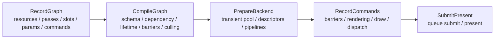
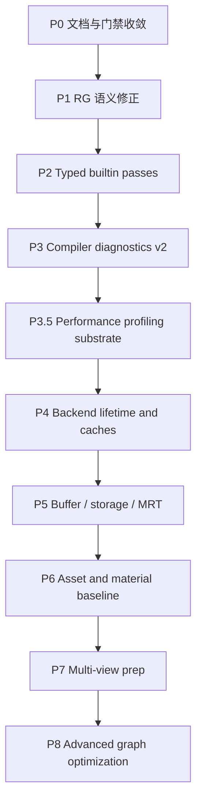

# RenderGraph 后续开发路线图

研究日期：2026-05-05

适用范围：Windows 桌面端、Vulkan 1.4、C++23、single graphics queue、dynamic rendering、synchronization2、VMA、Slang。

本文是 `next-development-plan.md` 的 RenderGraph 专项路线图。它把外部资料、当前仓库状态、审查发现、阶段任务和验收门禁整理到同一份文档中。日常执行仍以 `flow-architecture.md` 记录真实流程，以 `review-workflow.md` 记录提交门禁。

## 资料结论

| 资料 | 关键结论 | VkEngine 采用方式 |
| --- | --- | --- |
| Khronos Vulkan synchronization guide: https://docs.vulkan.org/guide/latest/synchronization_examples.html | layout transition、stage mask、access mask 必须匹配真实 producer/consumer。`vkCmdPipelineBarrier2` 是当前项目正确的主路径。 | 每新增一个 `RenderGraphImageState`，必须同步补 `rhi_vulkan_rendergraph` 映射和 smoke 校验。 |
| Vulkan synchronization spec: https://docs.vulkan.org/spec/latest/chapters/synchronization.html | 同步分 execution dependency、memory dependency 和 image layout transition，不能只看 layout 名字。 | RG compiler 输出抽象 transition，Vulkan adapter 负责 stage/access/layout 细节，不能把 Vulkan 类型泄漏到 `rendergraph`。 |
| Khronos unified image layouts: https://www.khronos.org/blog/so-long-image-layouts-simplifying-vulkan-synchronisation | 新式 unified image layout 能减少 layout 数量，但需要明确 feature/extension 和设备支持。 | 作为后续优化观察项；当前先保持显式精确 layout，避免过早依赖新能力。 |
| VMA usage patterns: https://gpuopen-librariesandsdks.github.io/VulkanMemoryAllocator/html/usage_patterns.html | image/buffer allocation 应集中到 allocator facade，由用途决定 memory type。 | transient resource pool 使用 VMA，key 包含 format/extent/usage/aspect/sample count。 |
| Unity URP Render Graph introduction: https://docs.unity3d.com/Manual/urp/render-graph-introduction.html | graph 每帧 record、compile、execute；pass 显式声明资源，graph 自动处理生命周期、同步和 pass culling。 | 保持 RecordGraph、CompileGraph、PrepareBackend、RecordCommands 四段式。 |
| Unity URP custom render pass: https://docs.unity3d.com/Manual/urp/render-graph-write-render-pass.html | pass data 和 render function 分离，builder 显式声明资源读写。 | `PassSchema`、typed params、named slots 和 command summary 继续作为脚本/工具前端的共同语义。 |
| Unity URP read/write texture note: https://docs.unity.cn/Manual/urp/render-graph-read-write-texture.html | 普通 render pass 不能对同一 texture 同时读写；需要临时纹理、兼容/unsafe 路径或更明确的访问模型。 | 当前继续拒绝模糊的 `readTexture + writeColor` 同图声明；后续只通过明确 combined-access state 放开。 |
| Unity URP Render Graph Viewer reference: https://docs.unity.cn/6000.0/Documentation/Manual/urp/render-graph-viewer-reference.html | Viewer 中绿色+红色表示 pass 对资源有 read-write access 摘要，不等价于任意 texture sampled read + attachment write 都合法。 | Debug table 后续也应区分“访问摘要”和具体 Vulkan layout/access 语义。 |
| Unity unsafe pass: https://docs.unity3d.com/Manual/urp/render-graph-unsafe-pass.html | unsafe pass 能兼容旧命令路径，但会降低 graph 优化能力。 | 后续如加 native/unsafe pass，必须显式标记并禁止 aggressive reorder/alias/merge。 |
| Unreal RDG: https://dev.epicgames.com/documentation/en-us/unreal-engine/render-dependency-graph-in-unreal-engine | RDG 采用延迟执行、资源生命周期管理、barrier 规划、validation 和 transient resource 模型。 | 借鉴 validation、debug table、资源池和 transient/persistent 区分；暂缓 async compute 和复杂 alias。 |
| Blender Vulkan render graph: https://developer.blender.org/docs/features/gpu/vulkan/render_graph/ | Vulkan backend 可以把 command、资源状态和同步收集成图，再统一生成 barriers。 | `rhi_vulkan_rendergraph` 增加 backend transition debug 视图，但不改变 `rendergraph` 后端无关边界。 |
| Frostbite FrameGraph: https://www.gdcvault.com/play/1024612/FrameGraph-Extensible-RenderingArc | setup 阶段声明资源和 pass，execute 阶段只消费编译后的资源；整帧图让资源生命周期和 alias 可分析。 | 当前继续先做小闭环，不提前复制大型 feature renderer。 |
| Granite render graph deep dive: https://themaister.net/blog/2017/08/15/render-graphs-and-vulkan-a-deep-dive/ | Vulkan render graph 的价值在于自动同步、transient resource、deferred destruction、descriptor/pipeline 自动化。 | 中期优先做 deferred destruction、descriptor allocator、pipeline cache 和 transient resource pool。 |

## 当前基线

当前项目已经具备这些前提：

- `rendergraph` public API 不暴露 Vulkan 类型。
- `vke::rhi_vulkan` 与 `vke::rhi_vulkan_rendergraph` 已分离。
- graph transition 使用 `vkCmdPipelineBarrier2`。
- frame loop 使用 `vkQueueSubmit2`。
- dynamic rendering 已覆盖 clear、triangle、depth triangle、mesh、draw list 和 fullscreen texture。
- Slang 生成 SPIR-V、metadata 和 reflection JSON，SPIR-V 经过 `spirv-val`。
- `--smoke-rendergraph` 已覆盖 dependency sort、negative compile、schema validation、command summary、transient plan、显式 culling 和 side-effect pass。
- `--smoke-transient`、`--smoke-depth-triangle`、`--smoke-draw-list`、`--smoke-fullscreen-texture` 已把 RG 结果接入真实 Vulkan 路径。

仍需修正的主要审查发现：

- 同一 pass 内同一 image 可以同时声明在多个 access group，compiler 会按固定顺序生成 transition，但 Vulkan 语义上这些使用更接近同 pass 同时访问。
- `RenderGraphImageDesc` 对 imported image 默认 `finalState = Present`，这只适合 swapchain image。
- 真实 `renderer-basic` 路径已收敛到共享 typed schema；fullscreen、transient、depth、mesh 和 draw-list 的 Vulkan callback 已通过 pass context named slots 查询 binding，`--smoke-rendergraph` 已覆盖每个 builtin pass 的负向 schema 编译路径。

## 设计原则

### 先收紧语义，再扩能力

下一阶段不优先做脚本 VM、bindless、async compute、复杂 alias 或完整 asset database。先把 RG 声明语义、Vulkan adapter 映射、后端资源生命周期和调试诊断做稳。

### 优秀案例只作为约束来源

Unity RenderGraph、Unreal RDG、Frostbite FrameGraph、Granite 和 Blender Vulkan backend 都是成熟系统。VkEngine 当前只借鉴它们已经被反复验证的边界：

- setup/record 阶段显式声明 pass、resource 和参数。
- compile 阶段只分析声明数据，产出依赖、lifetime、barrier 和 culling 计划。
- execute 阶段只消费编译结果，不回调脚本或重新解释 graph topology。
- 后端缓存、transient resource 和 debug/profiling 数据必须能用 smoke 或 benchmark 验证。

不把成熟案例里的高级能力直接搬进当前阶段：

- 不因为 Unreal RDG 支持 async compute，就提前设计多队列调度。
- 不因为 Frostbite/Granite 能做 transient memory alias，就提前实现 alias allocator。
- 不因为 Unity 有 Render Graph Viewer 或 Profiler，就提前做 editor UI。
- 不因为 Diligent 有成熟 resource state/cache 系统，就提前抽象通用 asset/pipeline database。

每个新能力进入路线图前必须满足两个条件：当前 smoke/benchmark 能暴露它要解决的问题，并且实现后有可量化的验收标准。

### 四段式帧流程



约束：

- RecordGraph 可以使用普通 C++ 控制流，未来脚本也只能作为这一段的前端。
- CompileGraph 只分析声明数据，不创建长期 GPU 对象，不运行脚本 VM。
- PrepareBackend 从 cache/pool 获取或创建 Vulkan 对象。
- RecordCommands 只消费 compiled graph，不改变 topology。

### RenderGraph 层保持后端无关

允许在 `rendergraph` 里出现：

- abstract image/buffer state
- queue domain
- resource lifetime
- pass schema
- typed params
- command summary
- dependency/culling/lifetime/debug data

不允许在 `rendergraph` 里出现：

- `VkImageLayout`
- `VkPipelineStageFlags2`
- `VkAccessFlags2`
- `VkImage`
- `VkImageView`
- VMA allocation
- command buffer recording

### Native/unsafe pass 只作逃生口

如果后续需要兼容不可分析命令：

- pass 必须显式标记 `unsafe` 或 `native`。
- 必须声明 conservative resource access。
- 不参与 aggressive alias、merge、reorder。
- debug table 必须标出 unsafe reason。
- 默认项目 pass 不走 unsafe。

## 总体路线



## P0：文档与门禁收敛

目标：让文档入口、网络资料、审查发现和下一步任务对齐。

主要任务：

- 新增本路线图并接入 `docs/README.md`。
- 在 `research-sources.md` 记录本轮 RenderGraph 资料核对日期和来源。
- 在 `next-development-plan.md` 顶部说明：RenderGraph 专项推进以本文为准。
- 保持 `review-workflow.md` 的 smoke 清单作为提交门禁源头。

验收：

- 文档中当前状态不夸大实现。
- 每个“计划”都能追溯到阶段和验收标准。
- Markdown 编码检查通过。

## P1：RenderGraph 语义修正

目标：修掉当前 P2 设计风险，使 compiler 的抽象语义和 Vulkan 执行语义一致。

### P1.1 拒绝同 pass 同 image 混合访问

问题：一个 pass 现在可以同时声明：

```cpp
pass.readTexture("source", image, RenderGraphShaderStage::Fragment)
    .writeColor("target", image);
```

这会让 compiler 顺序生成 `ShaderRead` 与 `ColorAttachment` transition，但 pass 内真实命令可能是同时使用，Vulkan barrier 不能表达“同一 pass 内前后命令”的意图，除非 command summary 也成为同步边界。

短期策略：

- 在 `validatePass()` 阶段拒绝同一 image 出现在多个 access group。
- 错误信息输出 pass name、image name、slot names 和 access group。
- 允许同一 image 在同一种 read access 下出现多次吗：第一版也拒绝，直到确实需要 alias slot。
- 未来如需要 read/write storage image、input attachment、color feedback loop，再引入明确状态和 feature query。

同 pass read/write 分类：

- **当前禁止**：`readTexture("source", image)` + `writeColor("target", image)`、`writeTransfer` + `writeColor`、`writeDepth` + `readDepthTexture` 这类跨 access group 的同图混用。它们没有说明真实意图，compiler 不能安全推导 layout、access、barrier 和命令内 hazard。
- **Attachment read/write**：depth/stencil test 会读旧 depth/stencil 并条件写入新值；color blend / loadOp=LOAD 也可能读旧 color 再写回。这应建模为明确的 attachment read/write 或 blend/load 语义，而不是普通 texture read。
- **Storage read/write**：compute 或 fragment shader 的 storage image / buffer 可读改写，但需要 `StorageReadWrite`、usage flags、stage/access、atomic/race 规则和 pass 间 barrier。
- **Framebuffer fetch / input attachment**：可读当前 render target/subpass 内容再写出，通常依赖特定 feature、layout 和 tile/subpass 语义，需要单独状态。
- **Grab/copy-to-temp**：后处理想“读当前 color 又写回当前 color”时，第一版应显式 copy/grab 到临时图，再读临时图、写目标图；未来可由 graph 自动插入。
- **Unsafe/native pass**：若后续提供逃生口，必须显式标记为不可分析或弱优化，不能绕过普通 pass 的同步和 alias 假设。

结论：Unity Render Graph Viewer 里的 read-write 颜色是资源访问摘要，不代表可以把所有同图读写折叠成一个 `readTexture + writeColor` pass。VkEngine 只在语义、feature 和 backend 映射都明确后放开具体 read/write 类型。

涉及文件：

- `packages/rendergraph/include/vke/rendergraph/render_graph.hpp`
- `apps/sample-viewer/src/main.cpp`

新增 smoke：

- 同 pass `readTexture + writeColor` 应 compile 失败。
- 同 pass `writeTransfer + writeColor` 应 compile 失败。
- 同 pass `writeDepth + readDepthTexture` 应 compile 失败。

当前状态：

- 已在 `validatePass()` 路径拒绝同一 pass 内同一 image 多次声明。
- `--smoke-rendergraph` 已覆盖 shader read + color write、transfer write + color write、depth write + depth sampled read 的负向 compile。

验收：

- `--smoke-rendergraph` 覆盖负向用例。
- 错误不会进入 pass callback。
- `python .../review_vulkan_cpp.py packages/rendergraph --fail-on warning` 无 warning。

### P1.2 Imported image final state 改为显式

问题：`RenderGraphImageDesc::finalState` 默认是 `Present`，普通 imported texture/history/depth image 忘记设置 final state 时会被 transition 到 present。

短期策略：

- `RenderGraphImageDesc::finalState` 默认改为 `Undefined`。
- `backbufferDesc()` 显式设置 `Present`。
- 对 imported image 增加 final state 校验：
  - 如果 image 被写入，并且 final state 仍是 `Undefined`，compile 失败。
  - 如果 image 从非 `Undefined` initial state 只读且 final state 是 `Undefined`，允许保持最后一次 access，或要求调用方显式选择。推荐先要求显式，减少歧义。
- transient image 仍由 graph lifetime plan 决定，不生成 final transition。

新增 smoke：

- backbuffer helper 仍产生 final transition 到 Present。
- 普通 imported texture 未显式 final state 时 compile 失败。
- 普通 imported texture 显式 final ShaderRead 时 compile 成功且不 Present。

当前状态：

- `RenderGraphImageDesc::finalState` 默认值已改为 `Undefined`。
- imported image 现在必须显式声明 final state。
- `--smoke-rendergraph` 已覆盖 missing final state 负向路径和 explicit ShaderRead final state 正向路径。

验收：

- 所有现有 Vulkan smoke 不退化。
- `formatDebugTables()` 清晰显示 imported final state。

## P2：Typed builtin passes 收敛

目标：真实 renderer 路径和 smoke 路径使用同一套 typed schema、params、slots、command summary。

优先迁移顺序：

1. `recordBasicClearFrame`
2. `recordBasicDynamicClearFrame`
3. `BasicTriangleRenderer::recordFrame`
4. `BasicTriangleRenderer::recordFrameWithDepth`
5. `BasicMesh3DRenderer`
6. `BasicDrawListRenderer`
7. `BasicFullscreenTextureRenderer`

建议内建 pass：

| Pass type | Required slots | Params | Command summary |
| --- | --- | --- | --- |
| `builtin.transfer-clear` | `target: TransferWrite` | clear color | `ClearColor` |
| `builtin.dynamic-clear` | `target: ColorWrite` | clear color | 可选 `ClearColor` |
| `builtin.transient-present` | `source: ShaderRead(fragment)`, `target: TransferWrite` | clear color | `ClearColor` |
| `builtin.raster-triangle` | `target: ColorWrite` | draw item | draw summary 后续补 |
| `builtin.raster-depth-triangle` | `target: ColorWrite`, `depth: DepthAttachmentWrite` | draw item | draw summary 后续补 |
| `builtin.raster-mesh3d` | `target: ColorWrite`, `depth: DepthAttachmentWrite` | MVP/draw params | draw summary 后续补 |
| `builtin.raster-draw-list` | `target: ColorWrite`, `depth: DepthAttachmentWrite` | draw count | draw list summary 后续补 |
| `builtin.raster-fullscreen` | `source: ShaderRead(fragment)`, `target: ColorWrite` | tint/fullscreen params | `SetShader`, `SetTexture`, `SetVec4`, `DrawFullscreenTriangle` |

实现建议：

- 提取 `renderer_basic` 的 schema registry helper，避免 `basic_triangle_renderer.cpp` 继续膨胀。
- 第一阶段仍可使用 C++ callback 执行，但 compile 必须走 schema registry。
- callback 中用 `RenderGraphPassContext` 的 typed slots 查找 binding，不直接捕获“我知道是哪张图”的假设。
- pass params 继续要求 trivially copyable，后续再升级为 typed id + alignment/version。

当前状态：

- 已新增 `vke/renderer_basic/render_graph_schemas.hpp`，集中定义 builtin pass type、params type、POD params 和 schema registry helper。
- `recordBasicClearFrame`、`recordBasicDynamicClearFrame`、`BasicTransientFrameRecorder`、`BasicTriangleRenderer::recordFrame`、`recordFrameWithDepth`、`BasicMesh3DRenderer`、`BasicDrawListRenderer` 和 `BasicFullscreenTextureRenderer` 现在都通过共享 schema compile。
- `basic_triangle_renderer.cpp` 中 fullscreen / draw-list 的局部 schema registry 已移除，避免同一 pass schema 在多个位置漂移。
- fullscreen、transient、depth、mesh 和 draw-list 的 Vulkan callbacks 已通过 `RenderGraphPassContext` named slots 查询 binding，不再直接捕获 `source` / `depth` / `transientColor` image handle。
- `--smoke-rendergraph` 已对每个 builtin pass 覆盖 invalid slot、missing slot 和 wrong params type 负向编译路径。

验收：

- 所有 renderer smoke 都通过 schema compile。
- invalid slot / missing slot / wrong params type 都有负向 smoke。
- `basic_triangle_renderer.cpp` 至少拆出 schema/helper 文件或命名空间区域，降低继续堆叠风险。

## P3：Compiler diagnostics v2

目标：让复杂 graph 出错时能定位到 pass、image、slot 和 dependency edge。

任务：

- 多 writer 诊断：
  - 输出同一 image 的 writer 列表。
  - 区分 intentional overwrite、read-before-overwrite、ambiguous producer。
- read-before-write 诊断：
  - transient image 无 producer 直接失败。
  - imported image 从 `Undefined` initial state 读取失败。
  - imported image 从显式 initial state 读取允许，但必须在 debug table 里标出 initial read。
- cycle 诊断：
  - 失败时输出参与 cycle 的 dependency edge，而不是只说 contains a cycle。
- culling 诊断：
  - 输出 culled pass 的 producer/consumer 链路。
  - side-effect pass、写 imported image pass、unsafe pass 默认保留。
- lifetime 诊断：
  - debug table 增加 first use、last use、last access、alias eligibility。
- backend transition 诊断：
  - 在 `rhi_vulkan_rendergraph` 层格式化 `oldLayout/newLayout/stage/access/aspect`。

当前状态：

- dependency cycle 现在会输出一条实际参与环的 edge，包含 `from -> to` pass、image 和 dependency reason。
- `--smoke-rendergraph` 已覆盖两 pass / 两 image 互相读写形成的 cycle，并校验错误字符串包含 pass、image 和 edge 上下文。
- transient read-before-write 诊断现在区分“没有 writer”和“多个未来 writer 导致 producer ambiguous”，并输出候选 writer 列表。
- `--smoke-rendergraph` 已覆盖 reader 位于两个 future writers 之前的 ambiguous producer 负向路径。

验收：

- `--smoke-rendergraph` 包含 duplicate writer、cycle、ambiguous producer、invalid final state、culled producer 链路。
- 错误字符串包含 pass name 和 image name。
- debug table 可直接放进 issue/PR 说明。

## P3.5：Performance profiling substrate

目标：在进入后端生命周期和缓存优化前，先建立低侵入性能观测底座。完整技术细节见 `performance-profiling-plan.md`。

任务：

- 新增 lightweight profiling 数据模型：
  - frame profile info
  - CPU scope sample
  - GPU scope sample placeholder
  - counter sample
  - fixed-capacity frame ring buffer
- 新增 `--bench-rendergraph`：
  - 支持 warmup frame count。
  - 支持 measured frame count。
  - 输出 JSONL 或 CSV 到 `build/perf/`。
  - 不改变任何 `--smoke-*` 语义。
- RenderGraph compile counters：
  - pass count
  - image/resource count
  - dependency edge count
  - transition count
  - culled pass count
  - transient image count
  - compile milliseconds
- 为后续 Vulkan timestamp 和 debug labels 预留接口，但第一版不强行接 GPU query。

第一版明确不做：

- editor performance panel。
- Tracy/Remotery/ImGui 等完整 profiler UI。
- GPU timestamp query pool。
- capture 自动化工作流。
- 跨线程 profiling aggregation。

验收：

- Release preset 下可跑 `--bench-rendergraph` 并得到 p50/p95/max。
- `rendergraph` 不依赖 Vulkan、window 或外部 profiler。
- benchmark 输出足以判断 P4 cache/lifetime 优化是否有效。

## P4：Backend lifetime and caches

目标：从“每帧现建 MVP 对象”过渡到可持续的后端资源生命周期。

执行原则：

- 每次只落一个 cache/pool/deferred lifetime 子系统。
- 每个子系统必须同时输出 hit/miss/create/reuse 或 pending/retired counter。
- 没有 counter 的 cache 不进入主线，因为无法判断它是否真的减少了每帧 churn。
- 第一版只做对象复用和延迟销毁，不做跨 resource alias、跨 queue ownership、跨线程录制或 shader hot reload。

任务：

- `DeferredDeletionQueue`
  - 以 frame index 或 fence epoch 延迟销毁 Vulkan 对象。
  - resize/recreate 时不依赖扩大范围的 queue idle，除必要 MVP fallback。
  - 当前已接入最小 RHI 队列和 `--smoke-deferred-deletion`，验证 epoch retirement、flush 和 counter。
- `DescriptorAllocator`
  - per-frame 或 per-flight frame arena。
  - 按 descriptor set layout 分配，GPU 完成后重置。
- `TransientResourcePool`
  - image key：format、extent、usage、aspect、sample count、mip/layer、memory domain。
  - buffer key：size、usage、memory domain、alignment。
  - 第一版不做 alias memory，只做 object reuse。
- `PipelineLayoutCache`
  - key 来自 descriptor set layouts、descriptor type/count/stage visibility、push constant ranges。
- `PipelineCache`
  - engine-level key：shader pass ids、layout signature、rt formats、depth/stencil、blend、topology、vertex input、dynamic states。
  - Vulkan backend 可接 `VkPipelineCache`，但不替代引擎 key。

验收：

- 多帧运行 fullscreen/depth/draw-list 时不重复创建长期 pipeline/layout。
- resize 后资源销毁路径无 validation warning。
- `--smoke-resize`、`--smoke-fullscreen-texture`、`--smoke-depth-triangle`、`--smoke-draw-list` 通过。

## P5：Buffer、storage 和 MRT

目标：把 RG resource model 从 image-only 扩到中期 renderer 所需资源。

任务：

- 新增 `RenderGraphBufferHandle`、buffer desc、buffer states。
- 支持 uniform/storage/vertex/index/indirect/upload read/write 的抽象 access。
- Vulkan adapter 映射 buffer barrier。
- 支持 storage image read/write 和 compute pass skeleton。
- 支持 MRT：
  - `writeColor("albedo", image0)`
  - `writeColor("normal", image1)`
  - `writeColor("material", image2)`
  - depth attachment 同 pass 显式声明。
- 初版保持 single graphics queue，compute 只做声明和负向验证，等 backend cache 稳定后再接真实 compute。

验收：

- `--smoke-rendergraph` 覆盖 buffer dependency 和 MRT slot。
- `--smoke-dynamic-rendering` 或新增 smoke 覆盖多 color attachment。
- storage read/write 需要 validation 通过后才进入真实 Vulkan smoke。

## P6：Asset and material baseline

目标：让 draw list 从固定 cube 走向最小资源系统，但仍保持小闭环。

任务：

- `MeshResourceManager`
  - 先管理内置 mesh handle。
  - 再接 staging upload。
  - 最后接 glTF 或自定义 asset import。
- `LinearUploadAllocator`
  - host staging buffer suballocation。
  - GPU fence 后回收。
- `MaterialResourceSignature`
  - 从 Slang reflection 和 manifest 生成 descriptor contract。
  - descriptor mismatch 在加载或创建 renderer 时失败。
- texture upload：
  - 先 2D RGBA。
  - sampler policy 固化到 material/texture metadata。
- material/pipeline key：
  - shader asset/pass
  - resource signature
  - vertex layout
  - render target formats
  - depth/blend/topology states

验收：

- 新增最小 mesh asset smoke。
- 新增 material descriptor mismatch 负向 smoke。
- fullscreen texture 和 draw list 不再依赖硬编码 descriptor binding 假设。

## P7：Multi-view prep

目标：为 Game、Scene、Preview 等多 view graph 共存做架构边界，不直接做完整 editor。编辑器性能面板和 EditorHost 性能分析暂不进入主计划，只记录在 `performance-profiling-plan.md` 的技术细节中。

任务：

- 引入 `RenderView` 描述：
  - target extent/format
  - camera params
  - view type
  - debug flags
  - output imported resource
- 每个 view 独立：
  - graph
  - compiled graph
  - view-local params
  - view-local descriptor sets
  - transient lifetime plan
- 跨 view 共享：
  - shader cache
  - pipeline cache
  - descriptor layout cache
  - persistent mesh/material/texture resources
- 未来 Scene/debug view 专用 pass：
  - grid
  - gizmo
  - selection outline
  - wire/debug overlay
- 保持 Game View graph 不被 Scene/debug view pass 污染。

验收：

- 同一帧可 record 两个 view graph。
- Debug table 按 view 输出。
- Game view smoke 与 Scene/debug view smoke 可独立运行；若 editor 产品阶段尚未开始，先用 headless multi-view smoke 验证边界。

## P8：Advanced graph optimization

只在 P1 到 P7 稳定后推进。

候选能力：

- transient memory alias：
  - 需要 precise lifetime、usage compatibility、barrier correctness、debug visualization。
- graph template cache：
  - topology 稳定后复用 schema validation、topological order 和部分 lifetime plan。
- async compute：
  - 需要 queue domain、queue ownership transfer、timeline semaphore 或更强 frame scheduler。
- bindless/descriptor indexing：
  - 需要 material/texture resource model 和 feature query。
- unsafe/native pass：
  - 只作迁移逃生口，不作为默认执行模型。

进入条件：

- 完整 smoke 清单稳定。
- sync validation 无 warning。
- debug table 能解释 alias/reorder/queue transfer。
- `docs/flow-architecture.md` 同步记录真实执行路径。

## 推荐提交顺序

| 顺序 | Commit | 内容 | 最低验证 |
| --- | --- | --- | --- |
| 1 | `docs: add render graph development roadmap` | 本路线图、资料索引、README 入口 | encoding check, `git diff --check` |
| 2 | `feat(rendergraph): reject mixed image access` | 同 pass 同 image access conflict validation | `--smoke-rendergraph` |
| 3 | `feat(rendergraph): require explicit imported final states` | imported final state 默认和校验调整 | `--smoke-rendergraph`, frame smoke |
| 4 | `test(rendergraph): expand negative compile coverage` | duplicate/missing/cycle/final-state 负向用例 | `--smoke-rendergraph` |
| 5 | `feat(renderer-basic): use typed graph schemas` | 真实 renderer 路径迁移到 schema compile | frame, dynamic, triangle, depth, draw-list, fullscreen smoke |
| 6 | `feat(profiling): add render graph benchmark substrate` | CPU scope、benchmark CLI、RenderGraph compile counters | `--bench-rendergraph`, `--smoke-rendergraph` |
| 7 | `feat(rhi-vulkan): add deferred deletion queue` | fence/epoch 延迟销毁，并输出 delayed destruction counters | resize/fullscreen/depth smoke |
| 8 | `feat(rhi-vulkan): add descriptor and pipeline caches` | descriptor allocator、layout/pipeline cache，并输出 cache hit/miss counters | descriptor/fullscreen/draw-list smoke |
| 9 | `feat(renderer): introduce transient resource pool` | transient image reuse，不做 alias memory，并输出 reuse/create counters | transient/depth/fullscreen smoke |
| 10 | `feat(rhi-vulkan): add gpu profiling labels` | Vulkan timestamp query delayed readback 和 debug utils labels | fullscreen/depth/draw-list smoke, capture sanity check |

## 每阶段 Definition of Done

每个阶段完成前必须检查：

- 文档：
  - `flow-architecture.md` 反映真实流程。
  - `next-development-plan.md` 或本文的阶段状态更新。
  - 新增 smoke 也更新 `review-workflow.md`。
- 编码：
  - C/C++/PowerShell 编码符合 `encoding-policy.md`。
  - 不引入 Vulkan 类型到 `packages/rendergraph`。
  - 不让 `vke::rhi_vulkan` 依赖 RenderGraph。
  - 不在 render loop 加未注释的 `vkDeviceWaitIdle`。
- 验证：
  - `powershell -ExecutionPolicy Bypass -File tools\check-text-encoding.ps1`
  - `git diff --check`
  - `cmd /c "build\conan\clangcl-debug\Debug\generators\conanbuild.bat && cmake --preset clangcl-debug && cmake --build --preset clangcl-debug"`
  - `cmd /c "build\conan\msvc-debug\Debug\generators\conanbuild.bat && cmake --preset msvc-debug && cmake --build --preset msvc-debug"`
  - 相关 smoke 命令。

RenderGraph/同步/资源生命周期相关改动至少跑：

```powershell
build\cmake\msvc-debug\apps\sample-viewer\vke-sample-viewer.exe --smoke-rendergraph
build\cmake\msvc-debug\apps\sample-viewer\vke-sample-viewer.exe --smoke-transient
build\cmake\msvc-debug\apps\sample-viewer\vke-sample-viewer.exe --smoke-frame
build\cmake\msvc-debug\apps\sample-viewer\vke-sample-viewer.exe --smoke-dynamic-rendering
build\cmake\msvc-debug\apps\sample-viewer\vke-sample-viewer.exe --smoke-depth-triangle
build\cmake\msvc-debug\apps\sample-viewer\vke-sample-viewer.exe --smoke-draw-list
build\cmake\msvc-debug\apps\sample-viewer\vke-sample-viewer.exe --smoke-fullscreen-texture
```

提交前再按 `review-workflow.md` 扩展到 ClangCL 和完整清单。

## 暂缓事项

这些事项很诱人，但现在做会拉宽战线：

- 完整脚本 VM。
- 完整 asset database。
- glTF importer。
- bindless material system。
- async compute。
- transient memory alias。
- 多线程 command recording。
- shader hot reload。
- RenderDoc/timestamp profiler 全套 UI。
- 编辑器 performance panel。
- 通用 graph visualizer。
- GraphTemplateCache。

它们不是否定项，只是要等前置问题真实出现后再进入设计。触发条件应是：已有 benchmark 或 smoke 证明当前实现成为瓶颈，或者已有功能需求无法用现有小闭环表达。
