# 可编程渲染管线与 RenderGraph 扩展边界

状态：目标设计，尚未形成稳定公共 API。

本文定义 Asharia Engine 后续可编程渲染管线的 Editor、runtime、脚本、Feature Package、RenderGraph 与
Vulkan backend 边界。当前 `renderer-basic`、`rendergraph`、`rhi-vulkan` 的实现仍以固定基础渲染路径和 smoke
验证为主；本文中的 `RenderPipelineProduct`、`RenderPassTypeId`、pipeline fragment 等名称是计划契约，不代表
当前代码已经提供这些类型。

## 结论

Asharia 的“可编程管线”不是把 Vulkan 或任意 command callback 暴露给脚本，而是提供两个扩展层级：

1. **组合已有语义：** Editor、cook script 或受控 runtime script 使用数据化 pipeline definition、pass template、
   feature slot 和公开参数，组合 Rendering System 已注册的 pass types；
2. **新增执行语义：** 完整 Rendering Feature/System Package 通过原生 module 注册新的 pass type、typed schema、
   executor、shader products、Editor authoring、cook validation 和 diagnostics。

RenderGraph 仍是中央声明、编译、调度和诊断设施。它不能缩成只服务当前固定 renderer 的私有 helper，也不能成为
脚本 VM、Editor panel 或每个 Feature Package 各自实现的一套 graph。

## 研究依据

| 官方资料 | 可采用的结论 |
| --- | --- |
| Unity SRP Core: https://docs.unity3d.com/ja/6000.0/Manual/com.unity.render-pipelines.core.html | 可编程 renderer 需要稳定的公共核心，而不是让每条管线复制底层资源和调度设施。 |
| Unity Render Pipeline Asset: https://docs.unity3d.com/6000.1/Documentation/Manual/srp-setting-render-pipeline-asset.html | 同一实现可以由多个 pipeline assets 提供不同 hardware/quality 配置；“选择管线”和“实现 GPU 语义”应分开。 |
| Unity URP custom render pass: https://docs.unity3d.com/Manual/urp/renderer-features/custom-rendering-pass-workflow-in-urp.html | 用户扩展以 renderer feature / pass 为单位接入，而不是直接取得 backend ownership。 |
| Unreal RDG: https://dev.epicgames.com/documentation/en-us/unreal-engine/render-dependency-graph-in-unreal-engine | setup 阶段构建 graph，execute 阶段只记录受控 RHI 工作；资源声明驱动依赖、lifetime、barrier、culling 和 validation。 |
| O3DE Pass System: https://www.docs.o3de.org/docs/atom-guide/dev-guide/passes/pass-system/ | 数据化 pass 适合快速组合和共享；新功能或高性能执行仍由 C++ pass class 实现，两者可以组合。 |
| O3DE Pass Template: https://www.docs.o3de.org/docs/atom-guide/dev-guide/passes/pass-template-file-spec/ | pass template 通过稳定 class/type、slots、attachments、connections 和 pass data 描述实例，具体 pass class 必须先注册。 |

这些资料支持“data/script 负责描述，registered executor 负责执行”的方向；它们不意味着 Asharia 必须复制 Unity
C# API、Unreal 宏系统或 O3DE pass tree。

## 三层模型

```mermaid
flowchart LR
    Authoring["Editor / cook / external script\nauthoring and validation"]
    Definition["RenderPipelineSource\npasses / slots / variants / feature points"]
    Product["RenderPipelineProduct\nversioned and cooked"]
    Frontend["Renderer Frontend\nviews / features / draw packets"]
    RG["RenderGraph\ndeclare / validate / compile / diagnose"]
    Executors["Registered Pass Programs\nnative or generic shader-driven"]
    Bridge["rhi_vulkan_rendergraph"]
    RHI["rhi_vulkan"]

    Authoring -->|authors| Definition
    Definition -->|cooks| Product
    Product -->|instantiates| Frontend
    Frontend -->|records declarations| RG
    RG -->|dispatches compiled pass| Executors
    RG -->|maps abstract transitions| Bridge
    Bridge -->|supplies Vulkan barrier state| Executors
    Executors -->|uses versioned renderer/backend encoder| RHI
```

### Pipeline Definition 层

计划中的 pipeline source/product 只描述可验证数据：

- pipeline、pass instance、resource slot 和 feature insertion point 的稳定 ID；
- pass type、typed parameter schema、输入/输出连接和访问意图；
- view kind、quality、platform/capability variant 和显式条件；
- shader/material/resource 的稳定产品引用；
- fallback、禁用和缺失 feature 的处理策略；
- schema version、producer version、dependency 和 content hash。

发行 runtime 只加载 cooked `RenderPipelineProduct`，不解析 Editor source document，也不运行 import/cook script。

### RenderGraph 层

RenderGraph 拥有：

- 单次 graph execution 的资源 handle、pass declaration 和访问关系；
- schema/resource validation、dependency、lifetime、transition、culling 和 compiled plan；
- structured diagnostics、pass/resource stable identity 和 execution correlation；
- 对 imported/transient/extracted resource 的显式生命周期语义。

RenderGraph 不拥有：

- 项目选择哪条 pipeline、光照/后处理 feature policy；
- shader/material source authoring；
- Editor graph document、undo/redo 或 widget；
- Vulkan pipeline、descriptor、command buffer、queue 和 GPU object lifetime；
- 脚本 VM object、delegate、closure 或运行时反射对象。

### Executor / Backend 层

Pass program/executor 是 Rendering System 的受信编译代码边界。内置 generic executors 可以覆盖 clear、copy、fill、
fullscreen shader、compute dispatch 等有限模式；复杂 mesh pass、visibility 和 lighting 由原生 Feature/System module
通过版本化 renderer encoder contract 提供。受信 native 不等于可以直接调用 Vulkan。

executor 只能从 compiled pass context 获取已声明的资源和 typed parameters。它不能临时引入 graph 未声明的资源访问，
也不能把 backend handle 返回给 pipeline asset、脚本或 Editor。`rhi_vulkan_rendergraph` 只把 RG 的抽象
state/transition 映射为 Vulkan barrier/layout/stage/access 语义，不升级成 pass executor 或通用 renderer；实际
draw/dispatch command recording 仍属于 Rendering System 的 Vulkan execution target。

如果 ray tracing、mesh shader 或其他能力需要公共 encoder 尚未提供的新 GPU 操作，应先通过 Rendering System ADR
扩展 renderer/RHI contract 和 backend validation，再由 Feature Package 使用该公开能力。Feature 不得以“自定义 pass”
为由直接依赖 `rhi_vulkan` 私有实现或调用 `vkCmd*`。

## Editor、runtime 与外部扩展权限

| 能力 | Editor / Tool Host | runtime Host | 外部脚本 | 原生 Feature/System Package |
| --- | --- | --- | --- | --- |
| 创建和编辑 pipeline source | 拥有 document、graph UI、transaction、preview | 不加载 source document | Editor script 可通过 document command 批量生成/修改 | 可交付 node、Inspector、template、validator contribution |
| import、cook、静态验证 | 调用 headless pipeline compiler | 只消费 cooked product | import/cook script 可生成定义、variant 和 diagnostics | 可注册 cooker、schema 和 package dependencies |
| 选择 pipeline / quality variant | preview 和 Build Profile authoring | 按 project/profile/device capability 选择 | runtime script 可通过受控 settings/API 请求切换 | 可提供 selection policy 和 fallback |
| 启用 feature、设置公开参数 | Editor transaction + preview refresh | 在 frame/pipeline safe point 应用 | runtime script 可改公开参数和 feature state | 拥有 feature state、schema 和 validation |
| 组合已有 pass types | graph editor 和 headless tools | 从 cooked product 实例化 | Editor/cook script 可以；runtime script 只能提交受限 reconfiguration request | 可交付 pipeline fragment 和 insertion constraints |
| 注册新 pass type / executor | 只显示和验证 registry snapshot | package activation 时注册，停用时撤销 | 普通项目脚本不允许 | 允许；必须是锁定的完整 package module |
| 每帧 graph declaration | preview 使用同一 renderer frontend | Renderer Frontend 拥有 | 默认不逐帧回调 VM；高级受信扩展以后续 ADR 为门槛 | native render feature 可在 record safe point 声明 pass/resource |
| GPU command recording | 只通过 runtime preview/session | Rendering backend owner | 禁止 | native pass program 只使用版本化 renderer encoder；Vulkan 录制仍由 Rendering System backend target 完成 |
| Vulkan/RHI handle 与资源生命周期 | panel/tool 禁止持有 | backend owner | 禁止 | 只有 Rendering System 的 backend/bridge internal target 可访问 |
| hot reload | Dev/Editor safe point，可重 cook 并原子替换 product generation | Shipping 默认关闭；Dev runtime 只接受已验证 product | 可触发 source/product 更新，不能替换正在执行的 callback | module reload 必须 quiesce、撤销 contribution 并等待 GPU last-use |

“外部脚本”包括项目脚本和 package 携带的 managed/tool scripts。脚本来自 package 并不会自动获得 native 或 GPU 权限；
权限由 Script Context、Host role、package trust 和 capability grant 共同决定。

## 脚本可实现和不可实现的范围

脚本适合实现：

- pipeline asset 生成器、批量迁移、lint、自动布局和 build-time variant 生成；
- shader/material 参数与 pass template 的数据化组合；
- Editor 菜单、graph authoring tool、Inspector、诊断和 capture 分析；
- runtime quality、debug view、camera/view、feature toggle 和公开 post-process 参数；
- 使用 generic fullscreen/compute executor 的数据驱动效果，前提是 shader reflection 与资源 schema 验证通过。

脚本不能独立实现：

- RHI/Vulkan backend、swapchain、descriptor allocator、GPU memory owner；
- RenderGraph compiler、barrier planner、transient allocator 或 submission scheduler；
- 在 `RecordCommands` 阶段执行 VM callback；
- 把脚本 closure、object reference 或 function pointer 保存在 cooked/compiled graph；
- 声明之外的资源访问、隐式 upload/copy/barrier 或任意 native command escape hatch。

如果一个效果不能由 generic pass type 表达，它需要一个完整 Rendering Feature Package；如果连公开 renderer encoder
也无法表达，则还需要先扩展 Rendering System contract，而不是让 Feature 或脚本获得 Vulkan 逃生口。

## 对当前 RenderGraph API 的影响

当前 `RenderGraphCommandList`、`RenderGraphCommandKind`、schema registry 和 executor registry 证明了 typed、可诊断的
record/execute 分离方向，但不应把固定 command enum 扩成所有未来渲染 feature 的总 ABI。

目标收敛方向：

1. 保留少量 backend-neutral generic commands，服务 clear/copy/fill/fullscreen/compute 等通用 pass；
2. 引入稳定 `RenderPassTypeId`（计划名）和 typed pass parameter schema；
3. 由受 owner/lifetime 管理的 registry 将 pass type 映射到 pass program/executor factory，而不是让 RG core 枚举每种效果；
4. pipeline product 保存 pass type ID、schema version、参数和资源连接，不保存 executor 地址；
5. compile 时验证 pass type 是否可用、slots/access 是否匹配以及 package/version dependency 是否满足；
6. diagnostics 保存声明、compiled plan、type/schema ID 和 execution event，不把 command summary 当作 draw-call identity。

这意味着 RG 既不能被删除，也不能继续吸收 material、lighting、camera 或 feature policy。它是 programmable pipeline 的
受控编译目标，不是完整 renderer 本身。

## 动态修改与缓存

- 普通参数变化不改变 graph topology，通过 frame/view/feature parameter blocks 更新；
- feature enable、quality 或 pipeline variant 变化在 pipeline reconfiguration safe point 应用；
- topology 变化会生成新的 pipeline generation，并使关联 compiled-graph cache entry 失效；
- 旧 generation 只有在 CPU record 完成且 GPU last-use token 完成后才能释放；
- 每帧条件只允许来自 snapshot 中的确定性输入，不允许 execute 阶段再查询脚本或可变 World；
- Shipping build 可以裁掉 Editor metadata、source spans 和热重载能力，但保留稳定 diagnostics code。

## Package 交付模型

`Rendering (Vulkan)` 是一个完整 System Package，对用户只有一个安装项，内部交付 renderer contracts/frontend、
pipeline runtime/compiler、RenderGraph、Vulkan bridge/RHI、shader cook、pipeline authoring 和 diagnostics targets。

一个可安装 Rendering Feature Package 必须共同交付适用部分：

- runtime feature state、pass type/executor 或 generic pass templates；
- schema、pipeline fragments、shader/material products；
- Editor graph node、Inspector、preview 和 migration；
- import/cook validation、package dependency 和 deterministic products；
- diagnostics、capability fallback、package removal 和 version compatibility smoke。

用户不能被要求分别安装“pass executor”“shader adapter”或“Editor node”。这些只是完整 Feature Package 的内部 modules。

## 验证门禁

- source definition 到 cooked product 的输出可重复，hash、schema version 和 dependency closure 稳定；
- 未注册 pass type、slot 类型错误、资源访问冲突、cycle 和 capability 不满足会在 cook/compile 阶段失败；
- Editor preview 与 standalone runtime 对同一 product 产生等价 pipeline identity 和 pass topology；
- runtime script 只能在声明的 safe point 更新参数或请求 generation 切换；
- compile/execute/command recording 路径不回调脚本 VM；
- Feature Package disable/remove 后 registry contribution 被撤销，旧 GPU generation 按 completion token 回收；
- runtime/shipping closure 不包含 Editor contracts、source pipeline document 或 import scripts；
- Vulkan validation、RenderGraph negative tests、pipeline variant smoke 和 Frame Debug diagnostics 全部通过。

## 明确延期

- 面向普通项目脚本的逐帧 custom graph builder；
- 任意 managed pass executor；
- 多 backend 通用 shader/pipeline IR；
- async compute 自动分配、多 queue 调度和复杂 transient alias；
- runtime 下载并执行未受信 pipeline/pass code；
- 可绕过 RG validation 的 public unsafe pass。

这些能力只有出现真实产品用例、profiling evidence、trust model 和可刷新验证门禁后才通过 ADR 评估。
