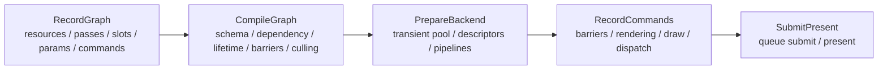

# RenderGraph 后续开发路线图

研究日期：2026-05-05

适用范围：Windows 桌面端、Vulkan 1.4、C++23、single graphics queue、dynamic rendering、synchronization2、VMA、Slang。

本文是 `docs/planning/next-development-plan.md` 的 RenderGraph 专项约束和技术映射，不再维护另一套完整开发顺序。
完整阶段计划、editor 接入顺序、asset/material/scene 路线和高级能力暂缓池只以
`docs/planning/next-development-plan.md` 为准。本文只记录 RenderGraph 相关的一手资料、已完成状态、专项设计原则、
后续能力映射和验证门禁。日常执行仍以 `docs/architecture/flow.md` 记录真实流程，以
`docs/workflow/review.md` 记录提交门禁。

## 资料结论

| 资料 | 关键结论 | Asharia Engine 采用方式 |
| --- | --- | --- |
| Khronos Vulkan synchronization guide: https://docs.vulkan.org/guide/latest/synchronization_examples.html | layout transition、stage mask、access mask 必须匹配真实 producer/consumer。`vkCmdPipelineBarrier2` 是当前项目正确的主路径。 | 每新增一个 `RenderGraphImageState`，必须同步补 `rhi_vulkan_rendergraph` 映射和 smoke 校验。 |
| Vulkan synchronization spec: https://docs.vulkan.org/spec/latest/chapters/synchronization.html | 同步分 execution dependency、memory dependency 和 image layout transition，不能只看 layout 名字。 | RG compiler 输出抽象 transition，Vulkan adapter 负责 stage/access/layout 细节，不能把 Vulkan 类型泄漏到 `rendergraph`。 |
| Khronos unified image layouts: https://www.khronos.org/blog/so-long-image-layouts-simplifying-vulkan-synchronisation | 新式 unified image layout 能减少 layout 数量，但需要明确 feature/extension 和设备支持。 | 作为后续优化观察项；当前先保持显式精确 layout，避免过早依赖新能力。 |
| Vulkan object destruction refpages: https://docs.vulkan.org/refpages/latest/refpages/source/vkDestroyImage.html and https://docs.vulkan.org/refpages/latest/refpages/source/vkDestroyImageView.html | `VkImage` / `VkImageView` 销毁前，所有引用它们的已提交命令必须完成。 | transient wrapper 不在下一帧准备阶段直接析构旧 Vulkan 对象，而是挂到 `VulkanFrameLoop` 的 fence/epoch deferred deletion。 |
| Vulkan image barrier refpage: https://docs.vulkan.org/refpages/latest/refpages/source/VkImageMemoryBarrier2.html | `oldLayout = VK_IMAGE_LAYOUT_UNDEFINED` 表示不保留旧内容，适合 discard 型 transient 复用。 | pooled transient image 每次被重新 acquire 后仍从 RG 的 `Undefined` 初始状态开始 transition，不依赖上一帧内容。 |
| Vulkan buffer barrier refpage: https://docs.vulkan.org/refpages/latest/refpages/source/VkBufferMemoryBarrier2.html | buffer barrier 表达 buffer range 的内存依赖，stage/access 仍需匹配真实 producer / consumer。 | `rhi_vulkan_rendergraph` 先把 RG buffer `TransferRead`、`TransferWrite`、`HostRead`、`ShaderRead(fragment/compute)` 与 `StorageReadWrite(compute)` 映射为 `VkBufferMemoryBarrier2` 字段；offset/size 由录制侧按实际绑定范围提供。 |
| Vulkan pipeline cache refpages: https://docs.vulkan.org/refpages/latest/refpages/source/vkCreatePipelineCache.html and https://docs.vulkan.org/refpages/latest/refpages/source/vkCreateGraphicsPipelines.html | `VkPipelineCache` 可传给 graphics pipeline creation，让实现复用 pipeline 创建数据。 | RHI 提供 `VulkanPipelineCache` RAII wrapper；renderer 仍保留引擎侧 key/counter，smoke 验证每帧复用而不重建 pipeline。 |
| Vulkan descriptor pool/allocation refpages: https://docs.vulkan.org/refpages/latest/refpages/source/vkCreateDescriptorPool.html and https://docs.vulkan.org/refpages/latest/refpages/source/vkAllocateDescriptorSets.html | descriptor set 从 descriptor pool 分配，pool 的 `maxSets` 与 `pPoolSizes` 定义容量边界，分配失败通过 `VkResult` 返回。 | RHI 先提供单 pool `VulkanDescriptorAllocator` facade 和 counters；后续再演进到 per-frame/per-flight arena。 |
| Vulkan buffer creation refpage: https://docs.vulkan.org/refpages/latest/refpages/source/vkCreateBuffer.html | buffer 是显式创建的 Vulkan object，创建失败必须通过 `VkResult` 传播；usage/size 是后续绑定和命令合法性的基础。 | `VulkanBuffer` 继续作为 buffer + VMA allocation facade，并记录 create/upload/readback counters 供 smoke 验证。 |
| Vulkan debug utils refpages: https://docs.vulkan.org/refpages/latest/refpages/source/VK_EXT_debug_utils.html and https://docs.vulkan.org/refpages/latest/refpages/source/vkCmdBeginDebugUtilsLabelEXT.html | `VK_EXT_debug_utils` 是 instance extension，可给 command buffer 区间打 label，外部 capture/profiler 能按 label 组织命令。 | context 加载 command label 函数，frame loop 提供 RAII label scope；renderer-basic-vulkan 以 RenderGraph pass name 标记 GPU command 区间。 |
| Vulkan timestamp query refpages: https://docs.vulkan.org/refpages/latest/refpages/source/vkCmdWriteTimestamp2.html and https://docs.vulkan.org/refpages/latest/refpages/source/vkGetQueryPoolResults.html | timestamp query 需要有效 timestamp bits；query 必须先 reset，再在 command buffer 中写入，结果只在 GPU 完成后读取。 | frame loop 持有 timestamp query pool，用 fence-confirmed delayed readback 解析上一帧 frame/pass duration，避免当前帧阻塞。 |
| VMA usage patterns: https://gpuopen-librariesandsdks.github.io/VulkanMemoryAllocator/html/usage_patterns.html | image/buffer allocation 应集中到 allocator facade，由用途决定 memory type。 | transient resource pool 使用 VMA，key 包含 format/extent/usage/aspect/sample count。 |
| Unity URP Render Graph introduction: https://docs.unity3d.com/Manual/urp/render-graph-introduction.html | graph 每帧 record、compile、execute；pass 显式声明资源，graph 自动处理生命周期、同步和 pass culling。 | 保持 RecordGraph、CompileGraph、PrepareBackend、RecordCommands 四段式。 |
| Unity URP custom render pass: https://docs.unity3d.com/Manual/urp/render-graph-write-render-pass.html | pass data 和 render function 分离，builder 显式声明资源读写。 | `PassSchema`、typed params、named slots 和 command summary 继续作为脚本/工具前端的共同语义。 |
| Unity URP read/write texture note: https://docs.unity.cn/Manual/urp/render-graph-read-write-texture.html | 普通 render pass 不能对同一 texture 同时读写；需要临时纹理、兼容/unsafe 路径或更明确的访问模型。 | 当前继续拒绝模糊的 `readTexture + writeColor` 同图声明；后续只通过明确 combined-access state 放开。 |
| Unity URP Render Graph Viewer reference: https://docs.unity.cn/6000.0/Documentation/Manual/urp/render-graph-viewer-reference.html | Viewer 中绿色+红色表示 pass 对资源有 read-write access 摘要，不等价于任意 texture sampled read + attachment write 都合法。 | Debug table 后续也应区分“访问摘要”和具体 Vulkan layout/access 语义。 |
| Unity unsafe pass: https://docs.unity3d.com/Manual/urp/render-graph-unsafe-pass.html | unsafe pass 能兼容旧命令路径，但会降低 graph 优化能力。 | 后续如加 native/unsafe pass，必须显式标记并禁止 aggressive reorder/alias/merge。 |
| Unreal RDG: https://dev.epicgames.com/documentation/en-us/unreal-engine/render-dependency-graph-in-unreal-engine | RDG 采用延迟执行、资源生命周期管理、barrier 规划、validation 和 transient resource 模型。 | 借鉴 validation、debug table、资源池和 transient/persistent 区分；暂缓 async compute 和复杂 alias。 |
| Blender Vulkan render graph: https://developer.blender.org/docs/features/gpu/vulkan/render_graph/ | Vulkan backend 可以把 command、资源状态和同步收集成图，再统一生成 barriers。 | `rhi_vulkan_rendergraph` 增加 backend transition debug 视图，但不改变 `rendergraph` 后端无关边界。 |
| Frostbite FrameGraph: https://www.gdcvault.com/play/1024612/FrameGraph-Extensible-RenderingArc | setup 阶段声明资源和 pass，execute 阶段只消费编译后的资源；整帧图让资源生命周期和 alias 可分析。 | 当前继续先做小闭环，不提前复制大型 feature renderer。 |
| Granite render graph deep dive: https://themaister.net/blog/2017/08/15/render-graphs-and-vulkan-a-deep-dive/ | Vulkan render graph 的价值在于自动同步、transient resource、deferred destruction、descriptor/pipeline 自动化。 | 中期优先做 deferred destruction、descriptor allocator、pipeline cache 和 transient resource pool。 |

## 当前基线

当前项目已经具备这些前提：

- `rendergraph` public API 不暴露 Vulkan 类型。
- `asharia::rhi_vulkan` 与 `asharia::rhi_vulkan_rendergraph` 已分离。
- graph transition 使用 `vkCmdPipelineBarrier2`。
- frame loop 使用 `vkQueueSubmit2`。
- dynamic rendering 已覆盖 clear、triangle、depth triangle、mesh、draw list 和 fullscreen texture。
- Slang 生成 SPIR-V、metadata 和 reflection JSON，SPIR-V 经过 `spirv-val`。
- `--smoke-rendergraph` 已覆盖 dependency sort、negative compile、schema validation、command summary、transient plan、显式 culling 和 side-effect pass。
- `--smoke-transient`、`--smoke-depth-triangle`、`--smoke-draw-list`、`--smoke-fullscreen-texture`、`--smoke-compute-dispatch` 已把 RG 结果接入真实 Vulkan 路径。

仍需修正的主要审查发现：

- 同一 pass 内同一 image 可以同时声明在多个 access group，compiler 会按固定顺序生成 transition，但 Vulkan 语义上这些使用更接近同 pass 同时访问。
- `RenderGraphImageDesc` 对 imported image 默认 `finalState = Present`，这只适合 swapchain image。
- 真实 `renderer-basic` 路径已收敛到共享 typed schema；fullscreen、transient、depth、mesh 和 draw-list 的 Vulkan callback 已通过 pass context named slots 查询 binding，`--smoke-rendergraph` 已覆盖每个 builtin pass 的负向 schema 编译路径。

## 设计原则

### 先收紧语义，再扩能力

下一阶段不优先做脚本 VM、bindless、async compute、复杂 alias 或完整 asset database。先把 RG 声明语义、Vulkan adapter 映射、后端资源生命周期和调试诊断做稳。

### 优秀案例只作为约束来源

Unity RenderGraph、Unreal RDG、Frostbite FrameGraph、Granite 和 Blender Vulkan backend 都是成熟系统。Asharia Engine 当前只借鉴它们已经被反复验证的边界：

- setup/record 阶段显式声明 pass、resource 和参数。
- compile 阶段只分析声明数据，产出依赖、lifetime、barrier 和 culling 计划。
- execute 阶段只消费编译结果，不回调脚本或重新解释 graph topology。
- 后端缓存、transient resource 和 debug/profiling 数据必须能用 smoke 或 benchmark 验证。

不把成熟案例里的高级能力直接搬进当前阶段：

- 不因为 Unreal RDG 支持 async compute，就提前设计多队列调度。
- 不因为 Frostbite/Granite 能做 transient memory alias，就提前实现 alias allocator。
- 不在 RenderGraph 专项里直接做 editor UI；editor shell / viewport 的产品顺序以
  `docs/planning/next-development-plan.md` 为准。
- 不因为 Diligent 有成熟 resource state/cache 系统，就提前抽象通用 asset/pipeline database。

每个新能力进入路线图前必须满足两个条件：当前 smoke/benchmark 能暴露它要解决的问题，并且实现后有可量化的验收标准。

### 四段式帧流程



约束：

- RecordGraph 可以使用普通 C++ 控制流，未来脚本也只能作为这一段的前端。
- CompileGraph 只分析声明数据，不创建长期 GPU 对象，不运行脚本 VM。
- PrepareBackend 从 cache/pool 获取或创建 Vulkan 对象。
- RecordCommands 只消费 compiled graph，不改变 topology。

### RenderGraph 层保持后端无关

允许在 `rendergraph` 里出现：

- abstract image/buffer state
- queue domain
- resource lifetime
- pass schema
- typed params
- command summary
- dependency/culling/lifetime/debug data

不允许在 `rendergraph` 里出现：

- `VkImageLayout`
- `VkPipelineStageFlags2`
- `VkAccessFlags2`
- `VkImage`
- `VkImageView`
- VMA allocation
- command buffer recording

### Native/unsafe pass 只作逃生口

如果后续需要兼容不可分析命令：

- pass 必须显式标记 `unsafe` 或 `native`。
- 必须声明 conservative resource access。
- 不参与 aggressive alias、merge、reorder。
- debug table 必须标出 unsafe reason。
- 默认项目 pass 不走 unsafe。

## 计划归属

完整开发顺序只维护在 `docs/planning/next-development-plan.md`。本文件中的 P0 到 P4 是已经落地或正在收尾的
RenderGraph 专项历史阶段；后续 RenderTarget、RenderView、editor viewport、buffer/storage/MRT、
compute、asset/material、lighting、scene 和 Play Session 的相对顺序不在本文重复维护。

后续与 RenderGraph 直接相关的能力按下面方式映射到总计划：

| 总计划阶段 | RenderGraph 关注点 | 本文职责 |
| --- | --- | --- |
| 13-15 通用 RenderTarget / RenderView / ImGui sampled texture contract | imported target final state、view-local graph、sampled output layout、debug table 按 view 标注 | 约束 `rendergraph` 不暴露 Vulkan handle；ImGui texture registration 只属于 editor integration，不进入 RenderGraph 专项 |
| 18 RenderGraph buffer / storage / MRT | 18.1 已落地 buffer handle、desc、lifetime、access、import/transient buffer、read/write slots、dependency/lifetime/final transition diagnostics；18.2 已补 buffer barrier 映射；18.3 已补 MRT named color slots schema 和真实 dynamic rendering multi-color clear smoke；18.4 已补 `StorageReadWrite(compute)` buffer access、schema validation、debug table 和 Vulkan stage/access 映射；后续补 pipeline desc 多 color format | 先稳定后端无关 resource/access/state，再进入 `rhi_vulkan_rendergraph` 映射要求 |
| 19 Compute dispatch baseline | 19.1 已补 `Dispatch` command summary、`builtin.compute-dispatch` schema 和 compile-only smoke；19.2 已补 compute capability 记录、compute pipeline wrapper、storage descriptor 绑定、RenderGraph buffer transition 录制和真实 `vkCmdDispatch` readback smoke | 约束 compute 仍走显式 resource access，不把任意 compute callback 当默认路径 |
| 22-24 Asset/material | material resource signature、descriptor contract、pipeline key 所需 command/slot 数据 | 保证 pass type 仍表示执行模型，不退化成业务 shader tag |
| 25 Lighting baseline | G-buffer/MRT、depth、lighting pass、HDR scene color 的 graph 语义 | 要求 lighting smoke 能解释 dependency、transition、transient lifetime |
| 27 Postprocess / temporal | history texture、ping-pong target、frame params、resize invalidation | 要求 history/imported resource final state 显式，不能默认 Present |
| 高级能力池 | async compute、bindless、transient alias、ray tracing | 仅记录进入条件；不在前置小闭环稳定前设计成默认路径 |

## P0：文档与门禁收敛

目标：让文档入口、网络资料、审查发现和下一步任务对齐。

主要任务：

- 新增本路线图并接入 `docs/README.md`。
- 在 `docs/research/sources.md` 记录本轮 RenderGraph 资料核对日期和来源。
- 在 `docs/planning/next-development-plan.md` 顶部说明：RenderGraph 专项推进以本文为准。
- 保持 `docs/workflow/review.md` 的 smoke 清单作为提交门禁源头。

验收：

- 文档中当前状态不夸大实现。
- 每个“计划”都能追溯到阶段和验收标准。
- Markdown 编码检查通过。

## P1：RenderGraph 语义修正

目标：修掉当前 P2 设计风险，使 compiler 的抽象语义和 Vulkan 执行语义一致。

### P1.1 拒绝同 pass 同 image 混合访问

问题：一个 pass 现在可以同时声明：

```cpp
pass.readTexture("source", image, RenderGraphShaderStage::Fragment)
    .writeColor("target", image);
```

这会让 compiler 顺序生成 `ShaderRead` 与 `ColorAttachment` transition，但 pass 内真实命令可能是同时使用，Vulkan barrier 不能表达“同一 pass 内前后命令”的意图，除非 command summary 也成为同步边界。

短期策略：

- 在 `validatePass()` 阶段拒绝同一 image 出现在多个 access group。
- 错误信息输出 pass name、image name、slot names 和 access group。
- 允许同一 image 在同一种 read access 下出现多次吗：第一版也拒绝，直到确实需要 alias slot。
- 未来如需要 read/write storage image、input attachment、color feedback loop，再引入明确状态和 feature query。

同 pass read/write 分类：

- **当前禁止**：`readTexture("source", image)` + `writeColor("target", image)`、`writeTransfer` + `writeColor`、`writeDepth` + `readDepthTexture` 这类跨 access group 的同图混用。它们没有说明真实意图，compiler 不能安全推导 layout、access、barrier 和命令内 hazard。
- **Attachment read/write**：depth/stencil test 会读旧 depth/stencil 并条件写入新值；color blend / loadOp=LOAD 也可能读旧 color 再写回。这应建模为明确的 attachment read/write 或 blend/load 语义，而不是普通 texture read。
- **Storage read/write**：compute 或 fragment shader 的 storage image / buffer 可读改写，但需要 `StorageReadWrite`、usage flags、stage/access、atomic/race 规则和 pass 间 barrier。
- **Framebuffer fetch / input attachment**：可读当前 render target/subpass 内容再写出，通常依赖特定 feature、layout 和 tile/subpass 语义，需要单独状态。
- **Grab/copy-to-temp**：后处理想“读当前 color 又写回当前 color”时，第一版应显式 copy/grab 到临时图，再读临时图、写目标图；未来可由 graph 自动插入。
- **Unsafe/native pass**：若后续提供逃生口，必须显式标记为不可分析或弱优化，不能绕过普通 pass 的同步和 alias 假设。

结论：Unity Render Graph Viewer 里的 read-write 颜色是资源访问摘要，不代表可以把所有同图读写折叠成一个 `readTexture + writeColor` pass。Asharia Engine 只在语义、feature 和 backend 映射都明确后放开具体 read/write 类型。

涉及文件：

- `packages/rendergraph/include/asharia/rendergraph/render_graph.hpp`
- `apps/sample-viewer/src/main.cpp`

新增 smoke：

- 同 pass `readTexture + writeColor` 应 compile 失败。
- 同 pass `writeTransfer + writeColor` 应 compile 失败。
- 同 pass `writeDepth + readDepthTexture` 应 compile 失败。

当前状态：

- 已在 `validatePass()` 路径拒绝同一 pass 内同一 image 多次声明。
- `--smoke-rendergraph` 已覆盖 shader read + color write、transfer write + color write、depth write + depth sampled read 的负向 compile。

验收：

- `--smoke-rendergraph` 覆盖负向用例。
- 错误不会进入 pass callback。
- `python .../review_vulkan_cpp.py packages/rendergraph --fail-on warning` 无 warning。

### P1.2 Imported image final state 改为显式

问题：`RenderGraphImageDesc::finalState` 默认是 `Present`，普通 imported texture/history/depth image 忘记设置 final state 时会被 transition 到 present。

短期策略：

- `RenderGraphImageDesc::finalState` 默认改为 `Undefined`。
- `backbufferDesc()` 显式设置 `Present`。
- 对 imported image 增加 final state 校验：
  - 如果 image 被写入，并且 final state 仍是 `Undefined`，compile 失败。
  - 如果 image 从非 `Undefined` initial state 只读且 final state 是 `Undefined`，允许保持最后一次 access，或要求调用方显式选择。推荐先要求显式，减少歧义。
- transient image 仍由 graph lifetime plan 决定，不生成 final transition。

新增 smoke：

- backbuffer helper 仍产生 final transition 到 Present。
- 普通 imported texture 未显式 final state 时 compile 失败。
- 普通 imported texture 显式 final ShaderRead 时 compile 成功且不 Present。

当前状态：

- `RenderGraphImageDesc::finalState` 默认值已改为 `Undefined`。
- imported image 现在必须显式声明 final state。
- `--smoke-rendergraph` 已覆盖 missing final state 负向路径和 explicit ShaderRead final state 正向路径。

验收：

- 所有现有 Vulkan smoke 不退化。
- `formatDebugTables()` 清晰显示 imported final state。

## P2：Typed builtin passes 收敛

目标：真实 renderer 路径和 smoke 路径使用同一套 typed schema、params、slots、command summary。

优先迁移顺序：

1. `recordBasicClearFrame`
2. `recordBasicDynamicClearFrame`
3. `BasicTriangleRenderer::recordFrame`
4. `BasicTriangleRenderer::recordFrameWithDepth`
5. `BasicMesh3DRenderer`
6. `BasicDrawListRenderer`
7. `BasicFullscreenTextureRenderer`

建议内建 pass：

| Pass type | Required slots | Params | Command summary |
| --- | --- | --- | --- |
| `builtin.transfer-clear` | `target: TransferWrite` | clear color | `ClearColor` |
| `builtin.dynamic-clear` | `target: ColorWrite` | clear color | 可选 `ClearColor` |
| `builtin.transient-present` | `source: ShaderRead(fragment)`, `target: TransferWrite` | clear color | `ClearColor` |
| `builtin.raster-triangle` | `target: ColorWrite` | draw item | draw summary 后续补 |
| `builtin.raster-depth-triangle` | `target: ColorWrite`, `depth: DepthAttachmentWrite` | draw item | draw summary 后续补 |
| `builtin.raster-mesh3d` | `target: ColorWrite`, `depth: DepthAttachmentWrite` | MVP/draw params | draw summary 后续补 |
| `builtin.raster-draw-list` | `target: ColorWrite`, `depth: DepthAttachmentWrite` | draw count | draw list summary 后续补 |
| `builtin.raster-fullscreen` | `source: ShaderRead(fragment)`, `target: ColorWrite` | tint/fullscreen params | `SetShader`, `SetTexture`, `SetVec4`, `DrawFullscreenTriangle` |

实现建议：

- 提取 `renderer_basic` 的 schema registry helper，避免 `basic_triangle_renderer.cpp` 继续膨胀。
- 第一阶段仍可使用 C++ callback 执行，但 compile 必须走 schema registry。
- callback 中用 `RenderGraphPassContext` 的 typed slots 查找 binding，不直接捕获“我知道是哪张图”的假设。
- pass params 继续要求 trivially copyable，后续再升级为 typed id + alignment/version。

当前状态：

- 已新增 `asharia/renderer_basic/render_graph_schemas.hpp`，集中定义 builtin pass type、params type、POD params 和 schema registry helper。
- `recordBasicClearFrame`、`recordBasicDynamicClearFrame`、`BasicTransientFrameRecorder`、`BasicTriangleRenderer::recordFrame`、`recordFrameWithDepth`、`BasicMesh3DRenderer`、`BasicDrawListRenderer` 和 `BasicFullscreenTextureRenderer` 现在都通过共享 schema compile。
- `basic_triangle_renderer.cpp` 中 fullscreen / draw-list 的局部 schema registry 已移除，避免同一 pass schema 在多个位置漂移。
- fullscreen、transient、depth、mesh 和 draw-list 的 Vulkan callbacks 已通过 `RenderGraphPassContext` named slots 查询 binding，不再直接捕获 `source` / `depth` / `transientColor` image handle。
- `--smoke-rendergraph` 已对每个 builtin pass 覆盖 invalid slot、missing slot 和 wrong params type 负向编译路径。

验收：

- 所有 renderer smoke 都通过 schema compile。
- invalid slot / missing slot / wrong params type 都有负向 smoke。
- `basic_triangle_renderer.cpp` 至少拆出 schema/helper 文件或命名空间区域，降低继续堆叠风险。

## P3：Compiler diagnostics v2

目标：让复杂 graph 出错时能定位到 pass、image、slot 和 dependency edge。

任务：

- 多 writer 诊断：
  - 输出同一 image 的 writer 列表。
  - 区分 intentional overwrite、read-before-overwrite、ambiguous producer。
- read-before-write 诊断：
  - transient image 无 producer 直接失败。
  - imported image 从 `Undefined` initial state 读取失败。
  - imported image 从显式 initial state 读取允许，但必须在 debug table 里标出 initial read。
- cycle 诊断：
  - 失败时输出参与 cycle 的 dependency edge，而不是只说 contains a cycle。
- culling 诊断：
  - 输出 culled pass 的 producer/consumer 链路。
  - side-effect pass、写 imported image pass、unsafe pass 默认保留。
- lifetime 诊断：
  - debug table 增加 first use、last use、last access、alias eligibility。
- backend transition 诊断：
  - 在 `rhi_vulkan_rendergraph` 层格式化 `oldLayout/newLayout/stage/access/aspect`。

当前状态：

- dependency cycle 现在会输出一条实际参与环的 edge，包含 `from -> to` pass、image 和 dependency reason。
- `--smoke-rendergraph` 已覆盖两 pass / 两 image 互相读写形成的 cycle，并校验错误字符串包含 pass、image 和 edge 上下文。
- transient read-before-write 诊断现在区分“没有 writer”和“多个未来 writer 导致 producer ambiguous”，并输出候选 writer 列表。
- `--smoke-rendergraph` 已覆盖 reader 位于两个 future writers 之前的 ambiguous producer 负向路径。

验收：

- `--smoke-rendergraph` 包含 duplicate writer、cycle、ambiguous producer、invalid final state、culled producer 链路。
- 错误字符串包含 pass name 和 image name。
- debug table 可直接放进 issue/PR 说明。

## P3.5：Performance profiling substrate

目标：在进入后端生命周期和缓存优化前，先建立低侵入性能观测底座。完整技术细节见 `docs/systems/performance-profiling.md`。

任务：

- 新增 lightweight profiling 数据模型：
  - frame profile info
  - CPU scope sample
  - GPU scope sample placeholder
  - counter sample
  - fixed-capacity frame ring buffer
- 新增 `--bench-rendergraph`：
  - 支持 warmup frame count。
  - 支持 measured frame count。
  - 输出 JSONL 或 CSV 到 `build/perf/`。
  - 不改变任何 `--smoke-*` 语义。
- RenderGraph compile counters：
  - pass count
  - image/resource count
  - dependency edge count
  - transition count
  - culled pass count
  - transient image count
  - compile milliseconds
- 为后续 Vulkan timestamp 和 debug labels 预留接口，但第一版不强行接 GPU query。

第一版明确不做：

- editor performance panel。
- Tracy/Remotery/ImGui 等完整 profiler UI。
- GPU timestamp query pool。
- capture 自动化工作流。
- 跨线程 profiling aggregation。

验收：

- Release preset 下可跑 `--bench-rendergraph` 并得到 p50/p95/max。
- `rendergraph` 不依赖 Vulkan、window 或外部 profiler。
- benchmark 输出足以判断 P4 cache/lifetime 优化是否有效。

当前状态：

- `packages/profiling` 已提供 CPU scope、frame profile、counter 和 JSONL frame 输出。
- `--bench-rendergraph` 已接入 CPU-only benchmark，支持 warmup、measured frames 和 output path。
- RenderGraph compile result 已暴露 declared image count，benchmark 输出 pass/image/dependency/transition/culled/transient counters。
- GPU timestamp query pool、editor panel、capture orchestration 和 profiler UI 仍保持暂缓。

## P4：Backend lifetime and caches

目标：从“每帧现建 MVP 对象”过渡到可持续的后端资源生命周期。

执行原则：

- 每次只落一个 cache/pool/deferred lifetime 子系统。
- 每个子系统必须同时输出 hit/miss/create/reuse 或 pending/retired counter。
- 没有 counter 的 cache 不进入主线，因为无法判断它是否真的减少了每帧 churn。
- 第一版只做对象复用和延迟销毁，不做跨 resource alias、跨 queue ownership、跨线程录制或 shader hot reload。

任务：

- `DeferredDeletionQueue`
  - 以 frame index 或 fence epoch 延迟销毁 Vulkan 对象。
  - resize/recreate 时不依赖扩大范围的 queue idle，除必要 MVP fallback。
  - 当前已接入最小 RHI 队列和 `--smoke-deferred-deletion`，验证 epoch retirement、flush 和 counter。
  - `VulkanFrameLoop` 已持有队列，并把 submitted/completed epoch 接到单 in-flight fence、
    swapchain recreate 和 shutdown 路径。
  - transient `VulkanImage` / `VulkanImageView` 现在通过 `VulkanFrameRecordContext::deferDeletion()`
    进入 frame-loop retirement；`--smoke-transient` 会验证 deferred deletion enqueued/retired counter。
- `DescriptorAllocator`
  - per-frame 或 per-flight frame arena。
  - 按 descriptor set layout 分配，GPU 完成后重置。
  - 当前已接入最小 RHI `VulkanDescriptorAllocator`：先包住一个 descriptor pool，保留 `VkResult`
    错误路径，并输出 pool create / allocation call / allocated set counters。
  - `--smoke-descriptor-layout` 与 `--smoke-fullscreen-texture` 会验证 descriptor allocation 经过 allocator；
    第一版不做自动扩容或 frame reset，避免在线程/flight ownership 未固定前提前复杂化。
- `BufferUploadCounters`
  - 当前已在 RHI `VulkanBuffer` 记录 create、HostUpload/DeviceLocal/HostReadback、allocated bytes、
    upload calls 和 uploaded bytes。
  - renderer-basic-vulkan 聚合 uniform/vertex/index/storage/readback buffer stats；triangle、mesh、mesh3D、
    draw-list、descriptor layout、fullscreen 和 compute-dispatch smoke 会验证 buffer counters。
  - 第一版只做可观测性；真正的 staging buffer suballocation、device-local copy 和 fence 后回收留到 asset/material 阶段。
- `TransientResourcePool`
  - image key：format、extent、usage、aspect、sample count、mip/layer、memory domain。
  - buffer key：size、usage、memory domain、alignment。
  - 当前已接入 `VulkanTransientImagePool`：按 format/extent/usage/aspect 复用 `VkImage` + `VkImageView`，
    通过 frame-loop deferred deletion 在 GPU 完成后回池，并输出 create/reuse/release/retire counter。
  - 第一版不做 alias memory，只做 object reuse；buffer/upload pool 仍是后续任务。
- `PipelineLayoutCache`
  - key 来自 descriptor set layouts、descriptor type/count/stage visibility、push constant ranges。
- `PipelineCache`
  - engine-level key：shader pass ids、layout signature、rt formats、depth/stencil、blend、topology、vertex input、dynamic states。
  - 当前已接入 RHI `VulkanPipelineCache` wrapper，并传入 `vkCreateGraphicsPipelines`。
  - renderer-basic-vulkan 现在输出 pipeline create/reuse counter；triangle/depth/mesh/mesh3D/draw-list/fullscreen
    smoke 会验证同一 renderer 三帧内只创建一次 pipeline，后续复用。
  - `VkPipelineCache` 不替代引擎 key；跨 renderer/global pipeline cache 和磁盘持久化仍是后续任务。
- `DebugLabels`
  - 当前已接入 `VK_EXT_debug_utils` command label 函数加载、`VulkanDebugLabelScope` 和 frame-loop label counters。
  - renderer-basic-vulkan 的 RenderGraph pass callback 现在用 pass name 标记 command buffer 区间；
    frame/dynamic/transient/triangle/mesh/draw-list/fullscreen smoke 会验证 label begin/end 配对。
- `TimestampQueries`
  - `VulkanFrameLoop` 现在创建 timestamp query pool，按 frame fence 完成点 delayed readback 上一帧结果。
  - `VulkanTimestampScope` 复用 frame/pass 名称记录 begin/end timestamp，并公开 frame/region/readback counters
    与最近一帧 region duration。
  - 当前仍是 single graphics queue / single in-flight MVP；后续 per-frame/per-flight arena 可在多帧并行时再扩展。
- `VulkanRenderTarget` / `OffscreenViewportTarget`
  - `rhi-vulkan` 现在提供通用 `VulkanRenderTarget` 和 `VulkanSampledTextureView`，负责持久
    color target 的 image/view、format、extent、usage、sampled layout 和 create/reuse/deferred deletion counters。
  - `BasicFullscreenTextureRenderer` 现在通过该 wrapper 维护一个持久 offscreen color target，把它作为
    imported RenderGraph image 写入后再以 sampled texture 合成到 backbuffer。
  - fullscreen renderer 已增加 `BasicRenderViewDesc` / `BasicRenderViewTarget` 和 `recordViewFrame()`；
    `recordFrame()` 只是 swapchain target 包装，offscreen viewport 复用同一录制路径写入 sampled target。
  - viewport target extent 已可独立于 swapchain extent；尺寸变化时旧 image view 和 image 会按当前
    frame epoch 挂入 deferred deletion，而不是在录制路径中立即销毁。
  - renderer 现在会暴露 sampled viewport target 的 image/view/format/extent/layout，作为未来 editor
    ImGui backend 调用 `ImGui_ImplVulkan_AddTexture()` 注册 texture 的最小契约；不在 RenderGraph
    或 renderer 中自建通用 UI texture handle。
  - 该路径用于验证编辑器 viewport 的核心离屏渲染前提；editor skeleton、UI shell、viewport 和多 view
    host 的产品顺序以 `docs/planning/next-development-plan.md` 为准。

验收：

- 多帧运行 fullscreen/depth/draw-list 时不重复创建长期 pipeline/layout。
- descriptor layout/fullscreen texture smoke 能验证 descriptor allocator counter。
- triangle/mesh/fullscreen/compute-dispatch smoke 能验证 buffer counter。
- frame/renderer smoke 能验证 debug label begin/end counter 配对。
- frame/renderer smoke 能验证 timestamp query delayed readback 和 `VulkanFrame` duration。
- offscreen viewport smoke 能验证持久 viewport color target 独立尺寸、resize deferred deletion、多帧复用、
  sampled target 输出和 sampled composite。
- resize 后资源销毁路径无 validation warning。
- `--smoke-resize`、`--smoke-fullscreen-texture`、`--smoke-depth-triangle`、`--smoke-draw-list`、
  `--smoke-compute-dispatch` 通过。

## 后续专项能力要求

本节只记录 RenderGraph 侧的设计要求；完整排序和提交切分见 `docs/planning/next-development-plan.md`。

### RenderTarget / RenderView

- `RenderGraphImageDesc::finalState` 对 imported target 必须显式；swapchain backbuffer helper 才设置
  `Present`。
- RenderGraph handle 只在单个 view graph 内有效；跨 view 共享资源由 resource manager 拥有后再 import。
- Debug table 后续应能显示 view name、target name、imported/transient lifetime、final state 和 sampled output
  layout。
- Editor viewport 只能消费 RenderView 输出，不把 `VkImage` / `VkImageView` 暴露到 editor-core。

### Buffer / storage / MRT

- 18.1 已新增 `RenderGraphBufferHandle`、buffer desc、buffer lifetime、buffer access、import/transient buffer
  和 named read/write slots；18.2 已新增 `rhi_vulkan_rendergraph` 的 buffer usage / transition / `VkBufferMemoryBarrier2`
  映射，当前覆盖 `TransferRead`、`TransferWrite`、`HostRead` 与 `ShaderRead(fragment/compute)`。
- Storage image/buffer read-write 必须是明确 access，不能复用模糊的 texture read + color write 组合；buffer 侧第一版已提供
  `StorageReadWrite(compute)`、transfer-read readback copy 和 host-read final state，并在
  `--smoke-rendergraph` 中验证 `TransferWrite -> StorageReadWrite(compute)`、`StorageReadWrite(compute) -> TransferRead`
  与 `TransferWrite -> HostRead` 的 stage/access 映射。
- MRT 通过 named color slots 表达，例如 `albedo`、`normal`、`material`、`velocity`，并在 schema 中声明
  可选/必需关系。
- `builtin.raster-mrt` 当前先验证两个必需 color slots 和 dynamic rendering multi-color clear；完整
  MRT graphics pipeline key、多 color format desc 和 G-buffer 语义留给 material/lighting 阶段。
- 所有新增 state 都要有 `--smoke-rendergraph` 负向用例和 `rhi_vulkan_rendergraph` 映射验证。

### Compute dispatch

- Compute pass 第一版仍使用 typed schema、params 和 command summary；`Dispatch` 命令只允许出现在
  `builtin.compute-dispatch` 一类执行模型中。当前已完成 compile-only 语义和 schema smoke，并在
  `renderer_basic_vulkan` 中接入真实 compute pipeline、storage descriptor、`vkCmdDispatch`、
  graph-modeled readback copy pass 和 readback smoke。
- `VulkanContext` 会记录 graphics queue 是否支持 compute；single graphics queue 继续作为 MVP，但
  compute renderer 创建时会显式检查 capability，不再隐式假设 graphics queue 一定支持 compute。
- Compute 阶段涉及 storage buffer/image、descriptor writes、pipeline bind point 和 dispatch barriers，
  需要独立 smoke，而不是挂在 lighting 或 material smoke 里顺手验证；当前独立入口是
  `--smoke-compute-dispatch`。

### Asset / material / lighting

- Material 阶段只把 shader/resource signature、descriptor contract、pipeline key 所需信息接入 graph
  command/slot/params；asset database、importer、editor UI 由总计划对应阶段负责。
- `pass.type` 继续表示执行模型，例如 raster draw-list、raster fullscreen、compute dispatch；RenderQueue、
  shader pass tag 和 material feature 放在 material/renderer 层，不塞进 RenderGraph 的基础调度语义。
- Lighting baseline 若采用 MRT/G-buffer，必须让 graph debug table 能解释 G-buffer writer、lighting reader、
  depth usage、HDR scene color final state 和 transient lifetime。

### Advanced graph optimization

这些能力只在 `docs/planning/next-development-plan.md` 的高级能力池进入条件满足后推进：

- transient memory alias：需要 precise lifetime、usage compatibility、barrier correctness 和 debug visualization。
- graph template cache：只有 topology 稳定且 benchmark 证明 compile 成本成为瓶颈时再做。
- async compute / multi queue：需要 queue domain、queue ownership transfer、timeline semaphore 或更强 frame scheduler。
- bindless/descriptor indexing：需要 material/texture resource model 和 feature query。
- ray tracing：需要 acceleration structure、SBT、RT pipeline、ray query/trace rays shader model 和 AS lifetime；
  当前不作为 RenderGraph 默认路径。
- unsafe/native pass：只作迁移逃生口，不作为普通 pass 的默认执行模型。

## 提交顺序来源

提交顺序不在本文重复维护。新增 RenderGraph 相关任务时，先更新 `docs/planning/next-development-plan.md` 的阶段和验收，
再在本文补专项约束；如果只改 RenderGraph 内部诊断或状态映射，本文可记录技术细节，但仍不创建第二套
全局 roadmap。

## 每阶段 Definition of Done

每个阶段完成前必须检查：

- 文档：
  - `docs/architecture/flow.md` 反映真实流程。
  - `docs/planning/next-development-plan.md` 或本文的阶段状态更新。
  - 新增 smoke 也更新 `docs/workflow/review.md`。
- 编码：
  - C/C++/PowerShell 编码符合 `docs/standards/encoding.md`。
  - 不引入 Vulkan 类型到 `packages/rendergraph`。
  - 不让 `asharia::rhi_vulkan` 依赖 RenderGraph。
  - 不在 render loop 加未注释的 `vkDeviceWaitIdle`。
- 验证：
  - `powershell -ExecutionPolicy Bypass -File tools\check-text-encoding.ps1`
  - `git diff --check`
  - `cmd /c "build\conan\clangcl-debug\Debug\generators\conanbuild.bat && cmake --preset clangcl-debug && cmake --build --preset clangcl-debug"`
  - `cmd /c "build\conan\msvc-debug\Debug\generators\conanbuild.bat && cmake --preset msvc-debug && cmake --build --preset msvc-debug"`
  - 相关 smoke 命令。

RenderGraph/同步/资源生命周期相关改动至少跑：

```powershell
build\cmake\msvc-debug\apps\sample-viewer\asharia-sample-viewer.exe --smoke-rendergraph
build\cmake\msvc-debug\apps\sample-viewer\asharia-sample-viewer.exe --smoke-transient
build\cmake\msvc-debug\apps\sample-viewer\asharia-sample-viewer.exe --smoke-frame
build\cmake\msvc-debug\apps\sample-viewer\asharia-sample-viewer.exe --smoke-dynamic-rendering
build\cmake\msvc-debug\apps\sample-viewer\asharia-sample-viewer.exe --smoke-depth-triangle
build\cmake\msvc-debug\apps\sample-viewer\asharia-sample-viewer.exe --smoke-draw-list
build\cmake\msvc-debug\apps\sample-viewer\asharia-sample-viewer.exe --smoke-fullscreen-texture
```

提交前再按 `docs/workflow/review.md` 扩展到 ClangCL 和完整清单。

## 暂缓事项

这些事项很诱人，但现在做会拉宽战线：

- 完整脚本 VM。
- 完整 asset database。
- glTF importer。
- bindless material system。
- async compute。
- transient memory alias。
- 多线程 command recording。
- shader hot reload。
- RenderDoc/timestamp profiler 全套 UI。
- 编辑器 performance panel。
- 通用 graph visualizer。
- GraphTemplateCache。

它们不是否定项，只是要等前置问题真实出现后再进入设计。触发条件应是：已有 benchmark 或 smoke 证明当前实现成为瓶颈，或者已有功能需求无法用现有小闭环表达。
