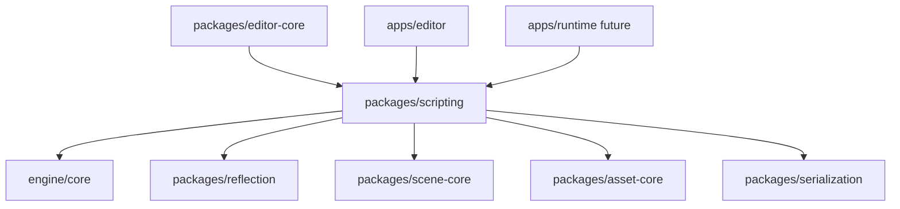
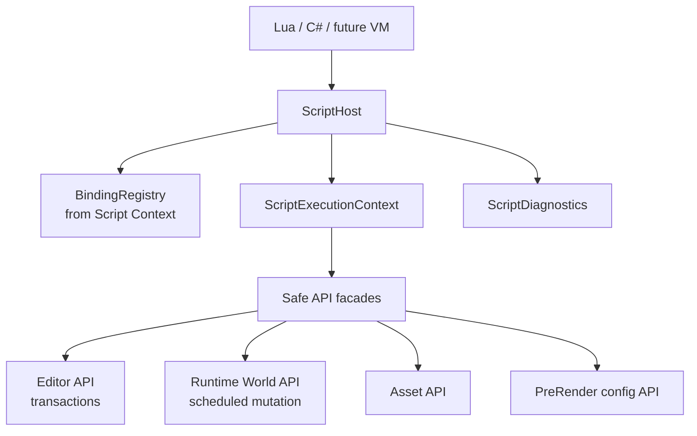
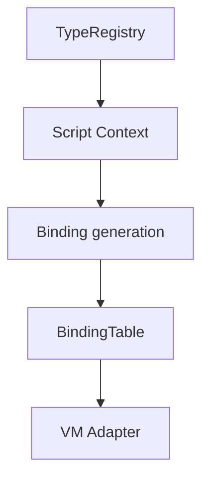
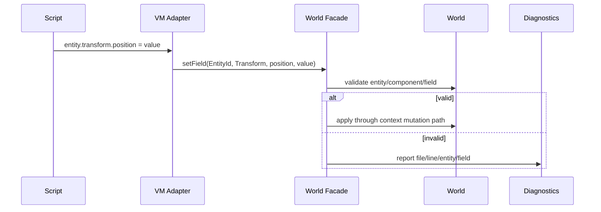
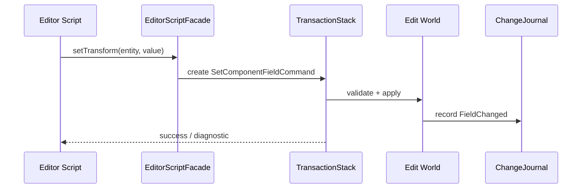
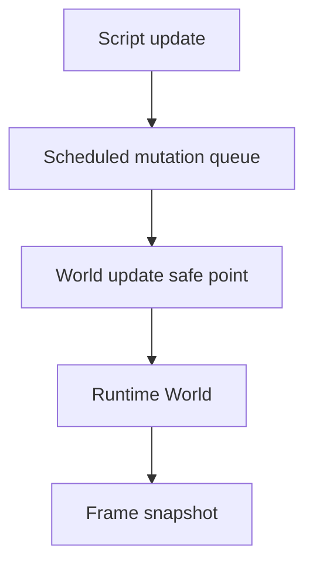
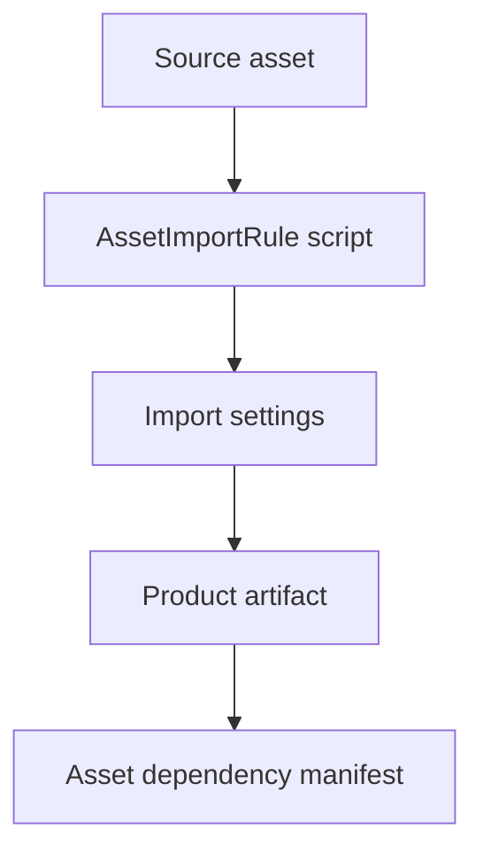
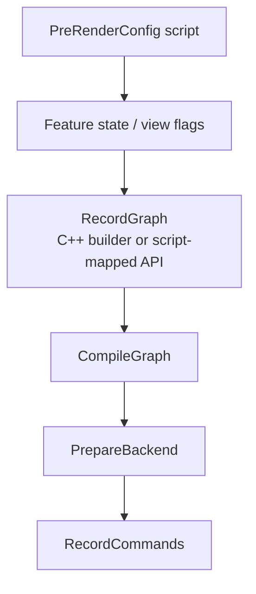
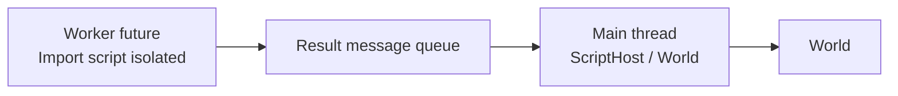

# 脚本系统架构

研究日期：2026-05-10

本文定义 Asharia Engine 后续脚本系统的边界。脚本系统不是后期给 C++ 随便绑定几个函数，也不是直接访问
Vulkan/RHI 的逃生口。它应作为一等系统，通过 reflection、scene public API、asset public API 和
editor transaction 操作引擎数据。

## 设计目标

- 脚本语言可替换或可多语言共存，核心引擎不绑定某个 VM 的对象模型。
- 脚本 API 来自显式 Script Context，不默认暴露所有 C++ 类型。
- 脚本通过 `EntityId`、`AssetGuid`、`AssetHandle<T>` 和 command API 操作引擎，不持有裸指针。
- Editor 脚本修改 scene/asset 必须走 transaction，支持 undo/redo。
- Runtime 脚本修改 world 必须在明确 update 阶段或 scheduled mutation 阶段执行。
- 脚本错误带 file、line、function、entity、component 和 field 上下文。
- 脚本可参与高层渲染配置，但不能在 RenderGraph execute 或 Vulkan command recording 阶段回调 VM。

## 非目标

第一版不做：

- 完整 C# 热重载生态。
- Visual scripting。
- 脚本直接调用 Vulkan、RHI、VMA、GLFW、ImGui backend。
- 脚本直接持有 component pointer 跨帧。
- 多线程 VM 执行。
- 脚本控制 RenderGraph 后端执行。
- 脚本 sandbox 完整安全模型。
- 网络同步。

## 一手资料结论

| 资料 | 关键事实 | 对 Asharia Engine 的约束 |
| --- | --- | --- |
| O3DE Behavior Context: https://www.docs.o3de.org/docs/user-guide/programming/components/reflection/behavior-context/ | O3DE 通过 Behavior Context 把 C++ 反射给脚本/工具，而不是让脚本随意碰底层对象。 | Asharia Engine 脚本 binding 应消费 Script Context，和 Serialize/Edit Context 分开。 |
| Godot GDExtension overview: https://docs.godotengine.org/en/stable/tutorials/scripting/gdextension/what_is_gdextension.html | Godot 把扩展 API 作为引擎和脚本/原生扩展之间的边界。 | Asharia Engine 需要稳定 facade API，避免脚本依赖内部 package 实现。 |
| Unity script serialization: https://docs.unity.cn/Manual/script-Serialization.html | Unity 脚本字段序列化、Inspector 和热重载状态强相关。 | Asharia Engine 脚本组件状态如果要保存，必须进入 reflection/serialization 规则，不能藏在 VM 私有对象里。 |
| Unreal modules/plugins: https://dev.epicgames.com/documentation/en-us/unreal-engine/unreal-engine-modules | Unreal 用模块和插件组织运行时/editor 扩展。 | Asharia Engine 脚本 API 应明确 editor-only、runtime、tool/import 上下文，避免 runtime 链接 editor。 |
| Unity URP RenderGraph pass authoring: https://docs.unity.cn/6000.0/Documentation/Manual/urp/render-graph-write-render-pass.html | 高层语言可以在 record 阶段创建 pass 并声明资源，但执行阶段由受控 command context 运行。 | Asharia Engine 脚本未来只能生成 RenderGraph 声明和命令摘要，不进入 command buffer recording。 |
| Vulkan threading guide: https://docs.vulkan.org/guide/latest/threading.html | Vulkan object 外部同步由应用负责，命令池和 descriptor pool 不能随意跨线程共享。 | 脚本不能直接创建、销毁或录制 Vulkan 对象；RHI 资源生命周期由 backend owner 管理。 |

## Package 边界

建议新增：

```text
packages/scripting
  include/asharia/scripting/
  src/
```

依赖方向：



约束：

- `scripting` 不依赖 Vulkan、ImGui、renderer implementation 或 `apps/editor`。
- `editor-core` 可提供 editor scripting facade，但 runtime 不链接 editor facade。
- 具体 VM integration 可以是子 target，例如 `asharia::scripting_lua` 或 `asharia::scripting_dotnet`。
- 核心 `scripting` package 只定义 host、context、binding、diagnostic 和 facade interface。

## 总体架构



脚本只看 facade，不看内部 package 实现。Facade 再按上下文调用 scene、asset、editor 或 renderer 前端。

## 执行上下文

脚本必须在明确上下文运行：

| Context | 能做什么 | 不能做什么 |
| --- | --- | --- |
| `EditorCommand` | 创建/删除 entity，改 component，改 asset metadata，走 transaction，可 undo | 直接改 runtime Play World，绕过 transaction，直接访问 RHI |
| `RuntimeUpdate` | 读写 Play/Runtime World，通过 scheduled mutation 修改 component | 修改 Edit World，访问 editor-only API，阻塞 asset import |
| `AssetImportRule` | 读取 source metadata，生成 import settings 或 product dependency | 修改 active World，访问 GPU backend |
| `ToolAutomation` | 批量执行 editor command，跑迁移/重命名工具 | 绕过权限写任意 runtime product |
| `PreRenderConfig` | 生成高层 view/debug/quality 参数或 RenderGraph record 前配置 | 回调 RenderGraph execute，录 Vulkan command buffer |

建议类型：

```cpp
enum class ScriptExecutionKind {
    EditorCommand,
    RuntimeUpdate,
    AssetImportRule,
    ToolAutomation,
    PreRenderConfig,
};

struct ScriptExecutionContext {
    ScriptExecutionKind kind;
    WorldId world;
    EditorContext* editor;
    AssetDatabaseView* assets;
    FrameTime time;
    PermissionSet permissions;
};
```

技术点：

- `EditorContext*` 只能在 editor context 非空；runtime host 不能构造 editor context。
- `PermissionSet` 第一版可以只做枚举检查，后续再加强 sandbox。
- `WorldId` 区分 Edit World、Play World、Preview World。
- Context 必须进入 diagnostic，便于错误定位。

## 语言选择策略

本文不强制第一门语言，但建议先按 host ABI 设计，再选择 VM：

| 语言 | 优点 | 风险 | 建议 |
| --- | --- | --- | --- |
| Lua | 集成轻，启动快，适合工具脚本、玩法原型、import rule | 静态类型和 IDE 体验弱，长期大型 gameplay 维护成本高 | 适合第一版验证 ScriptHost 和 binding |
| C#/.NET | 类型系统、IDE、生态和大型 gameplay 体验好 | 集成、热重载、调试、GC 和部署复杂 | 适合中长期，不宜在 reflection/scene 未稳时先上 |
| Python | 工具生态强，适合离线 pipeline | runtime 部署和性能不适合 gameplay 主路径 | 可用于 tool/asset processor，不建议作为 runtime gameplay 第一语言 |
| 自研 DSL | 可控 | 成本极高，生态为零 | 暂缓 |

关键约束：不要让语言选择反向决定引擎对象模型。引擎暴露 `ScriptHost` 和 `BindingRegistry`，语言 backend 是 adapter。

## Binding Registry

BindingRegistry 消费 Reflection 的 Script Context：



建议数据：

```cpp
struct ScriptFieldBinding {
    TypeId ownerType;
    FieldId field;
    std::string_view scriptName;
    ScriptAccess access;
    ScriptExecutionMask allowedContexts;
};

struct ScriptFunctionBinding {
    FunctionId id;
    std::string_view scriptName;
    ScriptExecutionMask allowedContexts;
    ScriptCallPolicy policy;
};
```

技术点：

- 只绑定 `ScriptVisible` 字段/函数。
- 绑定名可以和 C++ 字段名不同，但必须稳定。
- Editor-only binding 不能进入 runtime build 或 runtime binding table。
- 返回值统一映射 `Result<T>` 或 diagnostic，不让 C++ 异常跨 VM 边界泄漏。
- 函数 binding 要标注是否 mutates world、是否需要 transaction、是否可在 runtime 调用。

## 引用和句柄

脚本不能持有裸指针：

| C++ 对象 | 脚本表示 | 失效策略 |
| --- | --- | --- |
| Entity | `EntityRef` wrapping `EntityId` | 每次访问检查 `World::isAlive` |
| Component | `ComponentRef` wrapping `EntityId + ComponentTypeId` | 每次访问检查 entity alive 和 component exists |
| Asset | `AssetRef` wrapping `AssetGuid` or `AssetHandle<T>` | async state/fallback/error |
| World | `WorldRef` / context-owned | 不允许脚本长期保存 active mutable pointer |
| Editor transaction | command handle or scoped command builder | context 结束后失效 |

示例：

```cpp
struct ScriptEntityRef {
    WorldId world;
    EntityId entity;
};

struct ScriptComponentRef {
    WorldId world;
    EntityId entity;
    ComponentTypeId component;
};
```

脚本访问组件字段流程：



## Editor 脚本修改路径

Editor 脚本必须走 transaction：



规则：

- `EditorCommand` context 下 mutation 必须生成 undo payload。
- 批量脚本操作可以把多条 command 合并进一个 transaction。
- 脚本工具失败时应回滚当前 transaction。
- 脚本不能在没有 editor context 的 runtime app 调用 editor facade。

## Runtime 脚本修改路径

Runtime 脚本不走 editor undo，但仍不能任意时刻改 world：



规则：

- Runtime mutation 在 update safe point 应用。
- 如果系统正在生成 snapshot，脚本不能同时写组件。
- 第一版可以保持单线程 update，后续再引入 job safety。
- Runtime diagnostic 不包含 editor transaction，但要包含 script stack 和 entity/component。

## Asset Import 脚本

Asset import script 只处理 source metadata、import settings 和 dependency：



规则：

- Import script 不能访问 active World。
- Import script 不创建 GPU resource，只生成 product 或 metadata。
- Import script 可以返回 diagnostics 和 dependency list。
- Import result 通过 message 回到 editor/asset database。

## PreRenderConfig 与 RenderGraph

脚本可以参与高层渲染配置，但不能进入后端执行：



允许：

- 开关 debug view。
- 设置 postprocess 参数。
- 按 feature state 决定是否 record 某些 pass。
- 生成受控 command summary。

禁止：

- 在 compiled graph 中保存脚本闭包。
- RecordCommands 阶段回调 VM。
- 脚本直接调用 `vkCmd*`。
- 脚本访问 `VkImage`、`VkImageView`、descriptor set 或 command buffer。

## 脚本组件状态

脚本组件如果需要保存，必须有序列化规则：

```text
ScriptComponent
  scriptAsset: AssetGuid
  exposedFields:
    health: 100
    speed: 4.5
```

技术点：

- 脚本私有运行时状态默认不保存。
- 明确暴露的脚本字段通过 reflection/serialization 保存。
- Hot reload 时，持久字段从 World/serialized state 恢复，不依赖 VM 私有对象。
- 脚本 asset 改变时，需要重建 binding 或 instance state。

## Hot Reload 边界

第一版可只设计规则，不实现完整热重载：

- Reload script module 前先停止或暂停相关 script update。
- 保存可序列化 exposed state。
- 卸载 VM module 或重新绑定函数。
- 恢复 exposed state。
- 对失效函数、字段和类型输出 diagnostic。

不做：

- 任意栈帧恢复。
- 保留闭包内部私有状态。
- 在 command recording 中 reload。

## Diagnostics

脚本错误必须结构化：

```cpp
struct ScriptDiagnostic {
    ScriptDiagnosticSeverity severity;
    std::filesystem::path scriptPath;
    std::uint32_t line;
    std::uint32_t column;
    std::string_view functionName;
    ScriptExecutionKind context;
    EntityId entity;
    ComponentTypeId component;
    FieldId field;
    Error underlyingError;
};
```

示例：

```text
Script error:
  file: Content/Scripts/spin.lua
  line: 14
  function: update
  context: RuntimeUpdate
  entity: entity(18,4)
  component: TransformComponent
  field: rotation
  reason: entity is not alive
```

Diagnostics 去向：

- CLI smoke output
- editor console
- asset import report
- structured log
- future problem list panel

## 权限与安全

第一版先做 capability，不做强 sandbox：

```cpp
enum class ScriptPermission {
    ReadWorld,
    MutateWorld,
    EditorTransaction,
    ReadAssets,
    WriteAssetMetadata,
    FileReadProject,
    FileWriteProject,
    SpawnProcess,
    Network,
};
```

默认：

- Runtime gameplay script 不允许 spawn process、network、写 project file。
- Asset import script 允许读 source asset 和写 product cache，但不允许改 active world。
- Editor tool script 可批量改 scene/asset，但必须走 transaction/asset API。

## 线程模型

第一版：

- ScriptHost 在主线程执行。
- Editor script、runtime script 和 pre-render config 都在明确 safe point 运行。
- Asset import script 可以未来放 worker，但必须只处理隔离数据。
- VM adapter 不直接跨线程访问 World。



## 最小 smoke 建议

- `--smoke-script-metadata`：从 Script Context 构建 binding table。
- `--smoke-script-create-entity`：脚本创建 entity。
- `--smoke-script-editor-undo`：Editor script 修改 transform，undo/redo 生效。
- `--smoke-script-runtime-update`：Runtime update 脚本驱动物体移动。
- `--smoke-script-invalid-entity`：访问已删除 entity 返回 diagnostic。
- `--smoke-script-context-permission`：runtime script 调 editor-only API 失败。
- `--smoke-script-prerender-config`：脚本改 debug flag，RecordGraph 前可见，执行阶段不回调 VM。

## 审查清单

新增脚本 API 时检查：

- API 是否来自 Script Context。
- 是否 editor-only、runtime-only、import-only 或 tool-only。
- 是否需要 transaction。
- 是否会修改 World，修改时机是否合法。
- 是否暴露裸指针或 backend handle。
- 错误是否能转成 `ScriptDiagnostic`。
- 是否会进入 runtime build。
- 是否需要 cook 剥离。
- 是否线程安全，或明确主线程。

## 暂缓事项

- 完整 Lua/C# 绑定实现。
- C# domain reload。
- Visual scripting。
- 脚本 package manager。
- 脚本调试器。
- 脚本 profiler UI。
- 多线程脚本调度。
- 脚本驱动 RenderGraph unsafe/native pass。

这些能力应等 reflection、scene/world、editor transaction 和最小 ScriptHost ABI 稳定后再进入。
