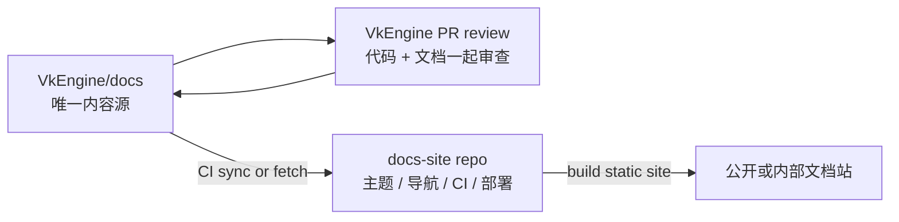

# 文档规范

本文定义项目文档的类型、目录归属、写作结构和维护规则。目标是让文档成为工程合同，而不是进度流水账：下一位工程师读完后，应该知道系统当前真实状态、设计边界、实现入口和验证方式。

## 文档体系

项目文档按读者任务分层。不要把架构、详细设计、API 参考、教程和计划混在同一篇文档里。

| 类型 | 英文名 | 目录 | 回答的问题 |
| --- | --- | --- | --- |
| 文档入口 | Documentation Index | `docs/README.md` | 应该先读什么，当前事实来源在哪里 |
| 架构文档 | Architecture Document | `docs/architecture/` | 系统怎么分层，谁拥有状态，谁能依赖谁 |
| 系统文档 | System Design Document | `docs/systems/` | 某个长期系统的模型、流程、边界和演进方向 |
| 详细设计 | Technical Design Document | `docs/architecture/`、`docs/systems/` 或专题目录 | 某个功能具体怎么实现、怎么测试、怎么拆分 |
| API 参考 | API Reference | 靠近所属系统或后续 `docs/api/` | 接口、类型、参数、返回值、错误和示例 |
| 使用指南 | Guide | `docs/workflow/` 或专题目录 | 开发者怎么完成一个具体任务 |
| 工作流文档 | Workflow Documentation | `docs/workflow/` | 构建、测试、评审、发布、工具链怎么执行 |
| 规范文档 | Standards | `docs/standards/` | 编码、命名、编码格式、文档写作等稳定规则 |
| 架构决策记录 | ADR | 专题目录或 `docs/architecture/` | 为什么做这个长期决策，拒绝了哪些方案 |
| 计划文档 | Plan | `docs/planning/` | 阶段目标、切片顺序、GitHub Project 关联 |
| 规格文档 | Specification | `docs/specs/` | 文件格式、schema、协议或稳定数据合同 |
| 研究资料 | Research Notes | `docs/research/` | 外部资料、调研依据和引用入口 |

## 权威与生命周期

文档状态服务于读者判断，不能代替 GitHub 任务状态：

| 状态 | 含义 | 维护方式 |
| --- | --- | --- |
| `current` | 描述当前代码、命令或稳定合同 | 实现变化时同 PR 更新 |
| `proposal` | 目标架构或尚未接受/落地的设计 | 明确 current/target 差异和进入门禁 |
| `accepted ADR` | 已接受的长期取舍 | 保留决策、后果；被替代时标记 Superseded 并链接新 ADR |
| `plan` | 稳定的阶段顺序或迁移门禁 | 不记录负责人、百分比、逐 PR 进度或临时 blocker |

`docs/README.md` 明确列出的 current 文档是当前事实入口；未标注状态的系统/工作流/规格文档也必须按
current 维护。目标文档必须在开头标注 `proposal`、`planned` 或等价中文，不得让读者误认为已经落地。

以下材料不进入长期文档树：

- agent 执行清单、对话审批记录和逐提交操作步骤；
- 已完成 Slice 的进度流水账、完成百分比和临时 blocker；
- 已被当前架构吸收的一次性审查快照或问题总表；
- 为发布或翻译复制出来、需要手工同步的第二套工程事实正文。

这类材料的历史证据由 Git、GitHub Issues / Project、PR 和 CI run 保存。结论已迁移到 current 文档后，
直接删除旧文件；不要建立长期 `archive/` 目录让旧内容继续参与搜索和链接。

一个主题只允许一个当前事实源。其他文档应链接该源，只补充自身范围内的所有权、数据流或验证，不复制
大段 current 状态。新增或删除稳定入口时必须同步 `docs/README.md`。

## 文档部署模型

项目采用双仓库部署模型：

- `VkEngine/docs` 保存文档源码，是唯一工程事实来源。
- 独立 docs-site 仓库只负责站点框架、主题、导航、同步脚本、CI 和发布配置。
- docs-site 仓库不得手写或修改工程事实文档的正文内容。
- 代码、CMake target、smoke、架构边界或 API 变化时，文档更新必须随 `VkEngine` 的代码 PR 一起审查。
- 发布站点时，由 docs-site CI 从完整 `VkEngine/docs` 拉取或同步内容，再生成静态网站。
- 翻译、公开筛选和站点导航属于发布投影；不得把生成或手工翻译后的正文回写为平行事实源。
- 如果公开站点不能暴露全部内部文档，筛选规则应写在 docs-site 的同步配置里，而不是在 `VkEngine/docs` 维护第二套 public 文档。

推荐数据流：



这个模型的核心约束是内容源单一。允许部署仓库有自己的首页、主题配置和站点导航，但不能把 `VkEngine/docs` 中的架构事实、API 合同、规范正文复制后长期分叉维护。

## 选择文档类型

先判断读者要完成什么任务，再选择文档形式。

- 要理解模块边界，写架构文档。
- 要实现一个功能，写详细设计。
- 要调用接口，写 API 参考。
- 要照步骤完成构建、测试、导入或发布，写使用指南或工作流文档。
- 要记录一个会长期影响系统的取舍，写 ADR。
- 要定义文件格式、schema、命令行参数或稳定数据合同，写规格文档。
- 要安排跨 PR 工作，写计划文档，并同步 GitHub Issue / Project。

## 通用写作规则

- 先写当前事实，再写计划。未落地内容必须标注 `planned`、`proposal`、`future` 或 `experimental`。
- 使用真实模块名、target 名、文件路径、命令、测试和 smoke 入口，不用泛称替代工程事实。
- 写清所有权和依赖方向。不要只写“解耦”，要写“谁不能依赖谁，应该通过哪个接口传递数据”。
- 把稳定合同和临时实现分开。临时 MVP 可以存在，但必须说明为什么临时、何时需要替换。
- 每篇设计类文档都要有验证方式：测试、构建、smoke、手动检查、profiling 或审查清单。
- 不长期维护进度流水账。已完成阶段、跨 PR 状态和阻塞同步到 GitHub Issues / Project。
- 文档改动如果改变事实来源，需要同步相关入口文档，尤其是 `docs/README.md`、架构总览、流程图和 review 门禁。

## 架构文档结构

架构文档负责描述系统形状和边界，不负责列出每个函数怎么实现。

```md
# 架构：子系统名称

## 目标
这个子系统解决什么问题。

## 当前状态
哪些已经落地，哪些是 planned / experimental。

## 所有权
谁拥有 public API、runtime state、editor state、生成数据和外部资源。

## 依赖边界
允许依赖什么，禁止依赖什么，跨层通信走哪个接口。

## 数据流
数据如何从 authoring、runtime、asset、render、tool 或 editor 流动。

## 生命周期
创建、更新、reload、shutdown 和失败清理顺序。

## 扩展点
未来功能应该从哪里接入，哪些路径不能绕过。

## 验证
测试、smoke、构建命令、手动检查和已知缺口。
```

当依赖方向、生命周期或数据流不容易用文字审查时，使用小型 Mermaid 图。图只用于解释工程关系，不用于装饰。

## 详细设计结构

详细设计负责回答“这个功能怎么落地”。它应该足够具体，让工程师能拆任务、写代码、写测试和做评审。

```md
# 详细设计：功能名称

## 背景
为什么需要这个功能。

## 目标
本次实现必须达成什么。

## 非目标
本次明确不解决什么。

## 当前约束
已有系统边界、性能要求、兼容性、平台、工具链和依赖限制。

## 总体方案
核心实现思路，以及为什么采用这个方案。

## 模块划分
新增或修改哪些模块、类、文件、target 或工具。

## 数据结构
关键结构体、字段、状态、持久化格式或配置项。

## API 设计
公开接口、输入、输出、错误和调用约束。

## 关键流程
正常流程、失败流程、边界流程和异步/并发顺序。

## 生命周期
对象如何创建、更新、释放；失败时如何清理。

## 错误处理
错误类型、可恢复路径、日志和诊断信息。

## 测试方案
单元测试、集成测试、smoke、手动验证和负向用例。

## 风险与备选方案
主要风险、拒绝的方案、退路和后续切片。
```

详细设计不要提前构造大框架。优先描述一个可合并、可验证的实现切片，并把后续扩展写成明确的 follow-up。

## API 参考结构

API 参考文档只描述接口合同，不重复大段设计背景。它应该稳定、可查、可复制。

````md
# API Reference：模块名称

## `TypeName`

类型职责、所有权和生命周期约束。

### `functionName(args)`

接口作用。

参数：

| 参数 | 类型 | 必填 | 说明 |
| --- | --- | --- | --- |

返回：

| 类型 | 说明 |
| --- | --- |

错误：

| 错误 | 条件 | 调用方处理 |
| --- | --- | --- |

示例：

```cpp
// 最小可工作的调用示例
```
````

API 参考中的示例必须尽量短，只展示合同用法。复杂流程放到 Guide 或详细设计。

## ADR 结构

ADR 用来记录长期技术取舍，不用于记录日常实现细节。

```md
# ADR-XXX：决策标题

## 状态
Accepted / Proposed / Superseded / Deprecated。

## 背景
当前问题和约束。

## 决策
选择什么方案。

## 备选方案
考虑过哪些方案，为什么拒绝。

## 后果
收益、代价、迁移成本和长期维护影响。

## 验证
用哪些测试、构建、smoke 或审查证明决策有效。
```

如果一个文档只是在安排近期工作，不要写成 ADR；写计划或详细设计更合适。

## Guide 与 Workflow 结构

Guide 和 Workflow 面向执行步骤。它们应该可复制、可验证、可恢复。

```md
# 指南：任务名称

## 前提
需要的工具、环境、生成文件位置和 shell。

## 步骤
按顺序执行的命令和操作。

## 成功信号
看到什么输出或文件代表成功。

## 常见失败
错误表现、原因和恢复方式。

## 相关文档
依赖的架构、规格或 API 参考。
```

命令必须写明 shell 假设。PowerShell、`cmd /c`、Developer PowerShell 和普通终端的命令不要混写成同一段。

## 规格文档结构

规格文档定义稳定合同。它应该比详细设计更严格，比 API 参考更关注数据格式和兼容性。

```md
# 规格：格式或协议名称

## 目标
这个规格约束什么。

## 版本
当前版本、兼容规则和迁移策略。

## 数据模型
字段、类型、默认值、必填规则。

## 语义
每个字段或状态代表什么。

## 错误条件
非法输入、兼容性错误和诊断。

## 示例
最小示例和边界示例。

## 验证
解析测试、序列化测试、兼容性测试。
```

变更持久化格式或 schema 时，必须说明版本、迁移和兼容性。

## 图表规则

- 只在图能降低审查成本时使用图。
- Mermaid 图优先放在 Markdown 中，和对应文字靠近。
- 节点使用真实模块、target、类、状态或文件名。
- 箭头标注关系，例如 `owns`、`depends on`、`creates`、`submits`、`loads`、`validates`。
- 当前行为和计划行为不要混在同一张图里；计划节点必须标注 `planned`。
- 图变大后拆成上下文图、依赖图和运行流程图，不做一张巨图。

## 新增文档流程

1. 确认文档类型和读者任务。
2. 搜索已有文档，避免创建重复入口或第二套事实来源。
3. 选择最近的目录；没有稳定目录时，先放到专题目录，不急着新增顶层分类。
4. 写当前事实、边界、流程和验证方式。
5. 如果新增稳定入口，更新 `docs/README.md`。
6. 如果改变架构、包依赖、frame flow、smoke 或门禁，同步相关事实来源文档。
7. 运行文档相关验证。

## 文档验证

文档变更至少运行：

```powershell
powershell -ExecutionPolicy Bypass -File tools\check-text-encoding.ps1
git diff --check
```

如果文档声明了构建、测试、smoke 或工具命令，修改者应在当前环境可行时运行对应命令；不能运行时必须在 PR 或变更说明里写清原因。

## 命名规则

- 文件名使用小写短横线，例如 `frame-loop-threading.md`。
- 架构文档标题使用 `# 子系统名称` 或 `# 架构：子系统名称`。
- 详细设计标题使用 `# 详细设计：功能名称`。
- API 参考标题使用 `# API Reference：模块名称`。
- ADR 文件名使用稳定序号或明确主题，例如 `adr-001-header-split.md`。
- 文档中的代码标识符、路径、命令和 target 名保持原文，不翻译。

## 维护边界

文档不是实现的替代品。文档可以定义合同、解释设计和列出验证，但不能声称代码已经支持尚未落地的行为。

当代码和文档冲突时，先确认真实行为，再选择修代码或修文档。不要用计划文档覆盖当前事实来源。
