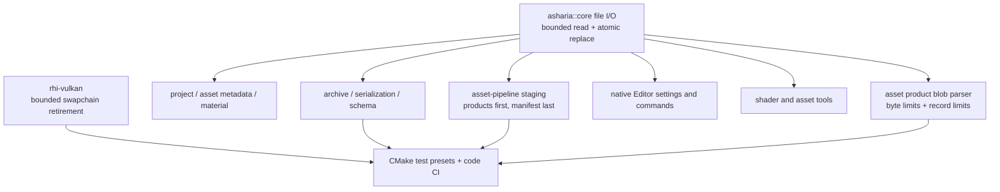

# Engine Audit Hardening Design

Status: approved in conversation on 2026-07-10; written specification pending final review.

## Scope

This design resolves the native-engine findings from the full code and architecture audit. It covers:

- one shared, platform-independent contract for bounded file reads and atomic file replacement;
- domain staging for asset products and manifests;
- bounded parsing for asset product blobs before any allocation based on file-controlled counts;
- migration of native engine, asset, persistence, shader-tool, and native Editor file I/O;
- bounded swapchain retirement during synchronous recreation;
- deterministic tool fingerprints for asset cache keys;
- Vulkan enumeration retry behavior;
- test-enabled CMake presets and native code CI.

`apps/studio`, managed code, Avalonia, and the Studio native bridge are explicitly outside this design.

## Goals

1. A failed write must not truncate or partially replace the previous visible file.
2. A successful atomic write must make the complete new file visible in one replacement operation.
3. File-controlled sizes and record counts must be rejected before they can cause oversized allocations or unchecked arithmetic.
4. Asset product batches must publish their manifest only after every referenced product is durable enough to read and has been validated.
5. Repeated swapchain recreation must not retain one complete swapchain resource set per resize until shutdown.
6. Identical tool binaries on different machines must produce the same tool fingerprint.
7. A clean checkout must have an explicit build-and-test path that actually compiles and runs native tests under MSVC and ClangCL.

## Non-goals

- A general database, write-ahead log, or cross-file ACID transaction manager.
- Asynchronous or lock-free swapchain recreation.
- A new asset database, cache garbage collector, or distributed cache protocol.
- Cryptographic authenticity or trust validation for local asset products.
- Refactoring large renderer, sample-viewer, or Editor source files unless a touched responsibility must move to enforce a boundary in this design.
- Studio or managed-editor changes.

## Architectural principles

- `engine/core` owns only stable cross-package file primitives. It does not know about JSON, assets, manifests, shaders, Vulkan, or Editor state.
- Domain packages choose their own explicit byte and record limits. Core enforces the requested limits but does not invent domain policy.
- Atomic visibility is a single-file primitive. Asset batch consistency remains an asset-pipeline responsibility.
- Existing public package APIs remain the primary entry points. Callers do not bypass their package to call private staging or parsing helpers.
- Failure before the replacement operation leaves the previous target visible. A successful replacement is the commit point.
- The implementation remains synchronous because the current frame loop and asset product execution are synchronous.

## System structure



## 1. Core bounded file I/O

### Public contract

`engine/core` gains a focused `asharia/core/file_io.hpp` API:

```cpp
namespace asharia::core {

struct FileReadLimits {
    std::uint64_t maxBytes{};
};

struct AtomicFileWriteOptions {
    bool flushFileBuffers{true};
};

[[nodiscard]] Result<std::vector<std::byte>>
readFileBytes(const std::filesystem::path& path, FileReadLimits limits);

[[nodiscard]] Result<std::string>
readFileText(const std::filesystem::path& path, FileReadLimits limits);

[[nodiscard]] VoidResult
writeFileBytesAtomically(const std::filesystem::path& path,
                         std::span<const std::byte> bytes,
                         AtomicFileWriteOptions options = {});

[[nodiscard]] VoidResult
writeFileTextAtomically(const std::filesystem::path& path,
                        std::string_view text,
                        AtomicFileWriteOptions options = {});

} // namespace asharia::core
```

`maxBytes == 0` is invalid. Every production caller must state a limit through a named domain constant. This prevents an apparently convenient unlimited overload from recreating the original problem.

### Read behavior

1. Open the file without modifying it.
2. Query its current size and reject it if it exceeds `maxBytes`, `SIZE_MAX`, or the stream representation range.
3. Allocate only after those checks.
4. Read exactly the measured byte count.
5. Probe for an additional byte so a file that grew after the size query is rejected instead of silently accepted beyond the limit.
6. Return Core-domain errors containing the operation and path, without embedding file contents.

The read API protects allocation size and complete-read semantics. Text encoding validation remains the responsibility of the parser consuming the returned string.

### Atomic write behavior

The target parent directory must already exist. Core does not create directories because directory ownership and permissions belong to the caller.

1. Create a unique temporary file in the target directory with exclusive creation.
2. Write all bytes, handling partial writes.
3. Flush file buffers when requested.
4. Close the temporary file and treat a close failure as a write failure.
5. Copy relevant permissions from an existing target where the platform supports this without weakening the replacement guarantee.
6. Atomically replace the target using a same-volume operation.
7. Remove the temporary file on every failure before the replacement commit point.

Windows uses `CreateFileW(..., CREATE_NEW)`, `WriteFile`, `FlushFileBuffers`, and `ReplaceFileW` or `MoveFileExW` with replacement and write-through flags. POSIX uses `open` with `O_CREAT | O_EXCL`, a complete `write` loop, `fsync`, `close`, and `rename` in the same directory. Platform implementation files are selected by CMake; callers see no platform types.

The guarantee is atomic visibility plus flushed file contents before replacement. The design does not promise a general cross-file power-loss transaction or a portable parent-directory durability guarantee.

### Testability

The public API has no test hooks. Private backend operations live behind an `engine/core/src` function table used only by package-local tests. Tests inject failures at create, partial write, flush, close, and replace stages and prove:

- the old target remains byte-for-byte unchanged before the commit point;
- the temporary file is removed;
- success exposes only the complete new file;
- limits reject oversized and growing inputs before unbounded allocation.

No other package includes the Core private test/backend header.

## 2. Asset product staging and publication

`asset_product_execution` already prepares every product in memory before it writes output. The strengthened path adds an asset-owned staging phase under the product output root:

```text
<product-output-root>/.asharia-product-staging/<unique-operation-id>/
  products/...
  products.aproducts.json
```

The operation is:

1. Prepare every product and the complete manifest in memory.
2. Write all products into the unique staging directory using bounded, complete writes.
3. Reopen each staged product with an explicit byte limit and validate its size and stored hash.
4. Write and re-read the staged manifest, then validate its schema and product records.
5. Atomically publish each product to its final content-addressed path.
6. Atomically publish the manifest last.
7. Remove the operation staging directory after success or an ordinary handled failure.

The manifest is the visibility boundary. If publication stops after some products are committed but before the manifest, the previous manifest remains valid and the newly published content-addressed products are unreferenced. They are safe orphans, not partially visible state. Cache-wide orphan collection is a separate concern and is not added here.

Concurrent operations use distinct staging directories and atomic final-file replacement. This design does not add a global asset-pipeline lock; callers that concurrently publish the same manifest still require the existing single-owner execution policy.

## 3. Bounded product blob parsing

### File limits

Asset product file reads use `core::readFileBytes` with explicit options. The default production options are public and overridable for tests:

```cpp
struct AssetProductBlobReadLimits {
    std::uint64_t maxProductBytes{512ULL * 1024ULL * 1024ULL};
    std::uint32_t maxTextureMipRecords{32};
    std::uint32_t maxShaderProperties{4096};
    std::uint32_t maxShaderPasses{1024};
    std::uint32_t maxShaderBindings{16384};
    std::uint32_t maxShaderEntries{4096};
};
```

The existing read entry points accept an optional limits object so normal callers retain concise syntax while tests can force boundary cases.

### Record validation

Every file-controlled count is validated before `reserve`, `resize`, multiplication, or indexed field construction:

- it must fit `std::size_t`;
- it must not exceed its domain hard limit;
- it must be supportable by the number of header lines and the minimum fields required for one record;
- texture mip count must also be compatible with the declared dimensions;
- byte offsets and sizes use subtraction-based range checks to avoid overflow;
- compiled shader payload sizes must be bounded by the product byte span before decoding or copying.

A single private `asset_product_blob_limits` helper performs these checks for texture, shader-authoring, and compiled-reflection records while preserving Asset-domain diagnostics. Core provides bounded bytes and checked representation; asset-pipeline owns record meaning.

Malformed products always return `Result` errors. The parser does not catch global process-wide allocation exhaustion, but a file within the configured limits cannot request an allocation derived from an unchecked count.

## 4. File I/O migration

Production file I/O migrates in dependency order:

1. `archive` and `serialization` replace direct truncating streams and unbounded reads with Core I/O.
2. `schema` adopts bounded reads.
3. `project-core`, `asset-core`, `material-instance`, and asset product manifests inherit safe JSON writes and select named read limits.
4. `asset-pipeline` replaces product, tool-output, SPIR-V, reflection, and generated-source helpers.
5. Native Editor settings and import-settings commands replace their local read/write helpers. A command that reports write failure therefore leaves the prior metadata visible, so transaction rollback no longer starts from a corrupted current command.
6. Native shader and asset command-line tools use atomic output writes when replacing user-requested output files.

Package-local smoke fixture writers may remain simple direct writers when they only create new temporary test files. Production paths and tests specifically exercising the public file contract must use the shared implementation.

Each domain declares its limit next to its file format contract. Limits are named constants and appear in diagnostics when exceeded.

## 5. Swapchain retirement

The current frame loop performs synchronous recreation by waiting for the in-flight fence and then `vkQueueWaitIdle` on the graphics/present queue. The new design keeps that synchronization model and removes unbounded lifetime retention.

Recreation follows this sequence:

1. Wait for the frame fence.
2. Wait for the graphics/present queue to become idle and handle its `VkResult`.
3. Retire completed deferred frame work.
4. Move the current swapchain, image views, and render-finished semaphores into one local old-resource owner.
5. Call `vkCreateSwapchainKHR` with the old swapchain handle. The old swapchain is treated as retired after this call whether creation succeeds or fails.
6. Construct and validate all new swapchain resources.
7. Install the new resource set only after it is complete.
8. Destroy the local old-resource set before returning.

Any partially created new resource set is destroyed on failure. The member state remains empty and a later recreation retries with no old swapchain. `retiredSwapchainResources_` and shutdown-only bulk retirement are removed.

`VulkanSwapchainRetirementStats` records retired, destroyed, and pending resource-set counts. The synchronous design requires `pending == 0` after every completed recreate call. Repeated-resize smoke tests assert this invariant.

This design deliberately does not introduce `VK_EXT_swapchain_maintenance1`, present fences, or asynchronous WSI retirement. Those are appropriate only when recreation stops waiting for queue idle.

## 6. Deterministic tool fingerprints

Tool identity no longer hashes an absolute installation path or modification timestamp. The fingerprint contains:

- a normalized executable basename;
- the executable byte size;
- the existing engine-standard streaming 64-bit content hash of the executable bytes.

The executable is read in bounded chunks rather than loaded as one allocation. Failure to resolve or hash a required tool produces an Asset-domain planning diagnostic; it does not silently fall back to path or timestamp identity.

This makes copied identical binaries produce the same fingerprint across machines while remaining consistent with the current 64-bit product-key model. Cryptographic authenticity is outside scope.

## 7. Vulkan enumeration robustness

All Vulkan count-then-fill enumerations used by the context and frame loop share one retry rule:

1. Query the count.
2. Allocate for that count.
3. Fill the array.
4. Resize to the returned count on success.
5. Repeat from the count query on `VK_INCOMPLETE`.
6. Return contextual Vulkan errors for every other result.

The change covers surface formats, present modes, physical devices, instance layers/extensions, and device extensions. It follows the existing `getSwapchainImages` behavior and does not introduce a generic Vulkan loader abstraction.

## 8. Build and CI gates

### Presets

`CMakePresets.json` gains test-specific configure presets with separate binary directories:

- `msvc-debug-tests` with `ASHARIA_BUILD_TESTS=ON`;
- `clangcl-debug-tests` with `ASHARIA_BUILD_TESTS=ON` and clang-tidy enabled.

Matching build and test presets reference those configure presets. Existing application presets remain test-off for normal iteration.

### Clang diagnostics

The current test-only clang-tidy warnings are fixed before enabling warnings-as-errors for the ClangCL test gate. The gate covers production and test translation units. Suppressions are allowed only for a documented false positive with the narrowest possible scope.

### GitHub Actions

A Windows code-quality workflow runs for pull requests and pushes to `main` when native source, CMake, scripts, or workflow files change. It performs:

1. checkout;
2. Conan/bootstrap setup required by repository policy;
3. encoding verification;
4. `git diff --check`;
5. package/asset boundary checks and the Vulkan review script;
6. MSVC test configure and build;
7. MSVC CTest;
8. ClangCL test configure and build with clang-tidy;
9. ClangCL CTest.

GPU/window smoke tests remain a documented local pre-commit gate because hosted Windows runners do not provide the required Vulkan presentation environment. CI must not claim to cover them.

## 9. Error handling and observability

- Core file errors identify operation, path, platform error, and whether replacement had reached the commit point.
- Asset staging diagnostics identify source, product key, staged path, final path, and publication phase without exposing file contents.
- Limit diagnostics report the observed value and configured maximum.
- Swapchain errors preserve `VkResult` names and the failed recreation phase.
- No `VkResult` is intentionally ignored. Destructors that cannot return log a failure and continue best-effort cleanup.

## 10. Verification matrix

| Area | Required evidence |
| --- | --- |
| Atomic file write | Package-local failure-injection tests for create/write/flush/close/replace; old-file preservation; temp cleanup; complete replacement |
| Bounded read | Exact-limit success, over-limit rejection, growth-after-size-query rejection, empty-file behavior |
| Archive and domain migration | Existing archive/schema/project/asset/material/persistence tests plus explicit overwrite-failure regression tests |
| Asset staging | Multi-product success; staged hash mismatch; product publication failure; manifest publication failure; old manifest remains readable |
| Product blob parsing | Tiny files with maximal counts; every count at limit and one above; offset/size overflow; compiled payload size mismatch |
| Swapchain | Existing resize smoke plus repeated recreation asserting retirement pending count remains zero |
| Tool fingerprint | Same bytes at different paths/timestamps produce identical fingerprints; one-byte change produces a different fingerprint |
| Vulkan enumeration | Injected `VK_INCOMPLETE` retry tests where seams exist, plus Vulkan review and runtime smokes |
| Presets and CI | Clean test binary directories configure, build, and run every registered native CTest under both compilers; the current 22-test baseline plus all tests added by this work must pass |
| Repository gate | Encoding check, `git diff --check`, standard MSVC and ClangCL builds, and all non-Studio native smokes |

## 11. Delivery slices

The implementation is divided into independently reviewable slices:

1. Core bounded/atomic file I/O and Core tests.
2. Archive/domain migration and native Editor transaction regression coverage.
3. Asset staging, bounded blob parsing, and deterministic tool fingerprints.
4. Swapchain bounded retirement and Vulkan enumeration retries.
5. Test presets, warning cleanup, CI workflow, and documentation updates.

Each slice must compile and pass its focused tests before the next slice begins. Commits use the repository's conventional commit style. No slice may depend on Studio changes.
