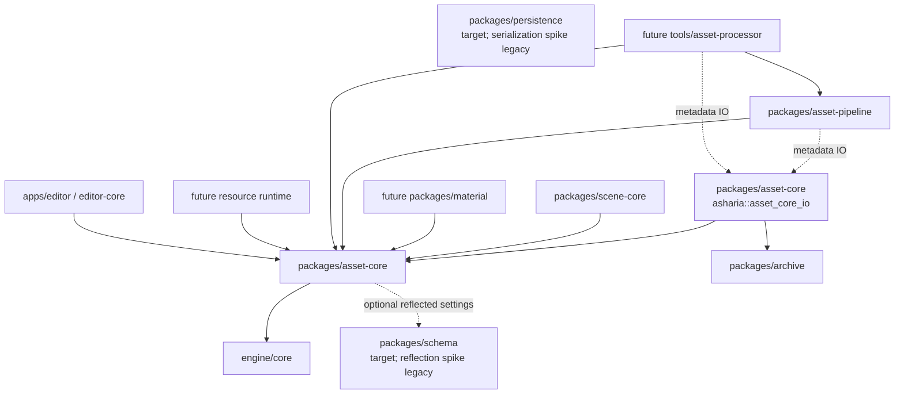
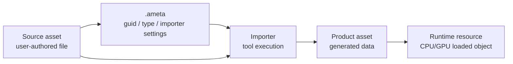

# Asset-core 架构与基线计划

资料核对日期：2026-05-12

本文定义 `packages/asset-core` 的第一版边界、资料依据、数据模型和实施切片。它补齐
`docs/architecture/engine-systems.md` 中提到的 asset pipeline 前置设计，用来支撑后续 mesh/texture
resource、material、asset browser、scene persistence 和 scripting metadata，但第一版不做完整
AssetDatabase、不做 editor UI、不做 GPU resource owner。

核心结论：`asset-core` 先负责稳定身份、source metadata、import settings、product/cache key、依赖摘要和
runtime-safe asset handle。文件修改监听、source hash、metadata IO、import 调度、product cache manifest
和 dependency invalidation 由独立 `asset-pipeline` / `asset-processor` 逐步承担；真实 importer、GPU upload、
shader/material pipeline key、editor browser 和热重载分别在后续 package 或工具层接入，不能反向污染
`asset-core`。

## 资料结论

| 来源 | 关键事实 | 对 Asharia Engine 的约束 |
| --- | --- | --- |
| Unity Asset Database: https://docs.unity.cn/Manual/AssetDatabase.html | Unity 把 source asset、metadata、artifact/cache 和 dependency 作为 asset pipeline 的核心边界。 | Asharia Engine 也应把用户源文件、`.ameta` 元数据和 generated product cache 分开；runtime handle 不保存 source path。 |
| Unity Asset Metadata: https://docs.unity.cn/Manual/AssetMetadata.html | Unity 使用每个 asset 对应的 metadata 文件保存 GUID 和 importer settings。 | 第一版采用 sidecar `.ameta` 保存稳定 `AssetGuid`、asset type、importer id/version 和 import settings hash。 |
| O3DE Asset Processor: https://docs.o3de.org/docs/user-guide/assets/asset-processor/ | Asset Processor 监控 source assets，生成 product assets，并维护 source/product/dependency 关系。 | `asset-core` 只定义 source record、product record 和 dependency graph 数据；未来 `tools/asset-processor` 才负责执行 import。 |
| Godot import process: https://docs.godotengine.org/en/stable/tutorials/assets_pipeline/import_process.html | Godot 保存 source 旁的 import metadata，并把 imported result 放入隐藏 cache。 | Asharia Engine 的 generated product 不提交到项目源目录；开发期可放在 `build/asset-cache/`，未来项目可放 `.asharia/cache/`。 |
| Unreal asynchronous asset loading: https://dev.epicgames.com/documentation/en-us/unreal-engine/asynchronous-asset-loading-in-unreal-engine | Unreal 使用 soft reference / path 让资源引用不等于立即加载对象。 | `AssetHandle<T>` 是稳定引用，不是 loaded pointer；加载状态和 fallback resource 由 resource/asset manager 处理。 |

## 设计目标

- 为所有可持久化 asset 提供稳定 `AssetGuid`。
- 明确 source asset、metadata、import settings、product asset 和 cache 的边界。
- 让 scene、material、script 和 editor 保存稳定 asset reference，而不是保存路径、runtime pointer 或 GPU handle。
- 允许同一 source 在不同 target platform、import settings、tool version 下生成不同 product。
- 为后续 importer、watcher、hot reload 和 dependency invalidation 留出数据模型。
- 第一版能用 package-local smoke tests 验证，不强制改 `apps/sample-viewer/src/main.cpp`。

## 非目标

第一版不做：

- 完整 editor Asset Browser。
- 文件系统 watcher 和后台导入线程。
- glTF、PNG、DDS、mesh、texture 等具体 importer。
- GPU buffer/image 创建、staging allocator 或 Vulkan upload。
- async streaming、reference counting 或 fallback resource 实现。
- 跨项目 package registry 和 marketplace。
- 二进制 cooked asset 格式。
- 自动 shader/material pipeline database。

这些能力必须等 identity、metadata、product key 和 dependency model 稳定后逐步接入。

## Package 边界

建议第一版目录：

```text
packages/asset-core/
  CMakeLists.txt
  asharia.package.json
  include/asharia/asset_core/
    asset_guid.hpp
    asset_type.hpp
    asset_handle.hpp
    asset_metadata.hpp
    asset_metadata_io.hpp
    asset_catalog.hpp
    asset_product.hpp
  src/
    asset_guid.cpp
    asset_metadata_io.cpp
    asset_catalog.cpp
    asset_product.cpp
  tests/
    asset_core_smoke_tests.cpp
```

依赖原则：

- `asharia::asset_core` 第一阶段只依赖 `asharia::core`。
- `.ameta` 文本 IO 放在同 package 的可选 `asharia::asset_core_io` target 中；该 target 依赖
  `asharia::asset_core` 和 `asharia::archive`，但 identity/handle/catalog 头文件不强制依赖 JSON 或
  persistence 实现。
- `asharia::asset_pipeline` 第一阶段只提供显式 source/.ameta 条目的 metadata discovery 和诊断；
  public API 只依赖 `asset-core`，实现内部通过 `asset_core_io` 读取 `.ameta`，不拥有 watcher、importer、
  product cache 或 GPU upload。
- `asset-core` 不依赖 renderer、RHI、RenderGraph、editor、ImGui、script runtime 或具体 importer。
- `apps/editor`、`packages/scene-core`、`packages/material` 和 `packages/scripting` 可以消费
  `AssetGuid` / `AssetHandle<T>`，但不能重建自己的 asset identity 系统。

建议顶层依赖：



### asset-pipeline / asset-processor

为了避免后续 editor 文件修改更新逻辑散落到 UI 或 runtime，单独记录未来 owner：

- `packages/asset-pipeline`：当前已落地 deterministic source tree scan baseline、metadata discovery baseline、
  显式 source file snapshot/hash baseline、product manifest IO baseline 和 import planning baseline。source scan
  只遍历显式 source root，配对 `<source-file>.ameta` sidecar，产出 canonical sourcePath、source file path
  和 metadata path；discovery 消费显式 source/.ameta 条目，复用 `asset_core_io` 读取 `.ameta`，校验
  duplicate GUID、duplicate source path、missing/malformed metadata 和 source path mismatch，并产出
  deterministic manifest / `AssetCatalog` 输入；source snapshot 只消费显式 sourcePath + source file path，
  校验缺失、非普通文件、非规范 sourcePath 和重复 source path，并产出确定性 v1 `sourceHash`；product
  manifest IO 复用 `archive` deterministic JSON facade，记录 product key、product key hash、relative product
  path、product size 和 product hash；import planning 比较 discovered source、current source snapshot、target
  profile 和 existing product manifest，产出 cache hit 或 import request。后续再扩展 scan-to-planning bridge、
  asset-processor dry-run/product execution 和 dependency invalidation 规则。
- `tools/asset-processor`：开发期/后台进程或 CLI host。它可以使用文件 watcher 调用 `asset-pipeline`，
  执行具体 importer，写入 `build/asset-cache/` 或项目 `.asharia/cache/`，并向 editor/resource runtime
  发布 product 更新通知。
- `apps/editor` / 未来 `editor-core`：只发出 reimport、rename、move、import settings 修改等命令，并展示
  pipeline 状态和诊断；不直接扫描 source tree，不直接写 product cache。
- `asset-core`：继续保持纯身份和数据模型，不拥有 watcher、后台线程、importer、product 文件写入或热更新发布。

进入条件：

- `asset-core` 至少完成 metadata model、product key、dependency 和 catalog 切片。
- `.ameta` IO facade 已有确定性读写方案；metadata discovery baseline 可依赖 `asset_core_io`。
- editor 需要真实文件变更刷新，或 mesh/texture/material product smoke 需要稳定 import/cache 流程时，再进入
  watcher/import 调度和 product cache manifest。

## 数据边界

资产管线分成五类数据：



规则：

- Source asset 是用户编辑的源文件，例如 `.png`、`.gltf`、`.fbx`、`.slang`、`.amat`、`.ascene`。
- `.ameta` 是可提交的 metadata；它保存稳定 GUID、importer 和 import settings。
- Product asset 是 generated output；它可以被删除并重新生成，默认不提交。
- Runtime resource 是加载后的 CPU/GPU 对象；它不进入 `.ameta` 或 scene 文件。
- Product cache miss 只能触发 import 或 fallback，不应让 scene/material 引用改写 source path。

## 稳定身份

建议第一版类型：

```cpp
namespace asharia::asset {

struct AssetGuid {
    std::array<std::uint8_t, 16> bytes{};
};

struct AssetTypeId {
    std::uint64_t value{};
};

struct AssetReference {
    AssetGuid guid;
    AssetTypeId expectedType;
};

template <class T>
struct AssetHandle {
    AssetGuid guid;
};

} // namespace asharia::asset
```

规则：

- `AssetGuid{}` 全零表示 invalid。
- GUID 以 canonical lowercase UUID 文本写入 `.ameta` 和用户数据，例如
  `9f7a31a0-0b63-4d4c-9f18-bd9a0d2e9c21`。
- `AssetTypeId` 来自稳定 type name hash，例如 `com.asharia.asset.Texture2D`。
- `AssetHandle<T>` 只携带 GUID；类型约束由 `T`、metadata 和 load policy 共同校验。
- 错误诊断必须同时输出 GUID、source path、expected type 和 actual type，不能只输出 hash。

## Metadata 文件

第一版 `.ameta` 使用确定性 JSON 子集，后续可由 `packages/archive` 和 `packages/persistence` 统一读写：

```json
{
  "schema": "com.asharia.asset.metadata",
  "schemaVersion": 1,
  "guid": "9f7a31a0-0b63-4d4c-9f18-bd9a0d2e9c21",
  "assetType": "com.asharia.asset.Texture2D",
  "sourcePath": "Content/Textures/Crate.png",
  "sourceHash": "1000f00d1234cafe",
  "settingsHash": "0a43b95e39b77b67",
  "importer": {
    "id": "com.asharia.importer.texture2d",
    "version": 1
  },
  "settings": {
    "colorSpace": "srgb",
    "generateMipmaps": "true",
    "compression": "auto"
  }
}
```

规则：

- `.ameta` path 与 source path 一一对应，建议命名为 `<source-file>.ameta`。
- `sourcePath` 用于诊断、catalog 查询和 relocation，不作为引用 ID；真实引用以 GUID 为准。
- `sourcePath` 必须是 project-relative generic path，例如 `Content/Textures/Crate.png`。它不能为空，
  不能是 drive/UNC/absolute path，不能包含反斜杠、`.` / `..` segment、空 segment 或尾随 slash。
  未来 source scanner 必须先把文件系统路径转换为该 canonical 字符串，再写入 `.ameta` 或交给
  `asset-pipeline` discovery。
- `sourceHash` 和 `settingsHash` 在当前 v1 IO facade 中使用 16 位小写十六进制 `uint64` 文本；完整
  SHA-256 或平台化 content hash 等后续 asset-pipeline 再扩。
- `settings` v1 只接受 string key/value，并按文件顺序计算 deterministic settings hash；typed import
  settings 留给后续 editor/importer settings schema。
- `sourceHash`、`settingsHash` 和 `importer.version` 共同影响 product key。
- `.ameta` 可包含 editor-only import settings，但 cooked/runtime manifest 必须剥离 editor-only 字段。
- `.ameta` 不保存 runtime pointer、GPU handle、absolute build path 或 transient cache path。

## Product key 与 cache

Product cache key 至少包含：

- source asset GUID。
- asset type。
- importer id 和 importer version。
- source content hash。
- normalized import settings hash。
- target platform / profile。
- relevant tool version，例如 mesh optimizer、texture compressor、shader compiler。
- dependency hash，例如外部 include、material graph、shader include 或 nested asset。

建议类型：

```cpp
struct AssetProductKey {
    AssetGuid guid;
    AssetTypeId assetType;
    std::uint64_t importerIdHash{};
    std::uint32_t importerVersion{};
    std::uint64_t sourceHash{};
    std::uint64_t settingsHash{};
    std::uint64_t dependencyHash{};
    std::uint64_t targetProfileHash{};
};

struct AssetProductRecord {
    AssetProductKey key;
    std::string relativeProductPath;
    std::uint64_t productSizeBytes{};
    std::uint64_t productHash{};
};
```

Cache 规则：

- 开发期 engine repo 默认使用 `build/asset-cache/`，因为 `build/` 已是 generated output。
- 未来用户项目可使用 `.asharia/cache/` 或 project-local library 目录；该目录不提交。
- Product path 由 product key 派生，避免同名 source 文件冲突。
- Cache miss 可以重新 import；cache hit 必须仍校验 product key 和 product hash。
- Product record 可写入 generated manifest，不能替代 source `.ameta`。
- Product manifest v1 属于 `asset-pipeline` IO 边界，记录 `schema`、`schemaVersion` 和 `products`。
  每个 product 记录保存 GUID、asset type id、importer id/version、source/settings/dependency/target
  hash、computed product key hash、relative product path、product size 和 product hash；它不保存 editor-only
  import settings、不保存 runtime pointer 或 GPU handle。

## Catalog 与查询

第一版 `AssetCatalog` 只做只读或显式 mutable 数据表，不做后台扫描线程：

```cpp
class AssetCatalog {
public:
    Result<void> addSource(SourceAssetRecord record);
    const SourceAssetRecord* findByGuid(AssetGuid guid) const;
    const SourceAssetRecord* findBySourcePath(std::string_view path) const;
    std::span<const SourceAssetRecord> sources() const;
};
```

校验：

- 重复 GUID 不同 path 必须失败。
- 同一路径不同 GUID 必须失败，除非显式 relocation/migration。
- unknown asset type 可以保留为 opaque source record，但不能假装可加载。
- catalog 不拥有 loaded resource。
- catalog 查询是工具/editor/runtime 的共同基础，但 mutation 只能由明确的 import/scan command 进入。

## Dependency graph

依赖分两层：

- Source dependency：source asset 依赖其他 source，例如 material 依赖 texture、shader 依赖 include。
- Product dependency：product 依赖其他 product，例如 material product 依赖 shader product 和 texture product。

建议类型：

```cpp
enum class AssetDependencyKind {
    SourceFile,
    AssetReference,
    ToolVersion,
    ImportSettings,
};

struct AssetDependency {
    AssetGuid owner;
    AssetDependencyKind kind;
    AssetGuid asset;
    std::string path;
    std::uint64_t hash{};
};
```

规则：

- 依赖图用于 invalidation，不用于运行时强制同步加载。
- 循环依赖必须在 import/tool 阶段诊断。
- 缺失依赖应保留诊断，不应把 GUID 静默改成 source path。

## Runtime 引用与加载状态

`AssetHandle<T>` 不等同于 loaded resource。后续 resource runtime 可以提供：

```cpp
enum class AssetLoadState {
    Unloaded,
    Loading,
    Ready,
    Failed,
    Missing,
};

template <class T>
struct AssetLoadResult {
    AssetHandle<T> handle;
    AssetLoadState state;
    const T* resource;
};
```

规则：

- scene、material、script 保存 `AssetHandle<T>` 或 `AssetReference`。
- renderer 和 RHI 只消费已经解析好的 resource packet，不直接读 `.ameta`。
- missing asset 必须能返回 fallback resource 或明确错误；不允许崩在 render recording 阶段。
- hot reload 只能通过 asset/resource manager 发布新 product，不直接修改 live World 或 command buffer。

## 与其他系统的关系

### Schema / Persistence

- `AssetGuid`、`AssetReference` 和常见 import settings 应可被 schema/persistence 描述。
- `.ascene`、`.amat`、`.ameta` 保存 GUID 和稳定 type name，不保存 runtime pointer。
- migration 可以把旧 source path 引用迁移成 GUID，但必须保留诊断和人工修复路径。

### Scene / World

- `MeshRendererComponent` 保存 mesh/material handle。
- World snapshot 中可以携带 `AssetHandle<MeshAsset>` / `AssetHandle<MaterialAsset>`，但 renderer 接收前应解析为可用 resource 或 fallback。
- Play World 与 Edit World 可共享 GUID；不能共享 runtime pointer。

### Material / Renderer

- Material 阶段消费 `asset-core` 的 GUID、product key 和 dependency data。
- Pipeline key 仍属于 renderer/material/RHI 层；`asset-core` 只提供 shader/material source identity 和 product identity。
- GPU upload 由 resource runtime 或 renderer backend 负责，不能放进 `asset-core`。

### Editor

- Asset Browser 消费 catalog view。
- Inspector 修改 import settings 时生成 editor command，更新 `.ameta` 后触发 reimport request。
- Editor UI 不直接修改 product cache；它只请求 import、展示状态和诊断。

### Scripting

- Asset import script 可以读 source metadata、生成 import settings 或声明 dependency。
- Script runtime 使用 safe asset handle API，不获得裸 pointer 或 GPU handle。
- C# / Lua metadata 不改变 native `AssetGuid` 和 `AssetTypeId` 规则。

## 实施切片

### 切片 A：文档与 package 骨架

交付：

- 本文档。
- `packages/asset-core/CMakeLists.txt`。
- `packages/asset-core/asharia.package.json`。
- `asharia::asset_core` target。

当前状态：

- 已落地最小 `asharia::asset_core` package 骨架和 package-local smoke test target。

验收：

- package 可独立配置/构建。
- `docs/README.md` 和 `docs/research/sources.md` 包含入口。

### 切片 B：GUID 与 type identity

交付：

- `AssetGuid` parse/format。
- invalid GUID helper。
- `AssetTypeId` 和 stable asset type name helper。

当前状态：

- 已落地 `AssetGuid` parse/format、invalid all-zero GUID 拒绝、canonical lowercase 输出和
  `AssetTypeId` stable name hash helper。

验收：

- `asharia-asset-core-smoke-tests` 覆盖 valid UUID、invalid UUID、canonical lowercase 输出、invalid zero GUID。

### 切片 C：Handle 与 reference

交付：

- `AssetHandle<T>`。
- `AssetReference`。
- expected type 校验 helper。

当前状态：

- 已落地 `AssetHandle<T>`、`AssetReference`、`makeAssetReference()` 和最小
  `validateAssetReference()`。类型约束仍由后续 metadata、catalog 和 load policy 继续补全。

验收：

- smoke 覆盖 typed handle、untyped reference、type mismatch 诊断。

### 切片 D：Metadata model

交付：

- `SourceAssetRecord`。
- `ImporterId` / `ImporterVersion`。
- metadata schema/version constants。
- deterministic settings hash 输入模型。

当前状态：

- 已落地 `SourceAssetRecord`、`ImporterId`、`ImporterVersion`、metadata schema/version 常量、
  settings hash helper 和最小 source record 校验。`.ameta` IO、catalog mutation 和 product key
  仍在后续切片实现。

验收：

- smoke 覆盖 duplicate GUID/path、missing type、settings hash 稳定性。

### 切片 E：Product key 与 dependency

交付：

- `AssetProductKey`。
- `AssetProductRecord`。
- `AssetDependency`。
- key/hash 组合 helper。

当前状态：

- 已落地 `AssetProductKey`、`AssetProductRecord`、`AssetDependency`、dependency hash、
  target profile hash 和 product key hash helper。Product manifest IO 已由 `asset-pipeline`
  拥有；import planning 已由 `asset-pipeline` 负责生成 deterministic product path proposal、
  cache hit/miss 和 import request。真实 importer 执行、product blob 写入和 invalidation 调度仍由后续
  asset-processor / asset-pipeline 切片实现。

验收：

- smoke 覆盖 source hash、settings hash、target profile 改变时 product key 改变。

### 切片 F：Catalog

交付：

- `AssetCatalog`。
- `findByGuid()` / `findBySourcePath()`。
- explicit add/update/remove command API。

当前状态：

- 已落地 `AssetCatalog`、`findByGuid()`、`findBySourcePath()`、`sources()` 和显式
  `addSource()` / `updateSource()` / `removeSource()`。source path relocation 必须通过
  `AssetCatalogRelocationPolicy::AllowPathChange` 显式开启；catalog 仍不做后台扫描、
  文件 watcher、`.ameta` IO 或 loaded resource 管理。

验收：

- smoke 覆盖查询、重复 GUID、重复 path、relocation policy。

### 切片 G：Metadata IO

进入条件：schema-first 的 `packages/archive` 和 `packages/persistence` 合并并稳定。

交付：

- `.ameta` read/write facade。
- strict parse diagnostics。
- byte-for-byte deterministic write。

当前状态：

- 已落地 `asharia::asset_core_io` 可选 target，提供 `.ameta` text/file read-write facade。
- IO 使用 `packages/archive` strict JSON facade；`asset_core` identity/catalog target 仍只依赖 core。
- `.ameta` v1 保存 schema、schemaVersion、guid、assetType、sourcePath、sourceHash、settingsHash、
  importer id/version 和 string settings。
- `sourcePath` validation 已收敛到 `asset-core` 的单一 canonical contract，`.ameta` IO、catalog record
  validation 和 `asset-pipeline` discovery 共用该规则。

验收：

- `asharia-asset-core-smoke-tests` 覆盖 `.ameta` deterministic round-trip、file round-trip、
  settings hash mismatch、malformed input、missing field、unknown member、non-string setting value 和
  非规范 `sourcePath`。

### 切片 H：Asset-pipeline metadata discovery baseline

进入条件：`asset-core` metadata、catalog 和 `.ameta` IO 边界稳定。

交付：

- `packages/asset-pipeline` package 骨架。
- 显式 source/.ameta 条目 discovery facade。
- deterministic manifest / `AssetCatalog` 输入和结构化 diagnostics。

当前状态：

- 已落地 `asharia::asset_pipeline` target，public API 只依赖 `asset-core`，实现内部通过 `asset_core_io`
  读取 `.ameta`。
- 已覆盖 valid discovery、missing metadata、malformed metadata、source path mismatch、duplicate GUID、
  duplicate source path、invalid entry、entry 非规范 `sourcePath` 和 metadata 非规范 `sourcePath`。
- 仍不做 watcher、import 调度、product cache manifest、具体 importer、GPU upload、Asset Browser 或
  Material Editor。

验收：

- `asharia-asset-pipeline-smoke-tests` 覆盖 deterministic discovery 和 discovery negative paths。

### 切片 I：Asset-pipeline source snapshot baseline

进入条件：metadata discovery baseline 和 canonical `sourcePath` 合同稳定。

交付：

- `packages/asset-pipeline` 增加显式 source file snapshot/hash facade。
- 输入为 canonical sourcePath + source file path；不扫描目录、不推断 source tree。
- 校验 sourcePath、缺失 source 文件、非普通文件和重复 source path。
- 对 source 文件字节计算确定性 v1 `sourceHash`，供后续 import plan / product key 使用。
- source snapshot 与 `.ameta` metadata IO 保持分离，不写 `.ameta`。

当前状态：

- 已落地 `AssetSourceSnapshotEntry` / `AssetSourceSnapshot` / `AssetSourceSnapshotDiagnostic` 和
  `snapshotAssetSourceFiles()`。
- 仍不做 watcher、import 调度、product cache manifest、具体 importer、GPU upload、Asset Browser 或
  Material Editor。

验收：

- `asharia-asset-pipeline-smoke-tests` 覆盖 deterministic hash、content change、missing source file、
  non-regular source file、invalid sourcePath 和 duplicate source path。

### 切片 J：Asset-pipeline product manifest IO baseline

进入条件：product key/dependency 数据模型、metadata discovery baseline 和 source snapshot baseline 稳定。

交付：

- `packages/asset-pipeline` 增加 product manifest document 和 text/file read-write facade。
- IO 使用 `packages/archive` deterministic JSON facade；`asset-core` identity/product headers 不依赖 JSON。
- Product manifest v1 保存 schema、schemaVersion 和 products array。
- 每个 product 记录保存 GUID、asset type id、importer id/version、source hash、settings hash、
  dependency hash、target profile hash、computed product key hash、relative product path、product size 和
  product hash。
- 校验 schema/schemaVersion、malformed input、duplicate/missing/unknown fields、non-zero key/hash 字段、
  canonical product path、duplicate product key/key-hash/path 和 product key hash mismatch。

当前状态：

- 已落地 `AssetProductManifestDocument`、`validateAssetProductPath()`、
  `validateAssetProductManifestDocument()` 和 product manifest text/file read-write facade。
- `asharia::asset_pipeline` 通过 private `asharia::archive` 依赖实现 IO，public API 仍只暴露 product
  manifest 数据和 Result，不把 JSON 类型带进 asset-core。
- 仍不做 source scan、watcher、import 调度、product blob 生成、cache hit/miss scheduling、GPU upload、
  Asset Browser 或 Material Editor。

验收：

- `asharia-asset-pipeline-smoke-tests` 覆盖 deterministic text/file round-trip、malformed input、
  duplicate/missing/unknown fields、duplicate product key/path、invalid product path 和 product key hash
  mismatch。

### 切片 K：Asset-pipeline import planning baseline

进入条件：metadata discovery、source snapshot/hash 和 product manifest IO baseline 稳定。

交付：

- `packages/asset-pipeline` 增加 import planning facade。
- 输入为显式 discovered source records、source snapshots、existing product manifest 和 target profile。
- 规划阶段只产出 cache hits 与 import requests；不执行 importer、不写 product blob、不做 watcher。
- Import request 保存 planned source、string settings、dependency list、product key、deterministic product
  path proposal 和 miss reason。
- Cache hit 必须匹配完整 product key，不能只按 GUID 或 source path 命中。
- 诊断 invalid target profile、invalid/duplicate source、invalid/duplicate snapshot、missing snapshot 和
  invalid product manifest。

当前状态：

- 已落地 `AssetImportPlanResult`、`AssetImportRequest`、`AssetImportCacheHit`、
  `makeAssetImportProductPath()` 和 `planAssetImports()`。
- Dependency v1 由 source file hash 和 import settings hash 组成；product key 继续携带 GUID、asset type、
  importer id/version、source hash、settings hash、dependency hash 和 target profile hash。
- 仍不做 source scan、watcher、import worker、具体 importer、product blob/cache execution、GPU upload、
  Asset Browser 或 Material Editor。

验收：

- `asharia-asset-pipeline-smoke-tests` 覆盖 deterministic cache hit/miss planning、source hash change、
  import settings change、missing snapshot、duplicate source、duplicate snapshot 和 invalid target profile。
- `asharia-asset-pipeline-header-tests` 覆盖 import planning public header self-contained include。

### 切片 L：Asset-pipeline source tree scan baseline

进入条件：metadata discovery、source snapshot/hash、product manifest IO 和 import planning baseline 稳定。

交付：

- `packages/asset-pipeline` 增加 deterministic source tree scan facade。
- 输入为显式 source root、可选 sourcePath prefix、metadata sidecar suffix 和 ignored directory names。
- 输出 canonical sourcePath、source file path 和 metadata path；`.ameta` 只作为 metadata sidecar，不作为 source asset。
- 诊断 invalid root、invalid sourcePath prefix / sourcePath、missing metadata、orphan metadata 和 metadata path collision。
- 保持输出按 canonical sourcePath 确定性排序。

当前状态：

- 已落地 `AssetSourceScanRequest`、`AssetSourceScanEntry`、`AssetSourceScanResult` 和 `scanAssetSourceTree()`。
- 仍不读取 `.ameta`、不 hash source bytes、不桥接 import planning、不执行 importer、不写 product blob/cache、
  不做 watcher、GPU upload、Asset Browser 或 Material Editor。

验收：

- `asharia-asset-pipeline-smoke-tests` 覆盖 deterministic scan、ignored directory、missing metadata、orphan
  metadata、invalid root 和 invalid sourcePath prefix。
- `asharia-asset-pipeline-header-tests` 覆盖 source scan public header self-contained include。

### 切片 M：Resource upload baseline

进入条件：RenderGraph storage/MRT/compute 和 resource lifetime 相关分支合并。

交付：

- Mesh/texture product record 到 runtime resource request 的桥接。
- staging/upload 仍放在 RHI/resource runtime，不放在 `asset-core`。

验收：

- `--smoke-mesh-resource` 和 `--smoke-texture-upload` 证明 runtime 不直接依赖 source path。

## 并行开发建议

可以现在并行：

| 工作 | 原因 | 注意事项 |
| --- | --- | --- |
| `asset-core` GUID / handle / catalog 头文件和 tests | 只依赖 `core`，不抢 RenderGraph 或 schema/archive/persistence worktree。 | 优先 package-local tests，少碰 sample-viewer。 |
| metadata schema 文档和 `.ameta` 示例 | 纯文档，可和 schema/archive/persistence 分支并行。 | 不把 runtime pointer、GPU handle 或 absolute build path 写进 `.ameta`。 |
| product key / dependency hash 数据模型 | 可独立验证 hash/key 变化规则。 | 不接真实 importer，不读写 generated product。 |
| asset-pipeline metadata discovery | 只消费显式 source/.ameta 条目，可用 package-local tests 验证。 | 不做 watcher、import 调度、product cache 或 editor UI。 |
| asset-pipeline source snapshot/hash | 只消费显式 sourcePath + source file path，可用 package-local tests 验证。 | 不做 source tree scan、watcher、import 调度、product cache 或 editor UI。 |
| asset-pipeline product manifest IO | 只读写 product manifest 文档，可用 package-local tests 验证。 | 不做 importer、product blob/cache execution、GPU upload 或 editor UI。 |
| asset-pipeline import planning | 只比较 source/snapshot/manifest 并产出 plan，可用 package-local tests 验证。 | 不做 watcher、importer 执行、product blob/cache execution、GPU upload 或 editor UI。 |
| asset-pipeline source scan | 只扫描显式 source root 并配对 `.ameta` sidecar，可用 package-local tests 验证。 | 不读取 metadata、不 hash bytes、不桥接 plan、不执行 importer、不做 watcher 或 editor UI。 |

等待后再做：

| 工作 | 等待项 |
| --- | --- |
| `tools/asset-processor` / 完整 import 调度 | 等 asset-pipeline source scan bridge 和 dry-run CLI 后续接入真实 product execution。 |
| `--smoke-mesh-resource` / `--smoke-texture-upload` | 等 rendering 分支完成 storage/MRT/compute 和上传路径边界。 |
| Asset Browser / import settings UI | 等 `editor-core` transaction 和 catalog view 稳定。 |
| Material asset / pipeline key | 等 material signature 和 descriptor contract 进入计划阶段。 |

不建议现在做：

- 文件系统 watcher。
- 后台 import worker。
- 完整 glTF/texture importer。
- GPU upload owner。
- 热重载。
- 资产数据库 UI。
- package marketplace。

## 最小 smoke 建议

Package-local tests：

- `asharia-asset-core-smoke-tests --guid`：UUID parse/format、invalid GUID。
- `asharia-asset-core-smoke-tests --catalog`：add/find、重复 GUID/path 失败。
- `asharia-asset-core-smoke-tests --product-key`：source/settings/tool/target 改变会改变 key。
- `asharia-asset-core-smoke-tests --dependency`：dependency hash 和 missing dependency diagnostics。
- `asharia-asset-pipeline-smoke-tests`：source tree scan、显式 source/.ameta discovery、source snapshot/hash、
  product manifest IO、import planning、缺失/坏 metadata、路径不匹配、重复 GUID/path、缺失/非普通 source
  file、非规范 sourcePath、malformed product manifest、duplicate product key/path、product key hash mismatch
  和 import planning diagnostics。

未来 CLI smoke：

- `--smoke-asset-metadata-roundtrip`：`.ameta` deterministic round-trip。
- `--smoke-mesh-resource`：mesh product 解析为 runtime draw resource，不依赖 source path。
- `--smoke-texture-upload`：texture product 解析为 sampled runtime resource，不依赖 source path。

## 审查清单

新增或修改 `asset-core` 时检查：

- 是否没有依赖 Vulkan、RenderGraph、renderer、editor UI 或 script runtime。
- GUID 是否稳定，诊断是否包含原始文本和 source path。
- `.ameta` 是否只保存 source metadata 和 import settings，不保存 runtime resource。
- Product key 是否包含 source hash、settings hash、importer/tool version、target profile 和 dependency hash。
- Generated product/cache 是否不提交。
- `AssetHandle<T>` 是否只是引用，不假装资源已加载。
- Missing asset/type mismatch 是否有结构化错误。
- Editor-only import settings 是否不会进入 runtime manifest。
- 新增 tests 是否不依赖当前两个并行 worktree 的未合并实现。
