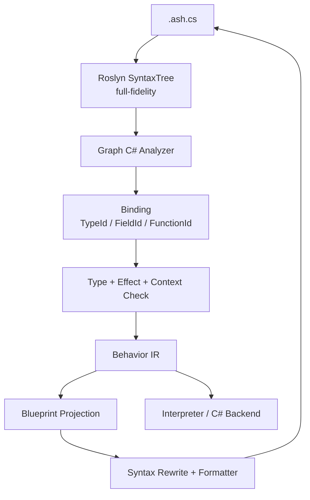

# Graph C# 与蓝图技术验证计划

研究日期：2026-05-15

本文定义 Asharia Engine 后续脚本/蓝图互通的技术验证路线。目标不是立刻把当前引擎 runtime
接入 C#，也不是实现完整可视化编辑器；目标是先验证一条可长期演进的语言与蓝图共同模型：

```text
.ash.cs 是语义资产真相
蓝图是 .ash.cs 的图形投影视图
Behavior IR 是内部编译模型
Interpreter / C# / IL 是可替换执行后端
```

当前 `docs/systems/scripting.md` 中“第一版不做 Visual scripting”的约束仍然成立。本文描述的是
ScriptLab 技术验证和中长期方向，不改变当前 runtime 脚本包的最小边界。

## 设计结论

- 使用合法 C# 子集作为 graph-compatible 文本语言，暂名 Graph C#。
- `.ash.cs` 是用户可读、可 diff、可手写、可由蓝图回写的语义资产。
- 不用 JSON 表示蓝图语义；蓝图节点图由 `.ash.cs` 经 Roslyn 解析、绑定和降低后投影生成。
- `.ashlayout` 只保存节点坐标、折叠状态和注释框等可丢弃编辑器布局。
- Behavior IR 是内部模型，不是用户手写资产；它服务蓝图投影、解释器、C# 后端、调试和验证。
- 普通 C# 仍可作为节点实现语言或高级脚本语言，但不承诺任意 C# 都可展开为蓝图。
- 只有通过 Graph C# analyzer、绑定、类型检查、effect/context 检查并成功降低到 Behavior IR 的代码，才是“可蓝图”代码。

## 一手资料依据

| 资料 | 关键事实 | 对本方案的影响 |
| --- | --- | --- |
| Roslyn syntax tree: https://learn.microsoft.com/en-us/dotnet/csharp/roslyn-sdk/work-with-syntax | Roslyn syntax tree 是 full-fidelity，能保留 token、空白和注释，并支持分析、重构和代码生成。 | `.ash.cs` 可作为语义真相；蓝图回写可以通过 syntax rewrite 保留源码结构。 |
| Roslyn analyzers: https://learn.microsoft.com/en-us/visualstudio/code-quality/roslyn-analyzers-overview | Analyzer 可在开发期报告代码质量和规则问题。 | Graph C# 子集规则、可蓝图判定和 code fix 可以先做成 analyzer。 |
| Roslyn `Compilation.Emit`: https://learn.microsoft.com/en-us/dotnet/api/microsoft.codeanalysis.compilation.emit | Roslyn 可把 compilation 输出为 assembly 和 PDB。 | 后端可先走 `Behavior IR -> generated C# -> DLL/PDB`，不急于手写 IL。 |
| C# `#line`: https://learn.microsoft.com/en-us/dotnet/csharp/language-reference/preprocessor-directives#line | 生成代码可用 `#line` 把诊断映射回源文件。 | generated C# 可辅助定位到 `.ash.cs`，但蓝图调试仍以 SourceMap 为核心。 |
| Language Server Protocol: https://microsoft.github.io/language-server-protocol/specifications/lsp/3.17/specification/ | LSP 定义 diagnostics、completion、semantic tokens、code action 等语言服务协议。 | 后续 Graph C# 编辑器、IDE 和引擎内文本编辑可共用语言服务。 |
| Unity Visual Scripting: https://docs.unity3d.com/Manual/com.unity.visualscripting.html | Unity 的图形脚本通过图节点调用 Unity API、自定义 C# 节点和事件。 | C# 生态适合提供节点库；蓝图负责编排，不需要自研完整通用语言生态。 |
| Unreal exposing gameplay to Blueprints: https://dev.epicgames.com/documentation/en-us/unreal-engine/exposing-gameplay-elements-to-blueprints-visual-scripting-in-unreal-engine | Unreal 用反射标注把 C++ 函数、属性和事件暴露给 Blueprint。 | Asharia 应通过 Script Context / BindingRegistry 暴露节点，不默认反射所有 C++ 或 C# API。 |
| Godot exported properties: https://docs.godotengine.org/en/stable/tutorials/scripting/gdscript/gdscript_exports.html | GDScript export 字段可保存到 scene/resource 并显示在 Inspector。 | Graph C# 的 `[Field(id)]` / `[Expose]` 应对齐 schema、persistence 和 editor metadata。 |

## 资产形状

```text
PlayerMove.ash.cs       语义真相，合法 C# 子集
PlayerMove.ashlayout    图布局缓存，可删除后重建
PlayerMove.behavior     cook/build 缓存产物，来自 Behavior IR
PlayerMove.Generated.cs 可选调试或 Roslyn 后端产物
```

`.ashlayout` 不保存语义。如果 `.ashlayout` 丢失，编辑器必须能从 `.ash.cs` 重新生成蓝图节点，只是布局回到自动排布。

示例 `.ash.cs`：

```csharp
using Asharia.Behavior;

[Behavior("com.game.PlayerMove")]
public sealed partial class PlayerMove : BehaviorComponent
{
    [Field(1), Expose, Range(0f, 20f)]
    public float Speed = 4.0f;

    protected override void Update(float delta)
    {
        if (Input.KeyDown(Key.W))
        {
            Transform.Translate(Self, new Vec3(0f, 0f, Speed * delta));
        }
    }
}
```

对应蓝图投影：

```text
[Update(delta)]
      |
[Input.KeyDown Key.W]
      |
[Branch]
      |
[Transform.Translate(Self, Vec3(0, 0, Speed * delta))]
```

## Graph C# 子集

第一版允许：

- `using`、`namespace`。
- `public sealed partial class <Name> : BehaviorComponent`。
- 带 `[Field(id)]` 的行为字段。
- 生命周期方法：`Start()`、`Update(float delta)`、`FixedUpdate(float delta)`、`Destroy()`。
- 私有 helper method，但 helper method 也必须满足 Graph C# 子集。
- 局部变量、赋值、`if` / `else`、`return`。
- 注册函数调用、注册字段读写、基础数学表达式。
- `new Vec2(...)`、`new Vec3(...)`、`new Vec4(...)`、`new Quat(...)`、`new Color(...)` 等值类型构造。
- enum 常量、bool/int/float/string 字面量。

第一版禁止：

- `async` / `await`、`yield`。
- lambda、匿名方法、LINQ query 或 fluent LINQ。
- `dynamic`、reflection、`typeof(...).Get*()` 这类动态检查。
- `unsafe`、指针、`stackalloc`。
- `try` / `catch` / `finally`、`throw`。
- `goto`、`lock`、`Thread`、`Task`。
- delegate / event 声明和任意 callback pipeline。
- 复杂泛型、用户自定义 operator、隐式转换链。
- 任意 `new` 引用类型。
- static mutable state。
- 未注册 API 调用。

循环默认暂缓。第一版如果必须支持遍历，只允许注册节点形式，例如 `ForEachEntity(query, handler)`，并把 handler
作为受控图结构或黑盒节点处理。

## 可蓝图判定

一段 `.ash.cs` 是可蓝图代码，当且仅当它能完整通过以下阶段：

```text
Roslyn SyntaxTree
  -> Graph C# analyzer
  -> Schema / BindingRegistry binding
  -> Type check
  -> Effect / Context check
  -> Behavior IR lowering
  -> Blueprint projection
```

建议诊断码：

| 诊断码 | 含义 | 示例 |
| --- | --- | --- |
| `AGC0001` | Unsupported syntax | lambda、`await`、`try`、`goto`。 |
| `AGC0002` | Unsupported expression | LINQ query、dynamic member access。 |
| `AGC0003` | Unregistered function call | 调用了没有 `FunctionId` 的普通方法。 |
| `AGC0004` | Missing stable field id | `[Expose]` 字段缺少 `[Field(id)]`。 |
| `AGC0005` | Illegal context call | `Update()` 调 editor-only API。 |
| `AGC0006` | Hidden side effect | pure 表达式中调用 mutating API。 |
| `AGC0007` | Unsupported loop | 使用未受控 `while` / `for`。 |
| `AGC0008` | Unsupported type | 使用不可保存或不可图形化类型。 |
| `AGC0009` | Unsupported allocation | `new` 任意引用对象。 |
| `AGC0010` | Source map unavailable | 无法建立源码 span 到 IR/graph 的映射。 |

局部变量是可蓝图结构，不应默认报错。例如：

```csharp
protected override void Update(float delta)
{
    var amount = Speed * delta;
    Transform.Translate(Self, new Vec3(0f, 0f, amount));
}
```

可以投影为：

```text
[Get Speed] [Get delta]
      \       /
      [Multiply]
          |
 [Set Local amount]
          |
 [Get Local amount]
          |
 [Make Vec3]
          |
 [Transform.Translate]
```

如果 `amount` 只使用一次，编辑器可提示可内联，但不能把它判为不可蓝图。

## BindingRegistry

Graph C# 不把 C# 符号名作为长期资产身份。绑定阶段必须把符号映射到稳定 ID：

```text
Speed
  -> TypeId: com.game.PlayerMove
  -> FieldId: 1

Transform.Translate(...)
  -> FunctionId: asharia.transform.translate

Self
  -> 当前 ScriptInstance 的 EntityRef
```

节点 API 可以由 C# attribute、C++ binding 或 schema/script context 注册：

```csharp
[Node("asharia.transform.translate")]
[AllowedContext(ScriptContext.RuntimeUpdate)]
[MutatesWorld]
public static void Translate(EntityRef entity, Vec3 offset);
```

第一版 BindingRegistry 只需要支持：

- 函数名到 `FunctionId`。
- 参数名、参数类型、返回类型。
- pure/read/mutate/spawn/destroy 等 effect flags。
- allowed contexts。
- debug display name 和 graph category。

## 编译与投影管线



蓝图编辑只修改 `.ash.cs`。典型回写：

| 蓝图操作 | `.ash.cs` 改写 |
| --- | --- |
| 修改常量 pin | 替换 literal expression。 |
| 新增调用节点 | 插入 expression statement。 |
| 删除调用节点 | 删除 statement 或 expression tree。 |
| 重排执行线 | 重排 block statements。 |
| 新增 Branch | 生成 `if (...) { ... }`。 |
| 修改字段 pin | 替换 field initializer 或 assignment expression。 |

## Behavior IR

Behavior IR 是内部模型，第一版只需表达图兼容行为：

```text
BehaviorModule
  components
  fields
  events
  functions

FunctionIR
  params
  locals
  basicBlocks
  instructions
```

第一批指令：

```text
LoadConst
LoadField
StoreField
LoadLocal
StoreLocal
CallFunction
Branch
Return
MakeStruct
BinaryOp
```

示例 IR dump：

```text
event Update(delta: Float)
  t0 = Call asharia.input.keyDown(Key.W)
  Branch t0 then B1 else B2
B1:
  t1 = LoadField FieldId(1) // Speed
  t2 = BinaryOp Mul t1, delta
  t3 = MakeStruct Vec3(0, 0, t2)
  Call asharia.transform.translate(Self, t3)
B2:
  Return
```

## Runtime 验证模型

技术验证阶段先做解释器，不急于直接托管 .NET runtime。

```text
ScriptRuntime
  ProgramCache
  ScriptInstance table
  EventQueue
  MutationQueue
  Diagnostics
```

运行时只认：

- `BehaviorProgram`。
- `TypeId`、`FieldId`、`FunctionId`。
- `EntityRef`、`AssetRef`。
- `ScriptExecutionContext`。

运行时不认：

- 蓝图节点坐标。
- `.ash.cs` 的 C# 成员名。
- C++ offset 或裸指针。
- Vulkan/RHI handle。

World 修改必须走 mutation queue：

```text
Graph C# / Blueprint
  -> CallFunction asharia.transform.translate
  -> enqueue SetComponentField / command
  -> world safe point validate + apply
```

## 调试与 SourceMap

每个 BehaviorProgram 必须带 SourceMap：

```text
IR instruction -> .ash.cs file / line / column
IR instruction -> blueprint node id / pin id
IR instruction -> generated C# file / line optional
```

调试目标：

- 编译错误定位到 `.ash.cs` span 和蓝图节点。
- 运行时错误定位到 `.ash.cs` span、蓝图节点、entity、component、field 和 `FunctionId`。
- 断点可以打在 `.ash.cs` 行或蓝图节点上。
- Interpreter 模式支持 step over、continue、查看 locals、fields 和 pin values。
- C# 后端可插入 `DebugProbe.Enter(nodeId)`，并用 `#line` 和 PDB 辅助后端调试。

## 独立 ScriptLab 原型

先脱离 VkEngine 建独立验证项目：

```text
Asharia.ScriptLab/
  src/
    Asharia.GraphCSharp.Abstractions/
    Asharia.GraphCSharp.Compiler/
    Asharia.GraphCSharp.Runtime/
    Asharia.GraphCSharp.Tests/
```

最小 mock API：

```csharp
public readonly record struct EntityRef(uint Index, uint Generation);
public readonly record struct Vec3(float X, float Y, float Z);

public abstract class BehaviorComponent
{
    protected EntityRef Self { get; }
    protected virtual void Update(float delta) {}
}

public static class Input
{
    public static bool KeyDown(Key key) => false;
}

public static class Transform
{
    public static void Translate(EntityRef entity, Vec3 offset) {}
}
```

## 可执行阶段计划

### Phase 0：规范冻结

目标：写清 Graph C# v0 子集、IR v0、蓝图投影 v0。

产物：

- `docs/graph-csharp-v0.md` 或等价规范。
- 10 个合法样例。
- 10 个非法样例。

退出条件：

- 每个非法样例都有明确 `AGC` 诊断码。
- 每个合法样例都能画出期望蓝图投影草图。

### Phase 1：ScriptLab 工程骨架

目标：脱离 VkEngine 验证 Roslyn parse、测试框架和 mock API。

退出条件：

- `dotnet test` 可运行。
- 能读取 `PlayerMove.ash.cs` 并输出 syntax diagnostics。

### Phase 2：Graph C# Analyzer

目标：实现可蓝图判定。

退出条件：

- `PlayerMove.ash.cs` 通过。
- lambda、LINQ、`await`、reflection、未注册 API、缺 `[Field(id)]` 均报预期诊断。

### Phase 3：BindingRegistry

目标：把 C# 符号绑定到 `FieldId` / `FunctionId`。

退出条件：

- `Input.KeyDown(Key.W)` 绑定到 `asharia.input.keyDown`。
- `Transform.Translate(Self, ...)` 绑定到 `asharia.transform.translate`。
- `Speed` 绑定到 `FieldId(1)`。

### Phase 4：Behavior IR

目标：降低合法 Graph C# 到 IR。

退出条件：

- 能输出稳定 IR dump。
- `if`、局部变量、字段读写、函数调用、`new Vec3`、基础表达式都覆盖。

### Phase 5：蓝图投影

目标：从 IR + SyntaxTree 生成图模型。

退出条件：

- 每个 graph node 可回到 `.ash.cs` span。
- 删除 `.ashlayout` 后可重建图模型。

### Phase 6：蓝图回写 `.ash.cs`

目标：证明“蓝图就是 C# 子集文本的图形编辑器”。

第一批编辑：

- 修改 literal pin。
- 新增/删除调用 statement。
- 重排 statement 顺序。
- 新增 `if` / `else`。

退出条件：

- 修改 Key.W 为 Key.S 后 `.ash.cs` 正确变更。
- 插入 `Debug.Log("move");` 后重新 parse、analyze、lower 均通过。

### Phase 7：Interpreter Runtime

目标：执行 Behavior IR，不依赖 .NET hosting。

退出条件：

- `Update(0.016f)` 可产生预期 `Transform.Translate` 调用记录。
- invalid entity 通过 diagnostics 返回，不崩溃。

### Phase 8：SourceMap 与断点

目标：验证 DSL/蓝图共同调试模型。

退出条件：

- 断点设在蓝图节点，Interpreter 执行到对应 IR instruction 时暂停。
- runtime diagnostic 同时显示 `.ash.cs` 行号和蓝图节点 id。

### Phase 9：Roslyn 后端

目标：验证 `Behavior IR -> generated C# -> DLL/PDB`。

退出条件：

- generated C# 可通过 Roslyn `Compilation.Emit` 输出 DLL/PDB。
- Interpreter 和 generated C# backend 对同一输入产生同一调用序列。

### Phase 10：回接 VkEngine 的进入条件

只有满足以下条件才回接主工程：

- Graph C# 子集规范稳定。
- Behavior IR 和 SourceMap 能覆盖第一批脚本需求。
- Blueprint projection 和回写能处理常用编辑。
- Interpreter 和 C# backend 行为一致。
- 与 VkEngine 的 `schema` / `cpp-binding` / `persistence` 接口点明确。

回接时的 package 方向：

```text
packages/systems/scripting-dotnet / scripting-contracts + scripting-runtime
  consumes packages/schema
  consumes future packages/cpp-binding or script binding
  exposes ScriptHost / BindingRegistry / Diagnostics

packages/systems/scripting-dotnet / scripting-dotnet provider target (future)
  owns Roslyn/.NET hosting integration
  does not leak managed runtime into rhi-vulkan/rendergraph
```

## 非目标

技术验证阶段不做：

- 完整可视化编辑器 UI。
- 任意 C# 到蓝图的转换。
- C# hot reload 完整生态。
- `AssemblyLoadContext` 卸载策略。
- direct IL emit。
- 多线程脚本执行。
- 脚本直接访问 RenderGraph execute、Vulkan command recording 或 RHI backend。
- 与当前 VkEngine scene/editor runtime 的深接入。

## 主要风险

- C# 子集太宽会破坏蓝图回写和图可读性；必须白名单驱动。
- 如果 Graph C# 直接依赖 C# 符号名作为资产身份，重命名会破坏已有资产；必须绑定到 `FieldId` / `FunctionId`。
- 如果蓝图保存独立语义 JSON，会出现 `.ash.cs` 与图语义双真相；第一版禁止。
- 如果先做 .NET hosting，GC、assembly unload、debugger 和部署问题会掩盖 IR 设计问题；先做 Interpreter。
- 如果不从第一天做 SourceMap，后续调试和错误定位会返工。

## 最小成功标准

第一轮验证完成时必须能证明：

1. `.ash.cs` 可以自动判定是否可蓝图。
2. 合法 `.ash.cs` 可以生成 Behavior IR。
3. IR 可以投影成蓝图图模型。
4. 蓝图基础编辑可以回写 `.ash.cs`。
5. IR interpreter 可以执行。
6. 错误和断点可以同时定位到 `.ash.cs` 和蓝图节点。
7. IR 可以生成 C# 并由 Roslyn 编译成 DLL/PDB。

满足这些标准后，才值得讨论把 Graph C# / Blueprint 接入 VkEngine 主工程。
