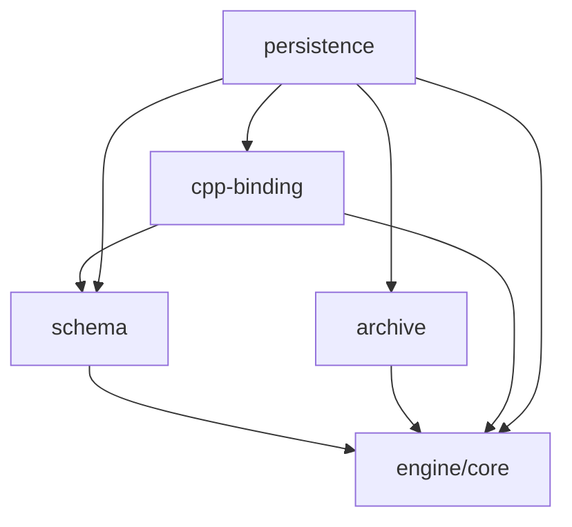

# Schema-first 反射/序列化重置计划

重置日期：2026-05-14

本文取代 2026-05-10 的 reflection/serialization spike 实施计划。旧计划验证了几个正确的小块，
但把 C++ binding、schema、persistence、editor/script metadata 压进了同一组 `TypeInfo` / `FieldInfo`
概念里，不适合继续扩展成最终架构。

新的方向是 schema-first：

```text
schema
  TypeSchema / FieldSchema / ValueKind / stable ids / typed metadata

archive
  ArchiveValue + strict JSON reader/writer

cpp-binding
  C++ type/member/getter/setter -> schema field binding

persistence
  schema + binding + archive -> save/load/defaults/migration
```

`editor-core`、`scripting`、`scene-core`、`asset-core` 后续只作为消费者接入，不在本次重置里创建空壳。

## 当前 spike 处理

保留为可迁移资产：

- `ArchiveValue` value tree。
- 严格 JSON facade。
- duplicate key 拒绝。
- deterministic output。
- package-local CTest/smoke 的组织方式。
- 手写注册验证过的最小开发体验。

冻结为 spike，不继续加语义：

- `packages/reflection/include/asharia/reflection/type_info.hpp`
- `packages/reflection/include/asharia/reflection/type_builder.hpp`
- `packages/reflection/include/asharia/reflection/context_view.hpp`
- `packages/serialization/include/asharia/serialization/serializer.hpp`
- `packages/serialization/src/serializer.cpp`

这些文件可以作为迁移参考，但不要继续往 `FieldInfo::attributes`、`FieldInfo::flags`、
`FieldAccessor` 或 `serializer.cpp` 里添加 migration、asset、editor、script 语义。

需要重命名或迁走：

- `TypeInfo` -> `TypeSchema`，但不能带 C++ accessor。
- `FieldInfo` -> `FieldSchema`，但不能带 C++ accessor 或通用字符串 attributes。
- `TypeBuilder` -> `CppBindingBuilder`，只生成 binding。
- `ContextView` -> schema metadata projection，不再直接过滤万能 flags。
- `packages/serialization` 的 `ArchiveValue` / text IO -> `packages/archive`。
- 反射驱动 save/load -> `packages/persistence`。

## 为什么重置

当前 spike 最大问题不是代码不能跑，而是概念边界会把长期系统绑死：

- 持久化 schema 和 C++ 内存布局混在同一个 `FieldInfo`。
- editor、script、runtime、persistence 的语义共用一组 flags 和字符串 attributes。
- `serializer.cpp` 同时解释字段规则、读取 C++ accessor、生成 archive envelope、处理类型头。
- `Vec3` / `Quat` 这类小值对象容易被迫带重 envelope。
- hash-derived id 容易被误用成持久化 identity。
- 字段显示名、C++ 成员名、文件 key 和 schema id 没有足够分离。

长期风险：

- 场景文件格式被当前 C++ 成员名牵着走。
- Inspector 行为被持久化规则牵着走。
- 脚本暴露被序列化 flags 牵着走。
- 字段改名需要靠脆弱 hash 或临时兼容代码补救。
- asset/editor/script 需求会持续把 `FieldInfo` 膨胀成万能属性袋。

## 资料对照

| 来源 | 支持的结论 |
| --- | --- |
| Unity script serialization: https://docs.unity.cn/Manual/script-Serialization.html | 说明 Inspector/prefab/hot reload 和 serialized fields 深耦合；Asharia 应避免把序列化等同于编辑器事实源。 |
| O3DE Reflection Contexts: https://www.docs.o3de.org/docs/user-guide/programming/components/reflection/ | 支持 context 分离：持久化、编辑器、脚本各消费自己的 projection。 |
| O3DE Behavior Context: https://www.docs.o3de.org/docs/user-guide/programming/components/reflection/behavior-context/ | 支持脚本暴露独立于 serialize/edit metadata。 |
| Serde overview: https://serde.rs/ | 支持“类型 binding”和“格式 IO”分开，中间通过数据模型交互。 |
| Serde data model: https://serde.rs/data-model.html | 支持 ArchiveValue/data model 独立于 JSON/CBOR 等具体格式。 |
| Unreal Property System: https://www.unrealengine.com/blog/unreal-property-system-reflection | 支持 opt-in/generated binding，但也提醒不要复制完整 UObject 宇宙。 |
| Unreal FArchiveUObject: https://dev.epicgames.com/documentation/en-us/unreal-engine/API/Runtime/CoreUObject/Serialization/FArchiveUObject | 支持底层 archive 和对象系统 serialization 分层。 |
| Unreal Core Redirects: https://dev.epicgames.com/documentation/en-us/unreal-engine/core-redirects?application_version=4.27 | 支持持久化 identity 需要 redirects/aliases，不能只靠当前 C++ 名字。 |
| Protocol Buffers overview: https://protobuf.dev/overview/ | 支持 schema 与语言 binding 分开。 |
| Protobuf C++ generated code: https://protobuf.dev/reference/cpp/cpp-generated/ | 支持 C++ binding 由 schema 生成或手写适配，而不是 schema 本身。 |
| FlatBuffers schema: https://flatbuffers.dev/schema/ | 支持 stable schema、root type、file identifier、field `id` 等格式契约。 |
| FlatBuffers evolution: https://flatbuffers.dev/evolution/ | 支持 schema evolution 单独设计，字段删除/改名/重排不能随意处理。 |

## 目标 package

第一批只物理拆干净底层边界：

```text
packages/schema
packages/archive
packages/cpp-binding
packages/persistence
```

建议 CMake target：

```text
asharia-schema        alias asharia::schema
asharia-archive       alias asharia::archive
asharia-cpp-binding   alias asharia::cpp_binding
asharia-persistence   alias asharia::persistence
```

Public include 约定：

```text
include/asharia/schema/
include/asharia/archive/
include/asharia/cpp_binding/
include/asharia/persistence/
```

依赖方向：



过渡策略：

- 如果一次物理改包太大，可以先在现有 `packages/reflection` / `packages/serialization` 内部开
  `asharia::schema`、`asharia::archive`、`asharia::cpp_binding`、`asharia::persistence` namespace。
- 但新 public API 必须按目标边界命名，不能继续扩大旧 `asharia::reflection::TypeInfo`。
- 一旦新 package 的 CTest 覆盖到位，旧 package 要么删除，要么只做短期 compatibility facade。

## 核心 API 草案

### Schema

```cpp
namespace asharia::schema {

struct TypeId {
    std::string_view stableName;
};

struct FieldId {
    std::uint32_t value = 0;
};

enum class ValueKind : std::uint8_t {
    Null,
    Bool,
    Integer,
    Float,
    String,
    Enum,
    Array,
    Object,
    InlineStruct,
    AssetReference,
    EntityReference,
};

struct FieldSchema {
    FieldId id;
    std::string_view key;
    TypeId valueType;
    ValueKind valueKind;
    std::span<const std::string_view> aliases;
    TypedMetadata metadata;
};

struct TypeSchema {
    TypeId id;
    std::string_view canonicalName;
    std::uint32_t version = 1;
    ValueKind kind = ValueKind::Object;
    std::span<const FieldSchema> fields;
    TypedMetadata metadata;
};

} // namespace asharia::schema
```

第一版 id 规则：

- Type stable name 使用 `com.asharia.*`。
- Field id 使用显式 `uint32_t`，在 type 内唯一。
- Field id 不从 field key hash 自动生成。
- 删除字段后 id 进入 reserved/deprecated 列表，不复用。
- 文件 key、C++ 成员名、display name、script name 可以不同。

### Typed Metadata

```text
PersistenceSpec
EditorSpec
ScriptSpec
ReferenceSpec
NumericSpec
MathFormatSpec
ColorSpec
```

规则：

- 关键语义不用字符串 key/value。
- 消费者只读取自己负责的 metadata block。
- schema package 只存 metadata 数据，不依赖 editor、script、asset database 或 renderer。

### Archive

```cpp
namespace asharia::archive {

enum class ArchiveValueKind {
    Null,
    Bool,
    Integer,
    Float,
    String,
    Array,
    Object,
};

struct ArchiveValue;
struct ArchiveMember {
    std::string key;
    ArchiveValue value;
};

using ArchiveArray = std::vector<ArchiveValue>;
using ArchiveObject = std::vector<ArchiveMember>;

} // namespace asharia::archive
```

Archive package 验收：

- 手工构建 `ArchiveValue`。
- strict JSON parse/write。
- duplicate key parse error。
- deterministic output byte-for-byte 相同。
- public header 不暴露 `nlohmann_json`。
- 不包含 schema/type/binding 逻辑。

### C++ Binding

```cpp
namespace asharia::cpp_binding {

struct FieldReadContext {
    const void* object = nullptr;
};

struct FieldWriteContext {
    void* object = nullptr;
};

struct FieldValueView {
    schema::TypeId type;
    const void* data = nullptr;
    std::size_t size = 0;
    std::size_t alignment = 0;
};

using ReadFieldFn = Result<FieldValueView> (*)(FieldReadContext);
using WriteFieldFn = VoidResult (*)(FieldWriteContext, FieldValueView);

struct FieldBinding {
    schema::TypeId ownerSchema;
    schema::FieldId fieldId;
    std::string_view cppMemberName;
    std::size_t size = 0;
    std::size_t alignment = 0;
    ReadFieldFn read = nullptr;
    WriteFieldFn write = nullptr;
};

struct CppTypeBinding {
    schema::TypeId schemaType;
    std::string_view cppTypeName;
    std::span<const FieldBinding> fields;
};

} // namespace asharia::cpp_binding
```

Binding package 验收：

- `CppBindingBuilder<T>` 支持 pointer-to-member 生成 read/write thunk。
- 支持 getter/setter thunk。
- Read-only 字段没有 write thunk。
- Binding 校验 schema field 是否存在。
- Binding 不决定 persistence/editor/script 可见性。

### Persistence

```cpp
namespace asharia::persistence {

struct PersistencePolicy {
    bool includeTypeHeader = true;
    UnknownFieldPolicy unknownFields = UnknownFieldPolicy::Error;
};

Result<archive::ArchiveValue>
saveObject(const schema::SchemaRegistry& schema,
           const cpp_binding::BindingRegistry& bindings,
           schema::TypeId type,
           const void* object,
           const PersistencePolicy& policy);

VoidResult loadObject(const schema::SchemaRegistry& schema,
                      const cpp_binding::BindingRegistry& bindings,
                      schema::TypeId type,
                      const archive::ArchiveValue& value,
                      void* object,
                      const PersistencePolicy& policy);

} // namespace asharia::persistence
```

Persistence package 验收：

- 按 schema field id/key 保存。
- 小 value type 不生成 heavy envelope。
- component/asset/root object 保留 type/version envelope。
- Unknown field 策略可测试。
- default value 可测试。
- migration chain 可测试。

## 实施切片

### 切片 A：文档与冻结

目标：

- 更新 `docs/systems/reflection-serialization.md` 为 schema-first 架构。
- 更新本文为重置计划。
- 更新 `docs/research/sources.md` 的资料结论。
- 在技术栈文档中注明 JSON 库私有在 archive facade 后。
- 标明当前 `reflection` / `serialization` 是 spike，不再扩语义。

验收：

```powershell
powershell -ExecutionPolicy Bypass -File tools\check-text-encoding.ps1
git diff --check
```

### 切片 B：`packages/schema`

目标：

- 新增 `asharia-schema` / `asharia::schema`。
- 定义 `TypeId`、`FieldId`、`ValueKind`、`TypeSchema`、`FieldSchema`。
- 定义 typed metadata 基础容器。
- 实现 `SchemaRegistry::registerType()`、`findType()`、`freeze()`。

必须校验：

- duplicate type stable name。
- duplicate field id。
- duplicate field key without alias。
- id reuse reserved/deprecated。
- freeze 后禁止注册。

建议 package-local test：

```powershell
cmd /c "build\conan\msvc-debug\Debug\generators\conanbuild.bat && cmake -S packages\schema -B build\cmake\package-schema-tests-msvc-debug -G Ninja -DCMAKE_BUILD_TYPE=Debug -DASHARIA_BUILD_TESTS=ON -DCMAKE_TOOLCHAIN_FILE=%CD%/build/conan/msvc-debug/Debug/generators/conan_toolchain.cmake && cmake --build build\cmake\package-schema-tests-msvc-debug && ctest --test-dir build\cmake\package-schema-tests-msvc-debug --output-on-failure"
```

### 切片 C：`packages/archive`

目标：

- 迁移或重写现有 `ArchiveValue`。
- 迁移 strict JSON reader/writer。
- 保持 `nlohmann_json` private。
- 保持 duplicate key 拒绝和 deterministic output。

禁止：

- 引入 schema registry 依赖。
- 引入 C++ binding 依赖。
- 在 archive 层处理 type/version envelope。

### 切片 D：`packages/cpp-binding`

目标：

- 新增 `CppTypeBinding`、`FieldBinding`、`BindingRegistry`。
- 新增 `CppBindingBuilder<T>`。
- 支持 pointer-to-member 和 getter/setter thunk。
- 通过 schema field id 绑定字段。

禁止：

- 用 C++ 成员名生成持久化 field id。
- 在 binding package 解释 editor/script metadata。
- 对非标准布局类型暴露裸 offset 写入。

### 切片 E：`packages/persistence`

目标：

- 连接 schema + archive + cpp-binding。
- 实现 `saveObject()` / `loadObject()`。
- 实现 envelope 策略。
- 实现 unknown field 策略。
- 实现 default value。

建议测试：

- scalar round-trip。
- struct round-trip。
- `Vec3` inline array。
- component envelope。
- unknown field error/preserve/drop。
- missing required field。
- read-only binding 写入失败诊断。

### 切片 F：migration / aliases / redirects

目标：

- Type-level version migration。
- Field aliases。
- Deprecated/reserved field id。
- `1 -> 2 -> 3` migration chain。

建议测试：

- `eulerRotation` -> `rotation`。
- field key rename but same field id。
- field id removed and reserved。
- missing migration produces diagnostic。

### 切片 G：旧 package 收口

目标：

- 删除旧 `reflection` / `serialization` target，或降级为短期 compatibility facade。
- 更新 docs/workflow/package-standalone-build.md。
- 更新 `docs/architecture/engine-systems.md`、`docs/systems/asset-architecture.md`、`docs/systems/scripting.md`
  中的旧依赖图。
- 确保 `rg "packages/reflection|packages/serialization"` 的剩余引用都明确标注为 legacy/spike 或历史记录。

## 并行建议

可以并行：

| 工作 | 原因 |
| --- | --- |
| `schema` registry 和 typed metadata | 不依赖 archive 或 binding。 |
| `archive` JSON facade | 不依赖 schema 或 C++ binding。 |
| 资料/文档同步 | 不改运行时代码。 |

不建议并行：

| 工作 | 原因 |
| --- | --- |
| `cpp-binding` 和 `persistence` 同时定 API | persistence 依赖 binding error/ownership 语义。 |
| editor Inspector 和 schema reset 同时做 | UI 会倒逼过早 metadata 形状。 |
| C# runtime hosting 和 persistence 同时做 | hostfxr、managed GC、reload 会掩盖 schema/binding 问题。 |
| asset loading 和 asset reference persistence 同时做 | persistence 只保存 GUID/type，加载策略属于 asset/resource system。 |

## 最小门禁

文档切片：

```powershell
powershell -ExecutionPolicy Bypass -File tools\check-text-encoding.ps1
git diff --check
```

底层 package 切片：

```powershell
powershell -ExecutionPolicy Bypass -File tools\check-text-encoding.ps1
git diff --check
cmd /c "build\conan\msvc-debug\Debug\generators\conanbuild.bat && cmake --preset msvc-debug && cmake --build --preset msvc-debug"
```

提交前至少再跑：

```powershell
cmd /c "build\conan\clangcl-debug\Debug\generators\conanbuild.bat && cmake --preset clangcl-debug && cmake --build --preset clangcl-debug"
```

这些切片不改 Vulkan frame loop、swapchain、RenderGraph 或 renderer 时，不需要额外跑图形 smoke。

## 推荐开始顺序

1. 文档冻结旧 spike。
2. 新增 `packages/schema`。
3. 新增 `packages/archive`，迁移 `ArchiveValue` 和 JSON IO。
4. 新增 `packages/cpp-binding`。
5. 新增 `packages/persistence`，实现 round-trip。
6. 增加 migration/alias/redirect。
7. 收口或删除旧 `reflection` / `serialization` facade。

这条路线保留 spike 的有效验证结果，但不让它继续决定长期场景格式、编辑器行为、脚本暴露或 C++ 内存布局。
