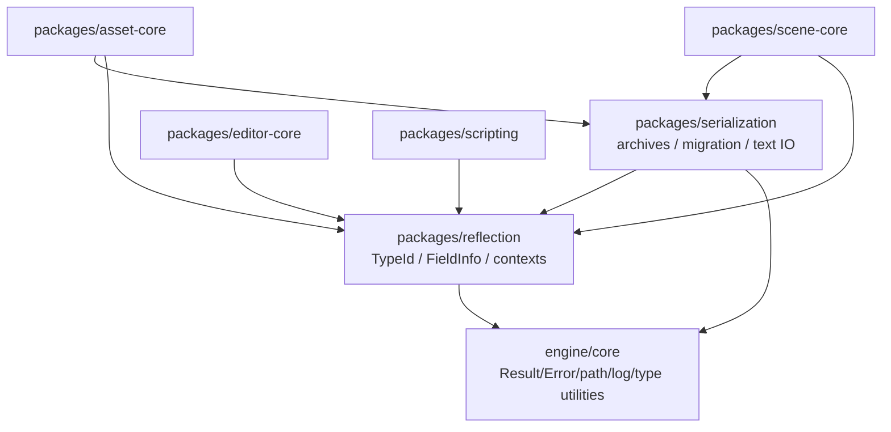
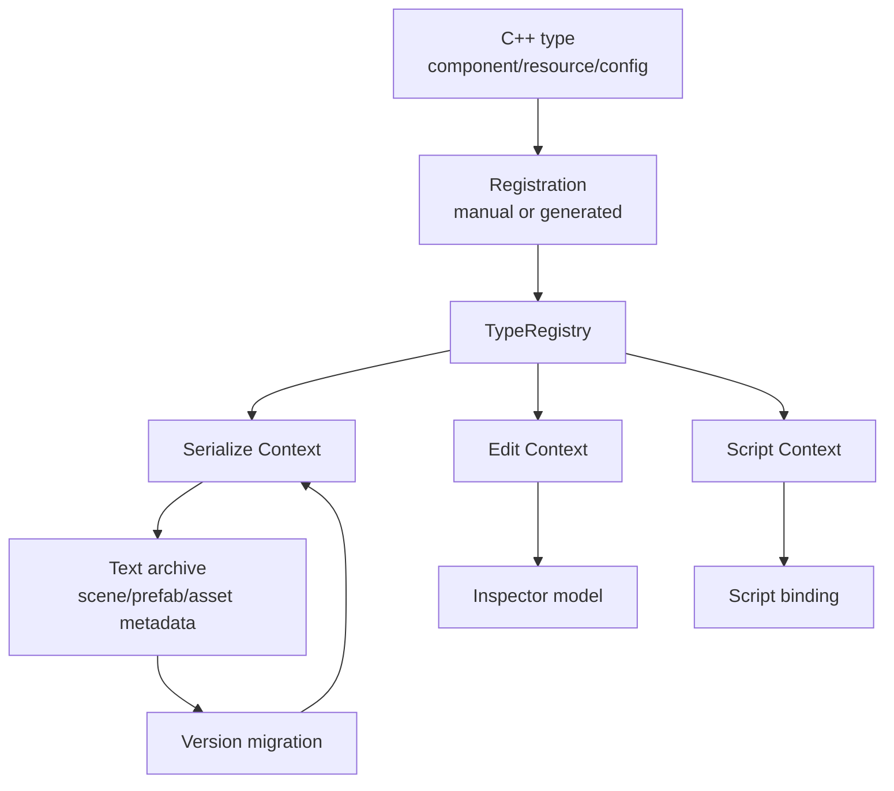
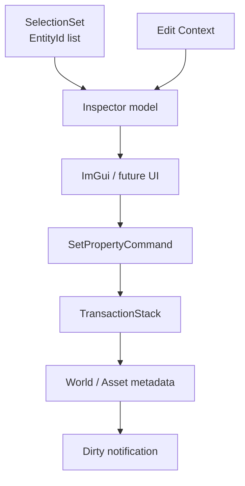
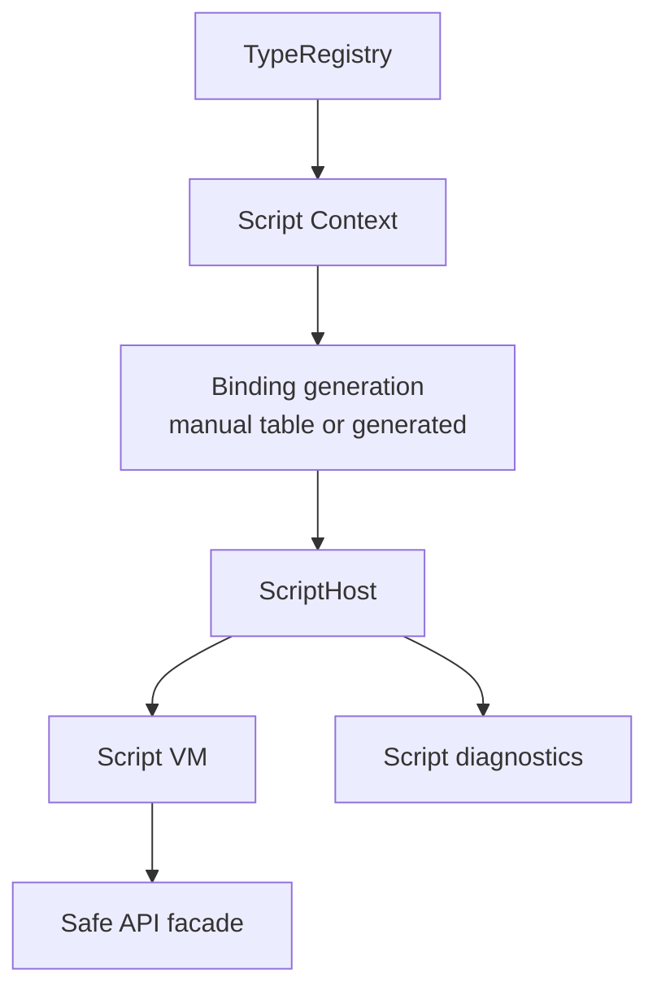
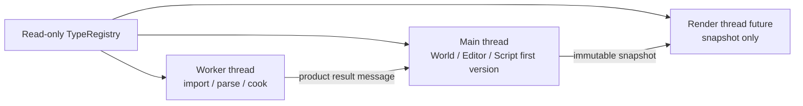

# 反射与序列化架构

研究日期：2026-05-10

本文定义 Asharia Engine 后续反射、序列化、Inspector、脚本绑定、scene 保存和 asset metadata 的共同基础。
它不是立即实现清单，而是约束后续 `reflection`、`serialization`、`scene-core`、`editor-core`、
`asset-core` 和 `scripting` package 的边界。当前 renderer MVP 不需要立刻实现完整系统，但后续新增
scene、editor、asset 或 script API 时必须按本文检查依赖、生命周期和可见性。

命名遵循 `docs/standards/naming.md`：持久化 schema 使用 `com.asharia`，文件后缀使用 `.ascene`、
`.aprefab`、`.ameta`、`.amat`、`.agraph`。C++ / CMake 实现名统一使用 `asharia`。

近期实施方案、切片顺序、smoke 和技术资料见 `docs/systems/reflection-serialization-plan.md`。

## 设计目标

反射系统的目标不是复制 Unreal `UObject` 或 Unity 全套序列化生态，而是提供一个小而稳定的数据契约：

- C++ 类型可以声明稳定 `TypeId`、版本、字段、属性和迁移规则。
- 序列化、Inspector、脚本绑定和 asset metadata 共享同一套类型事实，但使用不同 context 过滤可见性。
- Scene、asset import settings、material 参数和 editor 设置可以用确定性文本格式保存。
- 脚本绑定只暴露被允许的字段和函数，不把所有 C++ 对象自动变成脚本对象。
- 旧版本数据可以迁移到新版本字段布局，字段重命名和拆分不会直接破坏用户项目。
- 错误报告必须包含类型、字段、文件路径、版本和调用上下文。

## 非目标

第一版明确不做：

- 全局 GC 对象宇宙。
- 自动扫描整个 C++ AST 后把所有类型注册进引擎。
- Inspector 直接等同于序列化字段。
- 脚本默认访问所有反射字段。
- 二进制 prefab/scene 格式。
- 热加载时迁移任意 C++ 对象内存布局。
- 运行时通过字符串反射调用 renderer 或 Vulkan 后端内部对象。

## 一手资料结论

| 资料 | 关键事实 | 对 Asharia Engine 的约束 |
| --- | --- | --- |
| Unity script serialization: https://docs.unity3d.com/Manual/script-serialization.html | Unity 的序列化直接影响 Inspector、scene/prefab 保存和热重载数据保留；字段可见性和序列化规则不是普通 C# 可见性的简单等价。 | Asharia Engine 必须区分 `Serializable`、`EditorVisible`、`RuntimeVisible` 和 `ScriptVisible`，不能用一个 public/private 决定全部行为。 |
| Unity AssetDatabase: https://docs.unity3d.com/Manual/AssetDatabase.html | AssetDatabase 以 GUID、source asset、import settings 和 artifact/cache 为边界。 | Asset metadata 和 import settings 要能通过反射/序列化保存，但 runtime 不应依赖 source path。 |
| O3DE reflection / contexts: https://www.docs.o3de.org/docs/user-guide/programming/components/reflection/ | O3DE 使用 Serialize Context、Edit Context、Behavior Context 区分保存、编辑器显示和脚本行为暴露。 | Asharia Engine 应把 serialization、editor 和 scripting context 分开，让同一类型事实按不同用途投影。 |
| Unreal Object Handling: https://dev.epicgames.com/documentation/en-us/unreal-engine/unreal-object-handling-in-unreal-engine | Unreal 通过反射追踪 UObject 引用，自动引用更新和 GC 依赖对象系统。 | Asharia Engine 不照搬 GC，但要让 `EntityId`、`AssetGuid`、`AssetHandle<T>` 等引用类型有专门 serializer 和失效诊断。 |
| Godot Object class: https://docs.godotengine.org/en/stable/engine_details/architecture/object_class.html | Godot 的 Object 系统给属性、方法、通知和 editor/runtime 暴露提供共同基础。 | 反射可以成为 editor 和 script 的 API 边界，但不应把底层 Vulkan 对象变成普通可脚本对象。 |

## Package 边界

建议后续新增两个底层 package：

```text
packages/reflection
  include/asharia/reflection/
  src/

packages/serialization
  include/asharia/serialization/
  src/
```

依赖方向：



约束：

- `reflection` 不依赖 editor、asset、scene、script、Vulkan、ImGui 或 renderer。
- `serialization` 不依赖 editor、script、Vulkan 或 renderer。
- `scene-core` 和 `asset-core` 可以消费 reflection/serialization public API。
- `editor-core` 只能消费 Edit Context 投影，不拥有类型注册基础设施。
- `scripting` 只能消费 Script/Behavior Context 投影，不扫描所有 C++ 类型。

## 总体数据流



这条流转里有三个重要结论：

- Type registry 保存事实，context 保存用途过滤。
- Serialize Context 允许保存，不代表 Inspector 必须显示。
- Script Context 允许脚本访问，不代表字段可保存或可编辑。

## 核心类型模型

第一版建议以纯数据结构开始，避免模板和宏系统过早扩大：

```cpp
namespace asharia {

struct TypeId {
    std::uint64_t value;
};

struct FieldId {
    std::uint64_t value;
};

enum class TypeKind {
    Struct,
    Component,
    ResourceConfig,
    AssetHandle,
    EntityHandle,
    Enum,
    Vector,
    String,
    Scalar,
};

enum class FieldFlag : std::uint32_t {
    Serializable = 1U << 0U,
    EditorVisible = 1U << 1U,
    RuntimeVisible = 1U << 2U,
    ScriptVisible = 1U << 3U,
    ReadOnly = 1U << 4U,
    Transient = 1U << 5U,
    AssetReference = 1U << 6U,
    EntityReference = 1U << 7U,
};

struct NumericRange {
    double minValue;
    double maxValue;
    double step;
};

struct FieldAttributes {
    std::string_view displayName;
    std::string_view category;
    std::string_view tooltip;
    std::optional<NumericRange> range;
};

struct FieldAccessor {
    TypeId ownerType;
    TypeId fieldType;
    std::size_t offset;
    std::size_t size;
    std::size_t alignment;
};

struct FieldInfo {
    FieldId id;
    std::string_view name;
    TypeId type;
    FieldFlagSet flags;
    FieldAttributes attributes;
    FieldAccessor accessor;
};

struct TypeInfo {
    TypeId id;
    std::string_view name;
    std::uint32_t version;
    TypeKind kind;
    std::span<const FieldInfo> fields;
};

} // namespace asharia
```

技术点：

- `TypeId` 和 `FieldId` 必须稳定。可以来自固定字符串 hash，例如 package-qualified name：
  `com.asharia.scene.TransformComponent.position`。字段重命名时保留旧 id 的迁移规则。
- `offset` 只适合标准布局或明确允许的 POD 类型。复杂类型优先用 getter/setter accessor。
- `FieldFlagSet` 应该是强类型 bitset，不直接暴露裸整数。
- `FieldAttributes` 只放轻量编辑元数据，不放 ImGui 控件对象或 editor callback。
- `TypeInfo` 不拥有字段字符串的动态生命周期；注册数据由静态表或 generated table 持有。
- 反射 registry 初始化要可控，避免依赖跨 translation unit 的静态初始化顺序。

## Context 分层

### Serialize Context

Serialize Context 回答：“这个字段是否参与保存、加载、迁移、cook？”

字段进入 Serialize Context 的条件：

- 具有 `Serializable`。
- 不具有 `Transient`。
- 字段类型也可序列化，或者存在专门 serializer。
- 字段版本和迁移规则可解释旧数据。

Serialize Context 不回答：

- Inspector 是否显示。
- 脚本是否能读写。
- 运行时是否能修改。

### Edit Context

Edit Context 回答：“编辑器是否显示，如何显示，是否允许通过 transaction 修改？”

字段进入 Edit Context 的条件：

- 具有 `EditorVisible`。
- 所属类型被允许出现在 editor。
- 编辑器修改路径能生成 transaction 或明确只读。

Edit Context 的元数据包括：

- display name
- category
- tooltip
- numeric range
- enum labels
- asset picker filter
- read-only reason

Edit Context 不应包含：

- ImGui widget 指针。
- Vulkan resource handle。
- renderer object pointer。
- 文件系统裸路径写入规则。

### Script Context

Script Context 回答：“脚本能否读取、写入或调用这个字段/函数？”

字段或函数进入 Script Context 的条件：

- 具有 `ScriptVisible`。
- 明确标注可用上下文：Editor、Runtime、Import、Tool、PreRenderConfig。
- 明确线程亲和性和生命周期。
- 错误路径可转成 script diagnostic。

Script Context 不等于 Serialize Context。一个字段可以脚本可读但不保存，也可以保存但不允许脚本直接写。

## 字段可见性矩阵

| 字段类型 | Serializable | EditorVisible | RuntimeVisible | ScriptVisible | 示例 |
| --- | --- | --- | --- | --- | --- |
| Transform position | yes | yes | yes | yes | editor 和 runtime 都可改，参与 scene 保存 |
| Generated render bounds | no | maybe read-only | yes | read-only | 运行时计算结果，不写 scene |
| Editor selection color | yes | yes | no | editor-only | 编辑器设置，不进入 runtime cook |
| Asset source path | yes in metadata | yes | no | import/tool only | asset database 内部数据 |
| GPU buffer handle | no | no | no | no | RHI owner 私有 |
| Script private state | depends | no by default | yes | script-only | VM 或 script component 内部状态 |

## 序列化格式策略

第一版建议使用确定性的文本格式。JSON、TOML 或 YAML 均可，但必须满足：

- 输出 key 顺序稳定，便于 review。
- 数字格式稳定，避免无意义 diff。
- 支持对象版本号。
- 支持字段缺失默认值。
- 支持 unknown field 策略。
- 可在 CLI smoke 中 round-trip。

示例 scene fragment：

```json
{
  "schema": "com.asharia.scene",
  "version": 1,
  "objects": [
    {
      "id": "entity:1",
      "name": "Camera",
      "components": {
        "com.asharia.scene.TransformComponent": {
          "version": 1,
          "position": [0.0, 2.0, -5.0],
          "rotation": [0.0, 0.0, 0.0, 1.0],
          "scale": [1.0, 1.0, 1.0]
        }
      }
    }
  ]
}
```

约束：

- 文本格式保存用户工程数据，runtime cook 可另行生成二进制 product。
- 序列化层不解析 ImGui state。
- 源 asset metadata 可以用同一 serializer，但 runtime cooked manifest 应剥离 editor-only 字段。
- 所有 file IO 错误返回 `Result`，包含路径和操作。

## 版本迁移

迁移需要支持这些情况：

- 字段重命名。
- 字段拆分。
- 字段合并。
- 默认值变化。
- 类型迁移，例如 Euler angles 到 quaternion。
- asset handle 从 source path 迁移到 GUID。

建议模型：

```cpp
struct MigrationContext {
    TypeId type;
    std::uint32_t fromVersion;
    std::uint32_t toVersion;
    SerializedObjectView input;
    SerializedObjectBuilder output;
};

using MigrationFn = Result<void> (*)(MigrationContext&);
```

迁移规则：

- 每个类型只负责自己的字段迁移，不跨 package 隐式修改其他对象。
- 多版本迁移按链式执行：1 -> 2 -> 3。
- 迁移失败要保留原始对象路径和字段路径。
- 迁移后立即按当前 schema 校验。
- 大型资产迁移应可通过 CLI 工具批处理，不能只靠 editor 打开时悄悄修改。

## 特殊类型序列化

### EntityId

`EntityId` 在保存时不应直接保存运行时 index/generation，而应通过 scene-local stable id 或 path 转换。

```text
Runtime EntityId(index,generation)
  -> save-time SceneObjectStableId
  -> load-time remap table
  -> new Runtime EntityId
```

### AssetHandle<T>

`AssetHandle<T>` 保存 `AssetGuid`，不保存 source path 或 loaded resource pointer。

```json
{
  "mesh": {
    "guid": "9f7a31a0-0b63-4d4c-9f18-bd9a0d2e9c21",
    "type": "com.asharia.asset.Mesh"
  }
}
```

### Math Types

`Vec2`、`Vec3`、`Vec4`、`Quat` 和 `Mat4` 需要固定格式：

- `Vec3`: `[x, y, z]`
- `Quat`: `[x, y, z, w]`
- `Mat4`: row-major or column-major 必须写入 schema。项目 shader/CPU 若使用 row-vector 约定，文档也要同步。

### Color

颜色需要声明 color space：

- UI/editor color 可使用 sRGB 表示。
- shader/material 参数应明确 linear 或 sRGB。

## Inspector 数据流

Inspector 不应该直接访问字段裸地址并写入，而应生成 property edit 命令。



技术点：

- Inspector model 读取 Edit Context 和 selection snapshot，构建可显示 property 列表。
- UI 修改先产生 `SetPropertyCommand`，再进入 `TransactionStack`。
- 多选编辑需要支持 mixed value。
- Read-only 字段必须显示原因，不能静默允许写入失败。
- Editor-only 字段不进入 runtime cook。

## 脚本绑定数据流



约束：

- Binding generation 只消费 Script Context。
- 反射层不依赖具体 Lua、C# 或 Python runtime。
- 脚本 API 应返回 handle/result，不抛出跨语言不可控异常。
- Script-visible 不代表 editor-visible。

## 线程与生命周期

反射 registry 初始化后应只读，可以跨线程读取。序列化和 migration 需要按对象所有权约束运行：

- 编辑场景对象默认主线程拥有。
- Worker thread 可处理 immutable serialized data 或 plain job data。
- Asset import worker 可读 source asset 和写 product cache，但不能直接修改 active editor world。
- Script VM 第一版默认主线程运行；后续 worker VM 只能处理明确隔离的数据。
- Render thread 不访问 mutable reflected object，只消费 render snapshot。



## 错误模型

所有反射/序列化错误必须带结构化上下文：

- file path
- object path
- type id/name
- field id/name
- expected type
- actual value/type
- version
- migration step
- operation: load/save/migrate/inspect/bind

示例错误：

```text
Serialization error:
  file: Content/Scenes/test.ascene
  object: /objects/Camera/components/TransformComponent
  type: com.asharia.scene.TransformComponent
  field: rotation
  expected: Quat[4]
  actual: array length 3
  operation: load
```

## 最小 smoke 建议

后续实现时建议增加 CLI/smoke，而不是先做 UI：

- `--smoke-reflection-transform`：注册 `TransformComponent`，枚举字段并校验 flags。
- `--smoke-serialization-roundtrip`：保存再加载一个对象，比较字段值。
- `--smoke-serialization-migration`：加载旧版本对象，迁移后校验当前字段。
- `--smoke-edit-context`：确认 editor-visible 字段和 serializable 字段可不同。
- `--smoke-script-context-metadata`：确认 script-visible 字段按上下文过滤。

## 审查清单

新增或修改反射类型时检查：

- 类型是否有稳定 package-qualified name。
- 类型 version 是否更新。
- 字段是否有稳定 `FieldId`。
- 字段 flags 是否区分 serialize/editor/runtime/script。
- 是否需要 migration。
- 是否有 default value。
- 是否含有 asset/entity 引用，引用 serializer 是否明确。
- 是否 editor-only，是否进入 cook。
- 是否 script-visible，脚本线程和上下文是否明确。

## 暂缓事项

- 自动 C++ reflection codegen。
- 可视化 schema editor。
- 二进制 scene/prefab 格式。
- 完整 prefab override 系统。
- 完整 C# attribute 映射。
- 大规模对象 GC。
- 反射驱动的 network replication。

这些能力可以在基础反射、scene save/load、editor transaction 和 script binding 小闭环稳定后再引入。
