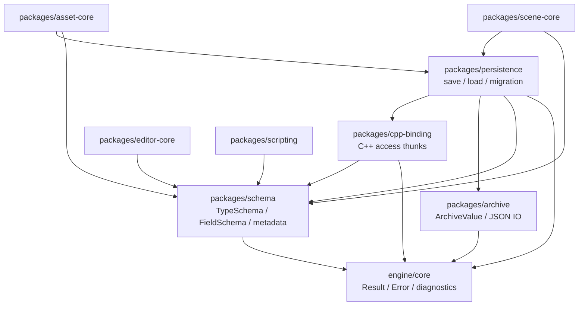
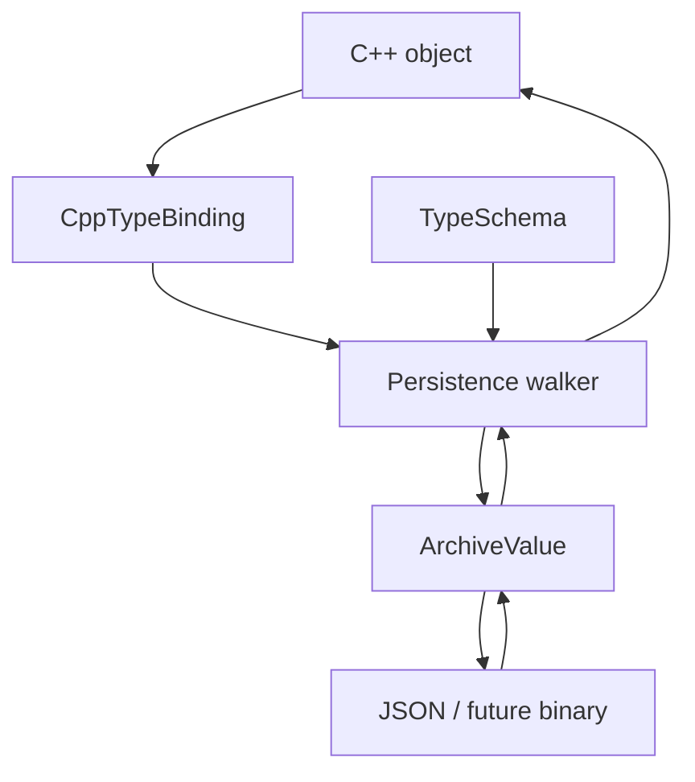
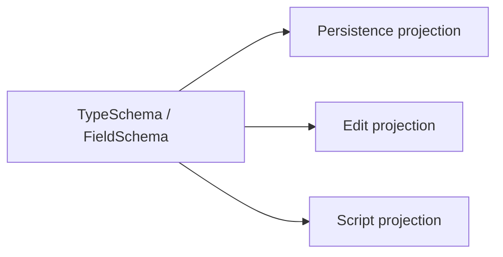

# 反射、Schema 与持久化架构

研究日期：2026-05-10

重置日期：2026-05-14

本文定义 Asharia Engine 后续 schema、C++ binding、archive、persistence、Inspector、脚本绑定、
scene 保存和 asset metadata 的共同边界。当前 `packages/reflection` / `packages/serialization`
实现视为 spike：它验证了 `ArchiveValue`、严格 JSON facade、手写注册、字段投影和 package-local
smoke，但不再作为长期 API 继续扩展。

核心结论：持久化 schema 必须独立于 C++ 内存布局；C++ binding 只是 schema 到对象的读写桥；
archive 只负责 value tree 和文本/二进制 IO；persistence 才把 schema、binding、archive 和迁移组装起来。
Editor、scene、asset、scripting 都是消费者，不拥有底层类型事实。

命名遵循 `docs/standards/naming.md`：持久化 schema 使用 `com.asharia`，文件后缀使用 `.ascene`、
`.aprefab`、`.ameta`、`.amat`、`.agraph`。C++ / CMake 实现名统一使用 `asharia`。

实施切片、旧代码处理和 smoke 路线见 `docs/systems/reflection-serialization-plan.md`。

## 设计目标

- 用 schema 表达“数据是什么”，而不是用 C++ `FieldInfo` 表达所有系统事实。
- 用 explicit stable ids、aliases、redirects 和 migration 保护用户工程数据。
- 让 C++ 类型通过 binding 接入 schema，但不把 C++ 成员名、offset 或 getter/setter 当作持久化事实源。
- 让 `ArchiveValue` 和 JSON/binary IO 独立于 schema，避免格式层反向理解 C++ 对象。
- 让 persistence 负责 save/load/default/unknown-field/migration/envelope。
- 让 editor、script、asset、scene 只消费自己需要的 typed metadata projection。
- 错误报告必须包含文件、对象路径、schema type、field id/key、版本和操作上下文。

## 非目标

第一版明确不做：

- 全局 `Object` / `UObject` 风格对象宇宙。
- 自动扫描整个 C++ AST 后注册所有类型。
- Inspector 直接等同于序列化字段。
- 脚本默认访问所有可持久化字段。
- 二进制 prefab/scene 格式。
- C# runtime hosting 或热重载。
- 运行时通过字符串反射调用 renderer、RenderGraph 或 Vulkan 后端内部对象。
- 把 ImGui、Vulkan handle、script VM 或 asset database 行为塞进 schema package。

## 资料结论

| 资料 | 关键事实 | 对 Asharia Engine 的约束 |
| --- | --- | --- |
| Unity script serialization: https://docs.unity.cn/Manual/script-Serialization.html | Unity Inspector、prefab 和热重载强依赖 serialized fields。 | Asharia 不把“序列化字段”等同于“编辑器事实源”；Editor metadata 必须是独立 projection。 |
| O3DE reflection contexts: https://www.docs.o3de.org/docs/user-guide/programming/components/reflection/ | O3DE 把 serialization、editing、behavior/scripting 分成不同 context。 | Asharia 也分离 persistence、editor 和 scripting metadata，底层只提供稳定 schema/binding。 |
| O3DE Behavior Context: https://www.docs.o3de.org/docs/user-guide/programming/components/reflection/behavior-context/ | 脚本暴露是 behavior context 的职责，不是所有 C++ 字段自动可脚本访问。 | Script metadata 不进入底层 `FieldInfo` 万能属性袋。 |
| Serde overview: https://serde.rs/ | Rust 类型实现 traits，格式实现 serializer/deserializer，中间通过统一 data model 交互。 | C++ binding 与 archive format 分开；ArchiveValue 不知道具体 C++ 类型。 |
| Serde data model: https://serde.rs/data-model.html | 数据结构负责映射到数据模型，格式负责把数据模型写成输出表示。 | Asharia 的 persistence 才组合 binding 和 archive；archive package 不执行对象规则。 |
| Unreal Property System: https://www.unrealengine.com/blog/unreal-property-system-reflection | Unreal 使用 opt-in/generated reflection，但 UObject 世界很重。 | Asharia 采用 opt-in/generated-friendly binding，但不复制 UObject/GC 一体化对象系统。 |
| Unreal FArchiveUObject: https://dev.epicgames.com/documentation/en-us/unreal-engine/API/Runtime/CoreUObject/Serialization/FArchiveUObject | Unreal 区分底层 archive 和 UObject-specific serialization。 | ArchiveValue/format IO 应低层化；对象系统相关 save/load 放在 persistence 或更高层。 |
| Unreal Core Redirects: https://dev.epicgames.com/documentation/en-us/unreal-engine/core-redirects?application_version=4.27 | 类型和字段重命名需要 redirect 才能保护资产兼容。 | 持久化 identity 不能天真等同当前 C++ 名字；schema 需要 aliases/redirects。 |
| Protocol Buffers overview: https://protobuf.dev/overview/ | `.proto` schema 与语言 binding 分离，字段号不能随意复用。 | FieldId 必须显式稳定；C++ binding 是 generated/manual adapter，不是 schema 本体。 |
| FlatBuffers schema/evolution: https://flatbuffers.dev/schema/ 和 https://flatbuffers.dev/evolution/ | schema 支持 field `id`，演化规则单独定义，字段删除/重排有兼容风险。 | Asharia 需要稳定 field id、默认值、deprecated/alias 和 migration 规则。 |

## 目标边界

```text
schema
  TypeSchema / FieldSchema / ValueKind / stable ids / typed metadata

cpp-binding
  C++ type/member/getter/setter -> schema field binding

archive
  ArchiveValue + strict JSON reader/writer, no schema knowledge

persistence
  schema + binding + archive -> save/load/defaults/migration

editor-core
  editor metadata -> Inspector model / transaction

scripting
  script metadata -> binding table / diagnostics
```

第一阶段不必同时交付 editor、script、scene 或 asset 系统，但底层代码命名和文档边界必须按这个方向收敛。

## Package 依赖方向

目标低层 package：

```text
packages/schema
packages/archive
packages/cpp-binding
packages/persistence
```

允许过渡期继续保留 `packages/reflection` / `packages/serialization` 作为 spike 或兼容 facade，但新语义不再往
`TypeInfo`、`FieldInfo`、`TypeBuilder`、`ContextView`、`serializer.cpp` 上堆。



硬边界：

- `schema` 不依赖 `archive`、`cpp-binding`、`persistence`、editor、asset、scene、script、Vulkan 或 ImGui。
- `archive` 不依赖 schema、C++ binding、editor、asset、scene、script、Vulkan 或 ImGui。
- `cpp-binding` 不依赖 archive 或 persistence；它只声明 C++ 对象如何读写 schema 字段。
- `persistence` 可以依赖 schema、archive 和 cpp-binding；它不依赖 editor、script runtime、asset database 或 renderer。
- `editor-core` 和 `scripting` 只消费 typed metadata projection，不拥有底层 schema registry。

## Schema 模型

Schema 回答“数据是什么”。它不回答 C++ 对象地址、Inspector 控件、script VM 调度或资源加载策略。

建议第一版核心形状：

```cpp
namespace asharia::schema {

struct TypeId {
    std::string_view stableName;
};

struct FieldId {
    std::uint32_t value = 0;
};

enum class ValueKind : std::uint8_t {
    Null,
    Bool,
    Integer,
    Float,
    String,
    Enum,
    Array,
    Object,
    InlineStruct,
    AssetReference,
    EntityReference,
};

struct FieldSchema {
    FieldId id;
    std::string_view key;
    TypeId valueType;
    ValueKind valueKind;
    std::span<const std::string_view> aliases;
    TypedMetadata metadata;
};

struct TypeSchema {
    TypeId id;
    std::string_view canonicalName;
    std::uint32_t version = 1;
    ValueKind kind = ValueKind::Object;
    std::span<const FieldSchema> fields;
    TypedMetadata metadata;
};

} // namespace asharia::schema
```

Identity 规则：

- `TypeId` 使用 package-qualified stable name，例如 `com.asharia.scene.TransformComponent`。
- `FieldId` 第一版使用显式数字 id，在同一 `TypeSchema` 内唯一；删除字段后 id 保留为 reserved/deprecated。
- Hash 可以作为 lookup cache，但不能是持久化身份的唯一来源，也不能替代诊断里的 canonical name。
- 文件 key、显示名、C++ 成员名和脚本名可以不同，且都允许通过 alias/redirect/migration 改名。
- Schema registry freeze 后只读，可跨线程查询。

## Typed Metadata

字符串 attribute 只允许作为非关键扩展提示。核心语义必须 typed：

```text
PersistenceSpec
  stored / required / default / sinceVersion / deprecatedSince / aliases

EditorSpec
  visible / displayName / category / tooltip / range / readOnlyReason

ScriptSpec
  visible / read / write / context / threadAffinity / lifetime

ReferenceSpec
  none / asset / entity / externalFile / allowedType

NumericSpec
  min / max / step / unit

MathFormatSpec
  vecSize / quatOrder / matrixMajor

ColorSpec
  colorSpace / componentOrder
```

消费者只读自己的 metadata block。`editor-core` 不解析 `ScriptSpec`，`scripting` 不解析 `EditorSpec`，
`archive` 不解析任何 metadata。

## C++ Binding

C++ binding 回答“如何从一个 C++ 对象读写 schema 字段”。它不是 schema。

目标形状：

```cpp
namespace asharia::cpp_binding {

struct FieldReadContext {
    const void* object = nullptr;
};

struct FieldWriteContext {
    void* object = nullptr;
};

struct FieldValueView {
    schema::TypeId type;
    const void* data = nullptr;
    std::size_t size = 0;
    std::size_t alignment = 0;
};

using ReadFieldFn = Result<FieldValueView> (*)(FieldReadContext);
using WriteFieldFn = VoidResult (*)(FieldWriteContext, FieldValueView);

struct FieldBinding {
    schema::TypeId ownerSchema;
    schema::FieldId fieldId;
    std::string_view cppMemberName;
    std::size_t size = 0;
    std::size_t alignment = 0;
    ReadFieldFn read = nullptr;
    WriteFieldFn write = nullptr;
};

struct CppTypeBinding {
    schema::TypeId schemaType;
    std::string_view cppTypeName;
    std::span<const FieldBinding> fields;
};

} // namespace asharia::cpp_binding
```

Rules：

- `TypeBuilder` 重命名为 `CppBindingBuilder`，只生成 binding，不创建 schema。
- Pointer-to-member 可以作为 thunk 实现细节，但 public binding 不暴露裸 offset 写入语义。
- Getter/setter binding 用于需要验证、dirty flag、transaction、只读原因或封装边界的字段。
- C++ binding 不承载 editor/script/persistence 规则；它只负责读写。

## Archive

Archive 回答“数据值如何被表示和写入格式”。它不知道 schema 和 C++。

保留现有方向：

- `ArchiveValue` value tree。
- 严格 JSON facade。
- 解析时拒绝 duplicate key。
- 输出顺序 deterministic。
- 第三方 JSON 类型不出 public API。
- Markdown、JSON、CMake、PowerShell 等文本仍按项目规则使用 UTF-8 without BOM。

目标 package：

```text
packages/archive/
  include/asharia/archive/archive_value.hpp
  include/asharia/archive/json_archive.hpp
  src/archive_value.cpp
  src/json_archive.cpp
```

`nlohmann_json` 只允许作为 `packages/archive` 或过渡期 `packages/serialization` 的 private implementation。

## Persistence

Persistence 回答“如何根据当前 schema 和 binding 保存、加载、默认值补齐、校验和迁移”。



规则：

- `ArchiveValue` parse 后先识别 file schema、type、version，再写 C++ 对象。
- 旧版本数据先迁移到当前 schema，再按当前 schema 校验和写入。
- Unknown field 策略由 persistence policy 决定：error、preserve、drop 或 warn。
- Default value provider 返回 `ArchiveValue` 或 typed construction rule，不返回裸指针。
- 迁移错误必须带 type、field、fromVersion、toVersion、objectPath。

## Envelope 规则

不要让每个小值对象都带 `type/version/fields` envelope。

需要 envelope：

- scene object
- component
- prefab instance/override root
- asset metadata/root object
- 可独立迁移或独立引用的对象

不需要 envelope：

- `Vec2` / `Vec3` / `Vec4`
- `Quat`
- color value
- small inline config struct，除非它独立迁移

示例：

```json
{
  "schema": "com.asharia.scene",
  "schemaVersion": 1,
  "objects": [
    {
      "id": "entity:1",
      "components": {
        "com.asharia.scene.TransformComponent": {
          "version": 1,
          "fields": {
            "position": [0.0, 2.0, -5.0],
            "rotation": [0.0, 0.0, 0.0, 1.0],
            "scale": [1.0, 1.0, 1.0]
          }
        }
      }
    }
  ]
}
```

## Context Projection

Context 是 schema metadata 的 projection，不是重复注册，也不是一个万能 `FieldInfo.attributes`。



矩阵示例：

| 字段 | Persistence | Edit | Script | 说明 |
| --- | --- | --- | --- | --- |
| `Transform.position` | yes | yes | yes | scene 保存、Inspector 可编辑、脚本可读写 |
| `Transform.worldMatrix` | no | read-only | read-only | 运行时计算结果 |
| `Renderer.gpuBuffer` | no | no | no | RHI owner 私有 |
| `Material.assetGuid` | yes | yes | read-only | 保存稳定引用，脚本不直接改 GUID |
| `EditorCamera.speed` | editor settings | yes | editor-only | 不进入 runtime cook |

## 特殊类型

### EntityId

`EntityId` 保存 scene-local stable id 或 path，不保存 runtime index/generation。

### AssetHandle<T>

`AssetHandle<T>` 保存 `AssetGuid` 和可选 type constraint，不保存 source path、loaded pointer 或 GPU handle。

```json
{
  "material": {
    "guid": "9f7a31a0-0b63-4d4c-9f18-bd9a0d2e9c21",
    "type": "com.asharia.asset.MaterialAsset"
  }
}
```

### Math

- `Vec2`: `[x, y]`
- `Vec3`: `[x, y, z]`
- `Vec4`: `[x, y, z, w]`
- `Quat`: `[x, y, z, w]`
- `Mat4`: row-major 或 column-major 必须写入 schema 文档。

不要把 `glm` 内存布局直接当文件格式。

### Color

颜色字段必须通过 schema metadata 声明 color space。Material/shader 参数默认应明确 linear 或 sRGB。

## 审查清单

新增 schema 字段时检查：

- `TypeId` 是否 package-qualified 且稳定。
- `FieldId` 是否显式、唯一、未复用。
- 文件 key、显示名、C++ 成员名是否被混用。
- 是否需要 alias、redirect 或 migration。
- 是否需要 default value。
- 是否是 asset/entity/reference 字段。
- 是否有 editor/script metadata，并且是否只被对应消费者读取。
- inline value 是否错误地加了 envelope。

新增 C++ binding 时检查：

- binding 是否只读写 C++ 对象，不决定 persistence/editor/script 规则。
- 是否避免公开裸 offset 写入。
- read/write 错误是否包含 type/field/object 上下文。
- 是否没有依赖 editor、script runtime、asset database 或 renderer。

新增 archive 或 persistence 代码时检查：

- ArchiveValue 是否仍不依赖 schema。
- JSON 输出是否 deterministic。
- duplicate key 是否拒绝。
- unknown field 策略是否明确。
- migration 是否按链式版本执行并保留诊断。

## 暂缓事项

- 自动 C++ reflection codegen。
- 可视化 schema editor。
- 二进制 scene/prefab 格式。
- 完整 prefab override 系统。
- C# runtime hosting 和 hot reload。
- 完整 editor Inspector UI。
- 反射驱动 network replication。

这些能力等 schema、archive、cpp-binding 和 persistence 小闭环稳定后再进入。
