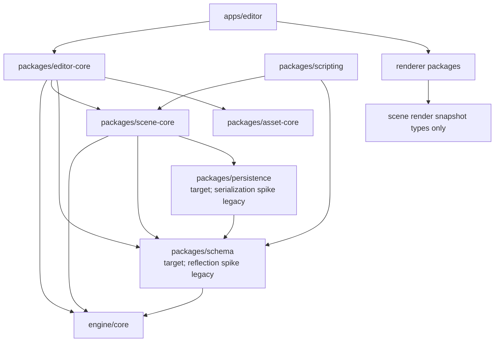
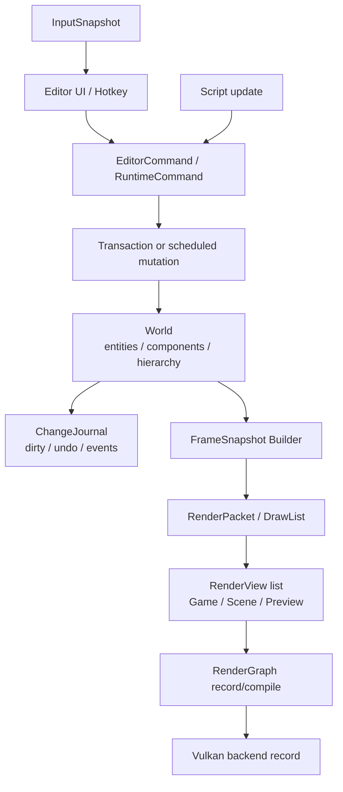
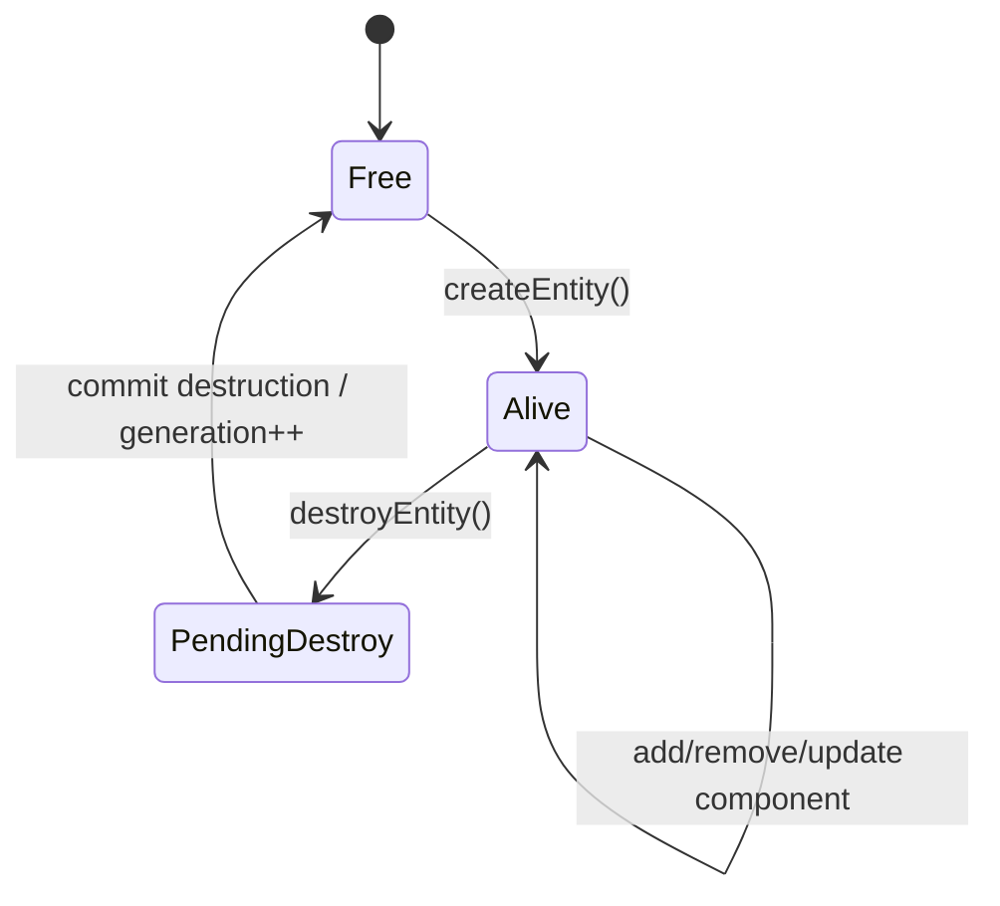
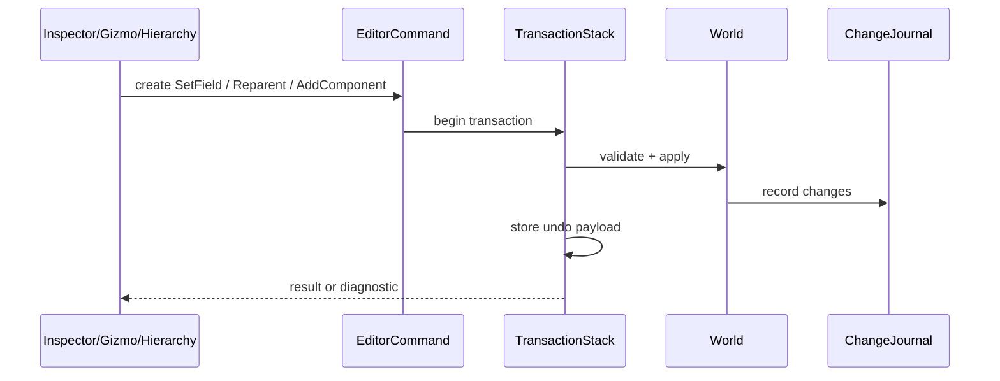
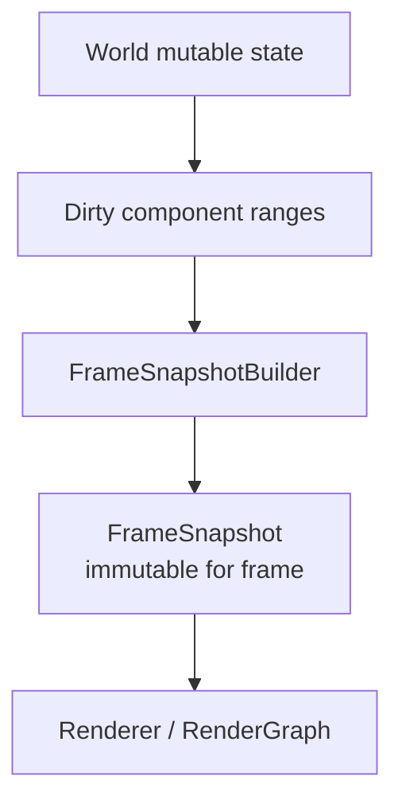
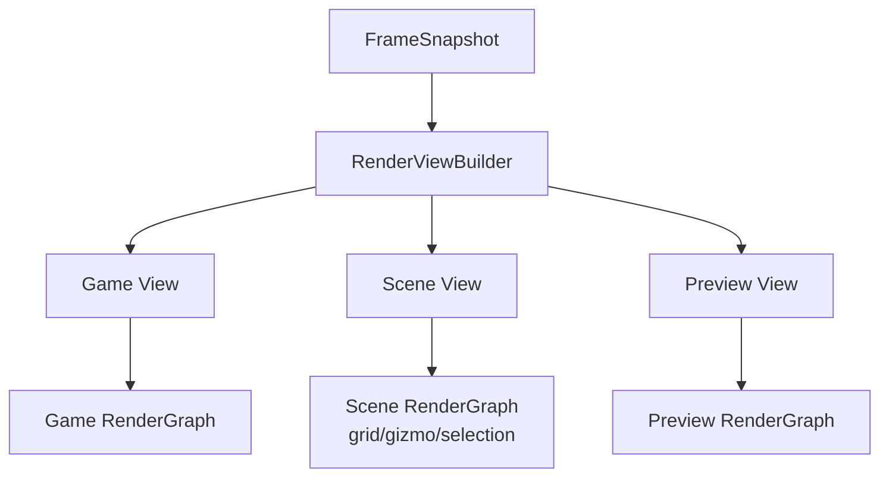
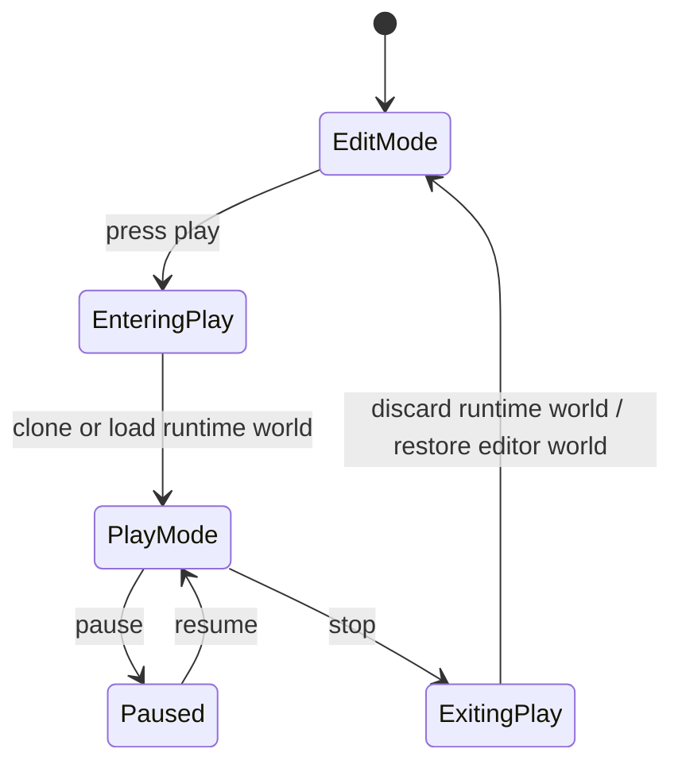
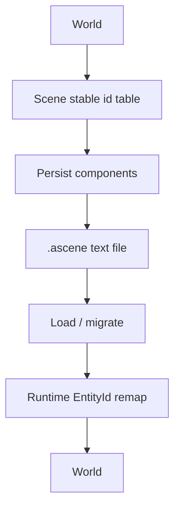
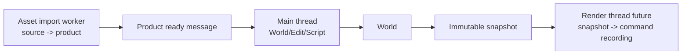

# Scene / World 架构

研究日期：2026-05-10

本文定义 Asharia Engine 后续 scene、world、entity、component、selection、transaction、render snapshot 和
Play Mode 的边界。它不是完整 ECS 实现说明，而是约束后续 `scene-core`、`editor-core`、`scripting`、
`asset-core` 和 renderer 之间的数据流。核心原则是：World 持有可变游戏/编辑数据，renderer 只消费
不可变 frame snapshot 或 render packet。

## 设计目标

- 同一套 scene/world 数据模型服务 editor 和 runtime。
- Entity handle 稳定且能检测悬挂引用。
- Component 数据可由 schema 描述、可通过 persistence 保存、可被 editor transaction 修改。
- Renderer 不捕获 `World*`、`Entity*` 或 mutable component pointer。
- 脚本通过受控 API 修改 world，不在 render recording 阶段改 scene。
- Scene View、Game View 和 Preview View 可以同帧共存，各自拥有 RenderView 和 graph。
- Edit Mode 与 Play Mode 的数据关系明确，进入/退出 Play 不污染编辑场景。

## 非目标

第一版不做：

- 完整高性能 archetype ECS。
- 多线程 mutable World。
- 网络同步。
- prefab override 全系统。
- physics、animation 和 audio 集成。
- streaming world / large world coordinates。
- renderer 直接遍历 scene graph。
- editor-only 组件进入 runtime cook。

## 一手资料结论

| 资料 | 关键事实 | 对 Asharia Engine 的约束 |
| --- | --- | --- |
| Godot thread-safe APIs: https://docs.godotengine.org/en/stable/tutorials/performance/thread_safe_apis.html | Godot 文档明确 SceneTree 交互不是任意线程安全；跨线程更适合 server-style API 或 deferred call。 | Asharia Engine 第一版 World 默认主线程拥有；worker thread 只处理 immutable snapshot、job data 或消息。 |
| Unreal parallel rendering: https://dev.epicgames.com/documentation/en-us/unreal-engine/parallel-rendering-overview-for-unreal-engine | Unreal 把 game thread、render thread 和 RHI thread 分离，渲染侧通过 proxy/snapshot 消费游戏数据。 | Renderer 后续应消费 render snapshot/draw packet，不直接读 gameplay/editor object。 |
| Unity Job System: https://docs.unity3d.com/Manual/JobSystemOverview.html | Unity Job System 强调可并行数据和 safety 规则。 | Asharia Engine worker job 应处理 plain data；mutable World 访问必须通过主线程或明确同步模型。 |
| Unity SRP / RenderGraph: https://docs.unity3d.com/Manual/urp/render-graph-introduction.html | Editor 可有 Game View、Scene View、preview 等多个渲染视图。 | RenderGraph 和 profiling 不应假设一帧只有一个 view graph。 |
| Vulkan threading guide: https://docs.vulkan.org/guide/latest/threading.html | Vulkan 对 command pool、descriptor pool 等对象有外部同步要求。 | Scene/renderer 多线程设计不能让多个线程共享录制资源；未来多线程录制要 per-thread pool。 |

## Package 边界

建议新增：

```text
packages/scene-core
  include/asharia/scene/
  src/

packages/editor-core
  include/asharia/editor/
  src/
```

依赖方向：



约束：

- `scene-core` 不依赖 ImGui、Vulkan、renderer implementation 或 scripting runtime。
- `editor-core` 不依赖 ImGui、Vulkan 或 renderer implementation。
- renderer 可以依赖后端无关的 render packet 类型，不能依赖 mutable `World`。
- `apps/editor` 负责 ImGui integration 和 editor viewport host，不把 ImGui 类型塞进 `editor-core`。

## 总体流程



关键结论：

- UI、脚本和工具都通过 command 进入 World mutation。
- World mutation 记录 change journal。
- Renderer 只看 snapshot，不看 live World。
- Scene View 的 editor-only pass 由 RenderView flags 控制。

## 核心对象模型

第一版可以简单，重点是 handle、owner 和数据流正确：

```cpp
namespace asharia {

struct EntityId {
    std::uint32_t index;
    std::uint32_t generation;
};

struct ComponentTypeId {
    TypeId value;
};

struct TransformComponent {
    Vec3 position;
    Quat rotation;
    Vec3 scale;
};

struct NameComponent {
    std::string name;
};

struct HierarchyComponent {
    EntityId parent;
    EntityId firstChild;
    EntityId nextSibling;
    EntityId previousSibling;
};

class World {
public:
    Result<EntityId> createEntity(std::string_view name);
    Result<void> destroyEntity(EntityId entity);
    bool isAlive(EntityId entity) const;

    template <class T>
    Result<T&> addComponent(EntityId entity, T component);

    template <class T>
    T* tryGetComponent(EntityId entity);
};

} // namespace asharia
```

技术点：

- `EntityId` 使用 index + generation。删除 entity 时 generation 增加，旧 id 自动失效。
- `EntityId{0,0}` 可保留为 invalid，但需要统一 helper。
- 第一版 component storage 可以是 type-erased sparse array，不急着做 archetype chunk。
- Component 类型必须有 schema 和 C++ binding，便于 persistence、Inspector 和 script binding。
- Hierarchy 关系不能只存在于 editor UI；它是 scene 数据。
- Transform dirty propagation 必须定义：parent 改变时 child world transform 失效。
- 名称不是唯一 ID，不能作为引用基础。

## Entity 生命周期



规则：

- `destroyEntity()` 不应立即让正在遍历的系统崩溃。第一版可以要求只在 update 安全点调用；后续可引入 pending destroy queue。
- 删除 entity 时必须删除或失效其 components、hierarchy link 和 selection。
- 保存 scene 时不能保存 runtime `index/generation`，需要 scene-local stable id remap。
- Undo destroy 需要保存被删除 entity 的 serialized component payload。

## Component Storage

第一版建议优先做可审查实现，而不是极致性能：

```text
World
  entity slots
  component stores by ComponentTypeId
    TransformStore
    NameStore
    HierarchyStore
    MeshRendererStore
```

最低要求：

- `hasComponent(EntityId, ComponentTypeId)`
- `addComponent`
- `removeComponent`
- `tryGetComponent`
- `forEach<T>`
- component version/change counter

后续可演进：

- sparse set
- archetype chunk
- SoA transform cache
- job-friendly component queries

但第一版接口不要暴露具体 storage，否则后续从 sparse set 改为 archetype 会破 API。

## Change Journal

World 每次被 command/transaction 修改时，需要记录结构化变化：

```cpp
enum class WorldChangeKind {
    EntityCreated,
    EntityDestroyed,
    ComponentAdded,
    ComponentRemoved,
    FieldChanged,
    ParentChanged,
    AssetReferenceChanged,
};

struct WorldChange {
    WorldChangeKind kind;
    EntityId entity;
    ComponentTypeId componentType;
    FieldId field;
};
```

用途：

- editor dirty flag
- undo/redo
- scene save prompt
- incremental snapshot rebuild
- script event 或 editor notification
- future asset dependency tracking

约束：

- Change journal 是事实事件，不是万能 EventBus。
- 事件消费者不能通过 journal 隐式拥有 World mutation 权限。
- Change journal 可以被压缩，例如同一字段连续修改只保留最终 dirty 状态，但 transaction undo 仍需保留 before/after。

## Editor Transaction

所有 editor 修改都走 transaction：



Command 类型：

- `CreateEntityCommand`
- `DestroyEntityCommand`
- `SetComponentFieldCommand`
- `AddComponentCommand`
- `RemoveComponentCommand`
- `ReparentEntityCommand`
- `SetAssetReferenceCommand`

技术点：

- Command validate 不应部分修改世界。
- Apply 失败要返回诊断，不留下半修改状态。
- Undo payload 可保存 serialized before value。
- Drag 操作可合并 transaction，例如 gizmo 连续拖动 transform。
- Runtime update 不一定走 editor transaction，但需要自己的 scheduled mutation 和 diagnostic。

## Selection

Selection 属于 editor-core，不属于 scene-core；但保存 selection preset 或 editor layout 时可序列化 editor-only 数据。

```cpp
struct SelectionSet {
    std::vector<EntityId> entities;
};
```

规则：

- Selection 存 `EntityId`，不存指针。
- Entity 删除时 selection 自动移除失效 id。
- 多选 Inspector 支持 mixed value。
- Scene View selection outline 通过 RenderView flags 和 render packet 表达，不修改 Game View。

## Render Snapshot

Renderer 不能读 live World。World 在 frame safe point 生成 snapshot：



建议类型：

```cpp
struct RenderObjectPacket {
    EntityId entity;
    Mat4 worldFromLocal;
    AssetHandle<MeshAsset> mesh;
    AssetHandle<MaterialAsset> material;
    RenderObjectFlags flags;
};

struct CameraPacket {
    EntityId entity;
    Mat4 view;
    Mat4 projection;
    RenderViewKind viewKind;
};

struct FrameSnapshot {
    std::span<const RenderObjectPacket> renderObjects;
    std::span<const CameraPacket> cameras;
};
```

技术点：

- Snapshot memory 由 frame arena 或 ring buffer 拥有，生命周期至少覆盖 command recording。
- Snapshot 不含 `World*`。
- Snapshot 中的 asset handle 必须可解析为 runtime product 或 fallback resource。
- Editor-only object 可以进入 Scene View snapshot，但不能进入 Game View 或 cooked runtime snapshot。
- Selection outline 可通过 `RenderObjectFlags::Selected` 或独立 editor overlay packet 表达。

## RenderView 集成



规则：

- 每个 RenderView 拥有独立 camera、target、flags 和 graph。
- Pipeline/shader/descriptor cache 可跨 view 共享。
- View-local descriptor sets、camera params 和 transient resources 必须隔离。
- Scene View 可加 editor-only pass：grid、gizmo、selection outline、wire overlay。
- Game View 不包含 editor-only pass。
- Preview View 复用 renderer backend，但可以使用专用 lighting/background。

## Edit Mode / Play Mode

Play Mode 是最容易污染架构的系统，必须早定规则。

建议模型：



推荐第一版：

- Edit World 是用户正在编辑的 scene。
- Play World 是从 Edit World clone 或从 serialized scene load 出来的 runtime world。
- Play Mode 修改默认不回写 Edit World。
- 明确提供少量 “apply changes to edit world” 操作时必须走 transaction。
- 脚本 runtime state 存在 Play World 或 ScriptHost，不污染 Edit World。

技术点：

- EntityId 在 Edit World 和 Play World 之间不能直接通用，需要 stable id remap。
- AssetGuid 可以跨 world 通用。
- Editor selection 仍指向 Edit World；Game View debug selection 需要单独映射。
- Play enter 前可要求保存或先通过 persistence 写入临时 scene buffer。

## 持久化

Scene save/load 依赖 schema 和 persistence：



规则：

- 文件保存 stable scene id，不保存 runtime index/generation。
- Component 数据通过 schema/persistence 保存。
- Editor-only component 或字段必须标记，cook 时剥离。
- Unknown component 可作为 opaque payload 保留或明确失败；第一版建议失败并带诊断。
- Parent-child 关系保存 stable id。

## 线程模型

第一版：

- World mutable access 在主线程。
- Script update 在主线程。
- Editor transaction 在主线程。
- Asset import worker 通过消息提交 product result，不直接改 active World。
- Renderer 使用 snapshot，可以在未来 render thread 消费。



Vulkan 相关约束：

- Snapshot 跨线程安全不等于 Vulkan object 跨线程安全。
- 未来多线程 command recording 必须使用 per-thread command pool。
- Descriptor pool 分配也需要 per-thread/per-frame ownership，不能让 scene job 直接写 descriptor。

## 错误与诊断

World/scene 错误必须带上下文：

- entity id
- stable scene id
- component type
- field id/name
- command name
- transaction id
- file path
- operation

示例：

```text
Scene error:
  operation: ReparentEntityCommand
  entity: entity(42,7)
  parent: entity(12,3)
  reason: cannot reparent entity under its descendant
```

## 最小 smoke 建议

- `--smoke-scene-entity-lifetime`：创建、删除、旧 id 失效。
- `--smoke-scene-hierarchy`：parent/child 保存加载后正确。
- `--smoke-scene-transform-snapshot`：修改 transform 后 snapshot 变化。
- `--smoke-editor-transaction-transform`：字段修改可 undo/redo。
- `--smoke-scene-view-flags`：Scene View packet 含 selected flag，Game View 不含 editor overlay。
- `--smoke-play-world-copy`：进入 Play 后修改 Play World，退出不污染 Edit World。

## 审查清单

新增 scene/world 功能时检查：

- 是否通过 `EntityId`，没有裸对象指针跨系统保存。
- 是否记录 change journal。
- Editor 修改是否走 transaction。
- Runtime 修改是否在合法 update/scheduled mutation 阶段。
- Renderer 是否只消费 snapshot。
- Scene View 专用数据是否不会进入 Game View。
- Editor-only 字段是否不会进入 cook。
- 跨线程访问是否是 immutable snapshot、job data 或 message。

## 暂缓事项

- Archetype ECS。
- Prefab override 和 nested prefab。
- 多线程 World mutation。
- Scene streaming。
- Physics integration。
- Animation graph。
- Network replication。
- Live link / remote scene edit。

这些能力都依赖稳定的 EntityId、component schema/binding、transaction、persistence 和 snapshot 小闭环。
