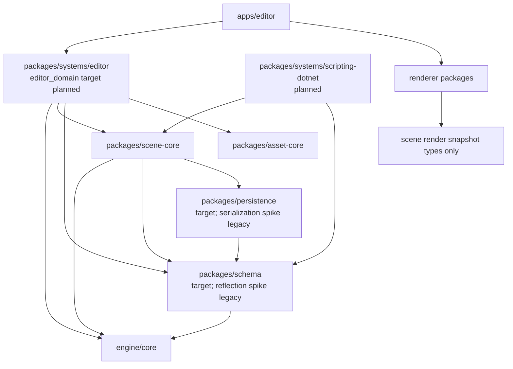
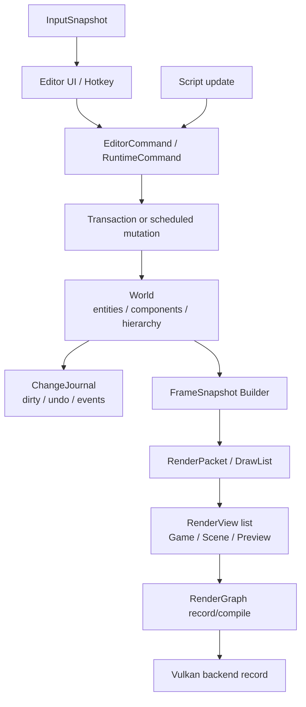
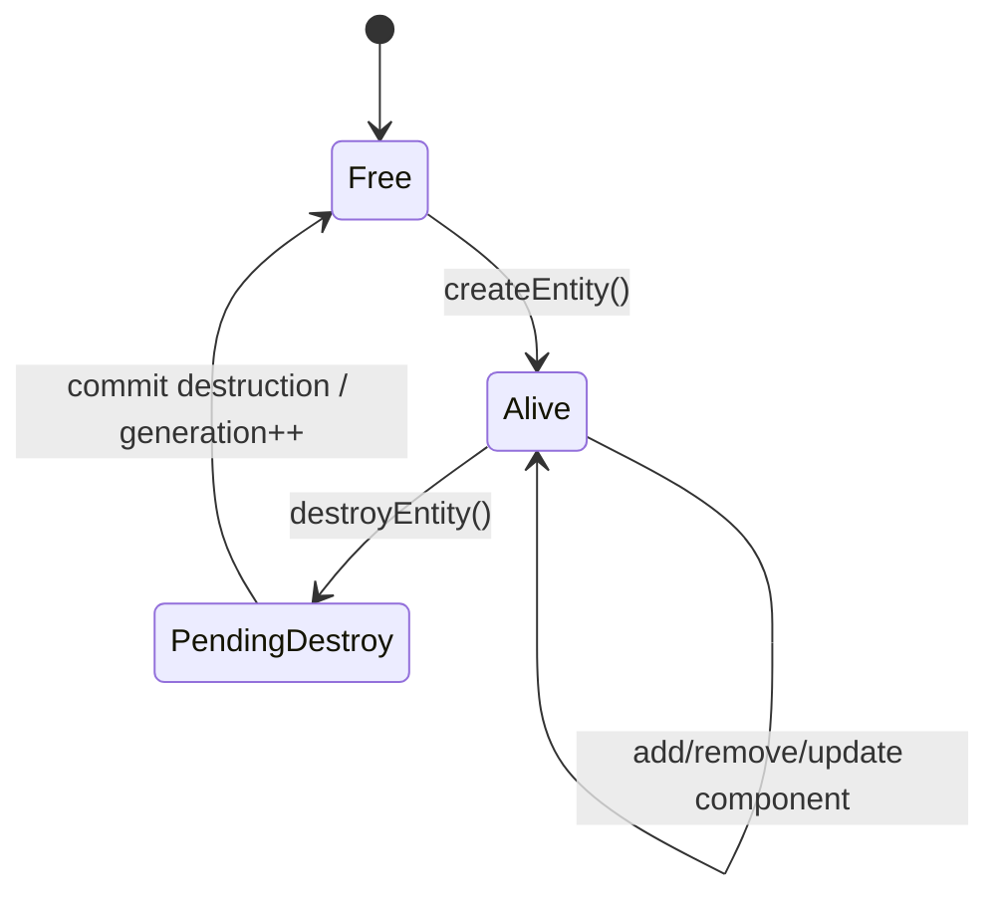
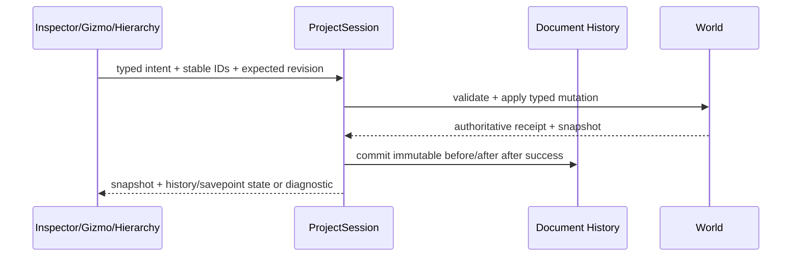
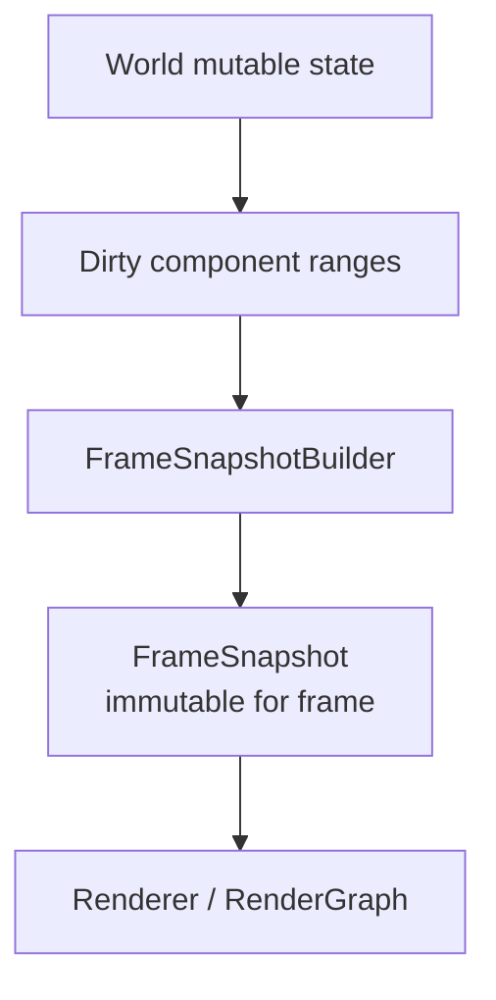
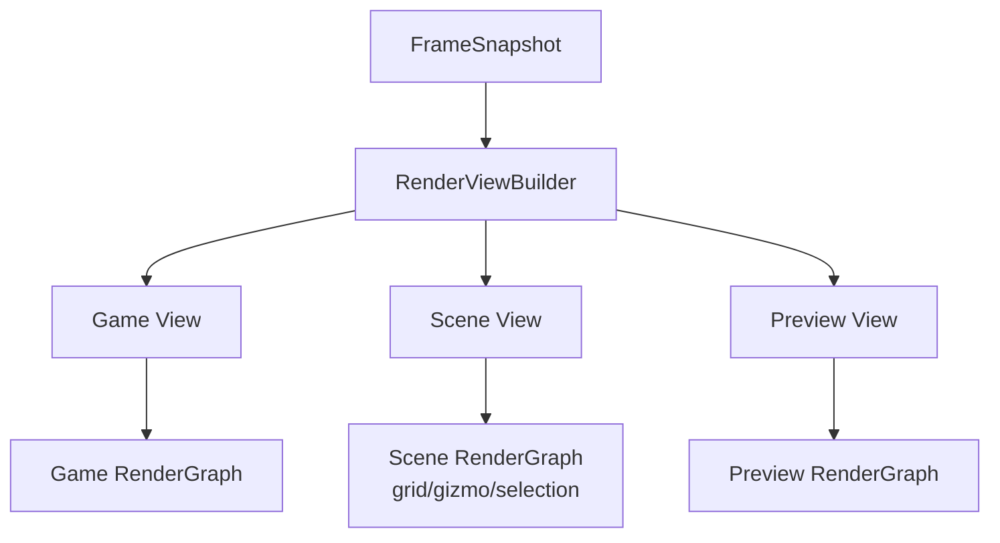
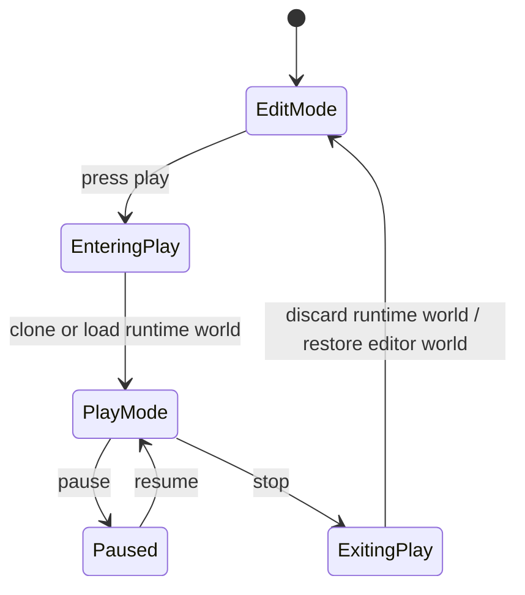
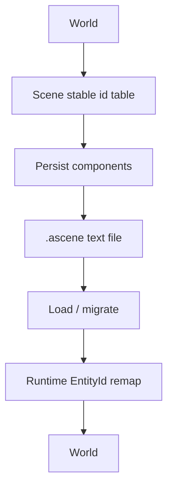
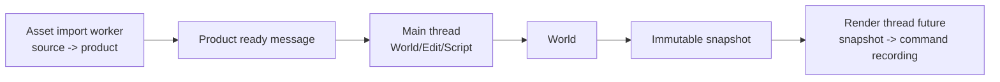

# Scene / World 架构

研究日期：2026-05-10
状态：Target Architecture；`scene-core` 的当前能力必须以代码和 `docs/architecture/flow.md` 为准。

本文定义 Asharia Engine 后续 scene、world、entity、component、selection、transaction、render snapshot 和
Play Mode 的边界。它不是完整 ECS 实现说明，而是约束后续 `scene-core`、Editor System、Scripting System、
`asset-core` 和 renderer 之间的数据流。核心原则是：World 持有可变游戏/编辑数据，renderer 只消费
不可变 frame snapshot 或 render packet。

## 设计目标

- 同一套 scene/world 数据模型服务 editor 和 runtime。
- Entity handle 稳定且能检测悬挂引用。
- Component 数据可由 schema 描述、可通过 persistence 保存、可被 editor transaction 修改。
- Renderer 不捕获 `World*`、`Entity*` 或 mutable component pointer。
- 脚本通过受控 API 修改 world，不在 render recording 阶段改 scene。
- Scene View、Game View 和 Preview View 可以同帧共存，各自拥有 RenderView 和 graph。
- Edit Mode 与 Play Mode 的数据关系明确，进入/退出 Play 不污染编辑场景。
- World 提供稳定 entity bounds、region query 和 immutable spatial snapshot，但不泄漏具体 acceleration structure。

## 非目标

第一版不做：

- 完整高性能 archetype ECS。
- 多线程 mutable World。
- 网络同步。
- prefab override 全系统。
- physics、animation 和 audio 集成。
- streaming world / large world coordinates。
- 一棵被 Renderer、Physics、Navigation 共用的全局 mutable octree/BVH。
- renderer 直接遍历 scene graph。
- editor-only 组件进入 runtime cook。

## 一手资料结论

| 资料 | 关键事实 | 对 Asharia Engine 的约束 |
| --- | --- | --- |
| Godot thread-safe APIs: https://docs.godotengine.org/en/stable/tutorials/performance/thread_safe_apis.html | Godot 文档明确 SceneTree 交互不是任意线程安全；跨线程更适合 server-style API 或 deferred call。 | Asharia Engine 第一版 World 默认主线程拥有；worker thread 只处理 immutable snapshot、job data 或消息。 |
| Unreal `FWorldContext`: https://dev.epicgames.com/documentation/en-us/unreal-engine/API/Runtime/Engine/FWorldContext | UE 用 engine-owned context 区分 Game、Editor 与 PIE World 轨道，并明确外部代码不应直接管理 `FWorldContext`。 | World 生命周期必须由显式 owner/context 持有；native caller 只拿受约束的 World handle，不获得 context 内部对象。 |
| O3DE `EntityContext`: https://docs.o3de.org/docs/api/frameworks/azframework/class_az_framework_1_1_entity_context.html | O3DE 的 context 拥有一组 entity，edit/runtime 可使用独立 context，并提供显式 `InitContext` / `DestroyContext`。 | Asharia 的 ABI 先建立独立 World create/destroy 生命周期；Editor/Play World 的具体 context owner 留给后继 Host/WorldScope。 |
| Godot GDExtension C interface: https://docs.godotengine.org/en/latest/engine_details/engine_api/gdextension/gdextension_interface_json_file.html | Godot 把原生扩展作为 shared library，C interface 用固定宽度值与 opaque struct pointer 表示 handles。 | 跨语言边界使用 C-compatible header、导出函数、版本/结构大小和 opaque handle，不暴露 C++ object layout。 |
| Unreal `FMassEntityHandle`: https://dev.epicgames.com/documentation/en-us/unreal-engine/API/Plugins/MassEntity/FMassEntityHandle | UE Mass 的轻量 entity handle 明确包含 `Index` 与 `SerialNumber`；handle 是否已设置不等于 entity 仍被 manager 持有。 | ABI 保留 index + generation，并让存活性由拥有该 ID 的 World 查询，不能仅凭非零 ID 推断存活。 |
| Bevy entity lifecycle: https://docs.rs/bevy/latest/bevy/ecs/entity/ | Bevy 释放 entity slot 时增加 generation，使旧 ID 失效；已 despawn 的 ID 仍可能留在调用方并需要 fallible 处理。 | destroy 后旧 ID 必须稳定失效，槽位复用不得让旧调用误命中新 entity。 |
| Flecs entities/components: https://www.flecs.dev/flecs/md_docs_2EntitiesComponents.html | Flecs 的 C API 使用固定宽度 entity ID，保留零为 invalid，并在 ID 中携带 liveliness/version 信息。 | C ABI 使用 fixed-width index/generation，零值作为 invalid/failed output，不引入跨边界 C++ handle。 |
| Unreal `USceneComponent`: https://dev.epicgames.com/documentation/unreal-engine/API/Runtime/Engine/USceneComponent | UE 明确区分 relative transform（相对 parent）与 component/world transform。 | 当前 `TransformComponent` 与 native ABI 明确命名为 local；没有 hierarchy 时不虚构 world-transform 语义。 |
| Unreal `TQuat`: https://dev.epicgames.com/documentation/en-us/unreal-engine/API/Runtime/Core/TQuat | UE quaternion API 提供 `ContainsNaN` / `IsNormalized`，多项旋转运算要求 normalized quaternion。 | ABI set-local-transform 拒绝非有限值与非单位 rotation，不静默归一化不可信边界输入。 |
| Unreal `TTransformSRT3`: https://dev.epicgames.com/documentation/en-us/unreal-engine/API/Runtime/GeometryCore/TTransformSRT3 | UE 明确写出 Scale→Rotate→Translate，即传统 matrix-vector 记法的 `(T * R * S) * v`；`TQuat` 的 `(X,Y,Z,W)` 乘法则是右侧 rotation 先应用。 | local model matrix 固定为 `T * R * S`，quaternion 固定为 `(x,y,z,w)`；拒绝复制顺序相反的 `FTransform A * B` operator 语义。 |
| O3DE `TransformInterface`: https://docs.o3de.org/docs/api/frameworks/azcore/class_a_z_1_1_transform_interface.html | O3DE 分别提供 `Get/SetLocalTM` 与 world-transform 操作，local 不含 parent transform。 | local 与 world operation 必须是独立合同；当前 Slice 只发布 local get/set。 |
| O3DE `Transform.inl`: https://github.com/o3de/o3de/blob/development/Code/Framework/AzCore/AzCore/Math/Transform.inl | O3DE 的 `TransformPoint` 实现为 `Rotate(scale * point) + translation`，但核心 `Transform` 只带 uniform scale。 | 采用 S→R→T 的点变换顺序；拒绝把 Asharia 已有的逐轴 scale 降级成 uniform-only contract。 |
| Godot `Transform3D`: https://docs.godotengine.org/en/latest/classes/class_transform3d.html | Godot 提供逐 component 的 `is_finite()`，并为依赖正交/归一化的 transform math 写明前置条件。 | public mutation boundary 必须先拒绝 NaN/Inf，避免非法 float 进入未来 hierarchy/snapshot/renderer。 |
| Godot `Basis`: https://docs.godotengine.org/en/stable/classes/class_basis.html | `Basis` 的三个 axis 是矩阵列，局部逐轴 scale 对应缩放这些列；它也明确区分 determinant 为零的不可逆和负 determinant 的镜像。 | row-major 存储不改变 column-vector 数学语义；local `R * S` 必须缩放 rotation 的列，有限 zero/negative scale 保持显式。 |
| Unity `Matrix4x4.TRS`: https://docs.unity3d.com/ScriptReference/Matrix4x4.TRS.html | Unity 以 position、quaternion、scale 构造单个 TRS matrix，其 quaternion `lhs * rhs` 同样先应用右侧 rotation。 | 交叉确认 authored quaternion + 非均匀 scale 应成为一个确定的 local model matrix，不增加 smoke-only matrix builder。 |
| Unreal Vector / Rotator Controls: https://dev.epicgames.com/documentation/en-us/unreal-engine/vector-/-rotator-controls | Unreal Details 把 rotation 呈现为按轴的 degree 数值控件，而不是要求用户直接编辑 quaternion。 | Studio Inspector 使用 X/Y/Z degree 字段；runtime/document 仍只保存单位 quaternion。 |
| Unity Rotation and Orientation / `TransformRotationGUI`: https://docs.unity3d.com/Manual/QuaternionAndEulerRotationsInUnity.html / https://github.com/Unity-Technologies/UnityCsReference/blob/master/Editor/Mono/Inspector/TransformRotationGUI.cs | Unity 把 Inspector Euler angles 与内部 quaternion 分开；Inspector 还保留按轴输入状态，只替换本次实际修改的轴。 | 采用“人类可编辑的 Euler presentation → authoritative quaternion”，并让 Studio 识别自己的 edit receipt；不把 Euler 写入 runtime scene schema。 |
| Godot `Node3D`: https://docs.godotengine.org/en/stable/classes/class_node3d.html | Godot Inspector 以 degrees 编辑 rotation，并以显式 `rotation_order` 决定 Euler 构造顺序；默认是 YXZ。 | Asharia 首个 Inspector 合同固定 local YXZ，避免未标注顺序；暂不增加 per-entity rotation-order 字段或编辑模式。 |
| Unreal object name / Actor label: https://dev.epicgames.com/documentation/unreal-engine/API/Runtime/CoreUObject/UObjectBaseUtility/GetName 、https://dev.epicgames.com/documentation/en-us/unreal-engine/BlueprintAPI/EditorScripting/ActorEditing/SetActorLabel | UE 区分实际 object name 与 development-only Editor friendly label。 | 当前 World name 只承诺可变 display/debug text，不冒充稳定 identity、path 或未来 Editor label policy。 |
| O3DE `AZ::Entity`: https://docs.o3de.org/docs/api/frameworks/azcore/class_a_z_1_1_entity.html 、https://www.docs.o3de.org/docs/api/frameworks/azcore/class_a_z_1_1_component_application_requests.html | O3DE entity 提供 mutable GetName/SetName，并明确 entity names 非唯一且用于诊断。 | name 不唯一、不提供 find-by-name；generation-safe ID 仍是唯一运行时寻址合同。 |
| Godot `Node.name`: https://docs.godotengine.org/en/4.5/classes/class_node.html | Godot Node name 参与 sibling uniqueness 与 hierarchy path。 | 当前没有 hierarchy，不能提前导入 sibling uniqueness、路径字符过滤或自动重命名语义。 |
| Unicode well-formed UTF-8: https://www.unicode.org/versions/Unicode17.0.0/core-spec/chapter-3/ | Unicode 用精确合法 byte ranges 定义 well-formed UTF-8，ill-formed 序列必须作为错误而非字符解释。 | native set-name 对 malformed/overlong/surrogate/out-of-range/truncated input fail closed，不静默 replacement。 |
| SQLite C text lifetime: https://www.sqlite.org/c3ref/column_blob.html | SQLite 明确区分 UTF-8 byte length 与 terminator，并提醒 borrowed text pointer 会随后续 mutation 失效。 | native get-name 使用 caller-owned exact-byte copy-out，不跨 World mutation 暴露 borrowed `char*` 或 allocator。 |
| .NET native interop: https://learn.microsoft.com/en-us/dotnet/standard/native-interop/best-practices | .NET 建议 managed signature 使用最接近 native 的 primitive，并让跨边界 value struct 使用 fixed layout 与 blittable fields。 | `Asharia.Runtime.Contracts` 的 Scene values 显式固定 size/offset，只包含 `uint`、`float` 或同样固定的嵌套 value。 |
| Unity native plug-ins: https://docs.unity3d.com/2023.2/Documentation/Manual/NativePlugins.html | Unity 使用简单 C interface 作为 managed gameplay code 与 native plug-in 的边界。 | 后续 managed World bridge 应包裹当前 C ABI；不能让 Avalonia、ViewModel 或项目脚本直接持有 C++ object layout。 |
| Unreal parallel rendering: https://dev.epicgames.com/documentation/en-us/unreal-engine/parallel-rendering-overview-for-unreal-engine | Unreal 把 game thread、render thread 和 RHI thread 分离，渲染侧通过 proxy/snapshot 消费游戏数据。 | Renderer 后续应消费 render snapshot/draw packet，不直接读 gameplay/editor object。 |
| Unity Job System: https://docs.unity3d.com/Manual/JobSystemOverview.html | Unity Job System 强调可并行数据和 safety 规则。 | Asharia Engine worker job 应处理 plain data；mutable World 访问必须通过主线程或明确同步模型。 |
| Unity SRP / RenderGraph: https://docs.unity3d.com/Manual/urp/render-graph-introduction.html | Editor 可有 Game View、Scene View、preview 等多个渲染视图。 | RenderGraph 和 profiling 不应假设一帧只有一个 view graph。 |
| Vulkan threading guide: https://docs.vulkan.org/guide/latest/threading.html | Vulkan 对 command pool、descriptor pool 等对象有外部同步要求。 | Scene/renderer 多线程设计不能让多个线程共享录制资源；未来多线程录制要 per-thread pool。 |

## Local TRS 合同

`TransformComponent`、scene schema 与 managed `TransformValue` 的 source of truth 都是 local
`position + rotation + scale`。矩阵数组使用 row-major 存储，但数学采用 column vector：

```text
localPoint' = Mlocal * localPoint
Mlocal = T(position) * R(unit quaternion x,y,z,w) * S(scale)
```

因此 scale 先作用于 local axis，rotation 再改变方向，translation 最后作用；`R * S` 的实现必须缩放
rotation matrix 的三列，translation 位于 4×4 row-major 数组的 `[3, 7, 11]`。`q` 与 `-q` 表示同一
rotation。authoritative mutation boundary 接受单位 quaternion，不静默 normalize、替换为 identity 或调整
scale；有限 non-uniform、negative 与 zero scale 都保持为显式 local 值并进入前向 model matrix。

Studio Inspector 是 editor-local presentation；runtime、SceneDocument、schema 与 snapshot 的 Transform 真相仍是 float
Position/Scale 与单位 quaternion Rotation。Inspector 显示 Rotation X/Y/Z degrees，固定按 local `YXZ`
顺序构造 rotation，随后在 ViewModel/application mutation boundary 转成单位 quaternion `(x,y,z,w)`。

当前单选编辑会话统一保留 Position/Rotation/Scale 九个 source text、九字段 dirty mask、单调
edit version、每字段 edit version 与一个 pending Transform Apply。pending 记录 edit id、session/scene/object
scope、base revision、已提交 Transform/Euler/source text、dirty mask 与 edit version；project snapshot event 携带
该 edit 的成功/失败结果。自己的成功 publication 只有在来源、revision、object scope 与 Transform
都匹配时才作为 own acknowledgement：Position/Scale 精确匹配 float 值，Rotation 匹配空间姿态。未在
Apply 发出后再编辑的字段保留已提交 source text；后续输入保留草稿和 dirty，旧 publication 不得覆盖。

外部 mutation、Undo、Redo 或 failure snapshot 只投影 authoritative Transform 中真正变化的 clean 字段，保留
并重基 dirty 草稿。同值 snapshot、改名、保存和重复 publication 不得无条件用 float `G9` 重新格式化
Position/Scale 文本；例如 authoritative float 未变时，用户输入的 `"1.2"` 保持为 `"1.2"`。只有真正外部的
不同 quaternion 姿态才枚举固定 YXZ 的等价分支及 `±360n` 展开，并在重组验证姿态相同后选择最接近
Euler hint 的表示；奇异区利用 hint 选择连续解，而不是强制某轴为零。

document no-op 仍按逐字段 exact Transform 值相等判定：`q` 与 `-q` 虽然姿态相同，但在 #373 中仍是
changed authored value，并可进入 history。Inspector 把二者当作同姿态仅用于保持 acknowledgement/Euler 显示稳定，
不会改写 document 值语义。Euler hint、source text 与 dirty 草稿不进入 runtime scene schema、revision 或 viewport
ABI；selection、project session、scene 或 selected object 变更时丢弃整个 transient 编辑会话。跨会话 winding
persistence 仍 deferred。

当前完成范围止于 local TRS 经 `SceneDocumentSnapshot`、`ViewportRenderRequest`、native V10 request、
scene-rendering extraction 到 draw item 原样传递。以下项目明确 deferred，不能借本合同提前实现：

- hierarchy、parent/world transform、dirty propagation、reparent、shear 或 world-matrix cache；
- normal/inverse-transpose matrix、lighting/tangent space、negative-determinant winding/culling policy；
- rotation gizmo、snapping、multi-selection、per-entity Euler order 或连续多圈 Euler history。当前只完成固定 YXZ 的
  单实体 local-degree Inspector presentation；这些后继功能不得改变 authoritative quaternion/schema 合同。

## Package 边界

当前 `packages/scene-core` 是 World baseline source package；目标发行布局收敛为：

```text
packages/systems/world/modules/world-core
packages/systems/editor/modules/editor-domain
```

二者仍是独立 targets；目录收敛前继续使用现有 `packages/scene-core`，不为移动文件提前创建空目录。

依赖方向：


```mermaid
flowchart TD
    Core["engine/core"]
    Reflection["packages/schema<br/>target; reflection spike legacy"]
    Serialization["packages/persistence<br/>target; serialization spike legacy"]
    Scene["packages/scene-core"]
    Editor["packages/systems/editor<br/>editor_domain target planned"]
    Script["packages/systems/scripting-dotnet<br/>planned"]
    Asset["packages/asset-core"]
    Renderer["renderer packages"]
    AppEditor["apps/editor"]

    Reflection --> Core
    Serialization --> Reflection
    Scene --> Core
    Scene --> Reflection
    Scene --> Serialization
    Editor --> Core
    Editor --> Scene
    Editor --> Reflection
    Editor --> Asset
    Script --> Scene
    Script --> Reflection
    Renderer --> SceneSnapshot["scene render snapshot types only"]
    AppEditor --> Editor
    AppEditor --> Renderer
```

约束：

- `scene-core` 不依赖 ImGui、Vulkan、renderer implementation 或 scripting runtime。
- `asharia::scene_native` shared adapter 只依赖 `asharia::scene_core`；公开 header 可由 C11 consumer
  直接编译，只有 fixed-width status/header/entity/Transform values、length-delimited UTF-8 view、opaque
  World handle 与窄生命周期/本地 Transform/name functions。
- 当前 native World handle 只记录并校验创建线程，不猜测哪个线程是进程主线程；Host/WorldScope 必须在其
  control/main thread 创建它。所有 World/entity/Transform 调用 wrong-thread 时 fail closed，成功 World
  destroy 后 handle 立即失效；caller 必须先停止并 drain 依赖工作。
- native entity ID 仅在所属 World 内有效；index + generation 与 runtime `EntityId` 一一映射，零值无效。
  destroy 增加 generation，因此旧 ID 在槽位复用后仍不能访问新 entity；is-alive 对 stale ID 成功返回 false。
- native Transform 只表示 local position/quaternion/scale；get 失败先把 output 清零，set 拒绝任意 component
  的 NaN/Inf 与非单位 quaternion，且不静默 normalize/clamp。有限 zero/negative scale 可透传；hierarchy/world
  Transform、dirty propagation 与 change notification 尚不存在。
- managed `Asharia.Runtime.Contracts` 只固定对应的 plain value layout：`EntityId` 为 8 bytes，
  `Float3` 为 12 bytes，`Quaternion` 为 16 bytes，`TransformValue` 为 40 bytes；Transform 的
  position/rotation/scale offsets 分别为 0/12/28。它们不包含 managed reference，保留 positional record
  construction/value equality；该合同 assembly 自身不声明 P/Invoke、World handle、thread dispatch 或
  provider ownership。
- managed `Asharia.Studio.EngineBridge.SceneWorld` 是当前唯一窄绑定 owner：它使用 source-generated
  World/entity/local Transform/name imports，持有并隐藏 native World handle，并在 native 调用前执行
  open/owner-thread 与结构化 entity ID 有效性检查。local Transform 直接复用 `TransformValue`，不复制
  native 的 finite/unit-quaternion 容差算法；stale entity 与 invalid Transform status 保留为带 operation
  context 的 managed error。entity
  name 使用 strict UTF-8：get 只分配 native length query 后确认不超过 4096 bytes 的 managed buffer，set 只在
  同步调用期间 pin、由 native 返回前复制；empty 合法，malformed success bytes、超长 length 与 query/copy
  drift 都 fail closed。它尚未接入 Application、provider、ProjectSession、Avalonia、文件 IO 或 native
  library deployment。
- native entity name 是 mutable、non-unique display/debug UTF-8 text，不是 identity、path、persistence ID 或
  lookup key。set 立即复制 well-formed UTF-8，empty 合法且不 normalize/trim/case-fold/自动唯一化；get 先查询
  byte length，再完整复制到 caller buffer，不加 NUL、不部分写入，也不暴露随 World mutation 失效的 borrowed
  pointer。native set 上限为 4096 UTF-8 bytes，避免不受限 allocation 与不可信超长 pointer/length；现有
  8-byte create-entity request 保持不变，避免破坏 v1 consumer。
- version 1 ABI 尚不公开 component registry、hierarchy、change journal 或 render
  snapshot；这些必须按独立 Slice 增加，不能通过泄漏 mutable `World*` 省略 owner/safe-point 设计。
- Editor System 内部 `editor_domain` 不依赖 ImGui、Vulkan 或 renderer implementation。
- renderer 可以依赖后端无关的 render packet 类型，不能依赖 mutable `World`。
- `apps/editor` 负责 ImGui integration 和 editor viewport host，不把 ImGui 类型塞进 `editor_domain`。

## 总体流程


```mermaid
flowchart TD
    Input["InputSnapshot"]
    Ui["Editor UI / Hotkey"]
    Script["Script update"]
    Command["EditorCommand / RuntimeCommand"]
    Transaction["Transaction or scheduled mutation"]
    World["World<br/>entities / components / hierarchy"]
    Journal["ChangeJournal<br/>dirty / undo / events"]
    Snapshot["FrameSnapshot Builder"]
    Packet["RenderPacket / DrawList"]
    Views["RenderView list<br/>Game / Scene / Preview"]
    RenderGraph["RenderGraph record/compile"]
    Backend["Vulkan backend record"]

    Input --> Ui --> Command
    Script --> Command
    Command --> Transaction --> World
    World --> Journal
    World --> Snapshot --> Packet --> Views --> RenderGraph --> Backend
```

关键结论：

- UI、脚本和工具都通过 command 进入 World mutation。
- World mutation 记录 change journal。
- Renderer 只看 snapshot，不看 live World。
- Scene View 的 editor-only pass 由 RenderView flags 控制。

## 核心对象模型

第一版可以简单，重点是 handle、owner 和数据流正确：

```cpp
namespace asharia {

struct EntityId {
    std::uint32_t index;
    std::uint32_t generation;
};

struct ComponentTypeId {
    TypeId value;
};

struct TransformComponent {
    Vec3 position;
    Quat rotation;
    Vec3 scale;
};

struct NameComponent {
    std::string name;
};

struct HierarchyComponent {
    EntityId parent;
    EntityId firstChild;
    EntityId nextSibling;
    EntityId previousSibling;
};

class World {
public:
    Result<EntityId> createEntity(std::string_view name);
    Result<void> destroyEntity(EntityId entity);
    bool isAlive(EntityId entity) const;

    template <class T>
    Result<T&> addComponent(EntityId entity, T component);

    template <class T>
    T* tryGetComponent(EntityId entity);
};

} // namespace asharia
```

技术点：

- `EntityId` 使用 index + generation。删除 entity 时 generation 增加，旧 id 自动失效。
- `EntityId{0,0}` 可保留为 invalid，但需要统一 helper。
- 第一版 component storage 可以是 type-erased sparse array，不急着做 archetype chunk。
- Component 类型必须有 schema 和 C++ binding，便于 persistence、Inspector 和 script binding。
- Hierarchy 关系不能只存在于 editor UI；它是 scene 数据。
- Transform dirty propagation 必须定义：parent 改变时 child world transform 失效。
- 名称不是唯一 ID，不能作为引用基础。

## Entity 生命周期


```mermaid
stateDiagram-v2
    [*] --> Free
    Free --> Alive: createEntity()
    Alive --> PendingDestroy: destroyEntity()
    PendingDestroy --> Free: commit destruction / generation++
    Alive --> Alive: add/remove/update component
```

规则：

- `destroyEntity()` 不应立即让正在遍历的系统崩溃。第一版可以要求只在 update 安全点调用；后续可引入 pending destroy queue。
- 删除 entity 时必须删除或失效其 components、hierarchy link 和 selection。
- 保存 scene 时不能保存 runtime `index/generation`，需要 scene-local stable id remap。
- Undo destroy 需要保存被删除 entity 的 serialized component payload。

## Component Storage

第一版建议优先做可审查实现，而不是极致性能：

```text
World
  entity slots
  component stores by ComponentTypeId
    TransformStore
    NameStore
    HierarchyStore
    MeshRendererStore
```

最低要求：

- `hasComponent(EntityId, ComponentTypeId)`
- `addComponent`
- `removeComponent`
- `tryGetComponent`
- `forEach<T>`
- component version/change counter

后续可演进：

- sparse set
- archetype chunk
- SoA transform cache
- job-friendly component queries

但第一版接口不要暴露具体 storage，否则后续从 sparse set 改为 archetype 会破 API。

## Change Journal

World 每次被 command/transaction 修改时，需要记录结构化变化：

```cpp
enum class WorldChangeKind {
    EntityCreated,
    EntityDestroyed,
    ComponentAdded,
    ComponentRemoved,
    FieldChanged,
    ParentChanged,
    AssetReferenceChanged,
};

struct WorldChange {
    WorldChangeKind kind;
    EntityId entity;
    ComponentTypeId componentType;
    FieldId field;
};
```

用途：

- editor dirty flag
- undo/redo
- scene save prompt
- incremental snapshot rebuild
- script event 或 editor notification
- future asset dependency tracking

约束：

- Change journal 是事实事件，不是万能 EventBus。
- 事件消费者不能通过 journal 隐式拥有 World mutation 权限。
- Change journal 可以被压缩，例如同一字段连续修改只保留最终 dirty 状态，但 transaction undo 仍需保留 before/after。

## Spatial Bounds & Query

当前 `scene-core` 尚未实现 spatial index；本节是 Foundation F5 的目标 contract，不是当前 API 说明。

World 需要拥有语义级空间身份和 bounds，因为 Editor region tools、render extraction、audio、AI、future streaming 都需要
知道 entity 位于哪里。它不应拥有 Physics collision broadphase 或 Renderer visibility structure。

计划中的最小数据：

```cpp
struct SpatialProxyId {
    std::uint32_t index;
    std::uint32_t generation;
};

struct SpatialBounds {
    EntityId entity;
    Aabb worldBounds;
    SpatialLayerMask layers;
    std::uint64_t revision;
};
```

计划中的第一阶段能力：

- register/update/remove entity bounds；
- AABB/region overlap query，返回稳定 `EntityId`/`SpatialProxyId`，不返回内部 node pointer；
- transform/bounds change 在 World mutation safe point 合并；
- 发布带 revision/generation 的 immutable `SpatialSnapshot`；
- Editor debug draw、query diagnostics 和 invalid/stale handle 统计；
- render extraction 复制需要的 bounds 到 `RenderWorldSnapshot`，Renderer 再建立自己的 culling projection。

系统分工：

| Owner | 自己维护的数据 | 可消费 World spatial contract 的方式 |
| --- | --- | --- |
| World | entity semantic bounds、region membership、spatial revision | canonical register/query/snapshot owner |
| Renderer | render proxy bounds、view/frustum/occlusion data | 从 render snapshot 构建，不回读 mutable World index |
| Physics | collision shapes、broadphase、ray/shape queries | 通过 entity/component identity 同步，不复用 World tree |
| Navigation | nav mesh/volume/tile query | 消费 cooked/world geometry projection |
| Audio/AI/Editor | listener/agent/selection/region queries | 使用 public query 或 immutable snapshot |

外部脚本可以提交带 capability 和 query budget 的 region/nearest 请求，读取 entity IDs；不能注册任意 index node、锁住
内部容器或在 worker callback 中修改 World。future World Partition 在此 contract 与 Runtime Storage 之上增加 streaming
source、cell、Data Layer/HLOD 产品，不反向进入 World core 第一阶段。

最低验证：register/update/remove、generation reuse、empty/overlap queries、transform revision、snapshot immutability、
deterministic result ordering（需要时显式 sort）和 Renderer/Physics acceleration structure 不共享所有权。

## Editor Transaction

Studio 第一个 authoritative document history 的 governing contract 见
[`ADR-0013`](../../apps/studio/docs/adr/0013-authoritative-document-transform-undo-redo.md)。本节描述 Scene/World
未来扩展 transaction 时必须保持的边界，不表示下列通用 command 类型当前已经实现。

所有 persistent editor 修改最终都应走 typed transaction intent：


```mermaid
sequenceDiagram
    participant UI as Inspector/Gizmo/Hierarchy
    participant Session as ProjectSession
    participant History as Document History
    participant World as World

    UI->>Session: typed intent + stable IDs + expected revision
    Session->>World: validate + apply typed mutation
    World-->>Session: authoritative receipt + snapshot
    Session->>History: commit immutable before/after after success
    Session-->>UI: snapshot + history/savepoint state or diagnostic
```

目标 Command 类型包括：

- `CreateEntityCommand`
- `DestroyEntityCommand`
- `SetComponentFieldCommand`
- `AddComponentCommand`
- `RemoveComponentCommand`
- `ReparentEntityCommand`
- `SetAssetReferenceCommand`

技术点：

- Command validate 不应部分修改世界。
- Apply 失败要返回诊断，不留下半修改状态。
- Undo payload 使用 stable document/object identity 和 immutable before/after value，不保存 UI closure、Control/ViewModel、
  mutable object reference 或 runtime entity handle。
- engine revision 在 Apply/Undo/Redo 后保持单调；document dirty 比较逻辑 `ContentStateId` 与
  `SavedContentStateId`，不能通过回退 revision 实现 Undo-to-savepoint。
- per-document history 使用 `List + cursor`，只有 authoritative mutation 成功后移动 cursor；no-op、failure、cancel、
  revision conflict 与未知 outcome 都不移动。
- history 必须同时有 entry-count 和 byte budget。Studio 首个 Transform Slice 固定为 256 entries 与 16 MiB。
- Drag 操作可合并 transaction，但 gizmo 必须提供明确 begin/update/commit/cancel interaction identity；不得用时间窗口
  猜测同一 transaction。
- Runtime update 不一定走 editor transaction，但需要自己的 scheduled mutation 和 diagnostic。

## Selection

Selection 属于 Editor System 的 `editor_domain`，不属于 scene-core；但保存 selection preset 或 editor layout 时可序列化 editor-only 数据。

Studio 当前进一步把跨面板 selection 限定为 Application-owned、project-scoped typed immutable snapshot：
`SceneObjectSelectionTarget` 使用 authoritative document 的 session/scene/object identity，`AssetSelectionTarget` 使用
session/project/target-profile scope 与 `AssetSelectionKey`，两种 target 不可混用。Asset selection 与只读 catalog
inspection 不进入 World、SceneDocument 或 scene Undo；Inspector 的既有 scene name/Transform mutation 仍经
`ProjectSession` expected-revision command 提交。Project close、entity 删除或 catalog refresh 后 identity 不再存在时，
owner 必须清除或 remap selection，不能保存 panel row、native pointer、runtime handle 或 GPU handle。

```cpp
struct SelectionSet {
    std::vector<EntityId> entities;
};
```

规则：

- Selection 存 `EntityId`，不存指针。
- Entity 删除时 selection 自动移除失效 id。
- 多选 Inspector 支持 mixed value。
- Scene View selection outline 通过 RenderView flags 和 render packet 表达，不修改 Game View。

## Render Snapshot

Renderer 不能读 live World。World 在 frame safe point 生成 snapshot：


```mermaid
flowchart TD
    World["World mutable state"]
    Dirty["Dirty component ranges"]
    Builder["FrameSnapshotBuilder"]
    Snapshot["FrameSnapshot<br/>immutable for frame"]
    Renderer["Renderer / RenderGraph"]

    World --> Dirty --> Builder --> Snapshot --> Renderer
```

建议类型：

```cpp
struct RenderObjectPacket {
    EntityId entity;
    Mat4 worldFromLocal;
    AssetHandle<MeshAsset> mesh;
    AssetHandle<MaterialAsset> material;
    RenderObjectFlags flags;
};

struct CameraPacket {
    EntityId entity;
    Mat4 view;
    Mat4 projection;
    RenderViewKind viewKind;
};

struct FrameSnapshot {
    std::span<const RenderObjectPacket> renderObjects;
    std::span<const CameraPacket> cameras;
};
```

技术点：

- Snapshot memory 由 frame arena 或 ring buffer 拥有，生命周期至少覆盖 command recording。
- Snapshot 不含 `World*`。
- Snapshot 中的 asset handle 必须可解析为 runtime product 或 fallback resource。
- Editor-only object 可以进入 Scene View snapshot，但不能进入 Game View 或 cooked runtime snapshot。
- Selection outline 可通过 `RenderObjectFlags::Selected` 或独立 editor overlay packet 表达。

## RenderView 集成


```mermaid
flowchart TD
    Snapshot["FrameSnapshot"]
    ViewBuilder["RenderViewBuilder"]
    Game["Game View"]
    Scene["Scene View"]
    Preview["Preview View"]
    GameGraph["Game RenderGraph"]
    SceneGraph["Scene RenderGraph<br/>grid/gizmo/selection"]
    PreviewGraph["Preview RenderGraph"]

    Snapshot --> ViewBuilder
    ViewBuilder --> Game --> GameGraph
    ViewBuilder --> Scene --> SceneGraph
    ViewBuilder --> Preview --> PreviewGraph
```

规则：

- 每个 RenderView 拥有独立 camera、target、flags 和 graph。
- Pipeline/shader/descriptor cache 可跨 view 共享。
- View-local descriptor sets、camera params 和 transient resources 必须隔离。
- Scene View 可加 editor-only pass：grid、gizmo、selection outline、wire overlay。
- Game View 不包含 editor-only pass。
- Preview View 复用 renderer backend，但可以使用专用 lighting/background。

## Edit Mode / Play Mode

Play Mode 是最容易污染架构的系统，必须早定规则。

建议模型：


```mermaid
stateDiagram-v2
    [*] --> EditMode
    EditMode --> EnteringPlay: press play
    EnteringPlay --> PlayMode: clone or load runtime world
    PlayMode --> Paused: pause
    Paused --> PlayMode: resume
    PlayMode --> ExitingPlay: stop
    ExitingPlay --> EditMode: discard runtime world / restore editor world
```

推荐第一版：

- Edit World 是用户正在编辑的 scene。
- Play World 是从 Edit World clone 或从 serialized scene load 出来的 runtime world。
- Play Mode 修改默认不回写 Edit World。
- 明确提供少量 “apply changes to edit world” 操作时必须走 transaction。
- 脚本 runtime state 存在 Play World 或 ScriptHost，不污染 Edit World。

技术点：

- EntityId 在 Edit World 和 Play World 之间不能直接通用，需要 stable id remap。
- AssetGuid 可以跨 world 通用。
- Editor selection 仍指向 Edit World；Game View debug selection 需要单独映射。
- Play enter 前可要求保存或先通过 persistence 写入临时 scene buffer。

## 持久化

Scene save/load 依赖 schema 和 persistence：


```mermaid
flowchart TD
    World["World"]
    StableIds["Scene stable id table"]
    Serialize["Persist components"]
    File[".ascene text file"]
    Load["Load / migrate"]
    Remap["Runtime EntityId remap"]
    NewWorld["World"]

    World --> StableIds --> Serialize --> File --> Load --> Remap --> NewWorld
```

规则：

- 文件保存 stable scene id，不保存 runtime index/generation。
- Component 数据通过 schema/persistence 保存。
- Editor-only component 或字段必须标记，cook 时剥离。
- Unknown component 可作为 opaque payload 保留或明确失败；第一版建议失败并带诊断。
- Parent-child 关系保存 stable id。

## 线程模型

第一版：

- World mutable access 在主线程。
- Script update 在主线程。
- Editor transaction 在主线程。
- Asset import worker 通过消息提交 product result，不直接改 active World。
- Renderer 使用 snapshot，可以在未来 render thread 消费。


```mermaid
flowchart LR
    Main["Main thread<br/>World/Edit/Script"]
    Import["Asset import worker<br/>source -> product"]
    Render["Render thread future<br/>snapshot -> command recording"]
    World["World"]
    Snapshot["Immutable snapshot"]
    ProductMsg["Product ready message"]

    Main --> World --> Snapshot --> Render
    Import --> ProductMsg --> Main
```

Vulkan 相关约束：

- Snapshot 跨线程安全不等于 Vulkan object 跨线程安全。
- 未来多线程 command recording 必须使用 per-thread command pool。
- Descriptor pool 分配也需要 per-thread/per-frame ownership，不能让 scene job 直接写 descriptor。

## 错误与诊断

World/scene 错误必须带上下文：

- entity id
- stable scene id
- component type
- field id/name
- command name
- transaction id
- file path
- operation

示例：

```text
Scene error:
  operation: ReparentEntityCommand
  entity: entity(42,7)
  parent: entity(12,3)
  reason: cannot reparent entity under its descendant
```

## 最小 smoke 建议

- `--smoke-scene-entity-lifetime`：创建、删除、旧 id 失效。
- `--smoke-scene-hierarchy`：parent/child 保存加载后正确。
- `--smoke-scene-transform-snapshot`：修改 transform 后 snapshot 变化。
- `--smoke-editor-transaction-transform`：字段修改可 undo/redo。
- `--smoke-scene-view-flags`：Scene View packet 含 selected flag，Game View 不含 editor overlay。
- `--smoke-play-world-copy`：进入 Play 后修改 Play World，退出不污染 Edit World。

## 审查清单

新增 scene/world 功能时检查：

- 是否通过 `EntityId`，没有裸对象指针跨系统保存。
- 是否记录 change journal。
- Editor 修改是否走 transaction。
- Runtime 修改是否在合法 update/scheduled mutation 阶段。
- Renderer 是否只消费 snapshot。
- Scene View 专用数据是否不会进入 Game View。
- Editor-only 字段是否不会进入 cook。
- 跨线程访问是否是 immutable snapshot、job data 或 message。

## 暂缓事项

- Archetype ECS。
- Prefab override 和 nested prefab。
- 多线程 World mutation。
- Scene streaming。
- Physics integration。
- Animation graph。
- Network replication。
- Live link / remote scene edit。

这些能力都依赖稳定的 EntityId、component schema/binding、transaction、persistence 和 snapshot 小闭环。
