# Shader 与材质创作架构

研究日期：2026-06-05

重建日期：2026-06-12

本文重建丢失的 shader/material authoring 设计记录。它描述未来 `.ashader`、`.agraph`、`.amat`
和 Slang 的分层关系，以及它们如何接到当前已经落地的 `shader-slang`、`material-core`、
asset pipeline、renderer 和 editor。本文是设计合同和路线依据，不表示所有格式或编辑器功能已经实现。

## 当前事实

- `packages/shader-slang` 已提供 Slang -> SPIR-V 构建、`spirv-val` validation、`.metadata.json`
  和 `.reflection.json` 产物，reflection 当前是可审查构建产物，不自动生成 C++。
- `packages/material-core` 已提供 CPU-only material resource signature、shader/signature compatibility
  和 deterministic pipeline key hash；它不拥有 `.amat` IO、asset import、GPU upload、Vulkan
  pipeline/cache 或 editor UI。
- `asset-core` / `asset-pipeline` 已有 source discovery、metadata、product manifest/cache 的基线。
- editor 已有 Asset Browser / RenderView / Preview view request 等基础，但还没有完整 Material Editor、
  `.ashader` parser、`.agraph` graph runtime 或 `.amat` IO。
- RenderGraph pass type 表达执行模型，不表达 material pass tag、LightMode、shader pass 名称或材质业务语义。

## 核心决定

Asharia 不先做完整自定义 shader 语言，也不先复制 Unreal Material Graph 或 Unity Shader Graph。
第一阶段路线是：

1. Slang 保持 GPU 代码层。手写 shader、生成 shader、graph lowering 最终都落到 Slang。
2. `.ashader` 是未来 shader/material authoring 根文档，记录 properties、passes、render state、
   graph/code 链接和 tool contract。它不是 runtime 格式。
3. `.agraph` 是未来 graph authoring 数据，保存节点、边、布局和暴露参数。运行时不解释 graph。
4. `.amat` 是未来 material instance，保存 material type/shader 引用、参数值和 texture/asset handle。
   它不保存 GPU handle、Vulkan descriptor、pipeline object 或绝对 source path。
5. cook/import 后的 product 才进入 runtime：generated Slang、SPIR-V、reflection、material signature、
   pipeline key 输入、diagnostics 和 dependency data。

## 文件与产物分层

| 层 | 角色 | 主要内容 | 不承担 |
| --- | --- | --- | --- |
| `.slang` | GPU 源码 | 手写函数、entry point、高级 shader 代码 | 材质实例值、editor graph 布局 |
| `.ashader` | authoring 根文档 | properties、passes、render state、graph/code 引用、tool hints | runtime handle、Vulkan binding 手写细节 |
| `.agraph` | graph authoring 数据 | nodes、edges、pin values、layout、exposed properties | runtime execution、独立 shader 系统 |
| `.amat` | material instance | material/shader 引用、参数值、texture/asset handle | GPU object、descriptor、pipeline cache |
| generated products | runtime/cook 输入 | generated `.slang`、SPIR-V、reflection、signature、pipeline key data | 用户手写编辑入口 |

推荐路径示例：

```text
Assets/Shaders/Water/Water.ashader
Assets/Shaders/Water/Water.slang
Assets/Shaders/Water/Water.agraph
Assets/Materials/Lake.amat
.asharia/cache/shaders/Water.generated.slang
.asharia/cache/shaders/Water.spv
.asharia/cache/shaders/Water.reflection.json
.asharia/cache/shaders/Water.product.json
```

## 所有权与依赖

- `shader-slang` 拥有 Slang 编译、SPIR-V validation 和 Slang reflection 事实。
- `material-core` 拥有 CPU material resource signature、signature compatibility、pipeline key 数据模型
  和 hash 规则。
- 未来应增加一个小 adapter，把 `shader-slang` reflection/signature 映射成 `MaterialResourceSignature`。
  该 adapter 可以依赖 `shader-slang` 和 `material-core`，但不能把 Slang 编译依赖塞进 `material-core`。
- asset pipeline 拥有 `.ashader` / `.agraph` / `.amat` 的 import、dependency tracking、generated product
  和 diagnostics 写入。
- renderer 消费 material signature、pipeline key、material binding packet 和 draw packet；不直接读取 graph。
- RenderGraph 只看 execution model，例如 `builtin.raster-draw-list`、`builtin.raster-fullscreen`、
  `builtin.compute-dispatch`。material pass tag 不污染 RenderGraph `pass.type`。
- editor 拥有 authoring UI、Inspector、node graph、preview 请求和 transaction/dirty state；它不是 runtime owner。
- `rhi-vulkan` 不依赖 RenderGraph、material editor 或 asset authoring 格式。

## 数据流

```mermaid
flowchart LR
    Source[".ashader / .agraph / .slang / .amat source assets"]
    Import["asset-pipeline import and lowering"]
    Slang["shader-slang compile, validate, reflect"]
    Signature["MaterialResourceSignature"]
    Material["material-core compatibility and pipeline key"]
    Renderer["renderer draw packet and material binding"]
    RG["RenderGraph builtin execution passes"]
    RHI["RHI / Vulkan backend"]

    Source --> Import
    Import --> Slang
    Slang --> Signature
    Signature --> Material
    Material --> Renderer
    Renderer --> RG
    RG --> RHI
```



## Authoring 模式

### Graph-first

普通材质作者使用 Material Editor node graph。graph 保存为 `.agraph`，由 `.ashader` 引用。
导入时 graph lowering 生成 Slang，最终仍走 `shader-slang`、reflection、material signature 和 renderer
binding。graph 节点预览、最终材质预览和 code preview 使用同一套 preview service。

### Hybrid

技术美术或渲染工程师可以把手写 Slang 函数暴露为 graph node。graph 调用这些函数，函数签名生成 typed pins。
这避免 graph 和 code 变成两套 shader 系统。

```hlsl
[asharia_node("Triplanar Sample")]
float4 triplanarSample(Texture2D<float4> tex,
                       SamplerState samp,
                       float3 worldPos,
                       float3 normal) {
    // Real implementation lives in Slang.
}
```

### Code-first

高级用户可以直接写 vertex/fragment/compute entry，并用 `.ashader` 声明 properties、pass、render state
和 material contract。code-first 仍得到同样的 reflection、signature、preview 和 `.amat` 绑定路径。

## `.ashader` 第一版范围

第一版 `.ashader` 应保持小而可解析。外层 DSL 只负责 authoring contract，不替代 Slang。

建议支持：

- `shader` 名称和稳定 type id。
- `properties`：`float`、`float2/3/4`、`color`、`texture2D`、`sampler`，以及默认值和 UI hint。
- `pass`：entry/stage、render state、pass tag、graph 或 Slang code 引用。
- `slang { ... }` raw block：保留原始 Slang 文本和 source span。
- `graph "file.agraph"`：引用结构化 graph 数据。
- diagnostics：重复 property、未知 pass、非法默认值、缺少 entry、signature mismatch。

示意：

```text
shader "asharia.material.unlit" {
  properties {
    color baseColor = [1, 1, 1, 1]
    float roughness = 0.5
    texture2D albedoMap
  }

  pass "Forward" {
    tag "SceneForward"
    vertex vertexMain
    fragment fragmentMain
    cull back
    depthTest lessEqual
    depthWrite true
    graph "Unlit.agraph"
  }

  slang {
    float4 shadeMaterial() {
      return Material.baseColor;
    }
  }
}
```

解析实现可以先用 hand-written recursive descent。`slang {}` body 不需要解析成 Slang AST，只做 brace
balancing、source span 记录和 generated prelude 拼接。

```cpp
struct AshaderDocument {
    std::string name;
    std::vector<ShaderPropertyDecl> properties;
    std::vector<ShaderPassDecl> passes;
    std::string slangSource;
    SourceSpan slangSourceSpan;
};
```

第一版明确不做：

- include system、conditional DSL、cross-file inheritance。
- 完整 node graph 语言或 Material Template 泛型系统。
- Slang AST 级改写或任意 Slang -> graph 反编译。
- LSP/autocomplete 全量体验。
- 复杂 shader variant matrix、bindless、runtime graph interpreter。

## Graph 与 Slang 统一规则

- graph 和 code 不是两套 shader 系统；二者共享 `.ashader` properties、pass tag、reflection、preview、
  material signature 和 `.amat` 绑定。
- graph 是 authoring 数据，导入/cook 时 lower 到 Slang。runtime 永远不解释 graph。
- Subgraph lower 成普通 Slang function，不生成 editor-private runtime。
- 不支持任意 handwritten Slang 反编译回 graph。支持 graph 生成可读 Slang、graph 调用 handwritten Slang、
  diagnostics 映射到 node 或 code line。
- Material parameter 只定义一次。graph 中 exposed property、Inspector 字段、Slang `Material.*` 访问、
  `.amat` value 和 reflection binding 都必须指向同一份 property definition。
- 用户侧不手写 `[[vk::binding]]`。tool 生成并验证 binding；内置 engine shader 可以手写 binding，
  但必须由 repo tests 和 reflection contract 覆盖。

生成 Slang 可以插入 prelude，并用 `#line` 把诊断映射回 `.ashader`：

```hlsl
struct __AshariaMaterialParams {
    float4 baseColor;
    float roughness;
};

[[vk::binding(0, 1)]]
ConstantBuffer<__AshariaMaterialParams> __ashariaMaterial;

#line 22 "Assets/Shaders/Unlit.ashader"
float4 shadeMaterial() {
    return Material.baseColor;
}
```

## `.amat` 材质实例

`.amat` 保存实例值，而不是 shader 代码或 GPU 状态。

建议内容：

- material type / `.ashader` stable id 或 asset GUID。
- shader variant/static switch 的 authoring 值。
- scalar/vector/color 参数值。
- texture、sampler、buffer 等 asset handle。
- instance-local override 与 inherited default 的差异。
- import/version/hash 信息，便于 diagnostics 判断 stale 或 incompatible。

`.amat` 不保存：

- Vulkan descriptor set、VkImageView、VkSampler、pipeline object。
- source file 绝对路径。
- editor panel layout、selection、preview camera。
- graph nodes 或 shader source 副本。

## Preview 与 diagnostics

Preview service 应服务三种入口：

- node preview：临时生成只计算某个 node output 的 Slang。
- code/function preview：用同一 material context 编译某个函数或 pass。
- final material preview：使用 `.ashader` + `.amat` 的完整 product。

预览失败时保持上一次成功画面，diagnostics 附着到 node、pin、property 或 code line。preview 使用
RenderView kind `Preview`，不复制一条独立 renderer 路径。

## IDE / 工具体验阶段

1. 文件结构服务：语法高亮关键字、outline、重复 property/pass diagnostics、外层 DSL formatter、基础 hover。
2. Slang block 体验：抽取 raw block、拼 generated prelude、调用 Slang compiler/reflection、通过 `#line`
   映射 diagnostics。
3. completion：外层 DSL completion、property 名称、pass entry、`Material.baseColor` 这类上下文补全。
4. formatting：先格式化外层 DSL；早期不格式化 Slang block，只保持原文。

## 开发顺序

1. `shader-slang` reflection -> `MaterialResourceSignature` adapter。
2. `.ashader` document model、parser、diagnostics 和 generated Slang skeleton。
3. material type 与 `.amat` 最小 IO。
4. generated binding 与 material parameter block。
5. code-first preview。
6. minimal Graph IR / `.agraph`。
7. Hybrid：Slang function node discovery。
8. full Material Editor、实时 preview、node library、Inspector integration。

## 验证

- `material-core` package tests 覆盖 signature validation、compatibility、hash stability 和 pipeline key。
- `shader-slang` tests 覆盖 reflection JSON 的 descriptor、push constant、entry/stage、vertex input。
- adapter tests 覆盖 Slang reflection -> `MaterialResourceSignature` 的正反例。
- asset-pipeline tests 覆盖 `.ashader` lowering、generated product、dependency invalidation 和 stale diagnostics。
- editor smoke 覆盖 Material Editor 打开、参数修改、preview 成功/失败、diagnostics 定位。
- 文档和格式变更至少运行 `tools/check-text-encoding.ps1` 与 `git diff --check`。

## 拒绝的路线

- 先做完整 UE-style Material Graph：scope 过大，且会绕开现有 Slang/reflection/material-core 基线。
- 做一套 Unity Shader Graph 式隔离 shader 生成器：会把 graph 和 code 分裂成两套生态。
- runtime graph interpreter：不符合 renderer/RHI 边界，也难以和 Vulkan pipeline/signature cache 对齐。
- 自研 shader compiler 或大 DSL 取代 Slang：风险高，短期不能提高 engine 闭环能力。
- 把 `.ashader` 做成包含所有 layout、generated code、GPU binding 的巨型文件：会污染 authoring/source/runtime 分层。

## 相关文档

- [workflow/technical-stack.md](../workflow/technical-stack.md)
- [architecture/overview.md](../architecture/overview.md)
- [architecture/package-first.md](../architecture/package-first.md)
- [architecture/engine-systems.md](../architecture/engine-systems.md)
- [systems/asset-architecture.md](asset-architecture.md)
- [standards/naming.md](../standards/naming.md)
- [planning/next-development-plan.md](../planning/next-development-plan.md)
