# Shader / Material Authoring V2 架构

更新日期：2026-06-14

状态：V2 设计合同。旧 V1 authoring 路线已弃用，不再作为实现或文档拆分依据。

本文只保留 shader/material authoring 的系统边界、所有权、数据流和路线判断。具体格式合同见
[`docs/specs/ashader-v2.md`](../specs/ashader-v2.md) 和
[`docs/specs/material-runtime-products-v2.md`](../specs/material-runtime-products-v2.md)；近期执行计划见
[`docs/planning/shader-material-mvp-plan.md`](../planning/shader-material-mvp-plan.md)。

## V1 弃用

V1 文档中的“第一版 `.ashader` 范围”、graph-first 主路径、`ashader-v1.md`、`amat-v1.md` 和
`material-product-v1.md` 拆分建议全部弃用。后续不新增 V1 spec 文件，也不把 V1 schema 当成兼容目标。

V2 的当前主线是 code-first MVP：先跑通 `.ashader + .slang/raw slang + .amat` 到 renderer/preview 的闭环，再做
minimal `.agraph` IR、Hybrid Slang function node discovery 和完整 Material Editor。

## 当前事实

- `packages/shader-slang` 已提供 Slang -> SPIR-V 构建、`spirv-val` validation、`.metadata.json`
  和 `.reflection.json` 产物；reflection 当前是可审查构建产物，不自动生成 C++。
- `packages/material-core` 已提供 CPU-only material resource signature、shader/signature compatibility
  和 deterministic pipeline key hash；它不拥有 `.amat` IO、asset import、GPU upload、Vulkan pipeline/cache
  或 editor UI。
- `packages/shader-material-adapter` 提供从 `shader-slang` reflection model 到
  `MaterialResourceSignature` / signature hash 的 CPU-only 适配层；它依赖 `shader-slang` 与
  `material-core`，但不引入 renderer、Vulkan、RenderGraph、asset-pipeline 或 editor 依赖。
- `packages/shader-authoring` 提供 CPU-only `.ashader` document model、parser、source span、基础 diagnostics
  和 generated Slang skeleton / line mapping / entry manifest；它只依赖 `core`，不调用 Slang compiler，
  不生成 SPIR-V，不读取 reflection，也不依赖 asset-pipeline、renderer、RHI 或 editor。
- `packages/material-instance` 已通过 #154 接入 CPU-only `.amat` document IO、property override model
  和 material type reference validation；它不进入 renderer、RHI 或 editor。
- `asset-core` / `asset-pipeline` 已有 source discovery、metadata、product manifest/cache 的基线；#156 已让
  `asset-pipeline` 私有复用 `material-instance`，把 `.amat` cook 成 deterministic material instance product blob；
  #158 已让 `asset-pipeline` 私有复用 `shader-authoring`，把 `.ashader` cook 成 deterministic generated
  Slang product blob；#163 继续把该 generated Slang payload 和 entry manifest facts cook 成 deterministic
  compile/reflection product facts。
- editor 已有 Asset Browser / RenderView / Preview view request 等基础，但还没有完整 Material Editor、
  `.agraph` lowering、`.amat` IO 或 `.ashader` editor workflow。
- RenderGraph pass type 表达 execution model，不表达 material pass tag、LightMode、shader pass 名称或材质业务语义。

## 核心决定

Asharia 不先做完整自定义 shader 语言，也不先复制 Unreal Material Graph 或 Unity Shader Graph。V2 的判断是：

> Slang 是唯一 GPU 代码层；`.ashader` 是材质类型 authoring contract；`.amat` 是材质实例；
> asset pipeline 生成 runtime product；renderer 只消费 product。

第一阶段目标只解决一条链路：

```text
.ashader + .slang/raw slang + .amat
    -> import/cook
    -> generated Slang
    -> SPIR-V + reflection
    -> MaterialResourceSignature
    -> pipeline key
    -> material binding packet
    -> renderer / preview 成功绘制
```

第一阶段不做完整 Material Graph、完整 Material Editor、runtime graph interpreter、自研 shader compiler、
Slang AST 级重写、handwritten Slang -> graph 反编译、复杂 variant matrix、bindless 材质系统或完整 LSP。

## 文件与产物分层

| 层 | 文件 / 产物 | 职责 | 不负责 |
| --- | --- | --- | --- |
| GPU 源码层 | `.slang` | 手写 shader 函数、entry point、高级 GPU 代码 | 材质实例值、editor layout |
| 材质类型层 | `.ashader` | properties、pass、render state、graph/code 链接、tool contract | runtime handle、GPU descriptor |
| Graph 创作层 | `.agraph` | nodes、edges、pin values、layout、exposed property | runtime execution |
| 材质实例层 | `.amat` | 材质类型引用、参数值、texture/asset handle、override | shader 代码、GPU object |
| Runtime product 层 | generated products | generated Slang、SPIR-V、reflection、signature、pipeline key、diagnostics | 用户编辑入口 |

推荐路径示例：

```text
Assets/Shaders/Unlit/Unlit.ashader
Assets/Shaders/Unlit/Unlit.slang
Assets/Shaders/Unlit/Unlit.agraph
Assets/Materials/Red.amat
.asharia/cache/shaders/Unlit.generated.slang
.asharia/cache/shaders/Unlit.spv
.asharia/cache/shaders/Unlit.reflection.json
.asharia/cache/shaders/Unlit.signature.json
.asharia/cache/shaders/Unlit.product.json
```

## 包和模块边界

建议模块划分：

```text
packages/
  shader-slang/
    Slang compile
    SPIR-V validation
    Slang reflection JSON

  material-core/
    MaterialResourceSignature
    signature compatibility
    deterministic pipeline key
    CPU-only material model

  shader-material-adapter/
    SlangReflectionToMaterialSignature
    reflection diagnostics
    binding layout policy adapter
    signature hash normalization

  shader-authoring/
    .ashader document model
    .ashader parser
    .ashader diagnostics
    generated Slang skeleton / entry manifest

  material-instance/
    .amat schema
    .amat read/write
    property override model
    material type reference resolution

  asset-pipeline/
    .ashader importer
    .amat importer
    dependency tracking
    generated product manifest
    cache invalidation
    stale diagnostics

  renderer/
    material binding packet
    draw packet material binding
    pipeline key consumption

  editor/
    inspector integration
    code-first preview
    later: Material Editor / graph editor
```

依赖方向：

```text
shader-slang
    + material-core
        -> shader-material-adapter
            -> asset-pipeline

shader-authoring -> asset-pipeline
material-instance -> asset-pipeline
asset-pipeline -> renderer product data
renderer -> material-core
renderer -> rhi
editor -> asset-pipeline / preview / renderer
```

关键约束：

1. `material-core` 不依赖 Slang。
2. `shader-slang` 不知道材质实例。
3. `renderer` 不读取 `.agraph`。
4. `rhi-vulkan` 不依赖 editor、authoring 格式或 RenderGraph authoring 语义。
5. RenderGraph 只表达 execution model，不表达 material pass tag。

## 数据流

```mermaid
flowchart LR
    Source[".ashader / .slang / .agraph / .amat"]
    Import["asset-pipeline import / cook"]
    Generated["generated Slang"]
    Slang["shader-slang compile / spirv-val / reflection"]
    Adapter["shader-material-adapter"]
    Material["material-core signature / pipeline key"]
    Renderer["renderer material binding / draw packet"]
    RG["RenderGraph builtin pass"]
    RHI["RHI / Vulkan"]

    Source --> Import
    Import --> Generated
    Generated --> Slang
    Slang --> Adapter
    Adapter --> Material
    Material --> Renderer
    Renderer --> RG
    RG --> RHI
```



Runtime 只读 product，不读 authoring graph。Editor 可以读 `.ashader`、`.agraph`、`.amat`、product diagnostics
和 preview product。Renderer 只读 SPIR-V、`MaterialResourceSignature`、pipeline key inputs、material binding packet
和 draw packet。

## Authoring 阶段

### 1. Code-first MVP

第一阶段的主路径是 code-first。用户提供 `.ashader`、外部 `.slang` 或 raw `slang {}` block，以及 `.amat`
实例。工具生成 material prelude、binding、parameter block 和 pass wrapper，再交给 `shader-slang` 编译。

这个阶段证明材质类型、材质实例、shader 编译、reflection adapter、pipeline key、binding packet 和 preview/render
可以走同一条链路。

### 2. Minimal `.agraph` IR

Graph-first 不进入 MVP。第二阶段只做 minimal `.agraph` IR 和 lowering：graph 是 authoring 数据，导入或 cook 时
lower 到 Slang，runtime 永远不解释 graph。

### 3. Hybrid Slang Function Node Discovery

第三阶段允许技术美术或渲染工程师把手写 Slang 函数暴露为 graph node。导入时从 Slang function signature
生成 typed pins，让 graph 和 code 共享同一套 shader 生态。

### 4. Full Material Editor

完整 Material Editor 只在 code-first、minimal graph IR、Hybrid node discovery 都稳定后进入主线。它负责 graph
canvas、node library、Inspector integration、live preview、transaction 和 undo/redo，不拥有 runtime product。

## Preview 与 diagnostics

Preview service 服务三种入口：

- node preview：临时生成只计算某个 node output 的 Slang。
- code/function preview：用同一 material context 编译某个函数或 pass。
- final material preview：使用 `.ashader` + `.amat` 的完整 product。

预览失败时保留上一次成功画面，diagnostics 附着到 node、pin、property 或 code line。Preview 复用 RenderView kind
`Preview`，不复制独立 renderer 路径。

统一 diagnostics model 和 runtime product schema 见
[`material-runtime-products-v2.md`](../specs/material-runtime-products-v2.md)。

## 风险控制

- Reflection adapter 会成为 shader 编译系统和 material-core 的 ABI。它必须独立成包，并用 golden tests 固定
  reflection -> signature 输出。
- Binding layout 会同时影响 `.ashader`、generated Slang、reflection、renderer、descriptor allocation 和 pipeline key。
  V2 必须冻结 binding layout version，用户 shader 不手写 `[[vk::binding]]`。
- `.ashader` DSL 不能膨胀成 shader language。外层 DSL 只声明 contract，GPU 逻辑仍写 Slang 或 graph。
- Graph 不能过早拖慢闭环。先 code-first，再 minimal `.agraph` IR，最后完整 Material Editor。
- Preview 不能分叉成第二条 renderer。Preview 复用 renderer material binding、RenderView 和 diagnostics model。

## 验证入口

- `material-core` package tests 覆盖 signature validation、compatibility、hash stability 和 pipeline key。
- `shader-slang` tests 覆盖 reflection JSON 的 descriptor、push constant、entry/stage、vertex input。
- `shader-material-adapter` tests 覆盖 Slang reflection model -> `MaterialResourceSignature` 正反例、
  visibility 映射、descriptor kind 映射、hash stability 和 deterministic diagnostics；集成 smoke 覆盖
  generated `.ashader` Slang source -> SPIR-V -> reflection JSON -> material signature 的最小正例、
  manifest 驱动的 compile/reflection entry 选择和 mismatch negative path。`asset-pipeline` smoke 覆盖
  `shader-authoring-product.v1` dependency bytes 驱动的 compile/reflection product determinism，以及非法
  manifest-selected entry stage 的 deterministic diagnostic。
- `shader-authoring` tests 覆盖 `.ashader` parse 正例、raw Slang span、重复 property、未知类型、
  非法默认值、缺少 pass entry、缺少 Slang 引用、raw block brace 平衡、generated Slang skeleton、
  deterministic binding declarations、entry manifest 和 line mapping。
- `material-instance` tests 覆盖 `.amat` strict JSON read/write、schema/material type reference、
  property override type validation、deterministic override diff 和 stale signature diagnostics。
- asset-pipeline tests 覆盖 `.ashader` lowering、generated product、dependency invalidation 和 stale diagnostics。
- editor smoke 覆盖打开 `.ashader` / `.amat`、修改 property、preview 成功/失败和 diagnostics 定位。
- 文档和格式变更至少运行 `tools/check-text-encoding.ps1` 与 `git diff --check`。

## 相关文档

- [specs/ashader-v2.md](../specs/ashader-v2.md)
- [specs/material-runtime-products-v2.md](../specs/material-runtime-products-v2.md)
- [planning/shader-material-mvp-plan.md](../planning/shader-material-mvp-plan.md)
- [workflow/technical-stack.md](../workflow/technical-stack.md)
- [architecture/overview.md](../architecture/overview.md)
- [architecture/package-first.md](../architecture/package-first.md)
- [architecture/engine-systems.md](../architecture/engine-systems.md)
- [systems/asset-architecture.md](asset-architecture.md)
- [standards/naming.md](../standards/naming.md)
- [planning/next-development-plan.md](../planning/next-development-plan.md)
