# Shader 与材质创作架构

研究日期：2026-06-05

重建日期：2026-06-12

本文重建丢失的 shader/material authoring 设计记录。它描述未来 `.ashader`、`.agraph`、`.amat`
和 Slang 的分层关系，以及它们如何接到当前已经落地的 `shader-slang`、`material-core`、
asset pipeline、renderer 和 editor。本文是设计合同和路线依据，不表示所有格式或编辑器功能已经实现。

## 当前事实

- `packages/shader-slang` 已提供 Slang -> SPIR-V 构建、`spirv-val` validation、`.metadata.json`
  和 `.reflection.json` 产物，reflection 当前是可审查构建产物，不自动生成 C++。
- `packages/material-core` 已提供 CPU-only material resource signature、shader/signature compatibility
  和 deterministic pipeline key hash；它不拥有 `.amat` IO、asset import、GPU upload、Vulkan
  pipeline/cache 或 editor UI。
- `asset-core` / `asset-pipeline` 已有 source discovery、metadata、product manifest/cache 的基线。
- editor 已有 Asset Browser / RenderView / Preview view request 等基础，但还没有完整 Material Editor、
  `.ashader` parser、`.agraph` graph runtime 或 `.amat` IO。
- RenderGraph pass type 表达执行模型，不表达 material pass tag、LightMode、shader pass 名称或材质业务语义。

## 核心决定

Asharia 不先做完整自定义 shader 语言，也不先复制 Unreal Material Graph 或 Unity Shader Graph。
第一阶段路线是：

1. Slang 保持 GPU 代码层。手写 shader、生成 shader、graph lowering 最终都落到 Slang。
2. `.ashader` 是未来 shader/material authoring 根文档，记录 properties、passes、render state、
   graph/code 链接和 tool contract。它不是 runtime 格式。
3. `.agraph` 是未来 graph authoring 数据，保存节点、边、布局和暴露参数。运行时不解释 graph。
4. `.amat` 是未来 material instance，保存 material type/shader 引用、参数值和 texture/asset handle。
   它不保存 GPU handle、Vulkan descriptor、pipeline object 或绝对 source path。
5. cook/import 后的 product 才进入 runtime：generated Slang、SPIR-V、reflection、material signature、
   pipeline key 输入、diagnostics 和 dependency data。

## 文件与产物分层

| 层 | 角色 | 主要内容 | 不承担 |
| --- | --- | --- | --- |
| `.slang` | GPU 源码 | 手写函数、entry point、高级 shader 代码 | 材质实例值、editor graph 布局 |
| `.ashader` | authoring 根文档 | properties、passes、render state、graph/code 引用、tool hints | runtime handle、Vulkan binding 手写细节 |
| `.agraph` | graph authoring 数据 | nodes、edges、pin values、layout、exposed properties | runtime execution、独立 shader 系统 |
| `.amat` | material instance | material/shader 引用、参数值、texture/asset handle | GPU object、descriptor、pipeline cache |
| generated products | runtime/cook 输入 | generated `.slang`、SPIR-V、reflection、signature、pipeline key data | 用户手写编辑入口 |

推荐路径示例：

```text
Assets/Shaders/Water/Water.ashader
Assets/Shaders/Water/Water.slang
Assets/Shaders/Water/Water.agraph
Assets/Materials/Lake.amat
.asharia/cache/shaders/Water.generated.slang
.asharia/cache/shaders/Water.spv
.asharia/cache/shaders/Water.reflection.json
.asharia/cache/shaders/Water.product.json
```

## 所有权与依赖

- `shader-slang` 拥有 Slang 编译、SPIR-V validation 和 Slang reflection 事实。
- `material-core` 拥有 CPU material resource signature、signature compatibility、pipeline key 数据模型
  和 hash 规则。
- 未来应增加一个小 adapter，把 `shader-slang` reflection/signature 映射成 `MaterialResourceSignature`。
  该 adapter 可以依赖 `shader-slang` 和 `material-core`，但不能把 Slang 编译依赖塞进 `material-core`。
- asset pipeline 拥有 `.ashader` / `.agraph` / `.amat` 的 import、dependency tracking、generated product
  和 diagnostics 写入。
- renderer 消费 material signature、pipeline key、material binding packet 和 draw packet；不直接读取 graph。
- RenderGraph 只看 execution model，例如 `builtin.raster-draw-list`、`builtin.raster-fullscreen`、
  `builtin.compute-dispatch`。material pass tag 不污染 RenderGraph `pass.type`。
- editor 拥有 authoring UI、Inspector、node graph、preview 请求和 transaction/dirty state；它不是 runtime owner。
- `rhi-vulkan` 不依赖 RenderGraph、material editor 或 asset authoring 格式。

## 数据流

```mermaid
flowchart LR
    Source[".ashader / .agraph / .slang / .amat source assets"]
    Import["asset-pipeline import and lowering"]
    Slang["shader-slang compile, validate, reflect"]
    Signature["MaterialResourceSignature"]
    Material["material-core compatibility and pipeline key"]
    Renderer["renderer draw packet and material binding"]
    RG["RenderGraph builtin execution passes"]
    RHI["RHI / Vulkan backend"]

    Source --> Import
    Import --> Slang
    Slang --> Signature
    Signature --> Material
    Material --> Renderer
    Renderer --> RG
    RG --> RHI
```



## Authoring 模式

### Graph-first

普通材质作者使用 Material Editor node graph。graph 保存为 `.agraph`，由 `.ashader` 引用。
导入时 graph lowering 生成 Slang，最终仍走 `shader-slang`、reflection、material signature 和 renderer
binding。graph 节点预览、最终材质预览和 code preview 使用同一套 preview service。

### Hybrid

技术美术或渲染工程师可以把手写 Slang 函数暴露为 graph node。graph 调用这些函数，函数签名生成 typed pins。
这避免 graph 和 code 变成两套 shader 系统。

```hlsl
[asharia_node("Triplanar Sample")]
float4 triplanarSample(Texture2D<float4> tex,
                       SamplerState samp,
                       float3 worldPos,
                       float3 normal) {
    // Real implementation lives in Slang.
}
```

### Code-first

高级用户可以直接写 vertex/fragment/compute entry，并用 `.ashader` 声明 properties、pass、render state
和 material contract。code-first 仍得到同样的 reflection、signature、preview 和 `.amat` 绑定路径。

## `.ashader` 第一版范围

第一版 `.ashader` 应保持小而可解析。外层 DSL 只负责 authoring contract，不替代 Slang。

建议支持：

- `shader` 名称和稳定 type id。
- `properties`：`float`、`float2/3/4`、`color`、`texture2D`、`sampler`，以及默认值和 UI hint。
- `pass`：entry/stage、render state、pass tag、graph 或 Slang code 引用。
- `slang { ... }` raw block：保留原始 Slang 文本和 source span。
- `graph "file.agraph"`：引用结构化 graph 数据。
- diagnostics：重复 property、未知 pass、非法默认值、缺少 entry、signature mismatch。

示意：

```text
shader "asharia.material.unlit" {
  properties {
    color baseColor = [1, 1, 1, 1]
    float roughness = 0.5
    texture2D albedoMap
  }

  pass "Forward" {
    tag "SceneForward"
    vertex vertexMain
    fragment fragmentMain
    cull back
    depthTest lessEqual
    depthWrite true
    graph "Unlit.agraph"
  }

  slang {
    float4 shadeMaterial() {
      return Material.baseColor;
    }
  }
}
```

解析实现可以先用 hand-written recursive descent。`slang {}` body 不需要解析成 Slang AST，只做 brace
balancing、source span 记录和 generated prelude 拼接。

```cpp
struct AshaderDocument {
    std::string name;
    std::vector<ShaderPropertyDecl> properties;
    std::vector<ShaderPassDecl> passes;
    std::string slangSource;
    SourceSpan slangSourceSpan;
};
```

第一版明确不做：

- include system、conditional DSL、cross-file inheritance。
- 完整 node graph 语言或 Material Template 泛型系统。
- Slang AST 级改写或任意 Slang -> graph 反编译。
- LSP/autocomplete 全量体验。
- 复杂 shader variant matrix、bindless、runtime graph interpreter。

## Graph 与 Slang 统一规则

- graph 和 code 不是两套 shader 系统；二者共享 `.ashader` properties、pass tag、reflection、preview、
  material signature 和 `.amat` 绑定。
- graph 是 authoring 数据，导入/cook 时 lower 到 Slang。runtime 永远不解释 graph。
- Subgraph lower 成普通 Slang function，不生成 editor-private runtime。
- 不支持任意 handwritten Slang 反编译回 graph。支持 graph 生成可读 Slang、graph 调用 handwritten Slang、
  diagnostics 映射到 node 或 code line。
- Material parameter 只定义一次。graph 中 exposed property、Inspector 字段、Slang `Material.*` 访问、
  `.amat` value 和 reflection binding 都必须指向同一份 property definition。
- 用户侧不手写 `[[vk::binding]]`。tool 生成并验证 binding；内置 engine shader 可以手写 binding，
  但必须由 repo tests 和 reflection contract 覆盖。

生成 Slang 可以插入 prelude，并用 `#line` 把诊断映射回 `.ashader`：

```hlsl
struct __AshariaMaterialParams {
    float4 baseColor;
    float roughness;
};

[[vk::binding(0, 1)]]
ConstantBuffer<__AshariaMaterialParams> __ashariaMaterial;

#line 22 "Assets/Shaders/Unlit.ashader"
float4 shadeMaterial() {
    return Material.baseColor;
}
```

## `.amat` 材质实例

`.amat` 保存实例值，而不是 shader 代码或 GPU 状态。

建议内容：

- material type / `.ashader` stable id 或 asset GUID。
- shader variant/static switch 的 authoring 值。
- scalar/vector/color 参数值。
- texture、sampler、buffer 等 asset handle。
- instance-local override 与 inherited default 的差异。
- import/version/hash 信息，便于 diagnostics 判断 stale 或 incompatible。

`.amat` 不保存：

- Vulkan descriptor set、VkImageView、VkSampler、pipeline object。
- source file 绝对路径。
- editor panel layout、selection、preview camera。
- graph nodes 或 shader source 副本。

## Preview 与 diagnostics

Preview service 应服务三种入口：

- node preview：临时生成只计算某个 node output 的 Slang。
- code/function preview：用同一 material context 编译某个函数或 pass。
- final material preview：使用 `.ashader` + `.amat` 的完整 product。

预览失败时保持上一次成功画面，diagnostics 附着到 node、pin、property 或 code line。preview 使用
RenderView kind `Preview`，不复制一条独立 renderer 路径。

## IDE / 工具体验阶段

1. 文件结构服务：语法高亮关键字、outline、重复 property/pass diagnostics、外层 DSL formatter、基础 hover。
2. Slang block 体验：抽取 raw block、拼 generated prelude、调用 Slang compiler/reflection、通过 `#line`
   映射 diagnostics。
3. completion：外层 DSL completion、property 名称、pass entry、`Material.baseColor` 这类上下文补全。
4. formatting：先格式化外层 DSL；早期不格式化 Slang block，只保持原文。

## 开发顺序

1. `shader-slang` reflection -> `MaterialResourceSignature` adapter。
2. `.ashader` document model、parser、diagnostics 和 generated Slang skeleton。
3. material type 与 `.amat` 最小 IO。
4. generated binding 与 material parameter block。
5. code-first preview。
6. minimal Graph IR / `.agraph`。
7. Hybrid：Slang function node discovery。
8. full Material Editor、实时 preview、node library、Inspector integration。

## 验证

- `material-core` package tests 覆盖 signature validation、compatibility、hash stability 和 pipeline key。
- `shader-slang` tests 覆盖 reflection JSON 的 descriptor、push constant、entry/stage、vertex input。
- adapter tests 覆盖 Slang reflection -> `MaterialResourceSignature` 的正反例。
- asset-pipeline tests 覆盖 `.ashader` lowering、generated product、dependency invalidation 和 stale diagnostics。
- editor smoke 覆盖 Material Editor 打开、参数修改、preview 成功/失败、diagnostics 定位。
- 文档和格式变更至少运行 `tools/check-text-encoding.ps1` 与 `git diff --check`。

## 拒绝的路线

- 先做完整 UE-style Material Graph：scope 过大，且会绕开现有 Slang/reflection/material-core 基线。
- 做一套 Unity Shader Graph 式隔离 shader 生成器：会把 graph 和 code 分裂成两套生态。
- runtime graph interpreter：不符合 renderer/RHI 边界，也难以和 Vulkan pipeline/signature cache 对齐。
- 自研 shader compiler 或大 DSL 取代 Slang：风险高，短期不能提高 engine 闭环能力。
- 把 `.ashader` 做成包含所有 layout、generated code、GPU binding 的巨型文件：会污染 authoring/source/runtime 分层。

## 相关文档

- [workflow/technical-stack.md](../workflow/technical-stack.md)
- [architecture/overview.md](../architecture/overview.md)
- [architecture/package-first.md](../architecture/package-first.md)
- [architecture/engine-systems.md](../architecture/engine-systems.md)
- [systems/asset-architecture.md](asset-architecture.md)
- [standards/naming.md](../standards/naming.md)
- [planning/next-development-plan.md](../planning/next-development-plan.md)

下方是详细设计内容，包含核心架构、数据流、格式规格、模块划分和开发里程碑。

---

# Shader / Material Authoring V2 方案

## 0. 总体判断

当前最合理的路线不是先做完整材质图，也不是先做一套自定义 shader 语言，而是：

> **以 Slang 作为唯一 GPU 代码层，以 `.ashader` 作为材质类型 authoring contract，以 `.amat` 作为材质实例，以 asset pipeline 生成 runtime product，renderer 只消费 product。**

这个方向和现有基础是匹配的：当前已经有 `shader-slang`、`material-core`、asset pipeline、editor preview 基础，但还没有 `.ashader` parser、`.agraph` runtime、`.amat` IO 或完整 Material Editor。

---

# 1. 方案目标

## 1.1 第一阶段目标

第一阶段只解决一件事：

```text
.ashader + .slang/raw slang + .amat
    -> import/cook
    -> generated Slang
    -> SPIR-V + reflection
    -> MaterialResourceSignature
    -> pipeline key
    -> material binding packet
    -> renderer / preview 成功绘制
```

也就是说，**先证明“材质类型 + 材质实例 + shader 编译 + renderer 绑定”这条链路成立**。

## 1.2 非目标

第一阶段不做：

```text
完整 Material Graph
完整 Material Editor
runtime graph interpreter
自研 shader compiler
Slang AST 级重写
任意 handwritten Slang -> graph 反编译
复杂 variant matrix
bindless 材质系统
完整 LSP/autocomplete
```

原文也明确拒绝了先做 UE-style Material Graph、隔离式 Unity Shader Graph、自研 shader compiler、runtime graph interpreter 等路线，因为它们 scope 过大，并且会绕开现有 Slang/reflection/material-core 基线。

---

# 2. 核心架构

## 2.1 分层模型

建议保留五层：

| 层                 | 文件 / 产物            | 职责                                                                   | 不负责                           |
| ----------------- | ------------------ | -------------------------------------------------------------------- | ----------------------------- |
| GPU 源码层           | `.slang`           | 手写 shader 函数、entry point、高级 GPU 代码                                   | 材质实例值、editor layout           |
| 材质类型层             | `.ashader`         | properties、pass、render state、graph/code 链接、tool contract             | runtime handle、GPU descriptor |
| Graph 创作层         | `.agraph`          | nodes、edges、pin values、layout、exposed property                       | runtime execution             |
| 材质实例层             | `.amat`            | 材质类型引用、参数值、texture/asset handle、override                             | shader 代码、GPU object          |
| Runtime product 层 | generated products | generated Slang、SPIR-V、reflection、signature、pipeline key、diagnostics | 用户编辑入口                        |

原设计中已经把 `.slang`、`.ashader`、`.agraph`、`.amat` 和 generated products 的职责分开，这是正确的，应作为方案基线。

---

# 3. 包和模块边界

## 3.1 建议模块划分

```text
packages/
  shader-slang/
    Slang compile
    SPIR-V validation
    Slang reflection JSON

  material-core/
    MaterialResourceSignature
    signature compatibility
    deterministic pipeline key
    CPU-only material model

  shader-material-adapter/        # 新增，建议独立
    SlangReflectionToMaterialSignature
    reflection diagnostics
    binding layout policy adapter
    signature hash normalization

  shader-authoring/               # 新增
    .ashader document model
    .ashader parser
    .ashader diagnostics
    generated Slang skeleton

  material-instance/              # 新增或并入 asset/material package
    .amat schema
    .amat read/write
    property override model
    material type reference resolution

  asset-pipeline/
    .ashader importer
    .amat importer
    dependency tracking
    generated product manifest
    cache invalidation
    stale diagnostics

  renderer/
    material binding packet
    draw packet material binding
    pipeline key consumption

  editor/
    inspector integration
    code-first preview
    later: Material Editor / graph editor
```

## 3.2 依赖方向

推荐依赖方向：

```text
shader-slang ─┐
              ├─ shader-material-adapter ─┐
material-core ┘                            │
                                           ├─ asset-pipeline
shader-authoring ──────────────────────────┘
material-instance ─────────────────────────┘

asset-pipeline -> renderer product data
renderer -> material-core
renderer -> rhi
editor -> asset-pipeline / preview / renderer
```

关键原则：

1. `material-core` 不依赖 Slang。
2. `shader-slang` 不知道材质实例。
3. `renderer` 不读取 `.agraph`。
4. `rhi-vulkan` 不依赖 editor、authoring 格式或 RenderGraph authoring 语义。
5. RenderGraph 只表达 execution model，不表达 material pass tag。

原文也强调了这些所有权边界：`shader-slang` 拥有编译和 reflection，`material-core` 拥有 CPU material signature 和 pipeline key，asset pipeline 负责 import/product/diagnostics，renderer 消费 signature、pipeline key 和 binding packet，不直接读取 graph。

---

# 4. 数据流设计

推荐统一数据流：

```text
Source Assets
  .ashader
  .slang
  .agraph
  .amat
      |
      v
Asset Pipeline Import / Cook
      |
      v
Generated Slang
      |
      v
shader-slang
  compile
  spirv-val
  reflection
      |
      v
shader-material-adapter
  Slang reflection -> MaterialResourceSignature
      |
      v
material-core
  compatibility check
  pipeline key hash
      |
      v
Renderer
  material binding packet
  draw packet
      |
      v
RenderGraph builtin pass
      |
      v
RHI / Vulkan
```

这与原始数据流一致：source assets 进入 asset-pipeline，经过 `shader-slang` 编译与 reflection，再转为 `MaterialResourceSignature`，最后由 material-core、renderer、RenderGraph 和 RHI 消费。

---

# 5. Authoring 模式规划

## 5.1 Code-first：第一阶段主路径

这是第一阶段必须优先支持的模式。

### 用户写：

```text
Assets/Shaders/Unlit/Unlit.ashader
Assets/Shaders/Unlit/Unlit.slang
Assets/Materials/Red.amat
```

### `.ashader` 声明：

```text
shader "asharia.material.unlit" {
  properties {
    color baseColor = [1, 1, 1, 1]
    texture2D albedoMap
  }

  pass "Forward" {
    tag "SceneForward"
    vertex vertexMain
    fragment fragmentMain
    cull back
    depthTest lessEqual
    depthWrite true
    slang "Unlit.slang"
  }
}
```

### `.slang` 写实际 shader：

```hlsl
float4 shadeMaterial() {
    return Material.baseColor;
}
```

导入时工具生成 prelude、binding、material parameter block，并拼接用户代码。

## 5.2 Graph-first：第二阶段

Graph-first 不应该在 MVP 做完整编辑器，只做 minimal `.agraph` IR。

目标是：

```text
.agraph nodes/edges
    -> lower to generated Slang functions
    -> 同一套 shader-slang/reflection/signature/binding/preview
```

Graph 不进入 runtime。runtime 永远只消费 generated product。原文明确要求 graph 是 authoring 数据，导入或 cook 时 lower 到 Slang，runtime 不解释 graph。

## 5.3 Hybrid：第三阶段

Hybrid 的目标是允许技术美术或渲染工程师把手写 Slang 函数暴露为 graph node：

```hlsl
[asharia_node("Triplanar Sample")]
float4 triplanarSample(Texture2D<float4> tex,
                       SamplerState samp,
                       float3 worldPos,
                       float3 normal) {
    // implementation
}
```

导入时从 Slang function signature 生成 typed pins。这样 graph 和 code 不会分裂成两套 shader 生态。原设计中也把 Hybrid 定义为“手写 Slang 函数暴露为 graph node”。

---

# 6. `.ashader` V1 规格

## 6.1 V1 支持内容

`.ashader` V1 应该只做 authoring contract，不替代 Slang。

建议支持：

```text
shader name
stable type id
properties
passes
render state
pass tag
slang block
external slang file reference
optional graph reference
diagnostics
```

属性类型先限制为：

```text
float
float2
float3
float4
color
int
uint
bool
texture2D
sampler
```

pass V1 支持：

```text
name
tag
vertex entry
fragment entry
compute entry
cull
depthTest
depthWrite
blend
slang reference
graph reference
```

原文建议第一版 `.ashader` 保持小而可解析，只支持 shader 名称、properties、pass、raw `slang {}`、graph 引用和基础 diagnostics，这个方向应保留。

## 6.2 V1 不支持内容

```text
include system
conditional DSL
cross-file inheritance
template/generic material
Slang AST rewrite
Slang -> Graph 反编译
复杂 variant matrix
bindless
runtime graph interpreter
```

## 6.3 Parser 策略

第一版 parser 用 handwritten recursive descent 是合理的。

建议 parser 产出：

```cpp
struct AshaderDocument {
    StableShaderTypeId typeId;
    std::string name;
    std::vector<ShaderPropertyDecl> properties;
    std::vector<ShaderPassDecl> passes;
    std::vector<SourceReference> slangFiles;
    std::optional<RawSlangBlock> rawSlang;
    std::optional<GraphReference> graph;
    SourceSpan fullSpan;
};
```

`slang {}` 不解析成 Slang AST，只做：

```text
brace balancing
source span 记录
#line 映射
generated prelude 拼接
错误定位回原文件
```

---

# 7. `.amat` V1 规格

`.amat` 是材质实例，不是 shader 文件，也不是 GPU 状态文件。原文明确要求 `.amat` 保存实例值，不保存 shader 代码或 GPU 状态。

## 7.1 建议 schema

```json
{
  "schemaVersion": 1,
  "materialType": {
    "assetGuid": "asset-guid-of-unlit-ashader",
    "stableTypeId": "asharia.material.unlit",
    "expectedTypeHash": "..."
  },
  "variant": {
    "staticSwitches": {}
  },
  "properties": {
    "baseColor": {
      "propertyId": "baseColor",
      "type": "color",
      "value": [1.0, 0.0, 0.0, 1.0]
    },
    "albedoMap": {
      "propertyId": "albedoMap",
      "type": "texture2D",
      "assetGuid": "texture-guid"
    }
  },
  "import": {
    "lastCookedSignatureHash": "...",
    "lastCookedAt": "..."
  }
}
```

## 7.2 关键规则

`.amat` 应该保存：

```text
material type asset GUID
stable shader type id
property stable id
property value
texture/sampler/buffer asset handle
variant/static switch authoring 值
override diff
last cooked signature hash
schema version
```

`.amat` 不保存：

```text
Vulkan descriptor set
VkImageView
VkSampler
pipeline object
source absolute path
editor panel layout
preview camera
graph nodes
shader source copy
```

这些“不保存”边界应写进 schema 规范，否则后续很容易把 authoring/runtime/editor 状态混在一起。

---

# 8. Binding Layout Policy

这是我建议新增到方案里的重点章节。

## 8.1 第一版 binding set 规划

建议先冻结一版简单策略：

```text
set 0: frame / view / scene globals
set 1: material
set 2: object / instance
set 3: reserved / future extension
```

material set 内部：

```text
binding 0: material parameter constant buffer
binding 1..N: textures
binding N+1..M: samplers
binding M+1..K: buffers
```

第一版不要支持用户手写 `[[vk::binding]]`。工具负责生成和验证 binding。原文也明确说用户侧不手写 binding，tool 生成并验证 binding，只有内置 engine shader 可以手写，但必须由 tests 和 reflection contract 覆盖。

## 8.2 生成 Slang 示例

```hlsl
struct __AshariaMaterialParams {
    float4 baseColor;
    float roughness;
};

[[vk::binding(0, 1)]]
ConstantBuffer<__AshariaMaterialParams> __ashariaMaterial;

#define Material __ashariaMaterial

#line 22 "Assets/Shaders/Unlit/Unlit.ashader"
float4 shadeMaterial() {
    return Material.baseColor;
}
```

原方案已经提出用 generated prelude 和 `#line` 把 diagnostics 映射回 `.ashader`，这应该成为 V1 的正式设计。

---

# 9. Product Manifest 规格

每次 import/cook 生成：

```text
.asharia/cache/shaders/<name>.generated.slang
.asharia/cache/shaders/<name>.spv
.asharia/cache/shaders/<name>.reflection.json
.asharia/cache/shaders/<name>.signature.json
.asharia/cache/shaders/<name>.product.json
```

## 9.1 `.product.json` 建议内容

```json
{
  "schemaVersion": 1,
  "source": {
    "ashader": "Assets/Shaders/Unlit/Unlit.ashader",
    "slang": ["Assets/Shaders/Unlit/Unlit.slang"],
    "agraph": null
  },
  "hashes": {
    "ashader": "...",
    "slang": "...",
    "generatedSlang": "...",
    "reflection": "...",
    "signature": "...",
    "pipelineKeyInputs": "..."
  },
  "entries": [
    {
      "pass": "Forward",
      "tag": "SceneForward",
      "vertex": "vertexMain",
      "fragment": "fragmentMain"
    }
  ],
  "products": {
    "generatedSlang": "...",
    "spirv": "...",
    "reflection": "...",
    "signature": "..."
  },
  "diagnostics": [],
  "toolVersions": {
    "ashaderImporter": "1",
    "shaderSlang": "..."
  }
}
```

## 9.2 Product 原则

Runtime 只读 product，不读 authoring graph。

Editor 可以读：

```text
.ashader
.agraph
.amat
product diagnostics
preview product
```

Renderer 只读：

```text
SPIR-V
MaterialResourceSignature
pipeline key inputs
material binding packet
draw packet
```

---

# 10. Diagnostics 统一模型

建议统一 diagnostics 数据结构：

```cpp
enum class DiagnosticSource {
    Ashader,
    Slang,
    Graph,
    Amat,
    Reflection,
    MaterialSignature,
    AssetPipeline,
    Renderer
};

enum class DiagnosticSeverity {
    Info,
    Warning,
    Error
};

struct MaterialDiagnostic {
    DiagnosticSeverity severity;
    DiagnosticSource source;
    std::string code;
    std::string message;
    SourceSpan span;
    std::optional<std::string> targetPropertyId;
    std::optional<std::string> targetPassName;
    std::optional<GraphNodeId> targetNode;
    std::optional<GraphPinId> targetPin;
    std::vector<RelatedNote> notes;
};
```

必须支持定位到：

```text
.ashader property
.ashader pass
raw Slang line
external .slang line
.amat property override
graph node
graph pin
reflection binding
renderer binding error
```

Preview 失败时保留上一次成功画面，diagnostics 附着到 node、pin、property 或 code line，并复用 RenderView kind `Preview`，不要复制一条独立 renderer 路径。这个与原方案一致。

---

# 11. 开发里程碑

## Milestone 0：冻结设计合同

目标：把格式边界、依赖方向和非目标写清楚。

交付物：

```text
docs/systems/shader-material-authoring-v2.md
docs/specs/ashader-v1.md
docs/specs/amat-v1.md
docs/specs/material-product-v1.md
docs/specs/binding-layout-v1.md
```

验收：

```text
明确 .ashader / .agraph / .amat / product 的职责
明确第一阶段不做 graph editor
明确 runtime 不读 graph
明确 material-core 不依赖 Slang
明确 renderer 不读 authoring 格式
```

---

## Milestone 1：Reflection Adapter

目标：把 `shader-slang` reflection 映射成 `MaterialResourceSignature`。

交付物：

```text
packages/shader-material-adapter/
  ReflectionToMaterialSignature.hpp
  ReflectionToMaterialSignature.cpp
  ReflectionDiagnostics.hpp
```

输入：

```text
.shader reflection JSON / reflection model
```

输出：

```text
MaterialResourceSignature
signature hash
compatibility diagnostics
```

验收：

```text
descriptor binding 映射正确
constant buffer 映射正确
texture/sampler/buffer 映射正确
stage visibility 映射正确
pipeline key hash 稳定
golden tests 通过
```

这一步必须最先做，因为原开发顺序也把 `shader-slang reflection -> MaterialResourceSignature adapter` 放在第一位。

---

## Milestone 2：`.ashader` Parser + Document Model

目标：能读 `.ashader`，生成 AST/document model，并产生基础 diagnostics。

交付物：

```text
packages/shader-authoring/
  AshaderLexer
  AshaderParser
  AshaderDocument
  AshaderDiagnostics
  AshaderFormatterBasic
```

V1 支持：

```text
shader
properties
pass
render state
slang "file.slang"
slang { raw block }
graph "file.agraph" 只作为引用，不实现 graph lowering
```

验收：

```text
能解析 unlit.ashader
重复 property 报错
未知类型报错
非法默认值报错
缺少 pass entry 报错
raw slang block span 正确
#line 映射准备就绪
```

---

## Milestone 3：Generated Slang Skeleton

目标：根据 `.ashader` 生成可编译 Slang。

交付物：

```text
GeneratedSlangBuilder
MaterialParameterBlockGenerator
BindingLayoutGenerator
LineMappingTable
```

生成内容：

```text
material params struct
constant buffer binding
texture/sampler declarations
Material.* access shim
pass entry wrapper
#line mapping
user raw slang / external slang include
```

验收：

```text
generated .slang 可读
shader-slang 能编译
spirv-val 通过
reflection.json 生成
diagnostics 能回到 .ashader 行号
```

---

## Milestone 4：`.amat` Minimal IO

目标：材质实例能引用 `.ashader` 并覆盖参数。

交付物：

```text
packages/material-instance/
  AmatDocument
  AmatReader
  AmatWriter
  AmatResolver
  MaterialOverrideSet
```

V1 参数类型：

```text
float
float2
float3
float4
color
int
uint
bool
texture2D
sampler
```

验收：

```text
.amat 能读取
能解析 material type asset GUID
能检查 property 是否存在
能检查 property type 是否匹配
能检测 stale signature hash
能输出 override diff
```

---

## Milestone 5：Asset Pipeline Import / Cook

目标：`.ashader` 和 `.amat` 纳入 asset pipeline。

交付物：

```text
AshaderImporter
AmatImporter
MaterialProductManifest
DependencyTracker
ShaderCookCache
MaterialDiagnosticsWriter
```

`.ashader` import 输出：

```text
generated.slang
spv
reflection.json
signature.json
product.json
diagnostics.json
```

`.amat` import 输出：

```text
resolved material instance
validated property overrides
material instance product
diagnostics
```

验收：

```text
修改 .ashader 会重新 cook shader product
修改 .slang 会重新 cook shader product
修改 .amat 只重新 resolve material instance
删除 texture asset 能产生 diagnostics
property rename 能产生 stale/incompatible diagnostics
cache 命中稳定
```

---

## Milestone 6：Renderer Binding 闭环

目标：renderer 能消费 material product 和 `.amat` 实例。

交付物：

```text
MaterialBindingPacket
MaterialParameterUploader
MaterialTextureBindingResolver
PipelineKeyBuilderIntegration
DrawPacketMaterialBinding
```

验收：

```text
用 .ashader + .amat 绘制一个 unlit triangle/mesh
修改 baseColor 后画面变化
修改 texture 后 binding 更新
pipeline key 稳定
signature mismatch 时不崩溃，有 diagnostics
```

---

## Milestone 7：Code-first Preview

目标：editor 里能预览 code-first 材质。

交付物：

```text
MaterialPreviewRequest
MaterialPreviewScene
MaterialPreviewRendererPath
PreviewDiagnosticsPanel
LastGoodPreviewCache
```

验收：

```text
打开 .ashader 能显示 preview
修改 property 能刷新 preview
shader 编译失败时保留上一帧成功画面
diagnostics 定位到 .ashader / .slang
不复制独立 renderer 路径
```

---

## Milestone 8：Minimal `.agraph` IR

目标：只实现最小 graph lowering，不做完整编辑器。

交付物：

```text
AgraphDocument
GraphNode
GraphPin
GraphEdge
GraphLoweringToSlang
BuiltinNodeLibraryMinimal
```

V1 节点：

```text
Constant
Add
Multiply
Lerp
SampleTexture2D
Normalize
Dot
MakeFloat3
MakeFloat4
OutputBaseColor
```

验收：

```text
.agraph 能 lower 到可读 Slang
graph property 使用 .ashader property definition
node diagnostics 能映射到 node/pin
runtime 不读取 .agraph
```

---

## Milestone 9：Hybrid Slang Function Node Discovery

目标：从手写 Slang 函数生成 graph node。

交付物：

```text
AshariaNodeAttributeParser
SlangFunctionNodeExtractor
TypedPinGenerator
HybridNodeRegistry
```

验收：

```text
[asharia_node] 函数可出现在 node library
函数参数生成 typed pins
graph 调用 handwritten Slang function
diagnostics 能定位到函数签名或 graph node
```

---

## Milestone 10：Full Material Editor

目标：在前面所有管线稳定后，再做完整编辑器。

交付物：

```text
MaterialEditorWindow
GraphCanvas
NodeLibrary
InspectorIntegration
LivePreview
TransactionUndoRedo
AssetBrowserIntegration
```

验收：

```text
能新建 material type
能编辑 graph
能编辑 .amat instance
能实时 preview
undo/redo 正常
dirty state 正常
diagnostics 正常
```

---

# 12. 测试策略

## 12.1 单元测试

```text
AshaderLexerTests
AshaderParserTests
AshaderDiagnosticsTests
GeneratedSlangTests
BindingLayoutTests
AmatReaderWriterTests
ReflectionAdapterTests
MaterialSignatureCompatibilityTests
PipelineKeyHashStabilityTests
```

## 12.2 Golden Tests

每个示例 shader 固定输出：

```text
generated.slang.golden
reflection.json.golden
signature.json.golden
product.json.golden
diagnostics.golden
pipeline-key.golden
```

示例集合：

```text
UnlitColor
UnlitTexture
AlphaBlend
DepthOnly
VertexColor
NormalMappedStub
ComputeMinimal
BrokenMissingEntry
BrokenPropertyTypeMismatch
BrokenBindingConflict
```

原方案已经要求 `material-core`、`shader-slang`、adapter、asset-pipeline、editor smoke 等测试覆盖 signature、reflection、adapter、lowering、cache invalidation 和 diagnostics。这个 V2 方案建议把这些进一步具体化为 golden tests 和 smoke tests。

## 12.3 集成测试

```text
.ashader -> generated Slang -> SPIR-V -> reflection -> signature
.ashader + .amat -> material binding packet
.ashader 修改 -> product invalidation
.slang 修改 -> product invalidation
.amat 修改 -> instance update only
texture 删除 -> diagnostics
signature breaking change -> stale .amat warning/error
```

## 12.4 Editor Smoke

```text
打开 .ashader
打开 .amat
修改 baseColor
触发 preview
制造 shader error
diagnostics 定位
恢复 shader
preview 恢复
```

---

# 13. 风险与控制

## 风险 1：Adapter 变成隐性 ABI

`shader-slang reflection -> MaterialResourceSignature` 不是简单转换，它会定义 shader 编译系统和 material-core 的 ABI。

控制方式：

```text
adapter 独立成包
golden tests 固定 reflection -> signature 输出
signature schema version 化
pipeline key 输入显式记录
不要让 renderer 直接读 Slang reflection JSON
```

---

## 风险 2：Binding 规则后期返工

binding 一旦被 `.ashader`、generated Slang、reflection、renderer、descriptor allocation、pipeline key 共同依赖，后期改动成本很高。

控制方式：

```text
Milestone 0 就冻结 Binding Layout V1
用户 shader 不手写 binding
内置 shader 可以手写，但必须测试覆盖
product manifest 记录 binding layout version
```

---

## 风险 3：`.ashader` DSL 膨胀

`.ashader` 很容易从 authoring contract 变成小型 shader language。

控制方式：

```text
外层 DSL 只声明 contract
逻辑仍写 Slang 或 graph
不做 conditional DSL
不做 inheritance
不做 template material
不做 Slang AST rewrite
```

---

## 风险 4：Graph 过早拖慢闭环

如果先做 graph editor，会导致 renderer、binding、reflection、diagnostics、preview 都没稳定时就引入大量 UI 和 graph lowering 问题。

控制方式：

```text
先 code-first
再 minimal .agraph IR
最后 full Material Editor
graph runtime 永远不存在
graph lowering 输出 Slang
```

---

## 风险 5：Preview 分叉成第二条 renderer

Preview 很容易为了快而复制一条独立渲染路径，最后与主 renderer 行为不一致。

控制方式：

```text
Preview 使用 RenderView kind Preview
Preview 复用 renderer material binding
Preview 失败保留 last good frame
Preview diagnostics 走统一 diagnostics model
```

---

# 14. 推荐执行顺序

最终推荐顺序如下：

```text
0. 冻结文档与规格
1. shader-slang reflection -> MaterialResourceSignature adapter
2. .ashader parser + document model
3. generated Slang skeleton + binding layout V1
4. .amat minimal IO
5. asset-pipeline importer + product manifest
6. renderer material binding packet
7. code-first preview
8. minimal .agraph IR + lowering
9. Hybrid Slang function node discovery
10. full Material Editor
```

这比原顺序多了两个关键前置项：

```text
Binding Layout V1
Product Manifest V1
```

我建议把它们前置，因为这两个会影响后续所有模块。

---

# 15. MVP 验收标准

第一阶段 MVP 只要满足下面这些，就算成功：

```text
给定：
  Assets/Shaders/Unlit/Unlit.ashader
  Assets/Shaders/Unlit/Unlit.slang
  Assets/Materials/Red.amat

系统能够：
  1. parse .ashader
  2. read .amat
  3. generate Slang prelude
  4. compile to SPIR-V
  5. validate SPIR-V
  6. generate reflection
  7. map reflection to MaterialResourceSignature
  8. produce deterministic pipeline key
  9. create material binding packet
  10. render preview or smoke scene
  11. report diagnostics with source location
```

不要求：

```text
Graph Editor
node preview
Hybrid node discovery
live autocomplete
complex variants
bindless
beautiful material UI
```

---

# 16. 最终建议

我建议你把原文档拆成三类文档：

```text
docs/systems/shader-material-authoring.md
  讲总体架构、所有权、数据流、路线选择。

docs/specs/ashader-v1.md
  讲 .ashader 语法、AST、diagnostics、生成规则。

docs/specs/material-runtime-products-v1.md
  讲 .amat、product manifest、binding layout、signature、pipeline key。
```

然后把近期开发计划写成：

```text
planning/shader-material-mvp-plan.md
```

里面只放 Milestone 0 到 Milestone 7，也就是从设计冻结到 code-first preview。Graph、Hybrid 和完整 Material Editor 放到后续 roadmap，不放进 MVP。

**一句话版本：**

> 这个方案应该重组为“Code-first MVP → Minimal Graph IR → Hybrid → Full Material Editor”的四阶段路线。第一阶段必须跑通 `.ashader + .amat -> generated Slang -> SPIR-V/reflection -> MaterialResourceSignature -> renderer binding -> preview`，不要让 graph 和 editor 提前进入关键路径。
