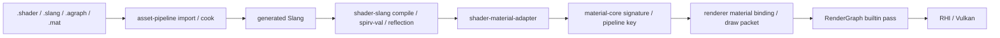

# Shader / Material Authoring V2 架构

更新日期：2026-09-06

状态：V2 设计合同。旧 V1 authoring 路线已弃用，不再作为实现或文档拆分依据。

本文只保留 shader/material authoring 的系统边界、所有权、数据流和路线判断。具体格式合同见
[`docs/specs/shader-v2.md`](../specs/shader-v2.md) 和
[`docs/specs/material-runtime-products-v2.md`](../specs/material-runtime-products-v2.md)。近期实施状态与
Done evidence 只维护在 GitHub Issues / Project；本文不跟踪具体 PR。

## V1 弃用

V1 文档中的“第一版 `.shader` 范围”、graph-first 主路径、`shader-v1.md`、`amat-v1.md` 和
`material-product-v1.md` 拆分建议全部弃用。后续不新增 V1 spec 文件，也不把 V1 schema 当成兼容目标。

V2 的当前主线是 code-first MVP：先跑通 `.shader + .slang/raw slang + .mat` 到 renderer/preview 的闭环，再验证
公共 Slang 函数自动发现、minimal `.agraph` IR 与 Hybrid 调用，最后做完整 Material Editor。

## 当前事实

- `packages/shader-slang` 已提供 Slang -> SPIR-V 构建、`spirv-val` validation、`.metadata.json`
  和 `.reflection.json` 产物；reflection 当前是可审查构建产物，不自动生成 C++。
- `packages/material-core` 已提供 CPU-only material resource signature、shader/signature compatibility
  和 deterministic pipeline key hash；它不拥有 `.mat` IO、asset import、GPU upload、Vulkan pipeline/cache
  或 editor UI。
- `packages/shader-material-adapter` 提供从 `shader-slang` reflection model 到
  `MaterialResourceSignature` / signature hash 的 CPU-only 适配层；它依赖 `shader-slang` 与
  `material-core`，但不引入 renderer、Vulkan、RenderGraph、asset-pipeline 或 editor 依赖。
- `packages/shader-authoring` 提供 CPU-only `.shader` document model、parser、source span、基础 diagnostics
  和 generated Slang skeleton / line mapping / entry manifest；它只依赖 `core`，不调用 Slang compiler，
  不生成 SPIR-V，不读取 reflection，也不依赖 asset-pipeline、renderer、RHI 或 editor。
- `packages/material-instance` 已通过 #154 接入 CPU-only `.mat` document IO、property override model
  和 material type reference validation；它不进入 renderer、RHI 或 editor。
- `asset-core` / `asset-pipeline` 已有 source discovery、metadata、product manifest/cache 的基线；#156 已让
  `asset-pipeline` 私有复用 `material-instance`，把 `.mat` cook 成 deterministic material instance product blob；
  #158 已让 `asset-pipeline` 私有复用 `shader-authoring`，把 `.shader` cook 成 deterministic generated
  Slang product blob；#163 继续把该 generated Slang payload 和 entry manifest facts cook 成 deterministic
  compile/reflection product facts。
- editor 已有 Asset Browser / RenderView / Preview view request 等基础，但还没有完整 Material Editor、
  `.agraph` lowering、`.mat` IO 或 `.shader` editor workflow。
- RenderGraph pass type 表达 execution model，不表达 material pass tag、LightMode、shader pass 名称或材质业务语义。

## 核心决定

### Authored numeric GPU binding（#432）

Current evidence: `.mat` packing 与反射已接入 GPU Mesh 的 authored material binding；数值参数驱动真实像素。
Owner / lifetime / thread: renderer Vulkan backend 拥有不可变 program（shader/layout/pipeline）与参数版本
（VMA host-upload buffer/descriptor pool/set）。一个 render-thread owner 发布单调 revision；失败不替换 active。
同一 program 被参数版本共享，record 时 frame completion callback 保留版本，禁止原地修改在途 descriptor/buffer。
Host 在 device/allocator teardown 前 drain 并释放全部 owner/lease。不新增队列或运行时服务。

Data / error / budget / diagnostics: 上游提供编译器验证的配对 SPIR-V/reflection 与已打包字节；renderer 不读取源文件。
首轮固定已有 mesh vertex/push-constant ABI、Solid、现有深度格式和一个 fragment constant buffer，显式采用
set 1/binding 0（set 0 空 layout），不更改生成器兼容默认值。每 Shader 最多 4 MiB、GPU 参数最多 16 KiB/256 fields，
resident version 有界；布局/大小/设备/格式/版本错误显式拒绝。draw packet 带 material revision；参数 buffer 通过
RenderGraph Fragment ShaderRead 声明。纯数值更新复用 program，不重新编译或建立 pipeline。

Foundation prerequisite: #419/#424/#426；Integration Gate: 真实 RenderView consumer 的资源与在途生命周期验证。
Earliest safe / latest required: 当前开始，在图/材质编辑器主线前完成。
Non-goals / exit evidence: 不做纹理、任意 vertex ABI、Wireframe authored material、通用热更新或图编辑器；
native smoke 从 `.shader` 生成并编译 fragment，用 `.mat` 两个参数值完成 GPU Mesh 像素 readback，验证失败保留、
stale 拒绝、共享 program 与 fence 后退役。默认材质原有模式保持原合同。

实施发现：旧生成器会对 entry 发出零参数 wrapper 调用，因此本切片使用无输入 fragment；带参数 entry 的
wrapper 修正另行收敛，不以特殊默认参数伪装已支持。当前 smoke 由 build-time parser/emitter 编译 fixture，
renderer 接收已验证的成对字节/反射，不代表 Studio GUID 解析、通用 cooked material loader 或自定义 vertex 已完成。
另修正 Slang 反射工具对非零 set 的读取：使用变量 DescriptorTableSlot binding space；内部 range descriptor-set
索引不是 Vulkan set。真实 generated shader set 3 回归与 set 1 GPU draw 同时验证该差异。

采用 [Unreal material uniform cache](https://dev.epicgames.com/documentation/unreal-engine/API/Runtime/Engine/FMaterialRenderProxy/CacheUniformExpressions_GameThre-)
的渲染状态所有权和 [O3DE SRG data](https://www.docs.o3de.org/docs/api/gems/atom/class_a_z_1_1_r_h_i_1_1_shader_resource_group_data)
的参数/资源分组；不照搬 proxy/service 或引入通用 cache 框架，当前只证明单 program 多参数版本的复用。
遵循 [Vulkan descriptor 生命周期](https://docs.vulkan.org/spec/latest/chapters/descriptorsets.html)：在途绑定不原地更新，
新版本用独立 buffer/set，复用既有 frame completion retention；Host 写入/flush 完成后才允许提交使用。

### 三种创作方式与公共函数自动注册（已确认目标，尚未实现）

2026-09-06 用户确认：同一个 Shader 资产体系支持纯手写、代码与图混合、纯图三种平等创作方式；
公共 Shader 函数可以自动注册给图使用。code-first 是交付顺序，不表示手写代码只是图的高级扩展入口。

- 纯代码：完整阶段入口可以手写，不要求存在 `.agraph`。
- 混合：图连接表达式并调用手写函数；同一资产可同时包含代码阶段与图阶段。
- 纯图：参数、Pass、渲染状态、阶段输入输出均可由编辑器维护，用户不必编写代码。
- 三者共用 properties、Pass、编译/反射、runtime product、`.mat`、预览与诊断。
- 统一资产不等于单物理文件；保留 `.shader` 入口和显式 `.slang` / `.agraph` 依赖。
- 不承诺任意 Slang 与节点图双向转换。每个函数或阶段实现只有一个权威来源；生成的 Slang 是派生产物，
  不与图同时作为同一函数体的可编辑真相。未来代码调用图函数也必须使用明确接口，另行验证模块组合。

建议发现范围是项目显式纳入的公共 Shader 库：符合节点接口规则的公开函数自动进入函数目录，无须额外 C++
节点类或重复填写端口。局部函数仅对当前 Shader 可见，库内部辅助函数不进入公共搜索。
自动注册发生于导入/工具阶段，运行时不扫描模块、不解释节点。

初始验证子集限定为无重载、非泛型的顶层函数，输入及单个返回值为 float/float2/float3/float4。
端口来自编译器验证的函数签名；名称、分类、说明是可选元数据。复杂结构、资源参数、out/inout、泛型和重载
先给出明确的不可节点化诊断，但不因此禁止合法函数在纯代码模式下使用。发现已声明但未被入口调用的公开函数
必须单独验证，不能以最终 SPIR-V 资源反射代替源码模块声明发现。阶段能力仍由真实调用编译验证。

函数身份必须区分模块与签名，显示名称不是身份；接口变化应使相关连接失效并定位到 pin，不能静默错接。
名称变更的稳定身份/迁移规则、重新导出与重名规则、元数据语法、源码定位 API、函数数量/源码大小/编译时间预算
在函数发现切片中验证并冻结。编译器版本与模块依赖参与产物身份；源码变化后失效，过期结果不得覆盖新版本。

聊天中的 `@category` / `@displayName`、`graph entry { source ... }` 等只是呈现草案，不是现有 parser 语法，
不据此增加第二套 shader language。Slang 模块可见性应采用经本地工具链验证的 public/internal 规则；
模块辅助函数应使用 internal，不能照搬草案中顶层 private 的写法。现有 `.mat` 命名保持不变。

#### 参考模式与本项目取舍

- 采用 [Unreal Custom Material Expressions](https://dev.epicgames.com/documentation/en-us/unreal-engine/custom-material-expressions-in-unreal-engine)
  的有类型输入输出与代码嵌入边界，并以
  [Godot VisualShaderNodeExpression](https://docs.godotengine.org/en/stable/classes/class_visualshadernodeexpression.html)
  交叉核对图内表达式模式。两者是混合计算的先例，不是公共 Slang 函数自动注册已实现的证据。
- 采用 [Slang 模块与访问控制](https://docs.shader-slang.org/en/stable/external/slang/docs/user-guide/04-modules-and-access-control.html)
  与 [编译 API](https://shader-slang.org/docs/compilation-api/) 的模块加载边界；函数声明、可见性、签名和源码位置的
  实际可发现范围要用仓库所用 Slang 版本证明，不能从最新文档推定现有 reflection JSON 已提供它们。
- 不要求用户为每个公共函数再手工声明一套节点接口，也不把 PBR、Unlit、后处理做成互不兼容的图语言。
  本项目采用同一表达式模型与明确的阶段/输出合同，以满足三种创作方式平等、package-first 和 headless 编译要求。

#### 所有权与验证边界

- `shader-authoring` 拥有 CPU 文档、图验证/降低与源码映射；不新增 Slang compiler、Vulkan 或 Avalonia 依赖。
- `shader-slang` 的工具边界负责真实编译器声明事实；传出自有数据，不传编译器对象或 session 指针。
- `asset-pipeline` 编排显式模块依赖、生成产物与缓存失效；不创建运行时全局节点注册服务。
- Studio 拥有节点/代码编辑、事务、撤销与保存。编译任务读取不可变文档快照，按 revision 发布结果；失败保存
  原始编辑内容，预览保留上一次成功产物并标明失效，文档关闭后不再发布结果。
- renderer/runtime 仅消费已验证的运行时产物，继续拥有 GPU 上传、绑定和在途帧资源退役。

最小出口证据是同一个纯数值函数：纯代码调用与图调用均经 Slang 编译、spirv-val 和相同输入输出验证；
修改公共函数后相关产物失效，错误签名/不可见函数/阶段不兼容均定位到调用点。之后再接编辑器与预览，
不能用手填 JSON 节点目录冒充自动发现，也不能用界面截图代替真实编译和渲染验证。

当前进度评估及交付顺序见[整体路线图](../planning/next-development-plan.md#shader-三种创作方式的接入评估2026-09-06)。

### Reflected numeric layout adapter

Current evidence: the Slang tool can query constant-buffer element fields, but the exported reflection
previously discarded them. Owner / lifetime / thread: `shader-slang` owns compiler facts and file IO;
`shader-material-adapter` synchronously validates numeric member facts against authoring and calls
`material-instance` packing. All results own CPU data; no GPU or live compiler objects cross APIs.
Data / error / budget / diagnostics: export optional flat numeric constant-buffer size and named member
scalar type/component count/offset/size, bounded to the packing API's 256 fields and 64 KiB. Unsupported
nested/array/matrix layouts remain absent, not guessed; old reflection files remain readable but cannot
be used by the new packing adapter. Cross-stage descriptor merging must reject different layouts.
Foundation prerequisite: #424 CPU packing; no renderer/RHI dependencies. Integration Gate: reflected
member compatibility before GPU binding, earliest now/latest before authored parameter GPU use.
Non-goals: GPU binding, SPIR-V product ownership/hot reload, textures, recursive aggregate packing or
source property renaming. Exit evidence: real generated Slang compile/reflect/read/pack round-trip,
byte oracle and missing/drifted/type-mismatched reflection rejection. Resource signature hashes remain
descriptor-only; callers retain the returned layout facts alongside the compiled shader identity.

Adopt explicit member metadata from [Unreal shader parameters](https://dev.epicgames.com/documentation/unreal-engine/API/Runtime/RenderCore/FShaderParametersMetadata)
and byte offset/count mapping from [O3DE constant descriptors](https://www.docs.o3de.org/docs/api/gems/atom/class_a_z_1_1_r_h_i_1_1_shader_input_constant_descriptor.html).
Use [Slang variable layouts](https://docs.shader-slang.org/en/stable/external/slang/docs/user-guide/09-reflection.html)
for container-relative Uniform offsets and element sizes. Reject inferred host-struct packing and a
general shader cursor framework: the current consumer only requires one flat numeric block.

### Numeric parameter packing boundary

Original packing-slice evidence: `MatResolveResult` contains override diffs/diagnostics, not parameter bytes.
At that point reflection did not expose member offsets; the reflected adapter above now supplies them,
while `MaterialResourceSignature` remains descriptor-only. `material-instance::packMatParameters` resolves numeric defaults
and overrides against a caller-supplied property/type/byte-offset layout and block size. This is a CPU
packing boundary, not evidence of shader-layout compatibility or a GPU binding packet.

Owner / lifetime / thread: `material-instance` synchronously borrows const documents and layout; it owns
only the returned bytes/diagnostics. Calls have no shared mutable state, IO or GPU lifetime. The caller
must not mutate borrowed inputs during a call. No new package or dependency is introduced.

Data / error / budget / diagnostics: at most 256 properties and 64 KiB output. Every declared property
must have exactly one matching member; offsets are 4-byte aligned, non-overlapping and in bounds.
Only float/float2/float3/float4/color, int, uint and bool are supported. An override wins over its default;
an unoverridden property requires a valid explicit default, with no implicit zero/default resource.
Only the selected value is evaluated. Numeric text is parsed locale-independently. Float values must
be finite and fit float32; nonzero values that convert to zero are rejected, while representable
subnormals and ordinary float32 rounding are allowed. Integers must fit signed/unsigned 32-bit;
bool occupies one 32-bit word with value 0 or 1. Words are little-endian, vector components contiguous,
and all padding zero. No color-space conversion occurs. Input/layout/value/type/budget errors return
`ErrorDomain::Material` with `MatParameterError` and property context, without a partial block.
Existing stale-hash warnings are preserved; successful CPU packing does not authorize stale GPU use.

Foundation prerequisite: existing document validation, resolver and standard numeric conversion.
Integration Gate: material CPU data before renderer consumption; earliest safe now, latest required
before binding authored numeric values. Non-goals: resources/textures, automatic reflection extraction,
layout inference, cook format, pipeline or GPU ownership. Exit evidence: byte-oracle defaults/overrides,
padding/order determinism, malformed layout/default/input and conversion boundary tests.

Adopt parameter overrides from [Unreal material instances](https://dev.epicgames.com/documentation/unreal-engine/instanced-materials-in-unreal-engine)
and typed property-to-shader mapping from [O3DE material types](https://www.docs.o3de.org/docs/atom-guide/look-dev/materials/material-type-file-spec/).
[Slang reflection](https://docs.shader-slang.org/en/stable/external/slang/docs/user-guide/09-reflection.html)
owns target-specific member offsets and sizes. Accordingly this API consumes explicit offsets rather
than inventing a C++ struct or std140 packing rule. The reflected adapter above verifies numeric member
facts; before GPU consumption the host must still retain layout/product identity. A descriptor signature hash
alone cannot detect member-layout drift. The explicit CPU layout input is Asharia's bounded adapter
boundary, not a replacement shader ABI or a copy of another engine's object/service system.

### Material override validation boundary

Current evidence: IO already validates `.mat` identity, duplicate property IDs, value kinds and vector
widths, but callers can construct mutable documents directly; the resolver previously trusted those values.
Owner / lifetime / thread: `material-instance` validates borrowed CPU documents synchronously, without
mutating either input or creating renderer resources. Data / error / budget / diagnostics: reuse
`validateMatDocument` at the resolver boundary; reject non-finite scalar/vector values in the shared
validator. An invalid document yields one deterministic `InvalidOverride` error and no resolved diffs,
so an invalid override cannot be interpreted as a usable/defaulted value. Property context is preserved
in the validation message. Existing shader mismatch and stale-hash diagnostic policy remains intact.

Foundation prerequisite: existing document validator suffices; no new schema, service or package.
Integration Gate: CPU authoring validation before runtime material parameter consumption. Earliest safe:
now; latest required: before converting overrides into renderer inputs. Non-goals: no resolved-value
packing, float32 conversion policy, GPU binding, Material Editor or product format change. Exit evidence:
programmatic success and failure tests across validation, serialization and resolution.

Adopt typed material parameters from [Unreal material instances](https://dev.epicgames.com/documentation/unreal-engine/instanced-materials-in-unreal-engine)
and [O3DE material files](https://www.docs.o3de.org/docs/atom-guide/look-dev/materials/material-file-spec/):
override values must conform to their declared material property types. Do not copy an engine object
system or introduce implicit numeric conversions; Asharia's current CPU document boundary needs only
shared validation and explicit diagnostics.

Asharia 不先做完整自定义 shader 语言，也不先复制 Unreal Material Graph 或 Unity Shader Graph。V2 的判断是：

> Slang 是唯一 GPU 代码层；`.shader` 是材质类型 authoring contract；`.mat` 是材质实例；
> asset pipeline 生成 runtime product；renderer 只消费 product。

第一阶段目标只解决一条链路：

```text
.shader + .slang/raw slang + .mat
    -> import/cook
    -> generated Slang
    -> SPIR-V + reflection
    -> MaterialResourceSignature
    -> pipeline key
    -> material binding packet
    -> renderer / preview 成功绘制
```

第一阶段不做完整 Material Graph、完整 Material Editor、runtime graph interpreter、自研 shader compiler、
Slang AST 级重写、handwritten Slang -> graph 反编译、复杂 variant matrix、bindless 材质系统或完整 LSP。

## 文件与产物分层

| 层 | 文件 / 产物 | 职责 | 不负责 |
| --- | --- | --- | --- |
| GPU 源码层 | `.slang` | 手写 shader 函数、entry point、高级 GPU 代码 | 材质实例值、editor layout |
| 材质类型层 | `.shader` | properties、pass、render state、graph/code 链接、tool contract | runtime handle、GPU descriptor |
| Graph 创作层 | `.agraph` | nodes、edges、pin values、layout、exposed property | runtime execution |
| 材质实例层 | `.mat` | 材质类型引用、参数值、texture/asset handle、override | shader 代码、GPU object |
| Runtime product 层 | generated products | generated Slang、SPIR-V、reflection、signature、pipeline key、diagnostics | 用户编辑入口 |

推荐路径示例：

```text
Assets/Shaders/Unlit/Unlit.shader
Assets/Shaders/Unlit/Unlit.slang
Assets/Shaders/Unlit/Unlit.agraph
Assets/Materials/Red.mat
.asharia/cache/shaders/Unlit.generated.slang
.asharia/cache/shaders/Unlit.spv
.asharia/cache/shaders/Unlit.reflection.json
.asharia/cache/shaders/Unlit.signature.json
.asharia/cache/shaders/Unlit.product.json
```

## 包和模块边界

建议模块划分：

```text
packages/
  shader-slang/
    Slang compile
    SPIR-V validation
    Slang reflection JSON

  material-core/
    MaterialResourceSignature
    signature compatibility
    deterministic pipeline key
    CPU-only material model

  shader-material-adapter/
    SlangReflectionToMaterialSignature
    reflection diagnostics
    binding layout policy adapter
    signature hash normalization

  shader-authoring/
    .shader document model
    .shader parser
    .shader diagnostics
    generated Slang skeleton / entry manifest

  material-instance/
    .mat schema
    .mat read/write
    property override model
    material type reference resolution

  asset-pipeline/
    .shader importer
    .mat importer
    dependency tracking
    generated product manifest
    cache invalidation
    stale diagnostics

  renderer/
    material binding packet
    draw packet material binding
    pipeline key consumption

  editor/
    inspector integration
    code-first preview
    later: Material Editor / graph editor
```

依赖方向：

```text
shader-slang
    + material-core
        -> shader-material-adapter
            -> asset-pipeline

shader-authoring -> asset-pipeline
material-instance -> asset-pipeline
asset-pipeline -> renderer product data
renderer -> material-core
renderer -> rhi
editor -> asset-pipeline / preview / renderer
```

关键约束：

1. `material-core` 不依赖 Slang。
2. `shader-slang` 不知道材质实例。
3. `renderer` 不读取 `.agraph`。
4. `rhi-vulkan` 不依赖 editor、authoring 格式或 RenderGraph authoring 语义。
5. RenderGraph 只表达 execution model，不表达 material pass tag。

## 数据流


```mermaid
flowchart LR
    Source[".shader / .slang / .agraph / .mat"]
    Import["asset-pipeline import / cook"]
    Generated["generated Slang"]
    Slang["shader-slang compile / spirv-val / reflection"]
    Adapter["shader-material-adapter"]
    Material["material-core signature / pipeline key"]
    Renderer["renderer material binding / draw packet"]
    RG["RenderGraph builtin pass"]
    RHI["RHI / Vulkan"]

    Source --> Import
    Import --> Generated
    Generated --> Slang
    Slang --> Adapter
    Adapter --> Material
    Material --> Renderer
    Renderer --> RG
    RG --> RHI
```

Runtime 只读 product，不读 authoring graph。Editor 可以读 `.shader`、`.agraph`、`.mat`、product diagnostics
和 preview product。Renderer 只读 SPIR-V、`MaterialResourceSignature`、pipeline key inputs、material binding packet
和 draw packet。

## Authoring 阶段

### 1. Code-first MVP

第一阶段的主路径是 code-first。用户提供 `.shader`、外部 `.slang` 或 raw `slang {}` block，以及 `.mat`
实例。工具生成 material prelude、binding、parameter block 和 pass wrapper，再交给 `shader-slang` 编译。

这个阶段证明材质类型、材质实例、shader 编译、reflection adapter、pipeline key、binding packet 和 preview/render
可以走同一条链路。

### 2. Public Slang Function Discovery

第二阶段先验证公共模块的公开函数自动发现与有类型的函数目录，生成一个调用该函数的 Slang 样例完成真实编译。
这一阶段不需要节点 UI，也不需要先实现整个 graph。发现范围和初始签名子集采用上文的已确认目标与验证门禁。

### 3. Minimal `.agraph` IR 与 Hybrid 调用

第三阶段做 minimal `.agraph` IR、类型检查与 lowering，复用公共函数目录生成 typed pins 和函数调用。
graph 是 authoring 数据，导入或 cook 时 lower 到 Slang，runtime 永远不解释 graph。
用相同输入验证纯代码、图和混合调用结果，之后再扩大表达能力；纯图完整编辑体验不进入 code-first MVP。

### 4. Full Material Editor

完整 Material Editor 只在 code-first、minimal graph IR、Hybrid node discovery 都稳定后进入主线。它负责 graph
canvas、node library、Inspector integration、live preview、transaction 和 undo/redo，不拥有 runtime product。

## Preview 与 diagnostics

Preview service 服务三种入口：

- node preview：临时生成只计算某个 node output 的 Slang。
- code/function preview：用同一 material context 编译某个函数或 pass。
- final material preview：使用 `.shader` + `.mat` 的完整 product。

预览失败时保留上一次成功画面，diagnostics 附着到 node、pin、property 或 code line。Preview 复用 RenderView kind
`Preview`，不复制独立 renderer 路径。

统一 diagnostics model 和 runtime product schema 见
[`material-runtime-products-v2.md`](../specs/material-runtime-products-v2.md)。

## 风险控制

- Reflection adapter 会成为 shader 编译系统和 material-core 的 ABI。它必须独立成包，并用 golden tests 固定
  reflection -> signature 输出。
- Binding layout 会同时影响 `.shader`、generated Slang、reflection、renderer、descriptor allocation 和 pipeline key。
  V2 必须冻结 binding layout version，用户 shader 不手写 `[[vk::binding]]`。
- `.shader` DSL 不能膨胀成 shader language。外层 DSL 只声明 contract，GPU 逻辑仍写 Slang 或 graph。
- Graph 不能过早拖慢闭环。先 code-first，再 minimal `.agraph` IR，最后完整 Material Editor。
- Preview 不能分叉成第二条 renderer。Preview 复用 renderer material binding、RenderView 和 diagnostics model。

## 验证入口

- `material-core` package tests 覆盖 signature validation、compatibility、hash stability 和 pipeline key。
- `shader-slang` tests 覆盖 reflection JSON 的 descriptor、push constant、entry/stage、vertex input。
- `shader-material-adapter` tests 覆盖 Slang reflection model -> `MaterialResourceSignature` 正反例、
  visibility 映射、descriptor kind 映射、hash stability 和 deterministic diagnostics；集成 smoke 覆盖
  generated `.shader` Slang source -> SPIR-V -> reflection JSON -> material signature 的最小正例、
  manifest 驱动的 compile/reflection entry 选择和 mismatch negative path。`asset-pipeline` smoke 覆盖
  `shader-authoring-product.v2` dependency bytes 驱动的 compile/reflection product determinism，以及非法
  manifest-selected entry stage 的 deterministic diagnostic；compile/reflection product reader 读回
  product key hash、target profile、entry compile facts、SPIR-V/reflection facts 和 diagnostic facts，并覆盖
  missing reflection JSON hex payload field 的 deterministic blob diagnostic。
- `shader-authoring` tests 覆盖 `.shader` parse 正例、raw Slang span、重复 property、未知类型、
  非法默认值、缺少 pass entry、缺少 Slang 引用、raw block brace 平衡、generated Slang skeleton、
  deterministic binding declarations、entry manifest 和 line mapping。
- `material-instance` tests 覆盖 `.mat` strict JSON read/write、schema/material type reference、
  property override type validation、deterministic override diff 和 stale signature diagnostics。
- asset-pipeline tests 覆盖 `.shader` lowering、generated product、dependency invalidation 和 stale diagnostics。
- editor smoke 覆盖打开 `.shader` / `.mat`、修改 property、preview 成功/失败和 diagnostics 定位。
- 文档和格式变更至少运行 `tools/check-text-encoding.ps1` 与 `git diff --check`。

## 相关文档

- [specs/shader-v2.md](../specs/shader-v2.md)
- [specs/material-runtime-products-v2.md](../specs/material-runtime-products-v2.md)
- [workflow/technical-stack.md](../workflow/technical-stack.md)
- [architecture/overview.md](../architecture/overview.md)
- [architecture/package-first.md](../architecture/package-first.md)
- [architecture/foundation-framework.md](../architecture/foundation-framework.md)
- [systems/asset-architecture.md](asset-architecture.md)
- [standards/naming.md](../standards/naming.md)
- [planning/next-development-plan.md](../planning/next-development-plan.md)
- [planning/system-architecture-roadmap.md](../planning/system-architecture-roadmap.md)
