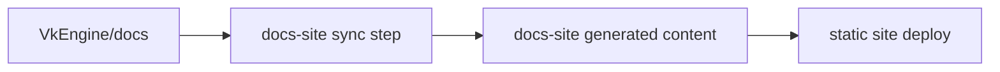

# 文档站部署工作流

状态：Partial。Engine 侧 `.github/workflows/docs-site-sync.yml` 已存在，并以完整 `docs/` 为同步源；
外部 docs-site 仓库、凭据和实际部署状态未在本仓库验证时仍按 proposal 处理。

## 目标

文档源码保留在 `VkEngine/docs`，随代码变更一起 review；独立 docs-site 仓库只负责站点部署、主题、导航、权限和发布流水线。

这个模型适合以下需求：

- 文档站需要独立部署到 GitHub Pages、Cloudflare Pages、Vercel 或内部静态站点。
- 文档站可能公开，但引擎仓库或部分工程文档不公开。
- 站点主题、导航、搜索和发布节奏不应污染引擎仓库。
- 代码变更仍然需要和对应文档一起审查，避免文档站成为第二套事实来源。

## 仓库职责

| 仓库 | 职责 | 不负责 |
| --- | --- | --- |
| `VkEngine` | 保存 `docs/` 正文、架构事实、API 合同、规范、工作流和验证入口 | 站点主题、托管配置、公开筛选发布 |
| docs-site | 保存站点框架、主题、导航、同步脚本、CI、部署配置 | 手写或长期修改 `VkEngine/docs` 的正文副本 |

`VkEngine/docs` 是唯一内容源。docs-site 可以生成缓存、构建产物和公开子集，但不能成为工程事实来源。

## 推荐目录

docs-site 仓库可以使用以下结构：

```text
docs-site/
  package.json 或 pyproject.toml
  site.config.*
  src/
    home/
    theme/
  synced/
    engine-docs/        # CI 或 sync 脚本生成，不手写
  scripts/
    sync-engine-docs.*
  .github/
    workflows/
      deploy.yml
```

`synced/engine-docs/` 应由脚本生成，并在 docs-site 仓库中明确标注来源。是否提交该目录由部署平台决定：如果部署平台能在 CI 中同步，可以不提交；如果静态托管需要完整源码，可以提交同步结果，但正文仍以 `VkEngine/docs` 为准。

## 同步方向

同步只允许单向：



禁止从 docs-site 反向修改 `VkEngine/docs`。如果发布站点发现正文错误，应在 `VkEngine` 开 PR 修正文档，再让 docs-site 重新同步。

## CI 流程

Engine 仓库通过 `.github/workflows/docs-site-sync.yml` 在 `docs/**` 变更后验证文档，并在非 PR
事件中按配置通知 docs-site：

- `pull_request`：只验证文档编码和 whitespace。
- `push` 到 `main`：验证后触发 docs-site 同步。
- `workflow_dispatch`：允许手动指定 `engine_ref` 重新发布文档。

Engine workflow 不保存部署凭据。它通过以下 repository secret / variable 连接外部系统：

| 名称 | 类型 | 说明 |
| --- | --- | --- |
| `DOCS_SITE_DISPATCH_TOKEN` | secret | GitHub token，用于向 docs-site 仓库发送 `repository_dispatch`。需要能访问 `66six11/VkEngine-docs-site`。 |
| `DOCS_SITE_REPOSITORY` | variable | 可选，默认 `66six11/VkEngine-docs-site`。 |
| `VERCEL_DEPLOY_HOOK_URL` | secret | 可选，Vercel deploy hook URL。配置后 Engine 可直接触发 Vercel 部署。 |

docs-site 的部署 CI 应执行：

1. checkout docs-site 仓库。
2. checkout 或下载 `VkEngine` 指定分支的 `docs/`；如果由 `repository_dispatch` 触发，使用 payload 中的 `engine_ref`。
3. 运行同步脚本，把内容复制到站点内容目录。
4. 应用公开筛选规则。
5. 构建静态站点。
6. 发布到目标平台。

示例流程：

```yaml
name: deploy-docs

on:
  workflow_dispatch:
  push:
    branches: [main]

jobs:
  deploy:
    runs-on: ubuntu-latest
    steps:
      - name: Checkout docs site
        uses: actions/checkout@v4

      - name: Checkout engine docs
        uses: actions/checkout@v4
        with:
          repository: 66six11/Engine
          path: engine
          ref: main

      - name: Sync engine docs
        run: ./scripts/sync-engine-docs.sh engine/docs synced/engine-docs

      - name: Build site
        run: npm ci && npm run build

      - name: Deploy
        run: npm run deploy
```

这是形状示例，不是当前可执行配置。实际仓库创建后，应把仓库名、权限、部署平台、token 和构建命令替换为真实值。

## 公开筛选

如果文档站是公开的，而 `VkEngine/docs` 同时包含内部计划、审查记录或未发布功能，docs-site 必须有明确筛选规则。

筛选规则可以按目录、front matter 或 allowlist 执行。推荐先用 allowlist：

```text
include:
  docs/README.md
  docs/workflow/build.md
  docs/workflow/review.md
  docs/standards/
  docs/architecture/overview.md
  docs/architecture/package-first.md
  docs/rendergraph/rhi-boundary.md
```

禁止在 docs-site 中复制一份“公开改写版”长期维护。需要改写公开内容时，应在 `VkEngine/docs` 中新增明确的 public 文档入口，或把内部内容拆出去。

## 本地预览

docs-site 应提供本地预览命令：

```powershell
.\scripts\sync-engine-docs.ps1 -EngineDocs ..\VkEngine\docs -OutDir .\synced\engine-docs
npm install
npm run dev
```

如果使用非 Node 文档框架，应保持同样的三个动作：同步、安装依赖、启动预览。

## 变更规则

- 改正文、架构事实、API 合同、规范和工作流，提交到 `VkEngine`。
- 改站点主题、导航、搜索、部署平台或筛选规则，提交到 docs-site。
- 如果 docs-site 的导航暴露了新的稳定文档入口，同时检查 `docs/README.md` 是否也需要更新。
- 如果 `VkEngine/docs` 删除或重命名文档，docs-site CI 必须失败或报告断链，不允许静默发布旧内容。

## 验证

`VkEngine` 文档变更至少运行：

```powershell
powershell -ExecutionPolicy Bypass -File tools\check-text-encoding.ps1
git diff --check
```

docs-site 仓库至少应验证：

```powershell
npm run build
```

实际命令以 docs-site 选定框架为准。CI 必须让断链、同步失败和构建失败阻止发布。
