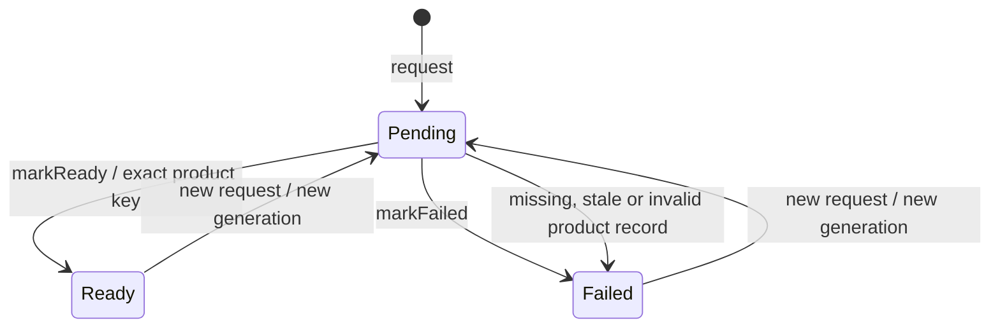
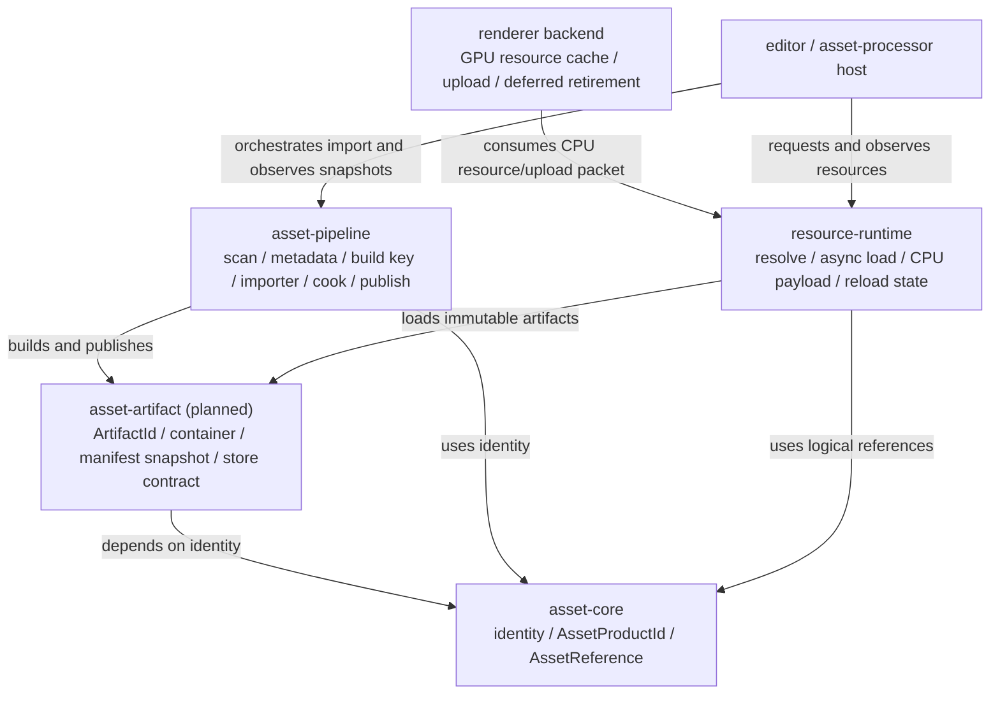
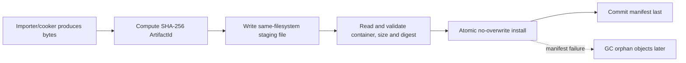
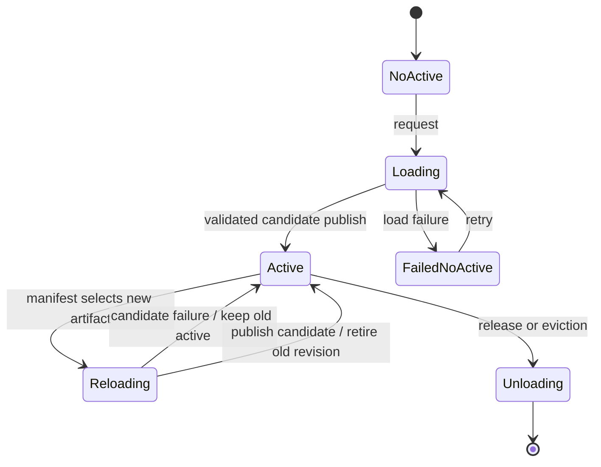

# Resource Runtime 技术设计

状态：Proposal。建议在接入真实 Mesh、Material、Shader runtime loader 之前完成核心重构。

本文是 `packages/resource-runtime` 的 package-local 技术设计。它先记录当前实现，再定义允许重构后的目标边界、身份模型、生命周期、热更新规则和迁移顺序。本文中的 **Current** 表示当前代码事实，**Target** 表示推荐目标，**Deferred** 表示明确暂缓。

相关仓库文档：

- [全局资产架构](../../docs/systems/asset-architecture.md)
- [当前架构总览](../../docs/architecture/overview.md)
- [当前数据流](../../docs/architecture/flow.md)
- [Package-first 规则](../../docs/architecture/package-first.md)
- [编码与生命周期规则](../../docs/standards/coding.md)

## 1. 设计结论

当前 `resource-runtime` 的 CPU-only、backend-neutral 方向正确，但当前 API 只能表达“manifest 中是否存在期望 product record”，还不能表达真正的 runtime resource 加载、CPU payload 所有权、依赖加载、热更新和安全替换。

在继续扩展前应进行一次有边界的重构：

1. 保留稳定逻辑资产身份，但将 source asset、logical product、build input、artifact content 和 runtime instance 五种身份分开。
2. 将 runtime-safe 的 artifact、manifest 和 product-container 合同从 tool-side `asset-pipeline` 中抽离。
3. `resource-runtime` 不再依赖完整 importer/source/settings build key 来选择运行时资源，只消费当前 target profile 下已经解析好的 product/artifact snapshot。
4. 将稳定的 runtime handle generation 与异步加载 request generation 分开。
5. 将 active resource 与 pending candidate 分开，reload 失败时继续保留旧 active resource。
6. `resource-runtime` 只拥有 backend-neutral CPU resource 状态和 payload；Vulkan image、buffer、sampler、descriptor、pipeline 及其延迟销毁继续由 renderer/RHI backend 拥有。
7. 第一版采用 project-local、single-writer、content-addressed artifact store；共享缓存、多进程调度和全资产热更新延后。

不建议在当前三态 registry 上继续堆叠 loader、文件 IO、Vulkan handle 或全局 service-locator API。这样虽然短期改动小，但会固化错误边界。

## 2. Current：当前 package 的真实职责

当前 package 由以下文件组成：

```text
packages/resource-runtime/
├── asharia.package.json
├── CMakeLists.txt
├── include/asharia/resource_runtime/runtime_resource_registry.hpp
├── src/runtime_resource_registry.cpp
└── tests/resource_runtime_smoke_tests.cpp
```

当前 `asharia::resource_runtime`：

- 只依赖 `asharia::asset_core`。
- 不读取 source asset、`.ameta`、product blob 或 manifest 文件。
- 不执行 importer，不发布 product。
- 不持有 CPU product payload。
- 不依赖 RenderGraph、renderer、Vulkan、VMA、editor 或 Studio。
- 使用 `RuntimeResourceTicket::generation` 拒绝旧请求的迟到完成。
- 使用完整 `AssetProductKey` 判定 manifest record 是否为当前期望 product。

### 2.1 当前状态机



规则：

- 每次 `request()` 都分配新的 request generation，并替换同一 `RuntimeResourceKey` 的旧 record。
- `markReady()` 只接受与 `expectedProductKey` 完全相同的有效 `AssetProductRecord`。
- `markFailed()` 只接受非空失败消息。
- ticket generation 不匹配或 record 已不是 `Pending` 时，完成操作失败。
- `resolveProductRecords()` 找到完全匹配且有效的 record 时进入 `Ready`；找到无效 exact record、同 GUID stale record 或完全缺失时进入 `Failed`。

### 2.2 当前语义限制

当前 `Ready` 只表示 product record 已解析，不表示：

- product bytes 已读取；
- product container 已校验；
- runtime dependency 已满足；
- CPU resource 已创建；
- GPU resource 已上传；
- resource 已可以被 renderer 使用。

当前还有以下结构性限制：

- `RuntimeResourceKey` 只有 `AssetGuid + AssetTypeId`，不能稳定表达一个 source asset 产生的多个 logical products。
- Runtime 请求携带完整 `AssetProductKey`，使 runtime 知道 importer、source hash、settings hash 和 build profile 等 tool-side 细节。
- 单个 generation 同时承担“请求新鲜度”的概念；未来 loaded handle 的 slot lifetime 不能继续复用这个 generation。
- `Pending/Ready/Failed` 无法表达“旧资源仍 active，新候选正在 reload”。
- Registry 不拥有 payload，却使用了容易被理解为完整 Resource Manager 的名称和 `Ready` 状态。
- 内部使用 `std::vector`；`find()` 返回的指针和 `records()` 返回的 span 只应在下一次 registry mutation 之前借用。
- 当前 API 没有线程安全合同；调用方不能并发 mutation 或在 mutation 同时保留借用 view。
- product blob readers 当前位于 `asset-pipeline`。如果 runtime 直接复用它们，会形成 runtime → tool/importer 的错误依赖。

因此当前实现适合作为产品解析 baseline，不适合作为最终 runtime resource architecture。

## 3. 研究依据与本项目取舍

外部引擎和构建系统提供了以下可复用原则：

| 资料事实 | 本项目取舍 |
|---|---|
| Unity 将 source asset 与 imported artifact 分开，artifact ID 与 asset GUID 不是同一身份；import dependency、importer version 和 target platform 会影响 artifact。 | `AssetGuid`、logical product、build key 和 content artifact 必须分开。 |
| Unreal Derived Data Cache 将 derived data 视为可再生缓存，不作为 source truth 提交；缓存可以按层次扩展。 | 第一版使用 project-local generated cache；共享 cache 是后续 backend，不改变 artifact identity。 |
| O3DE 明确区分 source、job、product dependency 和 Asset Cache，并由 Asset Processor 通知 runtime 更新。 | 构建依赖与运行时 product dependency 分开；tool-side pipeline 不进入 runtime package。 |
| Godot runtime 通过 Resource Loader 使用 imported resource，而不是直接读取隐藏的 imported 文件。 | runtime 通过 artifact store/loader contract 消费 cooked artifact，不依赖 cache path。 |
| Bazel Remote APIs 将语义输入映射与 Content Addressable Storage digest 分开。 | BuildKey 用于缓存查询，ArtifactId 用于字节身份和不可变存储。 |
| Vulkan 要求应用保证对象在设备访问期间仍有效。 | CPU resource 替换不能直接销毁仍被 GPU 使用的 backend object；GPU retirement 属于 renderer/RHI。 |

这些资料用于校准边界，不要求复制对应引擎的完整 Asset Database、DDC server 或后台 Asset Processor。

## 4. Target：身份模型

资源系统必须区分以下身份：

| 身份 | 含义 | 稳定范围 | 持久化位置 |
|---|---|---|---|
| `AssetGuid` | 用户项目中的 source asset 身份 | 文件移动和重命名后保持 | `.ameta`、scene、material 等 authoring 文档 |
| `AssetProductId` | source asset 产生的某个 logical product | importer 输出顺序变化后仍应保持 | authoring reference、product manifest |
| `AssetBuildKey` | 影响某个 product 构建结果的全部输入 | 任一构建输入变化即变化 | tool-side build record/cache index |
| `ArtifactId` | 一份 cooked artifact 字节的内容身份 | 相同字节相同，不同字节不同 | artifact store、product manifest |
| `ResourceHandle<T>` | 当前进程中的 loaded resource slot | slot 未释放时稳定 | 仅内存，不序列化 |
| request generation | 某次异步加载/重载请求的时序身份 | 每次请求递增 | 仅内存，不序列化 |

### 4.1 Logical product

一个 source asset 可以产生多个 logical products。Mesh/scene source 可能产生 mesh、skeleton、animations 和 embedded materials；Shader source 可能产生多个 entry/profile product。

推荐目标结构：

```cpp
struct AssetProductId {
    AssetGuid sourceAsset;
    AssetTypeId productType;
    std::uint64_t localId; // 0 为 primary product；其他值由 importer 确定性生成
};

struct AssetReference {
    AssetProductId product;
    AssetTypeId expectedType;
};
```

规则：

- `localId` 不能来自 vector index、文件枚举顺序或不稳定名称 hash。
- Importer 必须为 sub-product 提供确定性 local identity；改变 identity 规则需要 migration。
- 持久化引用保存 logical product，不保存 cache path、artifact path、runtime handle 或 pointer。
- 当前只有 primary product 的类型可以使用 `localId == 0`，但数据模型不能永久假设一 source 一 product。

### 4.2 Build key

`AssetBuildKey` 只属于 asset build/cook 侧，至少包含：

- `AssetProductId`；
- importer ID、importer version 和 importer implementation fingerprint；
- source content digest；
- canonical import settings digest；
- ordered build dependency digests；
- target platform/profile；
- relevant engine/product format version；
- external tool fingerprints，例如 `slangc`、texture compressor 或 mesh optimizer。

Build key 使用 canonical encoding 后计算 256-bit digest。绝对路径、mtime、无序容器遍历结果和本机临时目录不能进入 canonical build identity。

Build key 回答“这组输入是否已经构建过”，不回答“产物字节是什么”。相同 BuildKey 生成不同 ArtifactId 必须报告 importer non-determinism，不能覆盖旧对象。

### 4.3 Artifact ID

`ArtifactId` 是带算法版本的 256-bit 内容 digest。V1 采用 SHA-256：

```cpp
enum class ArtifactDigestAlgorithm : std::uint8_t {
    Sha256 = 1,
};

struct ArtifactId {
    ArtifactDigestAlgorithm algorithm{ArtifactDigestAlgorithm::Sha256};
    std::array<std::byte, 32> digest{};
};
```

当前 64-bit FNV hash 可以继续用于进程内 hash table、快速 fingerprint 或兼容诊断，但不能作为最终 artifact identity 或不可变对象路径的唯一依据。

## 5. Target：System Package 与内部 target 边界

当前 `asset-core`、`asset-pipeline` 和 `resource-runtime` 是独立 source packages/targets。目标发行形态中，它们与计划中的
`asset-artifact` 共同归属于一个 `packages/systems/content` 完整 System Package，并继续保持独立 targets/modules。
下面的名字描述代码和依赖边界，不新增用户必须分别安装的 Package Manager 条目。

建议目标依赖如下：



### 5.1 `asset-core`

长期稳定职责：

- `AssetGuid`、`AssetTypeId`；
- `AssetProductId`、`AssetReference`；
- 不依赖 importer、artifact store、resource loader、renderer 或 editor。

当前 `SourceAssetRecord`、import settings 和完整 `AssetProductKey` 可以先留在现有 package 以降低迁移成本，但应通过窄头文件和内部 target 隔离。若 runtime-safe target 仍被 authoring API 拖累，再物理拆出 `asset-authoring`；不为了目录整齐立即制造新 package。

### 5.2 `asset-artifact` internal target/module（planned）

推荐在完整 Content System Package 内新增 runtime-safe contract target/module，负责：

- `ArtifactId` 和 digest formatting/parsing；
- 版本化 product container header/section table；
- runtime product manifest snapshot；
- product type、format version、byte size 和 runtime dependency contract；
- 只按 `ArtifactId` 读取 bytes 的 artifact-store interface；
- 有界解析、offset/size/hash 验证。

它不能依赖 source scanner、importer、Slang、stb、editor 或 Vulkan。

当前位于 `asset-pipeline` 的 runtime product readers 应迁移到这里或迁移到各自 runtime-safe product target。Writer、importer diagnostics 和 authoring parser 仍留在 tool-side targets。

### 5.3 `asset-pipeline`

目标职责：

- source scan/discovery/snapshot；
- metadata 与 import settings；
- dependency discovery；
- build key；
- importer/cooker registry；
- artifact writer；
- immutable publication；
- manifest commit；
- build diagnostics。

它可以依赖具体 source decoder 和外部工具，但 runtime 不能反向依赖它。

### 5.4 `resource-runtime`

目标职责：

- logical product 到当前 artifact 的解析；
- stable runtime handles；
- async request generation 和迟到完成拒绝；
- runtime dependency 请求；
- typed CPU resource payload ownership；
- active/candidate reload 状态；
- fallback/失败状态的可观察合同；
- CPU resource 的 pin、release 和后续 eviction policy。

禁止职责：

- source 文件解析或 importer 执行；
- `.ameta` mutation；
- build key 计算；
- product 发布和 manifest 写入；
- Vulkan command recording；
- `VkImage`、`VkBuffer`、VMA allocation、descriptor 或 pipeline ownership；
- editor panel、file watcher 或 UI state。

### 5.5 Renderer/RHI backend

GPU owner 消费已验证的 CPU resource 或不可变 upload packet，创建 backend object，并负责：

- GPU upload；
- RenderGraph-visible copy/transition；
- device loss/backend recreation；
- frame/epoch/fence 关联；
- hot-reload 后旧 GPU object 的 deferred retirement。

不得把 Vulkan target 重新塞进 `resource-runtime`。如果未来需要通用 renderer resource bridge，应建立独立 backend-specific target，而不是污染 backend-neutral package。

## 6. Artifact 与 Manifest 合同

### 6.1 Product manifest

Runtime 不应携带完整 source/importer build facts 来选择资源。推荐 manifest record：

```cpp
struct RuntimeProductDependency {
    AssetProductId product;
    ArtifactId resolvedArtifact;
    bool optional{};
};

struct AssetProductRecord {
    AssetProductId product;
    TargetProfileId targetProfile;
    BuildKeyDigest buildKey;
    ArtifactId artifact;
    std::uint64_t byteSize{};
    std::uint32_t formatVersion{};
    std::vector<RuntimeProductDependency> runtimeDependencies;
};
```

含义：

- Tool 使用 `buildKey` 做 cache hit/miss 和确定性检查。
- Runtime 使用 `product + targetProfile` 选择当前 artifact。
- `resolvedArtifact` 冻结本次 manifest revision 对依赖的解析结果，便于 cook/package 完整性检查。
- Artifact 路径由 `ArtifactId` 派生，不作为 manifest identity。

### 6.2 Artifact store

V1 路径：

```text
<cache-root>/objects/sha256/<first-two-hex>/<full-digest>.aproduct
```

V1 规则：

- project-local；
- generated、gitignored、可删除再生；
- single writer；
- object immutable；
- lookup 只按 `ArtifactId`；
- final install 使用 no-overwrite 语义；
- existing object 必须验证 algorithm、size 和 digest；
- cache root、staging root 和 manifest path 不能成为持久资源引用。

### 6.3 Publication transaction



设计上不回滚已经安装的 immutable objects。Manifest commit 失败留下的对象是安全孤儿，不会改变任何已提交 manifest 的含义；GC 在 grace period 后清理不可达对象。

### 6.4 Product container

Runtime artifact 应使用版本化二进制容器：

```text
ProductHeader
├── magic
├── containerVersion
├── productType
├── productFormatVersion
├── sectionCount
└── sectionTableOffset

SectionEntry
├── kind
├── offset
├── storedSize
├── decodedSize
├── digest
└── flags
```

解析规则：

- 先验证 header、section count、整数溢出、offset range 和总 byte budget，再分配内存。
- Section 不能重叠，不能越过文件边界。
- Unknown optional section 可以跳过；unknown required section 必须失败。
- Compression algorithm 必须版本化并有 decoded-size limit。
- Runtime-required payload 和 metadata 进入 artifact；compiler stdout/stderr、authoring warnings 等 build report 不进入 runtime artifact。
- Reader 不接受 source path 来决定解析行为；格式由 product type/version 决定。

## 7. Runtime Handle 与加载状态

### 7.1 两种 generation

必须分离：

```cpp
struct ResourceHandleBase {
    std::uint32_t slot{};
    std::uint32_t slotGeneration{};
};

struct ResourceLoadTicket {
    ResourceHandleBase handle;
    std::uint64_t requestGeneration{};
    ArtifactId expectedArtifact;
};
```

- `slotGeneration` 防止 slot 释放和复用后的 stale handle。
- `requestGeneration` 防止旧异步 load/reload completion 覆盖新请求。
- Reload 不应改变 stable resource handle 的 slot generation。
- Resource 被真正释放、slot 复用后，旧 handle 才失效。

### 7.2 Active 与 candidate

推荐 record 形状：

```cpp
struct RuntimeResourceRecord {
    AssetProductId product;
    ResourceHandleBase handle;
    std::optional<ActiveResourceRevision> active;
    std::optional<CandidateResourceRevision> candidate;
    std::uint64_t nextRequestGeneration{};
    std::optional<ResourceFailure> lastFailure;
};
```

`ActiveResourceRevision` 至少记录 active `ArtifactId` 和 CPU payload revision。`CandidateResourceRevision` 记录 requested artifact、request generation、load state 和失败上下文。



核心规则：

- 首次加载失败可以表现为无 active resource 的失败。
- Reload 失败不能清除可用的旧 active resource。
- Candidate 完成后必须先验证 product type、format version、runtime dependencies 和 payload invariants，再发布。
- Active swap 发生在明确的 owner/thread safe point；不能由 worker callback 直接修改 live registry。
- `Ready` 在目标设计中应表示 CPU resource 已创建并可借用，而不是仅找到 product record。

### 7.3 Typed CPU payload

不使用公开 `void*`、裸 owning pointer 或一个覆盖所有资源类型的巨大 `std::variant`。

推荐由 typed store/loader 组成：

```cpp
template <class ResourceT>
class ResourceStore;

struct TextureResourceLoader {
    Result<TextureResource> load(const ArtifactView& artifact,
                                 const ResourceDependencyView& dependencies);
};
```

统一 runtime facade 可以聚合多个 typed stores，但不能成为隐藏的 process-wide service locator。Host 显式创建并注入 artifact source、loader set、completion queue 和 fallback policy。

调用方持有 `ResourceHandle<T>`，通过短生命周期 `ResourceView<T>`、frame snapshot 或显式 pin API 访问 payload；不能长期缓存 registry 内部地址。

## 8. Dependency 模型

依赖分为三类：

1. Build dependency：影响 build key 和重建，例如 source include、import settings、tool version、target profile。
2. Runtime product dependency：加载或使用 product 时需要的其他 logical product/artifact，例如 material → shader/texture。
3. Editor-only dependency：preview、thumbnail 或 authoring helper 使用，不进入 runtime manifest。

规则：

- Build dependency 必须 canonical sort，并在 tool side 检测 cycle。
- Runtime manifest 保存可诊断的 dependency edge，不能只保存一个聚合 dependency hash。
- Required runtime dependency 缺失时，candidate load 失败；optional dependency 必须定义明确 fallback。
- Runtime dependency cycle 默认失败。确实需要循环的 domain 必须通过两阶段对象创建或显式 weak reference 设计，而不是让通用 loader 猜测。
- 错误必须保留 owner product、dependency product、expected artifact、target profile 和 dependency kind。

## 9. Threading、所有权与内存

### 9.1 Threading baseline

V1 采用：

- 主线程或显式 resource-owner thread 独占 registry mutation。
- Worker 只读取 immutable manifest snapshot、artifact bytes 和 load request。
- Worker 产出 completion value，不直接访问 live registry。
- Owner thread 按 ticket/request generation 接收 completion。
- Public borrowed views 只在明确的 borrow scope 内有效。

Deferred：lock-free registry、任意线程 mutation、work stealing loader graph。

### 9.2 CPU ownership

- Typed `ResourceStore<T>` 拥有 CPU payload。
- Scene、material、script 和 editor snapshot 只保存 logical reference 或 runtime handle，不拥有 payload pointer。
- Active revision 在仍有 pin/read scope 时不能销毁。
- Reload 后旧 revision 先进入 retirement；满足 CPU reader 和 GPU consumer 的安全条件后释放。

### 9.3 GPU ownership

- GPU object 由 backend owner 创建和销毁。
- Resource runtime 只提供 immutable CPU payload、upload descriptor 或 versioned change event。
- Backend 记录 resource handle + active artifact/revision，用于判断 GPU cache 是否过期。
- 旧 GPU object 必须等相关 queue work 完成后通过 frame epoch/fence 延迟销毁。
- 禁止在 reload callback 中调用 `vkDeviceWaitIdle` 或立即销毁 in-flight object。

### 9.4 Memory budget 与 eviction

V1 可以只实现显式 load/release，不需要立即实现自动 eviction，但 API 不能阻止后续预算管理。

未来 eviction 必须遵守：

- pinned、in-flight、正在 publish candidate 或被 GPU retirement 引用的 revision 不可驱逐；
- eviction 只移除 resident CPU/GPU data，不改变 persisted `AssetReference`；
- 重新访问已驱逐 resource 产生新 request generation，但 stable handle policy 由 store 明确；
- memory pressure、resident bytes、load latency 和 eviction count 可观测。

## 10. Hot Reload

Hot reload 不是 importer 直接修改 live resource。推荐顺序：

1. Tool pipeline 产生并发布新 immutable artifact。
2. Tool 最后提交新 manifest revision。
3. Host 发布只读 manifest snapshot/change event。
4. `resource-runtime` 比较 active artifact 与新 selected artifact。
5. 新 candidate 异步读取、解析、解析依赖并创建 CPU payload。
6. Owner thread 验证 ticket 后发布 candidate。
7. Renderer backend 为新 CPU revision 创建/选择 GPU revision。
8. 旧 CPU/GPU revision 安全退休。

失败策略：

- 新 artifact 缺失、损坏、格式不支持或 dependency 失败：保留旧 active revision。
- 没有旧 active revision：使用显式 failure/fallback policy。
- 失败诊断可被 editor 观察，但 editor panel 不直接更改 registry state。
- 不允许 partial candidate 覆盖 active resource。

第一版只要求 Texture2D 支持 next-safe-point replacement。Mesh、Material、Shader 依赖替换按独立 slice 增加；不承诺“一次实现所有资产热更新”。

## 11. 错误与诊断

Resource error 需要结构化 code 和完整上下文。至少覆盖：

- invalid logical product/reference；
- manifest selection missing/ambiguous；
- artifact missing、size mismatch、digest mismatch；
- unsupported container/product format version；
- section bounds、decompression budget、payload validation failure；
- runtime dependency missing/cycle/type mismatch；
- stale slot generation；
- stale request generation；
- loader unsupported；
- CPU resource creation failed；
- candidate publish rejected；
- fallback unavailable；
- GPU bridge creation/retirement failure（由 backend domain 报告）。

诊断应包含可用的：

```text
AssetGuid
AssetProductId/localId
expected AssetTypeId
target profile
BuildKeyDigest（tool side）
ArtifactId
slot generation
request generation
dependency edge
loader/product format version
```

Source path 只出现在 editor/tool 诊断中；runtime/package/cooked-build 诊断必须能在没有 source tree 时成立。

## 12. Fallback 规则

Fallback 是调用方或 type-specific store 的策略，不是把缺失 product 伪装成成功：

- Registry 保留真实 failure。
- Renderer 可以选择 error texture/error mesh，但必须同时发布原始 resource diagnostic。
- Required gameplay/script data 默认不允许静默 fallback。
- Fallback object 有独立稳定身份，不复用失败资产的 ArtifactId。
- Reload 失败且旧 active 可用时，旧 active 优先于 fallback。

## 13. 重构迁移顺序

### Phase 0：冻结语义

- 在文档和 tests 中明确当前 registry 只是 product-resolution baseline。
- 冻结 `AssetGuid`、`AssetTypeId` 和 source-path-free runtime diagnostics。
- 禁止新增 runtime → `asset-pipeline` 依赖。

### Phase 1：Artifact contract 与不可变 publication

- 引入 `AssetProductId`、`BuildKeyDigest`、`ArtifactId`。
- 新增 runtime-safe artifact/container/manifest contract target。
- 将 BuildKey lookup 与 content object path 分离。
- 使用 SHA-256 content-addressed objects、no-overwrite install 和 manifest-last。
- 增加 non-deterministic importer、orphan object 和 GC tests。

### Phase 2：重构 `resource-runtime` 核心状态

- 将 manifest resolution 与 loaded-resource state 分开。
- 引入 slot generation 和 request generation。
- 引入 active/candidate record。
- 保留兼容 adapter 读取旧 `AssetProductRecord`，但新 runtime API 不暴露完整 importer/source build fields。

### Phase 3：Texture2D typed CPU resource

- 将 runtime-safe Texture2D product reader 从 `asset-pipeline` 移出。
- 建立 `TextureResourceStore`/loader、CPU payload ownership、bounds/hash/format validation。
- 打通 logical product → artifact → CPU resource，不读取 source path。
- 覆盖首次加载、cache/artifact missing、bad payload、stale completion、reload failure keep-active。

### Phase 4：Renderer GPU bridge

- Renderer backend 消费 Texture2D CPU payload/upload descriptor。
- Upload 和 transitions 进入 RenderGraph diagnostics。
- 以 resource revision 驱动 GPU cache。
- 旧 GPU image 通过现有 frame epoch/fence 机制退休。

### Phase 5：依赖资源

- Mesh、Shader、Material 依次接入 typed loader。
- Material product 显式记录 shader/texture runtime dependencies。
- 增加 dependency graph、cycle、missing dependency 和 manifest closure validation。

### Phase 6：Hot reload、GC 与 budget

- Manifest snapshot notification。
- Next-safe-point candidate publish。
- Reachability + grace-period artifact GC。
- CPU/GPU memory counters、pin 和 eviction policy。

Deferred：共享/云缓存、动态 DLL importer、后台 importer farm、通用 package server、bindless residency、streaming mip/mesh pages。

## 14. 被拒绝的方案

### 14.1 继续使用 BuildKey hash 作为可覆盖文件路径

拒绝。它把缓存查询身份和内容身份混在一起，依赖 importer 确定性和 64-bit hash 无碰撞，并允许旧 manifest 指向的字节被覆盖。

### 14.2 让 `resource-runtime` 直接依赖 `asset-pipeline`

拒绝。Runtime 会获得 scanner、importer、source decoder、外部工具和 authoring 依赖，破坏 cooked-build/headless runtime 边界。

### 14.3 在一个全局 `ResourceManager` 中保存所有类型的 `void*`

拒绝。它削弱类型安全、销毁规则、memory accounting 和测试隔离，并容易演变为 service locator。

### 14.4 在 `resource-runtime` 中持有 Vulkan objects

拒绝。它会使 scene/runtime data 依赖 backend，阻止 headless tests，并把 GPU in-flight lifetime 带进通用资源状态。

### 14.5 Reload 时先销毁旧资源再加载新资源

拒绝。加载失败会破坏当前可运行状态，GPU 仍可能引用旧对象。必须先完整建立 candidate，再在安全点替换。

### 14.6 一次完成所有 importer、异步调度和热更新

拒绝。不同资源类型的解析、dependency 和替换安全性不同。Texture2D 是第一条完整闭环，其他类型按独立验证切片接入。

## 15. 验证策略

### 15.1 当前 package tests

当前 `asharia-resource-runtime-smoke-tests` 应继续覆盖：

- invalid key/product key；
- pending → ready；
- pending → failed；
- stale request generation；
- product-key mismatch；
- exact/missing/stale/invalid product-record resolution；
- source-path-free diagnostics。

### 15.2 重构后的 CPU tests

至少新增：

- stable `AssetProductId` 和 multi-product source；
- canonical BuildKey encoding；
- SHA-256 ArtifactId parse/format/digest；
- content-addressed no-overwrite publication；
- same BuildKey → different ArtifactId non-determinism diagnostic；
- product container bounds/overflow/overlap/hash/unknown-section negatives；
- manifest selection、profile mismatch 和 dependency closure；
- slot-generation stale handle；
- request-generation stale completion；
- reload success swap；
- reload failure keeps active；
- required/optional dependency；
- dependency cycle；
- explicit fallback without hiding failure。

### 15.3 GPU integration tests

- Texture artifact → CPU TextureResource → GPU sampled image。
- Upload copy/transition 可在 RenderGraph diagnostics 中观察。
- Reload 后新 revision 生效，旧 image 在 completion epoch 前不销毁。
- Bad candidate 不替换当前可用 texture。
- Shutdown 先停止新请求，再排空 completion/retirement，最后销毁 device owner。

### 15.4 构建命令

Conan 必须先完成 bootstrap。已有 build tree 下可运行：

```powershell
cmd /c "build\conan\msvc-debug\Debug\generators\conanbuild.bat && cmake --preset msvc-debug-tests && cmake --build --preset msvc-debug-tests && ctest --preset msvc-debug-tests --output-on-failure -R asharia-resource-runtime-smoke-tests"

cmd /c "build\conan\clangcl-debug\Debug\generators\conanbuild.bat && cmake --preset clangcl-debug-tests && cmake --build --preset clangcl-debug-tests && ctest --preset clangcl-debug-tests --output-on-failure -R asharia-resource-runtime-smoke-tests"
```

文档和编码检查：

```powershell
powershell -ExecutionPolicy Bypass -File tools\check-text-encoding.ps1
git diff --check
powershell -ExecutionPolicy Bypass -File tools\check-doc-sync.ps1 -IncludeUntracked
```

## 16. 审查清单

修改资源系统时检查：

- 是否区分 `AssetGuid`、`AssetProductId`、BuildKey、ArtifactId、runtime handle 和 request generation？
- Runtime 是否只消费 cooked artifact，而不是 source/importer state？
- Runtime-safe reader/manifest contract 是否避免依赖 `asset-pipeline`？
- Artifact 是否 immutable，final install 是否禁止覆盖不同内容？
- Manifest 是否最后提交？失败是否只产生安全 orphan？
- Persisted reference 是否不含 source path、cache path、pointer 或 runtime generation？
- Runtime dependency 是否保留可诊断 edge，而不是只剩聚合 hash？
- Reload 失败时是否保留旧 active resource？
- Worker completion 是否通过 request generation 和 owner-thread safe point？
- CPU payload 和 GPU object 是否有不同 owner？
- GPU object 是否在 in-flight work 完成前保持有效？
- Fallback 是否没有掩盖真实 failure？
- 新能力是否有 package-local negative tests 和对应 integration smoke？

## 17. 参考资料

- Unity Manual, [Contents of the Asset Database](https://docs.unity3d.com/current/Manual/asset-database-contents.html)
- Unity Manual, [Direct reference asset management](https://docs.unity3d.com/current/Manual/assets-direct-reference.html)
- Unity Manual, [Refreshing the Asset Database](https://docs.unity3d.com/current/Manual/AssetDatabaseRefreshing.html)
- Epic Games, [Using Derived Data Cache in Unreal Engine](https://dev.epicgames.com/documentation/en-us/unreal-engine/using-derived-data-cache-in-unreal-engine)
- O3DE, [The Asset Pipeline and Asset Processing](https://www.docs.o3de.org/docs/user-guide/assets/pipeline/)
- O3DE, [Asset Processor](https://www.docs.o3de.org/docs/user-guide/assets/asset-processor/)
- Godot Engine, [Import process](https://docs.godotengine.org/en/stable/tutorials/assets_pipeline/import_process.html)
- Bazel Remote APIs, [Content-addressable caching and execution APIs](https://github.com/bazelbuild/remote-apis)
- Khronos Vulkan Specification, [Object Lifetime](https://registry.khronos.org/vulkan/specs/latest/html/vkspec.html#fundamentals-objectmodel-lifetime)
- Khronos Vulkan Specification, [Synchronization and Cache Control](https://docs.vulkan.org/spec/latest/chapters/synchronization.html)
