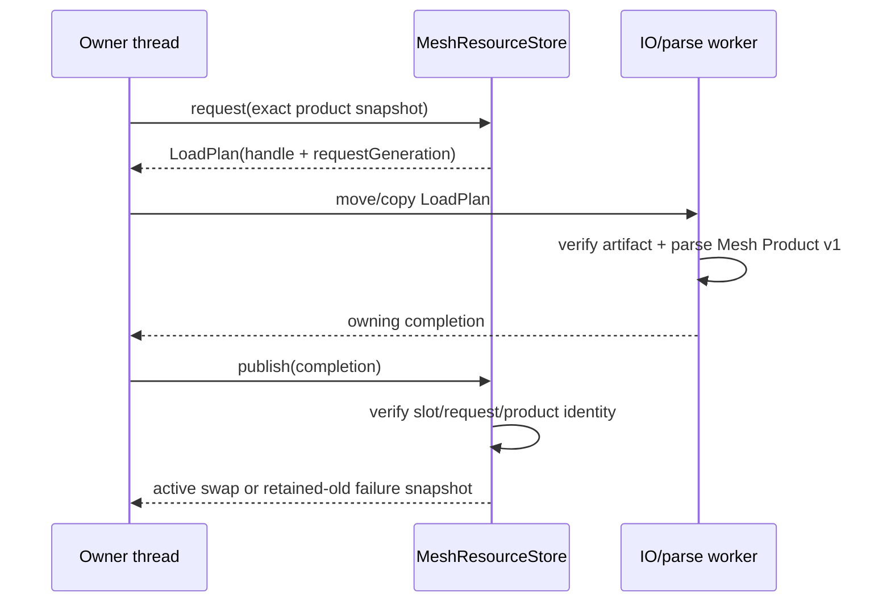

# Resource Runtime

状态：Current（#394）。本文件描述当前 `asharia::resource_runtime` 的真实合同；未来 ArtifactId、通用资源类型、GPU upload 与自动 reimport 均明确标为后继工作。

## 目的

`resource-runtime` 把已发布、已选中的 Mesh Product v1 artifact 转换为可安全借用的 typed CPU resource。它不读取 source `.glb`、`.ameta` 或 importer settings，也不创建 Vulkan buffer。

当前纵向链路为：

```text
AssetProductRecord
  -> asset-artifact：相对路径 + byte budget + exact size + V1 product hash
  -> mesh-product：bounded Mesh Product v1 parse
  -> MeshResourceLoadCompletion：worker-owned immutable completion
  -> MeshResourceStore::publish()：owner-thread generation check + active swap
  -> MeshResourceLease：shared ownership of immutable MeshProductV1
```

## 包边界

`asharia::resource_runtime` 公开依赖：

- `asharia::asset_core`：`AssetGuid`、`AssetTypeId`、`AssetProductKey` 与 manifest record；
- `asharia::asset_artifact`：runtime-safe artifact locator、bounded read、size/hash verification；
- `asharia::mesh_product`：runtime-safe Mesh Product v1 reader 与 immutable payload；
- `asharia::core`：`Result`/`Error`。

它禁止依赖 `asset-pipeline`、fastgltf、editor、RenderGraph、renderer、RHI 或 Vulkan。Importer 与 writer 仍在 tool side；GPU owner 属于后继 renderer-specific Slice。

## Artifact v1 兼容边界

`AssetArtifactLocatorV1` 从当前 `AssetProductRecord` 投影：

- `relativePath` 必须使用 `/`，且不能是绝对路径、drive path、空 segment、`.` 或 `..`；
- `expectedBytes` 在 IO 前接受 byte-budget 检查，读取后必须精确相等；
- `expectedHash` 使用当前 product manifest 的 64-bit FNV-1a v1 算法，读取后重新计算；
- diagnostics 只包含相对 product path，不转发底层绝对 artifact root。

这只是当前 manifest v1 的兼容验证，不把 64-bit FNV 声明为最终内容身份。未来 SHA-256 `ArtifactId`/immutable object store 必须独立版本化迁移，不能静默改变 v1 语义。

## Store、handle 与 request generation

`MeshResourceStore` 是 mesh-specific owner，不是通用模板 ResourceManager。

```text
MeshResourceHandle { slot, slotGeneration }
MeshResourceLoadTicket { handle, requestGeneration, expectedProductHash }
```

- `slotGeneration` 只在 unload 后 slot 复用时变化，拒绝 stale handle；
- `requestGeneration` 在 load/reload selection 变化时递增，拒绝迟到 completion；
- reload 不改变 stable handle；
- `activeRevision` 只在成功 publish 新 payload 时递增。

Store 内每个 slot 分离：

- `active`：当前可借用 revision、selection hash、product hash 和 `shared_ptr<const MeshProductV1>`；
- `candidate`：当前 ticket、selection hash 与期望 product hash；
- `lastFailure`：最近一次 selection/load/reload 失败，不替代 active payload。

## 请求与发布状态

`request()` 对 caller 给出的 exact `AssetProductKey` 在 immutable product-record snapshot 中选择：

- `LoadQueued`：创建 owning `MeshResourceLoadPlan`；
- `AlreadyPending`：同一 selection/hash 已在加载，不重复排队；
- `AlreadyReady`：同一 selection/hash 已 active；
- `FailedNoActive`：missing/stale/invalid selection 且没有 fallback；
- `KeptActiveAfterFailure`：selection 失败，但旧 active 仍可租借。

Missing/stale/invalid product 是资源状态，不是程序错误。Invalid key/type/handle、wrong owner thread、stale completion 或 completion identity drift 才返回 `unexpected(Error)`。

`loadMeshResourceCandidate(plan)` 可以在 worker 上执行，但只做文件读取、验证、解析和 immutable payload 创建。它绝不触碰 store。调用方把 completion 送回 owner thread 后调用 `publish()`：


```mermaid
sequenceDiagram
    participant O as Owner thread
    participant S as MeshResourceStore
    participant W as IO/parse worker

    O->>S: request(exact product snapshot)
    S-->>O: LoadPlan(handle + requestGeneration)
    O->>W: move/copy LoadPlan
    W->>W: verify artifact + parse Mesh Product v1
    W-->>O: owning completion
    O->>S: publish(completion)
    S->>S: verify slot/request/product identity
    S-->>O: active swap or retained-old failure snapshot
```

`MeshResourceStore` 记录创建线程，并拒绝其他线程的 `request()`、`publish()` 与 `unload()`。当前 store 不内置 thread pool、queue、mutex 或 callback dispatcher；host 负责调度与 safe point。

## Lease 与重载

`MeshResourceLease` 持有 immutable payload 的共享所有权，并冻结 handle、active revision 与 product hash：

- 成功 reload 只替换 store 的 active shared pointer；旧 lease 继续观察旧 revision；
- reload artifact read/parse 失败时，candidate 被清除，`lastFailure` 更新，旧 active 保持；
- `unload()` 释放 slot 所有权并递增 `slotGeneration`，但既有 lease 仍保持 payload；
- renderer 后继 Slice 可以把 lease/immutable upload packet 转成 backend-owned GPU revision，但 fence/deferred retirement 不属于本 package。

## 明确不做

- 通用 `ResourceStore<T>`、service locator 或全局 singleton；
- source import、product build/publication、watcher、debounce 或自动 hot reload；
- runtime dependency graph、streaming、eviction 或 budget policy；
- GPU upload、Vulkan handle、descriptor、pipeline 或 deferred GPU destruction；
- Scene View、ThumbnailService 或 Studio bridge。

## 验证

- `asharia-asset-artifact-tests`：invalid path、missing file、limit、size、hash、success 与 absolute-root redaction；
- `asharia-resource-runtime-smoke-tests`：invalid/wrong type、missing/stale/invalid selection、pending/ready dedup、stale completion、成功 reload、失败 reload 保留 active、unload/reuse、旧 lease 存活与 owner-thread mutation；
- `asharia-asset-processor --smoke-mesh-resource`：真实 restricted GLB → product/manifest → verified artifact → `MeshResourceStore` → lease，并验证 11 vertices、9 indices、3 submeshes、3 material slots 与 bounds。

完整门禁见 [`docs/workflow/review.md`](../../docs/workflow/review.md)，长期决策见 [`adr-mesh-resource-store-v1.md`](../../docs/architecture/adr-mesh-resource-store-v1.md)。
